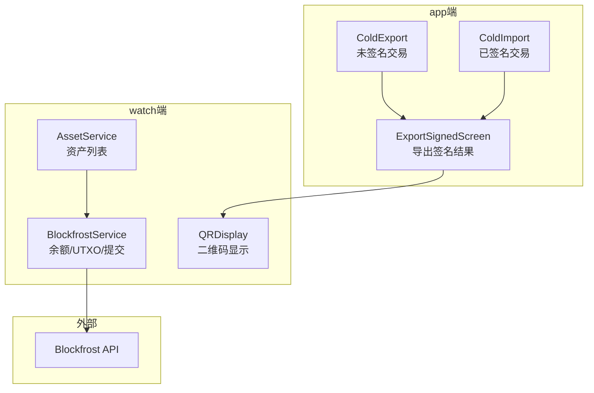
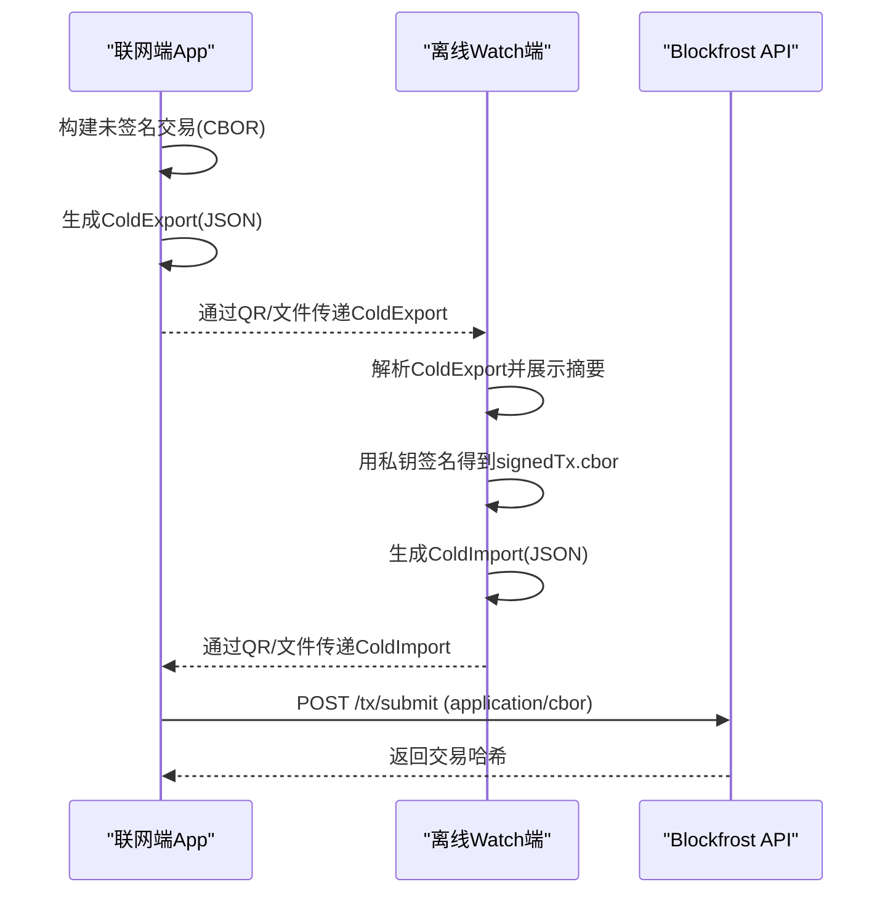
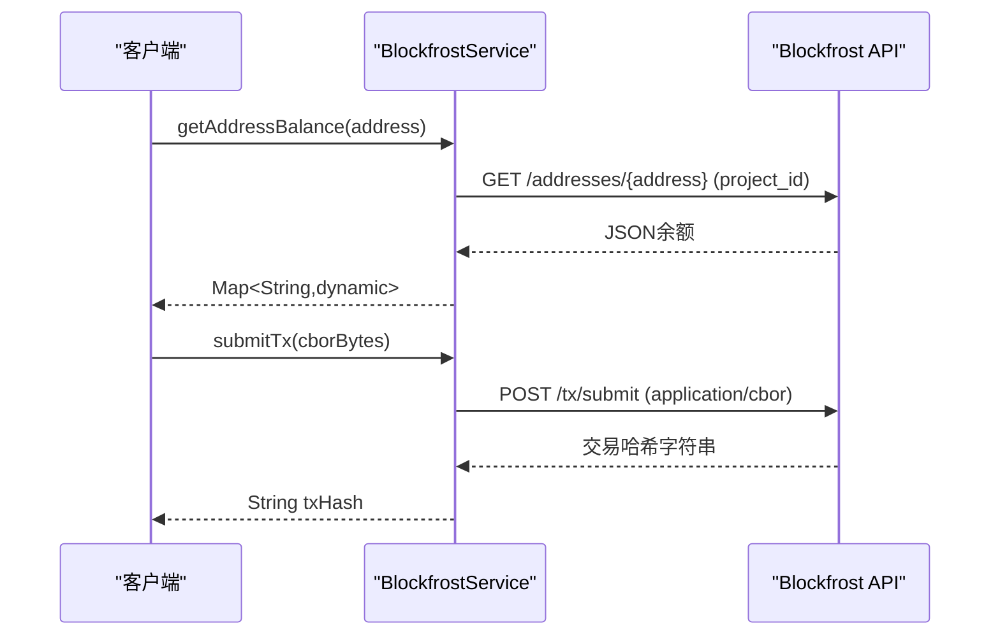
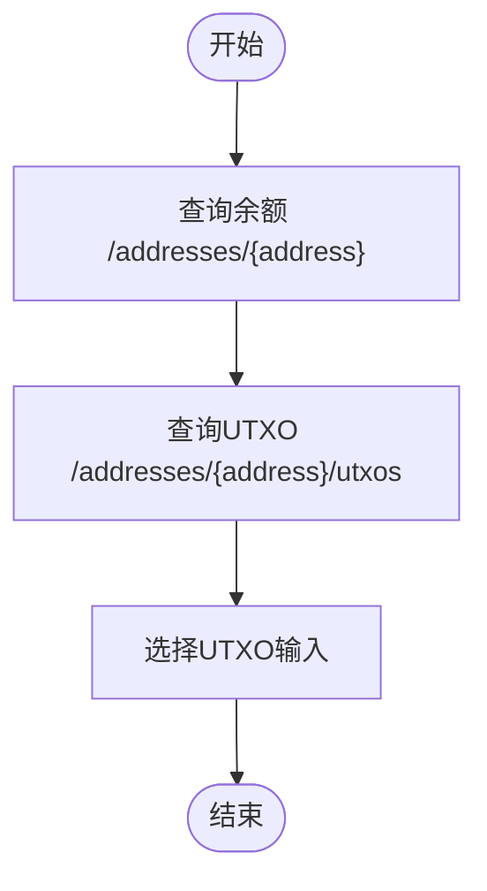
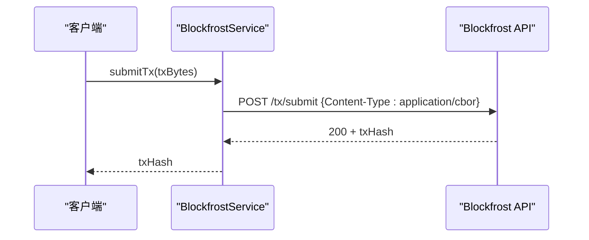
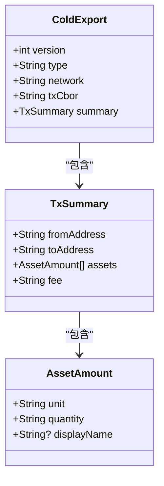
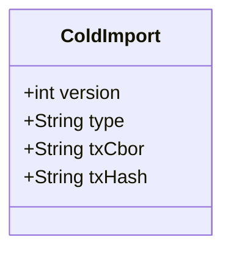
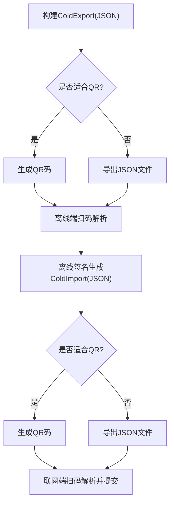
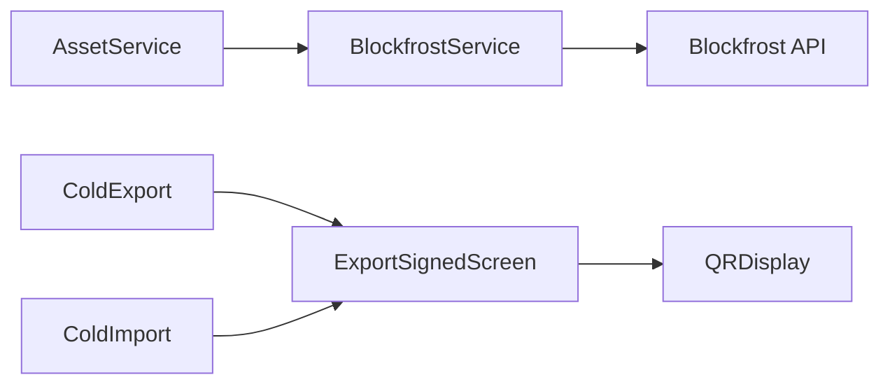

# API参考

<cite>
**本文引用的文件**
- [coldwallet-watch/lib/services/blockfrost_service.dart](file://coldwallet-watch/lib/services/blockfrost_service.dart)
- [coldwallet-app/lib/models/cold_export.dart](file://coldwallet-app/lib/models/cold_export.dart)
- [coldwallet-app/lib/models/cold_import.dart](file://coldwallet-app/lib/models/cold_import.dart)
- [coldwallet-app/lib/screens/export_signed_screen.dart](file://coldwallet-app/lib/screens/export_signed_screen.dart)
- [coldwallet-watch/lib/widgets/qr_display.dart](file://coldwallet-watch/lib/widgets/qr_display.dart)
- [coldwallet-watch/lib/services/asset_service.dart](file://coldwallet-watch/lib/services/asset_service.dart)
- [coldwallet-app/lib/models/README.md](file://coldwallet-app/lib/models/README.md)
- [cold-wallet-plugin.md](file://cold-wallet-plugin.md)
- [docs/superpowers/specs/2026-08-10-cold-wallet-design.md](file://docs/superpowers/specs/2026-08-10-cold-wallet-design.md)
- [docs/superpowers/plans/2026-08-11-cold-wallet-app.md](file://docs/superpowers/plans/2026-08-11-cold-wallet-app.md)
</cite>

## 目录
1. [简介](#简介)
2. [项目结构](#项目结构)
3. [核心组件](#核心组件)
4. [架构总览](#架构总览)
5. [详细组件分析](#详细组件分析)
6. [依赖关系分析](#依赖关系分析)
7. [性能考虑](#性能考虑)
8. [故障排查指南](#故障排查指南)
9. [结论](#结论)
10. [附录](#附录)

## 简介
本API参考文档面向ColdWallet项目的Blockfrost REST接口与冷钱包数据交换协议，覆盖以下能力：
- Blockfrost网络查询：地址余额、UTXO列表、最新区块、协议参数
- 交易提交：将已签名交易的CBOR字节流提交到链上
- 冷钱包数据格式：ColdExport（未签名交易）与ColdImport（已签名交易）的JSON规范、字段定义与校验规则
- QR码与文件导入导出：传输载体、容量限制与使用建议
- 认证方法、错误处理、速率限制与客户端集成最佳实践

## 项目结构
本项目包含两个Flutter应用与若干设计/计划文档：
- coldwallet-watch：提供Blockfrost服务封装、资产查询、二维码展示等能力
- coldwallet-app：实现冷钱包数据模型（ColdExport/ColdImport）、导出已签名交易界面等
- 设计/计划文档：描述冷钱包QR/文件传输流程与容量预估

图表来源
- [coldwallet-watch/lib/services/blockfrost_service.dart:1-109](file://coldwallet-watch/lib/services/blockfrost_service.dart#L1-L109)
- [coldwallet-watch/lib/services/asset_service.dart:1-48](file://coldwallet-watch/lib/services/asset_service.dart#L1-L48)
- [coldwallet-watch/lib/widgets/qr_display.dart:1-17](file://coldwallet-watch/lib/widgets/qr_display.dart#L1-L17)
- [coldwallet-app/lib/models/cold_export.dart:1-109](file://coldwallet-app/lib/models/cold_export.dart#L1-L109)
- [coldwallet-app/lib/models/cold_import.dart:1-36](file://coldwallet-app/lib/models/cold_import.dart#L1-L36)
- [coldwallet-app/lib/screens/export_signed_screen.dart:1-40](file://coldwallet-app/lib/screens/export_signed_screen.dart#L1-L40)

章节来源
- [coldwallet-watch/lib/services/blockfrost_service.dart:1-109](file://coldwallet-watch/lib/services/blockfrost_service.dart#L1-L109)
- [coldwallet-app/lib/models/README.md:1-26](file://coldwallet-app/lib/models/README.md#L1-L26)

## 核心组件
- BlockfrostService：封装Blockfrost v0 REST API，提供余额、UTXO、最新区块、协议参数与交易提交
- AssetService：基于BlockfrostService获取地址资产余额并生成显示名称
- ColdExport/ColdImport：冷钱包跨设备传输的JSON数据结构，分别表示未签名与已签名交易
- ExportSignedScreen：负责将ColdImport序列化为JSON并通过QR或剪贴板/文件方式导出
- QRDisplay：统一二维码渲染组件

章节来源
- [coldwallet-watch/lib/services/blockfrost_service.dart:17-108](file://coldwallet-watch/lib/services/blockfrost_service.dart#L17-L108)
- [coldwallet-watch/lib/services/asset_service.dart:1-48](file://coldwallet-watch/lib/services/asset_service.dart#L1-L48)
- [coldwallet-app/lib/models/cold_export.dart:1-109](file://coldwallet-app/lib/models/cold_export.dart#L1-L109)
- [coldwallet-app/lib/models/cold_import.dart:1-36](file://coldwallet-app/lib/models/cold_import.dart#L1-L36)
- [coldwallet-app/lib/screens/export_signed_screen.dart:1-40](file://coldwallet-app/lib/screens/export_signed_screen.dart#L1-L40)
- [coldwallet-watch/lib/widgets/qr_display.dart:1-17](file://coldwallet-watch/lib/widgets/qr_display.dart#L1-L17)

## 架构总览
下图展示了从联网端构建未签名交易、离线设备扫码签名、再回到联网端提交的完整流程。

图表来源
- [coldwallet-app/lib/models/cold_export.dart:1-39](file://coldwallet-app/lib/models/cold_export.dart#L1-L39)
- [coldwallet-app/lib/models/cold_import.dart:1-36](file://coldwallet-app/lib/models/cold_import.dart#L1-L36)
- [coldwallet-watch/lib/services/blockfrost_service.dart:92-108](file://coldwallet-watch/lib/services/blockfrost_service.dart#L92-L108)
- [docs/superpowers/specs/2026-08-10-cold-wallet-design.md:338-350](file://docs/superpowers/specs/2026-08-10-cold-wallet-design.md#L338-L350)

## 详细组件分析

### Blockfrost REST API
- 认证：请求头携带 project_id（API Key）
- 基础URL：根据网络选择 mainnet/preprod/preview
- 常用端点
  - GET /addresses/{address}：返回地址余额（含ADA与各原生代币）
  - GET /addresses/{address}/utxos：返回该地址所有UTXO
  - GET /blocks/latest：返回最新区块信息（可用于slot等）
  - GET /epochs/latest/parameters：返回当前协议参数（手续费系数、最小UTxO等）
  - POST /tx/submit：提交已签名交易的CBOR字节流，返回交易哈希

图表来源
- [coldwallet-watch/lib/services/blockfrost_service.dart:21-108](file://coldwallet-watch/lib/services/blockfrost_service.dart#L21-L108)

章节来源
- [coldwallet-watch/lib/services/blockfrost_service.dart:1-109](file://coldwallet-watch/lib/services/blockfrost_service.dart#L1-L109)

### 余额与UTXO查询
- 余额查询：调用 /addresses/{address}，返回包含lovelace与各unit的amount数组
- UTXO查询：调用 /addresses/{address}/utxos，返回UTXO列表
- 用途：用于交易构建时的输入选择与手续费估算

图表来源
- [coldwallet-watch/lib/services/blockfrost_service.dart:43-66](file://coldwallet-watch/lib/services/blockfrost_service.dart#L43-L66)

章节来源
- [coldwallet-watch/lib/services/blockfrost_service.dart:43-66](file://coldwallet-watch/lib/services/blockfrost_service.dart#L43-L66)

### 交易提交
- 输入：已签名交易的CBOR字节数组
- 内容类型：application/cbor
- 响应：交易哈希字符串
- 注意：需确保网络正确、交易有效且满足协议参数约束

图表来源
- [coldwallet-watch/lib/services/blockfrost_service.dart:92-108](file://coldwallet-watch/lib/services/blockfrost_service.dart#L92-L108)

章节来源
- [coldwallet-watch/lib/services/blockfrost_service.dart:92-108](file://coldwallet-watch/lib/services/blockfrost_service.dart#L92-L108)

### ColdExport（未签名交易）
- 用途：由联网端构建并传递给离线设备进行签名
- JSON结构要点
  - version: 整数，当前为1
  - type: 固定为 "unsigned-tx"
  - network: 网络标识（如 mainnet/preprod/preview）
  - txCbor: 未签名交易的CBOR编码字符串
  - summary: 交易摘要对象
    - fromAddress: 发送方地址
    - toAddress: 接收方地址
    - assets: 资产列表，每项包含 unit、quantity、可选 displayName
    - fee: 手续费（字符串）
- 校验规则
  - 必须存在且类型正确的version/type/network/txCbor/summary
  - summary中fromAddress/toAddress/assets/fee必须存在且类型正确
  - assets为数组，每项unit/quantity为字符串，displayName可选

图表来源
- [coldwallet-app/lib/models/cold_export.dart:1-109](file://coldwallet-app/lib/models/cold_export.dart#L1-L109)

章节来源
- [coldwallet-app/lib/models/cold_export.dart:1-109](file://coldwallet-app/lib/models/cold_export.dart#L1-L109)

### ColdImport（已签名交易）
- 用途：离线设备签名后导出给联网端直接提交
- JSON结构要点
  - version: 整数，当前为1
  - type: 固定为 "signed-tx"
  - txCbor: 已签名交易的CBOR编码字符串
  - txHash: 交易哈希字符串
- 校验规则
  - 必须存在且类型正确的version/type/txCbor/txHash

图表来源
- [coldwallet-app/lib/models/cold_import.dart:1-36](file://coldwallet-app/lib/models/cold_import.dart#L1-L36)

章节来源
- [coldwallet-app/lib/models/cold_import.dart:1-36](file://coldwallet-app/lib/models/cold_import.dart#L1-L36)

### QR码与文件导入导出协议
- 载体
  - QR码：适合小数据量（ColdExport/ColdImport JSON通常几百字节），单张QR可承载
  - 文件：当数据较大或不便扫描时，支持导出/导入JSON文件
- 容量与策略
  - 设计文档指出ColdExport/ColdImport JSON大小在数百字节级别，单QR可承载
  - 若超出QR容量，应提示改用复制/文件方式
- 流程
  - 联网端：ColdExport → JSON.stringify → QR/文件
  - 离线端：扫描QR/读取文件 → JSON.parse → ColdExport → 展示摘要 → 签名
  - 离线端：ColdImport → JSON.stringify → QR/文件
  - 联网端：扫描QR/读取文件 → JSON.parse → ColdImport → 提交

图表来源
- [docs/superpowers/specs/2026-08-10-cold-wallet-design.md:338-350](file://docs/superpowers/specs/2026-08-10-cold-wallet-design.md#L338-L350)
- [coldwallet-app/lib/screens/export_signed_screen.dart:1-40](file://coldwallet-app/lib/screens/export_signed_screen.dart#L1-L40)
- [coldwallet-watch/lib/widgets/qr_display.dart:1-17](file://coldwallet-watch/lib/widgets/qr_display.dart#L1-L17)

章节来源
- [docs/superpowers/specs/2026-08-10-cold-wallet-design.md:338-350](file://docs/superpowers/specs/2026-08-10-cold-wallet-design.md#L338-L350)
- [coldwallet-app/lib/screens/export_signed_screen.dart:1-40](file://coldwallet-app/lib/screens/export_signed_screen.dart#L1-L40)

### 资产查询与显示
- 通过Blockfrost获取地址余额，结合用户启用的资产配置，生成资产列表
- ADA单位特殊显示为“ADA”，其他原生代币按hex unit截断或查找显示名

章节来源
- [coldwallet-watch/lib/services/asset_service.dart:1-48](file://coldwallet-watch/lib/services/asset_service.dart#L1-L48)

## 依赖关系分析
- BlockfrostService依赖HTTP客户端与网络配置，对外暴露余额、UTXO、协议参数与提交接口
- AssetService依赖BlockfrostService与本地存储（启用资产列表）
- ColdExport/ColdImport作为跨设备传输的数据契约，被两端共同遵守
- ExportSignedScreen依赖ColdImport进行序列化与导出

图表来源
- [coldwallet-watch/lib/services/blockfrost_service.dart:17-108](file://coldwallet-watch/lib/services/blockfrost_service.dart#L17-L108)
- [coldwallet-watch/lib/services/asset_service.dart:1-48](file://coldwallet-watch/lib/services/asset_service.dart#L1-L48)
- [coldwallet-app/lib/models/cold_export.dart:1-39](file://coldwallet-app/lib/models/cold_export.dart#L1-L39)
- [coldwallet-app/lib/models/cold_import.dart:1-36](file://coldwallet-app/lib/models/cold_import.dart#L1-L36)
- [coldwallet-app/lib/screens/export_signed_screen.dart:1-40](file://coldwallet-app/lib/screens/export_signed_screen.dart#L1-L40)
- [coldwallet-watch/lib/widgets/qr_display.dart:1-17](file://coldwallet-watch/lib/widgets/qr_display.dart#L1-L17)

章节来源
- [coldwallet-watch/lib/services/blockfrost_service.dart:17-108](file://coldwallet-watch/lib/services/blockfrost_service.dart#L17-L108)
- [coldwallet-watch/lib/services/asset_service.dart:1-48](file://coldwallet-watch/lib/services/asset_service.dart#L1-L48)
- [coldwallet-app/lib/models/cold_export.dart:1-39](file://coldwallet-app/lib/models/cold_export.dart#L1-L39)
- [coldwallet-app/lib/models/cold_import.dart:1-36](file://coldwallet-app/lib/models/cold_import.dart#L1-L36)
- [coldwallet-app/lib/screens/export_signed_screen.dart:1-40](file://coldwallet-app/lib/screens/export_signed_screen.dart#L1-L40)
- [coldwallet-watch/lib/widgets/qr_display.dart:1-17](file://coldwallet-watch/lib/widgets/qr_display.dart#L1-L17)

## 性能考虑
- 网络请求
  - 合理缓存余额与UTXO，避免频繁重复查询
  - 对协议参数进行短期缓存，减少重复拉取
- 数据传输
  - 优先使用QR传输小体积JSON；超过容量时使用文件/剪贴板
  - 大交易场景可考虑分帧QR（后续迭代）
- 资源占用
  - 二维码渲染控制尺寸与背景色，避免过大UI开销
  - 文件读写使用临时目录，及时清理

[本节为通用指导，不直接分析具体文件]

## 故障排查指南
- 常见错误
  - 非200状态码：检查project_id是否正确、网络是否可达、请求路径是否匹配
  - 提交失败：确认txCbor为有效的已签名交易、网络与协议参数一致
  - QR无法解析：确认JSON格式与版本/类型字段正确
- 定位步骤
  - 打印请求URL与Headers，核对project_id与Content-Type
  - 捕获并记录服务端返回体，便于定位具体错误原因
  - 校验ColdExport/ColdImport字段完整性与类型

章节来源
- [coldwallet-watch/lib/services/blockfrost_service.dart:43-108](file://coldwallet-watch/lib/services/blockfrost_service.dart#L43-L108)
- [coldwallet-app/lib/screens/export_signed_screen.dart:1-40](file://coldwallet-app/lib/screens/export_signed_screen.dart#L1-L40)

## 结论
本参考文档总结了ColdWallet项目中Blockfrost REST接口的使用方法与冷钱包数据交换协议。通过统一的ColdExport/ColdImport格式与QR/文件传输机制，实现了安全的冷热分离签名流程。建议在集成时严格遵循字段校验、错误处理与容量策略，以获得稳定可靠的体验。

[本节为总结性内容，不直接分析具体文件]

## 附录

### Blockfrost API端点速查
- 认证：请求头 project_id
- 余额：GET /addresses/{address}
- UTXO：GET /addresses/{address}/utxos
- 最新区块：GET /blocks/latest
- 协议参数：GET /epochs/latest/parameters
- 提交交易：POST /tx/submit（Content-Type: application/cbor）

章节来源
- [coldwallet-watch/lib/services/blockfrost_service.dart:1-109](file://coldwallet-watch/lib/services/blockfrost_service.dart#L1-L109)

### 错误码说明
- HTTP 200：成功
- 其他状态码：视为错误，抛出异常并附带状态码与响应体
- 提交失败：检查交易有效性、网络与协议参数

章节来源
- [coldwallet-watch/lib/services/blockfrost_service.dart:43-108](file://coldwallet-watch/lib/services/blockfrost_service.dart#L43-L108)

### 速率限制与认证
- 认证：使用project_id作为API Key
- 速率限制：请遵循Blockfrost官方配额与限频策略（本项目代码未内置重试/退避逻辑）

章节来源
- [coldwallet-watch/lib/services/blockfrost_service.dart:21-41](file://coldwallet-watch/lib/services/blockfrost_service.dart#L21-L41)

### 客户端集成指南与最佳实践
- 初始化BlockfrostService时指定network与apiKey
- 先查询余额与UTXO，再进行交易构建
- 提交前校验txCbor与协议参数
- 使用QR/文件传输时，优先判断数据量是否适合QR
- 对网络错误进行重试与降级处理

章节来源
- [coldwallet-watch/lib/services/blockfrost_service.dart:21-108](file://coldwallet-watch/lib/services/blockfrost_service.dart#L21-L108)
- [docs/superpowers/specs/2026-08-10-cold-wallet-design.md:338-350](file://docs/superpowers/specs/2026-08-10-cold-wallet-design.md#L338-L350)

### 请求/响应示例（路径引用）
- 余额查询请求/响应：见BlockfrostService中对 /addresses/{address} 的调用与返回解析
- UTXO查询请求/响应：见BlockfrostService中对 /addresses/{address}/utxos 的调用与返回解析
- 交易提交请求/响应：见BlockfrostService中对 /tx/submit 的调用与返回解析

章节来源
- [coldwallet-watch/lib/services/blockfrost_service.dart:43-108](file://coldwallet-watch/lib/services/blockfrost_service.dart#L43-L108)

### 冷钱包数据格式规范（路径引用）
- ColdExport字段与校验：见models中的ColdExport/TxSummary/AssetAmount定义与fromJson/toJson
- ColdImport字段与校验：见models中的ColdImport定义与fromJson/toJson
- 编码流程与容量预估：见设计文档中的编码流程与容量说明

章节来源
- [coldwallet-app/lib/models/cold_export.dart:1-109](file://coldwallet-app/lib/models/cold_export.dart#L1-L109)
- [coldwallet-app/lib/models/cold_import.dart:1-36](file://coldwallet-app/lib/models/cold_import.dart#L1-L36)
- [docs/superpowers/specs/2026-08-10-cold-wallet-design.md:338-350](file://docs/superpowers/specs/2026-08-10-cold-wallet-design.md#L338-L350)

### QR码与文件导入导出（路径引用）
- QR容量与策略：见设计文档中的容量预估与编码流程
- 导出界面：见ExportSignedScreen中对ColdImport的序列化与QR/剪贴板/文件导出逻辑
- QR显示：见QRDisplay组件的统一渲染

章节来源
- [docs/superpowers/specs/2026-08-10-cold-wallet-design.md:338-350](file://docs/superpowers/specs/2026-08-10-cold-wallet-design.md#L338-L350)
- [coldwallet-app/lib/screens/export_signed_screen.dart:1-40](file://coldwallet-app/lib/screens/export_signed_screen.dart#L1-L40)
- [coldwallet-watch/lib/widgets/qr_display.dart:1-17](file://coldwallet-watch/lib/widgets/qr_display.dart#L1-L17)

### 相关背景与参考资料（路径引用）
- 冷钱包浏览器插件整体思路与安全模型：见项目想法文档
- Flutter端功能清单与开发进度：见计划文档

章节来源
- [cold-wallet-plugin.md:10-150](file://cold-wallet-plugin.md#L10-L150)
- [docs/superpowers/plans/2026-08-11-cold-wallet-app.md:2076-2763](file://docs/superpowers/plans/2026-08-11-cold-wallet-app.md#L2076-L2763)