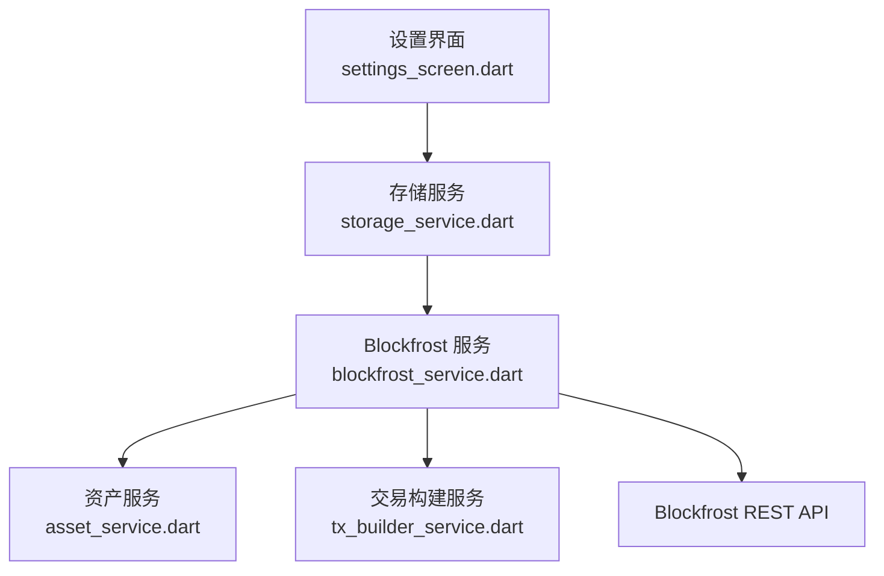
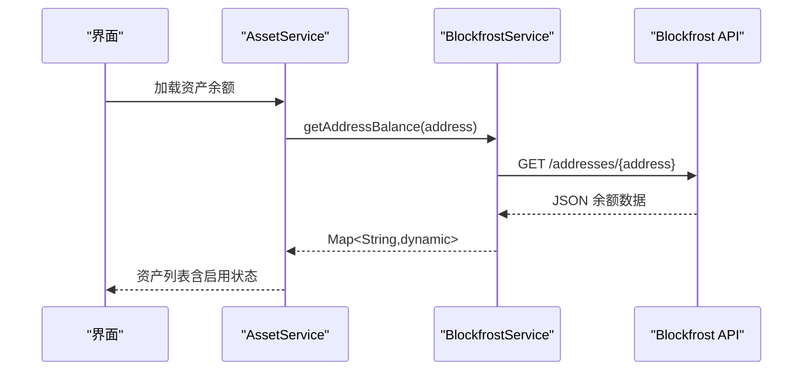
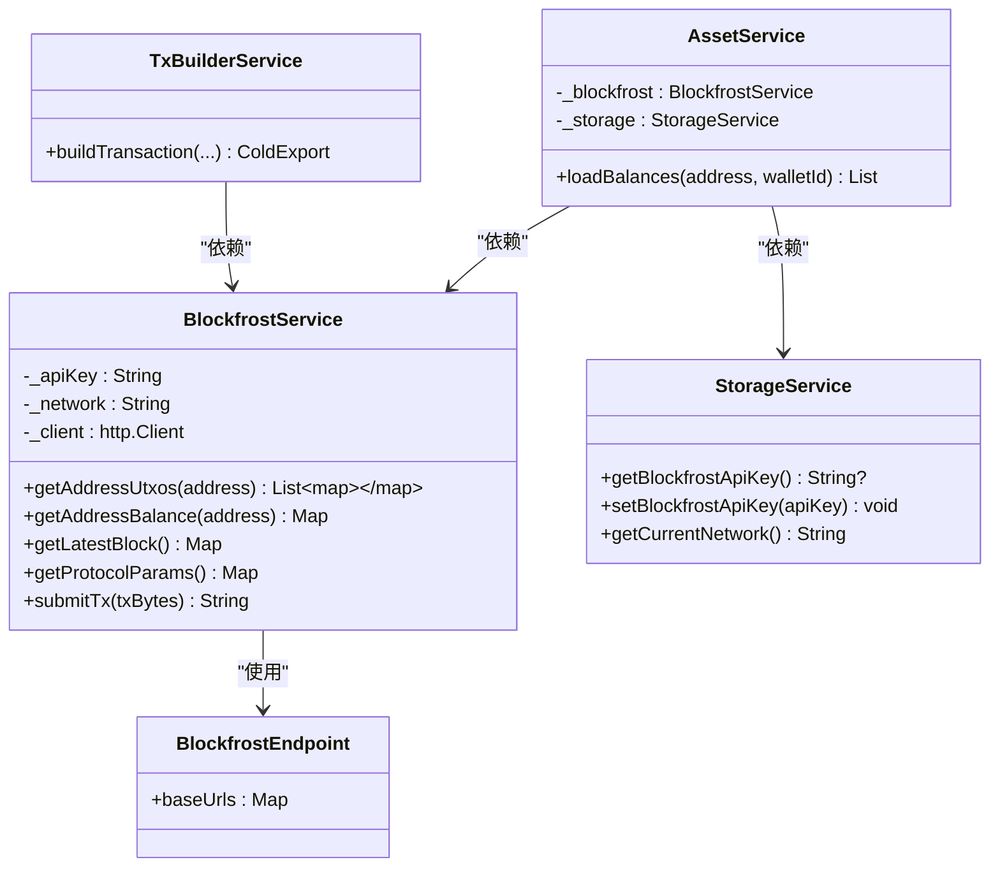

# Blockfrost REST API

<cite>
**本文引用的文件**
- [blockfrost_service.dart](file://coldwallet-watch/lib/services/blockfrost_service.dart)
- [asset_service.dart](file://coldwallet-watch/lib/services/asset_service.dart)
- [storage_service.dart](file://coldwallet-watch/lib/services/storage_service.dart)
- [settings_screen.dart](file://coldwallet-watch/lib/screens/settings_screen.dart)
- [tx_builder_service.dart](file://coldwallet-watch/lib/services/tx_builder_service.dart)
</cite>

## 目录
1. [简介](#简介)
2. [项目结构](#项目结构)
3. [核心组件](#核心组件)
4. [架构总览](#架构总览)
5. [详细端点文档](#详细端点文档)
6. [依赖关系分析](#依赖关系分析)
7. [性能与最佳实践](#性能与最佳实践)
8. [故障排查指南](#故障排查指南)
9. [结论](#结论)

## 简介
本文件基于代码库中的实现，整理并说明项目中对 Blockfrost REST API 的使用方式。覆盖的端点包括：地址 UTxO 查询、地址余额获取、最新区块信息、协议参数获取以及交易提交。文档包含每个端点的 HTTP 方法、URL 路径、请求头（project_id 认证）、请求参数与响应格式说明，并提供错误处理机制、网络环境差异（mainnet、preprod、preview）及速率限制与优化建议。

## 项目结构
本项目在冷钱包 Watch 应用中通过一个统一的 Blockfrost 服务封装所有链上数据访问。关键文件职责如下：
- BlockfrostService：封装 HTTP 调用，提供 UTxO、余额、最新区块、协议参数、交易提交等能力。
- AssetService：基于 BlockfrostService 获取资产余额并结合本地启用配置生成展示列表。
- StorageService：负责持久化 Blockfrost API Key 与用户偏好（如启用的资产）。
- SettingsScreen：提供 UI 入口让用户配置 Blockfrost Project ID。
- TxBuilderService：构建交易时读取协议参数与最小 UTxO 值，用于费用估算与交易构造。

图表来源
- [settings_screen.dart:1-89](file://coldwallet-watch/lib/screens/settings_screen.dart#L1-L89)
- [storage_service.dart:62-74](file://coldwallet-watch/lib/services/storage_service.dart#L62-L74)
- [blockfrost_service.dart:1-109](file://coldwallet-watch/lib/services/blockfrost_service.dart#L1-L109)
- [asset_service.dart:1-49](file://coldwallet-watch/lib/services/asset_service.dart#L1-L49)
- [tx_builder_service.dart:37-121](file://coldwallet-watch/lib/services/tx_builder_service.dart#L37-L121)

章节来源
- [blockfrost_service.dart:1-109](file://coldwallet-watch/lib/services/blockfrost_service.dart#L1-L109)
- [asset_service.dart:1-49](file://coldwallet-watch/lib/services/asset_service.dart#L1-L49)
- [storage_service.dart:1-87](file://coldwallet-watch/lib/services/storage_service.dart#L1-L87)
- [settings_screen.dart:1-89](file://coldwallet-watch/lib/screens/settings_screen.dart#L1-L89)
- [tx_builder_service.dart:37-121](file://coldwallet-watch/lib/services/tx_builder_service.dart#L37-L121)

## 核心组件
- BlockfrostEndpoint：集中定义三个网络的 Base URL（mainnet、preprod、preview），默认回退到 preview。
- BlockfrostService：统一封装 HTTP 客户端、请求头（project_id、Content-Type）与各端点调用；对非 200 状态码抛出异常。
- AssetService：聚合 Blockfrost 返回的 amount 列表，结合本地启用配置输出展示模型。
- StorageService：安全存储 Blockfrost API Key，提供当前网络固定为 preview 的能力。
- TxBuilderService：使用 Blockfrost 返回的协议参数与最小 UTxO 值进行费用迭代计算与交易体构建。

章节来源
- [blockfrost_service.dart:6-41](file://coldwallet-watch/lib/services/blockfrost_service.dart#L6-L41)
- [asset_service.dart:5-49](file://coldwallet-watch/lib/services/asset_service.dart#L5-L49)
- [storage_service.dart:54-74](file://coldwallet-watch/lib/services/storage_service.dart#L54-L74)
- [tx_builder_service.dart:37-121](file://coldwallet-watch/lib/services/tx_builder_service.dart#L37-L121)

## 架构总览
应用层通过 UI 触发操作，调用 Service 层完成业务逻辑，最终由 BlockfrostService 发起 HTTP 请求至 Blockfrost REST API。交易提交流程中，TxBuilderService 会先获取协议参数与最小 UTxO 值，再构造交易并序列化 CBOR 后提交。

图表来源
- [asset_service.dart:14-36](file://coldwallet-watch/lib/services/asset_service.dart#L14-L36)
- [blockfrost_service.dart:56-66](file://coldwallet-watch/lib/services/blockfrost_service.dart#L56-L66)

## 详细端点文档

### 通用配置
- 基础 URL：根据网络选择不同 Base URL（mainnet、preprod、preview），默认回退到 preview。
- 认证头：所有请求需携带 project_id 请求头，值为 Blockfrost Project ID。
- Content-Type：
  - 大多数 JSON 接口使用 application/json。
  - 交易提交接口使用 application/cbor，请求体为已签名交易的 CBOR 字节数组。

章节来源
- [blockfrost_service.dart:6-15](file://coldwallet-watch/lib/services/blockfrost_service.dart#L6-L15)
- [blockfrost_service.dart:34-41](file://coldwallet-watch/lib/services/blockfrost_service.dart#L34-L41)
- [blockfrost_service.dart:96-101](file://coldwallet-watch/lib/services/blockfrost_service.dart#L96-L101)

### 1) 查询地址的所有 UTxO
- 方法：GET
- 路径：/addresses/{address}/utxos
- 请求头：
  - project_id: <你的 Project ID>
  - Content-Type: application/json
- 路径参数：
  - address: Cardano 地址字符串
- 成功响应：JSON 数组，元素为 UTxO 对象（包含 tx_hash、output_index、amount 等字段）
- 失败处理：非 200 状态码抛出异常，包含状态码与响应体

章节来源
- [blockfrost_service.dart:43-54](file://coldwallet-watch/lib/services/blockfrost_service.dart#L43-L54)

### 2) 获取地址余额
- 方法：GET
- 路径：/addresses/{address}
- 请求头：
  - project_id: <你的 Project ID>
  - Content-Type: application/json
- 路径参数：
  - address: Cardano 地址字符串
- 成功响应：JSON 对象，包含 amount 数组（每项有 unit、quantity 等字段）
- 失败处理：非 200 状态码抛出异常

章节来源
- [blockfrost_service.dart:56-66](file://coldwallet-watch/lib/services/blockfrost_service.dart#L56-L66)
- [asset_service.dart:14-36](file://coldwallet-watch/lib/services/asset_service.dart#L14-L36)

### 3) 获取最新区块信息
- 方法：GET
- 路径：/blocks/latest
- 请求头：
  - project_id: <你的 Project ID>
  - Content-Type: application/json
- 成功响应：JSON 对象，包含区块高度、slot、哈希等信息（用于获取当前 slot）
- 失败处理：非 200 状态码抛出异常

章节来源
- [blockfrost_service.dart:68-78](file://coldwallet-watch/lib/services/blockfrost_service.dart#L68-L78)

### 4) 获取协议参数
- 方法：GET
- 路径：/epochs/latest/parameters
- 请求头：
  - project_id: <你的 Project ID>
  - Content-Type: application/json
- 成功响应：JSON 对象，包含手续费系数、最小 UTxO 值等参数（用于交易费用估算）
- 失败处理：非 200 状态码抛出异常

章节来源
- [blockfrost_service.dart:80-90](file://coldwallet-watch/lib/services/blockfrost_service.dart#L80-L90)
- [tx_builder_service.dart:37-121](file://coldwallet-watch/lib/services/tx_builder_service.dart#L37-L121)

### 5) 提交已签名交易
- 方法：POST
- 路径：/tx/submit
- 请求头：
  - project_id: <你的 Project ID>
  - Content-Type: application/cbor
- 请求体：已签名交易的 CBOR 字节数组
- 成功响应：JSON 字符串，表示交易哈希
- 失败处理：非 200 状态码抛出异常，包含状态码与响应体

章节来源
- [blockfrost_service.dart:92-107](file://coldwallet-watch/lib/services/blockfrost_service.dart#L92-L107)

## 依赖关系分析
- BlockfrostService 依赖 http.Client 发起网络请求，并通过 BlockfrostEndpoint 确定 Base URL。
- AssetService 依赖 BlockfrostService 获取余额，并依赖 StorageService 获取用户启用的资产列表。
- TxBuilderService 依赖 BlockfrostService 获取协议参数与最小 UTxO 值，用于交易费用估算与构造。
- SettingsScreen 提供 UI 让用户输入并保存 Blockfrost API Key，StorageService 负责安全存储。

图表来源
- [blockfrost_service.dart:6-41](file://coldwallet-watch/lib/services/blockfrost_service.dart#L6-L41)
- [asset_service.dart:5-12](file://coldwallet-watch/lib/services/asset_service.dart#L5-L12)
- [storage_service.dart:12-28](file://coldwallet-watch/lib/services/storage_service.dart#L12-L28)
- [tx_builder_service.dart:37-121](file://coldwallet-watch/lib/services/tx_builder_service.dart#L37-L121)

章节来源
- [blockfrost_service.dart:1-109](file://coldwallet-watch/lib/services/blockfrost_service.dart#L1-L109)
- [asset_service.dart:1-49](file://coldwallet-watch/lib/services/asset_service.dart#L1-L49)
- [storage_service.dart:1-87](file://coldwallet-watch/lib/services/storage_service.dart#L1-L87)
- [tx_builder_service.dart:37-121](file://coldwallet-watch/lib/services/tx_builder_service.dart#L37-L121)

## 性能与最佳实践
- 网络环境选择：
  - mainnet：生产网络，真实 ADA 与资产，谨慎使用。
  - preprod：预生产测试网，适合集成测试。
  - preview：预览测试网，当前应用固定使用该网络，便于快速验证。
- 请求头与认证：
  - 所有请求必须包含 project_id 请求头，确保在设置界面正确配置。
- 内容类型：
  - 交易提交使用 application/cbor，其他接口使用 application/json。
- 错误处理：
  - 非 200 状态码将抛出异常，上层应捕获并提示用户或重试。
- 费用估算：
  - 使用协议参数与最小 UTxO 值进行迭代计算，避免重复提交导致额外费用。
- 缓存与复用：
  - 可考虑缓存协议参数与最新区块信息以减少频繁请求。
- 速率限制：
  - 遵循 Blockfrost 官方速率限制策略，避免短时间内高频请求。
- 超时与重试：
  - 建议在客户端增加合理的超时与重试机制，提升稳定性。

章节来源
- [blockfrost_service.dart:6-15](file://coldwallet-watch/lib/services/blockfrost_service.dart#L6-L15)
- [blockfrost_service.dart:34-41](file://coldwallet-watch/lib/services/blockfrost_service.dart#L34-L41)
- [blockfrost_service.dart:92-107](file://coldwallet-watch/lib/services/blockfrost_service.dart#L92-L107)
- [tx_builder_service.dart:37-121](file://coldwallet-watch/lib/services/tx_builder_service.dart#L37-L121)
- [settings_screen.dart:60-83](file://coldwallet-watch/lib/screens/settings_screen.dart#L60-L83)

## 故障排查指南
- 未配置 API Key：
  - 现象：无法发起请求或返回认证错误。
  - 解决：在设置界面输入并保存 Blockfrost Project ID。
- 网络错误：
  - 现象：HTTP 状态码非 200。
  - 解决：检查网络连接、API Key 有效性、目标网络是否可达。
- 余额不足：
  - 现象：交易构建阶段抛出余额不足异常。
  - 解决：确认 UTxO 足够覆盖转账金额、手续费与最小 UTxO 值。
- 协议参数缺失：
  - 现象：费用估算失败。
  - 解决：确保成功获取 epochs/latest/parameters 并解析最小 UTxO 值。

章节来源
- [settings_screen.dart:27-45](file://coldwallet-watch/lib/screens/settings_screen.dart#L27-L45)
- [blockfrost_service.dart:43-107](file://coldwallet-watch/lib/services/blockfrost_service.dart#L43-L107)
- [tx_builder_service.dart:37-121](file://coldwallet-watch/lib/services/tx_builder_service.dart#L37-L121)

## 结论
本项目通过 BlockfrostService 统一封装了对 Blockfrost REST API 的调用，覆盖了地址 UTxO、余额、最新区块、协议参数与交易提交等核心功能。配合 AssetService 与 TxBuilderService，实现了从数据查询到交易构建与提交的完整链路。建议在后续迭代中增强超时与重试机制、引入参数缓存，并严格遵循 Blockfrost 的速率限制策略以提升系统稳定性与性能。