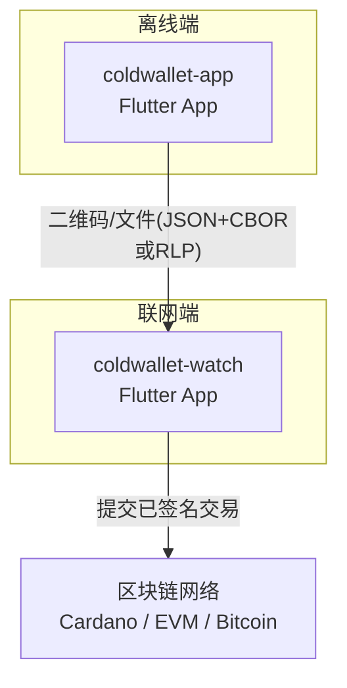
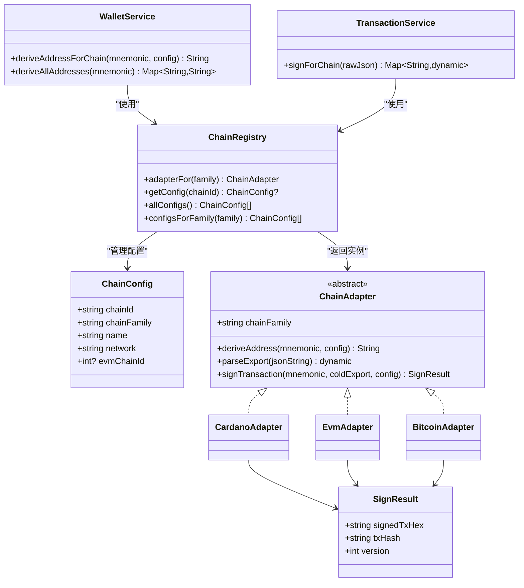
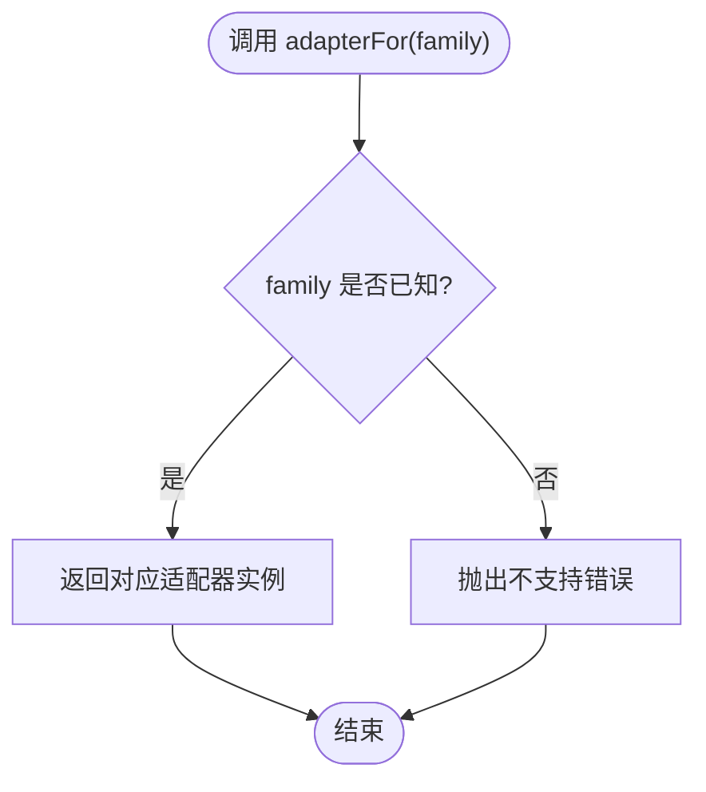
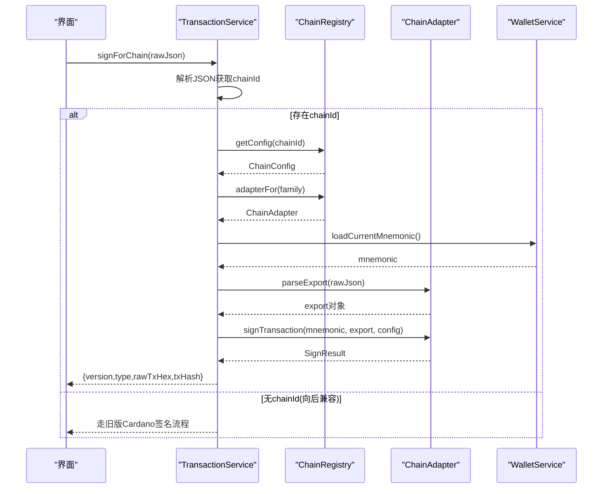
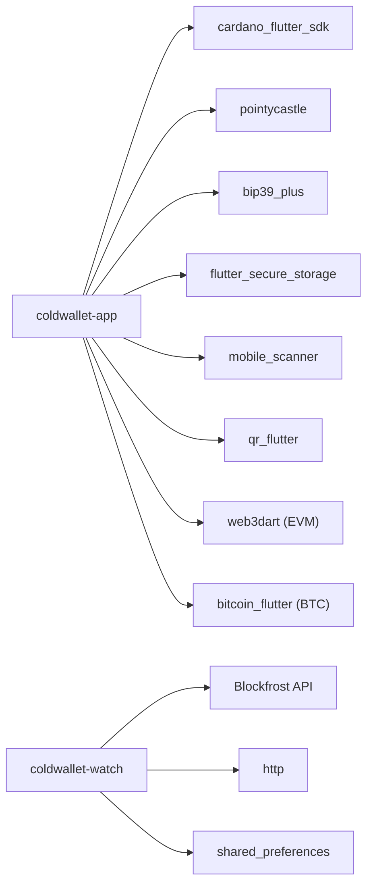

# 冷钱包协议扩展

<cite>
**本文引用的文件**
- [cold-wallet-plugin.md](file://cold-wallet-plugin.md)
- [AGENTS.md](file://AGENTS.md)
- [coldwallet-app/README.md](file://coldwallet-app/README.md)
- [coldwallet-watch/README.md](file://coldwallet-watch/README.md)
- [2026-08-14-multi-chain-cold-wallet-design.md](file://docs/superpowers/specs/2026-08-14-multi-chain-cold-wallet-design.md)
- [2026-08-10-cold-wallet-design.md](file://docs/superpowers/specs/2026-08-10-cold-wallet-design.md)
- [coldwallet-app/lib/main.dart](file://coldwallet-app/lib/main.dart)
- [coldwallet-watch/lib/main.dart](file://coldwallet-watch/lib/main.dart)
</cite>

## 目录
1. [简介](#简介)
2. [项目结构](#项目结构)
3. [核心组件](#核心组件)
4. [架构总览](#架构总览)
5. [详细组件分析](#详细组件分析)
6. [依赖关系分析](#依赖关系分析)
7. [性能与可扩展性](#性能与可扩展性)
8. [故障排查指南](#故障排查指南)
9. [结论](#结论)
10. [附录](#附录)

## 简介
本项目为多链冷钱包系统，包含离线签名端（coldwallet-app）与联网观察端（coldwallet-watch）。两端通过 JSON 格式交换数据：Cardano 使用 ColdExport/ColdImport，EVM 使用 EthColdExport/EthColdImport。传输通道支持二维码与文件导出/导入。设计目标是在保持私钥与助记词仅存在于离线设备的前提下，完成多链交易构建、离线签名与链上提交。

## 项目结构
- coldwallet-app：离线冷钱包 Flutter 应用，负责助记词管理、多链地址派生、扫码签名、交易文件导入导出。
- coldwallet-watch：联网观察钱包 Flutter 应用，负责余额查询、未签名交易构建、已签名交易导入与提交。
- docs/superpowers：设计规格与开发计划，包含 Cardano 冷钱包设计与多链扩展设计。
- AGENTS.md：项目约定、验证命令、依赖管理与关键约定。

图表来源
- [coldwallet-app/README.md:1-76](file://coldwallet-app/README.md#L1-L76)
- [coldwallet-watch/README.md:1-82](file://coldwallet-watch/README.md#L1-L82)

章节来源
- [AGENTS.md:1-82](file://AGENTS.md#L1-L82)
- [coldwallet-app/README.md:1-76](file://coldwallet-app/README.md#L1-L76)
- [coldwallet-watch/README.md:1-82](file://coldwallet-watch/README.md#L1-L82)

## 核心组件
- 链注册中心 ChainRegistry：集中管理支持的链配置与适配器实例查找。
- 链适配器 ChainAdapter：抽象接口，封装各链族（Cardano/EVM/Bitcoin）的地址派生、交易解析与离线签名逻辑。
- 服务层 WalletService/TransactionService：提供统一的多链入口，向后兼容现有 Cardano 方法。
- UI 路由：App 根组件定义首页、钱包设置、扫码签名等路由。

章节来源
- [2026-08-14-multi-chain-cold-wallet-design.md:41-101](file://docs/superpowers/specs/2026-08-14-multi-chain-cold-wallet-design.md#L41-L101)
- [2026-08-14-multi-chain-cold-wallet-design.md:160-244](file://docs/superpowers/specs/2026-08-14-multi-chain-cold-wallet-design.md#L160-L244)
- [2026-08-14-multi-chain-cold-wallet-design.md:412-491](file://docs/superpowers/specs/2026-08-14-multi-chain-cold-wallet-design.md#L412-L491)
- [coldwallet-app/lib/main.dart:12-52](file://coldwallet-app/lib/main.dart#L12-L52)

## 架构总览
整体采用“链适配器模式”：UI 层通过 ChainRegistry 获取对应链的 ChainAdapter，由适配器完成链特定的地址派生与签名；服务层提供统一入口并自动路由到具体适配器。

图表来源
- [2026-08-14-multi-chain-cold-wallet-design.md:65-101](file://docs/superpowers/specs/2026-08-14-multi-chain-cold-wallet-design.md#L65-L101)
- [2026-08-14-multi-chain-cold-wallet-design.md:103-158](file://docs/superpowers/specs/2026-08-14-multi-chain-cold-wallet-design.md#L103-L158)
- [2026-08-14-multi-chain-cold-wallet-design.md:160-244](file://docs/superpowers/specs/2026-08-14-multi-chain-cold-wallet-design.md#L160-L244)
- [2026-08-14-multi-chain-cold-wallet-design.md:412-491](file://docs/superpowers/specs/2026-08-14-multi-chain-cold-wallet-design.md#L412-L491)

## 详细组件分析

### 链注册中心与适配器
- ChainRegistry 维护静态链配置表，按 chainFamily 返回对应适配器实例，并提供链配置的查询能力。
- ChainAdapter 抽象了 deriveAddress、parseExport、signTransaction 三个核心方法，确保不同链族实现的一致性。
- 新增链只需添加 ChainConfig 并在 Registry 中注册，无需改动上层调用。

图表来源
- [2026-08-14-multi-chain-cold-wallet-design.md:160-244](file://docs/superpowers/specs/2026-08-14-multi-chain-cold-wallet-design.md#L160-L244)

章节来源
- [2026-08-14-multi-chain-cold-wallet-design.md:160-244](file://docs/superpowers/specs/2026-08-14-multi-chain-cold-wallet-design.md#L160-L244)

### Cardano 适配器
- 地址派生：基于 cardano_flutter_sdk，遵循 CIP-1852 路径 m/1852'/1815'/0'/0/0。
- 交易签名：反序列化 CBOR → Ed25519 见证签名 → blake2b_256 计算哈希。
- 协议解析：复用现有 ColdExport.fromJson。

章节来源
- [2026-08-14-multi-chain-cold-wallet-design.md:249-256](file://docs/superpowers/specs/2026-08-14-multi-chain-cold-wallet-design.md#L249-L256)
- [coldwallet-app/README.md:68-76](file://coldwallet-app/README.md#L68-L76)

### EVM 适配器
- 地址派生：BIP-39 → seed → BIP-32 路径 m/44'/60'/0'/0/0 派生 secp256k1 私钥 → keccak256 取后 20 字节 → 0x 前缀。
- 交易签名：RLP 解码 rawTxHex → secp256k1 + EIP-155 chainId 签名 → keccak256 计算 txHash → RLP 编码已签名交易。
- 协议解析：EthColdExport.fromJson。

章节来源
- [2026-08-14-multi-chain-cold-wallet-design.md:257-271](file://docs/superpowers/specs/2026-08-14-multi-chain-cold-wallet-design.md#L257-L271)
- [2026-08-14-multi-chain-cold-wallet-design.md:287-340](file://docs/superpowers/specs/2026-08-14-multi-chain-cold-wallet-design.md#L287-L340)

### Bitcoin 适配器
- 地址派生：根据配置选择 Legacy/SegWit/Taproot 路径与编码格式。
- 交易签名：解析未签名交易 → 依据地址类型选择签名方式 → ECDSA 签名 → double SHA-256 计算 txHash。
- 协议解析：BtcColdExport.fromJson。

章节来源
- [2026-08-14-multi-chain-cold-wallet-design.md:272-284](file://docs/superpowers/specs/2026-08-14-multi-chain-cold-wallet-design.md#L272-L284)
- [2026-08-14-multi-chain-cold-wallet-design.md:341-411](file://docs/superpowers/specs/2026-08-14-multi-chain-cold-wallet-design.md#L341-L411)

### 服务层统一入口
- WalletService：新增 deriveAddressForChain 与 deriveAllAddresses，保留原有 Cardano 方法以向后兼容。
- TransactionService：新增 signForChain，自动识别 chainId 并路由至对应适配器；无 chainId 时回退到旧版 Cardano 流程。

图表来源
- [2026-08-14-multi-chain-cold-wallet-design.md:446-491](file://docs/superpowers/specs/2026-08-14-multi-chain-cold-wallet-design.md#L446-L491)

章节来源
- [2026-08-14-multi-chain-cold-wallet-design.md:412-491](file://docs/superpowers/specs/2026-08-14-multi-chain-cold-wallet-design.md#L412-L491)

### 通信协议
- Cardano：ColdExport（unsigned-tx）/ ColdImport（signed-tx），外层 JSON 包装 CBOR hex。
- EVM：EthColdExport/EthColdImport，rawTxHex 为 RLP 编码的交易体，摘要字段包含 from/to/value/fee/nonce。
- Bitcoin：BtcColdExport/BtcColdImport，addressType 区分地址格式，summary 包含 inputs/outputs/fee。

章节来源
- [2026-08-10-cold-wallet-design.md:299-346](file://docs/superpowers/specs/2026-08-10-cold-wallet-design.md#L299-L346)
- [2026-08-14-multi-chain-cold-wallet-design.md:287-411](file://docs/superpowers/specs/2026-08-14-multi-chain-cold-wallet-design.md#L287-L411)

### App 路由与页面
- coldwallet-app：根组件定义首页、钱包设置、扫码签名路由。
- coldwallet-watch：入口启动应用，配合屏幕层完成发送、导出、导入与提交流程。

章节来源
- [coldwallet-app/lib/main.dart:12-52](file://coldwallet-app/lib/main.dart#L12-L52)
- [coldwallet-watch/lib/main.dart:1-12](file://coldwallet-watch/lib/main.dart#L1-L12)

## 依赖关系分析
- 离线端依赖：cardano_flutter_sdk、pointycastle、bip39_plus、flutter_secure_storage、mobile_scanner、qr_flutter。
- 联网端依赖：Blockfrost API、http、shared_preferences、intl。
- 多链扩展依赖：web3dart（EVM）、bitcoin_flutter（Bitcoin）。

图表来源
- [coldwallet-app/README.md:68-76](file://coldwallet-app/README.md#L68-L76)
- [coldwallet-watch/README.md:73-82](file://coldwallet-watch/README.md#L73-L82)
- [2026-08-14-multi-chain-cold-wallet-design.md:531-556](file://docs/superpowers/specs/2026-08-14-multi-chain-cold-wallet-design.md#L531-L556)

章节来源
- [coldwallet-app/README.md:68-76](file://coldwallet-app/README.md#L68-L76)
- [coldwallet-watch/README.md:73-82](file://coldwallet-watch/README.md#L73-L82)
- [2026-08-14-multi-chain-cold-wallet-design.md:531-556](file://docs/superpowers/specs/2026-08-14-multi-chain-cold-wallet-design.md#L531-L556)

## 性能与可扩展性
- 性能要点
  - 二维码容量限制：小交易适合 QR，大交易考虑分帧或文件传输。
  - 哈希与签名：Ed25519、secp256k1、keccak256、blake2b_256 的计算在移动端可接受，注意避免阻塞主线程。
  - UTXO 选择与手续费估算：在联网端进行，减少离线端负担。
- 可扩展性
  - 新增链仅需添加 ChainConfig 与适配器实现，并通过 Registry 注册。
  - 协议模型扩展：为每条链族定义独立的 Export/Import 模型，保持解耦。

[本节为通用指导，不直接分析具体文件]

## 故障排查指南
- 常见错误
  - 不支持的链族：检查 ChainRegistry 是否包含该 family 的适配器映射。
  - 不支持的链：确认 chainId 是否在 _configs 中定义。
  - 当前钱包未初始化：signForChain 需要加载助记词，若为空将抛出异常。
  - 交易格式不匹配：ScanTxScreen 需正确识别 chainId 或兼容旧版 Cardano JSON。
- 建议步骤
  - 运行 flutter analyze 与 flutter test 确保代码质量。
  - 构建 Debug APK 验证端到端流程。
  - 核对协议字段版本与必填项。

章节来源
- [2026-08-14-multi-chain-cold-wallet-design.md:460-491](file://docs/superpowers/specs/2026-08-14-multi-chain-cold-wallet-design.md#L460-L491)
- [AGENTS.md:44-62](file://AGENTS.md#L44-L62)

## 结论
本方案通过链适配器模式与统一的注册中心，实现了冷钱包从单链向多链的平滑扩展。服务层提供向后兼容的统一入口，UI 层按链族展示交易摘要，协议层为每条链族定义独立的数据模型。实施分阶段推进，优先完成架构基础与 EVM 支持，再逐步加入 Bitcoin 与协议文档完善。

[本节为总结性内容，不直接分析具体文件]

## 附录
- 安全模型
  - 私钥与助记词仅在离线端出现，永不触网。
  - 联网端只读登录，仅处理公钥地址与交易数据。
- 交易数据流（Cardano 示例）
  - dApp/插件生成未签名交易 → 导出二维码/文件 → 离线端扫码/导入 → 用户确认并签名 → 输出已签名交易 → 联网端读取并提交。

章节来源
- [cold-wallet-plugin.md:10-80](file://cold-wallet-plugin.md#L10-L80)
- [cold-wallet-plugin.md:127-150](file://cold-wallet-plugin.md#L127-L150)