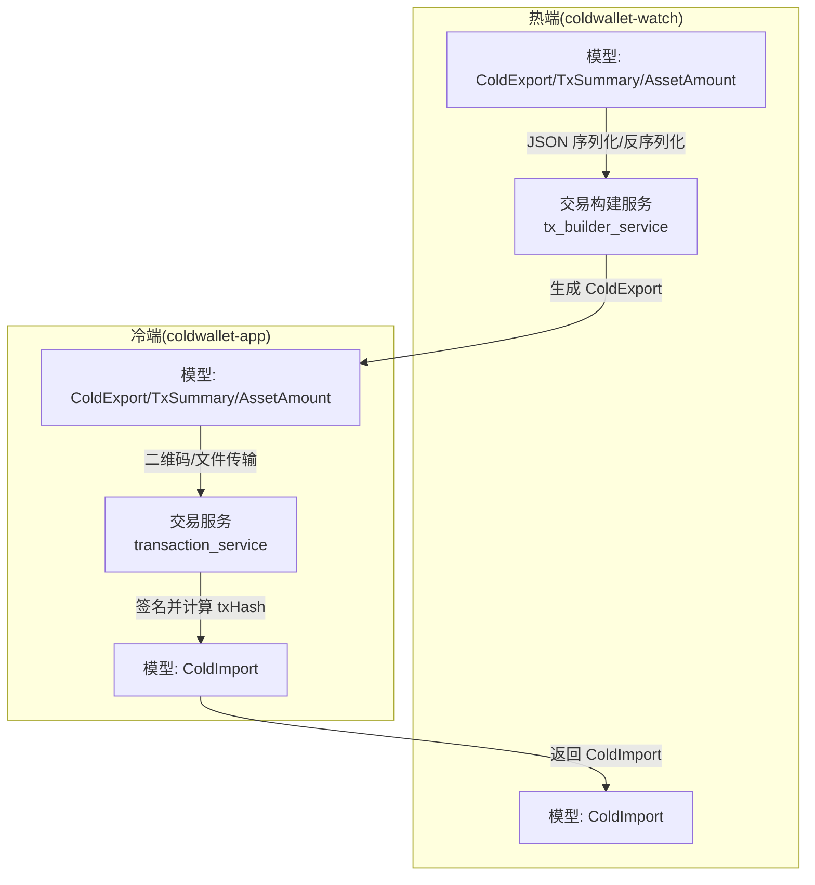
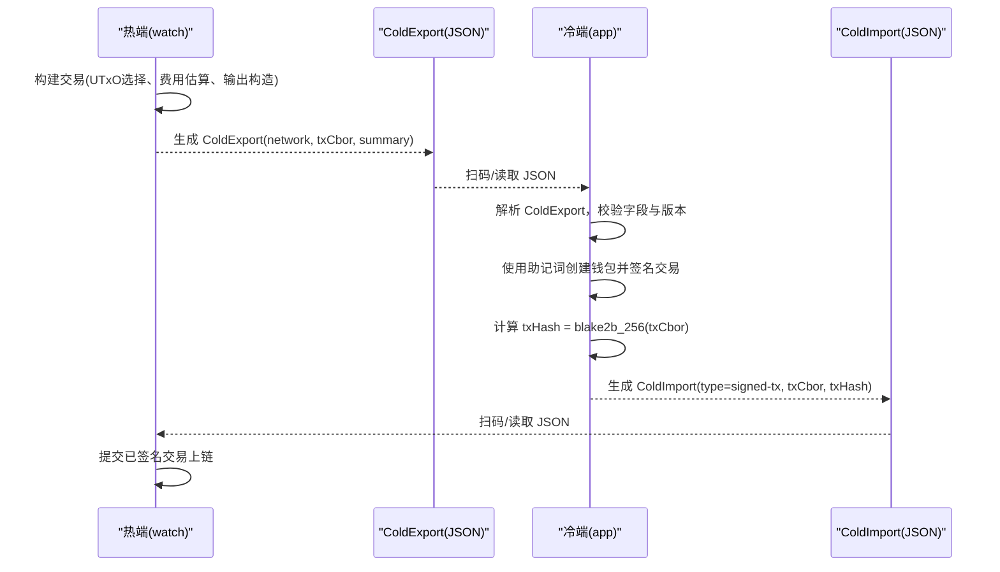
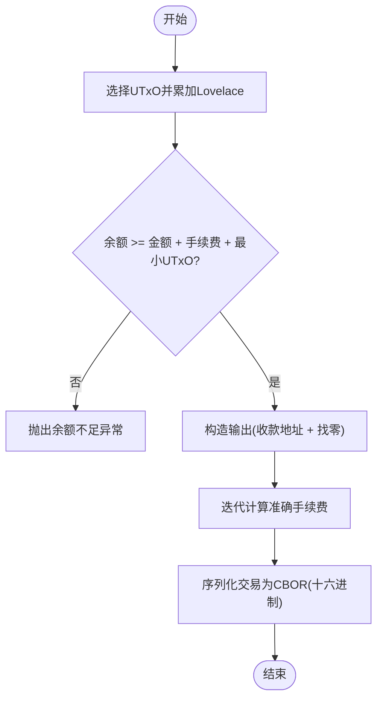
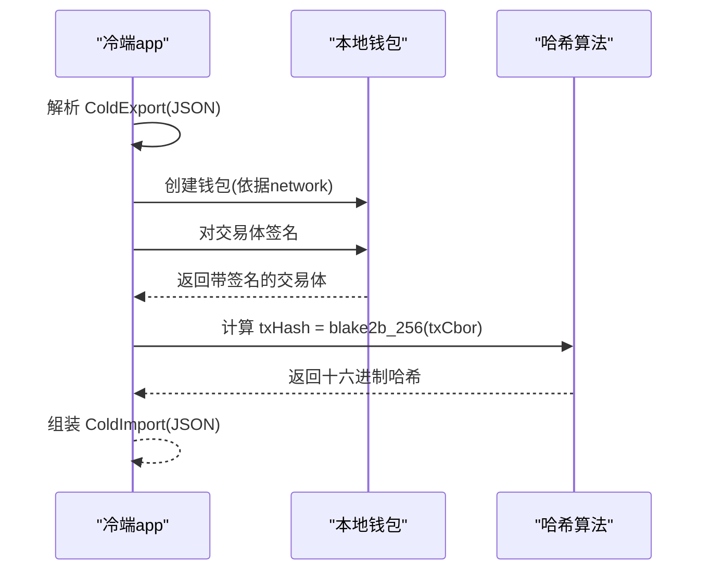
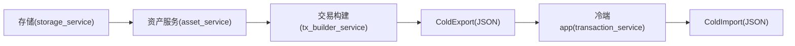

# 数据交换格式

<cite>
**本文引用的文件**
- [coldwallet-app/lib/models/cold_export.dart](file://coldwallet-app/lib/models/cold_export.dart)
- [coldwallet-app/lib/models/cold_import.dart](file://coldwallet-app/lib/models/cold_import.dart)
- [coldwallet-watch/lib/models/cold_export.dart](file://coldwallet-watch/lib/models/cold_export.dart)
- [coldwallet-watch/lib/models/cold_import.dart](file://coldwallet-watch/lib/models/cold_import.dart)
- [coldwallet-app/lib/services/transaction_service.dart](file://coldwallet-app/lib/services/transaction_service.dart)
- [coldwallet-watch/lib/services/tx_builder_service.dart](file://coldwallet-watch/lib/services/tx_builder_service.dart)
- [coldwallet-watch/lib/services/wallet_service.dart](file://coldwallet-watch/lib/services/wallet_service.dart)
- [coldwallet-watch/lib/services/storage_service.dart](file://coldwallet-watch/lib/services/storage_service.dart)
- [docs/superpowers/plans/2026-08-11-cold-wallet-app.md](file://docs/superpowers/plans/2026-08-11-cold-wallet-app.md)
</cite>

## 目录
1. [简介](#简介)
2. [项目结构](#项目结构)
3. [核心组件](#核心组件)
4. [架构总览](#架构总览)
5. [详细组件分析](#详细组件分析)
6. [依赖关系分析](#依赖关系分析)
7. [性能考虑](#性能考虑)
8. [故障排查指南](#故障排查指南)
9. [结论](#结论)
10. [附录：数据结构与示例](#附录：数据结构与示例)

## 简介
本规范定义 ColdWallet 在“热端（联网）”与“冷端（离线）”之间进行数据交换的两种标准格式：
- ColdExport：未签名交易导出格式，用于从热端传递到冷端进行离线签名。
- ColdImport：已签名交易导入格式，用于从冷端返回给热端以提交上链。

文档涵盖 JSON 字段类型、必填字段、验证规则、业务约束、CBOR 编码的交易数据、字节数组处理与序列化规则、数据完整性校验、版本兼容性与向后兼容策略，以及迁移指南和错误处理方案。

## 项目结构
ColdWallet 包含两个 Flutter 应用：
- coldwallet-app：冷端应用，负责解析 ColdExport、离线签名并生成 ColdImport。
- coldwallet-watch：热端应用，负责构建交易、生成 ColdExport，并导入 ColdImport 提交上链。

图表来源
- [coldwallet-watch/lib/services/tx_builder_service.dart:37-151](file://coldwallet-watch/lib/services/tx_builder_service.dart#L37-L151)
- [coldwallet-watch/lib/models/cold_export.dart:1-110](file://coldwallet-watch/lib/models/cold_export.dart#L1-L110)
- [coldwallet-watch/lib/models/cold_import.dart:1-36](file://coldwallet-watch/lib/models/cold_import.dart#L1-L36)
- [coldwallet-app/lib/services/transaction_service.dart:1-70](file://coldwallet-app/lib/services/transaction_service.dart#L1-L70)
- [coldwallet-app/lib/models/cold_export.dart:1-109](file://coldwallet-app/lib/models/cold_export.dart#L1-L109)
- [coldwallet-app/lib/models/cold_import.dart:1-36](file://coldwallet-app/lib/models/cold_import.dart#L1-L36)

章节来源
- [coldwallet-watch/lib/models/cold_export.dart:1-110](file://coldwallet-watch/lib/models/cold_export.dart#L1-L110)
- [coldwallet-watch/lib/models/cold_import.dart:1-36](file://coldwallet-watch/lib/models/cold_import.dart#L1-L36)
- [coldwallet-app/lib/models/cold_export.dart:1-109](file://coldwallet-app/lib/models/cold_export.dart#L1-L109)
- [coldwallet-app/lib/models/cold_import.dart:1-36](file://coldwallet-app/lib/models/cold_import.dart#L1-L36)

## 核心组件
- ColdExport（未签名交易导出）
  - 字段
    - version: int，当前固定为 1
    - type: String，固定为 "unsigned-tx"
    - network: String，网络标识，如 "mainnet" 或测试网（例如 "preview"）
    - txCbor: String，十六进制编码的 Cardano 交易体 CBOR
    - summary: TxSummary，交易摘要，供用户确认
      - fromAddress: String，发送方地址（Bech32）
      - toAddress: String，接收方地址（Bech32）
      - assets: List<AssetAmount>，资产列表
        - unit: String，资产单位，ADA 使用 "lovelace"，原生代币为 policyId+assetName 的 hex
        - quantity: String，最小单位的数量（字符串，避免精度丢失）
        - displayName: String?，可选显示名
      - fee: String，手续费（lovelace 整数，字符串）
- ColdImport（已签名交易导入）
  - 字段
    - version: int，当前固定为 1
    - type: String，固定为 "signed-tx"
    - txCbor: String，十六进制编码的已签名交易体 CBOR
    - txHash: String，十六进制编码的交易哈希（基于交易体 CBOR 的 blake2b_256）

字段类型、必填项与默认值
- 所有字段均为必填，除 AssetAmount.displayName 可为空。
- version/type 在两端均有默认值，但解码时要求严格匹配。

章节来源
- [coldwallet-watch/lib/models/cold_export.dart:1-110](file://coldwallet-watch/lib/models/cold_export.dart#L1-L110)
- [coldwallet-watch/lib/models/cold_import.dart:1-36](file://coldwallet-watch/lib/models/cold_import.dart#L1-L36)
- [coldwallet-app/lib/models/cold_export.dart:1-109](file://coldwallet-app/lib/models/cold_export.dart#L1-L109)
- [coldwallet-app/lib/models/cold_import.dart:1-36](file://coldwallet-app/lib/models/cold_import.dart#L1-L36)

## 架构总览
冷热端通过 QR 码或文件进行数据交换。整体流程如下：

图表来源
- [coldwallet-watch/lib/services/tx_builder_service.dart:37-151](file://coldwallet-watch/lib/services/tx_builder_service.dart#L37-L151)
- [coldwallet-app/lib/services/transaction_service.dart:18-57](file://coldwallet-app/lib/services/transaction_service.dart#L18-L57)
- [coldwallet-watch/lib/models/cold_export.dart:1-110](file://coldwallet-watch/lib/models/cold_export.dart#L1-L110)
- [coldwallet-app/lib/models/cold_import.dart:1-36](file://coldwallet-app/lib/models/cold_import.dart#L1-L36)

## 详细组件分析

### ColdExport 数据结构与验证
- 用途：将未签名交易从热端传递到冷端，供离线签名。
- 关键字段
  - network：决定签名时的网络环境（mainnet/testnet）。
  - txCbor：Cardano 交易体的十六进制 CBOR，必须可被 SDK 反序列化为交易对象。
  - summary.assets：至少包含 lovelace 的输出与输入信息；fee 表示预估或最终手续费。
- 验证规则
  - version 必须为 1。
  - type 必须为 "unsigned-tx"。
  - txCbor 必须为非空字符串且为合法十六进制。
  - summary.fromAddress/toAddress 需符合 Bech32 格式与长度要求。
  - assets.unit 中 "lovelace" 对应 ADA；其他为原生代币 hex 标识。
  - assets.quantity 与 fee 为字符串形式的整数，避免浮点误差。

章节来源
- [coldwallet-watch/lib/models/cold_export.dart:1-110](file://coldwallet-watch/lib/models/cold_export.dart#L1-L110)
- [coldwallet-watch/lib/services/wallet_service.dart:76-86](file://coldwallet-watch/lib/services/wallet_service.dart#L76-L86)
- [coldwallet-watch/lib/services/tx_builder_service.dart:37-151](file://coldwallet-watch/lib/services/tx_builder_service.dart#L37-L151)

### ColdImport 数据结构与验证
- 用途：将已签名交易从冷端返回给热端，以便提交上链。
- 关键字段
  - txCbor：已签名的完整交易体 CBOR（十六进制）。
  - txHash：交易哈希，由交易体 CBOR 经 blake2b_256 计算得到，十六进制字符串。
- 验证规则
  - version 必须为 1。
  - type 必须为 "signed-tx"。
  - txCbor 必须为非空字符串且为合法十六进制。
  - txHash 必须为非空字符串且为合法十六进制。

章节来源
- [coldwallet-app/lib/models/cold_import.dart:1-36](file://coldwallet-app/lib/models/cold_import.dart#L1-L36)
- [coldwallet-watch/lib/models/cold_import.dart:1-36](file://coldwallet-watch/lib/models/cold_import.dart#L1-L36)
- [coldwallet-app/lib/services/transaction_service.dart:48-56](file://coldwallet-app/lib/services/transaction_service.dart#L48-L56)

### 交易构建与费用估算（热端）
- 热端负责选择 UTxO、构造输入输出、估算并迭代计算手续费，确保余额足够覆盖转账金额、手续费与最小 UTxO 价值。
- 输出构造使用 Post-Alonzo 风格，lovelace 数量以 CborInt 表示。

图表来源
- [coldwallet-watch/lib/services/tx_builder_service.dart:37-151](file://coldwallet-watch/lib/services/tx_builder_service.dart#L37-L151)

章节来源
- [coldwallet-watch/lib/services/tx_builder_service.dart:37-151](file://coldwallet-watch/lib/services/tx_builder_service.dart#L37-L151)

### 离线签名与哈希计算（冷端）
- 冷端解析 ColdExport，根据 network 判断测试网/主网，使用助记词创建钱包并对交易进行签名。
- 交易哈希基于交易体 CBOR 的 blake2b_256 计算，并以十六进制字符串输出。

图表来源
- [coldwallet-app/lib/services/transaction_service.dart:18-57](file://coldwallet-app/lib/services/transaction_service.dart#L18-L57)

章节来源
- [coldwallet-app/lib/services/transaction_service.dart:18-57](file://coldwallet-app/lib/services/transaction_service.dart#L18-L57)

### 地址与资产格式
- 地址格式：Bech32，前缀 addr1 或 addr_test1，最小长度校验。
- 资产单位：
  - ADA：unit 为 "lovelace"。
  - 原生代币：unit 为 policyId + assetName 的 hex 字符串。
- 金额单位：quantity 与 fee 均以字符串形式的最小单位表示，避免浮点精度问题。

章节来源
- [coldwallet-watch/lib/services/wallet_service.dart:76-86](file://coldwallet-watch/lib/services/wallet_service.dart#L76-L86)
- [coldwallet-watch/lib/services/asset_service.dart:1-48](file://coldwallet-watch/lib/services/asset_service.dart#L1-L48)
- [coldwallet-watch/lib/models/asset_balance.dart:1-50](file://coldwallet-watch/lib/models/asset_balance.dart#L1-L50)

## 依赖关系分析
- 热端依赖 Blockfrost API 获取地址余额与 UTxO，结合本地存储的用户启用资产配置，生成交易摘要。
- 冷端依赖本地助记词与密码学库进行签名与哈希计算。
- 两端共享相同的数据模型（ColdExport/ColdImport），保证 JSON 序列化/反序列化的一致性。

图表来源
- [coldwallet-watch/lib/services/asset_service.dart:1-48](file://coldwallet-watch/lib/services/asset_service.dart#L1-L48)
- [coldwallet-watch/lib/services/storage_service.dart:33-75](file://coldwallet-watch/lib/services/storage_service.dart#L33-L75)
- [coldwallet-watch/lib/services/tx_builder_service.dart:37-151](file://coldwallet-watch/lib/services/tx_builder_service.dart#L37-L151)
- [coldwallet-app/lib/services/transaction_service.dart:18-57](file://coldwallet-app/lib/services/transaction_service.dart#L18-L57)

章节来源
- [coldwallet-watch/lib/services/asset_service.dart:1-48](file://coldwallet-watch/lib/services/asset_service.dart#L1-L48)
- [coldwallet-watch/lib/services/storage_service.dart:33-75](file://coldwallet-watch/lib/services/storage_service.dart#L33-L75)
- [coldwallet-watch/lib/services/tx_builder_service.dart:37-151](file://coldwallet-watch/lib/services/tx_builder_service.dart#L37-L151)
- [coldwallet-app/lib/services/transaction_service.dart:18-57](file://coldwallet-app/lib/services/transaction_service.dart#L18-L57)

## 性能考虑
- 交易构建阶段采用迭代方式估算手续费，最多循环若干次以收敛到稳定值，避免多次全量重算带来的开销。
- 金额与手续费使用字符串表示，避免浮点运算导致的精度损失与额外转换成本。
- 哈希计算仅对交易体 CBOR 执行一次 blake2b_256，减少重复计算。

[本节为通用性能建议，不直接分析具体文件]

## 故障排查指南
- 常见错误与处理
  - JSON 解析失败：检查 ColdExport/ColdImport 是否为有效 JSON，字段是否缺失或类型错误。
  - 版本不支持：version 必须为 1，否则拒绝处理。
  - 类型不匹配：ColdExport.type 应为 "unsigned-tx"，ColdImport.type 应为 "signed-tx"。
  - 地址无效：fromAddress/toAddress 需满足 Bech32 前缀与长度要求。
  - 余额不足：热端构建交易时需确保余额覆盖转账金额、手续费与最小 UTxO 价值。
  - 助记词缺失：冷端签名前需确保助记词可用。
- 日志与提示
  - 在解析与签名过程中记录关键步骤与异常原因，便于定位问题。
  - 对用户展示清晰的错误信息，如“余额不足”、“地址格式不正确”等。

章节来源
- [coldwallet-watch/lib/services/tx_builder_service.dart:56-58](file://coldwallet-watch/lib/services/tx_builder_service.dart#L56-L58)
- [coldwallet-app/lib/services/transaction_service.dart:31-34](file://coldwallet-app/lib/services/transaction_service.dart#L31-L34)
- [docs/superpowers/plans/2026-08-11-cold-wallet-app.md:524-594](file://docs/superpowers/plans/2026-08-11-cold-wallet-app.md#L524-L594)

## 结论
本规范定义了 ColdWallet 的热冷端数据交换格式（ColdExport/ColdImport），明确了字段类型、必填项、验证规则与业务约束，描述了 CBOR 编码的交易数据与哈希计算方法，提供了完整的结构与示例说明，并给出兼容性策略、迁移指南与错误处理方案。遵循该规范可确保热端与冷端之间的数据一致性与安全性。

## 附录：数据结构与示例
- ColdExport 示例结构（字段说明）
  - version: 1
  - type: "unsigned-tx"
  - network: "mainnet" 或 "preview"
  - txCbor: "交易体CBOR的十六进制字符串"
  - summary:
    - fromAddress: "Bech32 发送地址"
    - toAddress: "Bech32 接收地址"
    - assets:
      - { unit: "lovelace", quantity: "金额(最小单位)", displayName: "ADA" }
      - { unit: "policyId.assetName(hex)", quantity: "数量", displayName: "可选" }
    - fee: "手续费(最小单位)"
- ColdImport 示例结构（字段说明）
  - version: 1
  - type: "signed-tx"
  - txCbor: "已签名交易体CBOR的十六进制字符串"
  - txHash: "交易哈希(十六进制)"

- 资产类型与单位
  - ADA：unit 为 "lovelace"，quantity 为整数字符串。
  - 原生代币：unit 为 policyId+assetName 的 hex，quantity 为整数字符串。
- 地址格式
  - Bech32，前缀 addr1（主网）或 addr_test1（测试网），长度至少 50。
- 数据完整性校验
  - 版本与类型校验：version=1，type 正确。
  - 字段存在性与类型校验：txCbor/txHash 非空且为十六进制字符串。
  - 地址格式校验：Bech32 前缀与长度。
  - 余额与费用校验：热端构建交易时确保余额充足。
- 版本兼容性与向后兼容策略
  - 当前版本固定为 1；未来扩展需保持 backward compatible，新增字段应可选，旧客户端忽略未知字段。
  - 若引入新版本，需在解码器中进行版本分支处理，并提供迁移工具。
- 数据格式迁移指南
  - 当升级版本时，提供从旧版 JSON 到新版 JSON 的转换器，保留必要字段并映射到新结构。
  - 在迁移过程中记录日志，便于回滚与审计。
- 错误处理方案
  - 解析失败：捕获 JSON 解析异常并返回明确错误。
  - 版本/类型不匹配：抛出“不支持的版本/类型”错误。
  - 地址无效：提示“地址格式不正确”。
  - 余额不足：提示“余额不足，需覆盖转账金额、手续费和最小 UTxO”。
  - 助记词缺失：提示“当前钱包未初始化或助记词丢失”。

章节来源
- [coldwallet-watch/lib/models/cold_export.dart:1-110](file://coldwallet-watch/lib/models/cold_export.dart#L1-L110)
- [coldwallet-watch/lib/models/cold_import.dart:1-36](file://coldwallet-watch/lib/models/cold_import.dart#L1-L36)
- [coldwallet-app/lib/models/cold_export.dart:1-109](file://coldwallet-app/lib/models/cold_export.dart#L1-L109)
- [coldwallet-app/lib/models/cold_import.dart:1-36](file://coldwallet-app/lib/models/cold_import.dart#L1-L36)
- [coldwallet-watch/lib/services/wallet_service.dart:76-86](file://coldwallet-watch/lib/services/wallet_service.dart#L76-L86)
- [coldwallet-watch/lib/services/tx_builder_service.dart:37-151](file://coldwallet-watch/lib/services/tx_builder_service.dart#L37-L151)
- [coldwallet-app/lib/services/transaction_service.dart:18-57](file://coldwallet-app/lib/services/transaction_service.dart#L18-L57)
- [docs/superpowers/plans/2026-08-11-cold-wallet-app.md:524-594](file://docs/superpowers/plans/2026-08-11-cold-wallet-app.md#L524-L594)