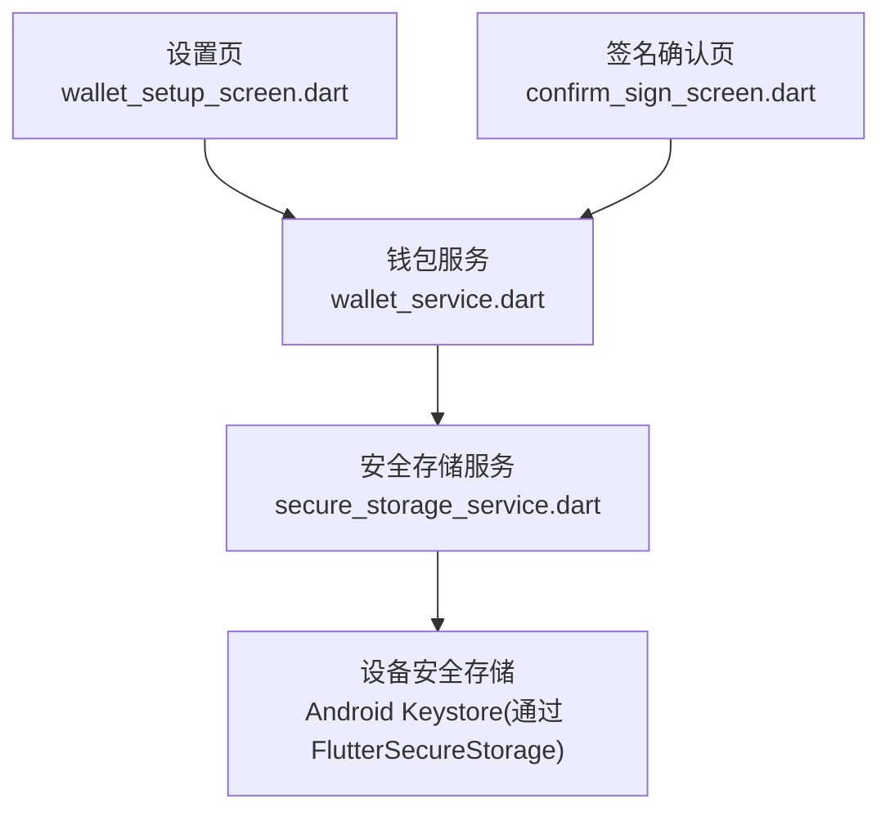
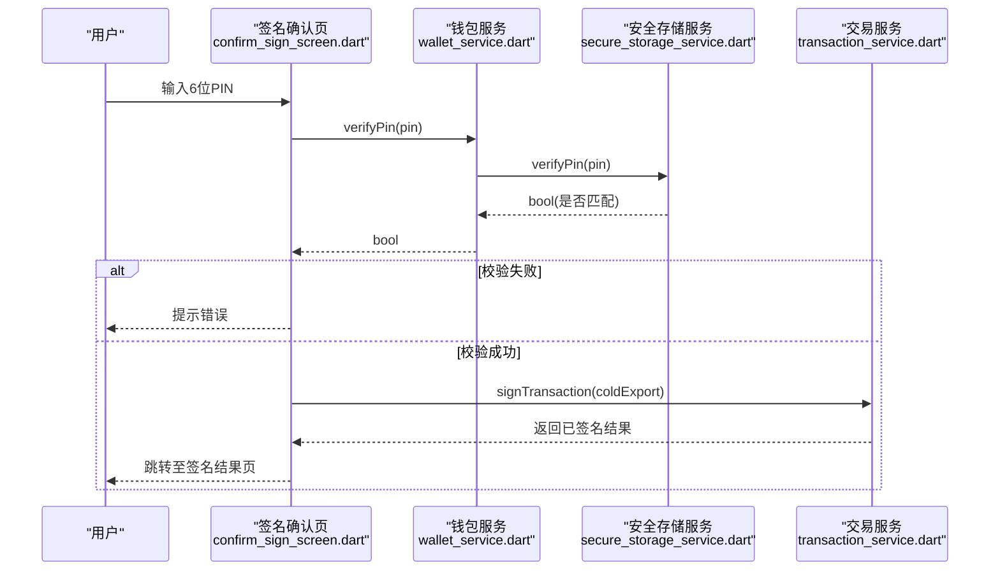
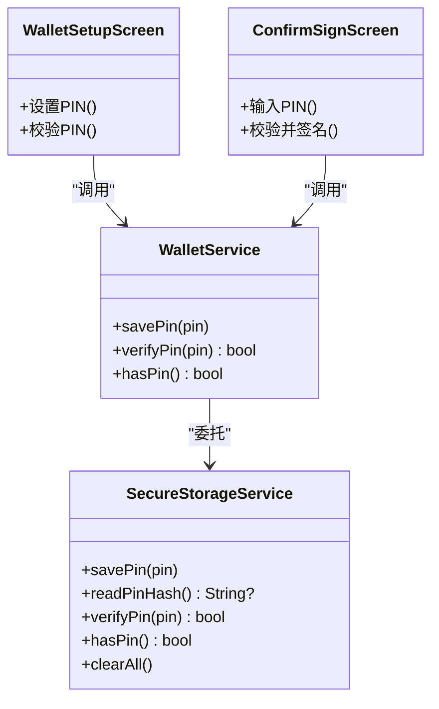
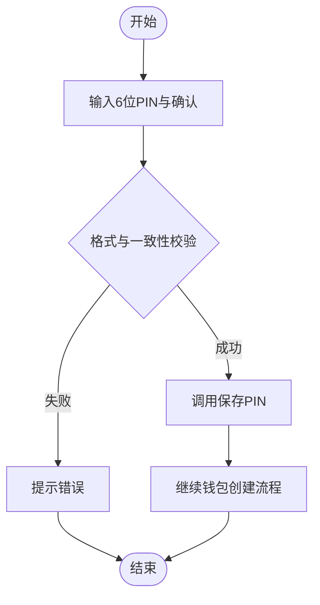
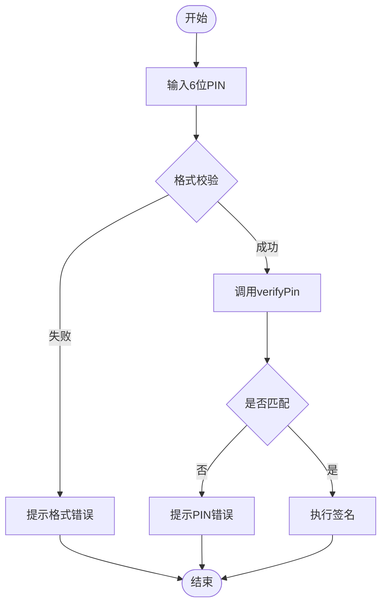

# PIN码认证机制

<cite>
**本文引用的文件**
- [secure_storage_service.dart](file://coldwallet-app/lib/services/secure_storage_service.dart)
- [wallet_service.dart](file://coldwallet-app/lib/services/wallet_service.dart)
- [wallet_setup_screen.dart](file://coldwallet-app/lib/screens/wallet_setup_screen.dart)
- [confirm_sign_screen.dart](file://coldwallet-app/lib/screens/confirm_sign_screen.dart)
- [2026-08-11-cold-wallet-app.md](file://docs/superpowers/plans/2026-08-11-cold-wallet-app.md)
</cite>

## 目录
1. [简介](#简介)
2. [项目结构](#项目结构)
3. [核心组件](#核心组件)
4. [架构总览](#架构总览)
5. [详细组件分析](#详细组件分析)
6. [依赖关系分析](#依赖关系分析)
7. [性能与安全考量](#性能与安全考量)
8. [故障排查指南](#故障排查指南)
9. [结论](#结论)
10. [附录](#附录)

## 简介
本文件围绕 ColdWallet 的 PIN 码认证机制，系统性说明当前实现、数据流与交互流程，并基于代码现状给出安全加固建议。重点覆盖：
- PIN 码哈希存储与验证流程（含计划中的改进）
- 设置、修改、清除的安全流程与用户交互设计
- 防暴力破解措施与锁定机制现状
- 会话管理与最佳实践
- 常见问题定位与配置建议

## 项目结构
PIN 相关能力主要分布在以下模块：
- 安全存储服务：负责敏感数据的持久化（包括 PIN），当前以明文形式写入安全存储，但已预留哈希改造位置
- 钱包服务：对外暴露 PIN 设置、校验、存在性检查等接口
- 设置页面：引导用户创建/确认 PIN，并进行基础格式校验
- 签名确认页：在关键操作前要求输入 PIN 进行授权

图表来源
- [wallet_setup_screen.dart:260-329](file://coldwallet-app/lib/screens/wallet_setup_screen.dart#L260-L329)
- [confirm_sign_screen.dart:29-61](file://coldwallet-app/lib/screens/confirm_sign_screen.dart#L29-L61)
- [wallet_service.dart:194-207](file://coldwallet-app/lib/services/wallet_service.dart#L194-L207)
- [secure_storage_service.dart:78-106](file://coldwallet-app/lib/services/secure_storage_service.dart#L78-L106)

章节来源
- [wallet_setup_screen.dart:260-329](file://coldwallet-app/lib/screens/wallet_setup_screen.dart#L260-L329)
- [confirm_sign_screen.dart:29-61](file://coldwallet-app/lib/screens/confirm_sign_screen.dart#L29-L61)
- [wallet_service.dart:194-207](file://coldwallet-app/lib/services/wallet_service.dart#L194-L207)
- [secure_storage_service.dart:78-106](file://coldwallet-app/lib/services/secure_storage_service.dart#L78-L106)

## 核心组件
- 安全存储服务 SecureStorageService
  - 提供 savePin/readPinHash/verifyPin/hasPin/clearAll 等方法
  - 当前将 PIN 以明文写入安全存储；方法内包含 TODO 注释提示后续改为哈希比较
- 钱包服务 WalletService
  - 封装对 SecureStorageService 的调用，暴露 savePin/verifyPin/hasPin
- 设置页 WalletSetupScreen
  - 首次创建钱包时引导设置全局 PIN，进行长度与数字格式校验，并要求二次确认
- 签名确认页 ConfirmSignScreen
  - 在交易签名前要求输入 PIN，校验通过后执行签名

章节来源
- [secure_storage_service.dart:78-106](file://coldwallet-app/lib/services/secure_storage_service.dart#L78-L106)
- [wallet_service.dart:194-207](file://coldwallet-app/lib/services/wallet_service.dart#L194-L207)
- [wallet_setup_screen.dart:260-329](file://coldwallet-app/lib/screens/wallet_setup_screen.dart#L260-L329)
- [confirm_sign_screen.dart:29-61](file://coldwallet-app/lib/screens/confirm_sign_screen.dart#L29-L61)

## 架构总览
下图展示了从用户输入到最终签名的完整调用链，以及 PIN 校验在其中的作用点。

图表来源
- [confirm_sign_screen.dart:29-61](file://coldwallet-app/lib/screens/confirm_sign_screen.dart#L29-L61)
- [wallet_service.dart:194-207](file://coldwallet-app/lib/services/wallet_service.dart#L194-L207)
- [secure_storage_service.dart:78-106](file://coldwallet-app/lib/services/secure_storage_service.dart#L78-L106)

## 详细组件分析

### 安全存储服务 SecureStorageService
- 职责
  - 管理 PIN 的保存、读取、校验与清空
  - 使用 FlutterSecureStorage 将数据保存在设备安全存储中（如 Android Keystore）
- 当前实现要点
  - savePin：直接写入明文（含 TODO 注释提示后续改为哈希）
  - readPinHash：读取存储值
  - verifyPin：将输入与存储值直接比较（含 TODO 注释提示后续改为哈希比较）
  - hasPin：判断是否存在非空 PIN
  - clearAll：清空所有存储（包含 PIN）
- 复杂度
  - 读写均为 O(1) 键值访问
- 风险与建议
  - 当前未做哈希存储，存在明文泄露风险；应尽快实现 KDF（如 PBKDF2/argon2）+ 盐值 + 常量时间比较
  - 建议在 verifyPin 中增加失败计数与冷却策略，防止暴力破解

章节来源
- [secure_storage_service.dart:78-106](file://coldwallet-app/lib/services/secure_storage_service.dart#L78-L106)

### 钱包服务 WalletService
- 职责
  - 对外提供 PIN 设置、校验、存在性检查
  - 统一管理钱包生命周期与网络设置
- 与 PIN 相关的接口
  - savePin：委托给 SecureStorageService.savePin
  - verifyPin：委托给 SecureStorageService.verifyPin
  - hasPin：委托给 SecureStorageService.hasPin
- 重置行为
  - resetAllWallets：仅清除钱包数据，保留 PIN
  - factoryReset：清除全部存储（含 PIN）

章节来源
- [wallet_service.dart:177-207](file://coldwallet-app/lib/services/wallet_service.dart#L177-L207)

### 设置页 WalletSetupScreen
- 职责
  - 引导用户设置全局 PIN（若尚未设置）
  - 对 PIN 进行前端校验：必须为 6 位纯数字，且两次输入一致
- 交互流程
  - 显示“设置 PIN”对话框，包含“6 位 PIN”和“确认 PIN”两个输入框
  - 校验通过后调用 WalletService.savePin 保存
  - 随后继续完成钱包创建流程
- 错误处理
  - 格式不合法或两次不一致时，通过 SnackBar 提示错误信息

章节来源
- [wallet_setup_screen.dart:260-329](file://coldwallet-app/lib/screens/wallet_setup_screen.dart#L260-L329)

### 签名确认页 ConfirmSignScreen
- 职责
  - 在交易签名前要求输入 PIN 进行授权
- 交互流程
  - 校验输入是否为 6 位数字
  - 调用 WalletService.verifyPin 进行后端校验
  - 校验失败：震动反馈并提示错误
  - 校验成功：进入签名流程，完成后跳转到签名结果页
- 错误处理
  - 输入格式错误、PIN 错误、签名异常均有明确提示

章节来源
- [confirm_sign_screen.dart:29-61](file://coldwallet-app/lib/screens/confirm_sign_screen.dart#L29-L61)

### 计划中的 PIN 哈希方案（参考文档）
- 设计要点
  - 使用带盐的哈希函数（MVP 阶段可用 SHA-256，生产环境建议使用 argon2 等强 KDF）
  - 设置新 PIN 时先校验长度与字符集，再进行哈希并存储
  - 验证时计算输入哈希并与存储哈希比较
- 该方案可作为后续升级路径，提升抗彩虹表与离线破解能力

章节来源
- [2026-08-11-cold-wallet-app.md:1666-1708](file://docs/superpowers/plans/2026-08-11-cold-wallet-app.md#L1666-L1708)

## 依赖关系分析
- 组件耦合
  - 设置页与签名确认页均依赖 WalletService 提供的 PIN 接口
  - WalletService 依赖 SecureStorageService 进行数据存取
  - SecureStorageService 依赖底层安全存储（FlutterSecureStorage）
- 外部依赖
  - FlutterSecureStorage：利用平台安全存储（如 Android Keystore）保护数据
- 潜在循环依赖
  - 当前无循环依赖

图表来源
- [wallet_setup_screen.dart:260-329](file://coldwallet-app/lib/screens/wallet_setup_screen.dart#L260-L329)
- [confirm_sign_screen.dart:29-61](file://coldwallet-app/lib/screens/confirm_sign_screen.dart#L29-L61)
- [wallet_service.dart:194-207](file://coldwallet-app/lib/services/wallet_service.dart#L194-L207)
- [secure_storage_service.dart:78-106](file://coldwallet-app/lib/services/secure_storage_service.dart#L78-L106)

## 性能与安全考量
- 性能
  - PIN 校验为轻量级 I/O 操作，延迟主要来自安全存储访问
  - 建议避免在主线程进行耗时计算（如 KDF），可考虑后台任务或异步处理
- 安全现状
  - 当前 PIN 以明文存储在安全存储中，存在被提取风险
  - 缺少防暴力破解机制（重试次数限制、冷却锁定）
  - 缺少会话管理（应用重启后是否需要重新验证）
- 建议改进
  - 立即实施哈希存储：采用 PBKDF2/argon2 + 随机盐 + 固定迭代次数
  - 引入失败计数与锁定：连续 N 次失败后锁定一段时间，并记录日志
  - 会话管理：应用进入前台或执行敏感操作前检查会话有效性
  - 常量时间比较：防止时序侧信道攻击
  - 最小权限原则：仅在必要时加载/比对 PIN，避免在内存中长期驻留明文

[本节为通用指导，不直接分析具体文件]

## 故障排查指南
- 现象：设置 PIN 后无法登录或签名失败
  - 可能原因：PIN 未正确保存或前后端不一致
  - 排查步骤：
    - 检查设置页是否正确调用 savePin
    - 检查安全存储中是否写入了预期值
    - 检查 verifyPin 逻辑是否与存储方式一致（当前为明文比较）
- 现象：多次输入错误 PIN 无锁定提示
  - 可能原因：未实现失败计数与冷却机制
  - 建议：在 SecureStorageService 或上层服务中增加失败计数与锁定状态
- 现象：应用重启后仍需输入 PIN
  - 可能原因：未实现会话保持
  - 建议：在应用启动时检查会话状态，或在敏感操作前统一校验

章节来源
- [secure_storage_service.dart:78-106](file://coldwallet-app/lib/services/secure_storage_service.dart#L78-L106)
- [confirm_sign_screen.dart:29-61](file://coldwallet-app/lib/screens/confirm_sign_screen.dart#L29-L61)

## 结论
当前 ColdWallet 的 PIN 认证机制具备基本的使用流程与界面交互，但在安全性方面仍有较大提升空间：
- 存储层需尽快实现哈希存储与常量时间比较
- 需要引入防暴力破解的锁定机制与会话管理
- 建议在关键操作前统一进行会话有效性检查
- 遵循最小权限与最小暴露原则，减少明文在内存中的停留时间

[本节为总结性内容，不直接分析具体文件]

## 附录

### PIN 设置流程图（基于当前实现）

图表来源
- [wallet_setup_screen.dart:260-329](file://coldwallet-app/lib/screens/wallet_setup_screen.dart#L260-L329)

### PIN 验证流程图（基于当前实现）

图表来源
- [confirm_sign_screen.dart:29-61](file://coldwallet-app/lib/screens/confirm_sign_screen.dart#L29-L61)