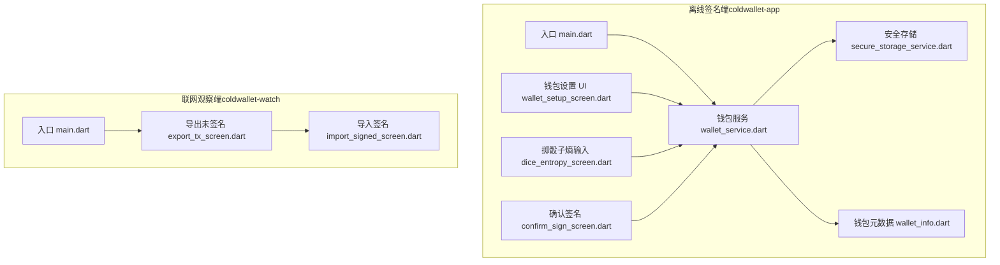
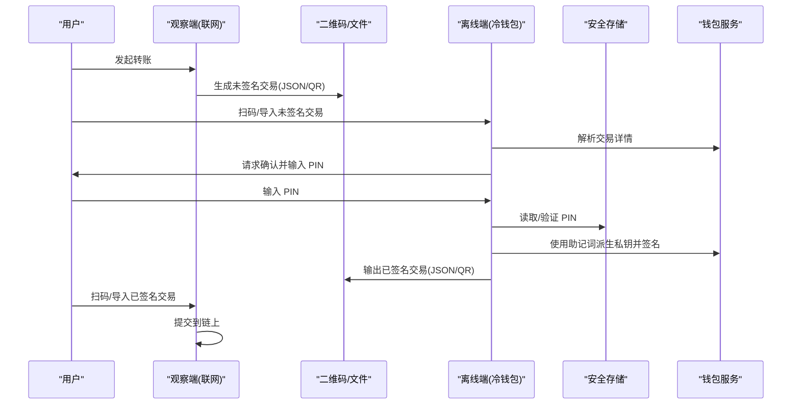
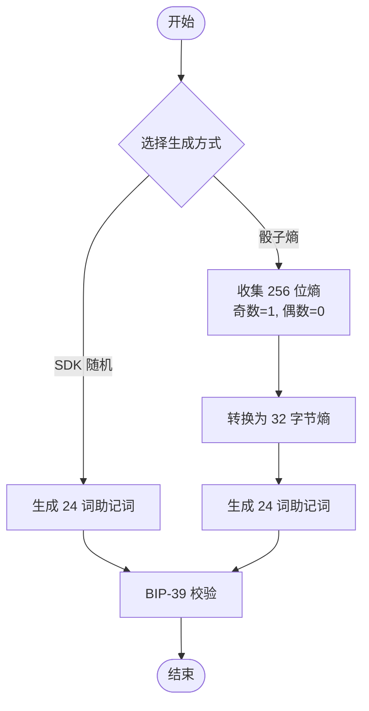
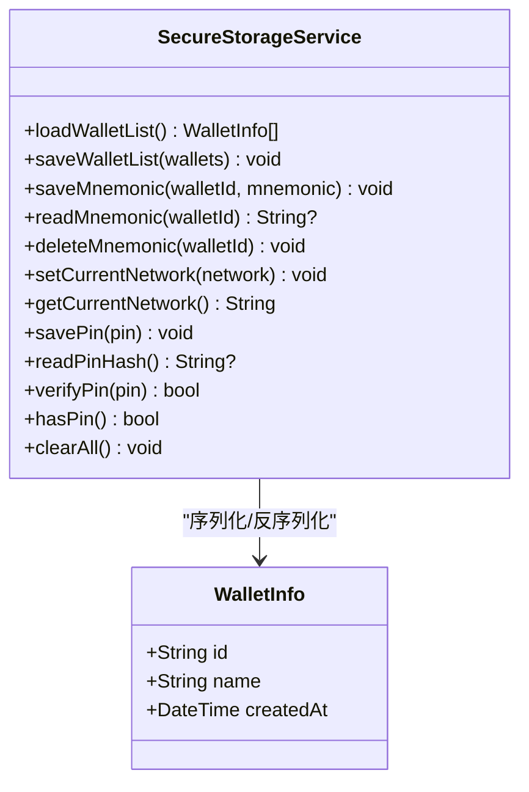
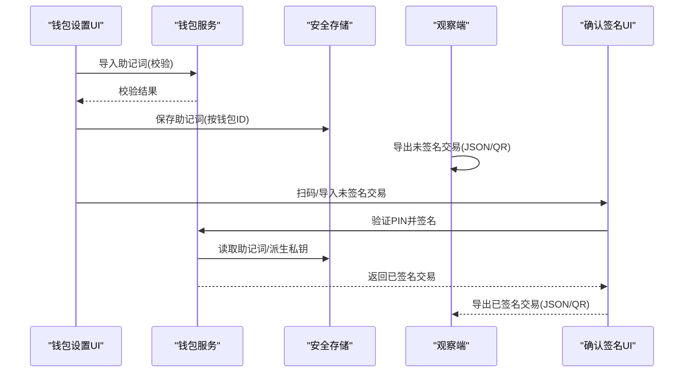
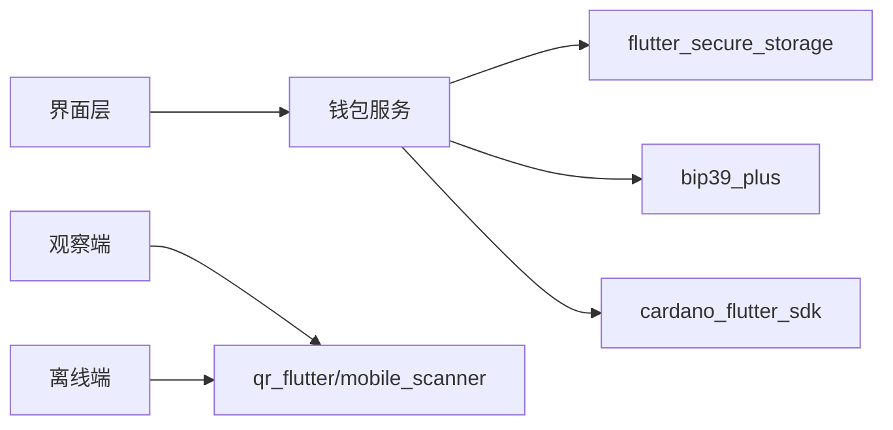

# 助记词安全管理

<cite>
**本文引用的文件**
- [coldwallet-app/lib/main.dart](file://coldwallet-app/lib/main.dart)
- [coldwallet-app/lib/services/wallet_service.dart](file://coldwallet-app/lib/services/wallet_service.dart)
- [coldwallet-app/lib/services/secure_storage_service.dart](file://coldwallet-app/lib/services/secure_storage_service.dart)
- [coldwallet-app/lib/models/wallet_info.dart](file://coldwallet-app/lib/models/wallet_info.dart)
- [coldwallet-app/lib/screens/wallet_setup_screen.dart](file://coldwallet-app/lib/screens/wallet_setup_screen.dart)
- [coldwallet-app/lib/screens/dice_entropy_screen.dart](file://coldwallet-app/lib/screens/dice_entropy_screen.dart)
- [coldwallet-app/lib/screens/confirm_sign_screen.dart](file://coldwallet-app/lib/screens/confirm_sign_screen.dart)
- [coldwallet-app/pubspec.yaml](file://coldwallet-app/pubspec.yaml)
- [coldwallet-watch/lib/main.dart](file://coldwallet-watch/lib/main.dart)
- [coldwallet-watch/lib/screens/export_tx_screen.dart](file://coldwallet-watch/lib/screens/export_tx_screen.dart)
- [coldwallet-watch/lib/screens/import_signed_screen.dart](file://coldwallet-watch/lib/screens/import_signed_screen.dart)
- [cold-wallet-plugin.md](file://cold-wallet-plugin.md)
</cite>

## 目录
1. [简介](#简介)
2. [项目结构](#项目结构)
3. [核心组件](#核心组件)
4. [架构总览](#架构总览)
5. [详细组件分析](#详细组件分析)
6. [依赖关系分析](#依赖关系分析)
7. [性能与安全特性](#性能与安全特性)
8. [故障排查指南](#故障排查指南)
9. [结论](#结论)
10. [附录](#附录)

## 简介
本文件围绕 ColdWallet 项目的助记词安全管理，系统性说明 BIP-39 助记词的生成原理、校验机制、多语言支持现状；阐述助记词在设备安全存储、内存中的临时处理与防泄露策略；梳理导入导出流程、错误处理与用户界面安全提示；并提供备份恢复最佳实践、威胁分析与防护措施。内容严格基于仓库中已实现的代码与文档。

## 项目结构
ColdWallet 由两个 Flutter 应用组成：
- coldwallet-app：离线签名端（冷钱包），负责助记词管理、地址派生、PIN 保护、二维码扫描与交易签名导出。
- coldwallet-watch：联网观察端（只读），负责构建未签名交易、展示二维码/文件、导入并广播已签名交易。

图表来源
- [coldwallet-app/lib/main.dart:11-49](file://coldwallet-app/lib/main.dart#L11-L49)
- [coldwallet-watch/lib/main.dart:9-11](file://coldwallet-watch/lib/main.dart#L9-L11)

章节来源
- [coldwallet-app/lib/main.dart:11-49](file://coldwallet-app/lib/main.dart#L11-L49)
- [coldwallet-watch/lib/main.dart:9-11](file://coldwallet-watch/lib/main.dart#L9-L11)

## 核心组件
- 钱包服务（WalletService）
  - 提供助记词生成、从骰子熵生成助记词、BIP-39 校验、HD 钱包创建与地址派生、网络设置、多钱包管理与 PIN 验证等能力。
- 安全存储服务（SecureStorageService）
  - 通过 flutter_secure_storage 将助记词、PIN、钱包列表等敏感数据以 Android Keystore 加密持久化，按钱包 ID 隔离存储。
- 钱包元数据（WalletInfo）
  - 仅保存非敏感信息（id、name、createdAt），与助记词分离存储。
- 界面层
  - 钱包设置页：引导创建/导入助记词、显示助记词、设置 PIN。
  - 掷骰子熵页：收集 256 位真随机熵并生成助记词。
  - 确认签名页：PIN 校验后调用交易签名流程。
  - 观察端导出/导入页：导出未签名交易 JSON/二维码，导入已签名结果并提交。

章节来源
- [coldwallet-app/lib/services/wallet_service.dart:13-207](file://coldwallet-app/lib/services/wallet_service.dart#L13-L207)
- [coldwallet-app/lib/services/secure_storage_service.dart:5-106](file://coldwallet-app/lib/services/secure_storage_service.dart#L5-L106)
- [coldwallet-app/lib/models/wallet_info.dart:1-55](file://coldwallet-app/lib/models/wallet_info.dart#L1-L55)
- [coldwallet-app/lib/screens/wallet_setup_screen.dart:8-612](file://coldwallet-app/lib/screens/wallet_setup_screen.dart#L8-L612)
- [coldwallet-app/lib/screens/dice_entropy_screen.dart:6-248](file://coldwallet-app/lib/screens/dice_entropy_screen.dart#L6-L248)
- [coldwallet-app/lib/screens/confirm_sign_screen.dart:9-150](file://coldwallet-app/lib/screens/confirm_sign_screen.dart#L9-L150)
- [coldwallet-watch/lib/screens/export_tx_screen.dart:73-112](file://coldwallet-watch/lib/screens/export_tx_screen.dart#L73-L112)
- [coldwallet-watch/lib/screens/import_signed_screen.dart:79-124](file://coldwallet-watch/lib/screens/import_signed_screen.dart#L79-L124)

## 架构总览
离线签名端与联网观察端通过“未签名交易”和“已签名交易”的二维码/文件进行安全交换，助记词与私钥仅在离线设备上出现。

图表来源
- [coldwallet-watch/lib/screens/export_tx_screen.dart:73-112](file://coldwallet-watch/lib/screens/export_tx_screen.dart#L73-L112)
- [coldwallet-watch/lib/screens/import_signed_screen.dart:79-124](file://coldwallet-watch/lib/screens/import_signed_screen.dart#L79-L124)
- [coldwallet-app/lib/screens/confirm_sign_screen.dart:29-61](file://coldwallet-app/lib/screens/confirm_sign_screen.dart#L29-L61)
- [coldwallet-app/lib/services/wallet_service.dart:60-78](file://coldwallet-app/lib/services/wallet_service.dart#L60-L78)
- [coldwallet-app/lib/services/secure_storage_service.dart:78-98](file://coldwallet-app/lib/services/secure_storage_service.dart#L78-L98)

## 详细组件分析

### 助记词生成与校验（BIP-39）
- 生成方式
  - 直接生成：调用 SDK 安全随机源生成 24 词助记词。
  - 骰子熵生成：用户投掷物理骰子 256 次，奇偶映射为比特流，转换为 32 字节熵后生成 24 词助记词。
- 校验机制
  - 使用 BIP-39 校验函数对助记词进行有效性检查，捕获异常并返回布尔结果。
- 多语言支持
  - 当前实现未显式指定语言参数，默认使用 SDK 默认词典（通常为英文）。如需多语言，需在调用处传入对应语言参数。

图表来源
- [coldwallet-app/lib/services/wallet_service.dart:20-56](file://coldwallet-app/lib/services/wallet_service.dart#L20-L56)
- [coldwallet-app/lib/screens/dice_entropy_screen.dart:20-60](file://coldwallet-app/lib/screens/dice_entropy_screen.dart#L20-L60)

章节来源
- [coldwallet-app/lib/services/wallet_service.dart:20-56](file://coldwallet-app/lib/services/wallet_service.dart#L20-L56)
- [coldwallet-app/lib/screens/dice_entropy_screen.dart:20-60](file://coldwallet-app/lib/screens/dice_entropy_screen.dart#L20-L60)

### 助记词的安全存储策略
- 存储位置
  - 使用 flutter_secure_storage 将助记词按钱包 ID 隔离保存在设备安全存储（Android Keystore）中。
- 密钥隔离
  - 钱包元数据（不含助记词）与助记词分开存储，降低单点泄露风险。
- PIN 保护
  - 全局 PIN 用于解锁 App 操作，当前实现暂存明文 PIN，后续计划改为哈希比较（代码中有 TODO）。
- 清空与重置
  - 提供删除单个钱包助记词、重置所有钱包、工厂重置（清除全部存储）的能力。

图表来源
- [coldwallet-app/lib/services/secure_storage_service.dart:16-106](file://coldwallet-app/lib/services/secure_storage_service.dart#L16-L106)
- [coldwallet-app/lib/models/wallet_info.dart:8-55](file://coldwallet-app/lib/models/wallet_info.dart#L8-L55)

章节来源
- [coldwallet-app/lib/services/secure_storage_service.dart:5-106](file://coldwallet-app/lib/services/secure_storage_service.dart#L5-L106)
- [coldwallet-app/lib/models/wallet_info.dart:1-55](file://coldwallet-app/lib/models/wallet_info.dart#L1-L55)

### 内存中的临时处理与防日志泄露
- 临时处理
  - 助记词在内存中以字符串形式短暂存在，用于地址派生与签名流程，避免落盘。
- 防泄露措施
  - 界面使用 SelectableText 展示助记词时，明确提示“请妥善抄写在纸上，切勿截图或拍照”。
  - 复制助记词功能需二次确认，并在操作后提示立即离线保存。
  - 输入框使用掩码（obscureText）保护 PIN 输入。
  - 依赖 flutter_secure_storage 将敏感数据写入系统安全存储，而非普通文件。

章节来源
- [coldwallet-app/lib/screens/wallet_setup_screen.dart:213-258](file://coldwallet-app/lib/screens/wallet_setup_screen.dart#L213-L258)
- [coldwallet-app/lib/screens/wallet_setup_screen.dart:519-566](file://coldwallet-app/lib/screens/wallet_setup_screen.dart#L519-L566)
- [coldwallet-app/lib/screens/confirm_sign_screen.dart:121-128](file://coldwallet-app/lib/screens/confirm_sign_screen.dart#L121-L128)
- [coldwallet-app/lib/services/secure_storage_service.dart:5-8](file://coldwallet-app/lib/services/secure_storage_service.dart#L5-L8)

### 助记词导入导出流程
- 导入
  - 用户在钱包设置页输入助记词，系统进行 BIP-39 校验，通过后进入命名与确认流程，最终保存到安全存储。
- 导出
  - 观察端导出未签名交易为 JSON 或二维码；离线端扫码/导入后签名，再导出已签名交易；观察端再次导入并提交到链上。

图表来源
- [coldwallet-app/lib/screens/wallet_setup_screen.dart:156-169](file://coldwallet-app/lib/screens/wallet_setup_screen.dart#L156-L169)
- [coldwallet-app/lib/services/wallet_service.dart:131-152](file://coldwallet-app/lib/services/wallet_service.dart#L131-L152)
- [coldwallet-watch/lib/screens/export_tx_screen.dart:73-112](file://coldwallet-watch/lib/screens/export_tx_screen.dart#L73-L112)
- [coldwallet-watch/lib/screens/import_signed_screen.dart:79-124](file://coldwallet-watch/lib/screens/import_signed_screen.dart#L79-L124)
- [coldwallet-app/lib/screens/confirm_sign_screen.dart:29-61](file://coldwallet-app/lib/screens/confirm_sign_screen.dart#L29-L61)

章节来源
- [coldwallet-app/lib/screens/wallet_setup_screen.dart:156-169](file://coldwallet-app/lib/screens/wallet_setup_screen.dart#L156-L169)
- [coldwallet-watch/lib/screens/export_tx_screen.dart:73-112](file://coldwallet-watch/lib/screens/export_tx_screen.dart#L73-L112)
- [coldwallet-watch/lib/screens/import_signed_screen.dart:79-124](file://coldwallet-watch/lib/screens/import_signed_screen.dart#L79-L124)
- [coldwallet-app/lib/screens/confirm_sign_screen.dart:29-61](file://coldwallet-app/lib/screens/confirm_sign_screen.dart#L29-L61)

### 错误处理机制
- 助记词校验失败：返回错误提示，阻止继续流程。
- PIN 校验失败：震动反馈并提示错误，不执行签名。
- 签名过程异常：捕获异常并提示失败，保持界面可重试。
- 存储操作异常：在保存/删除钱包时捕获异常并给出用户可见的错误提示。

章节来源
- [coldwallet-app/lib/screens/wallet_setup_screen.dart:161-169](file://coldwallet-app/lib/screens/wallet_setup_screen.dart#L161-L169)
- [coldwallet-app/lib/screens/confirm_sign_screen.dart:29-61](file://coldwallet-app/lib/screens/confirm_sign_screen.dart#L29-L61)
- [coldwallet-app/lib/screens/wallet_setup_screen.dart:331-346](file://coldwallet-app/lib/screens/wallet_setup_screen.dart#L331-L346)

### 用户界面安全提示
- 首次展示助记词时强调“请妥善抄写在纸上，切勿截图或拍照”。
- 复制助记词后提示“请立即离线保存助记词”。
- PIN 输入使用掩码，并提供显示/隐藏切换。
- 掷骰子页面提供撤销与重置确认，防止误操作。

章节来源
- [coldwallet-app/lib/screens/wallet_setup_screen.dart:213-258](file://coldwallet-app/lib/screens/wallet_setup_screen.dart#L213-L258)
- [coldwallet-app/lib/screens/wallet_setup_screen.dart:519-566](file://coldwallet-app/lib/screens/wallet_setup_screen.dart#L519-L566)
- [coldwallet-app/lib/screens/confirm_sign_screen.dart:121-128](file://coldwallet-app/lib/screens/confirm_sign_screen.dart#L121-L128)
- [coldwallet-app/lib/screens/dice_entropy_screen.dart:225-246](file://coldwallet-app/lib/screens/dice_entropy_screen.dart#L225-L246)

## 依赖关系分析
- 关键依赖
  - cardano_flutter_sdk：HD 钱包创建、地址派生、签名。
  - bip39_plus：BIP-39 助记词校验与转换。
  - flutter_secure_storage：安全存储（Android Keystore）。
  - mobile_scanner / qr_flutter：二维码扫描与展示。
  - path_provider / file_picker：文件读写与选择。
- 模块耦合
  - 钱包服务依赖安全存储与钱包元数据模型。
  - 界面层依赖钱包服务进行业务逻辑调用。
  - 观察端与离线端通过二维码/文件解耦交互。

图表来源
- [coldwallet-app/pubspec.yaml:30-47](file://coldwallet-app/pubspec.yaml#L30-L47)
- [coldwallet-app/lib/services/wallet_service.dart:1-8](file://coldwallet-app/lib/services/wallet_service.dart#L1-L8)
- [coldwallet-app/lib/services/secure_storage_service.dart:1-3](file://coldwallet-app/lib/services/secure_storage_service.dart#L1-L3)

章节来源
- [coldwallet-app/pubspec.yaml:30-47](file://coldwallet-app/pubspec.yaml#L30-L47)
- [coldwallet-app/lib/services/wallet_service.dart:1-8](file://coldwallet-app/lib/services/wallet_service.dart#L1-L8)
- [coldwallet-app/lib/services/secure_storage_service.dart:1-3](file://coldwallet-app/lib/services/secure_storage_service.dart#L1-L3)

## 性能与安全特性
- 性能
  - 助记词生成与校验为轻量计算，延迟低。
  - 地址派生与签名涉及椭圆曲线运算，耗时可控，界面提供加载状态与禁用按钮防止重复点击。
- 安全
  - 助记词与私钥仅在离线设备内存中出现，不落盘。
  - 敏感数据通过系统安全存储加密保存。
  - 界面强制用户确认并提示离线备份，减少截屏/拍照泄露风险。
  - PIN 校验失败有触觉反馈，增强用户体验与安全性。

[本节为通用指导，无需具体文件引用]

## 故障排查指南
- 助记词无效
  - 检查单词拼写与数量（12 或 24），确保空格分隔正确。
  - 查看导入流程中的校验提示。
- PIN 错误
  - 确认输入的 6 位数字是否正确，注意大小写与全角半角。
  - 若多次失败，考虑重置 PIN（当前实现未提供在线重置，需工厂重置）。
- 签名失败
  - 检查未签名交易是否完整、网络设置是否正确。
  - 查看错误提示并重新尝试。
- 存储问题
  - 若无法读取/写入助记词，检查设备安全存储权限与存储空间。
  - 必要时执行工厂重置，但会清除所有数据。

章节来源
- [coldwallet-app/lib/screens/wallet_setup_screen.dart:161-169](file://coldwallet-app/lib/screens/wallet_setup_screen.dart#L161-L169)
- [coldwallet-app/lib/screens/confirm_sign_screen.dart:29-61](file://coldwallet-app/lib/screens/confirm_sign_screen.dart#L29-L61)
- [coldwallet-app/lib/services/secure_storage_service.dart:80-98](file://coldwallet-app/lib/services/secure_storage_service.dart#L80-L98)

## 结论
ColdWallet 在助记词管理方面实现了完整的生成、校验、安全存储与导入导出闭环，并通过界面提示与 PIN 保护提升安全性。建议后续优化包括：
- 引入多语言词典支持，满足国际化需求。
- 将 PIN 存储与校验升级为哈希比对（如 PBKDF2/argon2），提升抗暴力破解能力。
- 增加更严格的内存清理策略与防截屏/录屏提示。
- 完善错误日志与崩溃上报（在不泄露敏感信息的前提下）。

[本节为总结性内容，无需具体文件引用]

## 附录
- 冷钱包通信标准
  - 参考 CIP-45 冷钱包二维码/WebRTC 通信协议，用于离线与联网设备间的数据交换。
- 安全模型要点
  - 助记词与私钥永不触网；地址、公钥、交易哈希可公开；未签名/已签名交易在设备间传输且不含私钥。

章节来源
- [cold-wallet-plugin.md:117-150](file://cold-wallet-plugin.md#L117-L150)