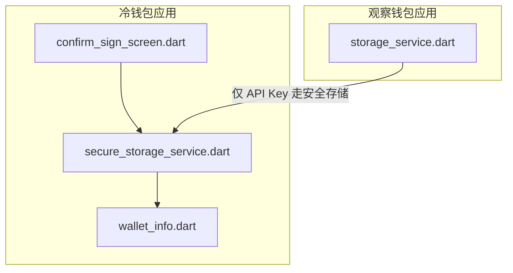
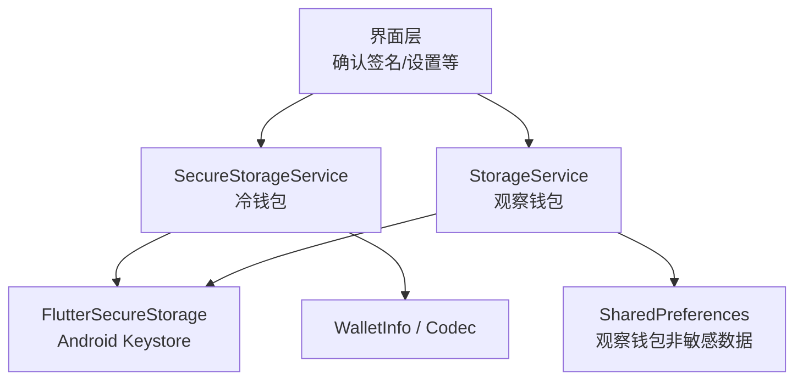
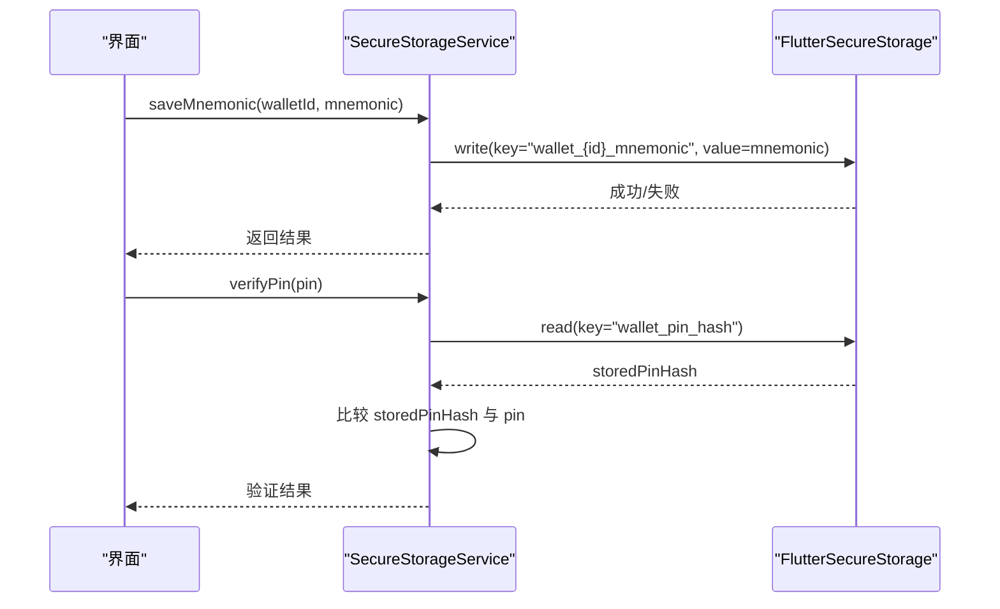
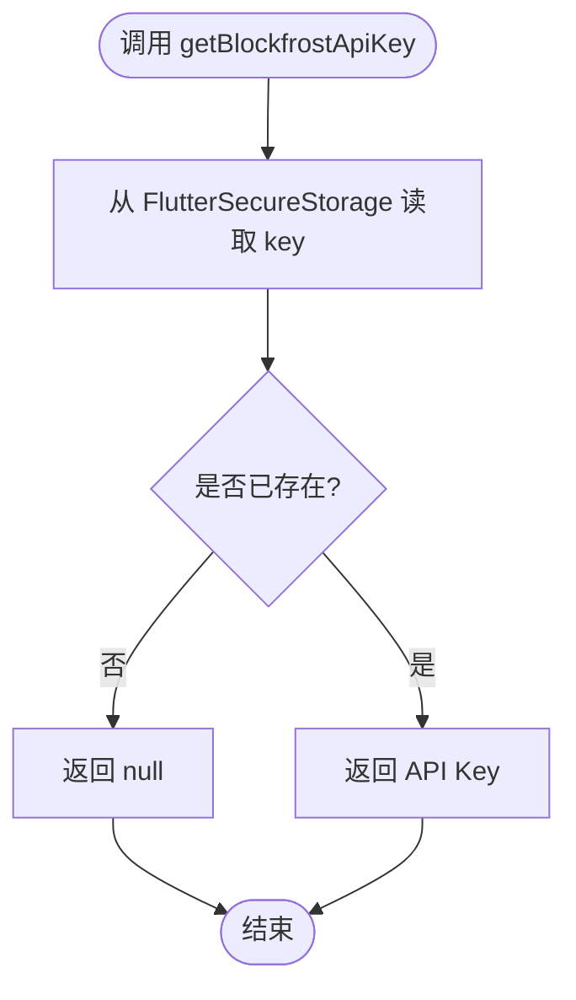
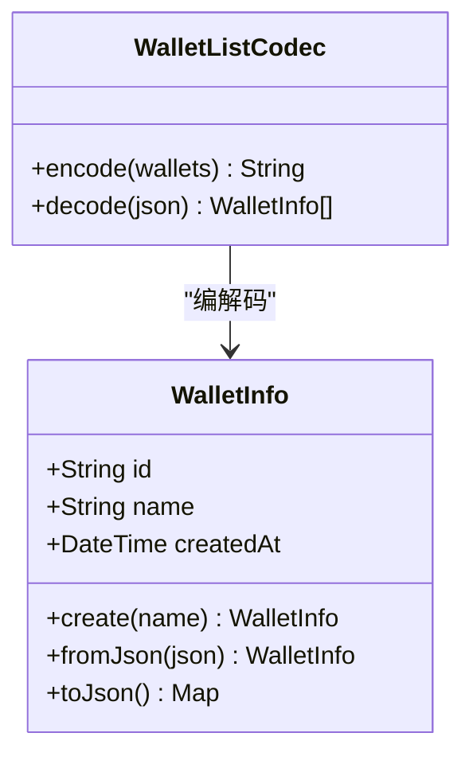
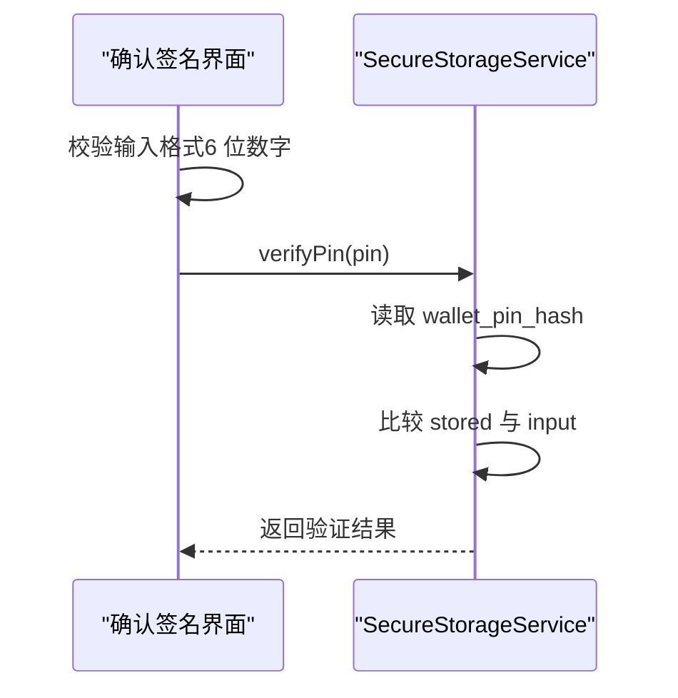
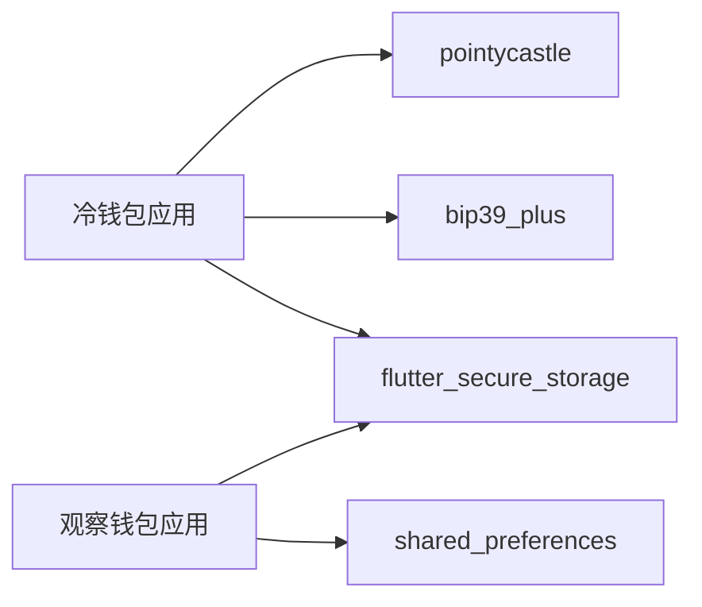

# 安全存储机制

<cite>
**本文引用的文件**
- [coldwallet-app/pubspec.yaml](file://coldwallet-app/pubspec.yaml)
- [coldwallet-watch/pubspec.yaml](file://coldwallet-watch/pubspec.yaml)
- [coldwallet-app/lib/services/secure_storage_service.dart](file://coldwallet-app/lib/services/secure_storage_service.dart)
- [coldwallet-watch/lib/services/storage_service.dart](file://coldwallet-watch/lib/services/storage_service.dart)
- [coldwallet-app/lib/models/wallet_info.dart](file://coldwallet-app/lib/models/wallet_info.dart)
- [coldwallet-app/lib/screens/confirm_sign_screen.dart](file://coldwallet-app/lib/screens/confirm_sign_screen.dart)
</cite>

## 目录
1. [简介](#简介)
2. [项目结构](#项目结构)
3. [核心组件](#核心组件)
4. [架构总览](#架构总览)
5. [详细组件分析](#详细组件分析)
6. [依赖关系分析](#依赖关系分析)
7. [性能考量](#性能考量)
8. [故障排除指南](#故障排除指南)
9. [结论](#结论)
10. [附录](#附录)

## 简介
本文件聚焦 ColdWallet 的安全存储机制，围绕 Android Keystore 集成、FlutterSecureStorage 的使用方式与敏感数据加密存储策略展开。重点说明助记词隔离存储、钱包元数据安全、PIN 码哈希存储的实现原理，并给出密钥管理最佳实践、数据备份恢复建议、存储性能优化与安全配置指南，以及常见问题的排查方法。

## 项目结构
本项目包含两个 Flutter 应用：
- coldwallet-app：冷钱包离线签名应用，使用 flutter_secure_storage 将敏感数据（助记词、PIN、钱包列表）通过 Android Keystore 加密存储。
- coldwallet-watch：只读观察钱包应用，非敏感元数据使用 SharedPreferences 明文存储，API Key 等敏感信息使用 flutter_secure_storage 加密存储。

图表来源
- [coldwallet-app/lib/services/secure_storage_service.dart:1-107](file://coldwallet-app/lib/services/secure_storage_service.dart#L1-L107)
- [coldwallet-app/lib/models/wallet_info.dart:1-56](file://coldwallet-app/lib/models/wallet_info.dart#L1-L56)
- [coldwallet-watch/lib/services/storage_service.dart:1-87](file://coldwallet-watch/lib/services/storage_service.dart#L1-L87)
- [coldwallet-app/lib/screens/confirm_sign_screen.dart:24-37](file://coldwallet-app/lib/screens/confirm_sign_screen.dart#L24-L37)

章节来源
- [coldwallet-app/pubspec.yaml:30-46](file://coldwallet-app/pubspec.yaml#L30-L46)
- [coldwallet-watch/pubspec.yaml:30-43](file://coldwallet-watch/pubspec.yaml#L30-L43)

## 核心组件
- SecureStorageService（冷钱包）
  - 职责：封装所有敏感数据的读写，包括钱包列表、按钱包 ID 隔离的助记词、当前钱包 ID、全局网络设置、PIN 哈希。
  - 关键键名规划：wallet_list、wallet_{id}_mnemonic、current_wallet_id、current_network、wallet_pin_hash。
  - 底层实现：基于 flutter_secure_storage，Android 端默认使用 Keystore 加密。
- StorageService（观察钱包）
  - 职责：非敏感元数据（钱包列表、当前钱包、启用资产）使用 SharedPreferences；Blockfrost API Key 使用 flutter_secure_storage 加密存储。
  - 初始化：同时创建 SharedPreferences 和 FlutterSecureStorage 实例。
- WalletInfo 与 WalletListCodec
  - 职责：定义钱包元数据结构及 JSON 编解码，用于持久化钱包列表。

章节来源
- [coldwallet-app/lib/services/secure_storage_service.dart:1-107](file://coldwallet-app/lib/services/secure_storage_service.dart#L1-L107)
- [coldwallet-watch/lib/services/storage_service.dart:1-87](file://coldwallet-watch/lib/services/storage_service.dart#L1-L87)
- [coldwallet-app/lib/models/wallet_info.dart:1-56](file://coldwallet-app/lib/models/wallet_info.dart#L1-L56)

## 架构总览
下图展示了冷钱包与观察钱包在安全存储上的分层与交互：

图表来源
- [coldwallet-app/lib/services/secure_storage_service.dart:1-107](file://coldwallet-app/lib/services/secure_storage_service.dart#L1-L107)
- [coldwallet-watch/lib/services/storage_service.dart:1-87](file://coldwallet-watch/lib/services/storage_service.dart#L1-L87)
- [coldwallet-app/lib/models/wallet_info.dart:1-56](file://coldwallet-app/lib/models/wallet_info.dart#L1-L56)

## 详细组件分析

### 冷钱包安全存储服务（SecureStorageService）
- 设计要点
  - 助记词按钱包 ID 隔离存储，避免单点泄露导致多钱包风险。
  - 钱包元数据（名称、创建时间等）与助记词分离，降低误用风险。
  - PIN 目前以明文形式暂存，代码中标注需改为哈希存储（如 PBKDF2/Argon2）。
  - 提供清空全部数据的能力，便于重置或迁移。
- 关键流程
  - 保存/读取钱包列表：序列化后写入安全存储。
  - 保存/读取/删除指定钱包助记词：按 wallet_{id}_mnemonic 键隔离。
  - 当前钱包与网络设置：轻量级配置项。
  - PIN 校验：当前为明文比较，后续应改为哈希比对。

图表来源
- [coldwallet-app/lib/services/secure_storage_service.dart:44-56](file://coldwallet-app/lib/services/secure_storage_service.dart#L44-L56)
- [coldwallet-app/lib/services/secure_storage_service.dart:80-93](file://coldwallet-app/lib/services/secure_storage_service.dart#L80-L93)

章节来源
- [coldwallet-app/lib/services/secure_storage_service.dart:1-107](file://coldwallet-app/lib/services/secure_storage_service.dart#L1-L107)

### 观察钱包存储服务（StorageService）
- 设计要点
  - 非敏感数据（钱包列表、当前钱包、启用资产）使用 SharedPreferences 明文存储，适合只读场景。
  - Blockfrost API Key 等敏感信息使用 FlutterSecureStorage 加密存储。
  - 固定网络为 preview 测试网，简化网络切换逻辑。
- 关键流程
  - 加载/保存钱包列表：JSON 序列化到 SharedPreferences。
  - 获取/设置当前钱包 ID。
  - 获取/设置 Blockfrost API Key：走安全存储。
  - 获取/设置启用资产列表：按钱包 ID 前缀键存储。

图表来源
- [coldwallet-watch/lib/services/storage_service.dart:62-74](file://coldwallet-watch/lib/services/storage_service.dart#L62-L74)

章节来源
- [coldwallet-watch/lib/services/storage_service.dart:1-87](file://coldwallet-watch/lib/services/storage_service.dart#L1-L87)

### 钱包元数据模型（WalletInfo 与 WalletListCodec）
- 设计要点
  - WalletInfo 仅包含非敏感元数据（ID、名称、创建时间），与助记词分离存储。
  - 使用随机安全 ID 生成器，减少碰撞概率。
  - WalletListCodec 负责钱包列表的 JSON 编解码，便于安全存储。
- 复杂度
  - 序列化/反序列化时间复杂度 O(n)，n 为钱包数量。
  - 空间复杂度 O(n)。

图表来源
- [coldwallet-app/lib/models/wallet_info.dart:8-56](file://coldwallet-app/lib/models/wallet_info.dart#L8-L56)

章节来源
- [coldwallet-app/lib/models/wallet_info.dart:1-56](file://coldwallet-app/lib/models/wallet_info.dart#L1-L56)

### PIN 校验流程（界面与服务协作）
- 界面输入 6 位数字 PIN，调用服务进行校验。
- 当前实现为明文比较，后续应改为哈希比对以提升安全性。

图表来源
- [coldwallet-app/lib/screens/confirm_sign_screen.dart:24-37](file://coldwallet-app/lib/screens/confirm_sign_screen.dart#L24-L37)
- [coldwallet-app/lib/services/secure_storage_service.dart:80-93](file://coldwallet-app/lib/services/secure_storage_service.dart#L80-L93)

章节来源
- [coldwallet-app/lib/screens/confirm_sign_screen.dart:24-37](file://coldwallet-app/lib/screens/confirm_sign_screen.dart#L24-L37)
- [coldwallet-app/lib/services/secure_storage_service.dart:80-93](file://coldwallet-app/lib/services/secure_storage_service.dart#L80-L93)

## 依赖关系分析
- 冷钱包应用依赖
  - flutter_secure_storage：用于敏感数据加密存储（Android Keystore 后端）。
  - bip39_plus：助记词生成与校验。
  - pointycastle：密码学原语（可用于未来 PIN 哈希）。
  - cardano_flutter_sdk / cardano_dart_types：Cardano 相关能力。
- 观察钱包应用依赖
  - shared_preferences：非敏感元数据存储。
  - flutter_secure_storage：API Key 等敏感信息加密存储。
  - http：网络请求（如需）。

图表来源
- [coldwallet-app/pubspec.yaml:30-46](file://coldwallet-app/pubspec.yaml#L30-L46)
- [coldwallet-watch/pubspec.yaml:30-43](file://coldwallet-watch/pubspec.yaml#L30-L43)

章节来源
- [coldwallet-app/pubspec.yaml:30-46](file://coldwallet-app/pubspec.yaml#L30-L46)
- [coldwallet-watch/pubspec.yaml:30-43](file://coldwallet-watch/pubspec.yaml#L30-L43)

## 性能考量
- 批量操作
  - 钱包列表较大时，序列化/反序列化会带来 CPU 与内存开销，建议分页或增量更新。
- I/O 频率
  - 频繁读写安全存储可能触发系统锁屏或生物识别提示（取决于平台实现），应合并写操作或缓存热点数据。
- 内存占用
  - 避免在内存中长时间持有明文助记词，使用后及时释放引用。
- 网络与本地结合
  - 观察钱包中 API Key 的读取应缓存于内存短生命周期内，减少重复 I/O。

[本节为通用指导，不直接分析具体文件]

## 故障排除指南
- 无法读取助记词或钱包列表为空
  - 检查对应 key 是否存在（wallet_{id}_mnemonic、wallet_list）。
  - 确认序列化/反序列化是否一致（WalletListCodec）。
- PIN 校验失败
  - 当前为明文比较，若修改了存储逻辑需同步更新校验逻辑。
  - 建议尽快迁移至哈希比对（PBKDF2/Argon2），并在首次设置时生成盐值。
- 观察钱包 API Key 不可用
  - 确认已通过 setBlockfrostApiKey 写入安全存储。
  - 检查 FlutterSecureStorage 初始化参数是否正确（AndroidOptions）。
- 数据清理与恢复
  - 使用 clearAll 可清空所有数据，适用于重置或迁移前准备。
  - 备份策略：导出钱包列表与助记词（用户授权下），并以离线介质保存。

章节来源
- [coldwallet-app/lib/services/secure_storage_service.dart:26-39](file://coldwallet-app/lib/services/secure_storage_service.dart#L26-L39)
- [coldwallet-app/lib/services/secure_storage_service.dart:44-56](file://coldwallet-app/lib/services/secure_storage_service.dart#L44-L56)
- [coldwallet-app/lib/services/secure_storage_service.dart:80-93](file://coldwallet-app/lib/services/secure_storage_service.dart#L80-L93)
- [coldwallet-watch/lib/services/storage_service.dart:62-74](file://coldwallet-watch/lib/services/storage_service.dart#L62-L74)

## 结论
ColdWallet 通过 flutter_secure_storage 将敏感数据（助记词、PIN、钱包列表）安全地存储在 Android Keystore 中，实现了助记词的按钱包 ID 隔离与钱包元数据分离存储。观察钱包采用 SharedPreferences 存储非敏感元数据，并将 API Key 等敏感信息放入安全存储。当前 PIN 存储仍为明文，建议尽快升级为哈希存储。整体架构清晰、职责分明，具备良好的可扩展性与安全性基础。

[本节为总结性内容，不直接分析具体文件]

## 附录

### 安全配置指南
- 启用强安全后端
  - 确保 flutter_secure_storage 使用 Android Keystore（默认行为），必要时显式传入 AndroidOptions。
- 最小权限原则
  - 仅对必要数据使用安全存储，非敏感元数据使用 SharedPreferences。
- 密钥轮换与升级
  - 当算法或库升级时，考虑重新哈希 PIN 并迁移旧数据。
- 日志与调试
  - 禁止记录明文助记词、PIN 或私钥；如需调试，使用脱敏标识。

[本节为通用指导，不直接分析具体文件]

### 密钥管理最佳实践
- 助记词隔离存储：每个钱包独立 key，避免横向泄露。
- 元数据与密钥分离：钱包列表不包含助记词，降低误用风险。
- PIN 哈希存储：使用 PBKDF2/Argon2 加盐哈希，增加暴力破解成本。
- 内存安全：避免长驻留明文敏感数据，使用后立即置空。
- 备份与恢复：支持用户可控的备份导出与导入，确保离线介质安全。

[本节为通用指导，不直接分析具体文件]

### 数据备份恢复机制
- 备份内容
  - 钱包列表（非敏感）、各钱包助记词（敏感）、PIN（哈希）。
- 备份载体
  - 建议使用离线介质（纸质助记词、加密 U 盘）保存敏感信息。
- 恢复流程
  - 导入钱包列表与助记词，重建本地安全存储；校验 PIN 哈希一致性。

[本节为通用指导，不直接分析具体文件]

### 存储性能优化
- 合并写操作：批量更新钱包列表时一次性写入。
- 缓存热点数据：在内存中短期缓存常用配置（如当前钱包 ID）。
- 异步处理：I/O 操作统一异步，避免阻塞 UI。
- 压缩与分片：大对象可考虑分片存储，提升可读性。

[本节为通用指导，不直接分析具体文件]