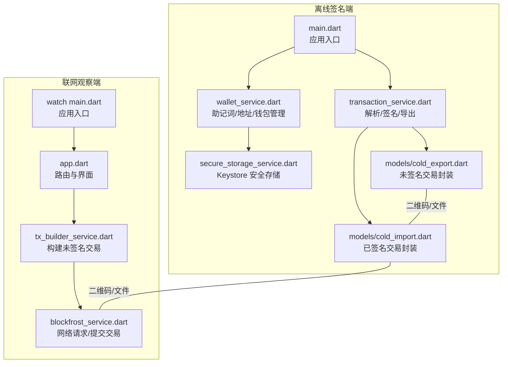
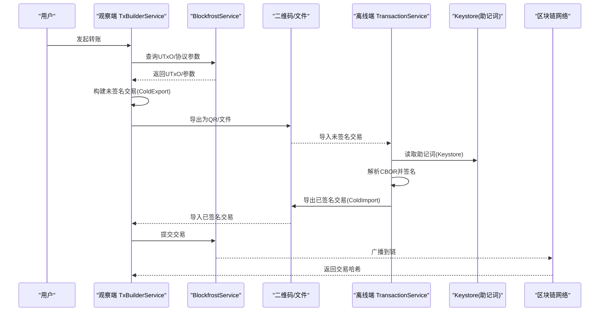
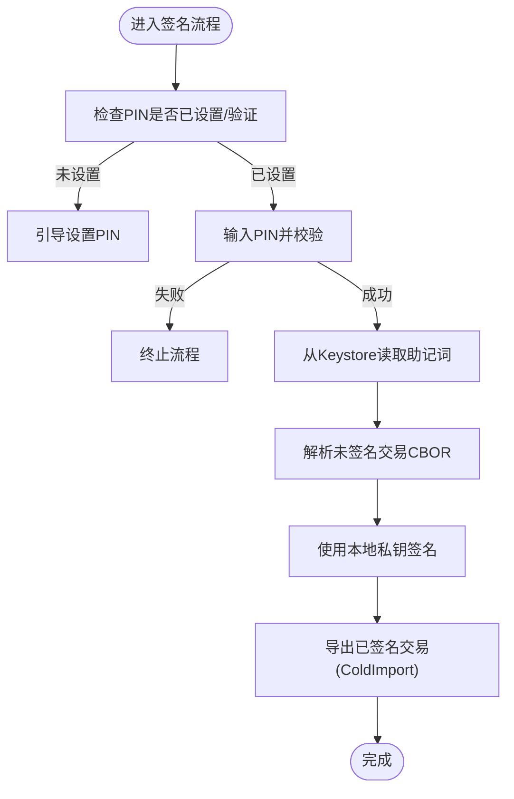
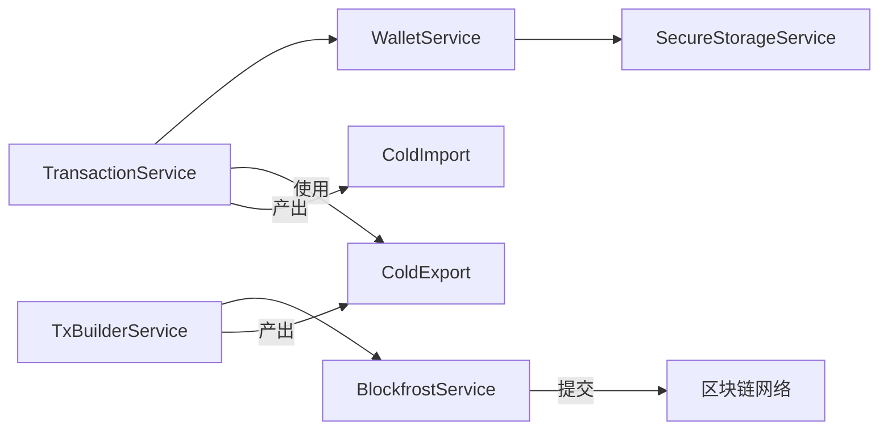

# 安全设计

<cite>
**本文引用的文件**
- [coldwallet-app/lib/main.dart](file://coldwallet-app/lib/main.dart)
- [coldwallet-watch/lib/main.dart](file://coldwallet-watch/lib/main.dart)
- [coldwallet-watch/lib/app.dart](file://coldwallet-watch/lib/app.dart)
- [coldwallet-app/lib/services/secure_storage_service.dart](file://coldwallet-app/lib/services/secure_storage_service.dart)
- [coldwallet-app/lib/services/wallet_service.dart](file://coldwallet-app/lib/services/wallet_service.dart)
- [coldwallet-app/lib/services/transaction_service.dart](file://coldwallet-app/lib/services/transaction_service.dart)
- [coldwallet-app/lib/models/cold_export.dart](file://coldwallet-app/lib/models/cold_export.dart)
- [coldwallet-app/lib/models/cold_import.dart](file://coldwallet-app/lib/models/cold_import.dart)
- [coldwallet-watch/lib/services/blockfrost_service.dart](file://coldwallet-watch/lib/services/blockfrost_service.dart)
- [coldwallet-watch/lib/services/tx_builder_service.dart](file://coldwallet-watch/lib/services/tx_builder_service.dart)
- [cold-wallet-plugin.md](file://cold-wallet-plugin.md)
</cite>

## 目录
1. [简介](#简介)
2. [项目结构](#项目结构)
3. [核心组件](#核心组件)
4. [架构总览](#架构总览)
5. [详细组件分析](#详细组件分析)
6. [依赖关系分析](#依赖关系分析)
7. [性能与安全特性](#性能与安全特性)
8. [故障排除指南](#故障排除指南)
9. [结论](#结论)
10. [附录：配置与合规建议](#附录配置与合规建议)

## 简介
本文件面向 ColdWallet 的安全设计，聚焦离线签名安全模型、私钥保护机制、助记词安全管理、PIN 码验证流程、Android Keystore 集成、数据加密策略、QR 码数据传输安全、交易签名完整性验证、网络通信安全防护，以及威胁分析与合规性考虑。文档基于仓库中已实现的 Flutter 冷钱包应用（离线端）与观察钱包应用（联网端），结合插件设计说明进行系统化阐述。

## 项目结构
- 离线签名端（coldwallet-app）：负责助记词管理、地址派生、PIN 设置与校验、未签名交易解析与签名、导出已签名交易。敏感数据通过 Android Keystore 加密存储。
- 联网观察端（coldwallet-watch）：负责查询链上数据、构建未签名交易、提交已签名交易。
- 插件设计说明（cold-wallet-plugin.md）：描述浏览器插件与离线设备之间的二维码/文件传输流程与安全边界。

图表来源
- [coldwallet-app/lib/main.dart:1-51](file://coldwallet-app/lib/main.dart#L1-L51)
- [coldwallet-watch/lib/main.dart:1-12](file://coldwallet-watch/lib/main.dart#L1-L12)
- [coldwallet-watch/lib/app.dart:1-40](file://coldwallet-watch/lib/app.dart#L1-L40)
- [coldwallet-app/lib/services/wallet_service.dart:1-208](file://coldwallet-app/lib/services/wallet_service.dart#L1-L208)
- [coldwallet-app/lib/services/secure_storage_service.dart:1-107](file://coldwallet-app/lib/services/secure_storage_service.dart#L1-L107)
- [coldwallet-app/lib/services/transaction_service.dart:1-70](file://coldwallet-app/lib/services/transaction_service.dart#L1-L70)
- [coldwallet-app/lib/models/cold_export.dart:1-109](file://coldwallet-app/lib/models/cold_export.dart#L1-L109)
- [coldwallet-app/lib/models/cold_import.dart:1-36](file://coldwallet-app/lib/models/cold_import.dart#L1-L36)
- [coldwallet-watch/lib/services/tx_builder_service.dart:1-152](file://coldwallet-watch/lib/services/tx_builder_service.dart#L1-L152)
- [coldwallet-watch/lib/services/blockfrost_service.dart:1-109](file://coldwallet-watch/lib/services/blockfrost_service.dart#L1-L109)

章节来源
- [coldwallet-app/lib/main.dart:1-51](file://coldwallet-app/lib/main.dart#L1-L51)
- [coldwallet-watch/lib/main.dart:1-12](file://coldwallet-watch/lib/main.dart#L1-L12)
- [coldwallet-watch/lib/app.dart:1-40](file://coldwallet-watch/lib/app.dart#L1-L40)

## 核心组件
- 安全存储服务（SecureStorageService）：使用 flutter_secure_storage 将助记词、PIN、钱包列表等敏感数据写入 Android Keystore 加密存储；提供钱包列表、当前钱包、网络设置、PIN 存取与校验能力。
- 钱包服务（WalletService）：生成/导入助记词、派生 Cardano 地址、管理多钱包、切换当前钱包、网络设置、钱包增删与重置。
- 交易服务（TransactionService）：解析未签名交易（ColdExport）、加载当前助记词并签名、计算交易哈希、输出已签名交易（ColdImport）。
- 观察端交易构建（TxBuilderService）：从 Blockfrost 获取 UTxO 与协议参数，构建 ADA 转账的未签名交易，迭代收敛手续费后输出 ColdExport。
- 网络服务（BlockfrostService）：封装对 Blockfrost REST API 的请求，包括 UTxO、余额、最新区块、协议参数与提交交易。

章节来源
- [coldwallet-app/lib/services/secure_storage_service.dart:1-107](file://coldwallet-app/lib/services/secure_storage_service.dart#L1-L107)
- [coldwallet-app/lib/services/wallet_service.dart:1-208](file://coldwallet-app/lib/services/wallet_service.dart#L1-L208)
- [coldwallet-app/lib/services/transaction_service.dart:1-70](file://coldwallet-app/lib/services/transaction_service.dart#L1-L70)
- [coldwallet-watch/lib/services/tx_builder_service.dart:1-152](file://coldwallet-watch/lib/services/tx_builder_service.dart#L1-L152)
- [coldwallet-watch/lib/services/blockfrost_service.dart:1-109](file://coldwallet-watch/lib/services/blockfrost_service.dart#L1-L109)

## 架构总览
离线签名端与联网观察端通过 QR 码或文件交换 CBOR 编码的交易体，私钥与助记词仅在离线设备上出现，永不触网。

图表来源
- [coldwallet-watch/lib/services/tx_builder_service.dart:1-152](file://coldwallet-watch/lib/services/tx_builder_service.dart#L1-L152)
- [coldwallet-watch/lib/services/blockfrost_service.dart:1-109](file://coldwallet-watch/lib/services/blockfrost_service.dart#L1-L109)
- [coldwallet-app/lib/services/transaction_service.dart:1-70](file://coldwallet-app/lib/services/transaction_service.dart#L1-L70)
- [coldwallet-app/lib/services/secure_storage_service.dart:1-107](file://coldwallet-app/lib/services/secure_storage_service.dart#L1-L107)
- [coldwallet-app/lib/models/cold_export.dart:1-109](file://coldwallet-app/lib/models/cold_export.dart#L1-L109)
- [coldwallet-app/lib/models/cold_import.dart:1-36](file://coldwallet-app/lib/models/cold_import.dart#L1-L36)

## 详细组件分析

### 离线签名安全模型与私钥保护
- 安全边界：助记词与私钥仅存在于离线设备，不通过网络传输；联网端只处理公钥地址、UTxO、未签名/已签名交易体。
- 存储隔离：每个钱包的助记词以独立 Key 存储在 Keystore，避免单点泄露影响全部资产。
- PIN 保护：PIN 用于解锁敏感操作；当前实现为明文存储占位，需升级为哈希比对。
- 最小权限：交易服务在签名前校验助记词存在性与网络匹配，防止误签。

图表来源
- [coldwallet-app/lib/services/secure_storage_service.dart:78-98](file://coldwallet-app/lib/services/secure_storage_service.dart#L78-L98)
- [coldwallet-app/lib/services/wallet_service.dart:119-127](file://coldwallet-app/lib/services/wallet_service.dart#L119-L127)
- [coldwallet-app/lib/services/transaction_service.dart:30-57](file://coldwallet-app/lib/services/transaction_service.dart#L30-L57)

章节来源
- [coldwallet-app/lib/services/secure_storage_service.dart:1-107](file://coldwallet-app/lib/services/secure_storage_service.dart#L1-L107)
- [coldwallet-app/lib/services/wallet_service.dart:1-208](file://coldwallet-app/lib/services/wallet_service.dart#L1-L208)
- [coldwallet-app/lib/services/transaction_service.dart:1-70](file://coldwallet-app/lib/services/transaction_service.dart#L1-L70)

### 助记词安全管理
- 生成：使用 SDK 内置安全随机源生成 24 词助记词。
- 导入与校验：支持 BIP-39 校验，确保助记词有效性。
- 存储：按钱包 ID 隔离存储至 Keystore，删除时同步清理元数据与当前钱包指针。
- 生命周期：支持多钱包切换、重置所有钱包（保留 PIN）、工厂重置（清空全部）。

章节来源
- [coldwallet-app/lib/services/wallet_service.dart:18-56](file://coldwallet-app/lib/services/wallet_service.dart#L18-L56)
- [coldwallet-app/lib/services/wallet_service.dart:129-192](file://coldwallet-app/lib/services/wallet_service.dart#L129-L192)
- [coldwallet-app/lib/services/secure_storage_service.dart:41-56](file://coldwallet-app/lib/services/secure_storage_service.dart#L41-L56)

### PIN 码验证流程
- 当前实现：保存与读取 PIN，并进行相等比较；代码中标注 TODO 提示应改为哈希比对。
- 建议改进：使用 PBKDF2/Argon2 对 PIN 进行加盐哈希存储，验证时对比哈希值，提升抗暴力破解能力。
- 访问控制：在关键操作（如签名）前强制 PIN 校验，减少误用风险。

章节来源
- [coldwallet-app/lib/services/secure_storage_service.dart:78-98](file://coldwallet-app/lib/services/secure_storage_service.dart#L78-L98)
- [coldwallet-app/lib/services/wallet_service.dart:194-206](file://coldwallet-app/lib/services/wallet_service.dart#L194-L206)

### Android Keystore 集成与数据加密策略
- 集成方式：通过 flutter_secure_storage 将助记词、PIN、钱包列表等写入系统安全存储（Android Keystore）。
- 密钥隔离：每个钱包助记词使用独立 Key，降低泄露面。
- 数据分类：非敏感信息（如网络设置、钱包列表）同样通过安全存储统一管理，便于审计与清理。
- 清理策略：提供 clearAll/factoryReset 等方法，确保彻底移除敏感数据。

章节来源
- [coldwallet-app/lib/services/secure_storage_service.dart:1-23](file://coldwallet-app/lib/services/secure_storage_service.dart#L1-L23)
- [coldwallet-app/lib/services/secure_storage_service.dart:24-77](file://coldwallet-app/lib/services/secure_storage_service.dart#L24-L77)
- [coldwallet-app/lib/services/secure_storage_service.dart:100-107](file://coldwallet-app/lib/services/secure_storage_service.dart#L100-L107)

### QR 码数据传输的安全考虑
- 数据内容：仅传输未签名/已签名交易的 CBOR 编码与摘要信息，不包含私钥或助记词。
- 容量限制：大交易可能超出单个 QR 容量，需提供复制/文件传输备选方案。
- 完整性：接收端需校验版本、类型、网络标识与交易哈希，防止篡改或错配。
- 防重放：引入 TTL/有效期与唯一交易哈希，避免重复提交。

章节来源
- [coldwallet-app/lib/models/cold_export.dart:1-109](file://coldwallet-app/lib/models/cold_export.dart#L1-L109)
- [coldwallet-app/lib/models/cold_import.dart:1-36](file://coldwallet-app/lib/models/cold_import.dart#L1-L36)
- [coldwallet-app/lib/services/transaction_service.dart:48-57](file://coldwallet-app/lib/services/transaction_service.dart#L48-L57)
- [cold-wallet-plugin.md:117-124](file://cold-wallet-plugin.md#L117-L124)

### 交易签名的完整性验证
- 签名过程：离线端解析 CBOR 交易体，使用本地私钥生成见证集，附加到交易中形成已签名交易。
- 哈希计算：采用 blake2b_256 计算交易体哈希，作为唯一标识与完整性校验依据。
- 校验建议：联网端在提交前再次校验交易哈希与内容一致性，确保未被篡改。

章节来源
- [coldwallet-app/lib/services/transaction_service.dart:30-68](file://coldwallet-app/lib/services/transaction_service.dart#L30-L68)

### 网络通信的安全防护
- 传输层：使用 HTTPS 访问 Blockfrost API，确保传输加密。
- 认证：通过 project_id 头进行 API 访问识别；建议在生产环境启用速率限制与异常监控。
- 错误处理：统一捕获 HTTP 状态码与响应体，抛出明确异常以便上层处理。
- 最小暴露：联网端不接触私钥与助记词，仅处理公开信息与交易体。

章节来源
- [coldwallet-watch/lib/services/blockfrost_service.dart:6-41](file://coldwallet-watch/lib/services/blockfrost_service.dart#L6-L41)
- [coldwallet-watch/lib/services/blockfrost_service.dart:43-109](file://coldwallet-watch/lib/services/blockfrost_service.dart#L43-L109)

## 依赖关系分析
- 离线端依赖：cardano_flutter_sdk、cardano_dart_types、bip39_plus、pointycastle、flutter_secure_storage、mobile_scanner、qr_flutter 等。
- 联网端依赖：http、cardano_dart_types、Blockfrost REST API。
- 模块耦合：
  - WalletService 依赖 SecureStorageService 进行敏感数据存取。
  - TransactionService 依赖 WalletService 获取助记词与钱包实例。
  - TxBuilderService 依赖 BlockfrostService 获取链上数据与提交交易。
- 外部接口：Blockfrost API 为唯一网络出口，遵循标准 REST 协议。

图表来源
- [coldwallet-app/lib/services/wallet_service.dart:1-208](file://coldwallet-app/lib/services/wallet_service.dart#L1-L208)
- [coldwallet-app/lib/services/secure_storage_service.dart:1-107](file://coldwallet-app/lib/services/secure_storage_service.dart#L1-L107)
- [coldwallet-app/lib/services/transaction_service.dart:1-70](file://coldwallet-app/lib/services/transaction_service.dart#L1-L70)
- [coldwallet-watch/lib/services/tx_builder_service.dart:1-152](file://coldwallet-watch/lib/services/tx_builder_service.dart#L1-L152)
- [coldwallet-watch/lib/services/blockfrost_service.dart:1-109](file://coldwallet-watch/lib/services/blockfrost_service.dart#L1-L109)
- [coldwallet-app/lib/models/cold_export.dart:1-109](file://coldwallet-app/lib/models/cold_export.dart#L1-L109)
- [coldwallet-app/lib/models/cold_import.dart:1-36](file://coldwallet-app/lib/models/cold_import.dart#L1-L36)

章节来源
- [coldwallet-app/lib/services/wallet_service.dart:1-208](file://coldwallet-app/lib/services/wallet_service.dart#L1-L208)
- [coldwallet-app/lib/services/transaction_service.dart:1-70](file://coldwallet-app/lib/services/transaction_service.dart#L1-L70)
- [coldwallet-watch/lib/services/tx_builder_service.dart:1-152](file://coldwallet-watch/lib/services/tx_builder_service.dart#L1-L152)
- [coldwallet-watch/lib/services/blockfrost_service.dart:1-109](file://coldwallet-watch/lib/services/blockfrost_service.dart#L1-L109)

## 性能与安全特性
- 性能
  - 交易手续费迭代收敛：最多 5 次循环估算费用，平衡构建速度与准确性。
  - UTxO 选择：按金额累加直至满足转账+手续费+最小 UTxO 要求，减少多余输入。
- 安全
  - 离线签名：私钥不出设备，降低泄露风险。
  - 安全存储：Keystore 加密敏感数据，支持批量清理。
  - 完整性校验：blake2b_256 交易哈希确保数据未被篡改。
  - 网络防护：HTTPS + 错误处理，避免中间人攻击与静默失败。

[本节为通用指导，无需具体文件引用]

## 故障排除指南
- PIN 相关
  - 现象：无法签名或访问敏感功能。
  - 排查：确认 PIN 是否已设置；当前实现为明文存储，需尽快升级为哈希比对。
  - 参考路径：[PIN 存取与校验:78-98](file://coldwallet-app/lib/services/secure_storage_service.dart#L78-L98)
- 助记词丢失
  - 现象：签名时报“助记词丢失”。
  - 排查：检查当前钱包是否存在且助记词已正确存储；必要时恢复备份。
  - 参考路径：[助记词加载与错误处理:30-34](file://coldwallet-app/lib/services/transaction_service.dart#L30-L34)
- 网络错误
  - 现象：UTxO 查询或交易提交失败。
  - 排查：检查 Blockfrost API 状态与 project_id；查看 HTTP 状态码与响应体。
  - 参考路径：[Blockfrost 错误处理:43-109](file://coldwallet-watch/lib/services/blockfrost_service.dart#L43-L109)
- QR 容量不足
  - 现象：二维码生成失败或提示数据过大。
  - 处理：改用复制完整签名数据或文件传输方式。
  - 参考路径：[导出界面提示:105-139](file://coldwallet-app/lib/screens/export_signed_screen.dart#L105-L139)

章节来源
- [coldwallet-app/lib/services/secure_storage_service.dart:78-98](file://coldwallet-app/lib/services/secure_storage_service.dart#L78-L98)
- [coldwallet-app/lib/services/transaction_service.dart:30-34](file://coldwallet-app/lib/services/transaction_service.dart#L30-L34)
- [coldwallet-watch/lib/services/blockfrost_service.dart:43-109](file://coldwallet-watch/lib/services/blockfrost_service.dart#L43-L109)
- [coldwallet-app/lib/screens/export_signed_screen.dart:105-139](file://coldwallet-app/lib/screens/export_signed_screen.dart#L105-L139)

## 结论
ColdWallet 通过严格的离线签名安全模型与 Keystore 安全存储，实现了私钥与助记词的本地化保护；通过 QR 码/文件传输 CBOR 交易体，避免了敏感数据外泄；在网络侧采用 HTTPS 与标准化 API 交互，保障通信安全。后续建议完善 PIN 哈希存储、增强 QR 分帧与大交易传输、增加完整性校验与防重放机制，以提升整体安全性与可用性。

[本节为总结性内容，无需具体文件引用]

## 附录：配置与合规建议
- 安全配置
  - 启用 PIN 哈希存储（PBKDF2/Argon2），禁止明文保存 PIN。
  - 限制最大钱包数量与默认网络，减少误操作面。
  - 对大交易启用 Animated QR 或文件传输，确保可移植性。
- 合规性
  - 遵循 CIP-30（dApp 连接）、CIP-45（冷钱包二维码通信）等标准。
  - 日志脱敏：避免记录助记词、私钥、PIN 等敏感信息。
  - 审计与回滚：对关键变更（如网络切换、钱包删除）提供确认与回滚机制。
- 威胁分析与防护
  - 威胁：设备被恶意软件窃取 Keystore 数据；防护：加强系统安全更新与权限最小化。
  - 威胁：QR 码被替换或截获；防护：校验版本、类型、网络与交易哈希。
  - 威胁：网络中间人攻击；防护：强制 HTTPS、证书校验与异常告警。

[本节为通用指导，无需具体文件引用]