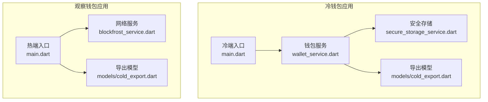
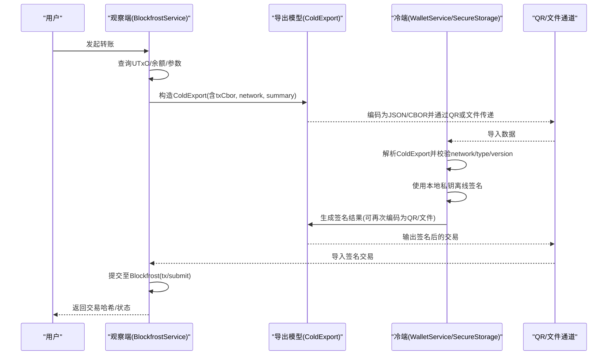
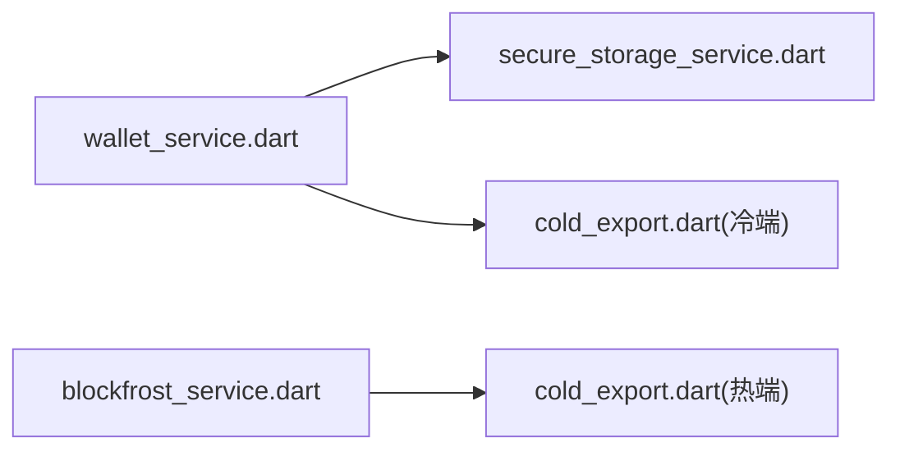

# 数据传输安全

<cite>
**本文引用的文件**
- [coldwallet-app/lib/main.dart](file://coldwallet-app/lib/main.dart)
- [coldwallet-watch/lib/main.dart](file://coldwallet-watch/lib/main.dart)
- [coldwallet-app/lib/services/secure_storage_service.dart](file://coldwallet-app/lib/services/secure_storage_service.dart)
- [coldwallet-app/lib/services/wallet_service.dart](file://coldwallet-app/lib/services/wallet_service.dart)
- [coldwallet-watch/lib/services/blockfrost_service.dart](file://coldwallet-watch/lib/services/blockfrost_service.dart)
- [coldwallet-app/lib/models/cold_export.dart](file://coldwallet-app/lib/models/cold_export.dart)
- [coldwallet-watch/lib/models/cold_export.dart](file://coldwallet-watch/lib/models/cold_export.dart)
</cite>

## 目录
1. [简介](#简介)
2. [项目结构](#项目结构)
3. [核心组件](#核心组件)
4. [架构总览](#架构总览)
5. [详细组件分析](#详细组件分析)
6. [依赖关系分析](#依赖关系分析)
7. [性能考虑](#性能考虑)
8. [故障排除指南](#故障排除指南)
9. [结论](#结论)
10. [附录：配置与最佳实践](#附录：配置与最佳实践)

## 简介
本文件聚焦 ColdWallet 的数据传输安全，覆盖以下关键主题：
- QR 码与文件导入导出的数据编码、完整性校验与安全处理
- 网络通信（Blockfrost API）的安全防护与中间人攻击防护
- 错误处理、重试机制与超时控制建议
- 数据传输安全配置指南、常见问题排查与安全监控建议

本项目采用“冷钱包（离线签名）+ 观察钱包（联网只读）”的架构。冷端通过二维码或文件接收未签名的交易数据，在设备内完成离线签名后，将签名结果以文件或二维码形式交还观察端提交上链。敏感数据（助记词、PIN、钱包列表等）由冷端安全存储提供加密保护，密钥不出设备。

## 项目结构
- 冷钱包应用（coldwallet-app）：负责助记词管理、地址派生、离线签名、安全存储、QR/文件交互入口
- 观察钱包应用（coldwallet-watch）：负责网络查询、交易构建、已签名交易提交、资产余额查询
- 共享模型（cold_export.dart）：定义跨端传输的交易导出数据结构（版本、类型、网络、交易 CBOR、摘要）

图表来源
- [coldwallet-app/lib/main.dart:1-51](file://coldwallet-app/lib/main.dart#L1-L51)
- [coldwallet-watch/lib/main.dart:1-12](file://coldwallet-watch/lib/main.dart#L1-L12)
- [coldwallet-app/lib/services/wallet_service.dart:1-208](file://coldwallet-app/lib/services/wallet_service.dart#L1-L208)
- [coldwallet-app/lib/services/secure_storage_service.dart:1-107](file://coldwallet-app/lib/services/secure_storage_service.dart#L1-L107)
- [coldwallet-watch/lib/services/blockfrost_service.dart:1-109](file://coldwallet-watch/lib/services/blockfrost_service.dart#L1-L109)
- [coldwallet-app/lib/models/cold_export.dart:1-109](file://coldwallet-app/lib/models/cold_export.dart#L1-L109)
- [coldwallet-watch/lib/models/cold_export.dart:1-110](file://coldwallet-watch/lib/models/cold_export.dart#L1-L110)

章节来源
- [coldwallet-app/lib/main.dart:1-51](file://coldwallet-app/lib/main.dart#L1-L51)
- [coldwallet-watch/lib/main.dart:1-12](file://coldwallet-watch/lib/main.dart#L1-L12)

## 核心组件
- 安全存储服务（冷端）：基于系统级安全存储（如 Android Keystore）持久化敏感数据，隔离多钱包助记词、PIN、钱包列表和网络设置
- 钱包服务（冷端）：生成/验证助记词、派生地址、管理钱包生命周期、读写网络设置
- Blockfrost 服务（热端）：封装对 Cardano 网络的 REST 调用，包括 UTxO 查询、余额、协议参数、最新区块、交易提交
- 导出模型（两端）：统一描述待签名交易的结构（版本、类型、网络、CBOR、摘要），用于 QR 码与文件传输

章节来源
- [coldwallet-app/lib/services/secure_storage_service.dart:1-107](file://coldwallet-app/lib/services/secure_storage_service.dart#L1-L107)
- [coldwallet-app/lib/services/wallet_service.dart:1-208](file://coldwallet-app/lib/services/wallet_service.dart#L1-L208)
- [coldwallet-watch/lib/services/blockfrost_service.dart:1-109](file://coldwallet-watch/lib/services/blockfrost_service.dart#L1-L109)
- [coldwallet-app/lib/models/cold_export.dart:1-109](file://coldwallet-app/lib/models/cold_export.dart#L1-L109)
- [coldwallet-watch/lib/models/cold_export.dart:1-110](file://coldwallet-watch/lib/models/cold_export.dart#L1-L110)

## 架构总览
下图展示从热端构建交易到冷端离线签名、再回到热端提交的端到端流程，并标注安全边界与校验点。

图表来源
- [coldwallet-watch/lib/services/blockfrost_service.dart:44-107](file://coldwallet-watch/lib/services/blockfrost_service.dart#L44-L107)
- [coldwallet-watch/lib/models/cold_export.dart:1-110](file://coldwallet-watch/lib/models/cold_export.dart#L1-L110)
- [coldwallet-app/lib/models/cold_export.dart:1-109](file://coldwallet-app/lib/models/cold_export.dart#L1-L109)
- [coldwallet-app/lib/services/wallet_service.dart:60-78](file://coldwallet-app/lib/services/wallet_service.dart#L60-L78)
- [coldwallet-app/lib/services/secure_storage_service.dart:24-56](file://coldwallet-app/lib/services/secure_storage_service.dart#L24-L56)

## 详细组件分析

### QR 码数据传输安全机制
- 数据载体与编码
  - 冷端与热端共用 ColdExport 模型，包含 version、type、network、txCbor、summary
  - 典型做法：将 ColdExport 序列化为 JSON，再对 txCbor（Base16/Base64 表示的 CBOR）进行 QR 分片；或使用紧凑格式减少 QR 密度
- 完整性校验
  - 建议在 QR 载荷中加入字段级校验：version/type/network 必须匹配预期值；txCbor 长度与内容需符合 CBOR 规范
  - 可在应用层增加消息认证码（HMAC）或数字签名（例如用一次性会话密钥对 ColdExport 签名），防止篡改
- 防重放与上下文绑定
  - 引入 nonce/时间戳/会话ID，确保同一份 QR 仅能使用一次
  - 将 network、fromAddress、toAddress、fee 等关键字段纳入签名范围，避免“同签名不同交易”的攻击
- 容错与纠错
  - 选择具备纠错能力的 QR 规格（如 L/M/Q/H），提高扫描成功率
  - 对分片 QR 进行顺序校验与缺失检测，失败时提示重新扫描

章节来源
- [coldwallet-app/lib/models/cold_export.dart:1-109](file://coldwallet-app/lib/models/cold_export.dart#L1-L109)
- [coldwallet-watch/lib/models/cold_export.dart:1-110](file://coldwallet-watch/lib/models/cold_export.dart#L1-L110)

### 文件导入导出的安全处理
- 文件格式与最小权限
  - 推荐 JSON 包裹 ColdExport，便于人类可读与调试；二进制 CBOR 仅在必要时使用
  - 文件写入/读取限制在应用沙箱目录，避免全局路径暴露
- 完整性与来源可信
  - 文件头包含 version/type/network，并在导入时严格校验
  - 可选：对文件附加 HMAC 或数字签名，导入端验证后再解析
- 清理与泄露防护
  - 临时文件使用后及时删除；日志中脱敏显示交易摘要而非完整 CBOR
  - 禁止将 txCbor 或助记词写入系统剪贴板或日志

章节来源
- [coldwallet-app/lib/models/cold_export.dart:1-109](file://coldwallet-app/lib/models/cold_export.dart#L1-L109)
- [coldwallet-watch/lib/models/cold_export.dart:1-110](file://coldwallet-watch/lib/models/cold_export.dart#L1-L110)

### 网络通信的安全防护（Blockfrost）
- 传输加密
  - 所有请求均通过 HTTPS 访问 Blockfrost 端点，启用证书校验，拒绝自签证书
- 身份与鉴权
  - 使用 project_id 作为 API Key 传入请求头；Key 应来自受保护的配置源，避免硬编码
- 输入与响应校验
  - 对返回 JSON 做严格解析；非 200 状态码抛出异常并记录必要上下文（URL、网络、错误片段）
- 中间人攻击防护
  - 固定域名白名单；禁用不安全的降级协议
  - 建议启用证书锁定（Certificate Pinning）以增强抗 MITM 能力
- 敏感信息最小化
  - 日志中不包含 project_id、助记词、完整 txCbor；仅记录必要元数据

章节来源
- [coldwallet-watch/lib/services/blockfrost_service.dart:1-109](file://coldwallet-watch/lib/services/blockfrost_service.dart#L1-L109)

### 中间人攻击防护措施
- 强制 HTTPS + 证书校验
- 域名白名单与证书锁定
- 客户端指纹/设备信任绑定（可选）
- 对关键操作（如提交交易）要求二次确认与屏幕可审计信息（发送方、接收方、金额、手续费）

[本节为通用安全建议，不直接分析具体文件]

### 错误处理、重试机制与超时控制
- 错误分类
  - 网络错误（连接失败、超时、DNS 解析失败）
  - 业务错误（Blockfrost 返回非 200、参数非法、交易被拒）
  - 数据错误（QR/文件解析失败、字段缺失、版本不兼容）
- 重试策略
  - 指数退避重试（如 1s、2s、4s...），限制最大重试次数
  - 区分可重试与不可重试错误（如 4xx 通常不可重试）
- 超时控制
  - 为 HTTP 请求设置合理超时（如 10-30s），避免长时间阻塞
  - 大文件/大数据 QR 分片传输时，设置分段超时与进度反馈
- 用户体验
  - 明确错误提示（网络问题 vs 数据损坏 vs 服务端错误）
  - 允许用户取消长耗时操作

[本节为通用实现建议，不直接分析具体文件]

### 安全配置指南
- 网络配置
  - 指定 network（mainnet/testnet/preview），与 ColdExport.network 保持一致
  - 配置 Blockfrost project_id，优先从安全配置中心或环境变量注入
- 安全存储（冷端）
  - 使用系统安全存储保存助记词、PIN、钱包列表
  - PIN 建议改为哈希存储（如 argon2/PBKDF2），当前实现为 TODO 改进项
- 传输配置
  - 启用 HTTPS 与证书校验；必要时启用证书锁定
  - 对 QR/文件传输启用完整性校验（HMAC/签名）与版本检查
- 日志与监控
  - 脱敏日志；记录错误类型、网络、版本、摘要（不含敏感字段）
  - 上报关键事件（导入成功/失败、提交成功/失败）

章节来源
- [coldwallet-app/lib/services/secure_storage_service.dart:78-106](file://coldwallet-app/lib/services/secure_storage_service.dart#L78-L106)
- [coldwallet-watch/lib/services/blockfrost_service.dart:34-41](file://coldwallet-watch/lib/services/blockfrost_service.dart#L34-L41)
- [coldwallet-app/lib/models/cold_export.dart:1-109](file://coldwallet-app/lib/models/cold_export.dart#L1-L109)
- [coldwallet-watch/lib/models/cold_export.dart:1-110](file://coldwallet-watch/lib/models/cold_export.dart#L1-L110)

### 常见传输问题的故障排除
- QR 无法识别/频繁失败
  - 检查 QR 纠错等级与尺寸；确认分片顺序与完整性
  - 核对 ColdExport.version/type/network 是否一致
- 文件导入失败
  - 校验 JSON/CBOR 格式；检查字段缺失或类型不匹配
  - 确认文件未被第三方修改（HMAC/签名校验）
- 网络请求失败
  - 检查 HTTPS 可达性与证书有效性
  - 查看 Blockfrost 返回码与错误体；根据错误类型决定重试或终止
- 交易提交失败
  - 确认 txCbor 有效且与摘要一致
  - 检查网络参数（最小 UTxO、手续费）与账户余额

章节来源
- [coldwallet-watch/lib/services/blockfrost_service.dart:44-107](file://coldwallet-watch/lib/services/blockfrost_service.dart#L44-L107)
- [coldwallet-app/lib/models/cold_export.dart:1-109](file://coldwallet-app/lib/models/cold_export.dart#L1-L109)
- [coldwallet-watch/lib/models/cold_export.dart:1-110](file://coldwallet-watch/lib/models/cold_export.dart#L1-L110)

### 安全监控建议
- 指标采集
  - 导入成功率、解析失败率、提交成功率、平均耗时
  - 网络错误分布（超时、DNS、TLS 握手失败）
- 告警规则
  - 连续失败阈值、异常错误占比突增、证书校验失败
- 审计与合规
  - 记录关键操作的审计日志（脱敏）
  - 定期审查配置变更（API Key、网络、版本）

[本节为通用监控建议，不直接分析具体文件]

## 依赖关系分析
- 冷端依赖
  - wallet_service 依赖 secure_storage_service 获取/保存敏感数据
  - cold_export 模型用于跨端数据交换
- 热端依赖
  - blockfrost_service 依赖 http 客户端访问 Blockfrost REST API
  - cold_export 模型用于构建待签名交易数据

图表来源
- [coldwallet-app/lib/services/wallet_service.dart:1-208](file://coldwallet-app/lib/services/wallet_service.dart#L1-L208)
- [coldwallet-app/lib/services/secure_storage_service.dart:1-107](file://coldwallet-app/lib/services/secure_storage_service.dart#L1-L107)
- [coldwallet-app/lib/models/cold_export.dart:1-109](file://coldwallet-app/lib/models/cold_export.dart#L1-L109)
- [coldwallet-watch/lib/services/blockfrost_service.dart:1-109](file://coldwallet-watch/lib/services/blockfrost_service.dart#L1-L109)
- [coldwallet-watch/lib/models/cold_export.dart:1-110](file://coldwallet-watch/lib/models/cold_export.dart#L1-L110)

章节来源
- [coldwallet-app/lib/services/wallet_service.dart:1-208](file://coldwallet-app/lib/services/wallet_service.dart#L1-L208)
- [coldwallet-watch/lib/services/blockfrost_service.dart:1-109](file://coldwallet-watch/lib/services/blockfrost_service.dart#L1-L109)

## 性能考虑
- QR 传输
  - 控制单帧数据量，合理分片；选择高纠错等级提升鲁棒性
  - 预计算摘要与校验，减少重复计算
- 网络请求
  - 复用 HTTP 客户端；合理设置超时与并发上限
  - 缓存只读数据（如协议参数、最新区块）以减少请求频率
- 内存与序列化
  - 避免在大对象上频繁 GC；按需解析 CBOR/JSON
  - 使用流式处理大文件，降低峰值内存

[本节为通用性能建议，不直接分析具体文件]

## 故障排除指南
- 快速定位
  - 检查 ColdExport.version/type/network 是否匹配
  - 校验 txCbor 是否为合法 CBOR（长度、头部字节）
  - 查看 Blockfrost 返回码与错误体，判断是参数错误还是网络问题
- 常见错误与对策
  - 4xx：修正请求参数或网络设置
  - 5xx：稍后重试或联系服务提供方
  - TLS/证书错误：检查系统时间、证书链与域名
- 恢复步骤
  - 清除临时文件与缓存
  - 重新生成 ColdExport 并重新扫码/导入
  - 若持续失败，切换网络（testnet/preview）验证

章节来源
- [coldwallet-watch/lib/services/blockfrost_service.dart:44-107](file://coldwallet-watch/lib/services/blockfrost_service.dart#L44-L107)
- [coldwallet-app/lib/models/cold_export.dart:1-109](file://coldwallet-app/lib/models/cold_export.dart#L1-L109)
- [coldwallet-watch/lib/models/cold_export.dart:1-110](file://coldwallet-watch/lib/models/cold_export.dart#L1-L110)

## 结论
ColdWallet 通过“离线签名 + 安全存储 + 结构化传输模型”实现了端到端的数据传输安全。为确保更高安全性，建议：
- 在传输层引入 HMAC/签名与版本/网络强校验
- 启用证书锁定与严格的 HTTPS 策略
- 完善错误分类、重试与超时控制
- 建立完善的监控与审计体系，持续发现与修复风险

[本节为总结性内容，不直接分析具体文件]

## 附录：配置与最佳实践
- 配置清单
  - 网络：mainnet/testnet/preview（与 ColdExport.network 一致）
  - API Key：project_id（来自安全配置源）
  - 安全存储：启用系统安全存储，PIN 哈希化
  - 传输：HTTPS、证书校验、可选证书锁定
- 最佳实践
  - 最小权限原则：仅暴露必要字段
  - 可审计性：用户界面清晰展示交易关键信息
  - 可恢复性：支持断点续传与分片重传
  - 可观测性：记录脱敏日志与关键指标

[本节为通用配置建议，不直接分析具体文件]