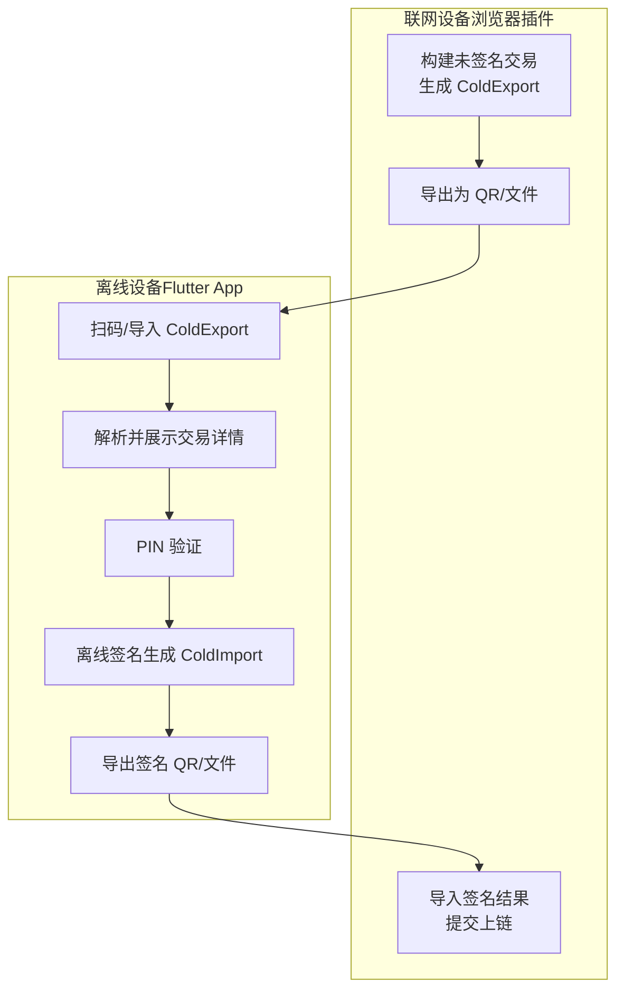
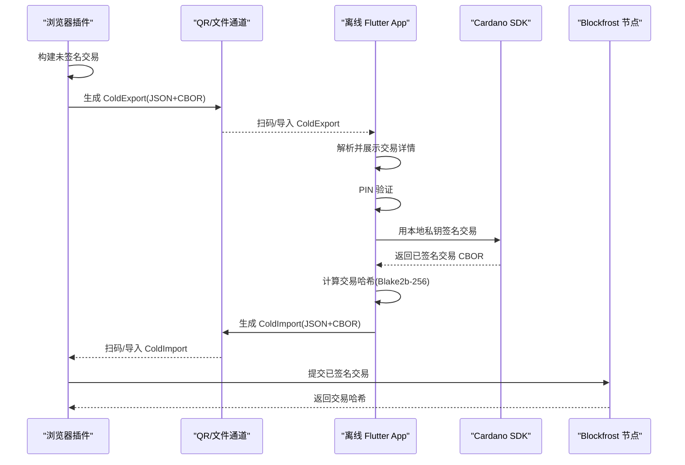
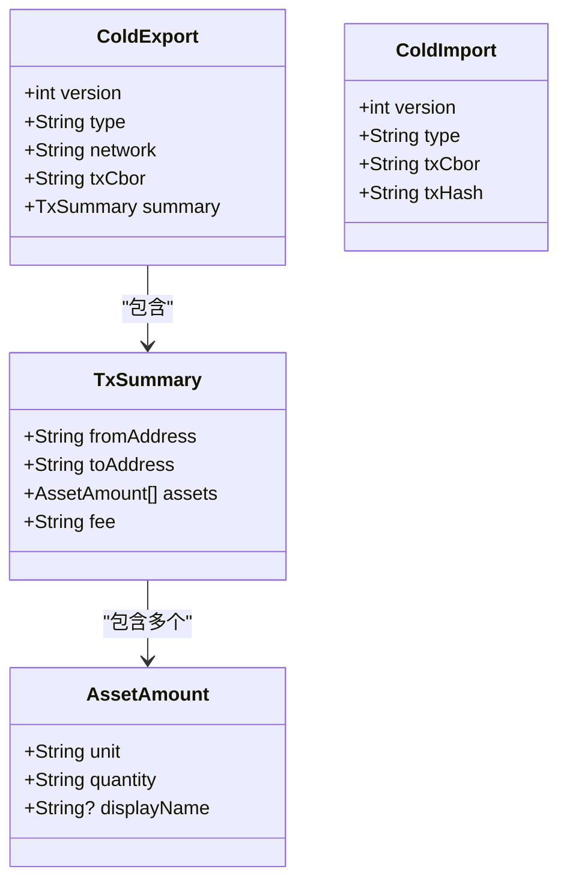
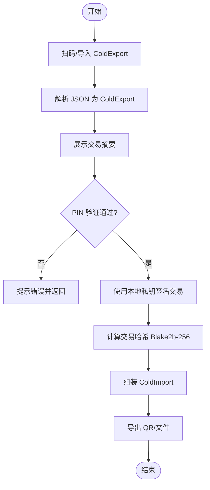
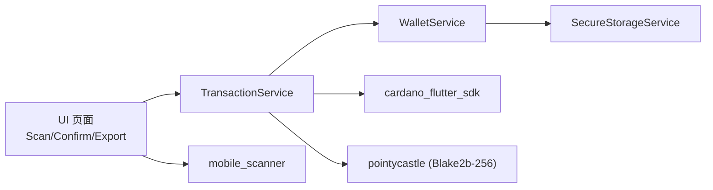

# 离线签名安全

<cite>
**本文引用的文件**
- [cold-wallet-plugin.md](file://cold-wallet-plugin.md)
- [2026-08-10-cold-wallet-design.md](file://docs/superpowers/specs/2026-08-10-cold-wallet-design.md)
- [2026-08-11-cold-wallet-app.md](file://docs/superpowers/plans/2026-08-11-cold-wallet-app.md)
- [cold_export.dart](file://coldwallet-app/lib/models/cold_export.dart)
- [cold_import.dart](file://coldwallet-watch/lib/models/cold_import.dart)
- [transaction_service.dart](file://coldwallet-app/lib/services/transaction_service.dart)
- [wallet_service.dart](file://coldwallet-app/lib/services/wallet_service.dart)
- [secure_storage_service.dart](file://coldwallet-app/lib/services/secure_storage_service.dart)
- [confirm_sign_screen.dart](file://coldwallet-app/lib/screens/confirm_sign_screen.dart)
- [scan_tx_screen.dart](file://coldwallet-app/lib/screens/scan_tx_screen.dart)
- [qr_scanner.dart](file://coldwallet-watch/lib/widgets/qr_scanner.dart)
- [blockfrost_service.dart](file://coldwallet-watch/lib/services/blockfrost_service.dart)
</cite>

## 目录
1. [简介](#简介)
2. [项目结构](#项目结构)
3. [核心组件](#核心组件)
4. [架构总览](#架构总览)
5. [详细组件分析](#详细组件分析)
6. [依赖关系分析](#依赖关系分析)
7. [性能与安全特性](#性能与安全特性)
8. [故障排查指南](#故障排查指南)
9. [结论](#结论)
10. [附录：最佳实践与配置清单](#附录最佳实践与配置清单)

## 简介
本文件围绕 ColdWallet 的离线签名安全进行系统化说明，覆盖冷钱包的安全模型、私钥在离线环境中的保护机制、交易签名的完整性验证流程、ColdExport/ColdImport 数据格式的安全设计、QR 码数据传输的安全性考虑、未签名交易到已签名交易的转换过程、签名算法选择、防篡改与重放攻击防护策略，以及离线签名的最佳实践与安全配置建议。

## 项目结构
仓库包含三个主要部分：
- 浏览器插件（联网设备）：负责只读登录、余额查询、构建未签名交易、生成 QR/文件导出、导入签名结果并提交上链。
- Flutter 离线签名 App（仅 Android）：负责扫码或导入未签名交易、展示详情、PIN 验证后使用本地私钥签名、输出已签名交易 QR/文件。
- Watch 端（示例/辅助）：提供二维码扫描组件与 Blockfrost 提交接口等能力。

图表来源
- [2026-08-10-cold-wallet-design.md:32-62](file://docs/superpowers/specs/2026-08-10-cold-wallet-design.md#L32-L62)
- [cold-wallet-plugin.md:22-51](file://cold-wallet-plugin.md#L22-L51)

章节来源
- [2026-08-10-cold-wallet-design.md:10-31](file://docs/superpowers/specs/2026-08-10-cold-wallet-design.md#L10-L31)
- [cold-wallet-plugin.md:10-21](file://cold-wallet-plugin.md#L10-L21)

## 核心组件
- 数据交换格式
  - ColdExport：包含未签名交易 CBOR hex、网络标识与摘要信息（发送方、接收方、资产列表、手续费），用于从联网设备传递到离线设备。
  - ColdImport：包含已签名交易 CBOR hex 与交易哈希，用于从离线设备传回联网设备提交上链。
- 钱包服务
  - 助记词生成/校验、地址派生（CIP-1852）、多钱包管理、PIN 设置与验证。
- 交易服务
  - 解析 ColdExport、调用 SDK 对交易签名、计算交易哈希（Blake2b-256）、组装 ColdImport。
- 安全存储
  - 通过 Android Keystore（flutter_secure_storage）加密保存助记词、PIN、钱包元数据；App 无网络请求，确保私钥不出设备。
- 扫码与导出
  - 摄像头扫码读取 JSON 格式的 ColdExport；签名后以 QR/文件形式导出 ColdImport。

章节来源
- [cold_export.dart:1-109](file://coldwallet-app/lib/models/cold_export.dart#L1-L109)
- [cold_import.dart:1-35](file://coldwallet-watch/lib/models/cold_import.dart#L1-L35)
- [wallet_service.dart:1-208](file://coldwallet-app/lib/services/wallet_service.dart#L1-L208)
- [transaction_service.dart:1-70](file://coldwallet-app/lib/services/transaction_service.dart#L1-L70)
- [secure_storage_service.dart:1-33](file://coldwallet-app/lib/services/secure_storage_service.dart#L1-L33)

## 架构总览
整体采用“热-冷”分离架构：
- 联网设备（插件）不持有私钥，仅负责构建未签名交易与提交已签名交易。
- 离线设备（Flutter App）持有私钥，完全离线执行签名，私钥永不触网。
- 两端通过 ColdExport/ColdImport 的 JSON+CBOR 格式交互，支持 QR 码与文件传输。

图表来源
- [2026-08-10-cold-wallet-design.md:338-345](file://docs/superpowers/specs/2026-08-10-cold-wallet-design.md#L338-L345)
- [transaction_service.dart:30-57](file://coldwallet-app/lib/services/transaction_service.dart#L30-L57)
- [blockfrost_service.dart:92-108](file://coldwallet-watch/lib/services/blockfrost_service.dart#L92-L108)

## 详细组件分析

### 数据交换格式：ColdExport / ColdImport
- ColdExport
  - 字段：version、type="unsigned-tx"、network、txCbor（未签名交易 CBOR hex）、summary（fromAddress、toAddress、assets、fee）。
  - 用途：将未签名交易及人类可读摘要从联网设备传递给离线设备。
- ColdImport
  - 字段：version、type="signed-tx"、txCbor（已签名交易 CBOR hex）、txHash（交易哈希）。
  - 用途：将签名后的交易与哈希传回联网设备提交上链。

图表来源
- [cold_export.dart:1-109](file://coldwallet-app/lib/models/cold_export.dart#L1-L109)
- [cold_import.dart:1-35](file://coldwallet-watch/lib/models/cold_import.dart#L1-L35)

章节来源
- [cold_export.dart:1-109](file://coldwallet-app/lib/models/cold_export.dart#L1-L109)
- [cold_import.dart:1-35](file://coldwallet-watch/lib/models/cold_import.dart#L1-L35)
- [2026-08-10-cold-wallet-design.md:299-350](file://docs/superpowers/specs/2026-08-10-cold-wallet-design.md#L299-L350)

### 离线签名流程：从 ColdExport 到 ColdImport
- 解析与展示：App 扫码读取 JSON，反序列化为 ColdExport，展示交易摘要供用户确认。
- 权限控制：输入 6 位 PIN，验证通过后进入签名流程。
- 签名与哈希：使用 Cardano SDK 对交易签名，计算 Blake2b-256 交易哈希，组装 ColdImport。
- 导出：生成 QR/文件，便于传回联网设备。

图表来源
- [scan_tx_screen.dart:20-47](file://coldwallet-app/lib/screens/scan_tx_screen.dart#L20-L47)
- [confirm_sign_screen.dart:29-60](file://coldwallet-app/lib/screens/confirm_sign_screen.dart#L29-L60)
- [transaction_service.dart:30-57](file://coldwallet-app/lib/services/transaction_service.dart#L30-L57)

章节来源
- [scan_tx_screen.dart:1-87](file://coldwallet-app/lib/screens/scan_tx_screen.dart#L1-L87)
- [confirm_sign_screen.dart:1-150](file://coldwallet-app/lib/screens/confirm_sign_screen.dart#L1-L150)
- [transaction_service.dart:1-70](file://coldwallet-app/lib/services/transaction_service.dart#L1-L70)

### 私钥保护与访问控制
- 私钥来源：助记词经 CIP-1852 派生得到支付私钥，仅在离线设备内存中短暂存在，不参与网络传输。
- 安全存储：助记词、PIN、钱包元数据通过 flutter_secure_storage（Android Keystore）加密保存。
- 访问控制：签名前强制 PIN 验证；App 无网络请求代码，避免私钥泄露。
- 多钱包隔离：每个钱包独立助记词，按 ID 隔离存储，支持最多 5 个钱包。

章节来源
- [wallet_service.dart:18-78](file://coldwallet-app/lib/services/wallet_service.dart#L18-L78)
- [wallet_service.dart:94-175](file://coldwallet-app/lib/services/wallet_service.dart#L94-L175)
- [secure_storage_service.dart:1-33](file://coldwallet-app/lib/services/secure_storage_service.dart#L1-L33)
- [2026-08-10-cold-wallet-design.md:269-282](file://docs/superpowers/specs/2026-08-10-cold-wallet-design.md#L269-L282)

### QR 码数据传输安全性
- 数据形态：ColdExport/ColdImport 外层为 JSON，内含 CBOR hex 的交易体，不含私钥。
- 容量限制：单 QR 码可承载约 3KB；MVP 场景下 JSON 体积较小，适合单码传输。
- 传输风险缓解：
  - 交易内容需用户人工核对摘要后再签名。
  - 签名前 PIN 验证，防止误操作或被诱导签名。
  - 大交易后续可扩展 Animated QR 分帧传输（MVP 暂不涉及）。

章节来源
- [2026-08-10-cold-wallet-design.md:338-350](file://docs/superpowers/specs/2026-08-10-cold-wallet-design.md#L338-L350)
- [qr_scanner.dart:1-25](file://coldwallet-watch/lib/widgets/qr_scanner.dart#L1-L25)

### 签名算法与完整性验证
- 签名算法：基于 Cardano 的 Ed25519（CIP-1852 BIP32-Ed25519），由 cardano_flutter_sdk 完成签名。
- 完整性验证：
  - 交易哈希 = Blake2b-256(transaction body)，用于 ColdImport 中携带，便于联网端校验与追踪。
  - 提交时 Blockfrost 返回交易哈希，可用于最终一致性确认。

章节来源
- [transaction_service.dart:48-68](file://coldwallet-app/lib/services/transaction_service.dart#L48-L68)
- [blockfrost_service.dart:92-108](file://coldwallet-watch/lib/services/blockfrost_service.dart#L92-L108)
- [2026-08-10-cold-wallet-design.md:283-297](file://docs/superpowers/specs/2026-08-10-cold-wallet-design.md#L283-L297)

### 防篡改与重放攻击防护
- 防篡改：
  - 交易体为 CBOR，任何修改会导致哈希变化；ColdImport 携带 txHash，联网端可据此校验。
  - 签名由私钥完成，无法伪造。
- 重放攻击防护：
  - Cardano 网络层通过 UTXO 模型与唯一交易哈希天然抑制重复提交；同一笔交易哈希不可重复入账。
  - 建议在联网端记录已提交交易哈希，避免重复广播。

章节来源
- [transaction_service.dart:48-57](file://coldwallet-app/lib/services/transaction_service.dart#L48-L57)
- [blockfrost_service.dart:92-108](file://coldwallet-watch/lib/services/blockfrost_service.dart#L92-L108)
- [cold-wallet-plugin.md:127-150](file://cold-wallet-plugin.md#L127-L150)

## 依赖关系分析
- 模块耦合
  - TransactionService 依赖 WalletService（获取助记词、创建钱包）与 Cardano SDK（签名、序列化）。
  - SecureStorageService 提供敏感数据持久化，被 WalletService 调用。
  - UI 层（Scan/Confirm/Export）通过 Service 层驱动业务逻辑。
- 外部依赖
  - cardano_flutter_sdk：CIP-1852、签名、地址派生。
  - pointycastle：Blake2b-256 哈希。
  - mobile_scanner：二维码扫描。
  - flutter_secure_storage：Android Keystore 安全存储。

图表来源
- [transaction_service.dart:1-70](file://coldwallet-app/lib/services/transaction_service.dart#L1-L70)
- [wallet_service.dart:1-208](file://coldwallet-app/lib/services/wallet_service.dart#L1-L208)
- [secure_storage_service.dart:1-33](file://coldwallet-app/lib/services/secure_storage_service.dart#L1-L33)

章节来源
- [transaction_service.dart:1-70](file://coldwallet-app/lib/services/transaction_service.dart#L1-L70)
- [wallet_service.dart:1-208](file://coldwallet-app/lib/services/wallet_service.dart#L1-L208)
- [secure_storage_service.dart:1-33](file://coldwallet-app/lib/services/secure_storage_service.dart#L1-L33)

## 性能与安全特性
- 性能
  - MVP 场景交易体积小，单 QR 码即可承载，减少传输开销。
  - 签名在本地完成，无网络延迟；提交阶段才与 Blockfrost 通信。
- 安全
  - 私钥不出设备，仅内存临时驻留；PIN 双重保障。
  - 交易哈希与签名保证完整性与不可伪造性。
  - 网络隔离：App 无 HTTP 库，降低攻击面。

[本节为通用指导，无需特定文件引用]

## 故障排查指南
- 二维码解析失败
  - 现象：扫码后提示无法解析。
  - 排查：检查 QR 内容是否为有效 JSON；确认版本与类型字段正确。
  - 参考路径：[scan_tx_screen.dart:32-46](file://coldwallet-app/lib/screens/scan_tx_screen.dart#L32-L46)
- PIN 验证失败
  - 现象：输入 PIN 后提示错误或无法签名。
  - 排查：确认 PIN 长度与格式；检查是否已设置 PIN。
  - 参考路径：[confirm_sign_screen.dart:29-41](file://coldwallet-app/lib/screens/confirm_sign_screen.dart#L29-L41)
- 签名异常
  - 现象：签名过程中抛出异常。
  - 排查：检查助记词是否加载成功；确认网络参数（测试网/主网）；核对交易 CBOR 有效性。
  - 参考路径：[transaction_service.dart:30-57](file://coldwallet-app/lib/services/transaction_service.dart#L30-L57)
- 提交失败
  - 现象：Blockfrost 返回非 200。
  - 排查：检查 API Key、Content-Type、CBOR 字节流是否正确。
  - 参考路径：[blockfrost_service.dart:92-108](file://coldwallet-watch/lib/services/blockfrost_service.dart#L92-L108)

章节来源
- [scan_tx_screen.dart:20-47](file://coldwallet-app/lib/screens/scan_tx_screen.dart#L20-L47)
- [confirm_sign_screen.dart:29-60](file://coldwallet-app/lib/screens/confirm_sign_screen.dart#L29-L60)
- [transaction_service.dart:30-57](file://coldwallet-app/lib/services/transaction_service.dart#L30-L57)
- [blockfrost_service.dart:92-108](file://coldwallet-watch/lib/services/blockfrost_service.dart#L92-L108)

## 结论
ColdWallet 的离线签名方案通过“热-冷”分离、严格的私钥保护、明确的 ColdExport/ColdImport 数据契约与 QR/文件传输通道，实现了高安全性的交易签名流程。结合 PIN 验证、Blake2b-256 交易哈希与 Cardano 网络层的 UTXO 模型，系统具备防篡改与抗重放能力。未来可在大交易分帧、多账户、硬件钱包集成等方面持续演进。

[本节为总结性内容，无需特定文件引用]

## 附录：最佳实践与配置清单
- 离线签名最佳实践
  - 始终在离线设备上完成签名，私钥绝不离开设备。
  - 每次签名前人工核对交易摘要（发送方、接收方、金额、手续费）。
  - 启用 PIN 验证，避免误操作或被诱导签名。
  - 使用官方或可信渠道下载 App，确保构建透明可审计。
- 安全配置建议
  - 使用 CIP-1852 派生路径，确保地址与密钥符合规范。
  - 通过 flutter_secure_storage 加密存储助记词与 PIN。
  - 联网端记录已提交交易哈希，避免重复广播。
  - 大交易场景采用 Animated QR 或文件传输，避免 QR 容量不足。
- 参考实现位置
  - 数据格式定义：[cold_export.dart:1-109](file://coldwallet-app/lib/models/cold_export.dart#L1-L109)、[cold_import.dart:1-35](file://coldwallet-watch/lib/models/cold_import.dart#L1-L35)
  - 签名流程：[transaction_service.dart:30-57](file://coldwallet-app/lib/services/transaction_service.dart#L30-L57)
  - 安全存储：[secure_storage_service.dart:1-33](file://coldwallet-app/lib/services/secure_storage_service.dart#L1-L33)
  - 扫码与导出：[scan_tx_screen.dart:20-47](file://coldwallet-app/lib/screens/scan_tx_screen.dart#L20-L47)、[qr_scanner.dart:1-25](file://coldwallet-watch/lib/widgets/qr_scanner.dart#L1-L25)

章节来源
- [cold_export.dart:1-109](file://coldwallet-app/lib/models/cold_export.dart#L1-L109)
- [cold_import.dart:1-35](file://coldwallet-watch/lib/models/cold_import.dart#L1-L35)
- [transaction_service.dart:30-57](file://coldwallet-app/lib/services/transaction_service.dart#L30-L57)
- [secure_storage_service.dart:1-33](file://coldwallet-app/lib/services/secure_storage_service.dart#L1-L33)
- [scan_tx_screen.dart:20-47](file://coldwallet-app/lib/screens/scan_tx_screen.dart#L20-L47)
- [qr_scanner.dart:1-25](file://coldwallet-watch/lib/widgets/qr_scanner.dart#L1-L25)