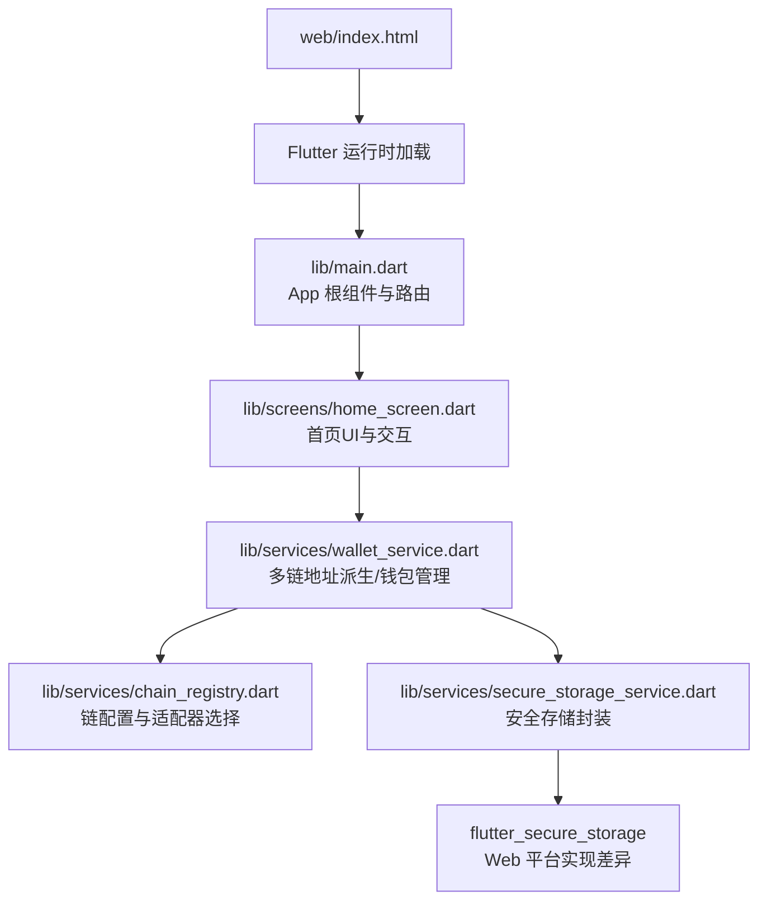
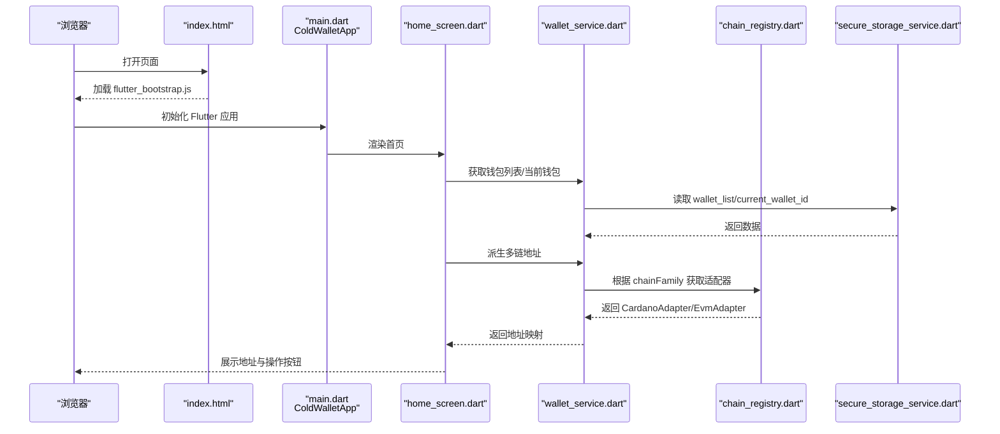
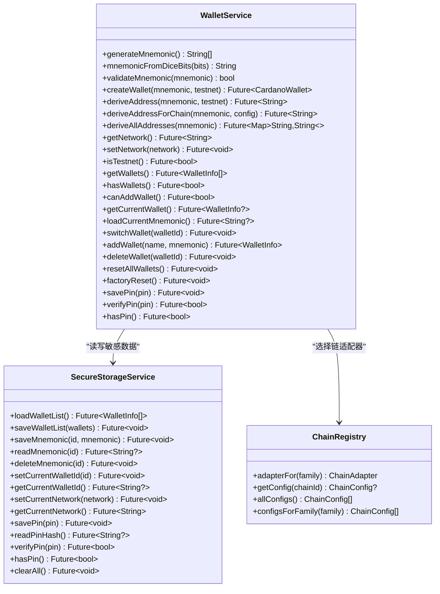
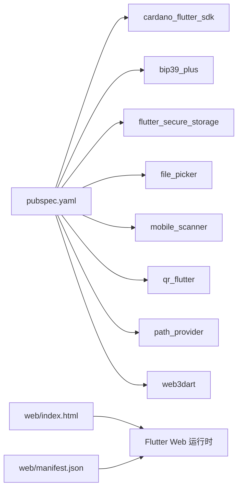

# Web平台支持

<cite>
**本文引用的文件**
- [coldwallet-app/pubspec.yaml](file://coldwallet-app/pubspec.yaml)
- [coldwallet-app/lib/main.dart](file://coldwallet-app/lib/main.dart)
- [coldwallet-app/web/index.html](file://coldwallet-app/web/index.html)
- [coldwallet-app/web/manifest.json](file://coldwallet-app/web/manifest.json)
- [coldwallet-app/lib/services/wallet_service.dart](file://coldwallet-app/lib/services/wallet_service.dart)
- [coldwallet-app/lib/services/secure_storage_service.dart](file://coldwallet-app/lib/services/secure_storage_service.dart)
- [coldwallet-app/lib/services/chain_registry.dart](file://coldwallet-app/lib/services/chain_registry.dart)
- [coldwallet-app/lib/models/wallet_info.dart](file://coldwallet-app/lib/models/wallet_info.dart)
- [coldwallet-app/lib/screens/home_screen.dart](file://coldwallet-app/lib/screens/home_screen.dart)
</cite>

## 目录
1. [简介](#简介)
2. [项目结构](#项目结构)
3. [核心组件](#核心组件)
4. [架构总览](#架构总览)
5. [详细组件分析](#详细组件分析)
6. [依赖关系分析](#依赖关系分析)
7. [性能考虑](#性能考虑)
8. [故障排查指南](#故障排查指南)
9. [结论](#结论)
10. [附录](#附录)

## 简介
本仓库为多链冷钱包 Flutter 应用，目标是在离线环境下完成助记词管理、多链地址派生与离线签名，并通过二维码或文件与联网端交互。Web 平台支持通过 Flutter Web 构建产物提供浏览器访问能力，但受限于浏览器安全模型与插件实现，部分原生能力（如硬件安全存储）在 Web 上不可用或行为不同。本文聚焦于 Web 平台的构建入口、运行时依赖、关键服务在 Web 上的适配点与限制，并给出部署与排错建议。

## 项目结构
- 应用入口与路由：lib/main.dart 定义 Material 主题与页面路由，作为 Web 启动后的根组件。
- Web 资源：web/index.html 与 web/manifest.json 提供 PWA 元信息、图标与启动配置。
- 业务服务：services 层包含钱包服务、安全存储、链注册中心等；其中安全存储依赖 flutter_secure_storage，在 Web 上需关注其实现差异。
- UI 页面：screens 层提供首页、扫码签名、交易详情等界面，首页集成文件导入与地址展示。

图表来源
- [coldwallet-app/web/index.html:1-46](file://coldwallet-app/web/index.html#L1-L46)
- [coldwallet-app/lib/main.dart:12-52](file://coldwallet-app/lib/main.dart#L12-L52)
- [coldwallet-app/lib/screens/home_screen.dart:100-152](file://coldwallet-app/lib/screens/home_screen.dart#L100-L152)
- [coldwallet-app/lib/services/wallet_service.dart:15-101](file://coldwallet-app/lib/services/wallet_service.dart#L15-L101)
- [coldwallet-app/lib/services/chain_registry.dart:10-79](file://coldwallet-app/lib/services/chain_registry.dart#L10-L79)
- [coldwallet-app/lib/services/secure_storage_service.dart:1-33](file://coldwallet-app/lib/services/secure_storage_service.dart#L1-L33)

章节来源
- [coldwallet-app/web/index.html:1-46](file://coldwallet-app/web/index.html#L1-L46)
- [coldwallet-app/web/manifest.json:1-36](file://coldwallet-app/web/manifest.json#L1-L36)
- [coldwallet-app/lib/main.dart:12-52](file://coldwallet-app/lib/main.dart#L12-L52)

## 核心组件
- Web 启动与 PWA 配置：index.html 负责基础 HTML 结构与 flutter_bootstrap.js 加载；manifest.json 定义应用名称、启动页、主题色与图标，使 Web 可被添加到主屏并以独立窗口运行。
- 应用根组件：main.dart 初始化 Flutter 绑定并启动 MaterialApp，配置亮/暗主题与路由表（首页、钱包设置、扫码签名）。
- 钱包服务：wallet_service.dart 提供助记词生成/校验、Cardano 钱包创建与地址派生、多链地址派生（基于 ChainRegistry）、网络设置、钱包列表管理与 PIN 验证。
- 安全存储：secure_storage_service.dart 封装 flutter_secure_storage，用于持久化钱包列表、助记词、当前钱包 ID、网络与 PIN。Web 上该库的底层实现可能退化为浏览器安全存储或受限存储，需评估可用性。
- 链注册中心：chain_registry.dart 集中管理支持的链配置，按 chainFamily 返回对应适配器实例（Cardano/EVM），便于扩展新链。
- 首页 UI：home_screen.dart 提供钱包选择器、多链地址展示、扫码签名入口、文件导入对话框与跳转逻辑。

章节来源
- [coldwallet-app/web/index.html:1-46](file://coldwallet-app/web/index.html#L1-L46)
- [coldwallet-app/web/manifest.json:1-36](file://coldwallet-app/web/manifest.json#L1-L36)
- [coldwallet-app/lib/main.dart:12-52](file://coldwallet-app/lib/main.dart#L12-L52)
- [coldwallet-app/lib/services/wallet_service.dart:15-231](file://coldwallet-app/lib/services/wallet_service.dart#L15-L231)
- [coldwallet-app/lib/services/secure_storage_service.dart:1-107](file://coldwallet-app/lib/services/secure_storage_service.dart#L1-L107)
- [coldwallet-app/lib/services/chain_registry.dart:10-79](file://coldwallet-app/lib/services/chain_registry.dart#L10-L79)
- [coldwallet-app/lib/screens/home_screen.dart:100-152](file://coldwallet-app/lib/screens/home_screen.dart#L100-L152)

## 架构总览
下图展示了从 Web 入口到业务服务的调用链路，以及各模块的职责边界。

图表来源
- [coldwallet-app/web/index.html:1-46](file://coldwallet-app/web/index.html#L1-L46)
- [coldwallet-app/lib/main.dart:12-52](file://coldwallet-app/lib/main.dart#L12-L52)
- [coldwallet-app/lib/screens/home_screen.dart:100-152](file://coldwallet-app/lib/screens/home_screen.dart#L100-L152)
- [coldwallet-app/lib/services/wallet_service.dart:15-101](file://coldwallet-app/lib/services/wallet_service.dart#L15-L101)
- [coldwallet-app/lib/services/chain_registry.dart:10-79](file://coldwallet-app/lib/services/chain_registry.dart#L10-L79)
- [coldwallet-app/lib/services/secure_storage_service.dart:1-33](file://coldwallet-app/lib/services/secure_storage_service.dart#L1-L33)

## 详细组件分析

### Web 启动与 PWA 配置
- index.html 使用占位符 base href，由构建工具替换；引入 flutter_bootstrap.js 以异步加载 Flutter 运行时。
- manifest.json 定义应用名、启动路径、显示模式、主题色与图标集，支持将 Web 应用添加到设备主屏并全屏运行。

章节来源
- [coldwallet-app/web/index.html:1-46](file://coldwallet-app/web/index.html#L1-L46)
- [coldwallet-app/web/manifest.json:1-36](file://coldwallet-app/web/manifest.json#L1-L36)

### 应用根组件与路由
- main.dart 初始化 WidgetsFlutterBinding，启动 ColdWalletApp。
- 配置 Material3 主题（亮/暗），并声明路由：首页、钱包设置、扫码签名。

章节来源
- [coldwallet-app/lib/main.dart:12-52](file://coldwallet-app/lib/main.dart#L12-L52)

### 钱包服务（多链）
- 助记词：生成、骰子熵转换、校验。
- Cardano：创建 HD 钱包、派生支付地址。
- 多链地址：通过 ChainRegistry 按 chainFamily 选择适配器，统一派生不同链地址。
- 网络设置：全局 mainnet/testnet 切换。
- 钱包管理：添加/删除/切换钱包、重置、PIN 保存与校验。

图表来源
- [coldwallet-app/lib/services/wallet_service.dart:15-231](file://coldwallet-app/lib/services/wallet_service.dart#L15-L231)
- [coldwallet-app/lib/services/secure_storage_service.dart:1-107](file://coldwallet-app/lib/services/secure_storage_service.dart#L1-L107)
- [coldwallet-app/lib/services/chain_registry.dart:10-79](file://coldwallet-app/lib/services/chain_registry.dart#L10-L79)

章节来源
- [coldwallet-app/lib/services/wallet_service.dart:15-231](file://coldwallet-app/lib/services/wallet_service.dart#L15-L231)
- [coldwallet-app/lib/services/secure_storage_service.dart:1-107](file://coldwallet-app/lib/services/secure_storage_service.dart#L1-L107)
- [coldwallet-app/lib/services/chain_registry.dart:10-79](file://coldwallet-app/lib/services/chain_registry.dart#L10-L79)

### 安全存储服务（Web 适配要点）
- 使用 flutter_secure_storage 进行敏感数据存储。Web 平台下该库的实现可能依赖浏览器安全存储机制，存在跨域、容量限制或不可用场景。
- 若 Web 环境不支持安全存储，需在调用处增加降级策略（例如提示用户仅可在移动端使用，或改用非敏感本地存储并明确风险）。

章节来源
- [coldwallet-app/lib/services/secure_storage_service.dart:1-107](file://coldwallet-app/lib/services/secure_storage_service.dart#L1-L107)

### 首页与文件导入（Web 注意事项）
- 首页提供“导入签名”功能，使用 file_picker 选择本地文件并解析 JSON 后跳转到交易详情页。
- Web 环境下文件选择与文件系统访问受浏览器沙箱限制，需确保 file_picker 在 Web 平台可用且权限正确。

章节来源
- [coldwallet-app/lib/screens/home_screen.dart:154-242](file://coldwallet-app/lib/screens/home_screen.dart#L154-L242)

### 链注册中心与适配器
- ChainRegistry 维护 Cardano 与多条 EVM 测试网配置，按 chainFamily 返回 CardanoAdapter 或 EvmAdapter。
- 新增链仅需在配置表中添加一行 ChainConfig，无需改动上层调用。

章节来源
- [coldwallet-app/lib/services/chain_registry.dart:10-79](file://coldwallet-app/lib/services/chain_registry.dart#L10-L79)

## 依赖关系分析
- 构建与依赖：pubspec.yaml 声明 Flutter SDK、cardano_flutter_sdk、bip39_plus、flutter_secure_storage、mobile_scanner、qr_flutter、path_provider、file_picker、web3dart 等。这些依赖在 Web 平台下的可用性需逐一验证。
- 运行时依赖：Web 构建产物由 index.html 加载，依赖 Flutter Web 运行时与 PWA 清单。

图表来源
- [coldwallet-app/pubspec.yaml:30-48](file://coldwallet-app/pubspec.yaml#L30-L48)
- [coldwallet-app/web/index.html:1-46](file://coldwallet-app/web/index.html#L1-L46)
- [coldwallet-app/web/manifest.json:1-36](file://coldwallet-app/web/manifest.json#L1-L36)

章节来源
- [coldwallet-app/pubspec.yaml:30-48](file://coldwallet-app/pubspec.yaml#L30-L48)

## 性能考虑
- 首次加载：Web 应用体积较大时，首屏加载时间较长。可通过分包、懒加载页面与服务、启用缓存策略优化。
- 地址派生：多链地址派生涉及密码学计算，建议在后台任务中执行，避免阻塞 UI。
- 存储读写：频繁读写安全存储可能造成卡顿，应合并批量写入与缓存热点数据。
- 文件导入：大文件解析应在后台线程处理，并提供进度反馈与错误提示。

[本节为通用指导，不直接分析具体文件]

## 故障排查指南
- Web 无法启动或白屏
  - 检查 index.html 的 base href 是否正确替换，确认 flutter_bootstrap.js 可加载。
  - 查看浏览器控制台是否有资源加载错误或 CSP 拦截。
- 安全存储不可用
  - 在 Web 环境下 flutter_secure_storage 可能不可用或受限。需在 SecureStorageService 调用处检测异常并提示用户。
- 文件导入失败
  - 确认 file_picker 在 Web 平台可用，检查浏览器对文件访问的权限与限制。
- 地址派生失败
  - 检查助记词是否有效、网络设置是否正确；确认链适配器与配置是否存在。

章节来源
- [coldwallet-app/web/index.html:1-46](file://coldwallet-app/web/index.html#L1-L46)
- [coldwallet-app/lib/services/secure_storage_service.dart:1-107](file://coldwallet-app/lib/services/secure_storage_service.dart#L1-L107)
- [coldwallet-app/lib/screens/home_screen.dart:154-242](file://coldwallet-app/lib/screens/home_screen.dart#L154-L242)
- [coldwallet-app/lib/services/wallet_service.dart:15-101](file://coldwallet-app/lib/services/wallet_service.dart#L15-L101)

## 结论
本项目通过 Flutter Web 提供了浏览器端的冷钱包体验，具备完整的入口与 PWA 配置，并在业务层实现了多链地址派生与钱包管理。由于 Web 平台的安全与能力限制，安全存储与部分插件在浏览器环境中可能存在不可用或行为差异。建议在 Web 构建前对各依赖进行兼容性验证，并在关键路径加入降级与错误提示，以提升用户体验与稳定性。

[本节为总结性内容，不直接分析具体文件]

## 附录
- 构建与部署
  - 使用 Flutter Web 构建命令生成静态资源，部署至任意静态服务器。
  - 确保 index.html 的 base href 与实际部署路径一致。
  - 配置 HTTPS 以启用 PWA 相关能力（如 Service Worker）。
- 依赖清单参考
  - 参见 pubspec.yaml 中的 dependencies 与 dependency_overrides。

章节来源
- [coldwallet-app/pubspec.yaml:30-48](file://coldwallet-app/pubspec.yaml#L30-L48)
- [coldwallet-app/web/index.html:1-46](file://coldwallet-app/web/index.html#L1-L46)
- [coldwallet-app/web/manifest.json:1-36](file://coldwallet-app/web/manifest.json#L1-L36)