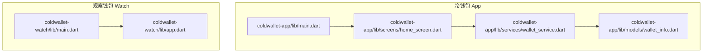
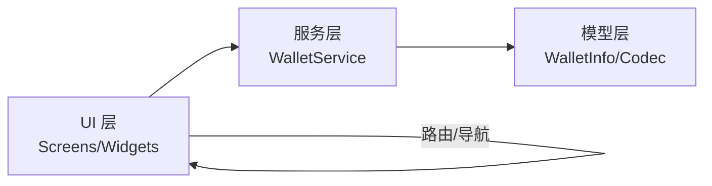
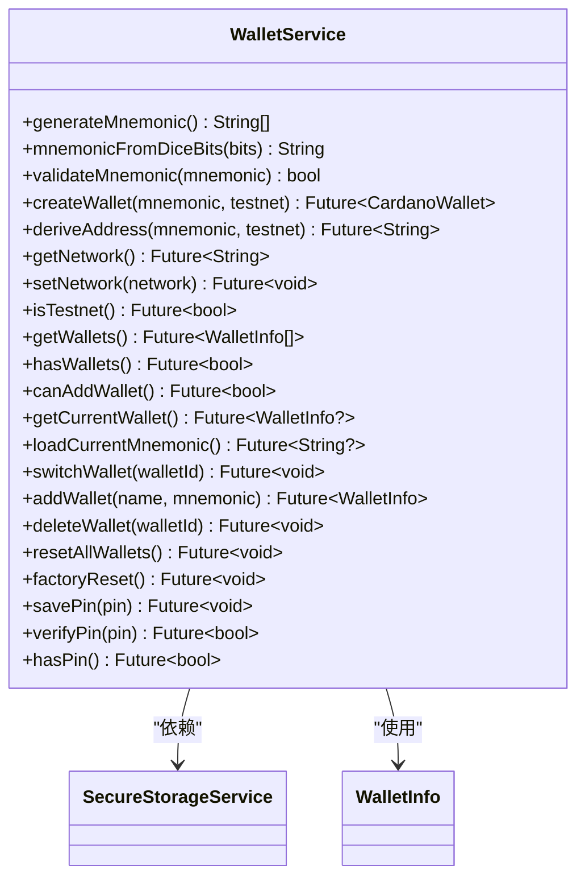
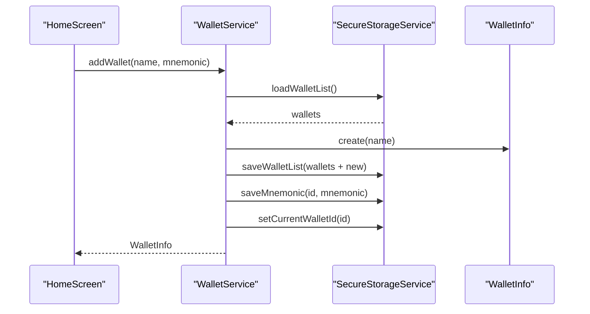
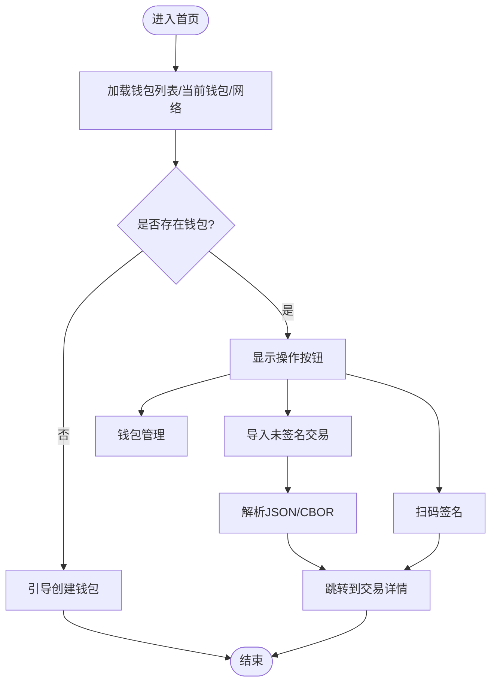
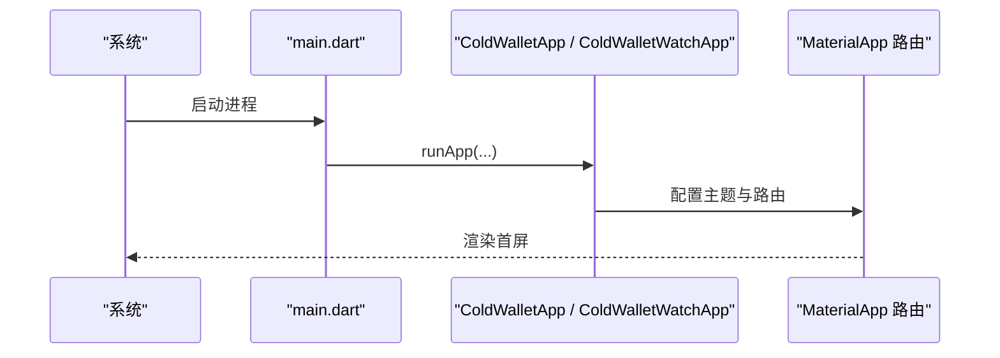
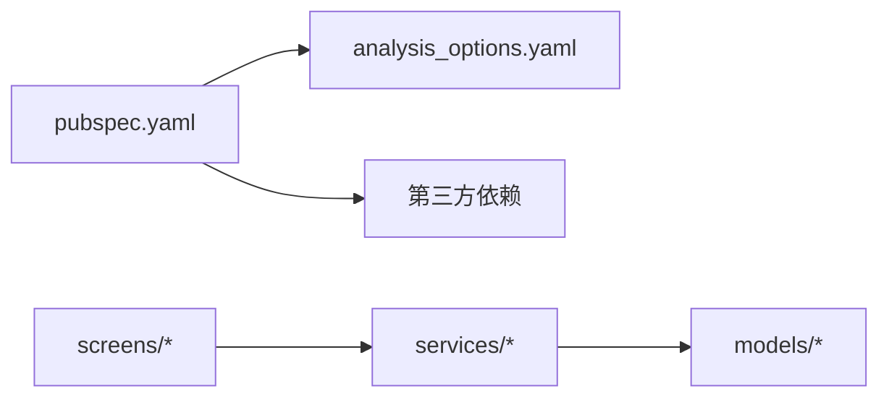

# 代码规范

<cite>
**本文引用的文件**
- [coldwallet-app/lib/main.dart](file://coldwallet-app/lib/main.dart)
- [coldwallet-watch/lib/app.dart](file://coldwallet-watch/lib/app.dart)
- [coldwallet-watch/lib/main.dart](file://coldwallet-watch/lib/main.dart)
- [coldwallet-app/lib/services/wallet_service.dart](file://coldwallet-app/lib/services/wallet_service.dart)
- [coldwallet-app/lib/models/wallet_info.dart](file://coldwallet-app/lib/models/wallet_info.dart)
- [coldwallet-app/lib/screens/home_screen.dart](file://coldwallet-app/lib/screens/home_screen.dart)
- [coldwallet-app/analysis_options.yaml](file://coldwallet-app/analysis_options.yaml)
- [coldwallet-watch/analysis_options.yaml](file://coldwallet-watch/analysis_options.yaml)
- [coldwallet-app/pubspec.yaml](file://coldwallet-app/pubspec.yaml)
- [coldwallet-watch/pubspec.yaml](file://coldwallet-watch/pubspec.yaml)
- [coldwallet-watch/test/services/wallet_service_test.dart](file://coldwallet-watch/test/services/wallet_service_test.dart)
</cite>

## 目录
1. [简介](#简介)
2. [项目结构](#项目结构)
3. [核心组件](#核心组件)
4. [架构总览](#架构总览)
5. [详细组件分析](#详细组件分析)
6. [依赖关系分析](#依赖关系分析)
7. [性能考量](#性能考量)
8. [故障排查指南](#故障排查指南)
9. [结论](#结论)
10. [附录](#附录)

## 简介
本规范面向 ColdWallet 双端 Flutter 工程（冷钱包 App 与观察钱包 Watch），统一 Dart 编码标准、命名约定、文件组织方式，明确 Flutter 最佳实践、组件设计模式与状态管理策略。同时给出代码质量检查规则、lint 配置说明、格式化标准，并提供代码审查清单、常见反模式与重构建议，辅以仓库中的实际代码路径作为示例依据。

## 项目结构
两个子应用遵循一致的目录划分：lib 下按 models、screens、services、widgets 分层；入口 main.dart 负责初始化并启动根组件；app.dart（Watch）集中定义路由与主题。

图表来源
- [coldwallet-app/lib/main.dart:1-51](file://coldwallet-app/lib/main.dart#L1-L51)
- [coldwallet-watch/lib/main.dart:1-12](file://coldwallet-watch/lib/main.dart#L1-L12)
- [coldwallet-watch/lib/app.dart:1-40](file://coldwallet-watch/lib/app.dart#L1-L40)
- [coldwallet-app/lib/screens/home_screen.dart:1-378](file://coldwallet-app/lib/screens/home_screen.dart#L1-L378)
- [coldwallet-app/lib/services/wallet_service.dart:1-208](file://coldwallet-app/lib/services/wallet_service.dart#L1-L208)
- [coldwallet-app/lib/models/wallet_info.dart:1-56](file://coldwallet-app/lib/models/wallet_info.dart#L1-L56)

章节来源
- [coldwallet-app/lib/main.dart:1-51](file://coldwallet-app/lib/main.dart#L1-L51)
- [coldwallet-watch/lib/app.dart:1-40](file://coldwallet-watch/lib/app.dart#L1-L40)
- [coldwallet-watch/lib/main.dart:1-12](file://coldwallet-watch/lib/main.dart#L1-L12)

## 核心组件
- 应用根组件与路由
  - 冷钱包 App：在入口中初始化 WidgetsFlutterBinding，创建 MaterialApp，配置 Material3 主题与初始路由。
  - 观察钱包 Watch：在 app.dart 中集中声明路由表与主题，main.dart 仅做启动。
- 钱包服务
  - 提供助记词生成/校验、HD 钱包创建、地址派生、网络设置、多钱包列表管理、PIN 管理等能力。
- 数据模型
  - WalletInfo 表示钱包元数据，包含唯一 ID、名称与创建时间，并提供 JSON 序列化/反序列化与列表编解码器。
- 页面与交互
  - HomeScreen 展示钱包选择、网络切换、扫码签名、导入未签名交易等入口，并在无钱包时引导创建。

章节来源
- [coldwallet-app/lib/main.dart:1-51](file://coldwallet-app/lib/main.dart#L1-L51)
- [coldwallet-watch/lib/app.dart:1-40](file://coldwallet-watch/lib/app.dart#L1-L40)
- [coldwallet-app/lib/services/wallet_service.dart:1-208](file://coldwallet-app/lib/services/wallet_service.dart#L1-L208)
- [coldwallet-app/lib/models/wallet_info.dart:1-56](file://coldwallet-app/lib/models/wallet_info.dart#L1-L56)
- [coldwallet-app/lib/screens/home_screen.dart:1-378](file://coldwallet-app/lib/screens/home_screen.dart#L1-L378)

## 架构总览
整体采用“UI 层 + 服务层 + 模型层”的分层架构：
- UI 层：Screens/Widgets 负责视图与用户交互，通过 Navigator 进行页面跳转。
- 服务层：Services 封装业务逻辑（助记词、密钥、网络、存储访问）。
- 模型层：Models 承载数据结构与序列化。

图表来源
- [coldwallet-app/lib/screens/home_screen.dart:1-378](file://coldwallet-app/lib/screens/home_screen.dart#L1-L378)
- [coldwallet-app/lib/services/wallet_service.dart:1-208](file://coldwallet-app/lib/services/wallet_service.dart#L1-L208)
- [coldwallet-app/lib/models/wallet_info.dart:1-56](file://coldwallet-app/lib/models/wallet_info.dart#L1-L56)

## 详细组件分析

### 钱包服务（WalletService）
职责边界清晰，围绕助记词、HD 钱包、地址派生、网络与多钱包管理展开。对外暴露异步 API，内部委托安全存储实现持久化。

图表来源
- [coldwallet-app/lib/services/wallet_service.dart:1-208](file://coldwallet-app/lib/services/wallet_service.dart#L1-L208)
- [coldwallet-app/lib/models/wallet_info.dart:1-56](file://coldwallet-app/lib/models/wallet_info.dart#L1-L56)

关键流程（添加钱包）时序图：

图表来源
- [coldwallet-app/lib/services/wallet_service.dart:135-152](file://coldwallet-app/lib/services/wallet_service.dart#L135-L152)
- [coldwallet-app/lib/models/wallet_info.dart:19-33](file://coldwallet-app/lib/models/wallet_info.dart#L19-L33)

章节来源
- [coldwallet-app/lib/services/wallet_service.dart:1-208](file://coldwallet-app/lib/services/wallet_service.dart#L1-L208)
- [coldwallet-app/lib/models/wallet_info.dart:1-56](file://coldwallet-app/lib/models/wallet_info.dart#L1-L56)

### 首页（HomeScreen）
职责：展示钱包选择器、网络切换、扫码签名、导入未签名交易、进入钱包管理。无钱包时引导创建。

图表来源
- [coldwallet-app/lib/screens/home_screen.dart:32-48](file://coldwallet-app/lib/screens/home_screen.dart#L32-L48)
- [coldwallet-app/lib/screens/home_screen.dart:101-105](file://coldwallet-app/lib/screens/home_screen.dart#L101-L105)
- [coldwallet-app/lib/screens/home_screen.dart:182-270](file://coldwallet-app/lib/screens/home_screen.dart#L182-L270)

章节来源
- [coldwallet-app/lib/screens/home_screen.dart:1-378](file://coldwallet-app/lib/screens/home_screen.dart#L1-L378)

### 应用根组件与路由
- 冷钱包 App：在 main.dart 中配置 MaterialApp、Material3 主题与初始路由。
- 观察钱包 Watch：在 app.dart 中集中声明路由表与主题，main.dart 仅调用 runApp。

图表来源
- [coldwallet-app/lib/main.dart:11-49](file://coldwallet-app/lib/main.dart#L11-L49)
- [coldwallet-watch/lib/app.dart:15-39](file://coldwallet-watch/lib/app.dart#L15-L39)
- [coldwallet-watch/lib/main.dart:9-11](file://coldwallet-watch/lib/main.dart#L9-L11)

章节来源
- [coldwallet-app/lib/main.dart:1-51](file://coldwallet-app/lib/main.dart#L1-L51)
- [coldwallet-watch/lib/app.dart:1-40](file://coldwallet-watch/lib/app.dart#L1-L40)
- [coldwallet-watch/lib/main.dart:1-12](file://coldwallet-watch/lib/main.dart#L1-L12)

## 依赖关系分析
- 包管理与版本
  - 两工程均引入 flutter_lints 并通过 analysis_options.yaml 启用 Flutter 推荐 lint。
  - 冷钱包 App 依赖 cardano_flutter_sdk、bip39_plus、flutter_secure_storage 等用于离线签名与安全存储。
  - 观察钱包 Watch 依赖 http、shared_preferences、intl 等用于联网查询与本地偏好。
- 模块耦合
  - Screens 依赖 Services 获取业务数据；Services 依赖 Models 进行数据建模与序列化；Services 通过 SecureStorageService 抽象持久化细节。

图表来源
- [coldwallet-app/pubspec.yaml:21-58](file://coldwallet-app/pubspec.yaml#L21-L58)
- [coldwallet-watch/pubspec.yaml:21-59](file://coldwallet-watch/pubspec.yaml#L21-L59)
- [coldwallet-app/analysis_options.yaml:1-29](file://coldwallet-app/analysis_options.yaml#L1-L29)
- [coldwallet-watch/analysis_options.yaml:1-29](file://coldwallet-watch/analysis_options.yaml#L1-L29)

章节来源
- [coldwallet-app/pubspec.yaml:1-100](file://coldwallet-app/pubspec.yaml#L1-L100)
- [coldwallet-watch/pubspec.yaml:1-101](file://coldwallet-watch/pubspec.yaml#L1-L101)
- [coldwallet-app/analysis_options.yaml:1-29](file://coldwallet-app/analysis_options.yaml#L1-L29)
- [coldwallet-watch/analysis_options.yaml:1-29](file://coldwallet-watch/analysis_options.yaml#L1-L29)

## 性能考量
- 避免在 build 中执行昂贵计算或 I/O，将异步数据加载移至 initState 或懒加载点。
- 合理使用 Stateful/Stateless 组件，减少不必要的重建。
- 对大对象（如交易数据）进行分页或按需加载。
- 谨慎使用全局状态，优先通过服务层返回最新数据，结合局部 setState 更新。
- 注意助记词与私钥相关操作的安全性与最小暴露面，避免日志打印敏感信息。

## 故障排查指南
- 解析失败与空输入
  - 导入未签名交易时，若 JSON 为空或格式错误，应提示用户并中止跳转。
  - 参考路径：[home_screen.dart:249-270](file://coldwallet-app/lib/screens/home_screen.dart#L249-L270)
- 助记词校验异常
  - 校验方法需捕获异常并返回 false，避免崩溃。
  - 参考路径：[wallet_service.dart:48-56](file://coldwallet-app/lib/services/wallet_service.dart#L48-L56)
- 钱包数量上限
  - 添加钱包前检查上限，达到上限抛出明确错误。
  - 参考路径：[wallet_service.dart:135-142](file://coldwallet-app/lib/services/wallet_service.dart#L135-L142)
- 删除当前钱包后的状态回退
  - 删除当前钱包后自动切换到第一个或清空 currentId，保证一致性。
  - 参考路径：[wallet_service.dart:159-175](file://coldwallet-app/lib/services/wallet_service.dart#L159-L175)
- 测试验证
  - 通过单元测试验证当前钱包选择与持久化行为。
  - 参考路径：[wallet_service_test.dart:48-93](file://coldwallet-watch/test/services/wallet_service_test.dart#L48-L93)

章节来源
- [coldwallet-app/lib/screens/home_screen.dart:249-270](file://coldwallet-app/lib/screens/home_screen.dart#L249-L270)
- [coldwallet-app/lib/services/wallet_service.dart:48-56](file://coldwallet-app/lib/services/wallet_service.dart#L48-L56)
- [coldwallet-app/lib/services/wallet_service.dart:135-142](file://coldwallet-app/lib/services/wallet_service.dart#L135-L142)
- [coldwallet-app/lib/services/wallet_service.dart:159-175](file://coldwallet-app/lib/services/wallet_service.dart#L159-L175)
- [coldwallet-watch/test/services/wallet_service_test.dart:48-93](file://coldwallet-watch/test/services/wallet_service_test.dart#L48-L93)

## 结论
本规范基于现有代码结构与实现，明确了分层职责、命名与文件组织、Lint 与质量门禁、以及可操作的审查清单与常见问题定位方法。建议在后续迭代中持续遵循这些约定，保持代码一致性与可维护性。

## 附录

### Dart 编码标准与命名约定
- 文件与类名：小写下划线分隔文件名，帕斯卡命名类名与方法名。
- 变量与参数：小驼峰命名，布尔以 is/has/can 前缀表达语义。
- 常量：全大写加下划线（如 maxWallets）。
- 私有成员：以下划线开头（如 _secureStorage）。
- 注释：公共 API 使用文档注释，复杂逻辑补充行内注释。

### 文件组织结构
- lib
  - models：数据模型与序列化（如 wallet_info.dart）。
  - services：业务逻辑与服务（如 wallet_service.dart）。
  - screens：页面级组件（如 home_screen.dart）。
  - widgets：可复用 UI 片段（建议按功能分组）。
- 入口：main.dart 仅负责初始化与启动；路由集中在 app.dart（Watch）。

### Flutter 最佳实践
- 使用 Material3 主题与 ColorScheme.fromSeed 统一视觉。
- 路由集中管理，避免散落的字符串路径。
- 避免在 build 中进行 I/O 或耗时计算。
- 使用 SafeArea、Scaffold、AppBar 等基础组件构建稳定布局。

### 组件设计模式
- 页面组件：StatefulWidget 管理局部状态，StatelessWidget 用于纯展示。
- 服务层：单一职责，封装业务与外部依赖（存储、SDK）。
- 模型层：不可变数据 + 工厂构造 + JSON 编解码。

### 状态管理模式
- 当前采用“页面局部状态 + 服务层状态”的轻量模式。
- 对于跨页面共享状态（如当前钱包、网络），通过服务层读取与写入，页面按需刷新。
- 未来如需更复杂的状态同步，可考虑 Provider/Riverpod/Bloc 等方案。

### 代码质量检查与 Lint 配置
- 启用 flutter_lints 并继承官方推荐规则集。
- 可在 rules 中按需开启/关闭具体规则（如 prefer_single_quotes、avoid_print）。
- 通过 flutter analyze 在 CI 中强制质量门禁。

章节来源
- [coldwallet-app/analysis_options.yaml:1-29](file://coldwallet-app/analysis_options.yaml#L1-L29)
- [coldwallet-watch/analysis_options.yaml:1-29](file://coldwallet-watch/analysis_options.yaml#L1-L29)

### 代码格式化标准
- 使用 Dart 默认格式化（dart format）。
- 单引号/双引号统一（可通过 lint 规则 enforce）。
- 行宽建议 80 或 100（团队统一）。
- 导入顺序：dart 内置库、第三方包、本地模块。

### 代码审查清单
- 是否遵循分层与职责分离？
- 是否有敏感信息被打印或记录？
- 异步操作是否正确处理错误与取消？
- 是否对输入进行了必要校验（如助记词长度、JSON 格式）？
- 是否添加了必要的单元测试或集成测试？
- 是否更新了相关文档与注释？

### 常见反模式与重构建议
- 反模式：在 build 中执行 I/O 或网络请求。
  - 建议：迁移到 initState 或事件回调中，并缓存结果。
- 反模式：在 UI 中直接读写存储。
  - 建议：通过 Services 抽象存储访问，便于替换实现与测试。
- 反模式：硬编码路由字符串。
  - 建议：集中定义路由常量或使用命名路由。
- 反模式：忽略异常与空值。
  - 建议：显式处理异常分支与空值保护。

### 实际代码示例（路径引用）
- 应用根组件与路由配置：[coldwallet-app/lib/main.dart:23-49](file://coldwallet-app/lib/main.dart#L23-L49)、[coldwallet-watch/lib/app.dart:18-39](file://coldwallet-watch/lib/app.dart#L18-L39)
- 钱包服务核心方法：[coldwallet-app/lib/services/wallet_service.dart:23-78](file://coldwallet-app/lib/services/wallet_service.dart#L23-L78)、[coldwallet-app/lib/services/wallet_service.dart:135-175](file://coldwallet-app/lib/services/wallet_service.dart#L135-L175)
- 钱包模型与编解码：[coldwallet-app/lib/models/wallet_info.dart:19-55](file://coldwallet-app/lib/models/wallet_info.dart#L19-L55)
- 首页导入未签名交易流程：[coldwallet-app/lib/screens/home_screen.dart:182-270](file://coldwallet-app/lib/screens/home_screen.dart#L182-L270)
- 单元测试示例（当前钱包选择）：[coldwallet-watch/test/services/wallet_service_test.dart:48-93](file://coldwallet-watch/test/services/wallet_service_test.dart#L48-L93)