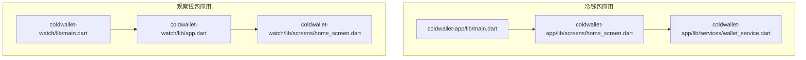
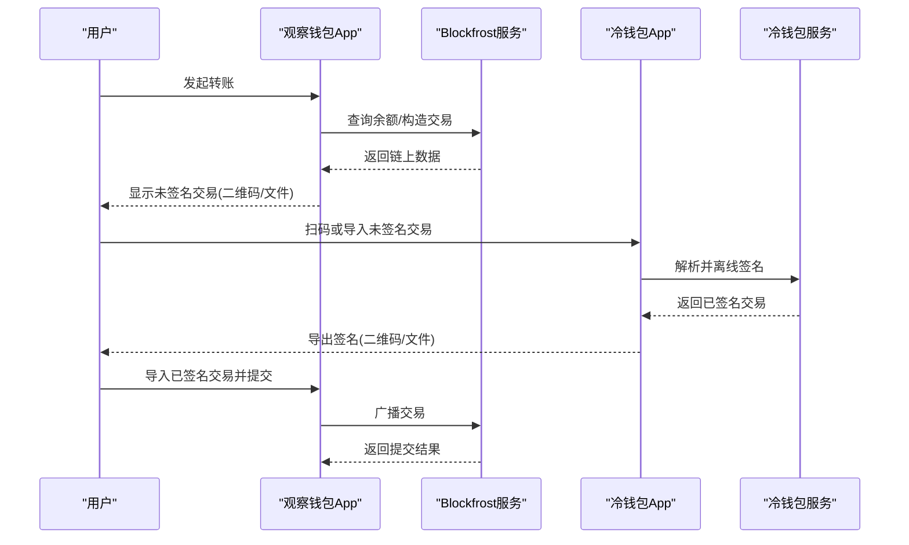
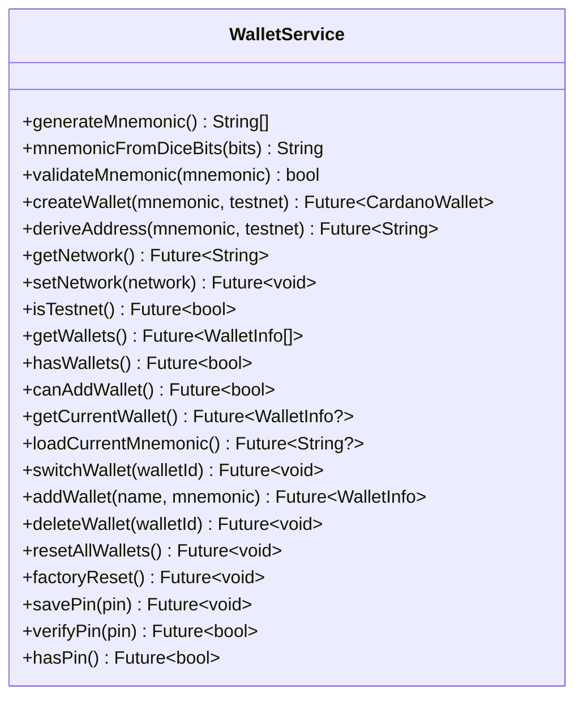
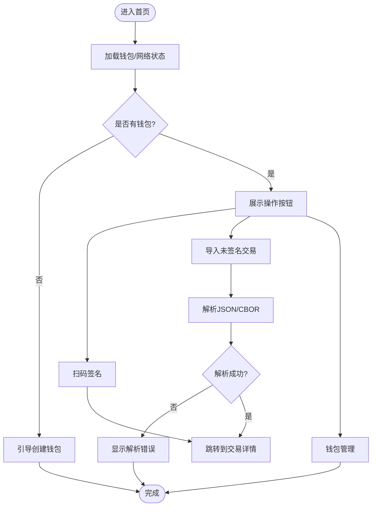
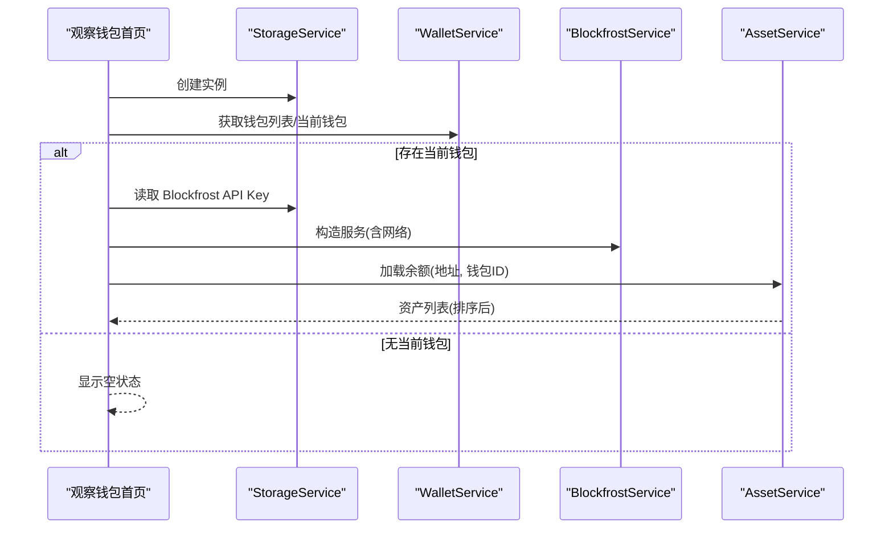

# 开发指南

<cite>
**本文引用的文件**
- [coldwallet-app/pubspec.yaml](file://coldwallet-app/pubspec.yaml)
- [coldwallet-watch/pubspec.yaml](file://coldwallet-watch/pubspec.yaml)
- [coldwallet-app/analysis_options.yaml](file://coldwallet-app/analysis_options.yaml)
- [coldwallet-watch/analysis_options.yaml](file://coldwallet-watch/analysis_options.yaml)
- [coldwallet-app/lib/main.dart](file://coldwallet-app/lib/main.dart)
- [coldwallet-watch/lib/main.dart](file://coldwallet-watch/lib/main.dart)
- [coldwallet-watch/lib/app.dart](file://coldwallet-watch/lib/app.dart)
- [coldwallet-app/lib/screens/home_screen.dart](file://coldwallet-app/lib/screens/home_screen.dart)
- [coldwallet-watch/lib/screens/home_screen.dart](file://coldwallet-watch/lib/screens/home_screen.dart)
- [coldwallet-app/lib/services/wallet_service.dart](file://coldwallet-app/lib/services/wallet_service.dart)
- [coldwallet-app/android/app/build.gradle.kts](file://coldwallet-app/android/app/build.gradle.kts)
- [coldwallet-watch/android/app/build.gradle.kts](file://coldwallet-watch/android/app/build.gradle.kts)
- [coldwallet-app/android/gradle.properties](file://coldwallet-app/android/gradle.properties)
- [coldwallet-watch/android/gradle.properties](file://coldwallet-watch/android/gradle.properties)
</cite>

## 目录
1. [简介](#简介)
2. [项目结构](#项目结构)
3. [核心组件](#核心组件)
4. [架构总览](#架构总览)
5. [详细组件分析](#详细组件分析)
6. [依赖与构建配置](#依赖与构建配置)
7. [性能与调试](#性能与调试)
8. [代码规范与审查清单](#代码规范与审查清单)
9. [测试策略](#测试策略)
10. [持续集成建议](#持续集成建议)
11. [故障排查](#故障排查)
12. [结论](#结论)

## 简介
本指南面向 ColdWallet 项目的贡献者，覆盖开发环境准备、Dart/Flutter 编码规范、Android 原生集成注意事项、构建与依赖管理、调试技巧、性能优化、代码审查清单、测试策略与持续集成建议。项目包含两个 Flutter 应用：
- coldwallet-app：离线冷钱包（助记词管理、离线签名、交易导出）
- coldwallet-watch：联网观察钱包（余额查询、交易构建与提交、导入已签名交易）

## 项目结构
仓库采用多应用组织方式，每个子工程独立维护依赖、构建与入口：
- coldwallet-app：冷钱包端，提供助记词生成、地址派生、二维码扫码、文件导入导出等能力
- coldwallet-watch：观察钱包端，通过 Blockfrost API 查询链上资产，支持发送/收款、交易导出与导入签名
- 共享约定：lib 下按 models/screens/services/widgets 分层；Android 工程使用 Kotlin DSL 与 Gradle 插件

**图示来源**
- [coldwallet-app/lib/main.dart:1-51](file://coldwallet-app/lib/main.dart#L1-L51)
- [coldwallet-watch/lib/main.dart:1-12](file://coldwallet-watch/lib/main.dart#L1-L12)
- [coldwallet-watch/lib/app.dart:1-40](file://coldwallet-watch/lib/app.dart#L1-L40)
- [coldwallet-app/lib/screens/home_screen.dart:1-378](file://coldwallet-app/lib/screens/home_screen.dart#L1-L378)
- [coldwallet-watch/lib/screens/home_screen.dart:1-434](file://coldwallet-watch/lib/screens/home_screen.dart#L1-L434)

**章节来源**
- [coldwallet-app/lib/main.dart:1-51](file://coldwallet-app/lib/main.dart#L1-L51)
- [coldwallet-watch/lib/main.dart:1-12](file://coldwallet-watch/lib/main.dart#L1-L12)
- [coldwallet-watch/lib/app.dart:1-40](file://coldwallet-watch/lib/app.dart#L1-L40)

## 核心组件
- 冷钱包服务（WalletService）：封装助记词生成/校验、HD 钱包创建、地址派生、网络设置、多钱包管理与 PIN 验证等
- 冷钱包首页（HomeScreen）：钱包选择器、网络切换、扫码签名、文件导入、钱包管理入口
- 观察钱包首页（HomeScreen）：钱包选择、地址复制、ADA/代币余额展示、发送/收款入口、资产列表、错误与空状态处理

**章节来源**
- [coldwallet-app/lib/services/wallet_service.dart:1-208](file://coldwallet-app/lib/services/wallet_service.dart#L1-L208)
- [coldwallet-app/lib/screens/home_screen.dart:1-378](file://coldwallet-app/lib/screens/home_screen.dart#L1-L378)
- [coldwallet-watch/lib/screens/home_screen.dart:1-434](file://coldwallet-watch/lib/screens/home_screen.dart#L1-L434)

## 架构总览
两个应用通过“离线介质”交互：观察钱包导出未签名交易（二维码或文件），冷钱包扫描/导入后离线签名并导出结果，再由观察钱包导入并提交到链上。

[此图为概念流程示意，不直接映射具体源码文件]

## 详细组件分析

### 冷钱包服务（WalletService）
职责：
- 助记词：生成、从骰子熵生成、校验
- 链操作：创建 HD 钱包、派生支付地址
- 网络：全局网络设置（主网/测试网）
- 多钱包：列表管理、当前钱包切换、删除、重置
- 安全：PIN 的保存与校验

复杂度与注意点：
- 助记词长度校验与转换涉及位运算，需保证输入正确性
- 多钱包上限限制（常量）避免存储膨胀
- 删除当前钱包时自动切换到首个或清空

**图示来源**
- [coldwallet-app/lib/services/wallet_service.dart:1-208](file://coldwallet-app/lib/services/wallet_service.dart#L1-L208)

**章节来源**
- [coldwallet-app/lib/services/wallet_service.dart:1-208](file://coldwallet-app/lib/services/wallet_service.dart#L1-L208)

### 冷钱包首页（HomeScreen）
功能要点：
- 加载钱包列表、当前钱包、网络状态
- 切换钱包、切换网络
- 扫码签名与文件导入（JSON/CBOR）
- 跳转钱包管理页

异常与边界：
- 文件读取失败、JSON 解析失败均有提示
- 无钱包时引导创建

**图示来源**
- [coldwallet-app/lib/screens/home_screen.dart:1-378](file://coldwallet-app/lib/screens/home_screen.dart#L1-L378)

**章节来源**
- [coldwallet-app/lib/screens/home_screen.dart:1-378](file://coldwallet-app/lib/screens/home_screen.dart#L1-L378)

### 观察钱包首页（HomeScreen）
功能要点：
- 初始化 StorageService 与 WalletService
- 获取钱包列表与当前钱包
- 通过 BlockfrostService 与 AssetService 拉取余额并排序展示
- 支持复制地址、下拉刷新、错误与空状态处理

**图示来源**
- [coldwallet-watch/lib/screens/home_screen.dart:1-434](file://coldwallet-watch/lib/screens/home_screen.dart#L1-L434)

**章节来源**
- [coldwallet-watch/lib/screens/home_screen.dart:1-434](file://coldwallet-watch/lib/screens/home_screen.dart#L1-L434)

## 依赖与构建配置

### Dart/Flutter 依赖
- 冷钱包应用依赖 Cardano SDK、BIP39、加密库、扫码与文件选择等
- 观察钱包应用依赖 HTTP、Blockfrost 相关、本地存储与国际化等

关键位置：
- 冷钱包应用依赖定义：[coldwallet-app/pubspec.yaml](file://coldwallet-app/pubspec.yaml)
- 观察钱包应用依赖定义：[coldwallet-watch/pubspec.yaml](file://coldwallet-watch/pubspec.yaml)

**章节来源**
- [coldwallet-app/pubspec.yaml:1-100](file://coldwallet-app/pubspec.yaml#L1-L100)
- [coldwallet-watch/pubspec.yaml:1-101](file://coldwallet-watch/pubspec.yaml#L1-L101)

### Android 构建配置
- 统一使用 Kotlin DSL 与 Flutter Gradle 插件
- compileSdk 与 Java/Kotlin 版本为 17
- applicationId 与命名空间区分两个应用
- release 构建默认使用 debug 签名（发布前需替换为正式签名）

关键位置：
- 冷钱包应用 Gradle：[coldwallet-app/android/app/build.gradle.kts](file://coldwallet-app/android/app/build.gradle.kts)
- 观察钱包应用 Gradle：[coldwallet-watch/android/app/build.gradle.kts](file://coldwallet-watch/android/app/build.gradle.kts)

Gradle JVM 参数与 AndroidX 开关：
- 冷钱包应用：[coldwallet-app/android/gradle.properties](file://coldwallet-app/android/gradle.properties)
- 观察钱包应用：[coldwallet-watch/android/gradle.properties](file://coldwallet-watch/android/gradle.properties)

**章节来源**
- [coldwallet-app/android/app/build.gradle.kts:1-45](file://coldwallet-app/android/app/build.gradle.kts#L1-L45)
- [coldwallet-watch/android/app/build.gradle.kts:1-45](file://coldwallet-watch/android/app/build.gradle.kts#L1-L45)
- [coldwallet-app/android/gradle.properties:1-4](file://coldwallet-app/android/gradle.properties#L1-L4)
- [coldwallet-watch/android/gradle.properties:1-3](file://coldwallet-watch/android/gradle.properties#L1-L3)

## 性能与调试

### 性能建议
- 列表渲染：观察钱包资产列表使用 ListView.separated，避免不必要的重绘
- 网络请求：Blockfrost 调用应加缓存与重试，减少重复请求
- 内存与启动：确保 WidgetsFlutterBinding.ensureInitialized 在 runApp 前执行（冷钱包已实现）
- 资源与字体：按需引入图标与字体，避免冗余资源打包

### 调试技巧
- 启用 Material3 主题便于视觉调试
- 使用 SnackBar 反馈错误与成功状态
- 在冷钱包中捕获文件读取与 JSON 解析异常并提示
- 在观察钱包中处理空 API Key、网络错误与空资产状态

**章节来源**
- [coldwallet-app/lib/main.dart:11-14](file://coldwallet-app/lib/main.dart#L11-L14)
- [coldwallet-app/lib/screens/home_screen.dart:229-270](file://coldwallet-app/lib/screens/home_screen.dart#L229-L270)
- [coldwallet-watch/lib/screens/home_screen.dart:70-107](file://coldwallet-watch/lib/screens/home_screen.dart#L70-L107)

## 代码规范与审查清单

### Dart/Flutter 编码规范
- 启用 flutter_lints 并遵循推荐规则
- 保持函数与类职责单一，复杂逻辑下沉至 services
- 使用 async/await 处理异步，避免阻塞 UI 线程
- 对敏感数据（助记词、PIN）使用安全存储，不在日志中输出

### 项目结构与命名约定
- lib 下按 models/screens/services/widgets 分层
- 文件名使用小写下划线，类名使用帕斯卡命名
- Android 应用命名空间与 applicationId 区分冷钱包与观察钱包

### 代码审查清单
- 是否遵循 lints 规则？
- 是否存在硬编码字符串/魔法数字？
- 是否对异常路径做了处理与用户提示？
- 是否避免在主线程进行耗时操作？
- 是否对敏感数据进行安全存储与最小化暴露？
- 是否添加了必要的单元测试或集成测试？

**章节来源**
- [coldwallet-app/analysis_options.yaml:1-29](file://coldwallet-app/analysis_options.yaml#L1-L29)
- [coldwallet-watch/analysis_options.yaml:1-29](file://coldwallet-watch/analysis_options.yaml#L1-L29)

## 测试策略
- 单元层面：对 WalletService 的助记词生成/校验、地址派生、网络设置等进行断言
- 组件层面：对冷钱包首页与观察钱包首页的关键交互进行 Widget 测试
- 集成层面：模拟 Blockfrost 响应，验证余额加载与排序逻辑
- 安全层面：验证 PIN 校验与助记词安全存储行为

[本节为通用策略说明，不直接引用具体源码文件]

## 持续集成建议
- 触发条件：push/PR 到 main 分支
- 步骤建议：
  - 安装依赖：flutter pub get
  - 静态检查：flutter analyze
  - 运行测试：flutter test
  - 构建产物：分别构建冷钱包与观察钱包 APK
- 缓存：缓存 pub 包与 Gradle 依赖以提升速度

[本节为通用 CI 建议，不直接引用具体源码文件]

## 故障排查
- 无法解析 JSON：检查导入数据的格式与字段完整性
- 文件读取失败：确认权限与路径有效性
- 余额为空：检查 Blockfrost API Key 是否配置、网络是否正确
- 构建失败：核对 JDK 版本、compileSdk、applicationId 与签名配置

**章节来源**
- [coldwallet-app/lib/screens/home_screen.dart:229-270](file://coldwallet-app/lib/screens/home_screen.dart#L229-L270)
- [coldwallet-watch/lib/screens/home_screen.dart:70-107](file://coldwallet-watch/lib/screens/home_screen.dart#L70-L107)
- [coldwallet-app/android/app/build.gradle.kts:1-45](file://coldwallet-app/android/app/build.gradle.kts#L1-L45)
- [coldwallet-watch/android/app/build.gradle.kts:1-45](file://coldwallet-watch/android/app/build.gradle.kts#L1-L45)

## 结论
本指南梳理了 ColdWallet 双应用的结构、核心组件与交互流程，提供了构建与依赖、调试与性能、规范与审查、测试与 CI 的实践建议。新贡献者可据此快速搭建环境、理解代码组织方式，并按规范参与开发与迭代。