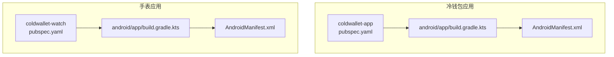
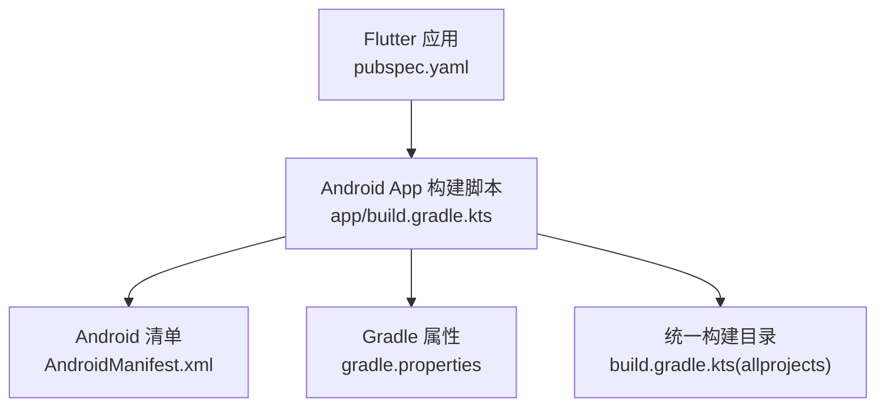
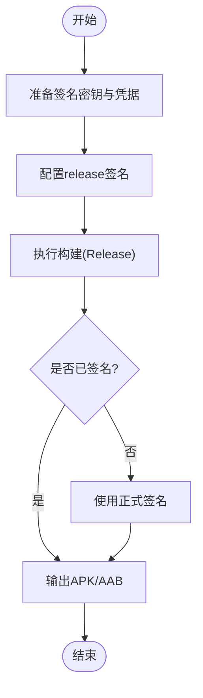
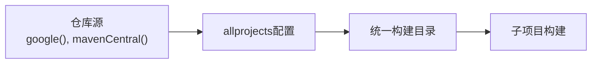

# 构建部署

<cite>
**本文引用的文件**
- [coldwallet-app/android/app/build.gradle.kts](file://coldwallet-app/android/app/build.gradle.kts)
- [coldwallet-watch/android/app/build.gradle.kts](file://coldwallet-watch/android/app/build.gradle.kts)
- [coldwallet-app/android/build.gradle.kts](file://coldwallet-app/android/build.gradle.kts)
- [coldwallet-watch/android/build.gradle.kts](file://coldwallet-watch/android/build.gradle.kts)
- [coldwallet-app/android/gradle.properties](file://coldwallet-app/android/gradle.properties)
- [coldwallet-watch/android/gradle.properties](file://coldwallet-watch/android/gradle.properties)
- [coldwallet-app/pubspec.yaml](file://coldwallet-app/pubspec.yaml)
- [coldwallet-watch/pubspec.yaml](file://coldwallet-watch/pubspec.yaml)
- [coldwallet-app/android/app/src/main/AndroidManifest.xml](file://coldwallet-app/android/app/src/main/AndroidManifest.xml)
- [coldwallet-watch/android/app/src/main/AndroidManifest.xml](file://coldwallet-watch/android/app/src/main/AndroidManifest.xml)
</cite>

## 目录
1. [简介](#简介)
2. [项目结构](#项目结构)
3. [核心组件](#核心组件)
4. [架构总览](#架构总览)
5. [详细组件分析](#详细组件分析)
6. [依赖分析](#依赖分析)
7. [性能考虑](#性能考虑)
8. [故障排查指南](#故障排查指南)
9. [结论](#结论)
10. [附录](#附录)

## 简介
本指南面向ColdWallet项目的构建与发布，覆盖Gradle构建配置、签名证书设置、APK打包流程；说明测试网与主网的构建差异、环境变量与资源管理；提供持续集成与自动化发布的建议方案、版本管理策略；并给出构建优化技巧、常见问题解决方案与部署最佳实践。

## 项目结构
本项目包含两个Flutter应用模块：
- coldwallet-app：冷钱包手机应用（Android）
- coldwallet-watch：手表端应用（Android）

每个模块均包含独立的Android工程与Flutter源码，使用各自的pubspec.yaml进行依赖与版本管理，并通过Android Gradle脚本完成编译与打包。

图表来源
- [coldwallet-app/pubspec.yaml:1-100](file://coldwallet-app/pubspec.yaml#L1-L100)
- [coldwallet-app/android/app/build.gradle.kts:1-45](file://coldwallet-app/android/app/build.gradle.kts#L1-L45)
- [coldwallet-app/android/app/src/main/AndroidManifest.xml:1-46](file://coldwallet-app/android/app/src/main/AndroidManifest.xml#L1-L46)
- [coldwallet-watch/pubspec.yaml:1-101](file://coldwallet-watch/pubspec.yaml#L1-L101)
- [coldwallet-watch/android/app/build.gradle.kts:1-45](file://coldwallet-watch/android/app/build.gradle.kts#L1-L45)
- [coldwallet-watch/android/app/src/main/AndroidManifest.xml:1-53](file://coldwallet-watch/android/app/src/main/AndroidManifest.xml#L1-L53)

章节来源
- [coldwallet-app/pubspec.yaml:1-100](file://coldwallet-app/pubspec.yaml#L1-L100)
- [coldwallet-watch/pubspec.yaml:1-101](file://coldwallet-watch/pubspec.yaml#L1-L101)

## 核心组件
- Android Gradle构建脚本：定义命名空间、编译SDK、Java/Kotlin版本、默认配置、构建类型与签名配置。
- Flutter pubspec：声明应用名称、描述、版本、依赖与Flutter资源。
- Android清单：声明权限、Activity、启动入口与Flutter嵌入元数据。
- Gradle属性：JVM参数、AndroidX开关、增量编译选项等。

章节来源
- [coldwallet-app/android/app/build.gradle.kts:1-45](file://coldwallet-app/android/app/build.gradle.kts#L1-L45)
- [coldwallet-watch/android/app/build.gradle.kts:1-45](file://coldwallet-watch/android/app/build.gradle.kts#L1-L45)
- [coldwallet-app/android/app/src/main/AndroidManifest.xml:1-46](file://coldwallet-app/android/app/src/main/AndroidManifest.xml#L1-L46)
- [coldwallet-watch/android/app/src/main/AndroidManifest.xml:1-53](file://coldwallet-watch/android/app/src/main/AndroidManifest.xml#L1-L53)
- [coldwallet-app/android/gradle.properties:1-4](file://coldwallet-app/android/gradle.properties#L1-L4)
- [coldwallet-watch/android/gradle.properties:1-3](file://coldwallet-watch/android/gradle.properties#L1-L3)

## 架构总览
下图展示从Flutter层到Android层的构建关系与关键配置文件的作用域。

图表来源
- [coldwallet-app/pubspec.yaml:1-100](file://coldwallet-app/pubspec.yaml#L1-L100)
- [coldwallet-app/android/app/build.gradle.kts:1-45](file://coldwallet-app/android/app/build.gradle.kts#L1-L45)
- [coldwallet-app/android/app/src/main/AndroidManifest.xml:1-46](file://coldwallet-app/android/app/src/main/AndroidManifest.xml#L1-L46)
- [coldwallet-app/android/gradle.properties:1-4](file://coldwallet-app/android/gradle.properties#L1-L4)
- [coldwallet-app/android/build.gradle.kts:1-25](file://coldwallet-app/android/build.gradle.kts#L1-L25)

## 详细组件分析

### Gradle构建配置与签名
- 插件与语言版本：启用Android Application、Kotlin与Flutter Gradle插件；Java与Kotlin目标版本设置为17。
- 默认配置：命名空间、compileSdk、minSdk/targetSdk通过Flutter工具注入；versionCode/versionName由Flutter版本管理。
- 构建类型：release默认使用debug签名（便于调试），生产发布需替换为正式签名配置。
- 仓库与构建目录：allprojects中声明google()与mavenCentral()；统一将构建产物输出至根级build目录，便于集中管理与CI缓存。

章节来源
- [coldwallet-app/android/app/build.gradle.kts:1-45](file://coldwallet-app/android/app/build.gradle.kts#L1-L45)
- [coldwallet-watch/android/app/build.gradle.kts:1-45](file://coldwallet-watch/android/app/build.gradle.kts#L1-L45)
- [coldwallet-app/android/build.gradle.kts:1-25](file://coldwallet-app/android/build.gradle.kts#L1-L25)
- [coldwallet-watch/android/build.gradle.kts:1-25](file://coldwallet-watch/android/build.gradle.kts#L1-L25)

### APK打包流程
- 生成签名密钥：在本地或CI环境中准备keystore与别名、密码。
- 配置签名：在app的build.gradle中将release的signingConfig指向正式keystore。
- 执行构建：使用Flutter命令生成release包，或通过Gradle任务assembleRelease。
- 产物位置：构建产物位于各模块的build目录（已统一至根build）。

图表来源
- [coldwallet-app/android/app/build.gradle.kts:33-39](file://coldwallet-app/android/app/build.gradle.kts#L33-L39)
- [coldwallet-watch/android/app/build.gradle.kts:33-39](file://coldwallet-watch/android/app/build.gradle.kts#L33-L39)

### 测试网与主网的构建差异
- 当前代码未内置多环境构建变体（如testnet/mainnet flavor），可通过以下方式实现：
  - 在Gradle中定义productFlavors或buildTypes，分别注入不同的常量或资源。
  - 在Flutter侧通过--dart-define传入运行时变量，或在代码中根据条件加载不同配置。
- 建议在manifest或Gradle中区分网络端点、图标、应用名等差异化资源。

章节来源
- [coldwallet-app/android/app/build.gradle.kts:22-39](file://coldwallet-app/android/app/build.gradle.kts#L22-L39)
- [coldwallet-watch/android/app/build.gradle.kts:22-39](file://coldwallet-watch/android/app/build.gradle.kts#L22-L39)
- [coldwallet-app/android/app/src/main/AndroidManifest.xml:1-46](file://coldwallet-app/android/app/src/main/AndroidManifest.xml#L1-L46)
- [coldwallet-watch/android/app/src/main/AndroidManifest.xml:1-53](file://coldwallet-watch/android/app/src/main/AndroidManifest.xml#L1-L53)

### 环境变量配置
- Flutter层：通过命令行参数传递键值对，供Dart代码在运行时读取，用于切换网络、功能开关等。
- Android层：可在Gradle中定义BuildConfig字段，或在清单中使用占位符注入常量。
- 安全建议：敏感信息（如API密钥）不要硬编码，优先使用CI密钥管理或受保护的变量。

章节来源
- [coldwallet-app/pubspec.yaml:1-100](file://coldwallet-app/pubspec.yaml#L1-L100)
- [coldwallet-watch/pubspec.yaml:1-101](file://coldwallet-watch/pubspec.yaml#L1-L101)
- [coldwallet-app/android/app/src/main/AndroidManifest.xml:1-46](file://coldwallet-app/android/app/src/main/AndroidManifest.xml#L1-L46)
- [coldwallet-watch/android/app/src/main/AndroidManifest.xml:1-53](file://coldwallet-watch/android/app/src/main/AndroidManifest.xml#L1-L53)

### 资源文件管理
- 图标与主题：通过Android资源目录管理启动图与样式，确保在不同密度下显示正确。
- 权限声明：手表应用声明了网络、相机与存储权限，需在发布前评估最小权限原则。
- Flutter资源：如需图片、字体等，应在pubspec中声明assets/fonts并在代码中引用。

章节来源
- [coldwallet-app/android/app/src/main/AndroidManifest.xml:1-46](file://coldwallet-app/android/app/src/main/AndroidManifest.xml#L1-L46)
- [coldwallet-watch/android/app/src/main/AndroidManifest.xml:1-53](file://coldwallet-watch/android/app/src/main/AndroidManifest.xml#L1-L53)
- [coldwallet-app/pubspec.yaml:63-100](file://coldwallet-app/pubspec.yaml#L63-L100)
- [coldwallet-watch/pubspec.yaml:64-101](file://coldwallet-watch/pubspec.yaml#L64-L101)

### 持续集成与自动化发布（建议）
- CI步骤建议：
  - 拉取代码并缓存Gradle与Flutter依赖。
  - 运行静态检查与单元测试。
  - 构建Release包并签名（使用CI中的密钥库与凭据）。
  - 上传产物到制品库或分发平台。
- 触发策略：基于分支与标签触发，例如v*标签触发发布流水线。
- 安全：使用加密的密钥与凭据，避免在日志中泄露敏感信息。

[本节为通用实践建议，不直接分析具体文件]

### 版本管理策略
- Flutter版本：在pubspec中维护语义化版本号（主.次.修订+构建号）。
- Android版本：versionCode与versionName由Flutter注入，保持递增与可读性。
- 标签与发布：建议使用Git标签对应发布版本，CI自动解析标签生成发布包。

章节来源
- [coldwallet-app/pubspec.yaml:7-19](file://coldwallet-app/pubspec.yaml#L7-L19)
- [coldwallet-watch/pubspec.yaml:7-19](file://coldwallet-watch/pubspec.yaml#L7-L19)
- [coldwallet-app/android/app/build.gradle.kts:22-31](file://coldwallet-app/android/app/build.gradle.kts#L22-L31)
- [coldwallet-watch/android/app/build.gradle.kts:22-31](file://coldwallet-watch/android/app/build.gradle.kts#L22-L31)

## 依赖分析
- 仓库源：Google与Maven Central，确保可下载Android依赖。
- 构建目录：统一至根build，便于CI缓存与清理。
- 子项目评估：仅评估:app子项目，减少不必要的构建开销。

图表来源
- [coldwallet-app/android/build.gradle.kts:1-25](file://coldwallet-app/android/build.gradle.kts#L1-L25)
- [coldwallet-watch/android/build.gradle.kts:1-25](file://coldwallet-watch/android/build.gradle.kts#L1-L25)

章节来源
- [coldwallet-app/android/build.gradle.kts:1-25](file://coldwallet-app/android/build.gradle.kts#L1-L25)
- [coldwallet-watch/android/build.gradle.kts:1-25](file://coldwallet-watch/android/build.gradle.kts#L1-L25)

## 性能考虑
- Gradle JVM参数：已配置较大堆内存与元空间，有助于大型项目构建稳定性。
- 增量编译：当前关闭Kotlin增量编译，可能影响构建速度；可根据团队需求评估开启。
- 构建目录集中：统一构建目录有利于并行构建与缓存复用。
- 依赖更新：定期升级Flutter与第三方依赖，获取性能与安全改进。

章节来源
- [coldwallet-app/android/gradle.properties:1-4](file://coldwallet-app/android/gradle.properties#L1-L4)
- [coldwallet-watch/android/gradle.properties:1-3](file://coldwallet-watch/android/gradle.properties#L1-L3)
- [coldwallet-app/android/build.gradle.kts:8-17](file://coldwallet-app/android/build.gradle.kts#L8-L17)
- [coldwallet-watch/android/build.gradle.kts:8-17](file://coldwallet-watch/android/build.gradle.kts#L8-L17)

## 故障排查指南
- 构建失败（依赖下载）：检查网络与仓库源配置，确认google()与mavenCentral可达。
- 签名错误：确认release签名配置指向正确的keystore与别名、密码；若使用debug签名，请仅在调试环境使用。
- 权限问题：确保Android清单中声明的必要权限已添加，且符合最小权限原则。
- 构建速度慢：评估开启Kotlin增量编译；利用CI缓存Gradle与Flutter依赖；减少不必要的全量构建。
- 版本不一致：核对pubspec与Gradle中的versionCode/versionName，确保递增与一致。

章节来源
- [coldwallet-app/android/app/build.gradle.kts:33-39](file://coldwallet-app/android/app/build.gradle.kts#L33-L39)
- [coldwallet-watch/android/app/build.gradle.kts:33-39](file://coldwallet-watch/android/app/build.gradle.kts#L33-L39)
- [coldwallet-watch/android/app/src/main/AndroidManifest.xml:1-53](file://coldwallet-watch/android/app/src/main/AndroidManifest.xml#L1-L53)
- [coldwallet-app/android/gradle.properties:1-4](file://coldwallet-app/android/gradle.properties#L1-L4)
- [coldwallet-watch/android/gradle.properties:1-3](file://coldwallet-watch/android/gradle.properties#L1-L3)

## 结论
ColdWallet项目采用标准的Flutter与Android构建体系，具备清晰的Gradle配置与统一的构建目录管理。发布前需完善签名配置，并根据业务需要引入多环境构建变体。结合CI/CD可实现自动化构建、签名与发布，配合严格的版本管理策略保障交付质量。

## 附录
- 常用命令（参考）：
  - 构建Debug：flutter build apk --debug
  - 构建Release：flutter build apk --release
  - 指定构建参数：flutter build apk --release --dart-define=KEY=VALUE
- 资源与字体：在pubspec中声明assets与fonts，并确保路径正确。
- 权限与清单：按需声明权限，遵循最小权限原则，避免过度授权。

[本节为通用实践建议，不直接分析具体文件]