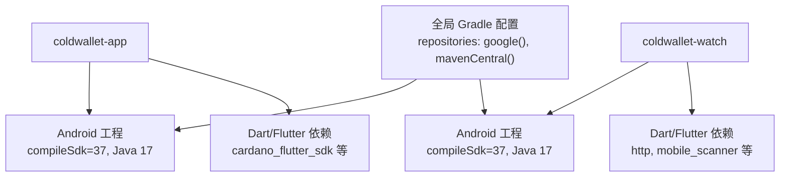
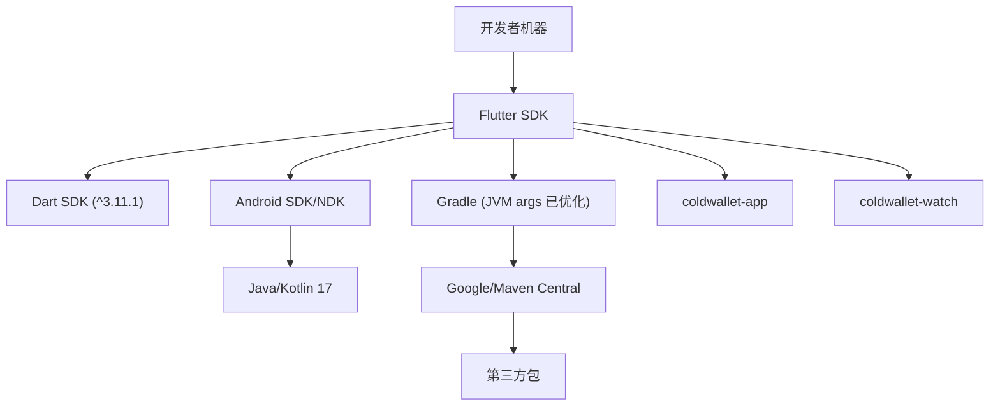
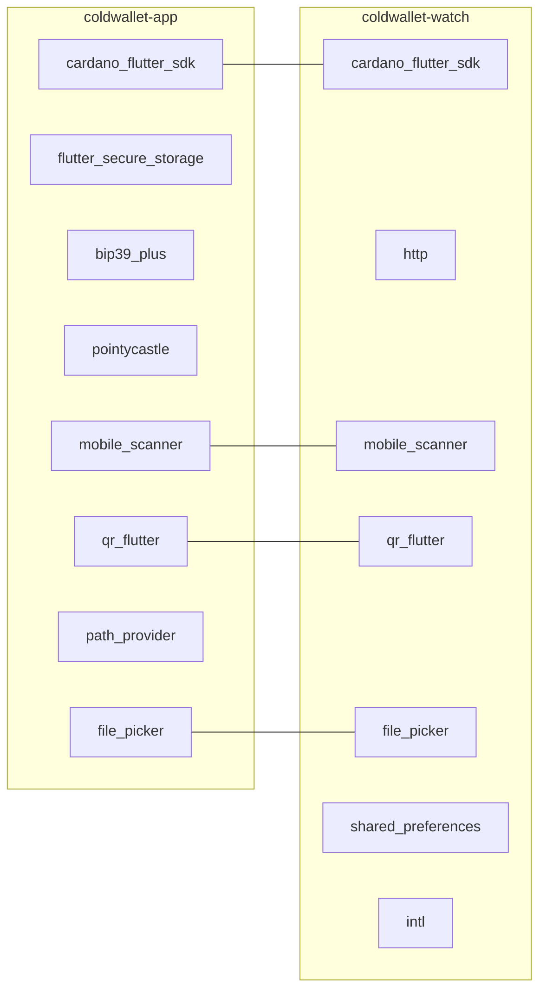

# 环境配置

<cite>
**本文引用的文件**
- [coldwallet-app/pubspec.yaml](file://coldwallet-app/pubspec.yaml)
- [coldwallet-watch/pubspec.yaml](file://coldwallet-watch/pubspec.yaml)
- [coldwallet-app/android/app/build.gradle.kts](file://coldwallet-app/android/app/build.gradle.kts)
- [coldwallet-watch/android/app/build.gradle.kts](file://coldwallet-watch/android/app/build.gradle.kts)
- [coldwallet-app/android/gradle.properties](file://coldwallet-app/android/gradle.properties)
- [coldwallet-watch/android/gradle.properties](file://coldwallet-watch/android/gradle.properties)
- [coldwallet-app/android/local.properties](file://coldwallet-app/android/local.properties)
- [coldwallet-watch/android/local.properties](file://coldwallet-watch/android/local.properties)
- [coldwallet-app/android/app/src/main/AndroidManifest.xml](file://coldwallet-app/android/app/src/main/AndroidManifest.xml)
- [coldwallet-watch/android/app/src/main/AndroidManifest.xml](file://coldwallet-watch/android/app/src/main/AndroidManifest.xml)
- [coldwallet-app/analysis_options.yaml](file://coldwallet-app/analysis_options.yaml)
- [coldwallet-watch/analysis_options.yaml](file://coldwallet-watch/analysis_options.yaml)
</cite>

## 目录
1. [简介](#简介)
2. [项目结构](#项目结构)
3. [核心组件](#核心组件)
4. [架构总览](#架构总览)
5. [详细组件分析](#详细组件分析)
6. [依赖分析](#依赖分析)
7. [性能考虑](#性能考虑)
8. [故障排除指南](#故障排除指南)
9. [结论](#结论)
10. [附录](#附录)

## 简介
本指南面向ColdWallet项目的Flutter开发环境搭建与配置，覆盖以下要点：
- Flutter SDK安装要求与版本约束
- Android开发环境设置（SDK、NDK、Java/Kotlin）
- 依赖包管理与缓存优化
- 项目特定的环境变量与平台配置
- IDE配置建议（VS Code / Android Studio）、插件推荐与调试工具
- 常见问题定位与解决步骤

## 项目结构
仓库包含两个Flutter应用模块：
- coldwallet-app：离线签名主应用
- coldwallet-watch：配套手表端应用

每个模块均包含独立的pubspec.yaml、Android工程配置、分析选项等。

图表来源
- [coldwallet-app/android/app/build.gradle.kts:8-20](file://coldwallet-app/android/app/build.gradle.kts#L8-L20)
- [coldwallet-watch/android/app/build.gradle.kts:8-20](file://coldwallet-watch/android/app/build.gradle.kts#L8-L20)
- [coldwallet-app/pubspec.yaml:21-47](file://coldwallet-app/pubspec.yaml#L21-L47)
- [coldwallet-watch/pubspec.yaml:21-47](file://coldwallet-watch/pubspec.yaml#L21-L47)

章节来源
- [coldwallet-app/pubspec.yaml:21-47](file://coldwallet-app/pubspec.yaml#L21-L47)
- [coldwallet-watch/pubspec.yaml:21-47](file://coldwallet-watch/pubspec.yaml#L21-L47)
- [coldwallet-app/android/app/build.gradle.kts:8-20](file://coldwallet-app/android/app/build.gradle.kts#L8-L20)
- [coldwallet-watch/android/app/build.gradle.kts:8-20](file://coldwallet-watch/android/app/build.gradle.kts#L8-L20)

## 核心组件
- Dart/Flutter SDK 版本约束：两个模块均要求 Dart SDK ^3.11.1
- Android 编译目标：compileSdk 37，Java/Kotlin 目标 17
- 关键依赖：Cardano相关库、安全存储、二维码/扫描、文件选择、网络请求等
- 构建与仓库：统一使用 Google/Maven Central 仓库；Gradle JVM参数已调优

章节来源
- [coldwallet-app/pubspec.yaml:21-47](file://coldwallet-app/pubspec.yaml#L21-L47)
- [coldwallet-watch/pubspec.yaml:21-47](file://coldwallet-watch/pubspec.yaml#L21-L47)
- [coldwallet-app/android/app/build.gradle.kts:8-20](file://coldwallet-app/android/app/build.gradle.kts#L8-L20)
- [coldwallet-watch/android/app/build.gradle.kts:8-20](file://coldwallet-watch/android/app/build.gradle.kts#L8-L20)

## 架构总览
下图展示环境与构建的关键关系：Flutter SDK与Dart SDK版本对齐，Android NDK由Flutter管理，Java/Kotlin目标为17，Gradle通过统一仓库拉取依赖。

图表来源
- [coldwallet-app/pubspec.yaml:21-22](file://coldwallet-app/pubspec.yaml#L21-L22)
- [coldwallet-watch/pubspec.yaml:21-22](file://coldwallet-watch/pubspec.yaml#L21-L22)
- [coldwallet-app/android/app/build.gradle.kts:8-20](file://coldwallet-app/android/app/build.gradle.kts#L8-L20)
- [coldwallet-watch/android/app/build.gradle.kts:8-20](file://coldwallet-watch/android/app/build.gradle.kts#L8-L20)
- [coldwallet-app/android/gradle.properties:1-3](file://coldwallet-app/android/gradle.properties#L1-L3)
- [coldwallet-watch/android/gradle.properties:1-3](file://coldwallet-watch/android/gradle.properties#L1-L3)

## 详细组件分析

### Flutter SDK 与 Dart SDK 要求
- 版本约束：两个模块的environment.sdk均为^3.11.1，需确保本地Dart SDK满足该范围
- 建议：使用flutter doctor检查并修复SDK路径与版本

章节来源
- [coldwallet-app/pubspec.yaml:21-22](file://coldwallet-app/pubspec.yaml#L21-L22)
- [coldwallet-watch/pubspec.yaml:21-22](file://coldwallet-watch/pubspec.yaml#L21-L22)

### Android 开发环境设置
- compileSdk：37
- Java/Kotlin：sourceCompatibility/targetCompatibility/jvmTarget 均为 JavaVersion.VERSION_17
- NDK：由flutter.ndkVersion决定，建议使用Flutter管理的NDK版本
- 最低/目标SDK：minSdk/targetSdk由Flutter变量提供，保持默认即可

章节来源
- [coldwallet-app/android/app/build.gradle.kts:8-20](file://coldwallet-app/android/app/build.gradle.kts#L8-L20)
- [coldwallet-watch/android/app/build.gradle.kts:8-20](file://coldwallet-watch/android/app/build.gradle.kts#L8-L20)

### 依赖包管理与缓存优化
- 公共仓库：google() 与 mavenCentral()
- Gradle JVM参数：堆内存与元空间已配置，有助于大型项目构建稳定性
- 依赖说明：
  - coldwallet-app：cardano_flutter_sdk、flutter_secure_storage、bip39_plus、pointycastle、mobile_scanner、qr_flutter、path_provider、file_picker等
  - coldwallet-watch：cardano_flutter_sdk、http、mobile_scanner、qr_flutter、file_picker、shared_preferences、intl等

章节来源
- [coldwallet-app/android/build.gradle.kts:1-6](file://coldwallet-app/android/build.gradle.kts#L1-L6)
- [coldwallet-watch/android/build.gradle.kts:1-6](file://coldwallet-watch/android/build.gradle.kts#L1-L6)
- [coldwallet-app/android/gradle.properties:1-3](file://coldwallet-app/android/gradle.properties#L1-L3)
- [coldwallet-watch/android/gradle.properties:1-3](file://coldwallet-watch/android/gradle.properties#L1-L3)
- [coldwallet-app/pubspec.yaml:30-47](file://coldwallet-app/pubspec.yaml#L30-L47)
- [coldwallet-watch/pubspec.yaml:30-47](file://coldwallet-watch/pubspec.yaml#L30-L47)

### 项目特定环境变量与平台配置
- local.properties：定义sdk.dir与flutter.sdk路径，用于本地构建定位Android SDK与Flutter SDK
- AndroidManifest权限：
  - coldwallet-watch声明了INTERNET、CAMERA、读写外部存储权限
  - coldwallet-app未声明额外权限（仅基础清单）
- 嵌入版本：flutterEmbedding=2

章节来源
- [coldwallet-app/android/local.properties:1-5](file://coldwallet-app/android/local.properties#L1-L5)
- [coldwallet-watch/android/local.properties:1-5](file://coldwallet-watch/android/local.properties#L1-L5)
- [coldwallet-watch/android/app/src/main/AndroidManifest.xml:1-8](file://coldwallet-watch/android/app/src/main/AndroidManifest.xml#L1-L8)
- [coldwallet-app/android/app/src/main/AndroidManifest.xml:1-46](file://coldwallet-app/android/app/src/main/AndroidManifest.xml#L1-L46)

### IDE配置建议（VS Code / Android Studio）
- VS Code
  - 安装扩展：Flutter、Dart
  - 打开冷钱包根目录或子模块目录，选择设备后运行
  - 在settings中确认dart.flutterSdkPath指向本地Flutter路径
- Android Studio
  - 安装Flutter与Dart插件
  - 打开android子目录以识别Android工程，或使用Flutter向导创建/导入
  - 在Project Structure中确认SDK路径与JDK版本（JDK 17）

[本节为通用实践说明，不直接分析具体文件]

### 调试工具设置
- 启用日志：在代码中使用日志输出便于定位问题（lint规则允许按需开启avoid_print）
- 热重载：开发阶段使用flutter run进行快速迭代
- 性能分析：使用DevTools对CPU、内存、网络进行分析

章节来源
- [coldwallet-app/analysis_options.yaml:8-28](file://coldwallet-app/analysis_options.yaml#L8-L28)
- [coldwallet-watch/analysis_options.yaml:8-28](file://coldwallet-watch/analysis_options.yaml#L8-L28)

## 依赖分析
下图展示两个模块的依赖差异与共同点：

图表来源
- [coldwallet-app/pubspec.yaml:30-47](file://coldwallet-app/pubspec.yaml#L30-L47)
- [coldwallet-watch/pubspec.yaml:30-47](file://coldwallet-watch/pubspec.yaml#L30-L47)

章节来源
- [coldwallet-app/pubspec.yaml:30-47](file://coldwallet-app/pubspec.yaml#L30-L47)
- [coldwallet-watch/pubspec.yaml:30-47](file://coldwallet-watch/pubspec.yaml#L30-L47)

## 性能考虑
- Gradle JVM参数已配置较大堆与元空间，适合多模块构建
- 统一仓库源可减少镜像切换带来的不稳定
- 避免频繁升级major版本依赖，优先通过锁定版本降低风险

[本节为通用指导，不直接分析具体文件]

## 故障排除指南
- 无法解析依赖或下载缓慢
  - 检查网络与代理设置
  - 确认仓库源包含google()与mavenCentral()
  - 清理缓存后重试：flutter clean && flutter pub get
- 构建失败提示Java/Kotlin版本不匹配
  - 确认JDK为17，且compileOptions与kotlinOptions目标一致
- Android SDK路径错误
  - 检查local.properties中的sdk.dir与flutter.sdk是否正确指向本地路径
- 权限缺失导致功能异常
  - 在需要网络或摄像头的模块中确认AndroidManifest已声明相应权限
- 分析器警告过多影响体验
  - 根据analysis_options.yaml调整lint规则，必要时临时忽略

章节来源
- [coldwallet-app/android/build.gradle.kts:1-6](file://coldwallet-app/android/build.gradle.kts#L1-L6)
- [coldwallet-watch/android/build.gradle.kts:1-6](file://coldwallet-watch/android/build.gradle.kts#L1-L6)
- [coldwallet-app/android/app/build.gradle.kts:8-20](file://coldwallet-app/android/app/build.gradle.kts#L8-L20)
- [coldwallet-watch/android/app/build.gradle.kts:8-20](file://coldwallet-watch/android/app/build.gradle.kts#L8-L20)
- [coldwallet-app/android/local.properties:1-5](file://coldwallet-app/android/local.properties#L1-L5)
- [coldwallet-watch/android/local.properties:1-5](file://coldwallet-watch/android/local.properties#L1-L5)
- [coldwallet-watch/android/app/src/main/AndroidManifest.xml:1-8](file://coldwallet-watch/android/app/src/main/AndroidManifest.xml#L1-L8)
- [coldwallet-app/analysis_options.yaml:8-28](file://coldwallet-app/analysis_options.yaml#L8-L28)
- [coldwallet-watch/analysis_options.yaml:8-28](file://coldwallet-watch/analysis_options.yaml#L8-L28)

## 结论
通过遵循上述环境配置与依赖管理策略，可稳定地在本地搭建ColdWallet的Flutter开发环境。重点在于：
- 严格对齐Dart SDK版本
- 正确配置Android SDK/NDK与JDK 17
- 合理管理依赖与缓存
- 针对平台权限与清单进行最小化配置
- 借助IDE与调试工具提升开发与排错效率

[本节为总结性内容，不直接分析具体文件]

## 附录
- 常用命令
  - flutter doctor：检查环境完整性
  - flutter clean：清理构建产物
  - flutter pub get：获取依赖
  - flutter run：运行到连接设备或模拟器
- 参考文件
  - 模块依赖与环境约束见各自pubspec.yaml
  - Android构建与权限见app/build.gradle.kts与AndroidManifest.xml
  - 全局Gradle与JVM参数见gradle.properties

[本节为补充信息，不直接分析具体文件]