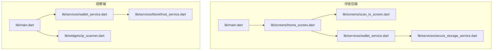
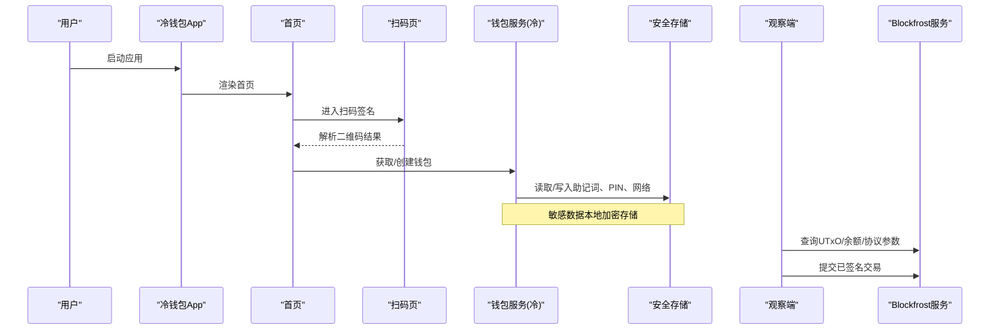
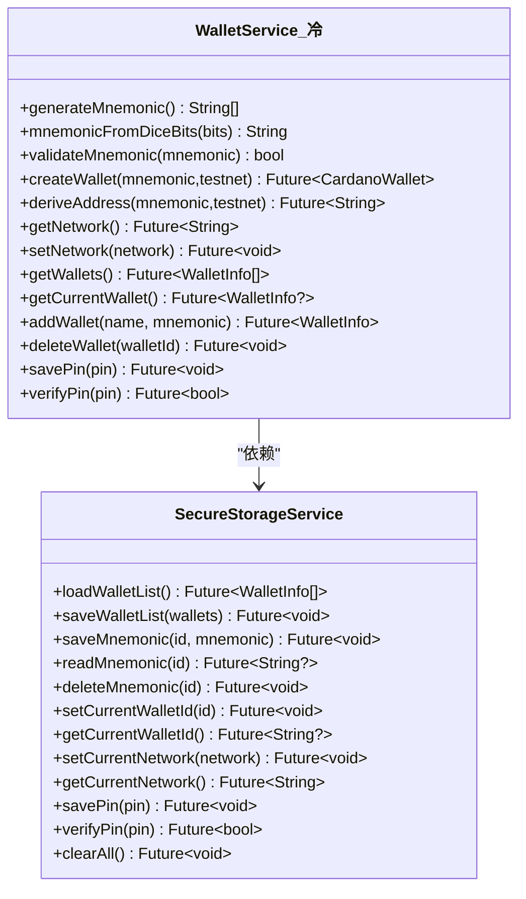
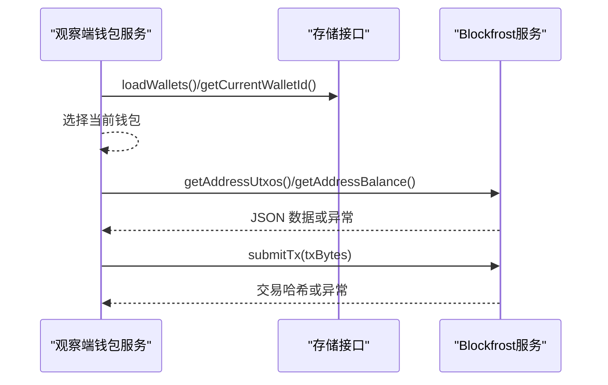
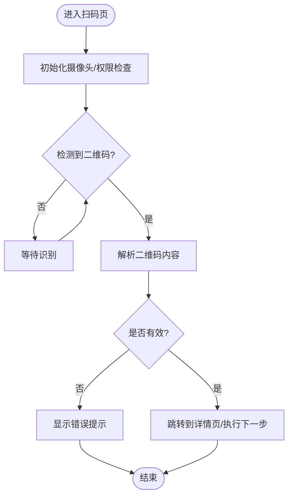
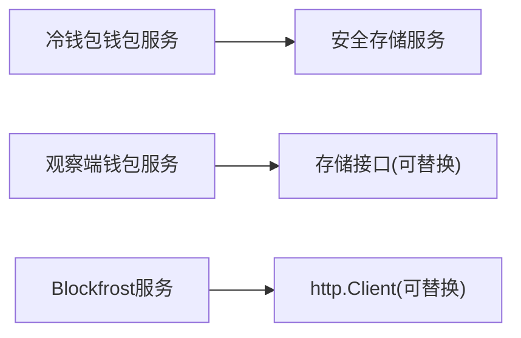

# 调试测试

<cite>
**本文引用的文件**
- [coldwallet-app/pubspec.yaml](file://coldwallet-app/pubspec.yaml)
- [coldwallet-watch/pubspec.yaml](file://coldwallet-watch/pubspec.yaml)
- [coldwallet-app/lib/main.dart](file://coldwallet-app/lib/main.dart)
- [coldwallet-watch/lib/main.dart](file://coldwallet-watch/lib/main.dart)
- [coldwallet-app/test/widget_test.dart](file://coldwallet-app/test/widget_test.dart)
- [coldwallet-watch/test/widget_test.dart](file://coldwallet-watch/test/widget_test.dart)
- [coldwallet-watch/test/services/wallet_service_test.dart](file://coldwallet-watch/test/services/wallet_service_test.dart)
- [coldwallet-app/lib/services/wallet_service.dart](file://coldwallet-app/lib/services/wallet_service.dart)
- [coldwallet-app/lib/services/secure_storage_service.dart](file://coldwallet-app/lib/services/secure_storage_service.dart)
- [coldwallet-watch/lib/services/wallet_service.dart](file://coldwallet-watch/lib/services/wallet_service.dart)
- [coldwallet-watch/lib/services/blockfrost_service.dart](file://coldwallet-watch/lib/services/blockfrost_service.dart)
- [coldwallet-app/lib/screens/home_screen.dart](file://coldwallet-app/lib/screens/home_screen.dart)
- [coldwallet-app/lib/screens/scan_tx_screen.dart](file://coldwallet-app/lib/screens/scan_tx_screen.dart)
- [coldwallet-watch/lib/widgets/qr_scanner.dart](file://coldwallet-watch/lib/widgets/qr_scanner.dart)
</cite>

## 目录
1. [简介](#简介)
2. [项目结构](#项目结构)
3. [核心组件](#核心组件)
4. [架构总览](#架构总览)
5. [详细组件分析](#详细组件分析)
6. [依赖分析](#依赖分析)
7. [性能考虑](#性能考虑)
8. [故障排查指南](#故障排查指南)
9. [结论](#结论)
10. [附录](#附录)

## 简介
本指南面向 ColdWallet（冷钱包）Flutter 项目的调试与测试，覆盖以下主题：
- Flutter 调试技巧与日志记录策略
- 性能分析工具使用建议
- 单元测试编写规范与服务层测试方法
- UI 组件测试策略（含 QR 码交互）
- 区块链 API 模拟测试（Blockfrost）
- 安全功能验证方法（助记词、PIN、安全存储）
- 测试覆盖率要求、持续集成配置建议与常见问题解决方案

## 项目结构
仓库包含两个 Flutter 应用：
- coldwallet-app：离线冷钱包端，负责助记词管理、离线签名、二维码扫描与导出。
- coldwallet-watch：联网观察端，负责余额查询、交易构建与提交。

图表来源
- [coldwallet-app/lib/main.dart:1-51](file://coldwallet-app/lib/main.dart#L1-L51)
- [coldwallet-watch/lib/main.dart:1-12](file://coldwallet-watch/lib/main.dart#L1-L12)
- [coldwallet-app/lib/screens/home_screen.dart:122-156](file://coldwallet-app/lib/screens/home_screen.dart#L122-L156)
- [coldwallet-app/lib/screens/scan_tx_screen.dart:43-87](file://coldwallet-app/lib/screens/scan_tx_screen.dart#L43-L87)
- [coldwallet-app/lib/services/wallet_service.dart:1-208](file://coldwallet-app/lib/services/wallet_service.dart#L1-L208)
- [coldwallet-app/lib/services/secure_storage_service.dart:1-107](file://coldwallet-app/lib/services/secure_storage_service.dart#L1-L107)
- [coldwallet-watch/lib/services/wallet_service.dart:1-88](file://coldwallet-watch/lib/services/wallet_service.dart#L1-L88)
- [coldwallet-watch/lib/services/blockfrost_service.dart:1-109](file://coldwallet-watch/lib/services/blockfrost_service.dart#L1-L109)
- [coldwallet-watch/lib/widgets/qr_scanner.dart:1-25](file://coldwallet-watch/lib/widgets/qr_scanner.dart#L1-L25)

章节来源
- [coldwallet-app/pubspec.yaml:1-100](file://coldwallet-app/pubspec.yaml#L1-L100)
- [coldwallet-watch/pubspec.yaml:1-101](file://coldwallet-watch/pubspec.yaml#L1-L101)

## 核心组件
- 冷钱包端入口与路由：定义 MaterialApp、主题与初始路由，提供首页、钱包设置、扫码签名等页面入口。
- 冷钱包服务：封装助记词生成/校验、地址派生、多钱包管理、网络切换、PIN 管理等。
- 安全存储：通过系统安全存储保存敏感数据（助记词、PIN、钱包列表），Key 隔离设计。
- 观察端钱包服务：只读钱包管理、当前钱包选择、地址格式校验。
- Blockfrost 服务：封装 REST 调用（UTxO、余额、协议参数、提交交易）。
- QR 扫描组件：封装摄像头扫码并回调原始字符串。

章节来源
- [coldwallet-app/lib/main.dart:16-51](file://coldwallet-app/lib/main.dart#L16-L51)
- [coldwallet-app/lib/services/wallet_service.dart:10-208](file://coldwallet-app/lib/services/wallet_service.dart#L10-L208)
- [coldwallet-app/lib/services/secure_storage_service.dart:5-107](file://coldwallet-app/lib/services/secure_storage_service.dart#L5-L107)
- [coldwallet-watch/lib/services/wallet_service.dart:4-88](file://coldwallet-watch/lib/services/wallet_service.dart#L4-L88)
- [coldwallet-watch/lib/services/blockfrost_service.dart:6-109](file://coldwallet-watch/lib/services/blockfrost_service.dart#L6-L109)
- [coldwallet-watch/lib/widgets/qr_scanner.dart:4-25](file://coldwallet-watch/lib/widgets/qr_scanner.dart#L4-L25)

## 架构总览
下图展示冷钱包端与观察端的关键交互与依赖关系，以及测试关注点。

图表来源
- [coldwallet-app/lib/screens/home_screen.dart:122-156](file://coldwallet-app/lib/screens/home_screen.dart#L122-L156)
- [coldwallet-app/lib/screens/scan_tx_screen.dart:43-87](file://coldwallet-app/lib/screens/scan_tx_screen.dart#L43-L87)
- [coldwallet-app/lib/services/wallet_service.dart:60-127](file://coldwallet-app/lib/services/wallet_service.dart#L60-L127)
- [coldwallet-app/lib/services/secure_storage_service.dart:24-107](file://coldwallet-app/lib/services/secure_storage_service.dart#L24-L107)
- [coldwallet-watch/lib/services/blockfrost_service.dart:43-109](file://coldwallet-watch/lib/services/blockfrost_service.dart#L43-L109)

## 详细组件分析

### 冷钱包端钱包服务（多钱包、助记词、PIN）
- 职责：助记词生成/校验、HD 钱包创建、地址派生、钱包列表管理、当前钱包切换、网络设置、PIN 管理。
- 关键行为：
  - 生成 24 词助记词；从骰子熵构造助记词；校验助记词有效性。
  - 基于 CIP-1852 路径派生首个支付地址。
  - 维护最多 5 个钱包，删除时自动切换当前钱包。
  - PIN 为全局保护，当前实现为明文比较（需改进为哈希）。
- 复杂度：
  - 钱包列表操作 O(n)，n 为钱包数量（上限 5）。
  - 地址派生依赖 SDK，时间复杂度由底层实现决定。
- 优化建议：
  - 将 PIN 改为哈希比对（如 PBKDF2/Argon2）。
  - 对频繁访问的钱包元数据做内存缓存（注意生命周期）。
- 错误处理：
  - 助记词长度/合法性校验失败抛出异常或返回 false。
  - 钱包数量达到上限抛错。

图表来源
- [coldwallet-app/lib/services/wallet_service.dart:10-208](file://coldwallet-app/lib/services/wallet_service.dart#L10-L208)
- [coldwallet-app/lib/services/secure_storage_service.dart:1-107](file://coldwallet-app/lib/services/secure_storage_service.dart#L1-L107)

章节来源
- [coldwallet-app/lib/services/wallet_service.dart:10-208](file://coldwallet-app/lib/services/wallet_service.dart#L10-L208)
- [coldwallet-app/lib/services/secure_storage_service.dart:5-107](file://coldwallet-app/lib/services/secure_storage_service.dart#L5-L107)

### 观察端钱包服务与 Blockfrost 服务
- 钱包服务：只读钱包增删改查、当前钱包选择、地址格式校验（bech32 前缀与最小长度）。
- Blockfrost 服务：封装 UTxO 查询、余额查询、最新区块、协议参数、交易提交；统一错误处理（非 200 抛异常）。

图表来源
- [coldwallet-watch/lib/services/wallet_service.dart:12-88](file://coldwallet-watch/lib/services/wallet_service.dart#L12-L88)
- [coldwallet-watch/lib/services/blockfrost_service.dart:43-109](file://coldwallet-watch/lib/services/blockfrost_service.dart#L43-L109)

章节来源
- [coldwallet-watch/lib/services/wallet_service.dart:1-88](file://coldwallet-watch/lib/services/wallet_service.dart#L1-L88)
- [coldwallet-watch/lib/services/blockfrost_service.dart:1-109](file://coldwallet-watch/lib/services/blockfrost_service.dart#L1-L109)

### QR 码交互与扫码流程
- 冷钱包端扫码页：使用 MobileScanner 捕获二维码，解析后跳转详情或提示错误。
- 观察端 QR 组件：封装 MobileScanner，扫描成功后回调原始字符串。

图表来源
- [coldwallet-app/lib/screens/scan_tx_screen.dart:43-87](file://coldwallet-app/lib/screens/scan_tx_screen.dart#L43-L87)
- [coldwallet-watch/lib/widgets/qr_scanner.dart:4-25](file://coldwallet-watch/lib/widgets/qr_scanner.dart#L4-L25)

章节来源
- [coldwallet-app/lib/screens/scan_tx_screen.dart:43-87](file://coldwallet-app/lib/screens/scan_tx_screen.dart#L43-L87)
- [coldwallet-watch/lib/widgets/qr_scanner.dart:1-25](file://coldwallet-watch/lib/widgets/qr_scanner.dart#L1-L25)

### 单元测试编写规范与服务层测试方法
- 基础 Widget 测试：
  - 冷钱包端：启动根组件并断言标题存在。
  - 观察端：启动根组件并断言 MaterialApp 存在。
- 服务层测试：
  - 使用 Fake 实现 StorageService 以隔离持久化依赖。
  - 覆盖“无钱包”“首次自动选中”“按 ID 切换当前钱包”等场景。
- 断言建议：
  - 状态变更前后对比（如当前钱包 ID、钱包列表）。
  - 边界条件（空列表、非法输入、上限限制）。

章节来源
- [coldwallet-app/test/widget_test.dart:1-21](file://coldwallet-app/test/widget_test.dart#L1-L21)
- [coldwallet-watch/test/widget_test.dart:1-12](file://coldwallet-watch/test/widget_test.dart#L1-L12)
- [coldwallet-watch/test/services/wallet_service_test.dart:1-95](file://coldwallet-watch/test/services/wallet_service_test.dart#L1-L95)

### 区块链 API 模拟测试（Blockfrost）
- 目标：在不请求真实网络的情况下验证 BlockfrostService 的请求构造与响应解析。
- 方法：
  - 注入自定义 http.Client 或使用 mock 库拦截请求。
  - 针对各端点（UTxO、余额、协议参数、提交交易）构造成功与失败响应。
  - 断言返回数据结构与异常信息。
- 注意事项：
  - 提交交易使用 application/cbor 头与二进制体，需确保 mock 支持。
  - 网络错误与业务错误均应有可测的异常分支。

[本节为概念性说明，不直接分析具体文件]

### 安全功能验证方法
- 助记词：
  - 生成 24 词助记词；从 256 位布尔序列构造助记词；校验助记词有效性。
- PIN：
  - 当前实现为明文存储与比较，需在测试中覆盖设置、校验、清空流程，并规划迁移到哈希比对。
- 安全存储：
  - 验证 Key 隔离（按钱包 ID 隔离助记词）、列表覆盖写入、清空所有数据。
- 测试建议：
  - 使用独立测试环境或沙盒存储，避免污染真实设备密钥。
  - 对敏感操作增加失败用例（如无效 PIN、缺失助记词）。

章节来源
- [coldwallet-app/lib/services/wallet_service.dart:20-56](file://coldwallet-app/lib/services/wallet_service.dart#L20-L56)
- [coldwallet-app/lib/services/secure_storage_service.dart:41-107](file://coldwallet-app/lib/services/secure_storage_service.dart#L41-L107)

## 依赖分析
- 冷钱包端依赖：cardano_flutter_sdk、bip39_plus、mobile_scanner、qr_flutter、flutter_secure_storage 等。
- 观察端依赖：http、blockfrost 相关端点、mobile_scanner、shared_preferences、flutter_secure_storage 等。
- 模块耦合：
  - 钱包服务与安全存储强耦合（冷钱包端）。
  - 观察端钱包服务与存储接口解耦（便于测试替换）。
  - Blockfrost 服务与 http.Client 解耦（便于注入 mock）。

图表来源
- [coldwallet-app/lib/services/wallet_service.dart:10-208](file://coldwallet-app/lib/services/wallet_service.dart#L10-L208)
- [coldwallet-app/lib/services/secure_storage_service.dart:1-107](file://coldwallet-app/lib/services/secure_storage_service.dart#L1-L107)
- [coldwallet-watch/lib/services/wallet_service.dart:1-88](file://coldwallet-watch/lib/services/wallet_service.dart#L1-L88)
- [coldwallet-watch/lib/services/blockfrost_service.dart:1-109](file://coldwallet-watch/lib/services/blockfrost_service.dart#L1-L109)

章节来源
- [coldwallet-app/pubspec.yaml:30-47](file://coldwallet-app/pubspec.yaml#L30-L47)
- [coldwallet-watch/pubspec.yaml:30-48](file://coldwallet-watch/pubspec.yaml#L30-L48)

## 性能考虑
- 扫码性能：
  - 控制相机分辨率与帧率，减少 CPU/GPU 压力。
  - 在低端设备上降级扫描频率或关闭预览动画。
- 网络请求：
  - 合并请求、合理缓存协议参数与最新区块。
  - 超时与重试策略，避免阻塞 UI。
- 存储读写：
  - 批量写入钱包列表，减少 I/O 次数。
  - 避免在主线程进行耗时解密/编码。
- 内存管理：
  - 及时释放大对象（如 CBOR 字节数组）。
  - 使用弱引用或缓存失效策略防止内存泄漏。

[本节为通用指导，不直接分析具体文件]

## 故障排查指南
- 扫码失败：
  - 检查权限与摄像头初始化；确认 MobileScanner 插件注册成功。
  - 在扫码页添加错误捕获与用户提示。
- 网络错误：
  - Blockfrost 非 200 响应会抛异常；在调用处捕获并提示用户。
  - 区分网络超时、鉴权失败、服务端错误。
- 安全存储问题：
  - 清理全部数据后重新初始化；验证 Key 是否正确。
  - PIN 校验失败时提示并允许重置。
- 钱包状态不一致：
  - 删除当前钱包后应自动切换到第一个或清空；确保持久化一致。

章节来源
- [coldwallet-app/lib/screens/scan_tx_screen.dart:43-87](file://coldwallet-app/lib/screens/scan_tx_screen.dart#L43-L87)
- [coldwallet-watch/lib/services/blockfrost_service.dart:43-109](file://coldwallet-watch/lib/services/blockfrost_service.dart#L43-L109)
- [coldwallet-app/lib/services/secure_storage_service.dart:80-107](file://coldwallet-app/lib/services/secure_storage_service.dart#L80-L107)

## 结论
- 本项目采用清晰的分层与解耦设计，便于测试与扩展。
- 建议在 CI 中集成单元测试与 Widget 测试，并对 Blockfrost 服务进行 Mock 测试。
- 安全方面优先完成 PIN 哈希化与更严格的密钥管理策略。
- 扫码与网络链路需完善错误处理与用户体验反馈。

[本节为总结性内容，不直接分析具体文件]

## 附录

### Flutter 调试技巧与日志记录策略
- 调试模式：
  - 使用 debugShowCheckedModeBanner 控制调试横幅。
  - 利用控制台输出与断点进行逐步调试。
- 日志策略：
  - 分层记录：UI 事件、服务调用、网络请求、存储读写。
  - 分级输出：开发环境详细日志，生产环境仅保留关键错误。
  - 结构化日志：包含时间戳、模块、上下文标识（如钱包 ID）。

[本节为通用指导，不直接分析具体文件]

### 性能分析工具使用
- DevTools：
  - 使用性能面板分析帧率与卡顿。
  - 内存面板检测内存增长与泄漏。
- 指标采集：
  - 记录扫码识别耗时、网络请求耗时、存储读写耗时。
  - 统计异常率与崩溃率。

[本节为通用指导，不直接分析具体文件]

### 测试覆盖率要求
- 建议目标：
  - 服务层覆盖率 ≥ 80%。
  - 关键路径（助记词、地址派生、PIN、Blockfrost 调用）覆盖率 ≥ 90%。
- 报告生成：
  - 使用 flutter test 配合 coverage 工具生成覆盖率报告。
  - 在 CI 中阻断低覆盖率提交。

[本节为通用指导，不直接分析具体文件]

### 持续集成测试配置建议
- 步骤：
  - 安装依赖、运行 lint、执行单元测试与 Widget 测试。
  - 生成覆盖率报告并上传。
  - 对 Android 平台执行打包与基础冒烟测试。
- 缓存与并行：
  - 缓存 pub 包与 Gradle 构建缓存。
  - 并行执行不同模块的测试任务。

[本节为通用指导，不直接分析具体文件]

### 常见测试问题解决方案
- 权限问题：
  - 在测试环境中跳过或模拟摄像头权限。
- 网络问题：
  - 使用 Mock Client 替代真实网络请求。
- 存储问题：
  - 使用内存或临时存储替代真实安全存储。
- 异步时序：
  - 使用 pumpAndSettle 等待异步完成后再断言。

[本节为通用指导，不直接分析具体文件]