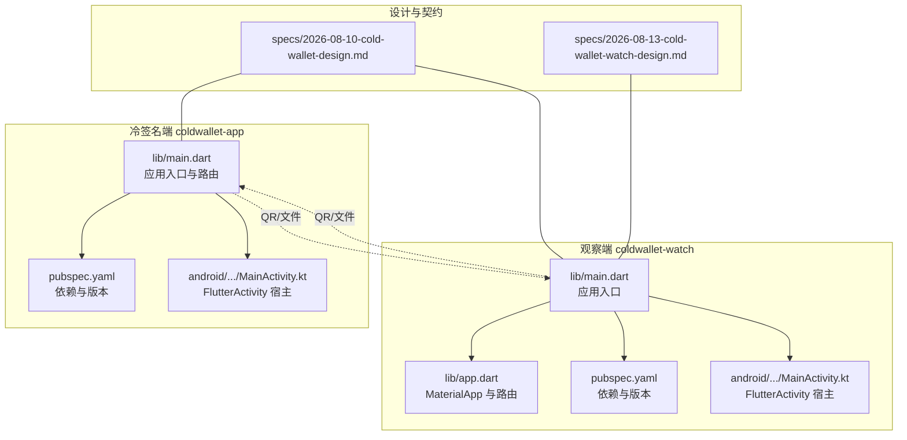
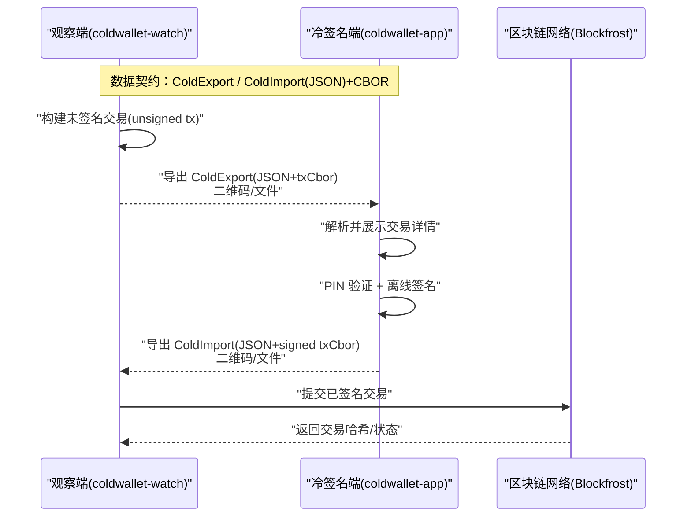
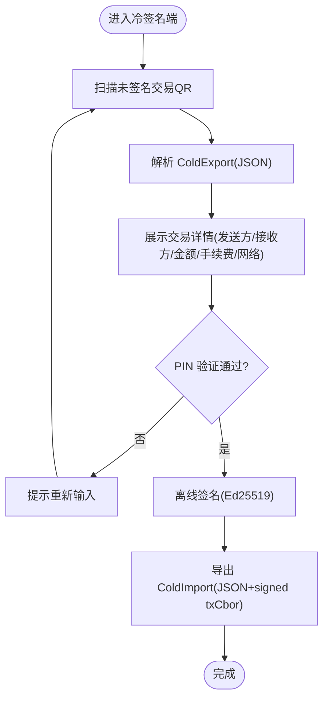
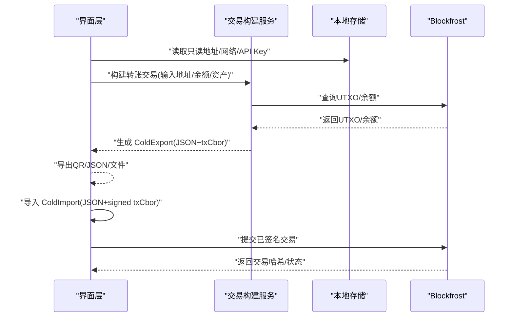
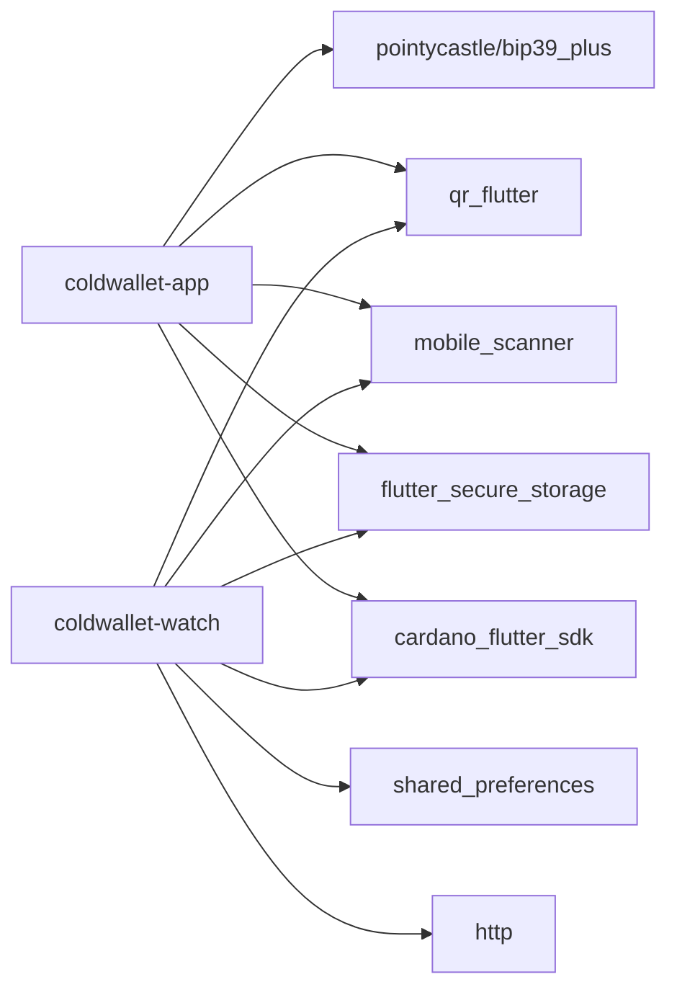

# 项目结构

<cite>
**本文引用的文件**
- [coldwallet-app/README.md](file://coldwallet-app/README.md)
- [coldwallet-watch/README.md](file://coldwallet-watch/README.md)
- [cold-wallet-plugin.md](file://cold-wallet-plugin.md)
- [coldwallet-app/lib/main.dart](file://coldwallet-app/lib/main.dart)
- [coldwallet-watch/lib/main.dart](file://coldwallet-watch/lib/main.dart)
- [coldwallet-watch/lib/app.dart](file://coldwallet-watch/lib/app.dart)
- [coldwallet-app/pubspec.yaml](file://coldwallet-app/pubspec.yaml)
- [coldwallet-watch/pubspec.yaml](file://coldwallet-watch/pubspec.yaml)
- [coldwallet-app/android/app/src/main/kotlin/com/coldwallet/coldwallet_app/MainActivity.kt](file://coldwallet-app/android/app/src/main/kotlin/com/coldwallet/coldwallet_app/MainActivity.kt)
- [coldwallet-watch/android/app/src/main/kotlin/com/coldwallet/coldwallet_watch/MainActivity.kt](file://coldwallet-watch/android/app/src/main/kotlin/com/coldwallet/coldwallet_watch/MainActivity.kt)
- [docs/superpowers/specs/2026-08-10-cold-wallet-design.md](file://docs/superpowers/specs/2026-08-10-cold-wallet-design.md)
- [docs/superpowers/specs/2026-08-13-cold-wallet-watch-design.md](file://docs/superpowers/specs/2026-08-13-cold-wallet-watch-design.md)
</cite>

## 目录
1. [简介](#简介)
2. [项目结构](#项目结构)
3. [核心组件](#核心组件)
4. [架构总览](#架构总览)
5. [详细组件分析](#详细组件分析)
6. [依赖分析](#依赖分析)
7. [性能考虑](#性能考虑)
8. [故障排查指南](#故障排查指南)
9. [结论](#结论)
10. [附录：新模块添加与规范](#附录新模块添加与规范)

## 简介
本仓库采用“双端分离”的冷钱包方案：冷签名端（coldwallet-app）完全离线，负责助记词管理、私钥签名与交易导出；观察钱包（coldwallet-watch）为联网只读端，负责余额查询、构建未签名交易、导入已签名交易并提交上链。两端通过统一的 JSON 契约（ColdExport/ColdImport）配合 CBOR 交易体进行二维码或文件交换，确保私钥永不触网。

## 项目结构
仓库包含两个独立的 Flutter 应用与一份设计文档：
- coldwallet-app：离线签名端，Android 平台，使用 cardano_flutter_sdk 完成助记词派生、PIN 验证、交易签名与 QR/文件导出。
- coldwallet-watch：联网观察端，Android 平台，使用 Blockfrost 查询余额与 UTXO，构建 unsigned tx，并通过 QR/JSON/文件导出给冷端签名后回传提交。
- docs/superpowers/specs：冷钱包与观察端的设计规格，定义数据契约、流程与安全策略。

图表来源
- [coldwallet-app/lib/main.dart:1-51](file://coldwallet-app/lib/main.dart#L1-L51)
- [coldwallet-watch/lib/main.dart:1-12](file://coldwallet-watch/lib/main.dart#L1-L12)
- [coldwallet-watch/lib/app.dart:1-40](file://coldwallet-watch/lib/app.dart#L1-L40)
- [coldwallet-app/pubspec.yaml:1-100](file://coldwallet-app/pubspec.yaml#L1-L100)
- [coldwallet-watch/pubspec.yaml:1-101](file://coldwallet-watch/pubspec.yaml#L1-L101)
- [coldwallet-app/android/app/src/main/kotlin/com/coldwallet/coldwallet_app/MainActivity.kt:1-6](file://coldwallet-app/android/app/src/main/kotlin/com/coldwallet/coldwallet_app/MainActivity.kt#L1-L6)
- [coldwallet-watch/android/app/src/main/kotlin/com/coldwallet/coldwallet_watch/MainActivity.kt:1-6](file://coldwallet-watch/android/app/src/main/kotlin/com/coldwallet/coldwallet_watch/MainActivity.kt#L1-L6)
- [docs/superpowers/specs/2026-08-10-cold-wallet-design.md:1-363](file://docs/superpowers/specs/2026-08-10-cold-wallet-design.md#L1-L363)
- [docs/superpowers/specs/2026-08-13-cold-wallet-watch-design.md:1-332](file://docs/superpowers/specs/2026-08-13-cold-wallet-watch-design.md#L1-L332)

章节来源
- [coldwallet-app/README.md:1-18](file://coldwallet-app/README.md#L1-L18)
- [coldwallet-watch/README.md:1-18](file://coldwallet-watch/README.md#L1-L18)
- [cold-wallet-plugin.md:1-234](file://cold-wallet-plugin.md#L1-L234)

## 核心组件
- 冷签名端（coldwallet-app）
  - 职责：助记词生成/导入、BIP-39 校验、PIN 设置与验证、CIP-1852 地址派生、扫码解析未签名交易、离线签名、导出签名结果（QR/剪贴板/文件）。
  - 关键实现：入口与路由在 lib/main.dart；依赖在 pubspec.yaml；Android 宿主 MainActivity 继承 FlutterActivity。
- 观察端（coldwallet-watch）
  - 职责：只读地址管理、余额与资产查询、构建未签名交易、导出 ColdExport（QR/JSON/文件）、导入 ColdImport（QR/文件）、提交已签名交易到网络。
  - 关键实现：入口 main.dart 启动 app.dart 中的 MaterialApp 与路由；依赖在 pubspec.yaml；Android 宿主 MainActivity 继承 FlutterActivity。
- 共享契约
  - ColdExport：未签名交易元数据 + CBOR hex。
  - ColdImport：已签名交易 CBOR hex + 交易哈希。
  - 两端通过 QR 码或文件交换上述 JSON 数据，不传输任何私钥或助记词。

章节来源
- [coldwallet-app/lib/main.dart:1-51](file://coldwallet-app/lib/main.dart#L1-L51)
- [coldwallet-watch/lib/main.dart:1-12](file://coldwallet-watch/lib/main.dart#L1-L12)
- [coldwallet-watch/lib/app.dart:1-40](file://coldwallet-watch/lib/app.dart#L1-L40)
- [coldwallet-app/pubspec.yaml:1-100](file://coldwallet-app/pubspec.yaml#L1-L100)
- [coldwallet-watch/pubspec.yaml:1-101](file://coldwallet-watch/pubspec.yaml#L1-L101)
- [docs/superpowers/specs/2026-08-10-cold-wallet-design.md:299-345](file://docs/superpowers/specs/2026-08-10-cold-wallet-design.md#L299-L345)
- [docs/superpowers/specs/2026-08-13-cold-wallet-watch-design.md:146-174](file://docs/superpowers/specs/2026-08-13-cold-wallet-watch-design.md#L146-L174)

## 架构总览
双端通过“冷/热分离”的安全边界协作：
- 冷端（coldwallet-app）：完全离线，仅处理敏感密钥与签名，输出 signed-tx。
- 热端（coldwallet-watch）：联网只读，负责链上交互与交易构建，输入 unsigned-tx，输出 signed-tx 提交。

图表来源
- [docs/superpowers/specs/2026-08-10-cold-wallet-design.md:299-345](file://docs/superpowers/specs/2026-08-10-cold-wallet-design.md#L299-L345)
- [docs/superpowers/specs/2026-08-13-cold-wallet-watch-design.md:178-223](file://docs/superpowers/specs/2026-08-13-cold-wallet-watch-design.md#L178-L223)

## 详细组件分析

### 冷签名端（coldwallet-app）
- 入口与路由
  - 应用入口初始化并注册根组件与路由，包括首页、钱包设置、扫码签名等页面。
- 安全存储与密码学
  - 使用 flutter_secure_storage 将 PIN/密钥材料保存在 Android Keystore。
  - 使用 cardano_flutter_sdk 完成 BIP-39/BIP-32/CIP-1852 派生与 Ed25519 扩展签名。
- 扫码与导出
  - mobile_scanner 扫描插件端 QR 码，qr_flutter 展示签名结果 QR，支持复制/分享文件。

图表来源
- [coldwallet-app/lib/main.dart:1-51](file://coldwallet-app/lib/main.dart#L1-L51)
- [coldwallet-app/pubspec.yaml:30-47](file://coldwallet-app/pubspec.yaml#L30-L47)
- [docs/superpowers/specs/2026-08-10-cold-wallet-design.md:217-297](file://docs/superpowers/specs/2026-08-10-cold-wallet-design.md#L217-L297)

章节来源
- [coldwallet-app/lib/main.dart:1-51](file://coldwallet-app/lib/main.dart#L1-L51)
- [coldwallet-app/pubspec.yaml:1-100](file://coldwallet-app/pubspec.yaml#L1-L100)
- [coldwallet-app/android/app/src/main/kotlin/com/coldwallet/coldwallet_app/MainActivity.kt:1-6](file://coldwallet-app/android/app/src/main/kotlin/com/coldwallet/coldwallet_app/MainActivity.kt#L1-L6)
- [docs/superpowers/specs/2026-08-10-cold-wallet-design.md:217-297](file://docs/superpowers/specs/2026-08-10-cold-wallet-design.md#L217-L297)

### 观察端（coldwallet-watch）
- 入口与路由
  - 应用入口启动 MaterialApp，配置主题与路由表，涵盖首页、添加钱包、发送、收款、导出交易、导入签名、设置等页面。
- 网络与数据
  - 使用 http 访问 Blockfrost 获取余额/UTXO，构建 unsigned tx，封装为 ColdExport 导出。
  - 导入 ColdImport 后调用 Blockfrost 提交交易。
- 本地存储
  - SharedPreferences 保存只读地址与设置；flutter_secure_storage 加密保存 API Key。

图表来源
- [coldwallet-watch/lib/main.dart:1-12](file://coldwallet-watch/lib/main.dart#L1-L12)
- [coldwallet-watch/lib/app.dart:1-40](file://coldwallet-watch/lib/app.dart#L1-L40)
- [coldwallet-watch/pubspec.yaml:30-44](file://coldwallet-watch/pubspec.yaml#L30-L44)
- [docs/superpowers/specs/2026-08-13-cold-wallet-watch-design.md:178-223](file://docs/superpowers/specs/2026-08-13-cold-wallet-watch-design.md#L178-L223)

章节来源
- [coldwallet-watch/lib/main.dart:1-12](file://coldwallet-watch/lib/main.dart#L1-L12)
- [coldwallet-watch/lib/app.dart:1-40](file://coldwallet-watch/lib/app.dart#L1-L40)
- [coldwallet-watch/pubspec.yaml:1-101](file://coldwallet-watch/pubspec.yaml#L1-L101)
- [coldwallet-watch/android/app/src/main/kotlin/com/coldwallet/coldwallet_watch/MainActivity.kt:1-6](file://coldwallet-watch/android/app/src/main/kotlin/com/coldwallet/coldwallet_watch/MainActivity.kt#L1-L6)
- [docs/superpowers/specs/2026-08-13-cold-wallet-watch-design.md:178-223](file://docs/superpowers/specs/2026-08-13-cold-wallet-watch-design.md#L178-L223)

### 共享代码组织方式
- 当前仓库中冷/热两端为独立 Flutter 工程，各自维护依赖与源码。
- 共享逻辑以“数据契约”形式体现：ColdExport/ColdImport JSON 结构与 CBOR 交易体编码/解码约定，由设计规格统一约束。
- 未来若需复用业务逻辑，可抽取为 Dart 包供两端引用，但 MVP 阶段保持解耦以降低耦合风险。

章节来源
- [docs/superpowers/specs/2026-08-10-cold-wallet-design.md:34-73](file://docs/superpowers/specs/2026-08-10-cold-wallet-design.md#L34-L73)
- [docs/superpowers/specs/2026-08-13-cold-wallet-watch-design.md:318-331](file://docs/superpowers/specs/2026-08-13-cold-wallet-watch-design.md#L318-L331)

## 依赖分析
- 冷签名端依赖
  - 链上 SDK：cardano_flutter_sdk、cardano_dart_types
  - 安全存储：flutter_secure_storage
  - 助记词与密码学：bip39_plus、pointycastle
  - 扫码与展示：mobile_scanner、qr_flutter
  - 文件与路径：path_provider、file_picker
- 观察端依赖
  - 链上 SDK：cardano_flutter_sdk、cardano_dart_types
  - 网络请求：http
  - 扫码与展示：mobile_scanner、qr_flutter
  - 本地存储：shared_preferences、flutter_secure_storage
  - 国际化与时间：intl
- Android 原生层
  - 两端均通过 FlutterActivity 作为宿主，无额外原生逻辑。

图表来源
- [coldwallet-app/pubspec.yaml:30-47](file://coldwallet-app/pubspec.yaml#L30-L47)
- [coldwallet-watch/pubspec.yaml:30-44](file://coldwallet-watch/pubspec.yaml#L30-L44)

章节来源
- [coldwallet-app/pubspec.yaml:1-100](file://coldwallet-app/pubspec.yaml#L1-L100)
- [coldwallet-watch/pubspec.yaml:1-101](file://coldwallet-watch/pubspec.yaml#L1-L101)

## 性能考虑
- 二维码容量：ColdExport/ColdImport JSON 体积较小，单 QR 码即可承载，避免分帧复杂度。
- 网络请求：观察端对 Blockfrost 的请求应做重试与超时控制，减少失败率与等待时间。
- 内存与隐私：冷端无网络请求，避免引入不必要的库；签名完成后及时释放敏感对象引用。
- 构建优化：按需启用 Material3 与最小化依赖，缩短编译与打包时间。

[本节为通用指导，无需特定文件来源]

## 故障排查指南
- 地址格式错误：在观察端添加地址时进行格式校验，提示用户修正。
- 网络/API Key 错误：Blockfrost 请求失败时重试一次，并提示检查网络或 API Key。
- 余额不足：构建交易前检查余额与费用，提前拦截。
- 二维码识别失败：提供“改用文件”的备选方案，提升容错性。
- 导入签名失败：校验 ColdImport JSON 结构，提示文件格式错误。
- 提交交易失败：显示 Blockfrost 返回的错误信息，便于定位问题。

章节来源
- [docs/superpowers/specs/2026-08-13-cold-wallet-watch-design.md:260-272](file://docs/superpowers/specs/2026-08-13-cold-wallet-watch-design.md#L260-L272)

## 结论
本项目通过冷/热双端分离与统一的数据契约，实现了安全的 Cardano 冷签名闭环。冷端专注密钥与签名，热端专注链上交互与用户体验，两者通过 QR/文件交换 CBOR 交易体，确保私钥永不触网。MVP 聚焦基础转账与只读功能，后续可扩展质押、治理与 dApp 集成。

[本节为总结性内容，无需特定文件来源]

## 附录：新模块添加与规范
- 目录组织原则
  - 按功能划分目录：models（数据模型）、services（业务与服务）、screens（页面）、widgets（可复用组件）。
  - 每个新增功能在对应目录下创建文件，并在入口或路由中注册。
- 文件命名约定
  - Dart 文件使用小写下划线命名（如 send_screen.dart）。
  - 服务类与方法名使用驼峰式（如 buildTransferTx）。
  - 常量与枚举使用大写加下划线（如 NETWORK_MAINNET）。
- 包结构设计原则
  - 冷/热两端保持独立，避免直接相互依赖。
  - 共享逻辑优先以“数据契约”形式固化于设计规格；如需代码级共享，再抽取为 Dart 包。
  - 对外暴露的接口尽量稳定，变更需同步更新契约文档。
- Android 原生层配置
  - 默认使用 FlutterActivity 作为宿主，新增原生能力时在对应 MainActivity 中扩展。
  - 权限与清单配置遵循 Flutter 标准模板，谨慎添加网络与硬件权限。
- 依赖管理
  - 在各自 pubspec.yaml 中添加依赖，保持最小必要集合。
  - 升级第三方库时评估安全风险与兼容性，尤其是密码学与存储相关库。
- 测试建议
  - 为关键服务编写单元测试（如交易构建、CBOR 编解码）。
  - 为 UI 流程编写 widget 测试，覆盖扫码、导入导出主路径。

[本节为通用规范说明，无需特定文件来源]