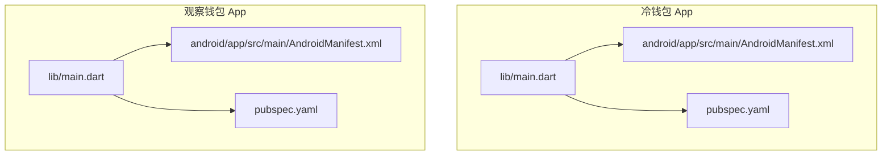
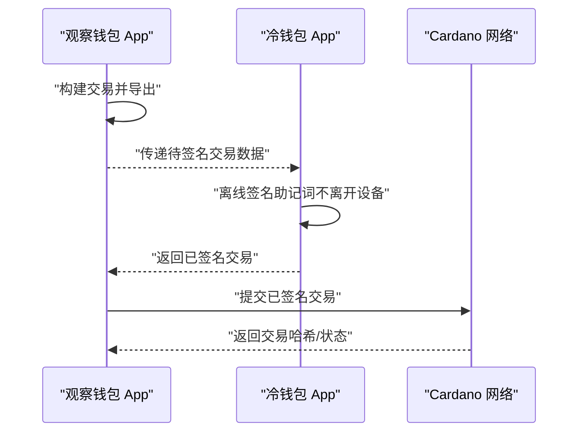
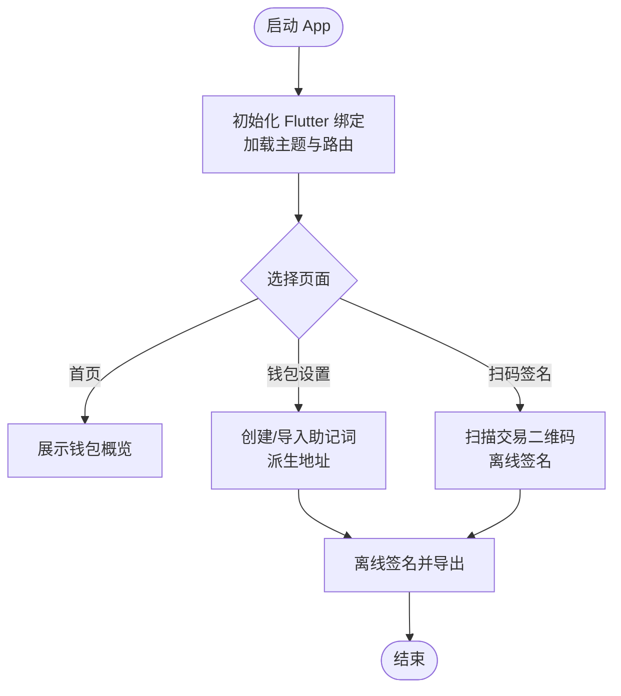
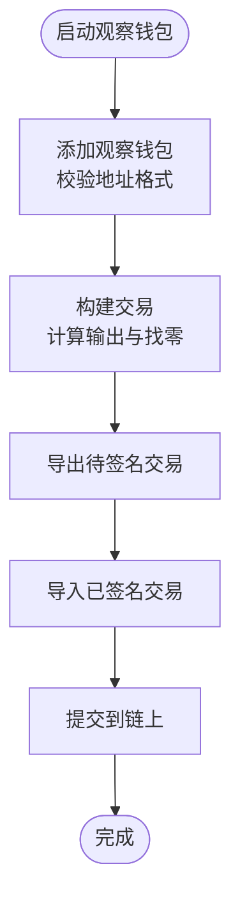

# 快速开始

<cite>
**本文引用的文件**
- [coldwallet-app/README.md](file://coldwallet-app/README.md)
- [coldwallet-watch/README.md](file://coldwallet-watch/README.md)
- [coldwallet-app/pubspec.yaml](file://coldwallet-app/pubspec.yaml)
- [coldwallet-watch/pubspec.yaml](file://coldwallet-watch/pubspec.yaml)
- [coldwallet-app/lib/main.dart](file://coldwallet-app/lib/main.dart)
- [coldwallet-watch/lib/main.dart](file://coldwallet-watch/lib/main.dart)
- [coldwallet-app/android/app/src/main/AndroidManifest.xml](file://coldwallet-app/android/app/src/main/AndroidManifest.xml)
- [coldwallet-watch/android/app/src/main/AndroidManifest.xml](file://coldwallet-watch/android/app/src/main/AndroidManifest.xml)
- [coldwallet-app/android/local.properties](file://coldwallet-app/android/local.properties)
- [coldwallet-watch/android/local.properties](file://coldwallet-watch/android/local.properties)
- [coldwallet-app/analysis_options.yaml](file://coldwallet-app/analysis_options.yaml)
- [coldwallet-watch/analysis_options.yaml](file://coldwallet-watch/analysis_options.yaml)
- [coldwallet-app/lib/services/wallet_service.dart](file://coldwallet-app/lib/services/wallet_service.dart)
- [coldwallet-watch/lib/services/wallet_service.dart](file://coldwallet-watch/lib/services/wallet_service.dart)
- [coldwallet-watch/lib/services/tx_builder_service.dart](file://coldwallet-watch/lib/services/tx_builder_service.dart)
</cite>

## 目录
1. [简介](#简介)
2. [项目结构](#项目结构)
3. [核心组件](#核心组件)
4. [架构总览](#架构总览)
5. [详细组件分析](#详细组件分析)
6. [依赖分析](#依赖分析)
7. [性能注意事项](#性能注意事项)
8. [故障排除指南](#故障排除指南)
9. [结论](#结论)
10. [附录](#附录)

## 简介
本指南面向首次接触 ColdWallet 的新用户，帮助你在最短时间内完成开发环境搭建、依赖安装、项目克隆与配置，并成功运行冷钱包 App（离线签名）与观察钱包 App（联网只读）。你将获得：
- 明确的开发环境要求（Flutter/Dart SDK、Android SDK/NDK、Gradle、JDK）
- 完整的依赖安装步骤与命令示例
- 项目克隆与本地配置说明
- 冷钱包与观察钱包的首次运行、基本配置与测试验证流程
- 常见问题定位与解决方案

## 项目结构
仓库包含两个 Flutter 应用：
- coldwallet-app：完全离线的 Cardano 冷钱包，负责助记词管理、离线签名与交易导出。
- coldwallet-watch：联网的观察钱包，用于查看余额、构建交易并提交已签名交易。

图表来源
- [coldwallet-app/lib/main.dart:1-51](file://coldwallet-app/lib/main.dart#L1-L51)
- [coldwallet-watch/lib/main.dart:1-12](file://coldwallet-watch/lib/main.dart#L1-L12)
- [coldwallet-app/android/app/src/main/AndroidManifest.xml:1-46](file://coldwallet-app/android/app/src/main/AndroidManifest.xml#L1-L46)
- [coldwallet-watch/android/app/src/main/AndroidManifest.xml:1-53](file://coldwallet-watch/android/app/src/main/AndroidManifest.xml#L1-L53)

章节来源
- [coldwallet-app/README.md:1-18](file://coldwallet-app/README.md#L1-L18)
- [coldwallet-watch/README.md:1-18](file://coldwallet-watch/README.md#L1-L18)

## 核心组件
- 冷钱包 App（coldwallet-app）
  - 入口：lib/main.dart 初始化 Material 主题与路由，提供首页、钱包设置、扫码签名等页面。
  - 关键能力：助记词生成与校验、HD 钱包创建、地址派生、离线签名与交易导出。
- 观察钱包 App（coldwallet-watch）
  - 入口：lib/main.dart 启动应用。
  - 关键能力：添加观察钱包、查询余额、构建交易、导入已签名交易并提交到链上。

章节来源
- [coldwallet-app/lib/main.dart:1-51](file://coldwallet-app/lib/main.dart#L1-L51)
- [coldwallet-watch/lib/main.dart:1-12](file://coldwallet-watch/lib/main.dart#L1-L12)
- [coldwallet-app/lib/services/wallet_service.dart:35-75](file://coldwallet-app/lib/services/wallet_service.dart#L35-L75)
- [coldwallet-watch/lib/services/wallet_service.dart:44-87](file://coldwallet-watch/lib/services/wallet_service.dart#L44-L87)
- [coldwallet-watch/lib/services/tx_builder_service.dart:118-151](file://coldwallet-watch/lib/services/tx_builder_service.dart#L118-L151)

## 架构总览
下图展示了冷钱包与观察钱包在典型交易流程中的交互关系：观察钱包构建交易并导出；冷钱包离线签名后返回已签名交易；观察钱包提交到链上。

图表来源
- [coldwallet-watch/lib/services/tx_builder_service.dart:118-151](file://coldwallet-watch/lib/services/tx_builder_service.dart#L118-L151)
- [coldwallet-app/lib/services/wallet_service.dart:35-75](file://coldwallet-app/lib/services/wallet_service.dart#L35-L75)

## 详细组件分析

### 冷钱包 App（coldwallet-app）
- 应用入口与路由
  - 初始化 Flutter 绑定并启动根组件，配置 Material3 主题与路由表，包括首页、钱包设置、扫码签名等。
- 钱包服务
  - 支持从随机熵生成助记词、校验助记词有效性、基于助记词创建 HD 钱包、派生第一个外部支付地址。
- Android 清单
  - 声明主 Activity、嵌入版本元数据、文本处理查询等。

图表来源
- [coldwallet-app/lib/main.dart:11-48](file://coldwallet-app/lib/main.dart#L11-L48)
- [coldwallet-app/lib/services/wallet_service.dart:35-75](file://coldwallet-app/lib/services/wallet_service.dart#L35-L75)

章节来源
- [coldwallet-app/lib/main.dart:1-51](file://coldwallet-app/lib/main.dart#L1-L51)
- [coldwallet-app/lib/services/wallet_service.dart:35-75](file://coldwallet-app/lib/services/wallet_service.dart#L35-L75)
- [coldwallet-app/android/app/src/main/AndroidManifest.xml:1-46](file://coldwallet-app/android/app/src/main/AndroidManifest.xml#L1-L46)

### 观察钱包 App（coldwallet-watch）
- 应用入口
  - 启动根组件，准备联网与只读功能。
- 钱包服务
  - 支持添加观察钱包、删除与更新钱包、校验 Cardano 地址格式（bech32 前缀与最小长度）。
- 交易构建服务
  - 构建输出项，包含目标地址与找零输出，满足最小 UTXO 值约束。

图表来源
- [coldwallet-watch/lib/services/wallet_service.dart:44-87](file://coldwallet-watch/lib/services/wallet_service.dart#L44-L87)
- [coldwallet-watch/lib/services/tx_builder_service.dart:118-151](file://coldwallet-watch/lib/services/tx_builder_service.dart#L118-L151)

章节来源
- [coldwallet-watch/lib/main.dart:1-12](file://coldwallet-watch/lib/main.dart#L1-L12)
- [coldwallet-watch/lib/services/wallet_service.dart:44-87](file://coldwallet-watch/lib/services/wallet_service.dart#L44-L87)
- [coldwallet-watch/lib/services/tx_builder_service.dart:118-151](file://coldwallet-watch/lib/services/tx_builder_service.dart#L118-L151)
- [coldwallet-watch/android/app/src/main/AndroidManifest.xml:1-53](file://coldwallet-watch/android/app/src/main/AndroidManifest.xml#L1-L53)

## 依赖分析
- Dart/Flutter SDK 版本
  - 两个子项目均声明 Dart SDK 版本为 ^3.11.1。
- 主要依赖
  - 冷钱包 App：cardano_flutter_sdk、cardano_dart_types、flutter_secure_storage、bip39_plus、mobile_scanner、qr_flutter、path_provider、file_picker 等。
  - 观察钱包 App：cardano_flutter_sdk、cardano_dart_types、http、mobile_scanner、qr_flutter、file_picker、path_provider、shared_preferences、flutter_secure_storage、intl 等。
- 代码质量
  - 启用 flutter_lints，便于统一代码风格与静态检查。

章节来源
- [coldwallet-app/pubspec.yaml:21-47](file://coldwallet-app/pubspec.yaml#L21-L47)
- [coldwallet-watch/pubspec.yaml:21-44](file://coldwallet-watch/pubspec.yaml#L21-L44)
- [coldwallet-app/analysis_options.yaml:1-29](file://coldwallet-app/analysis_options.yaml#L1-L29)
- [coldwallet-watch/analysis_options.yaml:1-29](file://coldwallet-watch/analysis_options.yaml#L1-L29)

## 性能注意事项
- 离线签名在冷钱包端进行，避免敏感信息外泄，适合高安全场景。
- 观察钱包仅做只读与交易提交，减少不必要的本地计算。
- 使用 secure storage 存储敏感数据，降低泄露风险。
- 合理控制 UTXO 数量与交易大小，有助于提高网络确认效率。

## 故障排除指南
- 无法解析 Android SDK 路径
  - 检查 android/local.properties 中的 sdk.dir 与 flutter.sdk 是否指向本机正确路径。
  - 参考路径示例：sdk.dir 指向 Android SDK 目录；flutter.sdk 指向 Flutter SDK 目录。
- 权限问题导致摄像头或网络异常
  - 观察钱包需要 INTERNET、CAMERA、存储读写权限（旧版本系统），确保 AndroidManifest 中已声明。
- 依赖下载失败或版本冲突
  - 清理缓存并重新获取依赖：flutter clean && flutter pub get。
  - 若出现 Dart SDK 版本不匹配，请升级至 ^3.11.1 或以上。
- 构建模式与版本信息
  - local.properties 中可配置 flutter.buildMode、flutter.versionName、flutter.versionCode，按需调整。

章节来源
- [coldwallet-app/android/local.properties:1-5](file://coldwallet-app/android/local.properties#L1-L5)
- [coldwallet-watch/android/local.properties:1-5](file://coldwallet-watch/android/local.properties#L1-L5)
- [coldwallet-watch/android/app/src/main/AndroidManifest.xml:1-53](file://coldwallet-watch/android/app/src/main/AndroidManifest.xml#L1-L53)

## 结论
通过本指南，你应能完成 ColdWallet 的开发环境搭建、依赖安装与项目配置，并成功运行冷钱包与观察钱包。建议先以测试网验证端到端流程，再切换至主网。遇到问题时优先检查 SDK 路径、权限声明与依赖版本一致性。

## 附录

### 开发环境要求
- Flutter SDK：建议使用稳定版，Dart SDK 版本需满足 ^3.11.1。
- Android 开发环境：
  - Android SDK（含平台工具与构建工具）
  - Android NDK（如需编译原生插件）
  - Gradle（由 Flutter 管理）
  - JDK（推荐 JDK 17）
- 其他：
  - 可选：iOS 开发环境（如需要构建 iOS 应用）
  - 可选：Web 浏览器（用于 Web 调试）

### 依赖安装步骤
- 安装 Flutter 与 Dart SDK（确保版本满足 ^3.11.1）。
- 安装 Android 开发工具链（SDK、NDK、JDK）。
- 配置环境变量（ANDROID_HOME、JAVA_HOME、PATH 等）。
- 在项目中执行依赖获取：
  - 冷钱包：cd coldwallet-app && flutter pub get
  - 观察钱包：cd coldwallet-watch && flutter pub get

### 项目克隆与配置
- 克隆仓库后，分别进入两个子项目目录执行依赖获取。
- 检查 android/local.properties 中的 sdk.dir 与 flutter.sdk 是否正确指向本机路径。
- 如需自定义构建模式或版本号，可在 local.properties 中修改相应字段。

### 首次运行与基本配置
- 冷钱包 App
  - 连接 Android 设备或使用模拟器。
  - 运行冷钱包：flutter run（在 coldwallet-app 目录下）。
  - 首次运行：进入“钱包设置”，生成或导入助记词，派生地址。
  - 测试验证：使用“扫码签名”功能，对观察钱包导出的交易进行离线签名并导出。
- 观察钱包 App
  - 运行观察钱包：flutter run（在 coldwallet-watch 目录下）。
  - 首次运行：添加观察钱包（输入 Cardano 地址，系统将校验格式）。
  - 测试验证：构建一笔小额转账交易，导出待签名交易；在冷钱包中签名后，将已签名交易导入观察钱包并提交到链上。

### 常见命令行示例
- 获取依赖
  - cd coldwallet-app && flutter pub get
  - cd coldwallet-watch && flutter pub get
- 清理与重建
  - flutter clean
  - flutter build apk --release（或对应平台）
- 分析与格式化
  - flutter analyze
  - flutter format .

### 测试验证清单
- 冷钱包
  - 能生成/校验助记词
  - 能派生地址
  - 能对交易进行离线签名并导出
- 观察钱包
  - 能添加观察钱包并校验地址格式
  - 能构建交易并导出
  - 能导入已签名交易并提交到链上