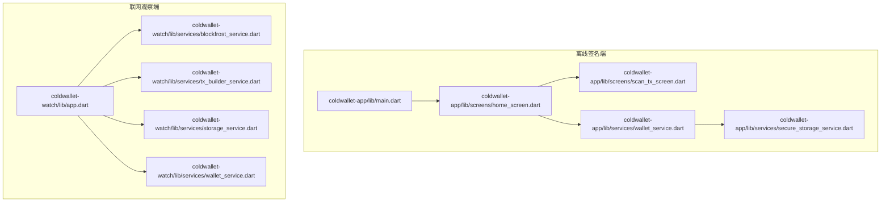
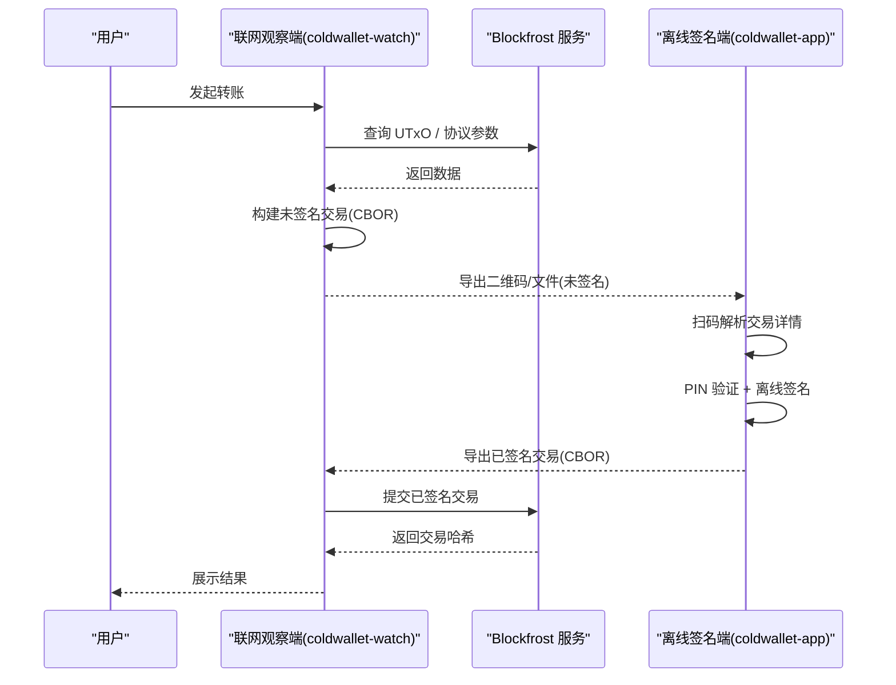
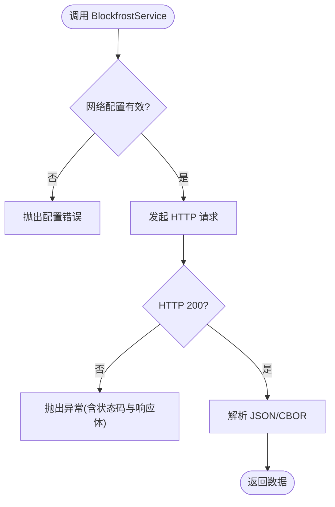
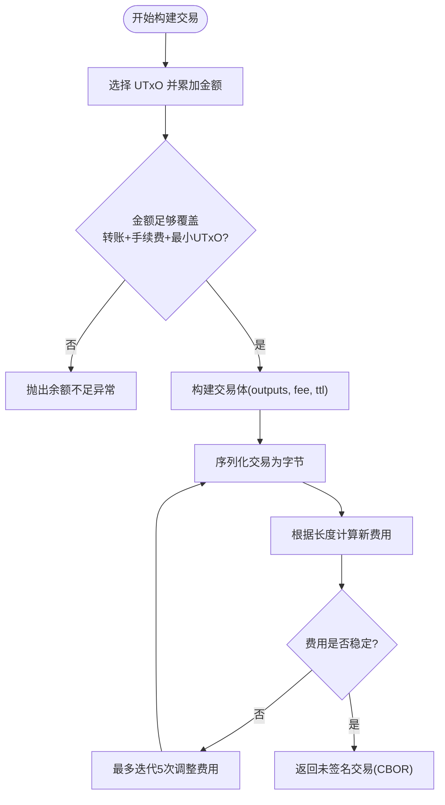
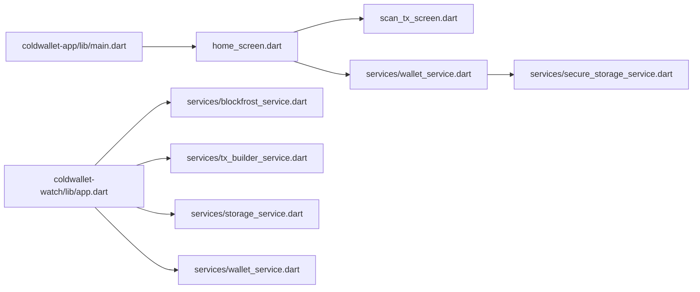

# 故障排除

<cite>
**本文引用的文件**
- [coldwallet-app/lib/main.dart](file://coldwallet-app/lib/main.dart)
- [coldwallet-watch/lib/app.dart](file://coldwallet-watch/lib/app.dart)
- [coldwallet-watch/lib/services/blockfrost_service.dart](file://coldwallet-watch/lib/services/blockfrost_service.dart)
- [coldwallet-watch/lib/services/tx_builder_service.dart](file://coldwallet-watch/lib/services/tx_builder_service.dart)
- [coldwallet-watch/lib/services/storage_service.dart](file://coldwallet-watch/lib/services/storage_service.dart)
- [coldwallet-watch/lib/services/wallet_service.dart](file://coldwallet-watch/lib/services/wallet_service.dart)
- [coldwallet-app/lib/services/secure_storage_service.dart](file://coldwallet-app/lib/services/secure_storage_service.dart)
- [coldwallet-app/lib/services/wallet_service.dart](file://coldwallet-app/lib/services/wallet_service.dart)
- [coldwallet-app/lib/screens/home_screen.dart](file://coldwallet-app/lib/screens/home_screen.dart)
- [coldwallet-app/lib/screens/scan_tx_screen.dart](file://coldwallet-app/lib/screens/scan_tx_screen.dart)
- [coldwallet-app/pubspec.yaml](file://coldwallet-app/pubspec.yaml)
- [coldwallet-watch/pubspec.yaml](file://coldwallet-watch/pubspec.yaml)
- [cold-wallet-plugin.md](file://cold-wallet-plugin.md)
</cite>

## 目录
1. [简介](#简介)
2. [项目结构](#项目结构)
3. [核心组件](#核心组件)
4. [架构总览](#架构总览)
5. [详细组件分析](#详细组件分析)
6. [依赖关系分析](#依赖关系分析)
7. [性能与稳定性](#性能与稳定性)
8. [故障排除指南](#故障排除指南)
9. [结论](#结论)
10. [附录](#附录)

## 简介
本指南面向 ColdWallet（Cardano 冷钱包）的用户与开发者，聚焦安装、连接、交易失败、权限错误等常见问题，提供日志分析方法、调试技巧与问题定位流程。同时涵盖性能诊断、内存泄漏检测、网络请求调试，并给出社区支持与问题反馈方式，帮助快速定位和解决问题。

## 项目结构
ColdWallet 由两个 Flutter 应用组成：
- 离线签名端（coldwallet-app）：完全离线，负责助记词管理、PIN、二维码扫描未签名交易、离线签名与导出。
- 联网观察端（coldwallet-watch）：只读查询与交易构建、提交已签名交易到链上。

图表来源
- [coldwallet-app/lib/main.dart:11-49](file://coldwallet-app/lib/main.dart#L11-L49)
- [coldwallet-watch/lib/app.dart:18-38](file://coldwallet-watch/lib/app.dart#L18-L38)
- [coldwallet-watch/lib/services/blockfrost_service.dart:21-41](file://coldwallet-watch/lib/services/blockfrost_service.dart#L21-L41)
- [coldwallet-watch/lib/services/tx_builder_service.dart:37-118](file://coldwallet-watch/lib/services/tx_builder_service.dart#L37-L118)
- [coldwallet-watch/lib/services/storage_service.dart:12-28](file://coldwallet-watch/lib/services/storage_service.dart#L12-L28)
- [coldwallet-watch/lib/services/wallet_service.dart:44-87](file://coldwallet-watch/lib/services/wallet_service.dart#L44-L87)
- [coldwallet-app/lib/services/secure_storage_service.dart:16-22](file://coldwallet-app/lib/services/secure_storage_service.dart#L16-L22)
- [coldwallet-app/lib/services/wallet_service.dart:60-109](file://coldwallet-app/lib/services/wallet_service.dart#L60-L109)

章节来源
- [coldwallet-app/lib/main.dart:11-49](file://coldwallet-app/lib/main.dart#L11-L49)
- [coldwallet-watch/lib/app.dart:18-38](file://coldwallet-watch/lib/app.dart#L18-L38)

## 核心组件
- 离线签名端
  - 安全存储：使用 Android Keystore 加密保存助记词、PIN、钱包列表和网络设置。
  - 钱包服务：助记词生成/校验、HD 钱包创建、地址派生、网络切换、钱包列表管理。
  - 扫码签名：通过摄像头扫描未签名交易二维码，解析后进入签名流程。
- 联网观察端
  - Blockfrost 服务：UTxO 查询、余额、最新区块、协议参数、交易提交。
  - 交易构建：UTxO 选择、手续费估算与收敛、输出构造、序列化。
  - 本地存储：SharedPreferences 存储钱包列表与启用资产；FlutterSecureStorage 存储 API Key。
  - 钱包服务：添加/删除/更新只读钱包，地址格式校验。

章节来源
- [coldwallet-app/lib/services/secure_storage_service.dart:16-107](file://coldwallet-app/lib/services/secure_storage_service.dart#L16-L107)
- [coldwallet-app/lib/services/wallet_service.dart:60-109](file://coldwallet-app/lib/services/wallet_service.dart#L60-L109)
- [coldwallet-app/lib/screens/scan_tx_screen.dart:43-87](file://coldwallet-app/lib/screens/scan_tx_screen.dart#L43-L87)
- [coldwallet-watch/lib/services/blockfrost_service.dart:43-107](file://coldwallet-watch/lib/services/blockfrost_service.dart#L43-L107)
- [coldwallet-watch/lib/services/tx_builder_service.dart:37-118](file://coldwallet-watch/lib/services/tx_builder_service.dart#L37-L118)
- [coldwallet-watch/lib/services/storage_service.dart:12-87](file://coldwallet-watch/lib/services/storage_service.dart#L12-L87)
- [coldwallet-watch/lib/services/wallet_service.dart:44-87](file://coldwallet-watch/lib/services/wallet_service.dart#L44-L87)

## 架构总览
冷钱包的完整交易流涉及“联网设备”与“离线设备”之间的二维码或文件传输。离线设备仅持有私钥，不触网；联网设备负责查询链上数据与提交交易。

图表来源
- [cold-wallet-plugin.md:55-80](file://cold-wallet-plugin.md#L55-L80)
- [coldwallet-watch/lib/services/blockfrost_service.dart:92-107](file://coldwallet-watch/lib/services/blockfrost_service.dart#L92-L107)
- [coldwallet-watch/lib/services/tx_builder_service.dart:37-118](file://coldwallet-watch/lib/services/tx_builder_service.dart#L37-L118)
- [coldwallet-app/lib/screens/scan_tx_screen.dart:43-87](file://coldwallet-app/lib/screens/scan_tx_screen.dart#L43-L87)

## 详细组件分析

### 网络与链上交互（Blockfrost 服务）
- 职责：封装对 Blockfrost REST API 的请求，包括 UTxO、余额、最新区块、协议参数、交易提交。
- 错误处理：所有非 200 响应抛出异常，包含状态码与响应体，便于上层捕获与提示。
- 关键点：提交交易时 Content-Type 为 application/cbor，需确保字节数组正确。

图表来源
- [coldwallet-watch/lib/services/blockfrost_service.dart:43-107](file://coldwallet-watch/lib/services/blockfrost_service.dart#L43-L107)

章节来源
- [coldwallet-watch/lib/services/blockfrost_service.dart:21-107](file://coldwallet-watch/lib/services/blockfrost_service.dart#L21-L107)

### 交易构建与手续费收敛（TxBuilder 服务）
- 职责：从 UTxO 中选择输入、计算初始费用、迭代构建交易体、序列化并重新估算费用，直至稳定。
- 常见异常：余额不足、无法收敛到稳定手续费。
- 优化点：UTxO 选择策略、最小 UTxO 值、TTL 设置、手续费估算上限与重试次数。

图表来源
- [coldwallet-watch/lib/services/tx_builder_service.dart:37-118](file://coldwallet-watch/lib/services/tx_builder_service.dart#L37-L118)

章节来源
- [coldwallet-watch/lib/services/tx_builder_service.dart:37-118](file://coldwallet-watch/lib/services/tx_builder_service.dart#L37-L118)

### 安全存储与权限（Secure Storage 服务）
- 职责：使用 Android Keystore 加密保存敏感数据（助记词、PIN、钱包列表、网络）。
- 权限相关：Android 平台下需要 Keystore 支持；若初始化失败或读取为空，可能导致功能不可用。
- 建议：在首次启动时检查存储可用性，并提供清晰的错误提示与恢复步骤。

章节来源
- [coldwallet-app/lib/services/secure_storage_service.dart:16-107](file://coldwallet-app/lib/services/secure_storage_service.dart#L16-L107)

### 扫码与解析（Scan Tx 屏幕）
- 职责：调用摄像头扫描未签名交易二维码，解析后进入下一步。
- 常见问题：二维码无法解析、相机权限被拒绝、解析内容格式不正确。
- 处理：捕获异常并通过 UI 提示；引导用户授予权限或重新扫描。

章节来源
- [coldwallet-app/lib/screens/scan_tx_screen.dart:43-87](file://coldwallet-app/lib/screens/scan_tx_screen.dart#L43-L87)

### 钱包管理与地址校验（Watch Wallet 服务）
- 职责：添加/删除/更新只读钱包，校验 Cardano 地址格式（bech32 前缀与长度）。
- 常见问题：地址格式无效、当前钱包 ID 丢失导致界面异常。
- 处理：在添加前进行格式校验；删除钱包时自动切换到下一个可用钱包。

章节来源
- [coldwallet-watch/lib/services/wallet_service.dart:44-87](file://coldwallet-watch/lib/services/wallet_service.dart#L44-L87)

## 依赖关系分析
- 离线签名端依赖：cardano_flutter_sdk、bip39_plus、mobile_scanner、flutter_secure_storage 等。
- 联网观察端依赖：http、blockfrost 接口、shared_preferences、flutter_secure_storage 等。
- 关键耦合：
  - 交易构建依赖 Blockfrost 提供的协议参数与 UTxO。
  - 扫码解析依赖 mobile_scanner 与 QR 编码规范。
  - 安全存储依赖平台 Keystore 能力。

图表来源
- [coldwallet-app/lib/main.dart:11-49](file://coldwallet-app/lib/main.dart#L11-L49)
- [coldwallet-watch/lib/app.dart:18-38](file://coldwallet-watch/lib/app.dart#L18-L38)
- [coldwallet-watch/lib/services/blockfrost_service.dart:21-41](file://coldwallet-watch/lib/services/blockfrost_service.dart#L21-L41)
- [coldwallet-watch/lib/services/tx_builder_service.dart:37-118](file://coldwallet-watch/lib/services/tx_builder_service.dart#L37-L118)
- [coldwallet-watch/lib/services/storage_service.dart:12-28](file://coldwallet-watch/lib/services/storage_service.dart#L12-L28)
- [coldwallet-watch/lib/services/wallet_service.dart:44-87](file://coldwallet-watch/lib/services/wallet_service.dart#L44-L87)
- [coldwallet-app/lib/services/wallet_service.dart:60-109](file://coldwallet-app/lib/services/wallet_service.dart#L60-L109)
- [coldwallet-app/lib/services/secure_storage_service.dart:16-22](file://coldwallet-app/lib/services/secure_storage_service.dart#L16-L22)

章节来源
- [coldwallet-app/pubspec.yaml:30-47](file://coldwallet-app/pubspec.yaml#L30-L47)
- [coldwallet-watch/pubspec.yaml:30-44](file://coldwallet-watch/pubspec.yaml#L30-L44)

## 性能与稳定性
- 网络请求
  - Blockfrost 请求超时与重试：建议在调用层增加超时控制与指数退避重试，避免频繁失败影响体验。
  - 协议参数缓存：getProtocolParams 结果可短期缓存，减少重复请求。
- 交易构建
  - UTxO 选择：优先合并小额 UTxO，减少输出数量，降低交易体积与手续费。
  - 手续费收敛：限制最大迭代次数，防止死循环；记录每次迭代的费用变化用于调试。
- 内存与资源
  - 二维码解码：大图片可能占用较多内存，建议在扫描回调中及时释放临时对象。
  - 安全存储：避免在内存中长时间保留明文助记词，操作完成后立即清理引用。
- 稳定性
  - 统一异常包装：将底层异常转换为业务语义明确的错误类型，便于上层统一处理。
  - 日志埋点：在网络请求、交易构建、扫码解析等关键路径记录必要上下文（如地址、网络、金额），便于复现问题。

[本节为通用指导，不直接分析具体文件]

## 故障排除指南

### 安装与启动问题
- 症状：应用无法启动、路由空白、页面加载卡住。
- 排查要点：
  - 确认入口与路由配置正确（冷钱包主入口与观察端入口）。
  - 检查依赖是否齐全（pubspec 中的 SDK 与包版本）。
  - 在 Android 设备上确认 Keystore 可用（安全存储依赖）。
- 参考位置：
  - 冷钱包入口与路由：[coldwallet-app/lib/main.dart:11-49](file://coldwallet-app/lib/main.dart#L11-L49)
  - 观察端入口与路由：[coldwallet-watch/lib/app.dart:18-38](file://coldwallet-watch/lib/app.dart#L18-L38)
  - 依赖声明：[coldwallet-app/pubspec.yaml:30-47](file://coldwallet-app/pubspec.yaml#L30-L47)、[coldwallet-watch/pubspec.yaml:30-44](file://coldwallet-watch/pubspec.yaml#L30-L44)

章节来源
- [coldwallet-app/lib/main.dart:11-49](file://coldwallet-app/lib/main.dart#L11-L49)
- [coldwallet-watch/lib/app.dart:18-38](file://coldwallet-watch/lib/app.dart#L18-L38)
- [coldwallet-app/pubspec.yaml:30-47](file://coldwallet-app/pubspec.yaml#L30-L47)
- [coldwallet-watch/pubspec.yaml:30-44](file://coldwallet-watch/pubspec.yaml#L30-L44)

### 连接问题（Blockfrost 网络）
- 症状：UTxO 查询失败、余额为空、协议参数获取失败、交易提交失败。
- 排查要点：
  - 检查网络配置（mainnet/preprod/preview）与 API Key 是否正确。
  - 查看 HTTP 响应状态码与响应体，定位服务端错误。
  - 确认 Content-Type 与请求体格式（JSON 或 CBOR）。
- 参考位置：
  - Blockfrost 服务与错误抛出：[coldwallet-watch/lib/services/blockfrost_service.dart:43-107](file://coldwallet-watch/lib/services/blockfrost_service.dart#L43-L107)

章节来源
- [coldwallet-watch/lib/services/blockfrost_service.dart:43-107](file://coldwallet-watch/lib/services/blockfrost_service.dart#L43-L107)

### 交易失败（余额不足/手续费不稳定）
- 症状：构建交易时报错“余额不足”或“无法收敛到稳定的手续费估算”。
- 排查要点：
  - 确认选择的 UTxO 总额足以覆盖转账金额、手续费与最小 UTxO 值。
  - 检查协议参数（minFeeA/minFeeB）与 TTL 设置。
  - 增加日志记录每次迭代的手续费变化，定位收敛失败原因。
- 参考位置：
  - 交易构建与异常抛出：[coldwallet-watch/lib/services/tx_builder_service.dart:37-118](file://coldwallet-watch/lib/services/tx_builder_service.dart#L37-L118)

章节来源
- [coldwallet-watch/lib/services/tx_builder_service.dart:37-118](file://coldwallet-watch/lib/services/tx_builder_service.dart#L37-L118)

### 权限错误（相机/存储）
- 症状：扫码失败、无法读取二维码、无法写入/读取安全存储。
- 排查要点：
  - 在 Android 设备上授予相机与存储权限。
  - 检查 Keystore 初始化是否成功，必要时重置应用数据。
  - 在扫码回调中捕获异常并提示用户。
- 参考位置：
  - 扫码解析与异常提示：[coldwallet-app/lib/screens/scan_tx_screen.dart:43-87](file://coldwallet-app/lib/screens/scan_tx_screen.dart#L43-L87)
  - 安全存储读写：[coldwallet-app/lib/services/secure_storage_service.dart:16-107](file://coldwallet-app/lib/services/secure_storage_service.dart#L16-L107)

章节来源
- [coldwallet-app/lib/screens/scan_tx_screen.dart:43-87](file://coldwallet-app/lib/screens/scan_tx_screen.dart#L43-L87)
- [coldwallet-app/lib/services/secure_storage_service.dart:16-107](file://coldwallet-app/lib/services/secure_storage_service.dart#L16-L107)

### 地址与钱包管理问题
- 症状：添加钱包失败、地址校验失败、当前钱包丢失。
- 排查要点：
  - 校验地址格式（bech32 前缀与长度）。
  - 删除钱包后确保切换到有效的当前钱包 ID。
- 参考位置：
  - 地址校验与钱包管理：[coldwallet-watch/lib/services/wallet_service.dart:44-87](file://coldwallet-watch/lib/services/wallet_service.dart#L44-L87)

章节来源
- [coldwallet-watch/lib/services/wallet_service.dart:44-87](file://coldwallet-watch/lib/services/wallet_service.dart#L44-L87)

### 日志分析与调试技巧
- 网络请求：
  - 记录请求 URL、方法、头部、状态码与响应体片段（注意脱敏）。
  - 对 Blockfrost 的错误信息进行分类（认证失败、限流、参数错误）。
- 交易构建：
  - 记录 UTxO 列表、选择逻辑、每次迭代的手续费与交易大小。
  - 对异常进行堆栈追踪，定位具体失败点。
- 扫码解析：
  - 记录二维码内容长度、编码格式、解析耗时。
  - 对解析失败的二维码进行截图或导出原始数据以便复现。
- 安全存储：
  - 记录存储键名与操作结果（读/写/删），避免误删关键数据。
  - 在首次启动时检查存储可用性并提示用户。

[本节为通用指导，不直接分析具体文件]

### 性能问题诊断
- 网络：
  - 使用网络抓包工具（如 Charles/Fiddler）检查延迟与重传。
  - 对 Blockfrost 请求进行并发限制与缓存，避免频繁请求。
- 交易构建：
  - 监控 UTxO 选择算法的时间复杂度，避免 O(n^2) 场景。
  - 对大交易进行分块处理与进度反馈。
- 内存：
  - 使用 Flutter DevTools 的内存面板检查是否存在未释放对象。
  - 在扫码回调中及时释放临时缓冲区。

[本节为通用指导，不直接分析具体文件]

### 社区支持与问题反馈
- 文档与计划：
  - 项目规划与里程碑见冷钱包插件文档，了解当前进度与待决策事项。
- 反馈渠道：
  - 通过仓库 Issues 提交问题，附上环境信息（系统版本、Flutter 版本、网络环境）、复现步骤与日志。
  - 提供交易构建的关键参数（UTxO 数量、金额、网络、协议参数）与 Blockfrost 响应片段。
- 参考位置：
  - 项目想法与进度：[cold-wallet-plugin.md:210-234](file://cold-wallet-plugin.md#L210-L234)

章节来源
- [cold-wallet-plugin.md:210-234](file://cold-wallet-plugin.md#L210-L234)

## 结论
本指南基于代码实现梳理了 ColdWallet 的核心组件与关键流程，提供了针对安装、连接、交易失败、权限错误的系统化排查方法与调试技巧。结合日志分析与性能优化建议，帮助用户与开发者快速定位并解决问题。建议在生产环境中完善错误分类、日志埋点与缓存策略，以提升稳定性与用户体验。

## 附录
- 术语说明：
  - UTxO：未花费的交易输出，Cardano 的账户模型基础。
  - CBOR：二进制序列化格式，用于交易体传输。
  - Bech32：Cardano 地址编码格式，以 addr1 或 addr_test1 开头。
- 常用命令与工具：
  - Flutter 调试：flutter run --verbose、DevTools。
  - 网络抓包：Charles/Fiddler。
  - 区块链浏览器：Cardano Explorer（用于核对交易状态）。

[本节为通用说明，不直接分析具体文件]