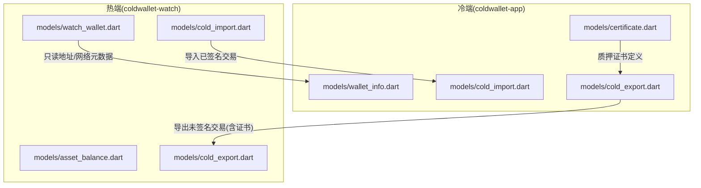
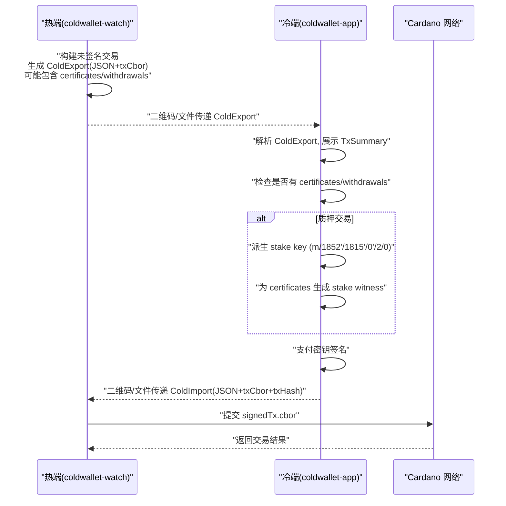
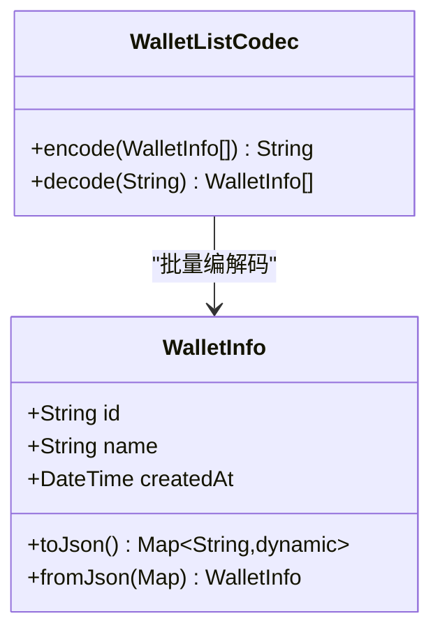
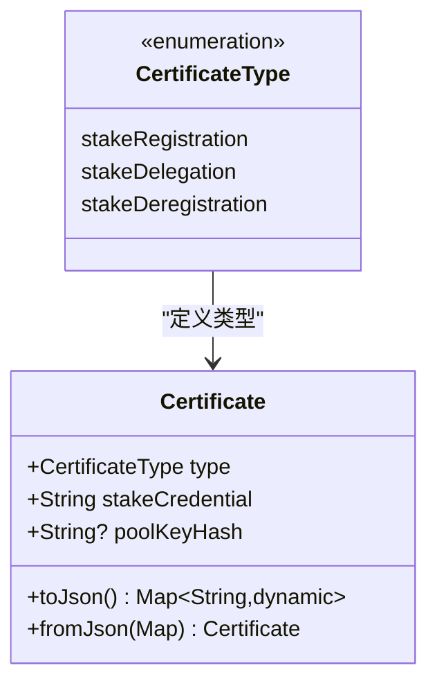
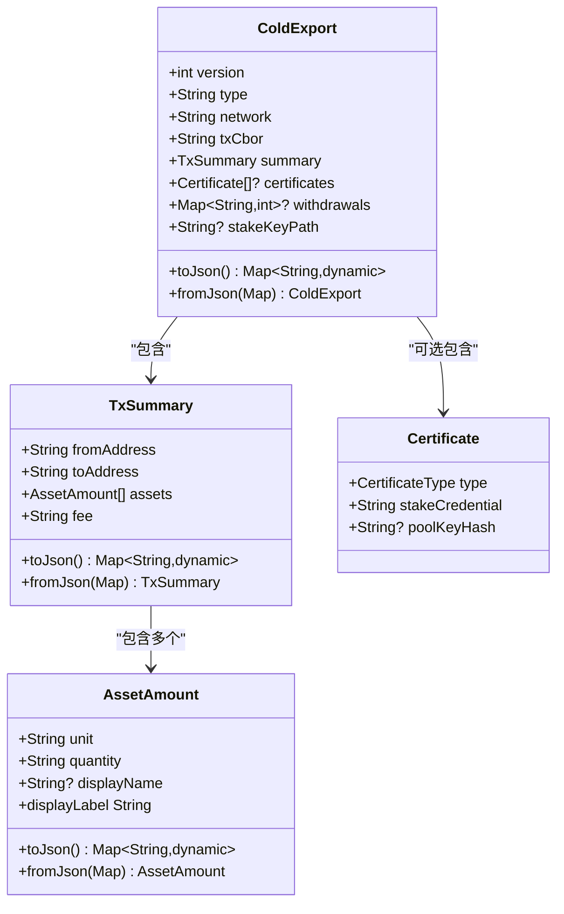
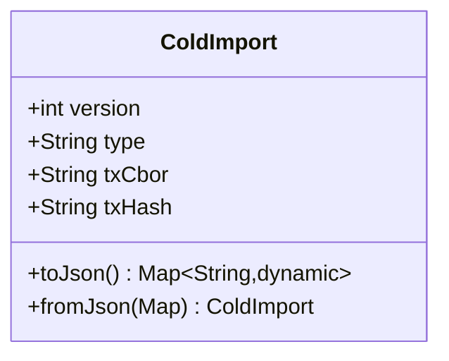
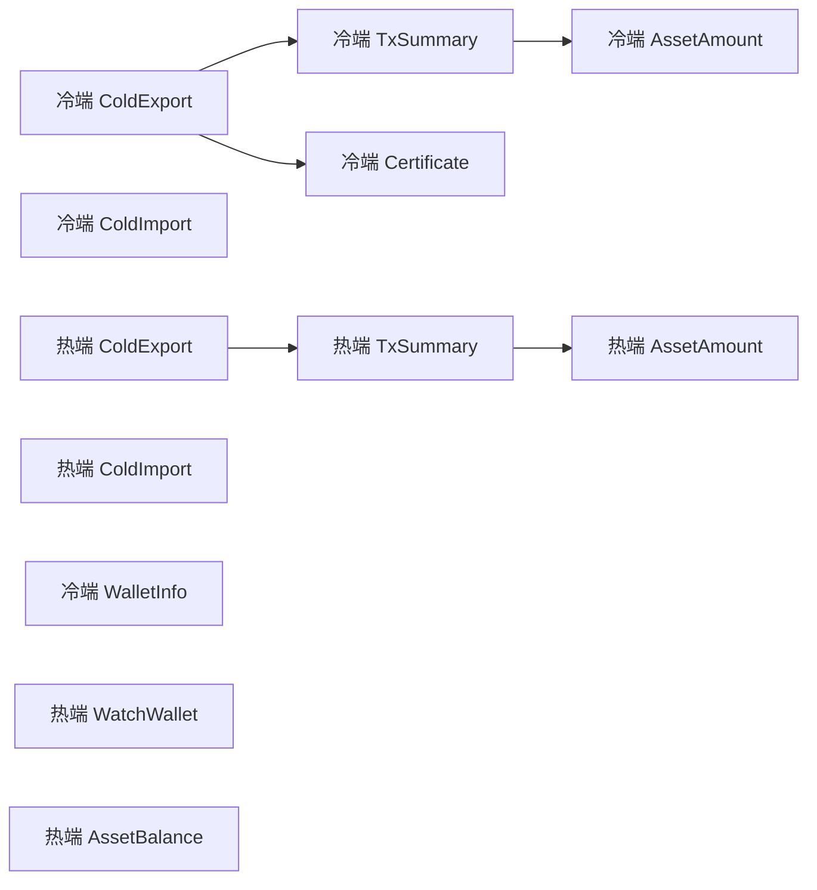
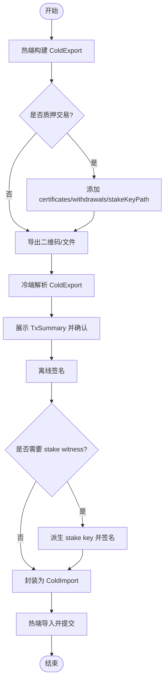

# 数据模型

<cite>
**本文引用的文件**
- [coldwallet-app/lib/models/wallet_info.dart](file://coldwallet-app/lib/models/wallet_info.dart)
- [coldwallet-app/lib/models/cold_export.dart](file://coldwallet-app/lib/models/cold_export.dart)
- [coldwallet-app/lib/models/cold_import.dart](file://coldwallet-app/lib/models/cold_import.dart)
- [coldwallet-app/lib/models/certificate.dart](file://coldwallet-app/lib/models/certificate.dart)
- [coldwallet-watch/lib/models/asset_balance.dart](file://coldwallet-watch/lib/models/asset_balance.dart)
- [coldwallet-watch/lib/models/watch_wallet.dart](file://coldwallet-watch/lib/models/watch_wallet.dart)
- [coldwallet-watch/lib/models/cold_export.dart](file://coldwallet-watch/lib/models/cold_export.dart)
- [coldwallet-watch/lib/models/cold_import.dart](file://coldwallet-watch/lib/models/cold_import.dart)
- [cold-wallet-plugin.md](file://cold-wallet-plugin.md)
</cite>

## 更新摘要
**所做更改**
- 新增 Certificate 模型章节，详细说明 Cardano 质押证书的数据结构
- 更新 ColdExport 模型说明，包含质押交易相关的新字段（certificates、withdrawals、stakeKeyPath）
- 扩展架构总览图，展示质押交易的完整流程
- 更新依赖关系分析，反映新模型的集成
- 增强故障排查指南，包含质押交易相关的错误处理

## 目录
1. [简介](#简介)
2. [项目结构](#项目结构)
3. [核心组件](#核心组件)
4. [架构总览](#架构总览)
5. [详细组件分析](#详细组件分析)
6. [依赖关系分析](#依赖关系分析)
7. [性能与序列化考量](#性能与序列化考量)
8. [故障排查指南](#故障排查指南)
9. [结论](#结论)
10. [附录：JSON/CBOR 规范与使用示例](#附录jsoncbor-规范与使用示例)

## 简介
本文件系统性梳理 ColdWallet 的数据模型，覆盖冷钱包（离线签名端）与热钱包（联网观察端）之间的关键数据结构与交互格式。重点包括：
- WalletInfo 钱包信息模型
- **Certificate 质押证书模型（新增）**
- ColdExport 未签名交易导出格式（已扩展支持质押交易）
- ColdImport 已签名交易导入格式
- TxSummary 交易摘要结构
- AssetAmount 资产数量结构
- WatchWallet 只读钱包模型
- AssetBalance 资产余额模型

同时说明字段含义、数据类型、验证规则与约束条件，并给出 JSON 序列化/反序列化流程、CBOR 编码处理要点、模型关系图与实际使用示例。

## 项目结构
ColdWallet 包含两个 Flutter 应用模块：
- coldwallet-app：离线签名端（冷端），负责生成二维码/文件、解析未签名交易、私钥签名、输出已签名交易。**现已支持 Cardano 质押交易的证书签名**。
- coldwallet-watch：联网观察端（热端），负责构建未签名交易、导出给冷端、导入已签名交易并提交到链上。

**图表来源**
- [coldwallet-app/lib/models/cold_export.dart:1-134](file://coldwallet-app/lib/models/cold_export.dart#L1-L134)
- [coldwallet-watch/lib/models/cold_export.dart:1-110](file://coldwallet-watch/lib/models/cold_export.dart#L1-L110)
- [coldwallet-watch/lib/models/cold_import.dart:1-36](file://coldwallet-watch/lib/models/cold_import.dart#L1-L36)
- [coldwallet-app/lib/models/cold_import.dart:1-36](file://coldwallet-app/lib/models/cold_import.dart#L1-L36)
- [coldwallet-watch/lib/models/watch_wallet.dart:1-79](file://coldwallet-watch/lib/models/watch_wallet.dart#L1-L79)
- [coldwallet-app/lib/models/wallet_info.dart:1-56](file://coldwallet-app/lib/models/wallet_info.dart#L1-L56)
- [coldwallet-app/lib/models/certificate.dart:1-49](file://coldwallet-app/lib/models/certificate.dart#L1-L49)

## 核心组件
- WalletInfo：钱包元数据（不含敏感信息），用于本地安全存储的钱包列表。
- **Certificate：Cardano 质押证书模型，支持 stake registration、delegation 和 deregistration 操作**。
- ColdExport：未签名交易导出格式，包含版本、类型、网络、交易 CBOR 和摘要。**现已扩展支持 certificates、withdrawals 和 stakeKeyPath 字段**。
- ColdImport：已签名交易导入格式，包含版本、类型、交易 CBOR 和交易哈希。
- TxSummary：交易摘要，展示发送方、接收方、资产列表与手续费。
- AssetAmount：单个资产的标识与数量，可选显示名称。
- WatchWallet：只读钱包模型，保存观察地址、网络与创建时间等元数据。
- AssetBalance：资产余额模型，表示某地址下一种资产的余额、显示名与启用状态。

**章节来源**
- [coldwallet-app/lib/models/wallet_info.dart:1-56](file://coldwallet-app/lib/models/wallet_info.dart#L1-L56)
- [coldwallet-app/lib/models/certificate.dart:1-49](file://coldwallet-app/lib/models/certificate.dart#L1-L49)
- [coldwallet-app/lib/models/cold_export.dart:1-134](file://coldwallet-app/lib/models/cold_export.dart#L1-L134)
- [coldwallet-app/lib/models/cold_import.dart:1-36](file://coldwallet-app/lib/models/cold_import.dart#L1-L36)
- [coldwallet-watch/lib/models/watch_wallet.dart:1-79](file://coldwallet-watch/lib/models/watch_wallet.dart#L1-L79)
- [coldwallet-watch/lib/models/asset_balance.dart:1-63](file://coldwallet-watch/lib/models/asset_balance.dart#L1-L63)
- [coldwallet-watch/lib/models/cold_export.dart:1-110](file://coldwallet-watch/lib/models/cold_export.dart#L1-L110)
- [coldwallet-watch/lib/models/cold_import.dart:1-36](file://coldwallet-watch/lib/models/cold_import.dart#L1-L36)

## 架构总览
冷热两端通过"未签名交易"和"已签名交易"两种载体进行交换，载体以 JSON 包装 CBOR 字符串，便于二维码或文件传输。**新增的质押交易支持使得系统能够处理 Cardano 的 staking 操作**。

**图表来源**
- [cold-wallet-plugin.md:55-80](file://cold-wallet-plugin.md#L55-L80)
- [coldwallet-watch/lib/models/cold_export.dart:1-110](file://coldwallet-watch/lib/models/cold_export.dart#L1-L110)
- [coldwallet-watch/lib/models/cold_import.dart:1-36](file://coldwallet-watch/lib/models/cold_import.dart#L1-L36)
- [coldwallet-app/lib/models/cold_export.dart:1-134](file://coldwallet-app/lib/models/cold_export.dart#L1-L134)
- [coldwallet-app/lib/models/cold_import.dart:1-36](file://coldwallet-app/lib/models/cold_import.dart#L1-L36)
- [coldwallet-app/lib/models/certificate.dart:1-49](file://coldwallet-app/lib/models/certificate.dart#L1-L49)

## 详细组件分析

### WalletInfo（钱包信息模型）
- 职责：描述钱包的非敏感元数据，与助记词分离存储。
- 关键字段
  - id：唯一标识，由安全随机数生成。
  - name：用户自定义名称。
  - createdAt：创建时间。
- 序列化
  - toJson/fromJson：ISO 8601 时间字符串。
  - WalletListCodec：批量序列化钱包列表为 JSON 字符串。
- 约束与验证
  - id 长度固定（基于字节转十六进制拼接）。
  - createdAt 必须可被标准日期解析器解析。
- 复杂度
  - 序列化/反序列化 O(1)。
  - 列表编解码 O(n)。

**图表来源**
- [coldwallet-app/lib/models/wallet_info.dart:1-56](file://coldwallet-app/lib/models/wallet_info.dart#L1-L56)

**章节来源**
- [coldwallet-app/lib/models/wallet_info.dart:1-56](file://coldwallet-app/lib/models/wallet_info.dart#L1-L56)

### Certificate（质押证书模型）
**新增** 此模型用于支持 Cardano 质押交易，包括 stake key 注册、委托和注销操作。

- 职责：表示 Cardano 质押证书，支持三种类型的质押操作。
- 关键字段
  - type：证书类型枚举，包括 stakeRegistration、stakeDelegation、stakeDeregistration。
  - stakeCredential：stake 公钥的 blake2b_224 哈希，28 字节 hex 编码。
  - poolKeyHash：池密钥哈希（仅 delegation 证书有值），28 字节 hex 编码。
- 序列化
  - toJson/fromJson：支持完整的往返序列化，poolKeyHash 仅在存在时包含。
- 约束与验证
  - type 必须是预定义的枚举值之一。
  - stakeCredential 必填且为有效的 28 字节 hex 字符串。
  - poolKeyHash 仅在 delegation 类型时有效。
- 复杂度
  - 序列化/反序列化 O(1)。

**图表来源**
- [coldwallet-app/lib/models/certificate.dart:1-49](file://coldwallet-app/lib/models/certificate.dart#L1-L49)

**章节来源**
- [coldwallet-app/lib/models/certificate.dart:1-49](file://coldwallet-app/lib/models/certificate.dart#L1-L49)

### ColdExport（未签名交易导出格式）
**已更新** 扩展支持 Cardano 质押交易的相关字段。

- 职责：将未签名交易从热端导出到冷端，供离线设备签名。**现已支持质押交易**。
- 关键字段
  - version：协议版本（冷端默认 1；热端提供默认值 1）。
  - type：消息类型（热端默认 'unsigned-tx'；冷端无默认）。
  - network：网络标识（如测试网/主网）。
  - txCbor：未签名交易的 CBOR 编码，Base64/Hex 字符串形式。
  - summary：交易摘要，便于用户确认。
  - **certificates**：**质押证书列表（payment 交易时为 null）**。
  - **withdrawals**：**奖励提取映射（reward_address → lovelace 数量，payment 交易时为 null）**。
  - **stakeKeyPath**：**Stake key 派生路径（如 m/1852'/1815'/0'/2/0，payment 交易时为 null）**。
- 序列化
  - toJson/fromJson：嵌套对象，summary 包含 assets 列表。**新增字段在不存在时省略**。
- 约束与验证
  - network、txCbor、summary 必填。
  - summary.assets 中每个元素需满足 AssetAmount 要求。
  - certificates、withdrawals、stakeKeyPath 为可选字段，向后兼容。
- 复杂度
  - 序列化/反序列化 O(k)，k 为资产数量。

**图表来源**
- [coldwallet-app/lib/models/cold_export.dart:1-134](file://coldwallet-app/lib/models/cold_export.dart#L1-L134)
- [coldwallet-watch/lib/models/cold_export.dart:1-110](file://coldwallet-watch/lib/models/cold_export.dart#L1-L110)
- [coldwallet-app/lib/models/certificate.dart:1-49](file://coldwallet-app/lib/models/certificate.dart#L1-L49)

**章节来源**
- [coldwallet-app/lib/models/cold_export.dart:1-134](file://coldwallet-app/lib/models/cold_export.dart#L1-L134)
- [coldwallet-watch/lib/models/cold_export.dart:1-110](file://coldwallet-watch/lib/models/cold_export.dart#L1-L110)

### ColdImport（已签名交易导入格式）
- 职责：将已签名交易从冷端导回热端，以便提交到链上。
- 关键字段
  - version：协议版本（热端默认 1；冷端提供默认值 1）。
  - type：消息类型（热端默认 'signed-tx'；冷端无默认）。
  - txCbor：已签名交易的 CBOR 编码。
  - txHash：交易哈希，用于校验与查询。
- 序列化
  - toJson/fromJson：扁平结构。
- 约束与验证
  - txCbor、txHash 必填。
  - type 应与预期一致（热端期望 'signed-tx'）。
- 复杂度
  - 序列化/反序列化 O(1)。

**图表来源**
- [coldwallet-app/lib/models/cold_import.dart:1-36](file://coldwallet-app/lib/models/cold_import.dart#L1-L36)
- [coldwallet-watch/lib/models/cold_import.dart:1-36](file://coldwallet-watch/lib/models/cold_import.dart#L1-L36)

**章节来源**
- [coldwallet-app/lib/models/cold_import.dart:1-36](file://coldwallet-app/lib/models/cold_import.dart#L1-L36)
- [coldwallet-watch/lib/models/cold_import.dart:1-36](file://coldwallet-watch/lib/models/cold_import.dart#L1-L36)

### TxSummary（交易摘要结构）
- 职责：向用户展示交易的关键信息，辅助确认。
- 关键字段
  - fromAddress：发送方地址。
  - toAddress：接收方地址。
  - assets：资产列表，每项含 unit、quantity、displayName。
  - fee：手续费（字符串形式，单位通常为 lovelace）。
- 约束与验证
  - 所有字段必填。
  - assets 非空时，每项需满足 AssetAmount 约束。
- 复杂度
  - 序列化/反序列化 O(k)。

**章节来源**
- [coldwallet-app/lib/models/cold_export.dart:66-102](file://coldwallet-app/lib/models/cold_export.dart#L66-L102)
- [coldwallet-watch/lib/models/cold_export.dart:41-78](file://coldwallet-watch/lib/models/cold_export.dart#L41-L78)

### AssetAmount（资产数量结构）
- 职责：描述交易中的单一资产及其数量。
- 关键字段
  - unit：资产标识，ADA 为 'lovelace'，原生代币为 policyId+assetName 的 hex。
  - quantity：数量（最小单位）。
  - displayName：可选显示名称。
- 约束与验证
  - unit、quantity 必填。
  - displayName 可选。
- 复杂度
  - 序列化/反序列化 O(1)。

**章节来源**
- [coldwallet-app/lib/models/cold_export.dart:104-133](file://coldwallet-app/lib/models/cold_export.dart#L104-L133)
- [coldwallet-watch/lib/models/cold_export.dart:80-109](file://coldwallet-watch/lib/models/cold_export.dart#L80-L109)

### WatchWallet（只读钱包模型）
- 职责：热端保存的冷钱包观察地址元数据，仅含公钥地址与网络信息。
- 关键字段
  - id：唯一标识（基于时间戳与计数器）。
  - name：名称。
  - address：观察地址。
  - network：网络标识。
  - createdAt：创建时间。
- 序列化
  - toJson/fromJson：ISO 8601 时间字符串。
- 约束与验证
  - 所有字段必填。
- 复杂度
  - 序列化/反序列化 O(1)。

**章节来源**
- [coldwallet-watch/lib/models/watch_wallet.dart:1-79](file://coldwallet-watch/lib/models/watch_wallet.dart#L1-L79)

### AssetBalance（资产余额模型）
- 职责：表示某地址下的一种资产（ADA 或原生代币）的余额信息。
- 关键字段
  - unit：资产标识。
  - quantity：数量（最小单位）。
  - displayName：显示名称（可选）。
  - isEnabled：是否启用显示（默认 false）。
- 方法
  - isAda：判断是否为 ADA。
  - copyWith：创建副本并替换指定字段。
- 约束与验证
  - unit、quantity 必填。
  - isEnabled 默认 false。
- 复杂度
  - 序列化/反序列化 O(1)。

**章节来源**
- [coldwallet-watch/lib/models/asset_balance.dart:1-63](file://coldwallet-watch/lib/models/asset_balance.dart#L1-L63)

## 依赖关系分析
- 冷端 models 与热端 models 在 ColdExport/ColdImport 上保持结构对齐，确保跨端兼容。
- **新增的 Certificate 模型被 ColdExport 引用，用于质押交易支持**。
- TxSummary 与 AssetAmount 在两端重复定义，保证各自独立编译与演进。
- WalletInfo 与 WatchWallet 分别服务于冷端的本地钱包列表与热端的只读地址管理。
- **ColdExport 现已扩展支持 certificates、withdrawals 和 stakeKeyPath 字段，实现向后兼容**。
- 整体耦合度低，内聚度高，适合分端迭代。

**图表来源**
- [coldwallet-app/lib/models/cold_export.dart:1-134](file://coldwallet-app/lib/models/cold_export.dart#L1-L134)
- [coldwallet-watch/lib/models/cold_export.dart:1-110](file://coldwallet-watch/lib/models/cold_export.dart#L1-L110)
- [coldwallet-app/lib/models/cold_import.dart:1-36](file://coldwallet-app/lib/models/cold_import.dart#L1-L36)
- [coldwallet-watch/lib/models/cold_import.dart:1-36](file://coldwallet-watch/lib/models/cold_import.dart#L1-L36)
- [coldwallet-app/lib/models/wallet_info.dart:1-56](file://coldwallet-app/lib/models/wallet_info.dart#L1-L56)
- [coldwallet-watch/lib/models/watch_wallet.dart:1-79](file://coldwallet-watch/lib/models/watch_wallet.dart#L1-L79)
- [coldwallet-watch/lib/models/asset_balance.dart:1-63](file://coldwallet-watch/lib/models/asset_balance.dart#L1-L63)
- [coldwallet-app/lib/models/certificate.dart:1-49](file://coldwallet-app/lib/models/certificate.dart#L1-L49)

## 性能与序列化考量
- JSON 编解码开销与资产数量线性相关，建议在 UI 层对长列表分页渲染。
- txCbor 可能较大，建议：
  - 小交易优先使用二维码传输。
  - 大交易采用文件传输或分帧动画二维码。
- 时间字段统一使用 ISO 8601 字符串，避免时区问题。
- 版本号与类型字段用于向后兼容与路由分发，应严格校验。
- **新增的质押交易字段（certificates、withdrawals、stakeKeyPath）在不存在时省略，减少数据传输量**。
- **Certificate 序列化时仅包含必要的字段，poolKeyHash 仅在 delegation 类型时包含**。

## 故障排查指南
- 解析失败
  - 检查 JSON 字段是否存在、类型是否正确（如 network、txCbor 必填）。
  - 确认 createdAt 是否为有效 ISO 8601 字符串。
- 交易摘要异常
  - 核对 assets 列表项是否完整（unit、quantity 必填）。
  - 若 displayName 缺失，UI 应回退到 unit 显示。
- 版本/类型不匹配
  - 热端期望 ColdImport.type='signed-tx'，冷端导出时需保持一致。
  - 热端 ColdExport.type 默认为 'unsigned-tx'，冷端解析时应兼容。
- 大交易传输失败
  - 切换为文件传输或分帧二维码方案。
  - 校验 Base64/Hex 编码完整性。
- **质押交易相关错误**
  - **Certificate 类型无效：检查 type 字段是否为预定义的枚举值**。
  - **Stake credential 不匹配：验证 stakeCredential 是否为有效的 28 字节 hex 字符串**。
  - **Pool key hash 格式错误：delegation 证书的 poolKeyHash 应为有效的 28 字节 hex**。
  - **Stake key 派生失败：检查 stakeKeyPath 是否符合 CIP-1852 标准（m/1852'/1815'/0'/2/0）**。
  - **Withdrawals 映射格式错误：确保 reward_address 为有效的 stake 地址格式**。

**章节来源**
- [coldwallet-app/lib/models/cold_export.dart:35-63](file://coldwallet-app/lib/models/cold_export.dart#L35-L63)
- [coldwallet-watch/lib/models/cold_export.dart:20-38](file://coldwallet-watch/lib/models/cold_export.dart#L20-L38)
- [coldwallet-watch/lib/models/cold_import.dart:18-34](file://coldwallet-watch/lib/models/cold_import.dart#L18-L34)
- [coldwallet-app/lib/models/cold_import.dart:18-34](file://coldwallet-app/lib/models/cold_import.dart#L18-L34)
- [coldwallet-app/lib/models/certificate.dart:38-47](file://coldwallet-app/lib/models/certificate.dart#L38-L47)

## 结论
ColdWallet 的数据模型围绕"未签名交易导出"和"已签名交易导入"两条主线设计，结构清晰、职责明确。**新增的 Certificate 模型和 ColdExport 扩展字段为 Cardano 质押交易提供了完整支持**，使得系统能够处理 stake key 注册、委托和注销等操作。通过统一的 JSON 包装 CBOR 的方式，实现了冷热端的安全、可靠通信。各模型具备完善的序列化/反序列化能力，便于本地存储与跨端传输。后续可在兼容性、错误提示与大交易传输体验方面持续优化。

## 附录：JSON/CBOR 规范与使用示例

### JSON 结构规范
- ColdExport（未签名交易导出）
  - 字段：version、type、network、txCbor、summary
  - summary 子对象：fromAddress、toAddress、assets[]、fee
  - assets[] 元素：unit、quantity、displayName（可选）
  - **certificates[]（可选）：质押证书数组**
  - **withdrawals（可选）：奖励提取映射**
  - **stakeKeyPath（可选）：Stake key 派生路径**
- ColdImport（已签名交易导入）
  - 字段：version、type、txCbor、txHash
- **Certificate（质押证书）**
  - **type：证书类型（stakeRegistration/stakeDelegation/stakeDeregistration）**
  - **stakeCredential：stake 公钥哈希（28 字节 hex）**
  - **poolKeyHash（可选）：池密钥哈希（仅 delegation 时使用）**
- WalletInfo
  - 字段：id、name、createdAt（ISO 8601）
- WatchWallet
  - 字段：id、name、address、network、createdAt（ISO 8601）
- AssetBalance
  - 字段：unit、quantity、displayName（可选）、isEnabled（默认 false）

**章节来源**
- [coldwallet-app/lib/models/cold_export.dart:35-63](file://coldwallet-app/lib/models/cold_export.dart#L35-L63)
- [coldwallet-watch/lib/models/cold_export.dart:20-38](file://coldwallet-watch/lib/models/cold_export.dart#L20-L38)
- [coldwallet-watch/lib/models/cold_import.dart:18-34](file://coldwallet-watch/lib/models/cold_import.dart#L18-L34)
- [coldwallet-app/lib/models/cold_import.dart:18-34](file://coldwallet-app/lib/models/cold_import.dart#L18-L34)
- [coldwallet-app/lib/models/certificate.dart:32-47](file://coldwallet-app/lib/models/certificate.dart#L32-L47)
- [coldwallet-app/lib/models/wallet_info.dart:23-33](file://coldwallet-app/lib/models/wallet_info.dart#L23-L33)
- [coldwallet-watch/lib/models/watch_wallet.dart:40-59](file://coldwallet-watch/lib/models/watch_wallet.dart#L40-L59)
- [coldwallet-watch/lib/models/asset_balance.dart:28-46](file://coldwallet-watch/lib/models/asset_balance.dart#L28-L46)

### CBOR 编码处理
- txCbor 字段承载 Cardano 交易体的 CBOR 编码，作为字符串在 JSON 中传输。
- 传输方式
  - 二维码：适用于小交易（通常 < 3KB）。
  - 文件：适用于大交易，支持 U 盘/SD 卡/NFC 等介质。
- 注意事项
  - 确保 CBOR 编码正确且未被二次编码破坏。
  - 大交易建议使用分帧动画二维码或文件传输。
  - **质押交易的 CBOR 包含额外的证书和 withdrawal 信息，体积可能更大**。

**章节来源**
- [cold-wallet-plugin.md:117-124](file://cold-wallet-plugin.md#L117-L124)
- [cold-wallet-plugin.md:144-150](file://cold-wallet-plugin.md#L144-L150)

### 实际使用示例（流程说明）
- 热端构建未签名交易
  - 构造 ColdExport，设置 network、txCbor、summary。
  - **对于质押交易，添加 certificates、withdrawals 和 stakeKeyPath 字段**。
  - 通过二维码或文件导出。
- 冷端解析并签名
  - 解析 ColdExport，展示 TxSummary 供用户确认。
  - **检查是否存在 certificates 或 withdrawals 字段**。
  - **如果存在质押相关信息，派生 stake key 并生成相应的 stake witness**。
  - 私钥签名后生成 signedTx.cbor，封装为 ColdImport。
- 热端导入并提交
  - 解析 ColdImport，获取 txCbor 与 txHash。
  - 调用链上接口提交交易。

**图表来源**
- [cold-wallet-plugin.md:55-80](file://cold-wallet-plugin.md#L55-L80)
- [coldwallet-watch/lib/models/cold_export.dart:1-110](file://coldwallet-watch/lib/models/cold_export.dart#L1-L110)
- [coldwallet-watch/lib/models/cold_import.dart:1-36](file://coldwallet-watch/lib/models/cold_import.dart#L1-L36)
- [coldwallet-app/lib/models/cold_export.dart:1-134](file://coldwallet-app/lib/models/cold_export.dart#L1-L134)
- [coldwallet-app/lib/models/cold_import.dart:1-36](file://coldwallet-app/lib/models/cold_import.dart#L1-L36)
- [coldwallet-app/lib/models/certificate.dart:1-49](file://coldwallet-app/lib/models/certificate.dart#L1-L49)