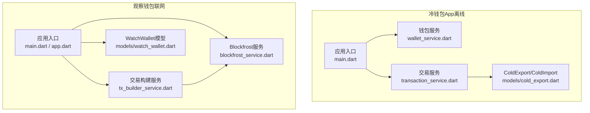
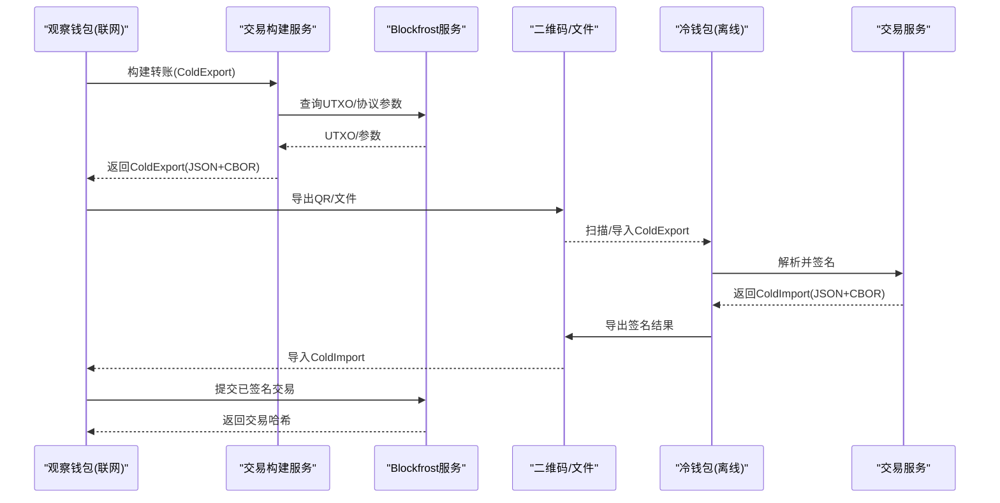
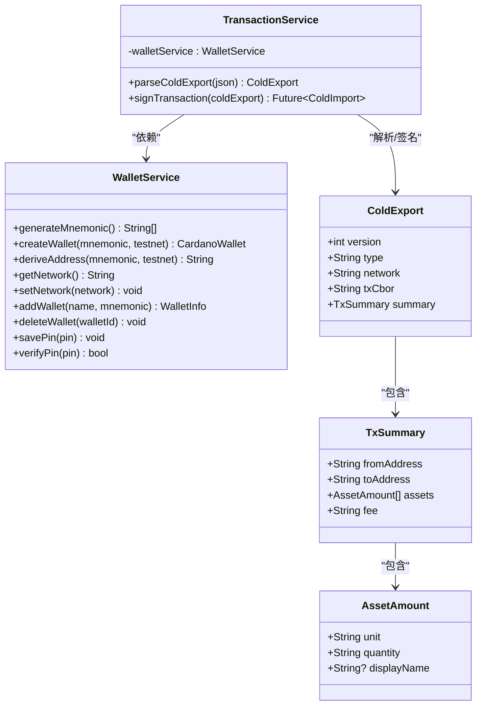
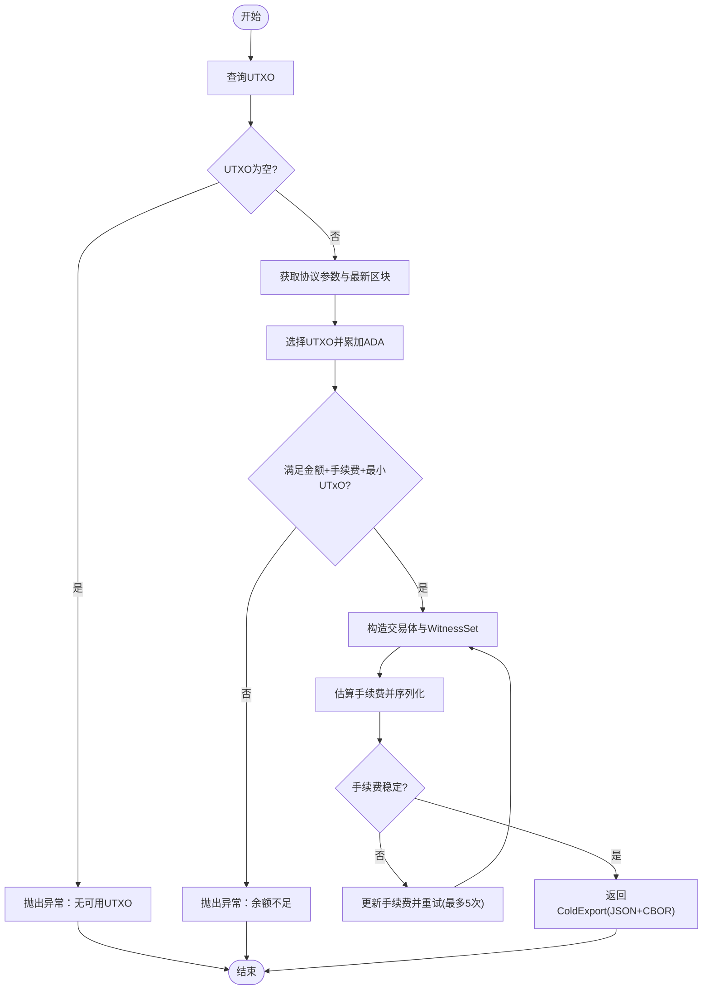
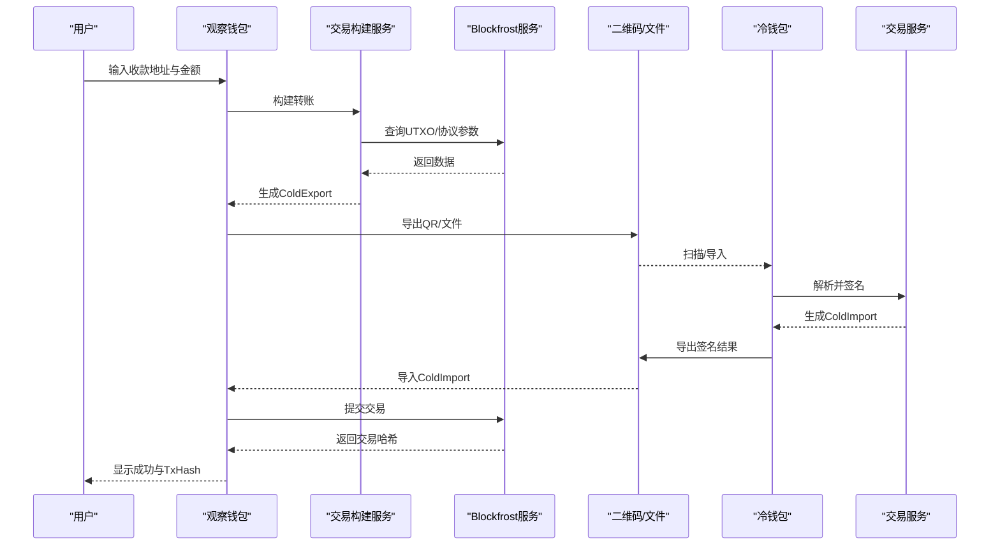
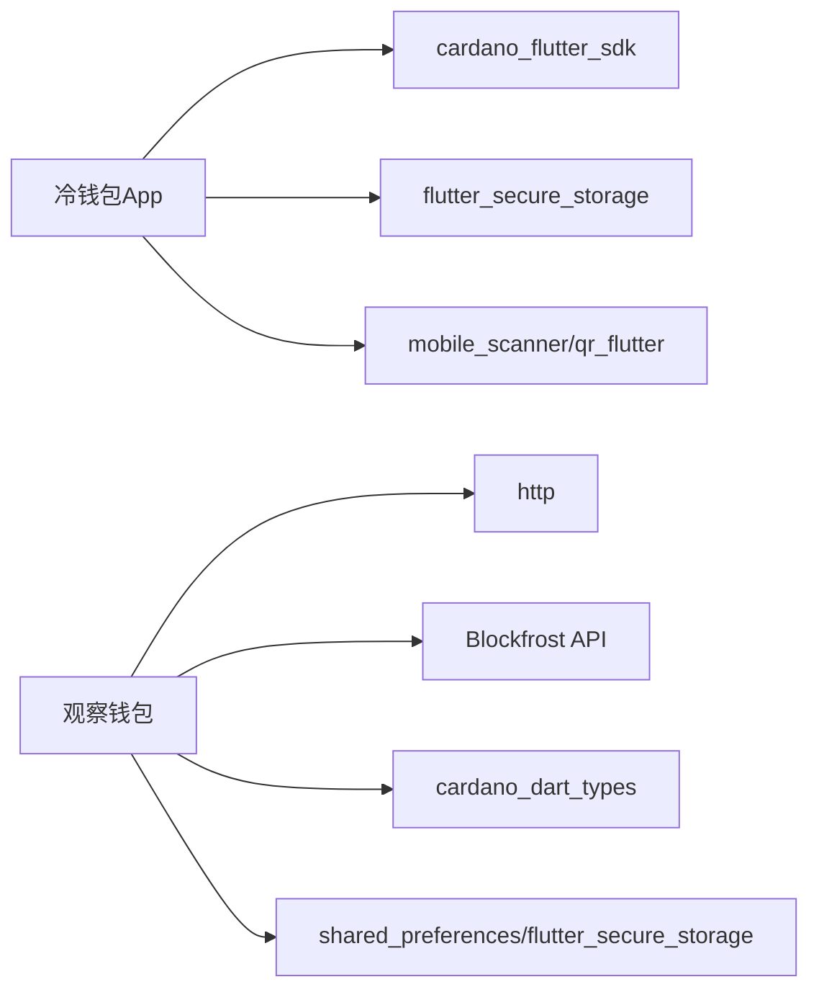

# 双端架构模式

<cite>
**本文引用的文件**
- [coldwallet-app/lib/main.dart](file://coldwallet-app/lib/main.dart)
- [coldwallet-watch/lib/main.dart](file://coldwallet-watch/lib/main.dart)
- [coldwallet-watch/lib/app.dart](file://coldwallet-watch/lib/app.dart)
- [coldwallet-app/lib/services/wallet_service.dart](file://coldwallet-app/lib/services/wallet_service.dart)
- [coldwallet-app/lib/services/transaction_service.dart](file://coldwallet-app/lib/services/transaction_service.dart)
- [coldwallet-app/lib/models/cold_export.dart](file://coldwallet-app/lib/models/cold_export.dart)
- [coldwallet-watch/lib/services/blockfrost_service.dart](file://coldwallet-watch/lib/services/blockfrost_service.dart)
- [coldwallet-watch/lib/services/tx_builder_service.dart](file://coldwallet-watch/lib/services/tx_builder_service.dart)
- [coldwallet-watch/lib/models/watch_wallet.dart](file://coldwallet-watch/lib/models/watch_wallet.dart)
- [docs/superpowers/specs/2026-08-10-cold-wallet-design.md](file://docs/superpowers/specs/2026-08-10-cold-wallet-design.md)
- [docs/superpowers/specs/2026-08-13-cold-wallet-watch-design.md](file://docs/superpowers/specs/2026-08-13-cold-wallet-watch-design.md)
</cite>

## 目录
1. [简介](#简介)
2. [项目结构](#项目结构)
3. [核心组件](#核心组件)
4. [架构总览](#架构总览)
5. [详细组件分析](#详细组件分析)
6. [依赖关系分析](#依赖关系分析)
7. [性能与容量考量](#性能与容量考量)
8. [故障排查指南](#故障排查指南)
9. [结论](#结论)
10. [附录：数据契约与通信协议](#附录数据契约与通信协议)

## 简介
本仓库实现 Cardano 冷钱包的双端架构：冷钱包 App（离线签名端）与观察钱包（联网热端）。设计目标是将安全敏感操作（私钥管理、助记词处理、交易签名）严格隔离在离线设备中；联网设备仅负责区块链交互、余额查询、交易构建与提交。两端通过统一的 JSON+CBOR 数据契约进行交换，传输介质支持二维码、JSON 文本与文件，确保私钥永不离开离线环境。

## 项目结构
- coldwallet-app（离线签名端）
  - 应用入口与路由配置，提供扫码导入、交易详情展示、PIN 确认、导出已签名结果等界面。
  - 服务层封装助记词生成/校验、地址派生、本地安全存储、交易解析与签名。
- coldwallet-watch（联网热端）
  - 应用入口与路由配置，提供只读地址管理、余额查询、发送转账、导出未签名交易、导入签名并提交上链等功能。
  - 服务层封装 Blockfrost 网络调用、UTXO 选择、手续费估算、交易构建与提交。

**图示来源**
- [coldwallet-app/lib/main.dart:1-51](file://coldwallet-app/lib/main.dart#L1-L51)
- [coldwallet-watch/lib/main.dart:1-12](file://coldwallet-watch/lib/main.dart#L1-L12)
- [coldwallet-watch/lib/app.dart:1-40](file://coldwallet-watch/lib/app.dart#L1-L40)
- [coldwallet-app/lib/services/wallet_service.dart:1-208](file://coldwallet-app/lib/services/wallet_service.dart#L1-L208)
- [coldwallet-app/lib/services/transaction_service.dart:1-70](file://coldwallet-app/lib/services/transaction_service.dart#L1-L70)
- [coldwallet-app/lib/models/cold_export.dart:1-109](file://coldwallet-app/lib/models/cold_export.dart#L1-L109)
- [coldwallet-watch/lib/services/blockfrost_service.dart:1-109](file://coldwallet-watch/lib/services/blockfrost_service.dart#L1-L109)
- [coldwallet-watch/lib/services/tx_builder_service.dart:1-152](file://coldwallet-watch/lib/services/tx_builder_service.dart#L1-L152)
- [coldwallet-watch/lib/models/watch_wallet.dart:1-79](file://coldwallet-watch/lib/models/watch_wallet.dart#L1-L79)

**章节来源**
- [coldwallet-app/lib/main.dart:1-51](file://coldwallet-app/lib/main.dart#L1-L51)
- [coldwallet-watch/lib/main.dart:1-12](file://coldwallet-watch/lib/main.dart#L1-L12)
- [coldwallet-watch/lib/app.dart:1-40](file://coldwallet-watch/lib/app.dart#L1-L40)

## 核心组件
- 冷钱包侧
  - 钱包服务：助记词生成/校验、HD 钱包创建、CIP-1852 地址派生、多钱包管理与 PIN 验证。
  - 交易服务：解析 ColdExport、使用本地私钥对交易进行签名、计算交易哈希并输出 ColdImport。
  - 数据模型：ColdExport/TxSummary/AssetAmount 描述未签名交易及摘要。
- 观察钱包侧
  - Blockfrost 服务：封装 mainnet/preprod/preview 的 REST API，提供 UTXO、余额、协议参数与交易提交。
  - 交易构建服务：UTXO 选择、手续费迭代估算、构造 CardanoTransactionBody 与 WitnessSet，输出 ColdExport。
  - 数据模型：WatchWallet 表示只读地址及其元信息。

**章节来源**
- [coldwallet-app/lib/services/wallet_service.dart:1-208](file://coldwallet-app/lib/services/wallet_service.dart#L1-L208)
- [coldwallet-app/lib/services/transaction_service.dart:1-70](file://coldwallet-app/lib/services/transaction_service.dart#L1-L70)
- [coldwallet-app/lib/models/cold_export.dart:1-109](file://coldwallet-app/lib/models/cold_export.dart#L1-L109)
- [coldwallet-watch/lib/services/blockfrost_service.dart:1-109](file://coldwallet-watch/lib/services/blockfrost_service.dart#L1-L109)
- [coldwallet-watch/lib/services/tx_builder_service.dart:1-152](file://coldwallet-watch/lib/services/tx_builder_service.dart#L1-L152)
- [coldwallet-watch/lib/models/watch_wallet.dart:1-79](file://coldwallet-watch/lib/models/watch_wallet.dart#L1-L79)

## 架构总览
双端职责分离清晰：
- 冷钱包 App：完全离线，不发起任何网络请求；仅持有助记词与私钥，完成交易签名。
- 观察钱包：联网运行，负责与 Blockfrost 交互、构建未签名交易、提交已签名交易；不接触私钥或助记词。
- 数据契约：ColdExport（unsigned-tx）与 ColdImport（signed-tx），以 JSON 包装 CBOR hex 的交易体，通过二维码/文件/文本在两端传递。

**图示来源**
- [coldwallet-watch/lib/services/tx_builder_service.dart:1-152](file://coldwallet-watch/lib/services/tx_builder_service.dart#L1-L152)
- [coldwallet-watch/lib/services/blockfrost_service.dart:1-109](file://coldwallet-watch/lib/services/blockfrost_service.dart#L1-L109)
- [coldwallet-app/lib/services/transaction_service.dart:1-70](file://coldwallet-app/lib/services/transaction_service.dart#L1-L70)
- [coldwallet-app/lib/models/cold_export.dart:1-109](file://coldwallet-app/lib/models/cold_export.dart#L1-L109)

## 详细组件分析

### 冷钱包 App 组件
- 钱包服务
  - 功能：生成/校验助记词、从助记词创建 HD 钱包、派生 CIP-1852 支付地址、多钱包列表与当前钱包切换、PIN 设置与校验。
  - 安全要点：助记词与 PIN 通过安全存储保存；无网络访问；签名前需 PIN 验证。
- 交易服务
  - 功能：解析 ColdExport，使用 cardano_flutter_sdk 对交易进行签名，组装 witness，计算 blake2b_256 交易哈希，输出 ColdImport。
  - 复杂度：签名过程主要受交易大小与输入数量影响；哈希计算为 O(n)。
- 数据模型
  - ColdExport/TxSummary/AssetAmount：用于展示与确认交易内容，便于用户理解交易细节。

**图示来源**
- [coldwallet-app/lib/services/wallet_service.dart:1-208](file://coldwallet-app/lib/services/wallet_service.dart#L1-L208)
- [coldwallet-app/lib/services/transaction_service.dart:1-70](file://coldwallet-app/lib/services/transaction_service.dart#L1-L70)
- [coldwallet-app/lib/models/cold_export.dart:1-109](file://coldwallet-app/lib/models/cold_export.dart#L1-L109)

**章节来源**
- [coldwallet-app/lib/services/wallet_service.dart:1-208](file://coldwallet-app/lib/services/wallet_service.dart#L1-L208)
- [coldwallet-app/lib/services/transaction_service.dart:1-70](file://coldwallet-app/lib/services/transaction_service.dart#L1-L70)
- [coldwallet-app/lib/models/cold_export.dart:1-109](file://coldwallet-app/lib/models/cold_export.dart#L1-L109)

### 观察钱包（联网热端）组件
- Blockfrost 服务
  - 功能：封装 mainnet/preprod/preview 基础 URL，提供 UTXO 查询、地址余额、最新区块、协议参数与交易提交。
  - 错误处理：非 200 状态码抛出异常，包含状态码与响应体。
- 交易构建服务
  - 功能：UTXO 选择、费用估算（min_fee_a/b）、最小 UTxO 约束、构造 CardanoTransactionBody 与 WitnessSet，输出 ColdExport。
  - 复杂度：UTXO 选择与费用迭代估算随输入数量线性增长；最多迭代 5 次收敛。
- 数据模型
  - WatchWallet：只读地址与元信息，普通本地存储。

**图示来源**
- [coldwallet-watch/lib/services/tx_builder_service.dart:1-152](file://coldwallet-watch/lib/services/tx_builder_service.dart#L1-L152)
- [coldwallet-watch/lib/services/blockfrost_service.dart:1-109](file://coldwallet-watch/lib/services/blockfrost_service.dart#L1-L109)

**章节来源**
- [coldwallet-watch/lib/services/blockfrost_service.dart:1-109](file://coldwallet-watch/lib/services/blockfrost_service.dart#L1-L109)
- [coldwallet-watch/lib/services/tx_builder_service.dart:1-152](file://coldwallet-watch/lib/services/tx_builder_service.dart#L1-L152)
- [coldwallet-watch/lib/models/watch_wallet.dart:1-79](file://coldwallet-watch/lib/models/watch_wallet.dart#L1-L79)

### 端到端流程时序

**图示来源**
- [coldwallet-watch/lib/services/tx_builder_service.dart:1-152](file://coldwallet-watch/lib/services/tx_builder_service.dart#L1-L152)
- [coldwallet-watch/lib/services/blockfrost_service.dart:1-109](file://coldwallet-watch/lib/services/blockfrost_service.dart#L1-L109)
- [coldwallet-app/lib/services/transaction_service.dart:1-70](file://coldwallet-app/lib/services/transaction_service.dart#L1-L70)

## 依赖关系分析
- 冷钱包 App
  - 依赖 cardano_flutter_sdk 进行助记词与地址派生、交易签名。
  - 依赖 flutter_secure_storage 安全存储助记词与 PIN。
  - 依赖 mobile_scanner/qr_flutter 进行二维码扫描与展示。
- 观察钱包
  - 依赖 http 与 Blockfrost REST API 进行链上数据查询与交易提交。
  - 依赖 cardano_dart_types 与 cardano_flutter_sdk 构建交易体。
  - 依赖 shared_preferences/flutter_secure_storage 管理地址与 API Key。

**图示来源**
- [coldwallet-app/pubspec.yaml:1-100](file://coldwallet-app/pubspec.yaml#L1-L100)
- [coldwallet-watch/pubspec.yaml:1-101](file://coldwallet-watch/pubspec.yaml#L1-L101)

**章节来源**
- [coldwallet-app/pubspec.yaml:1-100](file://coldwallet-app/pubspec.yaml#L1-L100)
- [coldwallet-watch/pubspec.yaml:1-101](file://coldwallet-watch/pubspec.yaml#L1-L101)

## 性能与容量考量
- 二维码容量
  - ColdExport JSON 约 400-800 字节，单 QR 码可承载（上限约 3KB）。
  - ColdImport JSON 约 300-500 字节，单 QR 码可承载。
- 交易构建性能
  - UTXO 选择与费用估算随输入数量线性增长；最多迭代 5 次收敛。
  - 大交易场景（如多资产、多输出）可能超出单 QR 容量，后续可引入分帧动画 QR。
- 网络请求
  - Blockfrost 调用失败时抛出异常，建议上层重试与友好提示。

[本节为通用指导，不直接分析具体文件]

## 故障排查指南
- 冷钱包侧
  - 助记词无效：校验失败应提示重新输入。
  - 无当前钱包：签名前检查助记词是否存在，否则提示初始化钱包。
  - PIN 错误：验证失败应提示重试。
- 观察钱包侧
  - UTXO 为空：提示“无可用UTXO”。
  - 余额不足：提示需覆盖转账金额、手续费与最小 UTxO。
  - Blockfrost 请求失败：检查网络与 API Key，必要时重试一次。
  - 收款地址与发送地址相同：拦截并提示。
  - 二维码扫描失败：提示改用文件或重试。
  - 导入签名文件解析失败：提示格式错误。
  - 提交交易失败：显示 Blockfrost 返回的错误信息。

**章节来源**
- [coldwallet-watch/lib/services/tx_builder_service.dart:1-152](file://coldwallet-watch/lib/services/tx_builder_service.dart#L1-L152)
- [coldwallet-watch/lib/services/blockfrost_service.dart:1-109](file://coldwallet-watch/lib/services/blockfrost_service.dart#L1-L109)
- [docs/superpowers/specs/2026-08-13-cold-wallet-watch-design.md:260-272](file://docs/superpowers/specs/2026-08-13-cold-wallet-watch-design.md#L260-L272)

## 结论
该双端架构通过严格的职责分离与统一的数据契约，实现了私钥不出离线环境的强安全模型。冷钱包专注密钥与签名，观察钱包专注链上交互与交易构建，两者通过 QR/文件/文本安全交换数据。此设计降低了私钥泄露风险，提升了用户体验与安全性，并为后续扩展（多资产、NFT、多账户、硬件钱包集成）奠定基础。

[本节为总结性内容，不直接分析具体文件]

## 附录：数据契约与通信协议
- 数据契约
  - ColdExport（unsigned-tx）：包含版本、类型、网络、交易 CBOR hex、摘要（发送方、接收方、资产列表、手续费）。
  - ColdImport（signed-tx）：包含版本、类型、已签名交易 CBOR hex、交易哈希。
- 通信方式
  - 二维码：将 JSON 编码为 QR 码，供另一端扫描读取。
  - JSON 文本：复制粘贴到聊天工具等中间媒介。
  - 文件：导出 .json 或 .cbor 文件，供另一端导入。
- 安全优势
  - 私钥与助记词仅在冷钱包内存在与使用，从不进入联网环境。
  - 观察钱包仅持有公开地址与交易数据，无法推导私钥。
  - 通过 PIN 与本地安全存储保护冷钱包访问。

**章节来源**
- [docs/superpowers/specs/2026-08-10-cold-wallet-design.md:299-345](file://docs/superpowers/specs/2026-08-10-cold-wallet-design.md#L299-L345)
- [docs/superpowers/specs/2026-08-13-cold-wallet-watch-design.md:318-332](file://docs/superpowers/specs/2026-08-13-cold-wallet-watch-design.md#L318-L332)
- [coldwallet-app/lib/models/cold_export.dart:1-109](file://coldwallet-app/lib/models/cold_export.dart#L1-L109)