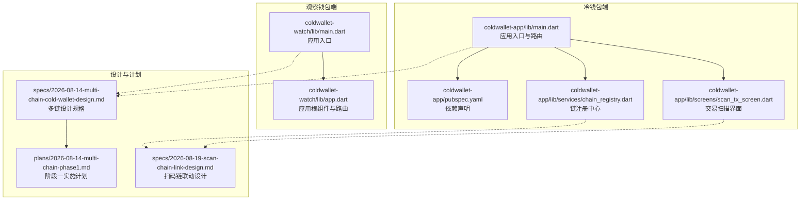
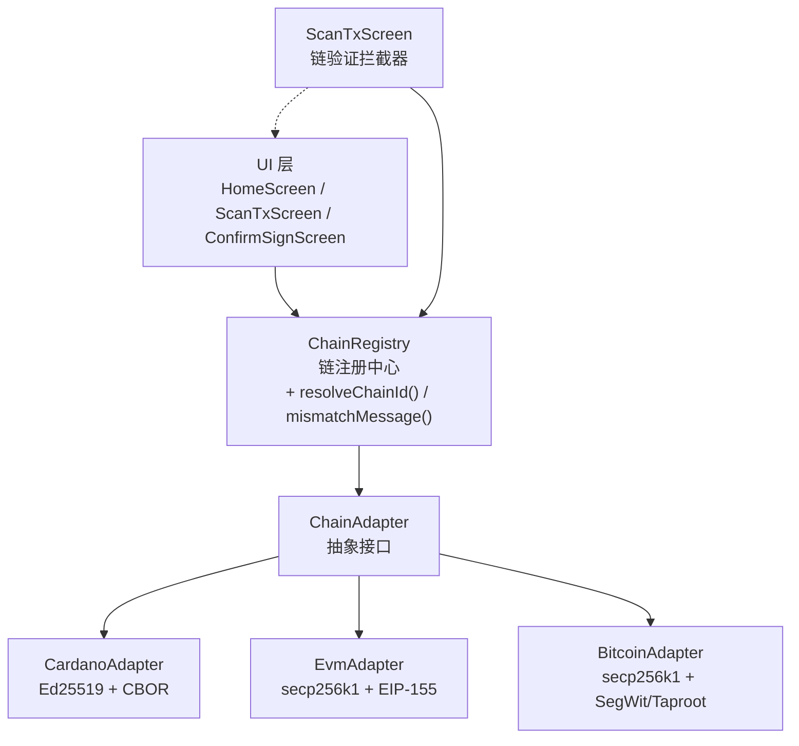
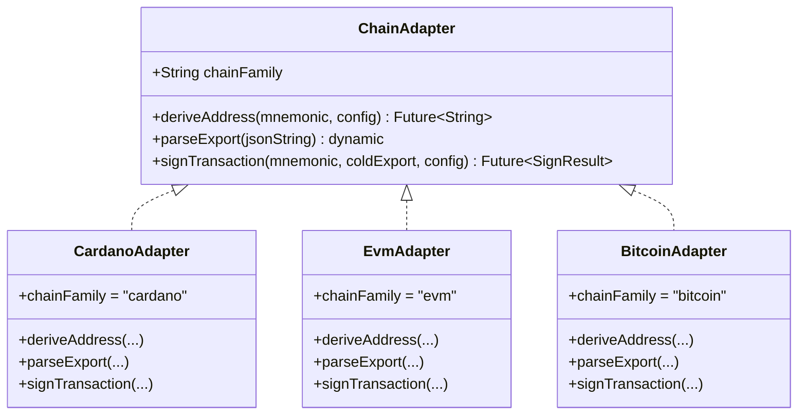
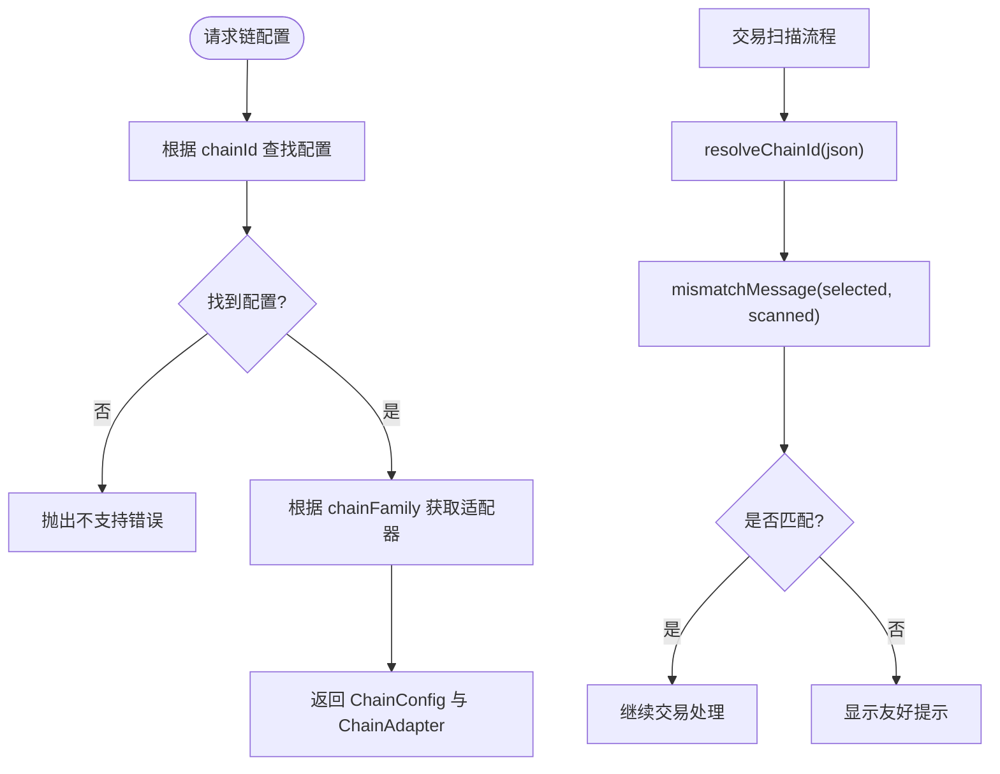
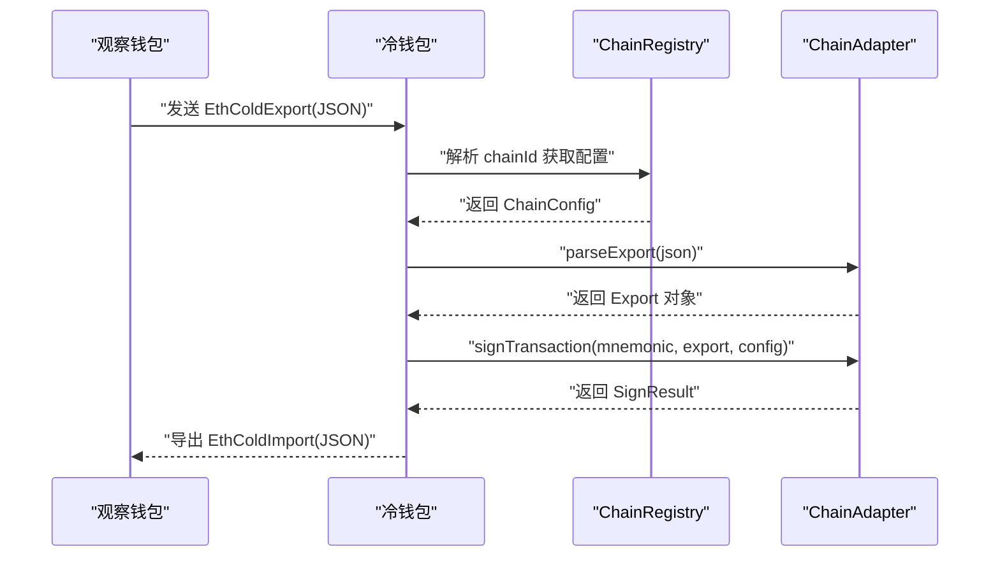
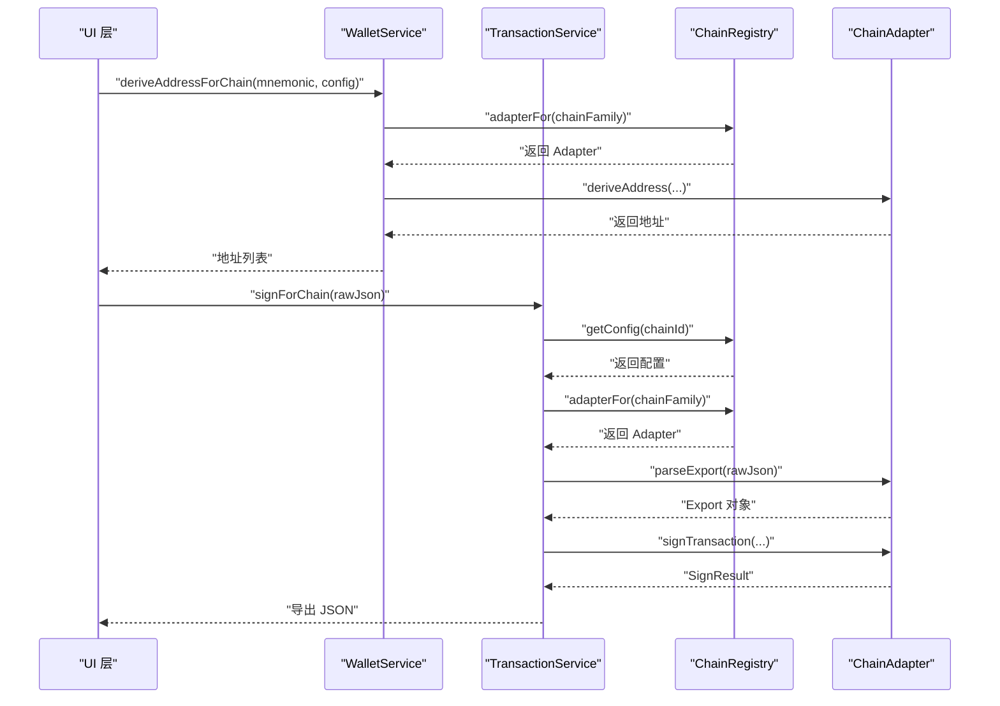
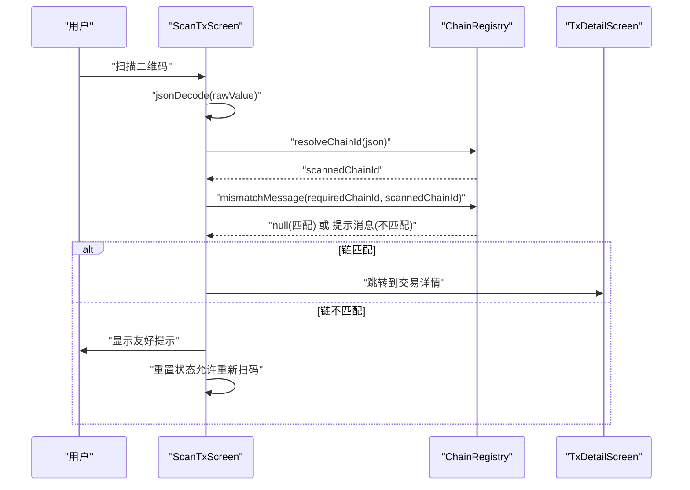

# 多链架构设计

<cite>
**本文引用的文件**
- [coldwallet-app/lib/main.dart](file://coldwallet-app/lib/main.dart)
- [coldwallet-watch/lib/main.dart](file://coldwallet-watch/lib/main.dart)
- [coldwallet-watch/lib/app.dart](file://coldwallet-watch/lib/app.dart)
- [coldwallet-app/pubspec.yaml](file://coldwallet-app/pubspec.yaml)
- [coldwallet-app/lib/services/chain_registry.dart](file://coldwallet-app/lib/services/chain_registry.dart)
- [coldwallet-app/lib/screens/scan_tx_screen.dart](file://coldwallet-app/lib/screens/scan_tx_screen.dart)
- [coldwallet-app/test/services/chain_registry_test.dart](file://coldwallet-app/test/services/chain_registry_test.dart)
- [docs/superpowers/plans/2026-08-14-multi-chain-phase1.md](file://docs/superpowers/plans/2026-08-14-multi-chain-phase1.md)
- [docs/superpowers/specs/2026-08-14-multi-chain-cold-wallet-design.md](file://docs/superpowers/specs/2026-08-14-multi-chain-cold-wallet-design.md)
- [docs/superpowers/specs/2026-08-19-scan-chain-link-design.md](file://docs/superpowers/specs/2026-08-19-scan-chain-link-design.md)
- [docs/superpowers/plans/2026-08-19-scan-chain-link.md](file://docs/superpowers/plans/2026-08-19-scan-chain-link.md)
</cite>

## 更新摘要
**所做更改**
- 更新了ChainRegistry组件分析，新增`resolveChainId()`和`mismatchMessage()`方法说明
- 添加了交易扫描链验证工作流的新章节
- 增强了用户反馈机制的文档说明
- 更新了相关架构图表和流程图

## 目录
1. [简介](#简介)
2. [项目结构](#项目结构)
3. [核心组件](#核心组件)
4. [架构总览](#架构总览)
5. [详细组件分析](#详细组件分析)
6. [依赖分析](#依赖分析)
7. [性能考虑](#性能考虑)
8. [故障排查指南](#故障排查指南)
9. [结论](#结论)
10. [附录](#附录)

## 简介
本项目为"冷钱包 + 观察钱包"的双端架构：冷钱包端（coldwallet-app）完全离线，负责助记词管理、多链地址派生与离线签名；观察钱包端（coldwallet-watch）联网运行，负责交易构建、余额查询与已签名交易的广播。阶段一目标是将冷钱包从单一 Cardano 扩展为多链支持，优先实现 EVM 兼容链（Ethereum Sepolia、BSC Testnet、Arbitrum Sepolia、Polygon Amoy、Base Sepolia），并保留对 Cardano 的向后兼容。

## 项目结构
仓库包含两个 Flutter 应用与一套设计与实施文档：
- coldwallet-app：冷钱包端，提供路由入口、主题配置与页面导航。
- coldwallet-watch：观察钱包端，提供路由入口与应用根组件。
- docs/superpowers：包含分阶段实施计划与总体设计规格。

**图表来源**
- [coldwallet-app/lib/main.dart:1-52](file://coldwallet-app/lib/main.dart#L1-L52)
- [coldwallet-watch/lib/main.dart:1-12](file://coldwallet-watch/lib/main.dart#L1-L12)
- [coldwallet-watch/lib/app.dart:1-40](file://coldwallet-watch/lib/app.dart#L1-L40)
- [coldwallet-app/pubspec.yaml:30-48](file://coldwallet-app/pubspec.yaml#L30-L48)
- [coldwallet-app/lib/services/chain_registry.dart:1-104](file://coldwallet-app/lib/services/chain_registry.dart#L1-L104)
- [coldwallet-app/lib/screens/scan_tx_screen.dart:1-106](file://coldwallet-app/lib/screens/scan_tx_screen.dart#L1-L106)
- [docs/superpowers/specs/2026-08-14-multi-chain-cold-wallet-design.md:41-63](file://docs/superpowers/specs/2026-08-14-multi-chain-cold-wallet-design.md#L41-L63)
- [docs/superpowers/plans/2026-08-14-multi-chain-phase1.md:1-12](file://docs/superpowers/plans/2026-08-14-multi-chain-phase1.md#L1-L12)
- [docs/superpowers/specs/2026-08-19-scan-chain-link-design.md:1-104](file://docs/superpowers/specs/2026-08-19-scan-chain-link-design.md#L1-L104)

**章节来源**
- [coldwallet-app/lib/main.dart:1-52](file://coldwallet-app/lib/main.dart#L1-L52)
- [coldwallet-watch/lib/main.dart:1-12](file://coldwallet-watch/lib/main.dart#L1-L12)
- [coldwallet-watch/lib/app.dart:1-40](file://coldwallet-watch/lib/app.dart#L1-L40)
- [coldwallet-app/pubspec.yaml:30-48](file://coldwallet-app/pubspec.yaml#L30-L48)

## 核心组件
- 链适配器模式：通过 ChainAdapter 抽象接口统一封装不同链族的地址派生、交易解析与离线签名逻辑。
- 链注册中心：ChainRegistry 集中维护支持的链配置，并提供按 chainFamily 获取适配器的能力。**新增** `resolveChainId()` 和 `mismatchMessage()` 方法用于交易扫描时的链验证和用户反馈。
- 协议模型：定义冷端与联网端之间的数据交换格式，如 EthColdExport/EthColdImport、Cardano ColdExport/ColdImport、以及统一的 SignResult。
- 服务层改造：WalletService 与 TransactionService 新增多链入口，保持向后兼容。
- UI 层路由：HomeScreen、ScanTxScreen、ConfirmSignScreen 等根据 chainId 自动识别链类型并展示对应摘要。**增强** ScanTxScreen 支持链联动校验。

**章节来源**
- [docs/superpowers/specs/2026-08-14-multi-chain-cold-wallet-design.md:65-101](file://docs/superpowers/specs/2026-08-14-multi-chain-cold-wallet-design.md#L65-L101)
- [docs/superpowers/specs/2026-08-14-multi-chain-cold-wallet-design.md:160-244](file://docs/superpowers/specs/2026-08-14-multi-chain-cold-wallet-design.md#L160-L244)
- [docs/superpowers/plans/2026-08-14-multi-chain-phase1.md:15-52](file://docs/superpowers/plans/2026-08-14-multi-chain-phase1.md#L15-L52)
- [coldwallet-app/lib/services/chain_registry.dart:72-95](file://coldwallet-app/lib/services/chain_registry.dart#L72-L95)
- [coldwallet-app/lib/screens/scan_tx_screen.dart:14-65](file://coldwallet-app/lib/screens/scan_tx_screen.dart#L14-L65)

## 架构总览
整体采用分层与适配器模式结合：UI 层调用服务层，服务层通过 ChainRegistry 选择具体 ChainAdapter 完成链特定操作。EVM 链共享同一适配器并通过 evmChainId 区分网络。**新增** 交易扫描链验证流程，确保用户操作的链与交易链一致。

**图表来源**
- [docs/superpowers/specs/2026-08-14-multi-chain-cold-wallet-design.md:41-63](file://docs/superpowers/specs/2026-08-14-multi-chain-cold-wallet-design.md#L41-L63)
- [docs/superpowers/specs/2026-08-14-multi-chain-cold-wallet-design.md:221-244](file://docs/superpowers/specs/2026-08-14-multi-chain-cold-wallet-design.md#L221-L244)
- [coldwallet-app/lib/services/chain_registry.dart:72-95](file://coldwallet-app/lib/services/chain_registry.dart#L72-L95)
- [coldwallet-app/lib/screens/scan_tx_screen.dart:27-65](file://coldwallet-app/lib/screens/scan_tx_screen.dart#L27-L65)

## 详细组件分析

### 链适配器抽象与实现
- ChainAdapter：定义 deriveAddress、parseExport、signTransaction 三个核心方法，屏蔽链差异。
- CardanoAdapter：基于现有 WalletService/TransactionService 提取，使用 Ed25519 与 CBOR 处理。
- EvmAdapter：基于 secp256k1 与 EIP-155，使用 web3dart 进行密钥派生、RLP 编解码与签名。
- BitcoinAdapter：规划中，支持 Legacy/SegWit/Taproot 多种地址与签名方式。

**图表来源**
- [docs/superpowers/specs/2026-08-14-multi-chain-cold-wallet-design.md:65-101](file://docs/superpowers/specs/2026-08-14-multi-chain-cold-wallet-design.md#L65-L101)
- [docs/superpowers/plans/2026-08-14-multi-chain-phase1.md:477-533](file://docs/superpowers/plans/2026-08-14-multi-chain-phase1.md#L477-L533)
- [docs/superpowers/plans/2026-08-14-multi-chain-phase1.md:537-689](file://docs/superpowers/plans/2026-08-14-multi-chain-phase1.md#L537-L689)
- [docs/superpowers/plans/2026-08-14-multi-chain-phase1.md:693-800](file://docs/superpowers/plans/2026-08-14-multi-chain-phase1.md#L693-L800)

**章节来源**
- [docs/superpowers/specs/2026-08-14-multi-chain-cold-wallet-design.md:65-101](file://docs/superpowers/specs/2026-08-14-multi-chain-cold-wallet-design.md#L65-L101)
- [docs/superpowers/plans/2026-08-14-multi-chain-phase1.md:477-800](file://docs/superpowers/plans/2026-08-14-multi-chain-phase1.md#L477-L800)

### 链注册中心与配置
- ChainRegistry 维护静态配置表，支持按 chainFamily 返回适配器实例，按 chainId 获取配置。
- 内置 Cardano 与多条 EVM 链配置，未来可扩展至 Bitcoin。
- **新增功能**：`resolveChainId()` 方法从交易 JSON 解析链 ID，无 chainId 字段时默认返回 'cardano-preview' 以保持向后兼容。
- **新增功能**：`mismatchMessage()` 方法生成友好的链不匹配提示文案，当链匹配时返回 null。

**图表来源**
- [docs/superpowers/specs/2026-08-14-multi-chain-cold-wallet-design.md:160-244](file://docs/superpowers/specs/2026-08-14-multi-chain-cold-wallet-design.md#L160-L244)
- [coldwallet-app/lib/services/chain_registry.dart:72-95](file://coldwallet-app/lib/services/chain_registry.dart#L72-L95)
- [coldwallet-app/lib/screens/scan_tx_screen.dart:39-51](file://coldwallet-app/lib/screens/scan_tx_screen.dart#L39-L51)

**章节来源**
- [docs/superpowers/specs/2026-08-14-multi-chain-cold-wallet-design.md:160-244](file://docs/superpowers/specs/2026-08-14-multi-chain-cold-wallet-design.md#L160-L244)
- [coldwallet-app/lib/services/chain_registry.dart:72-95](file://coldwallet-app/lib/services/chain_registry.dart#L72-L95)

### 通信协议模型
- EthColdExport/EthColdImport：用于 EVM 链未签名与已签名交易在冷端与联网端之间传输。
- Cardano ColdExport/ColdImport：沿用现有协议，保证向后兼容。
- SignResult：统一签名结果结构，包含 signedTxHex 与 txHash。

**图表来源**
- [docs/superpowers/specs/2026-08-14-multi-chain-cold-wallet-design.md:285-340](file://docs/superpowers/specs/2026-08-14-multi-chain-cold-wallet-design.md#L285-L340)
- [docs/superpowers/plans/2026-08-14-multi-chain-phase1.md:269-473](file://docs/superpowers/plans/2026-08-14-multi-chain-phase1.md#L269-L473)

**章节来源**
- [docs/superpowers/specs/2026-08-14-multi-chain-cold-wallet-design.md:285-340](file://docs/superpowers/specs/2026-08-14-multi-chain-cold-wallet-design.md#L285-L340)
- [docs/superpowers/plans/2026-08-14-multi-chain-phase1.md:269-473](file://docs/superpowers/plans/2026-08-14-multi-chain-phase1.md#L269-L473)

### 服务层与 UI 路由
- WalletService 新增 deriveAddressForChain 与 deriveAllAddresses，保持原有方法不变。
- TransactionService 新增 signForChain，自动识别链类型并路由到对应适配器。
- UI 层根据 chainId 显示链名与交易摘要，移除网络切换按钮，所有链固定测试网。

**图表来源**
- [docs/superpowers/specs/2026-08-14-multi-chain-cold-wallet-design.md:412-491](file://docs/superpowers/specs/2026-08-14-multi-chain-cold-wallet-design.md#L412-L491)
- [docs/superpowers/plans/2026-08-14-multi-chain-phase1.md:35-52](file://docs/superpowers/plans/2026-08-14-multi-chain-phase1.md#L35-L52)

**章节来源**
- [docs/superpowers/specs/2026-08-14-multi-chain-cold-wallet-design.md:412-491](file://docs/superpowers/specs/2026-08-14-multi-chain-cold-wallet-design.md#L412-L491)
- [docs/superpowers/plans/2026-08-14-multi-chain-phase1.md:35-52](file://docs/superpowers/plans/2026-08-14-multi-chain-phase1.md#L35-L52)

### 交易扫描链验证工作流
**新增** 交易扫描链验证功能，确保用户操作的链与交易链一致，提升用户体验：

- **ScanTxScreen 增强**：添加 `requiredChainId` 构造参数，在 `_onDetect` 回调中进行链验证。
- **链解析**：使用 `ChainRegistry.resolveChainId()` 从交易 JSON 解析链 ID，无 chainId 字段时默认为 Cardano。
- **链匹配检查**：通过 `ChainRegistry.mismatchMessage()` 生成友好的不匹配提示文案。
- **用户反馈**：链不匹配时显示 SnackBar 提示，阻止跳转并允许重新扫码。

**图表来源**
- [coldwallet-app/lib/screens/scan_tx_screen.dart:27-65](file://coldwallet-app/lib/screens/scan_tx_screen.dart#L27-L65)
- [coldwallet-app/lib/services/chain_registry.dart:72-95](file://coldwallet-app/lib/services/chain_registry.dart#L72-L95)
- [docs/superpowers/specs/2026-08-19-scan-chain-link-design.md:41-59](file://docs/superpowers/specs/2026-08-19-scan-chain-link-design.md#L41-L59)

**章节来源**
- [coldwallet-app/lib/screens/scan_tx_screen.dart:14-65](file://coldwallet-app/lib/screens/scan_tx_screen.dart#L14-L65)
- [coldwallet-app/lib/services/chain_registry.dart:72-95](file://coldwallet-app/lib/services/chain_registry.dart#L72-L95)
- [docs/superpowers/specs/2026-08-19-scan-chain-link-design.md:41-59](file://docs/superpowers/specs/2026-08-19-scan-chain-link-design.md#L41-L59)
- [docs/superpowers/plans/2026-08-19-scan-chain-link.md:169-287](file://docs/superpowers/plans/2026-08-19-scan-chain-link.md#L169-L287)

## 依赖分析
- 冷钱包端依赖 cardano_flutter_sdk、bip39_plus、pointycastle、web3dart 等库，以支持 Cardano 与 EVM 链的密码学运算与 RLP/序列化。
- 观察钱包端作为联网端，主要承担交易构建与广播，不直接参与离线签名。
- **新增依赖**：mobile_scanner 用于二维码扫描功能。

```mermaid
graph LR
App["coldwallet-app"] --> SDK["cardano_flutter_sdk"]
App --> Crypto["pointycastle"]
App --> Bip39["bip39_plus"]
App --> Web3["web3dart"]
App --> Scanner["mobile_scanner"]
Watch["coldwallet-watch"] --> Net["网络交互"]
```

**图表来源**
- [coldwallet-app/pubspec.yaml:30-48](file://coldwallet-app/pubspec.yaml#L30-L48)

**章节来源**
- [coldwallet-app/pubspec.yaml:30-48](file://coldwallet-app/pubspec.yaml#L30-L48)

## 性能考虑
- 冷钱包端离线执行，避免网络 IO，提升安全性与响应速度。
- EVM 链签名涉及 RLP 编解码与 keccak256 哈希，建议在后台线程执行以避免阻塞 UI。
- 多链地址批量派生时可采用并发策略，但需控制资源占用。
- **新增考虑**：交易扫描链验证在前置入口进行，避免无效交易进入后续处理流程，提升整体性能。

[本节提供通用指导，无需引用具体文件]

## 故障排查指南
- 不支持的链族或 chainId：检查 ChainRegistry 是否包含该链配置，确认 chainFamily 映射正确。
- 解析失败：确认导入 JSON 字段完整（version、type、chainId、rawTxHex、summary）。
- 签名异常：核对助记词有效性、私钥派生路径与 EIP-155 chainId 匹配。
- 向后兼容：无 chainId 的旧版 Cardano JSON 应仍能被识别与处理。
- **新增**：链验证失败：检查首页选中的链是否与交易链一致，查看 `mismatchMessage()` 返回的提示信息。
- **新增**：扫描功能异常：确认 mobile_scanner 权限配置正确，二维码格式符合预期。

**章节来源**
- [docs/superpowers/specs/2026-08-14-multi-chain-cold-wallet-design.md:460-491](file://docs/superpowers/specs/2026-08-14-multi-chain-cold-wallet-design.md#L460-L491)
- [docs/superpowers/plans/2026-08-14-multi-chain-phase1.md:503-512](file://docs/superpowers/plans/2026-08-14-multi-chain-phase1.md#L503-L512)
- [coldwallet-app/test/services/chain_registry_test.dart:27-67](file://coldwallet-app/test/services/chain_registry_test.dart#L27-L67)

## 结论
本方案通过链适配器模式与注册中心实现了冷钱包的多链扩展，阶段一聚焦于 EVM 链支持与 Cardano 的向后兼容。**新增的交易扫描链验证功能**进一步提升了用户体验，确保用户在正确的链上进行交易操作。后续将逐步加入 Bitcoin 支持并完善协议文档与端到端集成验证。双端分离的设计确保了冷钱包的离线安全与联网端的灵活交互。

[本节总结性内容，无需引用具体文件]

## 附录
- 链支持矩阵与派生路径、地址格式、哈希算法详见设计规格。
- 阶段一任务清单与交付物详见实施计划。
- **新增**：交易扫描链验证的详细设计见 `docs/superpowers/specs/2026-08-19-scan-chain-link-design.md`。

**章节来源**
- [docs/superpowers/specs/2026-08-14-multi-chain-cold-wallet-design.md:27-39](file://docs/superpowers/specs/2026-08-14-multi-chain-cold-wallet-design.md#L27-L39)
- [docs/superpowers/plans/2026-08-14-multi-chain-phase1.md:611-640](file://docs/superpowers/plans/2026-08-14-multi-chain-phase1.md#L611-L640)
- [docs/superpowers/specs/2026-08-19-scan-chain-link-design.md:1-104](file://docs/superpowers/specs/2026-08-19-scan-chain-link-design.md#L1-L104)