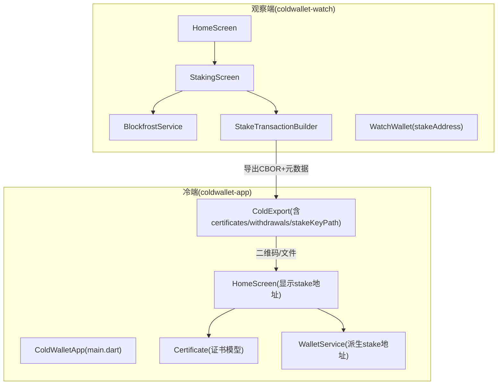
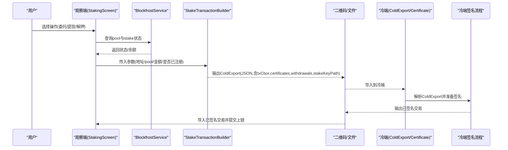
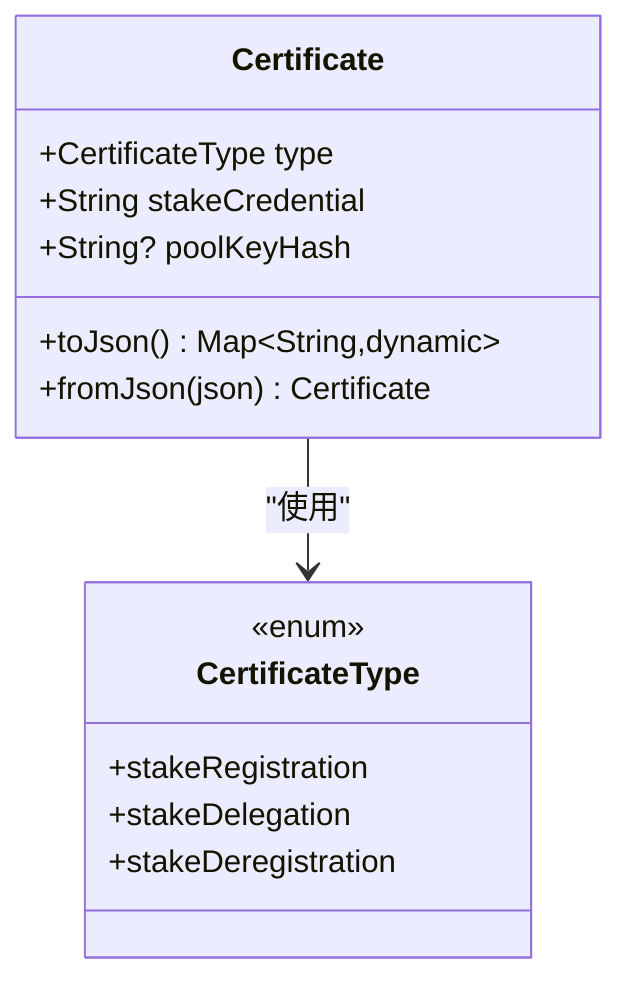
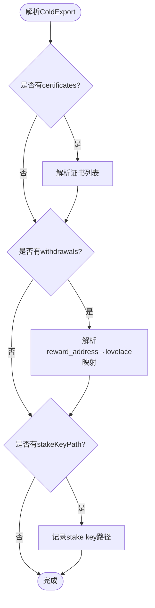
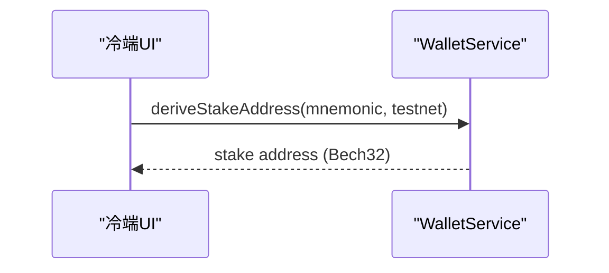
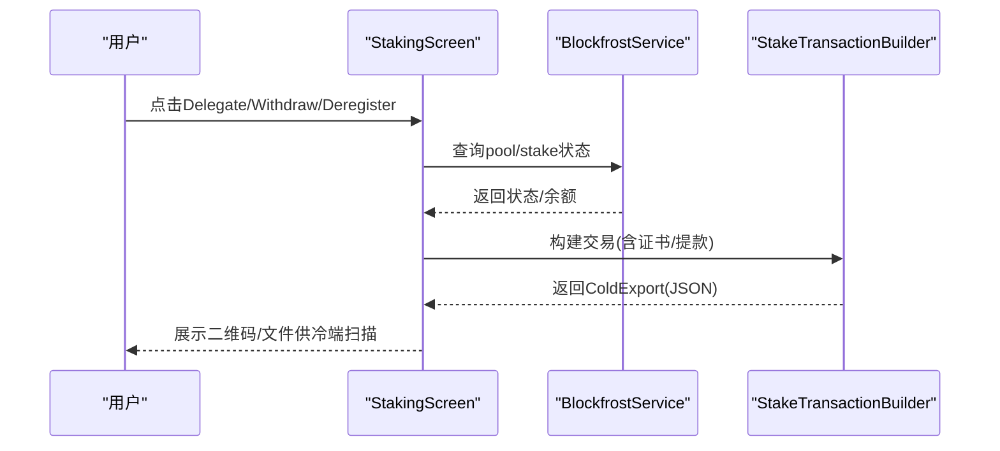
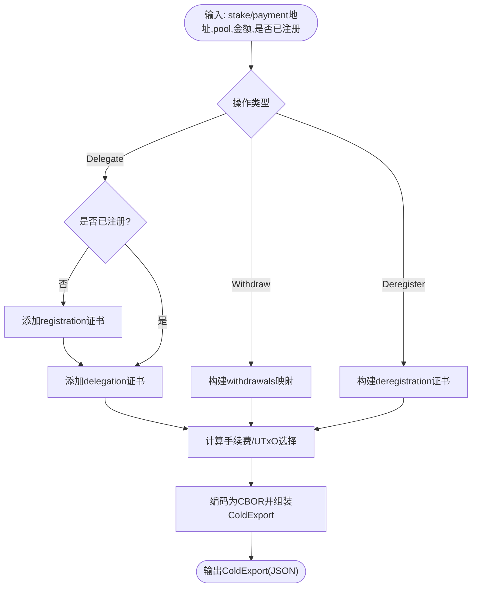
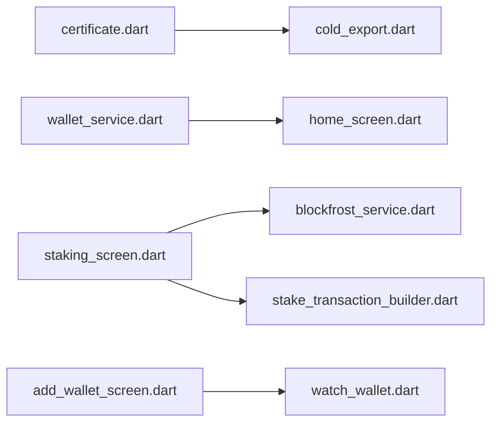

# Cardano质押功能

<cite>
**本文引用的文件**
- [coldwallet-app/lib/main.dart](file://coldwallet-app/lib/main.dart)
- [coldwallet-app/lib/models/certificate.dart](file://coldwallet-app/lib/models/certificate.dart)
- [coldwallet-app/lib/models/cold_export.dart](file://coldwallet-app/lib/models/cold_export.dart)
- [coldwallet-app/lib/services/wallet_service.dart](file://coldwallet-app/lib/services/wallet_service.dart)
- [coldwallet-app/lib/screens/home_screen.dart](file://coldwallet-app/lib/screens/home_screen.dart)
- [coldwallet-watch/lib/screens/staking_screen.dart](file://coldwallet-watch/lib/screens/staking_screen.dart)
- [coldwallet-watch/lib/screens/add_wallet_screen.dart](file://coldwallet-watch/lib/screens/add_wallet_screen.dart)
- [coldwallet-watch/lib/models/watch_wallet.dart](file://coldwallet-watch/lib/models/watch_wallet.dart)
- [coldwallet-watch/lib/services/blockfrost_service.dart](file://coldwallet-watch/lib/services/blockfrost_service.dart)
- [coldwallet-watch/lib/services/stake_transaction_builder.dart](file://coldwallet-watch/lib/services/stake_transaction_builder.dart)
- [docs/superpowers/plans/2026-08-19-cardano-staking.md](file://docs/superpowers/plans/2026-08-19-cardano-staking.md)
- [docs/superpowers/specs/2026-08-19-cardano-staking-design.md](file://docs/superpowers/specs/2026-08-19-cardano-staking-design.md)
</cite>

## 目录
1. [简介](#简介)
2. [项目结构](#项目结构)
3. [核心组件](#核心组件)
4. [架构总览](#架构总览)
5. [详细组件分析](#详细组件分析)
6. [依赖关系分析](#依赖关系分析)
7. [性能考量](#性能考量)
8. [故障排查指南](#故障排查指南)
9. [结论](#结论)
10. [附录](#附录)

## 简介
本仓库为多链冷钱包项目，目标是在 coldwallet-app（离线）与 coldwallet-watch（在线观察端）之间实现完整的 Cardano 质押能力：包括 stake key 注册、委托（delegation）、奖励提取（withdrawal）以及解除注册（deregistration）。整体采用“观察端构建交易 → 冷端签名”的离线签名模式，通过二维码或文件在两端交换数据。

## 项目结构
- coldwallet-app（冷钱包，离线）
  - 模型层新增 Certificate 类型，扩展 ColdExport 以承载证书、提款映射与 stake key 路径
  - 服务层提供 stake address 派生能力
  - 屏幕层展示 stake address，并生成合并 QR（payment + stake）
- coldwallet-watch（观察钱包，在线）
  - 屏幕层新增 StakingScreen 入口与操作按钮
  - 服务层扩展 BlockfrostService 查询 pool 与 stake 状态，StakeTransactionBuilder 构建 CBOR 交易
  - 模型层 watch_wallet 增加 stakeAddress 字段，AddWalletScreen 支持导入合并 QR

图表来源
- [coldwallet-watch/lib/screens/staking_screen.dart](file://coldwallet-watch/lib/screens/staking_screen.dart)
- [coldwallet-watch/lib/services/blockfrost_service.dart](file://coldwallet-watch/lib/services/blockfrost_service.dart)
- [coldwallet-watch/lib/services/stake_transaction_builder.dart](file://coldwallet-watch/lib/services/stake_transaction_builder.dart)
- [coldwallet-app/lib/models/certificate.dart](file://coldwallet-app/lib/models/certificate.dart)
- [coldwallet-app/lib/models/cold_export.dart](file://coldwallet-app/lib/models/cold_export.dart)
- [coldwallet-app/lib/services/wallet_service.dart](file://coldwallet-app/lib/services/wallet_service.dart)
- [coldwallet-app/lib/screens/home_screen.dart](file://coldwallet-app/lib/screens/home_screen.dart)
- [coldwallet-app/lib/main.dart](file://coldwallet-app/lib/main.dart)

章节来源
- [coldwallet-app/lib/main.dart:1-50](file://coldwallet-app/lib/main.dart#L1-L50)
- [docs/superpowers/plans/2026-08-19-cardano-staking.md:15-49](file://docs/superpowers/plans/2026-08-19-cardano-staking.md#L15-L49)

## 核心组件
- Certificate（证书模型）
  - 表示三种 Cardano 证书：注册、委托、解除注册；包含 stakeCredential 与可选 poolKeyHash
- ColdExport（跨端数据载体）
  - 新增 certificates、withdrawals、stakeKeyPath 三个可选字段，用于携带质押相关元数据
- WalletService（冷端密钥服务）
  - 提供 deriveStakeAddress 等能力，支撑 stake witness 所需信息
- StakingScreen（观察端 UI）
  - 展示 stake 地址与状态，提供 Delegate/Withdraw/Deregister 操作入口
- StakeTransactionBuilder（观察端交易构建）
  - 根据用户选择与链上状态，构建包含证书或提款的 CBOR 交易体及 ColdExport
- BlockfrostService（观察端链上查询）
  - 查询 pool 信息与 stake 账户状态，辅助 UI 决策与交易构建

章节来源
- [coldwallet-app/lib/models/certificate.dart:1-48](file://coldwallet-app/lib/models/certificate.dart#L1-L48)
- [coldwallet-app/lib/models/cold_export.dart:1-67](file://coldwallet-app/lib/models/cold_export.dart#L1-L67)
- [coldwallet-app/lib/services/wallet_service.dart:82-92](file://coldwallet-app/lib/services/wallet_service.dart#L82-L92)
- [coldwallet-watch/lib/screens/staking_screen.dart](file://coldwallet-watch/lib/screens/staking_screen.dart)
- [coldwallet-watch/lib/services/stake_transaction_builder.dart](file://coldwallet-watch/lib/services/stake_transaction_builder.dart)
- [coldwallet-watch/lib/services/blockfrost_service.dart](file://coldwallet-watch/lib/services/blockfrost_service.dart)

## 架构总览
观察端负责“构建交易”，冷端负责“离线签名”。数据通过 ColdExport JSON 在两端传递，其中质押交易会附带证书、提款映射与 stake key 路径。

图表来源
- [coldwallet-watch/lib/screens/staking_screen.dart](file://coldwallet-watch/lib/screens/staking_screen.dart)
- [coldwallet-watch/lib/services/blockfrost_service.dart](file://coldwallet-watch/lib/services/blockfrost_service.dart)
- [coldwallet-watch/lib/services/stake_transaction_builder.dart](file://coldwallet-watch/lib/services/stake_transaction_builder.dart)
- [coldwallet-app/lib/models/cold_export.dart](file://coldwallet-app/lib/models/cold_export.dart)
- [coldwallet-app/lib/models/certificate.dart](file://coldwallet-app/lib/models/certificate.dart)

## 详细组件分析

### 证书模型 Certificate
- 职责：表达 Cardano 的三类证书（注册、委托、解除注册），并支持 JSON 序列化/反序列化
- 关键字段：type、stakeCredential、poolKeyHash（仅委托时存在）
- 复杂度：序列化/反序列化为 O(1)，错误处理对未知 type 抛出异常

图表来源
- [coldwallet-app/lib/models/certificate.dart:1-48](file://coldwallet-app/lib/models/certificate.dart#L1-L48)

章节来源
- [coldwallet-app/lib/models/certificate.dart:1-48](file://coldwallet-app/lib/models/certificate.dart#L1-L48)

### 跨端数据模型 ColdExport（扩展）
- 职责：承载未签名交易 CBOR 与摘要，并在质押交易中携带证书、提款映射与 stake key 路径
- 向后兼容：无新字段时默认 null，不影响普通支付交易
- 复杂度：JSON 序列化/反序列化为线性于字段数量

图表来源
- [coldwallet-app/lib/models/cold_export.dart:1-67](file://coldwallet-app/lib/models/cold_export.dart#L1-L67)

章节来源
- [coldwallet-app/lib/models/cold_export.dart:1-67](file://coldwallet-app/lib/models/cold_export.dart#L1-L67)

### 冷端服务 WalletService（stake 能力）
- 职责：从助记词派生 stake address（CIP-1852 路径 m/1852'/1815'/0'/2/0），供 UI 展示与后续签名流程使用
- 关键点：testnet/mainnet 前缀不同（stake_test vs stake1）

图表来源
- [coldwallet-app/lib/services/wallet_service.dart:82-92](file://coldwallet-app/lib/services/wallet_service.dart#L82-L92)

章节来源
- [coldwallet-app/lib/services/wallet_service.dart:82-92](file://coldwallet-app/lib/services/wallet_service.dart#L82-L92)

### 观察端 StakingScreen（UI 与交互）
- 职责：展示 stake 地址与状态，提供 Delegate/Withdraw/Deregister 操作入口
- 交互：调用 BlockfrostService 获取状态，调用 StakeTransactionBuilder 构建交易并导出

图表来源
- [coldwallet-watch/lib/screens/staking_screen.dart](file://coldwallet-watch/lib/screens/staking_screen.dart)
- [coldwallet-watch/lib/services/blockfrost_service.dart](file://coldwallet-watch/lib/services/blockfrost_service.dart)
- [coldwallet-watch/lib/services/stake_transaction_builder.dart](file://coldwallet-watch/lib/services/stake_transaction_builder.dart)

章节来源
- [docs/superpowers/plans/2026-08-19-cardano-staking.md:726-754](file://docs/superpowers/plans/2026-08-19-cardano-staking.md#L726-L754)
- [docs/superpowers/specs/2026-08-19-cardano-staking-design.md:180-267](file://docs/superpowers/specs/2026-08-19-cardano-staking-design.md#L180-L267)

### 观察端 StakeTransactionBuilder（交易构建）
- 职责：根据用户输入与链上状态，构建包含证书或提款的 CBOR 交易体，并封装为 ColdExport
- 关键逻辑：首次委托自动合并 registration；withdrawal 构造 withdrawals 映射；deregistration 包含 deposit 退还

图表来源
- [coldwallet-watch/lib/services/stake_transaction_builder.dart](file://coldwallet-watch/lib/services/stake_transaction_builder.dart)
- [docs/superpowers/specs/2026-08-19-cardano-staking-design.md:209-257](file://docs/superpowers/specs/2026-08-19-cardano-staking-design.md#L209-L257)

章节来源
- [docs/superpowers/specs/2026-08-19-cardano-staking-design.md:209-257](file://docs/superpowers/specs/2026-08-19-cardano-staking-design.md#L209-L257)

### 观察端 BlockfrostService（链上查询）
- 职责：查询 pool 信息（是否存在、是否退役）与 stake 账户状态（是否注册、当前池、可提取奖励）
- 用途：驱动 UI 按钮可用性与交易构建参数

章节来源
- [docs/superpowers/plans/2026-08-19-cardano-staking.md:693-705](file://docs/superpowers/plans/2026-08-19-cardano-staking.md#L693-L705)
- [docs/superpowers/specs/2026-08-19-cardano-staking-design.md:260-267](file://docs/superpowers/specs/2026-08-19-cardano-staking-design.md#L260-L267)

### 观察端 AddWalletScreen（合并 QR 导入）
- 职责：解析冷端生成的合并 QR（包含 paymentAddress 与 stakeAddress），一次性导入两个地址
- 影响：watch_wallet 模型需支持 stakeAddress 字段

章节来源
- [docs/superpowers/plans/2026-08-19-cardano-staking.md:756-769](file://docs/superpowers/plans/2026-08-19-cardano-staking.md#L756-L769)
- [docs/superpowers/specs/2026-08-19-cardano-staking-design.md:268-285](file://docs/superpowers/specs/2026-08-19-cardano-staking-design.md#L268-L285)

### 冷端 HomeScreen（显示 stake 地址）
- 职责：当选择 Cardano 链时，展示 stake address，并提供复制与合并 QR 生成能力

章节来源
- [docs/superpowers/plans/2026-08-19-cardano-staking.md:650-674](file://docs/superpowers/plans/2026-08-19-cardano-staking.md#L650-L674)
- [docs/superpowers/specs/2026-08-19-cardano-staking-design.md:330-335](file://docs/superpowers/specs/2026-08-19-cardano-staking-design.md#L330-L335)

## 依赖关系分析
- 冷端依赖
  - models/certificate.dart 被 models/cold_export.dart 引用
  - services/wallet_service.dart 提供 stake 地址派生，供 UI 与签名流程使用
- 观察端依赖
  - screens/staking_screen.dart 依赖 services/blockfrost_service.dart 与 services/stake_transaction_builder.dart
  - models/watch_wallet.dart 扩展 stakeAddress，被 add_wallet_screen.dart 使用
- 文档与计划
  - plans/specs 定义了端到端流程、数据结构与测试策略

图表来源
- [coldwallet-app/lib/models/certificate.dart](file://coldwallet-app/lib/models/certificate.dart)
- [coldwallet-app/lib/models/cold_export.dart](file://coldwallet-app/lib/models/cold_export.dart)
- [coldwallet-app/lib/services/wallet_service.dart](file://coldwallet-app/lib/services/wallet_service.dart)
- [coldwallet-app/lib/screens/home_screen.dart](file://coldwallet-app/lib/screens/home_screen.dart)
- [coldwallet-watch/lib/screens/staking_screen.dart](file://coldwallet-watch/lib/screens/staking_screen.dart)
- [coldwallet-watch/lib/services/blockfrost_service.dart](file://coldwallet-watch/lib/services/blockfrost_service.dart)
- [coldwallet-watch/lib/services/stake_transaction_builder.dart](file://coldwallet-watch/lib/services/stake_transaction_builder.dart)
- [coldwallet-watch/lib/screens/add_wallet_screen.dart](file://coldwallet-watch/lib/screens/add_wallet_screen.dart)
- [coldwallet-watch/lib/models/watch_wallet.dart](file://coldwallet-watch/lib/models/watch_wallet.dart)

章节来源
- [docs/superpowers/plans/2026-08-19-cardano-staking.md:15-49](file://docs/superpowers/plans/2026-08-19-cardano-staking.md#L15-L49)
- [docs/superpowers/specs/2026-08-19-cardano-staking-design.md:67-82](file://docs/superpowers/specs/2026-08-19-cardano-staking-design.md#L67-L82)

## 性能考量
- 观察端查询优化
  - 批量缓存 pool 与 stake 状态，减少重复网络请求
  - 对 UTxO 查询进行分页与去重，降低响应时间
- 交易构建优化
  - 优先选择小额 UTxO 以减少交易体积与手续费
  - 合理估算 fee，避免二次调整
- 冷端签名
  - 仅在必要时派生 stake key 并签名，避免多余计算
  - 复用已解析的交易体对象，减少重复解析开销

[本节为通用指导，不直接分析具体文件]

## 故障排查指南
- Pool 不存在或格式错误
  - 现象：Blockfrost 返回 404 或校验失败
  - 处理：提示用户检查 pool ID 格式与有效性
- Pool 已退役
  - 现象：查询到 retiring_epoch 非空
  - 处理：提示选择其他活跃 pool
- 重复注册
  - 现象：尝试再次发送 registration
  - 处理：检测链上状态，仅发送 delegation
- 无奖励可提取
  - 现象：reward = 0
  - 处理：禁用提现按钮并提示
- 未注册即解押
  - 现象：stake key 未注册却尝试 deregister
  - 处理：禁用按钮并提示先注册
- 余额不足
  - 现象：委托需要 2 ADA deposit + fee
  - 处理：提示最低余额要求
- Blockfrost API 错误
  - 现象：超时或 5xx
  - 处理：提示网络错误并重试
- Stake credential 不匹配
  - 现象：本地派生与 JSON 中不一致
  - 处理：提示使用正确的钱包并重新生成

章节来源
- [docs/superpowers/specs/2026-08-19-cardano-staking-design.md:338-351](file://docs/superpowers/specs/2026-08-19-cardano-staking-design.md#L338-L351)

## 结论
本项目通过扩展冷端的证书与数据模型，并在观察端完善交易构建与链上查询，实现了 Cardano 质押的全链路闭环。设计强调向后兼容与最小侵入：普通支付交易不受影响，质押交易通过可选字段自然扩展。配合完善的错误处理与测试计划，可在预览网快速验证并逐步上线主网。

[本节为总结性内容，不直接分析具体文件]

## 附录
- 端到端流程参考
  - 计划文档提供了分阶段任务清单与提交规范
  - 设计文档给出了数据流、组件关系与 CBOR 结构说明

章节来源
- [docs/superpowers/plans/2026-08-19-cardano-staking.md:1-12](file://docs/superpowers/plans/2026-08-19-cardano-staking.md#L1-L12)
- [docs/superpowers/specs/2026-08-19-cardano-staking-design.md:36-82](file://docs/superpowers/specs/2026-08-19-cardano-staking-design.md#L36-L82)