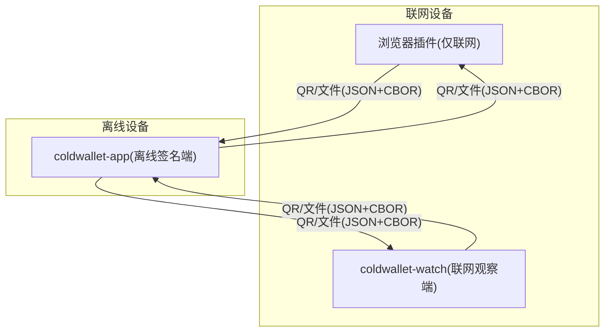
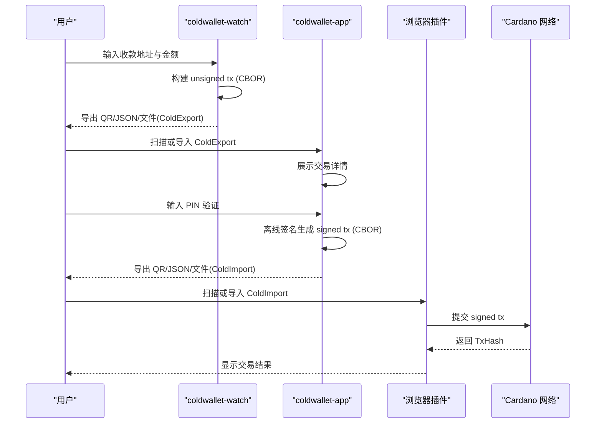
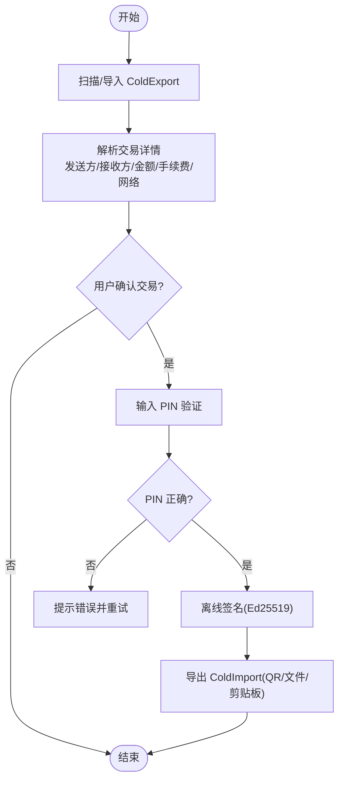
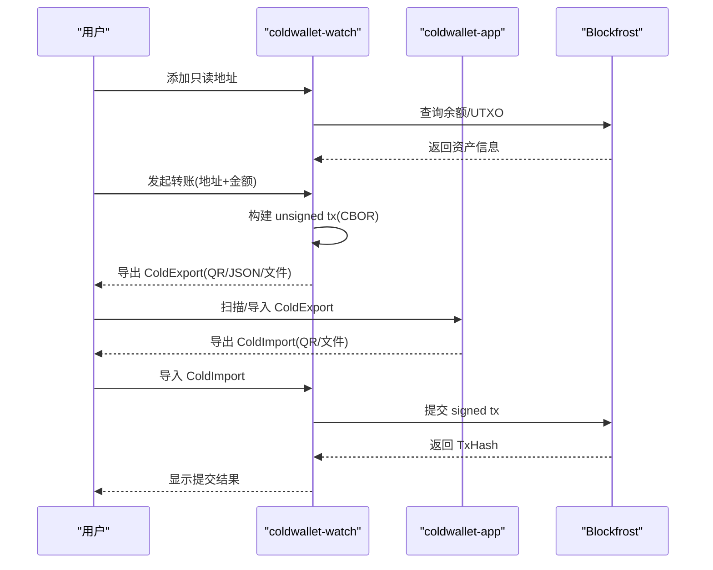
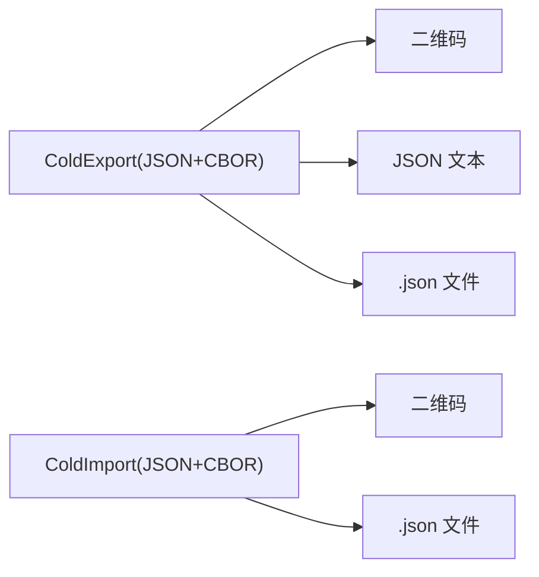
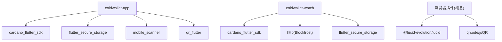

# 安全架构设计

<cite>
**本文引用的文件**
- [coldwallet-app/lib/main.dart](file://coldwallet-app/lib/main.dart)
- [coldwallet-watch/lib/main.dart](file://coldwallet-watch/lib/main.dart)
- [cold-wallet-plugin.md](file://cold-wallet-plugin.md)
- [docs/superpowers/specs/2026-08-10-cold-wallet-design.md](file://docs/superpowers/specs/2026-08-10-cold-wallet-design.md)
- [docs/superpowers/specs/2026-08-13-cold-wallet-watch-design.md](file://docs/superpowers/specs/2026-08-13-cold-wallet-watch-design.md)
</cite>

## 目录
1. [简介](#简介)
2. [项目结构](#项目结构)
3. [核心组件](#核心组件)
4. [架构总览](#架构总览)
5. [详细组件分析](#详细组件分析)
6. [依赖关系分析](#依赖关系分析)
7. [性能与安全特性](#性能与安全特性)
8. [故障排查指南](#故障排查指南)
9. [结论](#结论)
10. [附录：配置与最佳实践](#附录配置与最佳实践)

## 简介
本文件面向 ColdWallet 的安全架构设计，聚焦离线签名安全模型、Android Keystore 集成、数据加密策略、内存安全防护、冷/热端职责边界、数据传输安全措施，以及威胁分析与防护建议。文档基于仓库中的设计与实现说明进行系统化整理，帮助读者理解“私钥永远不离开冷钱包设备”的核心原则，并给出可落地的安全实践与配置建议。

## 项目结构
ColdWallet 由三个主要部分组成：
- 离线签名端（coldwallet-app）：Flutter Android 应用，负责助记词管理、地址派生、PIN 验证、离线签名与导出已签名交易。
- 联网观察端（coldwallet-watch）：Flutter Android 应用，只读查询余额、构建未签名交易、导入已签名交易并提交到链上。
- 浏览器插件端（coldwallet-ext，概念性描述）：在联网设备上生成未签名交易并通过二维码/文件与冷端交换。

图表来源
- [cold-wallet-plugin.md:22-51](file://cold-wallet-plugin.md#L22-L51)
- [docs/superpowers/specs/2026-08-10-cold-wallet-design.md:32-62](file://docs/superpowers/specs/2026-08-10-cold-wallet-design.md#L32-L62)
- [docs/superpowers/specs/2026-08-13-cold-wallet-watch-design.md:39-72](file://docs/superpowers/specs/2026-08-13-cold-wallet-watch-design.md#L39-L72)

章节来源
- [coldwallet-app/lib/main.dart:1-51](file://coldwallet-app/lib/main.dart#L1-L51)
- [coldwallet-watch/lib/main.dart:1-12](file://coldwallet-watch/lib/main.dart#L1-L12)
- [docs/superpowers/specs/2026-08-10-cold-wallet-design.md:32-62](file://docs/superpowers/specs/2026-08-10-cold-wallet-design.md#L32-L62)
- [docs/superpowers/specs/2026-08-13-cold-wallet-watch-design.md:39-72](file://docs/superpowers/specs/2026-08-13-cold-wallet-watch-design.md#L39-L72)

## 核心组件
- 离线签名端（coldwallet-app）
  - 助记词生成/导入与校验
  - PIN 设置与验证
  - CIP-1852 地址派生
  - 扫码解析未签名交易
  - 离线签名（Ed25519 扩展签名）
  - 导出已签名交易（QR/剪贴板/文件）
  - 通过 flutter_secure_storage 使用 Android Keystore 安全存储
- 联网观察端（coldwallet-watch）
  - 只读地址管理与余额查询
  - 构建未签名交易（unsigned tx）
  - 导出 QR/JSON/文件给冷端
  - 导入已签名交易并提交到链上
  - Blockfrost API Key 使用 flutter_secure_storage 加密存储
- 浏览器插件端（coldwallet-ext，概念）
  - 只读登录（公钥/地址）
  - 构建 unsigned tx 并导出为 QR/文件
  - 导入 signed tx 并提交到链上

章节来源
- [cold-wallet-plugin.md:12-19](file://cold-wallet-plugin.md#L12-L19)
- [cold-wallet-plugin.md:108-123](file://cold-wallet-plugin.md#L108-L123)
- [cold-wallet-plugin.md:223-234](file://cold-wallet-plugin.md#L223-L234)
- [docs/superpowers/specs/2026-08-10-cold-wallet-design.md:201-297](file://docs/superpowers/specs/2026-08-10-cold-wallet-design.md#L201-L297)
- [docs/superpowers/specs/2026-08-13-cold-wallet-watch-design.md:121-257](file://docs/superpowers/specs/2026-08-13-cold-wallet-watch-design.md#L121-L257)

## 架构总览
整体采用“冷/热分离 + 二维码/文件传输”的架构：
- 冷端（coldwallet-app）：完全离线，持有私钥与助记词，执行签名；不发起任何网络请求。
- 热端（coldwallet-watch / 浏览器插件）：联网但不接触私钥，负责余额查询、交易构建、提交已签名交易。
- 数据契约：ColdExport（未签名交易）与 ColdImport（已签名交易），以 JSON 包装 CBOR hex 字符串，便于 QR/文件传输。

图表来源
- [docs/superpowers/specs/2026-08-10-cold-wallet-design.md:127-135](file://docs/superpowers/specs/2026-08-10-cold-wallet-design.md#L127-L135)
- [docs/superpowers/specs/2026-08-13-cold-wallet-watch-design.md:178-223](file://docs/superpowers/specs/2026-08-13-cold-wallet-watch-design.md#L178-L223)
- [cold-wallet-plugin.md:55-80](file://cold-wallet-plugin.md#L55-L80)

## 详细组件分析

### 离线签名端（coldwallet-app）安全流程
- 私钥与助记词：仅在冷端设备内处理，永不触网。
- PIN 验证：签名前强制 6 位数字 PIN 验证，防止未授权签名。
- 安全存储：使用 flutter_secure_storage 将密钥材料存入 Android Keystore（EncryptedSharedPreferences）。
- 内存安全：Dart GC 自动回收，签名后不保留私钥引用；避免引入 HTTP 库，确保无网络出口。
- 交易解析与签名：解析 ColdExport，展示交易详情；确认后进行 Ed25519 扩展签名，输出 ColdImport。

图表来源
- [docs/superpowers/specs/2026-08-10-cold-wallet-design.md:244-281](file://docs/superpowers/specs/2026-08-10-cold-wallet-design.md#L244-L281)
- [cold-wallet-plugin.md:223-234](file://cold-wallet-plugin.md#L223-L234)

章节来源
- [coldwallet-app/lib/main.dart:1-51](file://coldwallet-app/lib/main.dart#L1-L51)
- [docs/superpowers/specs/2026-08-10-cold-wallet-design.md:201-297](file://docs/superpowers/specs/2026-08-10-cold-wallet-design.md#L201-L297)
- [cold-wallet-plugin.md:223-234](file://cold-wallet-plugin.md#L223-L234)

### 联网观察端（coldwallet-watch）安全流程
- 无私钥原则：不存储、不输入、不处理助记词或私钥。
- 只读地址本地存储：使用 SharedPreferences 保存公开地址与名称。
- API Key 安全存储：Blockfrost Project ID 使用 flutter_secure_storage 加密存储。
- 交易构建与提交：构建 unsigned tx 并导出；导入 signed tx 后提交到链上。

图表来源
- [docs/superpowers/specs/2026-08-13-cold-wallet-watch-design.md:178-223](file://docs/superpowers/specs/2026-08-13-cold-wallet-watch-design.md#L178-L223)
- [docs/superpowers/specs/2026-08-13-cold-wallet-watch-design.md:227-257](file://docs/superpowers/specs/2026-08-13-cold-wallet-watch-design.md#L227-L257)

章节来源
- [coldwallet-watch/lib/main.dart:1-12](file://coldwallet-watch/lib/main.dart#L1-L12)
- [docs/superpowers/specs/2026-08-13-cold-wallet-watch-design.md:121-257](file://docs/superpowers/specs/2026-08-13-cold-wallet-watch-design.md#L121-L257)

### 数据契约与传输安全
- ColdExport（未签名交易）：包含 version、type、network、txCbor、summary（发送方/接收方/资产/手续费）。
- ColdImport（已签名交易）：包含 version、type、txCbor、txHash。
- 传输方式：二维码、JSON 文本复制粘贴、.json 文件导入导出。
- 容量预估：ColdExport/ColdImport JSON 较小，单 QR 码可承载。

图表来源
- [docs/superpowers/specs/2026-08-10-cold-wallet-design.md:299-345](file://docs/superpowers/specs/2026-08-10-cold-wallet-design.md#L299-L345)
- [docs/superpowers/specs/2026-08-13-cold-wallet-watch-design.md:146-174](file://docs/superpowers/specs/2026-08-13-cold-wallet-watch-design.md#L146-L174)

章节来源
- [docs/superpowers/specs/2026-08-10-cold-wallet-design.md:299-345](file://docs/superpowers/specs/2026-08-10-cold-wallet-design.md#L299-L345)
- [docs/superpowers/specs/2026-08-13-cold-wallet-watch-design.md:146-174](file://docs/superpowers/specs/2026-08-13-cold-wallet-watch-design.md#L146-L174)

## 依赖关系分析
- 冷端依赖：cardano_flutter_sdk（CIP-1852、签名）、bip39_plus（助记词校验）、pointycastle（哈希）、flutter_secure_storage（Keystore）、mobile_scanner（扫码）、qr_flutter（展示）。
- 热端依赖：cardano_flutter_sdk（交易构建）、http（Blockfrost 调用）、mobile_scanner、qr_flutter、shared_preferences（地址存储）、flutter_secure_storage（API Key 加密）。
- 插件端依赖（概念）：@lucid-evolution/lucid（交易构建）、qrcode/jsQR（二维码）、CIP-30（dApp 连接标准，后续）。

图表来源
- [docs/superpowers/specs/2026-08-10-cold-wallet-design.md:283-297](file://docs/superpowers/specs/2026-08-10-cold-wallet-design.md#L283-L297)
- [docs/superpowers/specs/2026-08-13-cold-wallet-watch-design.md:227-242](file://docs/superpowers/specs/2026-08-13-cold-wallet-watch-design.md#L227-L242)
- [cold-wallet-plugin.md:100-116](file://cold-wallet-plugin.md#L100-L116)

章节来源
- [docs/superpowers/specs/2026-08-10-cold-wallet-design.md:283-297](file://docs/superpowers/specs/2026-08-10-cold-wallet-design.md#L283-L297)
- [docs/superpowers/specs/2026-08-13-cold-wallet-watch-design.md:227-242](file://docs/superpowers/specs/2026-08-13-cold-wallet-watch-design.md#L227-L242)
- [cold-wallet-plugin.md:100-116](file://cold-wallet-plugin.md#L100-L116)

## 性能与安全特性
- 性能
  - 二维码传输适合小交易（< 3KB），单帧即可承载 ColdExport/ColdImport。
  - 大交易后续可考虑 Animated QR 或文件传输以提升体验。
- 安全特性
  - 冷端完全离线，无任何网络请求代码，杜绝私钥外泄路径。
  - 助记词仅支持手动输入，降低从外部渠道导入的风险。
  - PIN 验证作为签名前置条件，增强访问控制。
  - 使用 Android Keystore（EncryptedSharedPreferences）保护密钥材料与敏感设置。
  - 热端仅持有只读地址与 API Key，私钥始终在冷端。

章节来源
- [docs/superpowers/specs/2026-08-10-cold-wallet-design.md:269-281](file://docs/superpowers/specs/2026-08-10-cold-wallet-design.md#L269-L281)
- [docs/superpowers/specs/2026-08-13-cold-wallet-watch-design.md:246-257](file://docs/superpowers/specs/2026-08-13-cold-wallet-watch-design.md#L246-L257)
- [cold-wallet-plugin.md:127-150](file://cold-wallet-plugin.md#L127-L150)

## 故障排查指南
- 地址格式错误：实时校验并提示“地址格式不正确”。
- 地址网络不匹配：提示当前网络与地址网络不一致。
- 余额不足：构建前检查并提示“余额不足”。
- Blockfrost 请求失败：重试一次，提示网络或 API Key 错误。
- 收款地址与发送地址相同：拦截并提示不能转账给自己。
- 二维码扫描失败：提示“无法识别，请重试或改用文件”。
- 导入签名文件解析失败：提示“签名文件格式错误”。
- 提交交易失败：显示 Blockfrost 返回的错误信息。

章节来源
- [docs/superpowers/specs/2026-08-13-cold-wallet-watch-design.md:260-272](file://docs/superpowers/specs/2026-08-13-cold-wallet-watch-design.md#L260-L272)

## 结论
ColdWallet 通过严格的冷/热分离与二维码/文件传输机制，实现了“私钥永远不离开冷钱包设备”的安全模型。冷端使用 Android Keystore 保护密钥材料，结合 PIN 验证与离线环境，有效降低私钥泄露风险；热端仅负责只读查询与交易提交，避免接触敏感数据。配合明确的数据契约与传输规范，系统具备抵御中间人攻击、重放攻击等威胁的能力。后续迭代可进一步增强抗重放能力（如加入时间戳/随机数）与用户体验（大交易分帧传输）。

## 附录：配置与最佳实践
- 安全存储
  - 冷端：使用 flutter_secure_storage 将助记词/私钥存入 Android Keystore（EncryptedSharedPreferences）。
  - 热端：Blockfrost API Key 使用 flutter_secure_storage 加密存储；只读地址使用 SharedPreferences。
- 访问控制
  - 冷端签名前强制 PIN 验证；建议后续引入强密码策略与生物识别（若平台允许）。
- 网络隔离
  - 冷端禁止任何网络请求；热端仅用于 Blockfrost 查询与提交。
- 数据传输
  - 使用 ColdExport/ColdImport JSON 包装 CBOR hex；优先选择可信通道（摄像头扫码、受控文件传输）。
  - 对大交易考虑 Animated QR 或文件传输，减少误扫与截断风险。
- 防重放与完整性
  - 建议在 ColdExport/ColdImport 中加入时间戳与随机数，并在热端提交前校验网络一致性。
  - 使用 Cardano 原生哈希（blake2b_256）计算交易哈希，确保完整性。
- 内存安全
  - Dart GC 自动回收；签名后不保留私钥引用；避免日志打印敏感信息。
- 审计与构建
  - 冷端 APK 本地构建，保证构建过程透明可审计；禁用云端构建以降低供应链风险。

章节来源
- [docs/superpowers/specs/2026-08-10-cold-wallet-design.md:269-297](file://docs/superpowers/specs/2026-08-10-cold-wallet-design.md#L269-L297)
- [docs/superpowers/specs/2026-08-13-cold-wallet-watch-design.md:246-257](file://docs/superpowers/specs/2026-08-13-cold-wallet-watch-design.md#L246-L257)
- [cold-wallet-plugin.md:108-123](file://cold-wallet-plugin.md#L108-L123)
- [cold-wallet-plugin.md:223-234](file://cold-wallet-plugin.md#L223-L234)