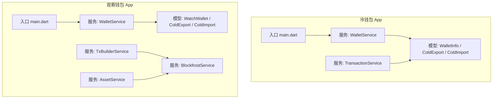
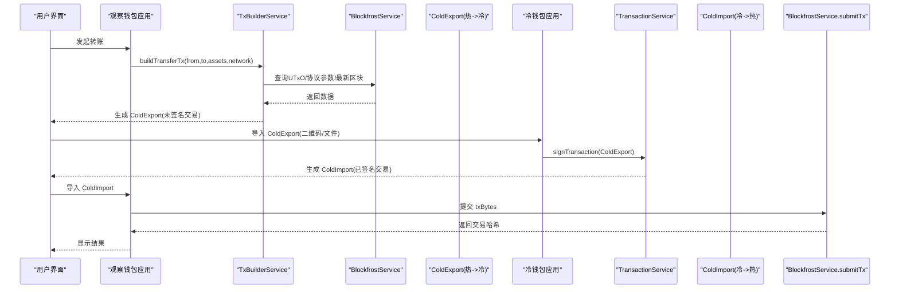
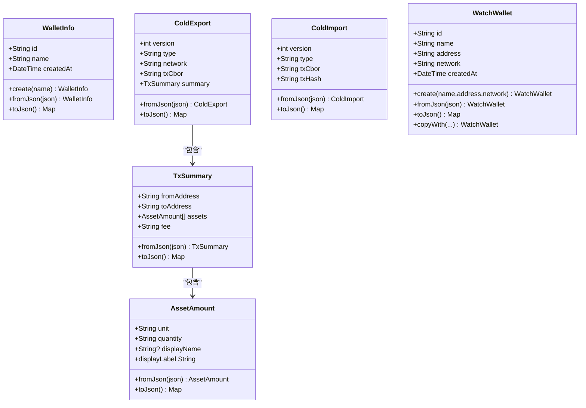
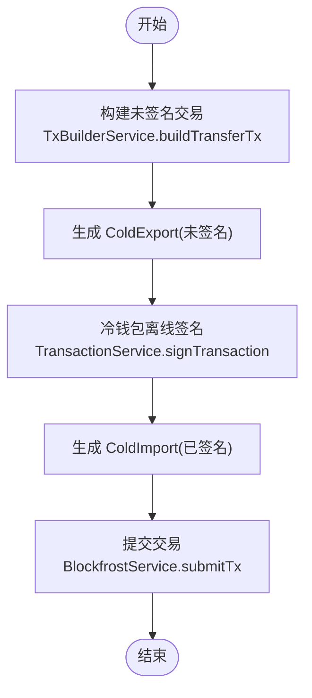
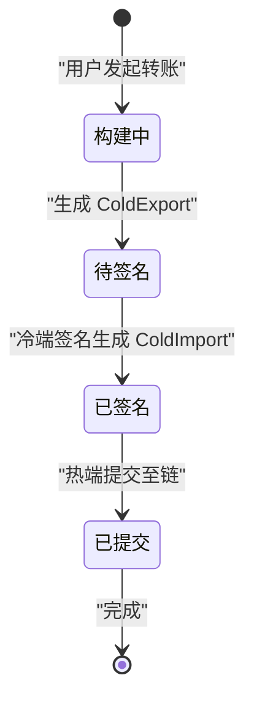
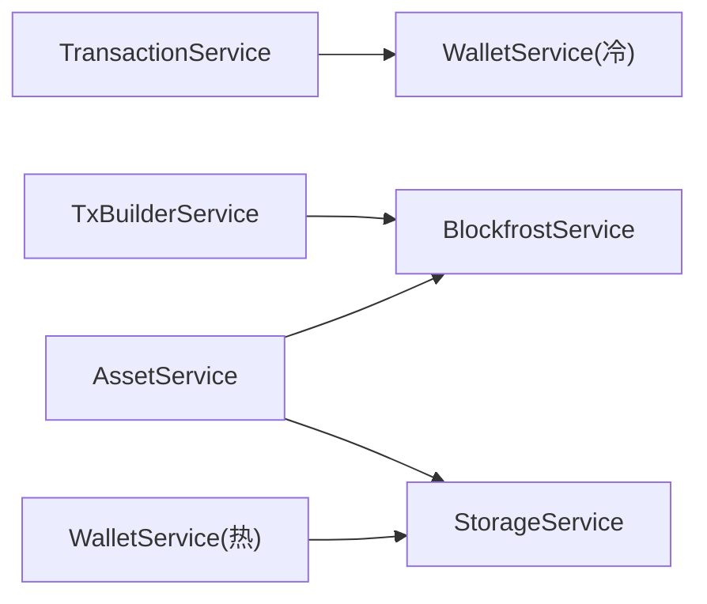

# 数据流设计

<cite>
**本文引用的文件**
- [coldwallet-app/lib/main.dart](file://coldwallet-app/lib/main.dart)
- [coldwallet-app/lib/models/wallet_info.dart](file://coldwallet-app/lib/models/wallet_info.dart)
- [coldwallet-app/lib/models/cold_export.dart](file://coldwallet-app/lib/models/cold_export.dart)
- [coldwallet-app/lib/models/cold_import.dart](file://coldwallet-app/lib/models/cold_import.dart)
- [coldwallet-app/lib/services/wallet_service.dart](file://coldwallet-app/lib/services/wallet_service.dart)
- [coldwallet-app/lib/services/transaction_service.dart](file://coldwallet-app/lib/services/transaction_service.dart)
- [coldwallet-watch/lib/main.dart](file://coldwallet-watch/lib/main.dart)
- [coldwallet-watch/lib/models/watch_wallet.dart](file://coldwallet-watch/lib/models/watch_wallet.dart)
- [coldwallet-watch/lib/models/cold_export.dart](file://coldwallet-watch/lib/models/cold_export.dart)
- [coldwallet-watch/lib/models/cold_import.dart](file://coldwallet-watch/lib/models/cold_import.dart)
- [coldwallet-watch/lib/services/wallet_service.dart](file://coldwallet-watch/lib/services/wallet_service.dart)
- [coldwallet-watch/lib/services/blockfrost_service.dart](file://coldwallet-watch/lib/services/blockfrost_service.dart)
- [coldwallet-watch/lib/services/tx_builder_service.dart](file://coldwallet-watch/lib/services/tx_builder_service.dart)
- [coldwallet-watch/lib/services/asset_service.dart](file://coldwallet-watch/lib/services/asset_service.dart)
</cite>

## 目录
1. [简介](#简介)
2. [项目结构](#项目结构)
3. [核心组件](#核心组件)
4. [架构总览](#架构总览)
5. [详细组件分析](#详细组件分析)
6. [依赖关系分析](#依赖关系分析)
7. [性能考虑](#性能考虑)
8. [故障排查指南](#故障排查指南)
9. [结论](#结论)
10. [附录](#附录)

## 简介
本文件面向 ColdWallet 的数据流设计，聚焦冷钱包（离线）与观察钱包（联网）之间的数据交换、交易构建与签名流程、状态管理与缓存策略，以及数据验证、转换与版本兼容性处理。文档通过数据流图与状态转换图，帮助开发者理解从用户发起交易到最终上链的完整路径，并为后续扩展提供指导。

## 项目结构
仓库包含两个 Flutter 应用：
- coldwallet-app：离线冷钱包，负责助记词管理、离线签名、导出已签名交易。
- coldwallet-watch：联网观察钱包，负责查询余额、构建未签名交易、提交已签名交易。

图表来源
- [coldwallet-app/lib/main.dart:1-51](file://coldwallet-app/lib/main.dart#L1-L51)
- [coldwallet-watch/lib/main.dart:1-12](file://coldwallet-watch/lib/main.dart#L1-L12)

章节来源
- [coldwallet-app/lib/main.dart:1-51](file://coldwallet-app/lib/main.dart#L1-L51)
- [coldwallet-watch/lib/main.dart:1-12](file://coldwallet-watch/lib/main.dart#L1-L12)

## 核心组件
- 冷钱包侧数据模型
  - WalletInfo：钱包元数据（不含私钥），用于本地列表管理。
  - ColdExport：热端导出的未签名交易（含 CBOR、网络标识、摘要）。
  - ColdImport：冷端签名的已签名交易（含 CBOR 与交易哈希）。
- 观察钱包侧数据模型
  - WatchWallet：只读钱包（仅公钥地址与元数据）。
  - ColdExport/ColdImport：与冷钱包侧对称，便于跨端序列化与反序列化。
- 服务层
  - 冷钱包：WalletService（助记词、派生地址、多钱包管理）、TransactionService（解析、签名、生成 ColdImport）。
  - 观察钱包：WalletService（只读钱包 CRUD）、TxBuilderService（UTxO 选择、费用估算、构建未签名交易）、BlockfrostService（链上交互）、AssetService（资产余额展示）。

章节来源
- [coldwallet-app/lib/models/wallet_info.dart:1-56](file://coldwallet-app/lib/models/wallet_info.dart#L1-L56)
- [coldwallet-app/lib/models/cold_export.dart:1-109](file://coldwallet-app/lib/models/cold_export.dart#L1-L109)
- [coldwallet-app/lib/models/cold_import.dart:1-36](file://coldwallet-app/lib/models/cold_import.dart#L1-L36)
- [coldwallet-watch/lib/models/watch_wallet.dart:1-79](file://coldwallet-watch/lib/models/watch_wallet.dart#L1-L79)
- [coldwallet-watch/lib/models/cold_export.dart:1-110](file://coldwallet-watch/lib/models/cold_export.dart#L1-L110)
- [coldwallet-watch/lib/models/cold_import.dart:1-36](file://coldwallet-watch/lib/models/cold_import.dart#L1-L36)
- [coldwallet-app/lib/services/wallet_service.dart:1-208](file://coldwallet-app/lib/services/wallet_service.dart#L1-L208)
- [coldwallet-app/lib/services/transaction_service.dart:1-70](file://coldwallet-app/lib/services/transaction_service.dart#L1-L70)
- [coldwallet-watch/lib/services/wallet_service.dart:1-88](file://coldwallet-watch/lib/services/wallet_service.dart#L1-L88)
- [coldwallet-watch/lib/services/blockfrost_service.dart:1-109](file://coldwallet-watch/lib/services/blockfrost_service.dart#L1-L109)
- [coldwallet-watch/lib/services/tx_builder_service.dart:1-152](file://coldwallet-watch/lib/services/tx_builder_service.dart#L1-L152)
- [coldwallet-watch/lib/services/asset_service.dart:1-49](file://coldwallet-watch/lib/services/asset_service.dart#L1-L49)

## 架构总览
整体采用“冷热分离”的双端架构：
- 观察钱包（热端）负责与链交互：查询 UTxO、协议参数、构建未签名交易并导出为 ColdExport。
- 冷钱包（冷端）负责离线安全签名：解析 ColdExport，使用本地助记词派生私钥对交易签名，输出 ColdImport。
- 观察钱包导入 ColdImport，校验后提交至链上。

图表来源
- [coldwallet-watch/lib/services/tx_builder_service.dart:11-118](file://coldwallet-watch/lib/services/tx_builder_service.dart#L11-L118)
- [coldwallet-watch/lib/services/blockfrost_service.dart:43-107](file://coldwallet-watch/lib/services/blockfrost_service.dart#L43-L107)
- [coldwallet-app/lib/services/transaction_service.dart:26-57](file://coldwallet-app/lib/services/transaction_service.dart#L26-L57)

## 详细组件分析

### 数据模型设计与用途
- WalletInfo（冷钱包）
  - 作用：存储钱包非敏感元信息（id、name、createdAt），与助记词分离保存。
  - 关键点：独立 ID 生成、JSON 编解码、钱包列表编解码器。
- ColdExport（热->冷）
  - 作用：携带未签名交易的 CBOR、网络标识、交易摘要（发送方、接收方、资产列表、手续费）。
  - 关键点：version/type/network 字段用于兼容性与上下文；summary 供用户在冷端确认。
- ColdImport（冷->热）
  - 作用：携带已签名交易 CBOR 与交易哈希，供热端直接提交。
  - 关键点：version/type 用于识别类型；txHash 由冷端计算并回传。
- WatchWallet（观察钱包）
  - 作用：保存只读钱包（地址、网络、元数据），不包含私钥。
  - 关键点：支持 copyWith 更新、JSON 编解码、当前钱包切换。

图表来源
- [coldwallet-app/lib/models/wallet_info.dart:1-56](file://coldwallet-app/lib/models/wallet_info.dart#L1-L56)
- [coldwallet-app/lib/models/cold_export.dart:1-109](file://coldwallet-app/lib/models/cold_export.dart#L1-L109)
- [coldwallet-app/lib/models/cold_import.dart:1-36](file://coldwallet-app/lib/models/cold_import.dart#L1-L36)
- [coldwallet-watch/lib/models/watch_wallet.dart:1-79](file://coldwallet-watch/lib/models/watch_wallet.dart#L1-L79)
- [coldwallet-watch/lib/models/cold_export.dart:1-110](file://coldwallet-watch/lib/models/cold_export.dart#L1-L110)
- [coldwallet-watch/lib/models/cold_import.dart:1-36](file://coldwallet-watch/lib/models/cold_import.dart#L1-L36)

章节来源
- [coldwallet-app/lib/models/wallet_info.dart:1-56](file://coldwallet-app/lib/models/wallet_info.dart#L1-L56)
- [coldwallet-app/lib/models/cold_export.dart:1-109](file://coldwallet-app/lib/models/cold_export.dart#L1-L109)
- [coldwallet-app/lib/models/cold_import.dart:1-36](file://coldwallet-app/lib/models/cold_import.dart#L1-L36)
- [coldwallet-watch/lib/models/watch_wallet.dart:1-79](file://coldwallet-watch/lib/models/watch_wallet.dart#L1-L79)
- [coldwallet-watch/lib/models/cold_export.dart:1-110](file://coldwallet-watch/lib/models/cold_export.dart#L1-L110)
- [coldwallet-watch/lib/models/cold_import.dart:1-36](file://coldwallet-watch/lib/models/cold_import.dart#L1-L36)

### 交易流程数据流转（从发起交易到上链）
- 观察钱包侧
  - 输入：fromAddress、toAddress、assets（MVP 仅 lovelace）、network。
  - 步骤：
    1) 查询 UTxO、最新区块 slot、协议参数。
    2) 选择 UTxO 并估算费用，迭代收敛至稳定费用。
    3) 构建 Cardano 交易体并序列化为 CBOR。
    4) 生成 ColdExport（含 summary 供冷端确认）。
- 冷钱包侧
  - 输入：ColdExport。
  - 步骤：
    1) 解析 JSON 为 ColdExport。
    2) 加载当前钱包助记词，创建 HD 钱包。
    3) 反序列化交易 CBOR，使用私钥签名，附加 witness。
    4) 计算交易哈希（blake2b_256 的 body CBOR）。
    5) 生成 ColdImport（signed-tx）。
- 观察钱包侧提交
  - 输入：ColdImport。
  - 步骤：
    1) 解析并校验 ColdImport。
    2) 调用 BlockfrostService.submitTx 提交 CBOR。
    3) 返回交易哈希并展示结果。

图表来源
- [coldwallet-watch/lib/services/tx_builder_service.dart:11-118](file://coldwallet-watch/lib/services/tx_builder_service.dart#L11-L118)
- [coldwallet-app/lib/services/transaction_service.dart:26-57](file://coldwallet-app/lib/services/transaction_service.dart#L26-L57)
- [coldwallet-watch/lib/services/blockfrost_service.dart:92-107](file://coldwallet-watch/lib/services/blockfrost_service.dart#L92-L107)

章节来源
- [coldwallet-watch/lib/services/tx_builder_service.dart:11-118](file://coldwallet-watch/lib/services/tx_builder_service.dart#L11-L118)
- [coldwallet-app/lib/services/transaction_service.dart:26-57](file://coldwallet-app/lib/services/transaction_service.dart#L26-L57)
- [coldwallet-watch/lib/services/blockfrost_service.dart:92-107](file://coldwallet-watch/lib/services/blockfrost_service.dart#L92-L107)

### 状态管理模式（Flutter）
- 冷钱包（coldwallet-app）
  - 路由与页面：首页、钱包设置、扫码签名等页面通过 MaterialApp 路由组织。
  - 状态管理：当前文档未引入集中式状态管理库（如 Provider/Riverpod/Bloc），业务逻辑集中在 Service 层，UI 通过调用 Service 获取或更新状态。
  - 数据同步：通过 SecureStorageService 持久化助记词、钱包列表、PIN、网络设置；WalletService 封装读写。
  - 缓存策略：冷端无网络请求，不依赖外部缓存；交易相关数据以内存对象为主，持久化仅涉及密钥与元数据。
- 观察钱包（coldwallet-watch）
  - 路由与页面：入口启动应用，具体页面未在本文展开。
  - 状态管理：同样未见集中式状态管理库，服务层封装链上数据与本地存储。
  - 数据同步：通过 StorageService 管理只读钱包列表与启用资产配置；BlockfrostService 负责实时链上数据。
  - 缓存策略：MVP 中未实现显式缓存，每次余额/UTxO 查询均直连 Blockfrost；可考虑在 AssetService 增加短期缓存以提升性能。

章节来源
- [coldwallet-app/lib/main.dart:1-51](file://coldwallet-app/lib/main.dart#L1-L51)
- [coldwallet-watch/lib/main.dart:1-12](file://coldwallet-watch/lib/main.dart#L1-L12)
- [coldwallet-app/lib/services/wallet_service.dart:1-208](file://coldwallet-app/lib/services/wallet_service.dart#L1-L208)
- [coldwallet-watch/lib/services/wallet_service.dart:1-88](file://coldwallet-watch/lib/services/wallet_service.dart#L1-L88)
- [coldwallet-watch/lib/services/blockfrost_service.dart:1-109](file://coldwallet-watch/lib/services/blockfrost_service.dart#L1-L109)
- [coldwallet-watch/lib/services/asset_service.dart:1-49](file://coldwallet-watch/lib/services/asset_service.dart#L1-L49)

### 数据验证规则与转换逻辑
- 地址验证（观察钱包）
  - 规则：检查 bech32 前缀（addr1/addr_test1）与最小长度。
  - 位置：WalletService.validateAddress。
- 助记词验证（冷钱包）
  - 规则：BIP-39 校验，空串无效。
  - 位置：WalletService.validateMnemonic。
- 交易摘要与资产
  - 规则：MVP 仅支持 ADA（lovelace）转账；assets 列表长度为 1 且 unit 为 lovelace。
  - 位置：TxBuilderService.buildTransferTx。
- 版本与类型兼容
  - ColdExport/ColdImport 包含 version 与 type 字段，默认值分别为 1 与 unsigned-tx/signed-tx，便于未来扩展。
  - 反序列化时提供默认值，增强向后兼容。

章节来源
- [coldwallet-watch/lib/services/wallet_service.dart:76-86](file://coldwallet-watch/lib/services/wallet_service.dart#L76-L86)
- [coldwallet-app/lib/services/wallet_service.dart:48-56](file://coldwallet-app/lib/services/wallet_service.dart#L48-L56)
- [coldwallet-watch/lib/services/tx_builder_service.dart:11-21](file://coldwallet-watch/lib/services/tx_builder_service.dart#L11-L21)
- [coldwallet-watch/lib/models/cold_export.dart:12-18](file://coldwallet-watch/lib/models/cold_export.dart#L12-L18)
- [coldwallet-watch/lib/models/cold_import.dart:11-16](file://coldwallet-watch/lib/models/cold_import.dart#L11-L16)

### 版本兼容性处理
- 默认值策略：ColdExport/ColdImport 的反序列化提供默认 version 与 type，避免旧格式缺失字段导致崩溃。
- 网络标识：ColdExport.network 明确区分 mainnet/testnet，确保签名与提交使用正确网络。
- 扩展点：type 字段可用于未来扩展其他类型（如多资产、NFT 等），保持向前兼容。

章节来源
- [coldwallet-watch/lib/models/cold_export.dart:20-28](file://coldwallet-watch/lib/models/cold_export.dart#L20-L28)
- [coldwallet-watch/lib/models/cold_import.dart:18-25](file://coldwallet-watch/lib/models/cold_import.dart#L18-L25)
- [coldwallet-app/lib/models/cold_export.dart:20-28](file://coldwallet-app/lib/models/cold_export.dart#L20-L28)
- [coldwallet-app/lib/models/cold_import.dart:18-25](file://coldwallet-app/lib/models/cold_import.dart#L18-L25)

### 关键业务场景的状态转换图
- 交易生命周期（冷/热协作）

[此图为概念性状态图，无需代码映射来源]

## 依赖关系分析
- 冷钱包依赖
  - TransactionService 依赖 WalletService（获取助记词、创建 HD 钱包）。
  - 模型层 ColdExport/ColdImport 作为跨端契约。
- 观察钱包依赖
  - TxBuilderService 依赖 BlockfrostService（UTxO、协议参数、最新区块）。
  - AssetService 依赖 BlockfrostService 与 StorageService（余额与启用资产）。
  - WalletService 依赖 StorageService（只读钱包管理）。

图表来源
- [coldwallet-app/lib/services/transaction_service.dart:1-70](file://coldwallet-app/lib/services/transaction_service.dart#L1-L70)
- [coldwallet-watch/lib/services/tx_builder_service.dart:1-152](file://coldwallet-watch/lib/services/tx_builder_service.dart#L1-L152)
- [coldwallet-watch/lib/services/asset_service.dart:1-49](file://coldwallet-watch/lib/services/asset_service.dart#L1-L49)
- [coldwallet-watch/lib/services/wallet_service.dart:1-88](file://coldwallet-watch/lib/services/wallet_service.dart#L1-L88)

章节来源
- [coldwallet-app/lib/services/transaction_service.dart:1-70](file://coldwallet-app/lib/services/transaction_service.dart#L1-L70)
- [coldwallet-watch/lib/services/tx_builder_service.dart:1-152](file://coldwallet-watch/lib/services/tx_builder_service.dart#L1-L152)
- [coldwallet-watch/lib/services/asset_service.dart:1-49](file://coldwallet-watch/lib/services/asset_service.dart#L1-L49)
- [coldwallet-watch/lib/services/wallet_service.dart:1-88](file://coldwallet-watch/lib/services/wallet_service.dart#L1-L88)

## 性能考虑
- 费用估算迭代：TxBuilderService 最多迭代 5 次收敛费用，避免无限循环；若无法收敛则抛出异常提示。
- UTxO 选择：按顺序累加直到满足 amount + fee + minUtxoValue，简单高效但非最优组合；可扩展为更优选择算法。
- 网络请求：BlockfrostService 每次余额/UTxO 查询均为实时请求；可在 AssetService 增加短期缓存以减少重复请求。
- 序列化开销：CBOR 序列化/反序列化在冷端进行，注意大交易时的内存占用；必要时可分块处理。

[本节为通用性能讨论，不直接分析具体文件]

## 故障排查指南
- 助记词无效
  - 现象：validateMnemonic 返回 false。
  - 处理：提示用户重新输入或从骰子熵生成。
  - 参考：[coldwallet-app/lib/services/wallet_service.dart:48-56](file://coldwallet-app/lib/services/wallet_service.dart#L48-L56)
- 地址格式错误
  - 现象：validateAddress 返回 false。
  - 处理：要求用户修正地址前缀与长度。
  - 参考：[coldwallet-watch/lib/services/wallet_service.dart:76-86](file://coldwallet-watch/lib/services/wallet_service.dart#L76-L86)
- 余额不足
  - 现象：UTxO 累计不足以覆盖 amount + fee + minUtxoValue。
  - 处理：提示用户充值或减少转账金额。
  - 参考：[coldwallet-watch/lib/services/tx_builder_service.dart:56-58](file://coldwallet-watch/lib/services/tx_builder_service.dart#L56-L58)
- 无法收敛费用
  - 现象：迭代 5 次后仍无法稳定费用。
  - 处理：检查协议参数与 UTxO 选择逻辑，或降低交易复杂度。
  - 参考：[coldwallet-watch/lib/services/tx_builder_service.dart:117-118](file://coldwallet-watch/lib/services/tx_builder_service.dart#L117-L118)
- 提交失败
  - 现象：submitTx 返回非 200 状态码。
  - 处理：检查网络、API Key、交易 CBOR 有效性。
  - 参考：[coldwallet-watch/lib/services/blockfrost_service.dart:92-107](file://coldwallet-watch/lib/services/blockfrost_service.dart#L92-L107)

章节来源
- [coldwallet-app/lib/services/wallet_service.dart:48-56](file://coldwallet-app/lib/services/wallet_service.dart#L48-L56)
- [coldwallet-watch/lib/services/wallet_service.dart:76-86](file://coldwallet-watch/lib/services/wallet_service.dart#L76-L86)
- [coldwallet-watch/lib/services/tx_builder_service.dart:56-58](file://coldwallet-watch/lib/services/tx_builder_service.dart#L56-L58)
- [coldwallet-watch/lib/services/tx_builder_service.dart:117-118](file://coldwallet-watch/lib/services/tx_builder_service.dart#L117-L118)
- [coldwallet-watch/lib/services/blockfrost_service.dart:92-107](file://coldwallet-watch/lib/services/blockfrost_service.dart#L92-L107)

## 结论
本设计通过明确的冷热分离与标准化的数据模型（ColdExport/ColdImport），实现了安全的离线签名与可靠的链上提交流程。WalletInfo 与 WatchWallet 分别服务于冷/热端的钱包元数据管理。当前 MVP 聚焦 ADA 转账，具备清晰的扩展点（type/version、多资产支持、缓存优化）。建议后续引入集中式状态管理、完善错误提示与日志、增强 UTxO 选择算法与缓存策略，以提升用户体验与系统性能。

[本节为总结性内容，不直接分析具体文件]

## 附录
- 术语
  - UTxO：未花费的交易输出，Cardano 账户模型的核心。
  - CBOR：二进制编码标准对象表示法，用于序列化交易。
  - Witness：交易签名集合，用于证明交易合法性。
- 扩展建议
  - 多资产/NFT 支持：扩展 TxBuilderService 的输出与费用估算。
  - 缓存层：在 AssetService 增加短期缓存，减少重复网络请求。
  - 状态管理：引入 Provider/Riverpod/Bloc 统一管理 UI 状态与服务状态。

[本节为补充说明，不直接分析具体文件]