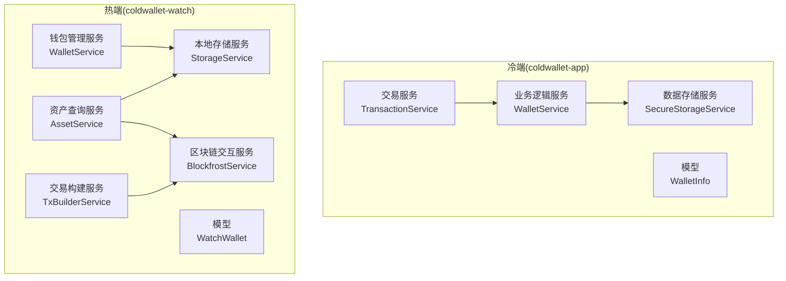
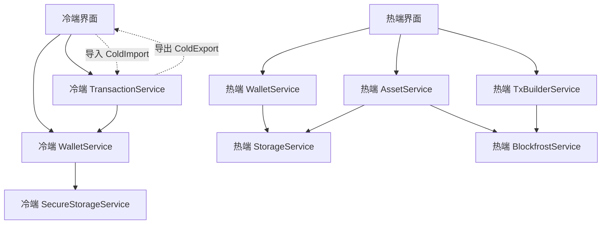
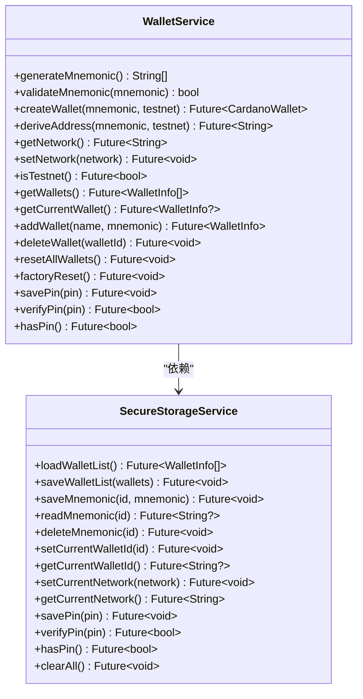
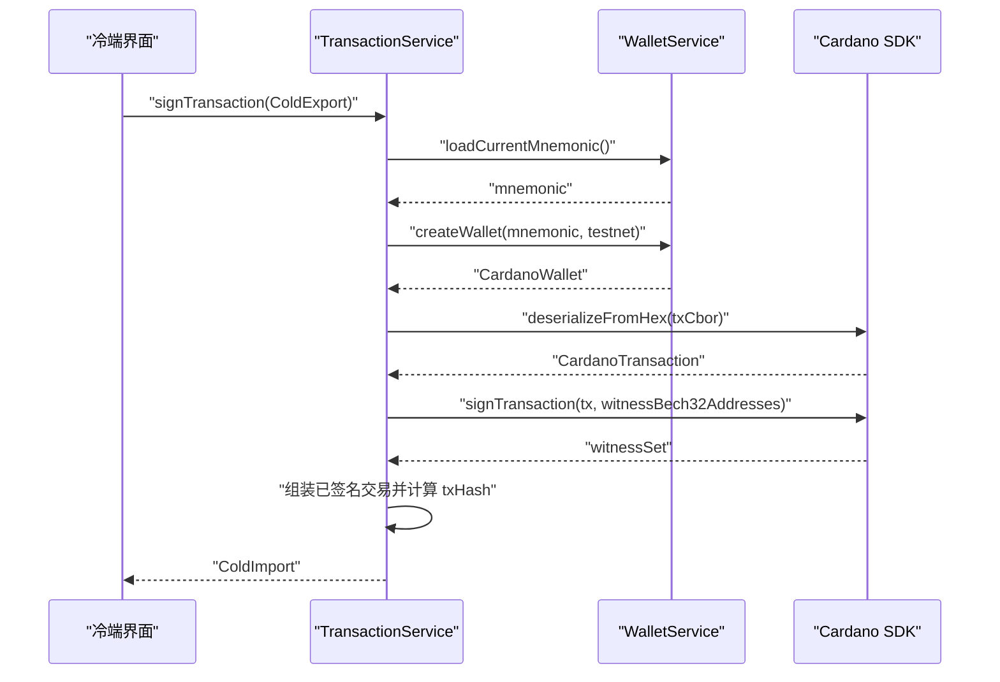
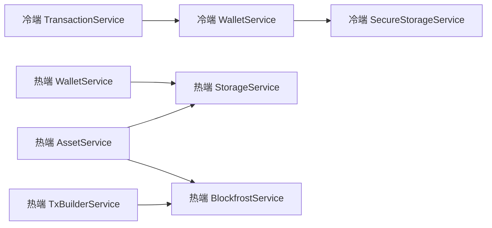

# 服务层架构

<cite>
**本文引用的文件**
- [coldwallet-app/lib/services/wallet_service.dart](file://coldwallet-app/lib/services/wallet_service.dart)
- [coldwallet-app/lib/services/secure_storage_service.dart](file://coldwallet-app/lib/services/secure_storage_service.dart)
- [coldwallet-app/lib/services/transaction_service.dart](file://coldwallet-app/lib/services/transaction_service.dart)
- [coldwallet-app/lib/models/wallet_info.dart](file://coldwallet-app/lib/models/wallet_info.dart)
- [coldwallet-watch/lib/services/wallet_service.dart](file://coldwallet-watch/lib/services/wallet_service.dart)
- [coldwallet-watch/lib/services/blockfrost_service.dart](file://coldwallet-watch/lib/services/blockfrost_service.dart)
- [coldwallet-watch/lib/services/storage_service.dart](file://coldwallet-watch/lib/services/storage_service.dart)
- [coldwallet-watch/lib/services/asset_service.dart](file://coldwallet-watch/lib/services/asset_service.dart)
- [coldwallet-watch/lib/services/tx_builder_service.dart](file://coldwallet-watch/lib/services/tx_builder_service.dart)
- [coldwallet-watch/lib/models/watch_wallet.dart](file://coldwallet-watch/lib/models/watch_wallet.dart)
</cite>

## 目录
1. [简介](#简介)
2. [项目结构](#项目结构)
3. [核心组件](#核心组件)
4. [架构总览](#架构总览)
5. [详细组件分析](#详细组件分析)
6. [依赖关系分析](#依赖关系分析)
7. [性能考虑](#性能考虑)
8. [故障排查指南](#故障排查指南)
9. [结论](#结论)
10. [附录](#附录)

## 简介
本文件面向 ColdWallet 项目的“服务层”设计与实现，聚焦以下三层职责：
- 业务逻辑服务（冷端 WalletService）：负责助记词生成、地址派生、钱包生命周期管理、PIN 与网络设置等。
- 数据存储服务（冷端 SecureStorageService）：封装安全存储（Keystore），对助记词、PIN、钱包列表进行加密持久化。
- 区块链交互服务（热端 BlockfrostService）：封装 Blockfrost REST API，提供 UTxO、余额、协议参数、交易提交等能力。

文档同时覆盖错误处理策略、日志记录机制、服务间协作方式、数据传递格式、异步操作处理，并提供架构图与时序图，帮助开发者扩展新服务功能。

## 项目结构
ColdWallet 分为两个应用：
- coldwallet-app（冷端）：完全离线，负责助记词与密钥管理、离线签名、交易导出。
- coldwallet-watch（热端）：联网只读端，负责查询链上数据、构建交易、提交已签名交易。

图表来源
- [coldwallet-app/lib/services/wallet_service.dart:10-208](file://coldwallet-app/lib/services/wallet_service.dart#L10-L208)
- [coldwallet-app/lib/services/secure_storage_service.dart:5-107](file://coldwallet-app/lib/services/secure_storage_service.dart#L5-L107)
- [coldwallet-app/lib/services/transaction_service.dart:12-70](file://coldwallet-app/lib/services/transaction_service.dart#L12-L70)
- [coldwallet-watch/lib/services/wallet_service.dart:4-88](file://coldwallet-watch/lib/services/wallet_service.dart#L4-L88)
- [coldwallet-watch/lib/services/storage_service.dart:8-87](file://coldwallet-watch/lib/services/storage_service.dart#L8-L87)
- [coldwallet-watch/lib/services/blockfrost_service.dart:17-109](file://coldwallet-watch/lib/services/blockfrost_service.dart#L17-L109)
- [coldwallet-watch/lib/services/asset_service.dart:5-49](file://coldwallet-watch/lib/services/asset_service.dart#L5-L49)
- [coldwallet-watch/lib/services/tx_builder_service.dart:6-152](file://coldwallet-watch/lib/services/tx_builder_service.dart#L6-L152)

章节来源
- [coldwallet-app/lib/services/wallet_service.dart:10-208](file://coldwallet-app/lib/services/wallet_service.dart#L10-L208)
- [coldwallet-watch/lib/services/blockfrost_service.dart:17-109](file://coldwallet-watch/lib/services/blockfrost_service.dart#L17-L109)

## 核心组件
本节从职责边界、接口设计、依赖关系三个维度解析关键服务。

- 冷端业务逻辑服务（WalletService）
  - 职责：助记词生成/校验、HD 钱包创建与地址派生、多钱包管理（增删改查、当前钱包切换）、全局网络与 PIN 管理。
  - 依赖：SecureStorageService（持久化敏感数据）。
  - 异步：多数方法返回 Future，使用 async/await 协调存储与 SDK 调用。
  - 错误：对非法输入抛出异常（如助记词长度、钱包上限），并向上层暴露统一异常语义。

- 冷端数据存储服务（SecureStorageService）
  - 职责：通过 FlutterSecureStorage 加密保存助记词、PIN、钱包列表、当前钱包 ID、网络设置；提供统一的读写键空间。
  - 依赖：FlutterSecureStorage。
  - 数据隔离：按 wallet_id 隔离助记词；钱包列表集中存储；PIN 与网络为全局配置。
  - 错误：底层抛出的 I/O 或解密失败由上层捕获并转换为业务异常。

- 热端区块链交互服务（BlockfrostService）
  - 职责：封装 Blockfrost REST API，提供 UTxO 查询、地址余额、最新区块、协议参数、交易提交。
  - 依赖：http.Client；网络基础 URL 根据 network 选择。
  - 错误：非 200 响应抛出异常，包含状态码与响应体便于诊断。
  - 并发：可复用 http.Client 实例，避免频繁创建连接。

- 热端钱包管理服务（WalletService）
  - 职责：只读钱包的增删改查、当前钱包切换、地址格式校验。
  - 依赖：StorageService（SharedPreferences + FlutterSecureStorage）。
  - 数据：仅保存公钥地址与元数据，不触碰私钥。

- 热端本地存储服务（StorageService）
  - 职责：管理钱包列表、当前钱包、启用资产偏好；加密存储 Blockfrost API Key。
  - 依赖：SharedPreferences（明文偏好）、FlutterSecureStorage（敏感信息）。

- 热端资产查询服务（AssetService）
  - 职责：聚合 Blockfrost 余额数据与用户启用配置，输出资产列表。
  - 依赖：BlockfrostService、StorageService。

- 热端交易构建服务（TxBuilderService）
  - 职责：基于 UTxO 与协议参数构建 ADA 转账未签名交易，迭代收敛手续费，输出 ColdExport。
  - 依赖：BlockfrostService。

- 冷端交易服务（TransactionService）
  - 职责：解析 ColdExport，使用本地私钥签名，输出 ColdImport（含 CBOR 与交易哈希）。
  - 依赖：WalletService（获取助记词与 HD 钱包）。

章节来源
- [coldwallet-app/lib/services/wallet_service.dart:10-208](file://coldwallet-app/lib/services/wallet_service.dart#L10-L208)
- [coldwallet-app/lib/services/secure_storage_service.dart:5-107](file://coldwallet-app/lib/services/secure_storage_service.dart#L5-L107)
- [coldwallet-watch/lib/services/blockfrost_service.dart:17-109](file://coldwallet-watch/lib/services/blockfrost_service.dart#L17-L109)
- [coldwallet-watch/lib/services/wallet_service.dart:4-88](file://coldwallet-watch/lib/services/wallet_service.dart#L4-L88)
- [coldwallet-watch/lib/services/storage_service.dart:8-87](file://coldwallet-watch/lib/services/storage_service.dart#L8-L87)
- [coldwallet-watch/lib/services/asset_service.dart:5-49](file://coldwallet-watch/lib/services/asset_service.dart#L5-L49)
- [coldwallet-watch/lib/services/tx_builder_service.dart:6-152](file://coldwallet-watch/lib/services/tx_builder_service.dart#L6-L152)
- [coldwallet-app/lib/services/transaction_service.dart:12-70](file://coldwallet-app/lib/services/transaction_service.dart#L12-L70)

## 架构总览
下图展示冷端与热端服务层的整体协作关系，以及跨端数据交换（ColdExport/ColdImport）的边界。

图表来源
- [coldwallet-app/lib/services/wallet_service.dart:10-208](file://coldwallet-app/lib/services/wallet_service.dart#L10-L208)
- [coldwallet-app/lib/services/secure_storage_service.dart:5-107](file://coldwallet-app/lib/services/secure_storage_service.dart#L5-L107)
- [coldwallet-app/lib/services/transaction_service.dart:12-70](file://coldwallet-app/lib/services/transaction_service.dart#L12-L70)
- [coldwallet-watch/lib/services/wallet_service.dart:4-88](file://coldwallet-watch/lib/services/wallet_service.dart#L4-L88)
- [coldwallet-watch/lib/services/storage_service.dart:8-87](file://coldwallet-watch/lib/services/storage_service.dart#L8-L87)
- [coldwallet-watch/lib/services/blockfrost_service.dart:17-109](file://coldwallet-watch/lib/services/blockfrost_service.dart#L17-L109)
- [coldwallet-watch/lib/services/asset_service.dart:5-49](file://coldwallet-watch/lib/services/asset_service.dart#L5-L49)
- [coldwallet-watch/lib/services/tx_builder_service.dart:6-152](file://coldwallet-watch/lib/services/tx_builder_service.dart#L6-L152)

## 详细组件分析

### 冷端业务逻辑服务（WalletService）
- 职责边界
  - 助记词：生成、校验、从骰子熵构造。
  - 地址派生：基于 CIP-1852 路径派生首个支付地址。
  - 钱包管理：支持最多 5 个钱包，增删改查、当前钱包切换、重置。
  - 全局配置：网络（mainnet/testnet）、PIN 设置与校验。
- 接口设计
  - 同步/异步混合：部分方法同步返回结果（如 validateMnemonic），大部分涉及 I/O 的方法返回 Future。
  - 输入校验：对助记词长度、钱包数量上限等进行前置校验，失败抛出异常。
- 依赖关系
  - 依赖 SecureStorageService 完成敏感数据持久化。
  - 依赖 cardano_flutter_sdk 进行 HD 钱包与地址派生。
- 错误处理
  - 非法输入直接抛出 ArgumentError/StateError。
  - 存储异常由上层捕获并转化为业务错误提示。
- 日志记录
  - 当前未内置结构化日志，建议在调用点增加 try/catch 并记录上下文（钱包 ID、网络、操作类型）。

图表来源
- [coldwallet-app/lib/services/wallet_service.dart:10-208](file://coldwallet-app/lib/services/wallet_service.dart#L10-L208)
- [coldwallet-app/lib/services/secure_storage_service.dart:5-107](file://coldwallet-app/lib/services/secure_storage_service.dart#L5-L107)

章节来源
- [coldwallet-app/lib/services/wallet_service.dart:10-208](file://coldwallet-app/lib/services/wallet_service.dart#L10-L208)
- [coldwallet-app/lib/services/secure_storage_service.dart:5-107](file://coldwallet-app/lib/services/secure_storage_service.dart#L5-L107)

### 冷端数据存储服务（SecureStorageService）
- 职责边界
  - 以安全存储为后端，维护钱包列表、助记词（按 ID 隔离）、当前钱包 ID、网络、PIN。
- 接口设计
  - 所有方法均为异步，返回 Future，保证 I/O 不阻塞 UI。
  - 提供 clearAll 用于工厂重置。
- 错误处理
  - 读取空值时返回默认值（如网络默认为 testnet）。
  - 写入失败由上层捕获并提示。
- 日志记录
  - 建议记录 key 访问与异常堆栈，便于定位存储问题。

章节来源
- [coldwallet-app/lib/services/secure_storage_service.dart:5-107](file://coldwallet-app/lib/services/secure_storage_service.dart#L5-L107)

### 冷端交易服务（TransactionService）
- 职责边界
  - 解析 ColdExport，使用本地私钥签名，输出 ColdImport（CBOR 与交易哈希）。
- 接口设计
  - parseColdExport：将 JSON 字符串反序列化为 ColdExport。
  - signTransaction：异步签名，内部加载助记词、创建 HD 钱包、签名并计算交易哈希。
- 错误处理
  - 若当前钱包未初始化或助记词丢失，抛出异常。
  - 签名失败或序列化失败由上层捕获。
- 数据传递格式
  - 输入：ColdExport（包含 txCbor、network、summary.fromAddress 等）。
  - 输出：ColdImport（包含 txCbor、txHash）。

图表来源
- [coldwallet-app/lib/services/transaction_service.dart:12-70](file://coldwallet-app/lib/services/transaction_service.dart#L12-L70)
- [coldwallet-app/lib/services/wallet_service.dart:60-78](file://coldwallet-app/lib/services/wallet_service.dart#L60-L78)

章节来源
- [coldwallet-app/lib/services/transaction_service.dart:12-70](file://coldwallet-app/lib/services/transaction_service.dart#L12-L70)

### 热端区块链交互服务（BlockfrostService）
- 职责边界
  - 封装 Blockfrost REST API，提供 UTxO、余额、最新区块、协议参数、交易提交。
- 接口设计
  - 构造函数注入 apiKey、network、可选 http.Client。
  - 各方法返回 Future，统一在响应非 200 时抛出异常。
- 错误处理
  - 网络错误、鉴权失败、限流等均抛出异常，包含状态码与响应体。
- 日志记录
  - 建议在调用点记录请求 URL、耗时与异常，便于监控。

章节来源
- [coldwallet-watch/lib/services/blockfrost_service.dart:17-109](file://coldwallet-watch/lib/services/blockfrost_service.dart#L17-L109)

### 热端钱包管理服务（WalletService）与本地存储服务（StorageService）
- 职责边界
  - 钱包管理服务：只读钱包的增删改查、当前钱包切换、地址格式校验。
  - 本地存储服务：管理钱包列表、当前钱包、启用资产偏好；加密存储 Blockfrost API Key。
- 接口设计
  - 均提供异步方法，确保 UI 流畅。
- 错误处理
  - 删除当前钱包时自动切换到第一个或清空。
  - 地址校验失败返回 false。
- 日志记录
  - 建议在关键写操作（保存钱包列表、切换当前钱包）记录上下文。

章节来源
- [coldwallet-watch/lib/services/wallet_service.dart:4-88](file://coldwallet-watch/lib/services/wallet_service.dart#L4-L88)
- [coldwallet-watch/lib/services/storage_service.dart:8-87](file://coldwallet-watch/lib/services/storage_service.dart#L8-L87)

### 热端资产查询服务（AssetService）
- 职责边界
  - 聚合 Blockfrost 余额数据与用户启用配置，输出资产列表。
- 接口设计
  - loadBalances(address, walletId)：返回 AssetBalance 列表。
- 错误处理
  - 网络异常由 BlockfrostService 抛出，上层捕获并提示。
- 日志记录
  - 建议记录地址、钱包 ID、返回资产数量与耗时。

章节来源
- [coldwallet-watch/lib/services/asset_service.dart:5-49](file://coldwallet-watch/lib/services/asset_service.dart#L5-L49)

### 热端交易构建服务（TxBuilderService）
- 职责边界
  - 基于 UTxO 与协议参数构建 ADA 转账未签名交易，迭代收敛手续费，输出 ColdExport。
- 接口设计
  - buildTransferTx(fromAddress, toAddress, assets, network)：返回 ColdExport。
- 错误处理
  - 无可用 UTxO、余额不足、无法收敛手续费时抛出异常。
- 日志记录
  - 建议记录选择的 UTxO 集合、估算费用与最终费用。

章节来源
- [coldwallet-watch/lib/services/tx_builder_service.dart:6-152](file://coldwallet-watch/lib/services/tx_builder_service.dart#L6-L152)

## 依赖关系分析
- 耦合度
  - 冷端 WalletService 与 SecureStorageService 强耦合（敏感数据存取）。
  - 热端 AssetService 与 TxBuilderService 分别依赖 BlockfrostService 与 StorageService，耦合清晰。
- 内聚性
  - 每个服务职责单一，方法按领域划分，易于测试与维护。
- 外部依赖
  - 冷端依赖 FlutterSecureStorage、cardano_flutter_sdk。
  - 热端依赖 http、SharedPreferences、FlutterSecureStorage。
- 循环依赖
  - 未发现循环依赖；服务间通过接口调用，数据通过模型（ColdExport/ColdImport、WalletInfo/WatchWallet）传递。

图表来源
- [coldwallet-app/lib/services/wallet_service.dart:10-208](file://coldwallet-app/lib/services/wallet_service.dart#L10-L208)
- [coldwallet-app/lib/services/secure_storage_service.dart:5-107](file://coldwallet-app/lib/services/secure_storage_service.dart#L5-L107)
- [coldwallet-app/lib/services/transaction_service.dart:12-70](file://coldwallet-app/lib/services/transaction_service.dart#L12-L70)
- [coldwallet-watch/lib/services/wallet_service.dart:4-88](file://coldwallet-watch/lib/services/wallet_service.dart#L4-L88)
- [coldwallet-watch/lib/services/storage_service.dart:8-87](file://coldwallet-watch/lib/services/storage_service.dart#L8-L87)
- [coldwallet-watch/lib/services/blockfrost_service.dart:17-109](file://coldwallet-watch/lib/services/blockfrost_service.dart#L17-L109)
- [coldwallet-watch/lib/services/asset_service.dart:5-49](file://coldwallet-watch/lib/services/asset_service.dart#L5-L49)
- [coldwallet-watch/lib/services/tx_builder_service.dart:6-152](file://coldwallet-watch/lib/services/tx_builder_service.dart#L6-L152)

章节来源
- [coldwallet-app/lib/services/wallet_service.dart:10-208](file://coldwallet-app/lib/services/wallet_service.dart#L10-L208)
- [coldwallet-watch/lib/services/blockfrost_service.dart:17-109](file://coldwallet-watch/lib/services/blockfrost_service.dart#L17-L109)

## 性能考虑
- 网络请求
  - 复用 http.Client 实例，减少连接开销。
  - 对 Blockfrost 调用增加超时与重试策略（建议）。
- 存储访问
  - 批量写入钱包列表，避免频繁 I/O。
  - 谨慎读取大对象（如大量 UTxO），必要时分页或缓存。
- 计算开销
  - 交易手续费迭代收敛次数有限（当前为 5 次），避免无限循环。
  - 哈希计算（Blake2b）仅在签名流程中执行，注意内存占用。
- 异步处理
  - 所有 I/O 操作使用 Future，避免阻塞 UI。
  - 建议在 UI 层显示加载状态与错误提示。

[本节为通用指导，无需特定文件引用]

## 故障排查指南
- 常见问题
  - 助记词无效：检查长度与单词合法性，确认来自安全随机源。
  - 钱包上限：当前限制为 5 个，超出时抛出异常。
  - 网络错误：Blockfrost 返回非 200 时，检查 API Key、网络与配额。
  - 余额不足：UTxO 不足以覆盖转账金额、手续费与最小 UTxO。
- 定位步骤
  - 查看异常消息中的状态码与响应体（Blockfrost）。
  - 检查当前钱包是否已初始化、助记词是否存在。
  - 验证地址格式（bech32 前缀与长度）。
- 日志建议
  - 在服务调用前后记录关键参数（钱包 ID、地址、网络、金额）。
  - 捕获并记录异常堆栈，便于复现与修复。

章节来源
- [coldwallet-watch/lib/services/blockfrost_service.dart:43-109](file://coldwallet-watch/lib/services/blockfrost_service.dart#L43-L109)
- [coldwallet-watch/lib/services/tx_builder_service.dart:11-118](file://coldwallet-watch/lib/services/tx_builder_service.dart#L11-L118)
- [coldwallet-app/lib/services/wallet_service.dart:135-175](file://coldwallet-app/lib/services/wallet_service.dart#L135-L175)

## 结论
ColdWallet 的服务层采用清晰的职责分离：冷端专注密钥与离线签名，热端专注链上数据与交易构建。通过 SecureStorageService 保障敏感数据安全，BlockfrostService 统一网络交互，配合模型（ColdExport/ColdImport、WalletInfo/WatchWallet）实现跨端数据交换。该设计具备良好的可扩展性，便于新增资产类型、网络或存储后端。

[本节为总结，无需特定文件引用]

## 附录

### 单例模式的使用说明
- 当前代码未显式使用单例；服务多以依赖注入方式传入实例（如 BlockfrostService、StorageService）。
- 建议：在应用启动时创建一次 http.Client 与存储实例，并通过依赖注入传递给各服务，避免重复创建。

[本节为概念性说明，无需特定文件引用]

### 错误处理策略
- 统一抛出异常并在上层捕获，区分业务异常与系统异常。
- 对网络与存储异常提供友好提示，并记录必要上下文。

[本节为概念性说明，无需特定文件引用]

### 日志记录机制
- 当前未内置结构化日志框架。
- 建议：引入日志库，记录关键操作的入参、出参与异常；在生产环境降低日志级别。

[本节为概念性说明，无需特定文件引用]

### 服务间协作与数据传递
- 冷端：WalletService 与 SecureStorageService 协作完成钱包生命周期；TransactionService 通过 WalletService 获取私钥进行签名。
- 热端：AssetService 与 TxBuilderService 依赖 BlockfrostService 获取链上数据；WalletService 与 StorageService 协作管理只读钱包。
- 数据格式：ColdExport/ColdImport 作为跨端传输载体；WalletInfo/WatchWallet 作为本地模型。

章节来源
- [coldwallet-app/lib/services/transaction_service.dart:12-70](file://coldwallet-app/lib/services/transaction_service.dart#L12-L70)
- [coldwallet-watch/lib/services/asset_service.dart:5-49](file://coldwallet-watch/lib/services/asset_service.dart#L5-L49)
- [coldwallet-watch/lib/services/tx_builder_service.dart:6-152](file://coldwallet-watch/lib/services/tx_builder_service.dart#L6-L152)

### 异步操作处理
- 所有 I/O 操作使用 Future，避免阻塞 UI。
- 建议在 UI 层使用 FutureBuilder 或状态管理库处理加载与错误状态。

[本节为概念性说明，无需特定文件引用]

### 扩展新服务的最佳实践
- 明确职责边界：新增服务应专注于单一领域（如资产详情、脚本交易）。
- 依赖注入：通过构造函数注入依赖，便于测试与替换。
- 错误与日志：统一异常处理与日志记录，提升可观测性。
- 数据模型：定义清晰的输入输出模型，避免裸 Map 传递。
- 测试：为关键方法编写单元测试，覆盖正常与异常路径。

[本节为概念性说明，无需特定文件引用]