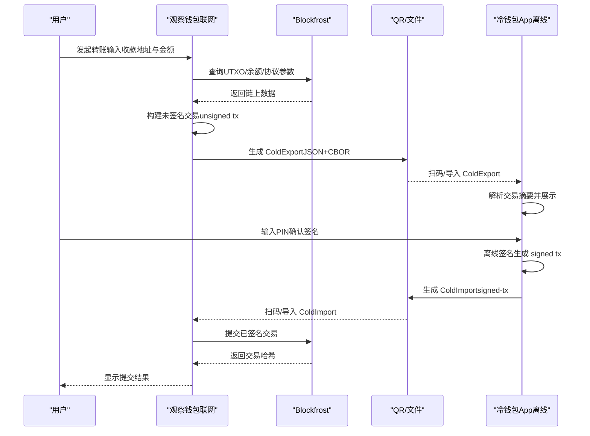
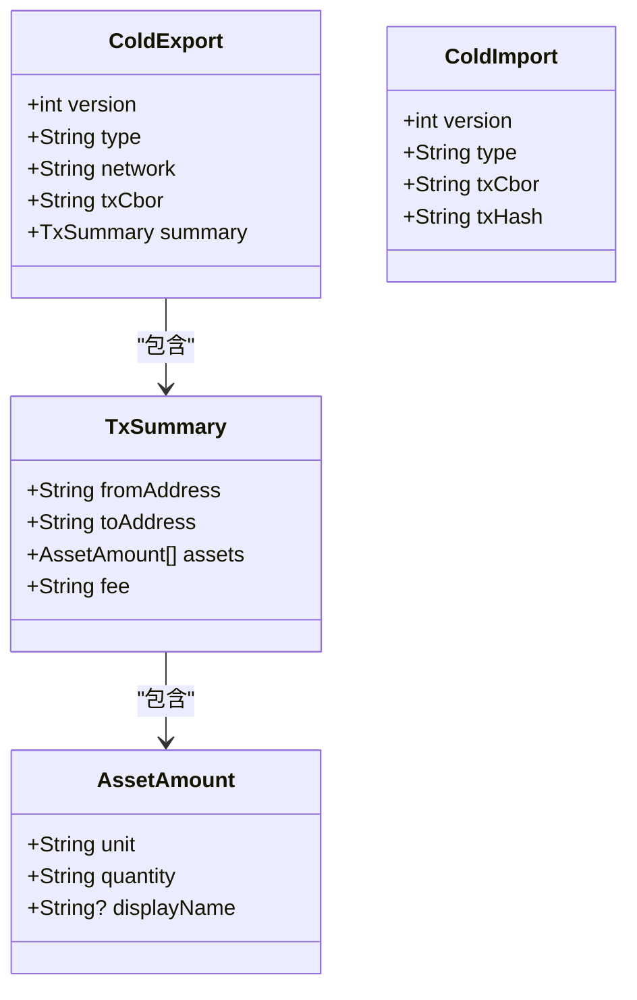
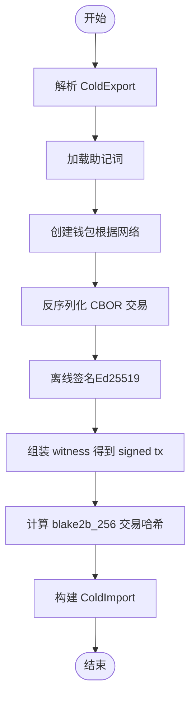
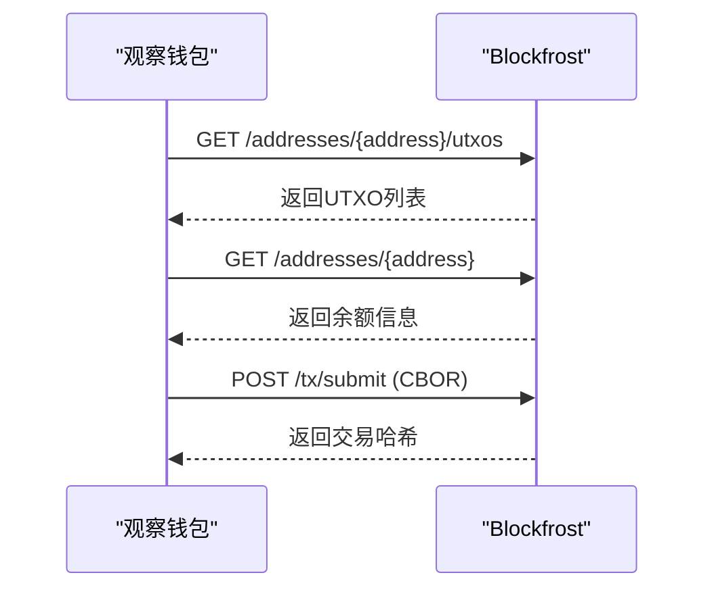
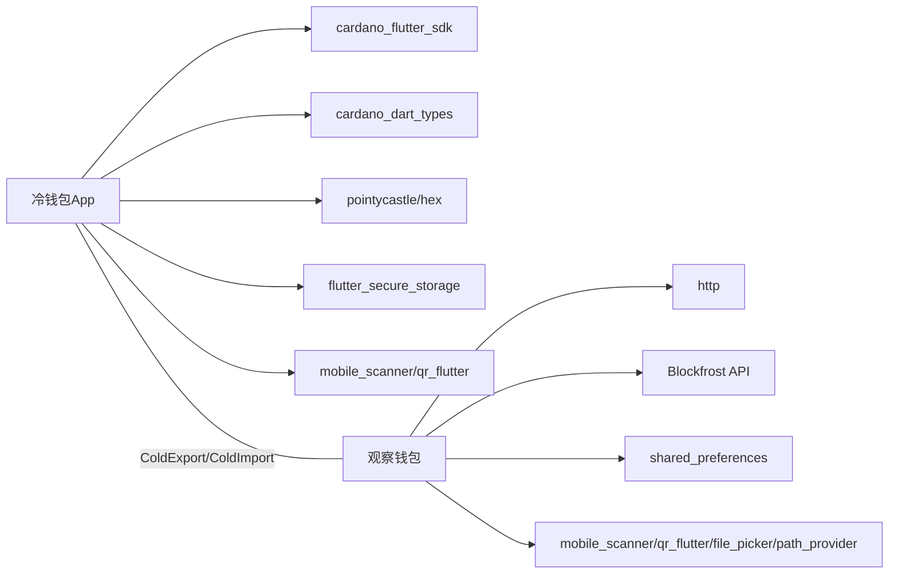

# 架构设计

<cite>
**本文引用的文件**
- [coldwallet-app/lib/main.dart](file://coldwallet-app/lib/main.dart)
- [coldwallet-watch/lib/main.dart](file://coldwallet-watch/lib/main.dart)
- [coldwallet-watch/lib/app.dart](file://coldwallet-watch/lib/app.dart)
- [coldwallet-app/lib/models/cold_export.dart](file://coldwallet-app/lib/models/cold_export.dart)
- [coldwallet-app/lib/models/cold_import.dart](file://coldwallet-app/lib/models/cold_import.dart)
- [coldwallet-watch/lib/models/cold_export.dart](file://coldwallet-watch/lib/models/cold_export.dart)
- [coldwallet-watch/lib/models/cold_import.dart](file://coldwallet-watch/lib/models/cold_import.dart)
- [coldwallet-app/lib/services/transaction_service.dart](file://coldwallet-app/lib/services/transaction_service.dart)
- [coldwallet-watch/lib/services/blockfrost_service.dart](file://coldwallet-watch/lib/services/blockfrost_service.dart)
- [docs/superpowers/specs/2026-08-10-cold-wallet-design.md](file://docs/superpowers/specs/2026-08-10-cold-wallet-design.md)
- [docs/superpowers/specs/2026-08-13-cold-wallet-watch-design.md](file://docs/superpowers/specs/2026-08-13-cold-wallet-watch-design.md)
- [cold-wallet-plugin.md](file://cold-wallet-plugin.md)
</cite>

## 目录
1. [引言](#引言)
2. [项目结构](#项目结构)
3. [核心组件](#核心组件)
4. [架构总览](#架构总览)
5. [详细组件分析](#详细组件分析)
6. [依赖关系分析](#依赖关系分析)
7. [性能考量](#性能考量)
8. [故障排查指南](#故障排查指南)
9. [结论](#结论)
10. [附录](#附录)

## 引言
本设计文档面向 ColdWallet 系统，阐述“冷钱包 App（离线签名端）”与“观察钱包（联网端）”的双端分离架构。重点说明：
- 职责边界：冷端负责私钥管理与离线签名；热端负责链上数据查询、交易构建与提交。
- 通信机制：通过 QR 码与 JSON/文件在两端传递 ColdExport/ColdImport 数据。
- 安全边界：私钥与助记词仅存在于冷端，且设备完全离线；热端不接触任何敏感密钥。
- 服务层与数据模型：明确交易构建、签名、网络交互的服务分层；统一的数据契约确保跨端兼容。
- 状态管理：以页面路由驱动的状态流转为主，结合本地存储与网络状态。
- 扩展性：为后续多资产、多地址、多网络、大交易分帧等能力预留接口。

## 项目结构
仓库包含两个 Flutter 应用与若干设计规格文档：
- coldwallet-app：离线签名端，提供助记词管理、二维码扫描、交易详情展示、PIN 验证与离线签名导出。
- coldwallet-watch：联网观察端，提供只读地址管理、余额查询、交易构建、QR/文件导出与签名导入提交。
- docs/superpowers/specs：冷钱包与观察端的设计规格，定义数据契约、流程与安全策略。
- cold-wallet-plugin.md：浏览器插件方案背景与整体流程图（用于理解端到端场景）。

```mermaid
graph TB
subgraph "冷钱包App离线"
A_main["入口 main.dart"]
A_models["数据模型<br/>ColdExport / ColdImport"]
A_services["服务层<br/>TransactionService"]
end
subgraph "观察钱包联网"
W_main["入口 main.dart"]
W_app["根组件 app.dart"]
W_models["数据模型<br/>ColdExport / ColdImport"]
W_services["服务层<br/>BlockfrostService"]
end
A_main --> A_models
A_main --> A_services
W_main --> W_app
W_app --> W_models
W_app --> W_services
A_models < --> W_models : "ColdExport / ColdImport 契约"
A_services -. QR/文件 .-> W_services
```

图表来源
- [coldwallet-app/lib/main.dart:1-51](file://coldwallet-app/lib/main.dart#L1-L51)
- [coldwallet-watch/lib/main.dart:1-12](file://coldwallet-watch/lib/main.dart#L1-L12)
- [coldwallet-watch/lib/app.dart:1-40](file://coldwallet-watch/lib/app.dart#L1-L40)
- [coldwallet-app/lib/models/cold_export.dart:1-109](file://coldwallet-app/lib/models/cold_export.dart#L1-L109)
- [coldwallet-app/lib/models/cold_import.dart:1-36](file://coldwallet-app/lib/models/cold_import.dart#L1-L36)
- [coldwallet-watch/lib/models/cold_export.dart:1-110](file://coldwallet-watch/lib/models/cold_export.dart#L1-L110)
- [coldwallet-watch/lib/models/cold_import.dart:1-36](file://coldwallet-watch/lib/models/cold_import.dart#L1-L36)

章节来源
- [coldwallet-app/lib/main.dart:1-51](file://coldwallet-app/lib/main.dart#L1-L51)
- [coldwallet-watch/lib/main.dart:1-12](file://coldwallet-watch/lib/main.dart#L1-L12)
- [coldwallet-watch/lib/app.dart:1-40](file://coldwallet-watch/lib/app.dart#L1-L40)

## 核心组件
- 冷钱包 App（离线签名端）
  - 入口与路由：MaterialApp 配置首页、钱包设置、扫码签名等路由。
  - 数据模型：ColdExport（未签名交易）、ColdImport（已签名交易）、TxSummary、AssetAmount。
  - 服务层：TransactionService 解析 ColdExport、使用 cardano_flutter_sdk 进行离线签名并生成 ColdImport。
- 观察钱包（联网端）
  - 入口与路由：MaterialApp 配置首页、添加钱包、发送、收款、导出交易、导入签名、设置等路由。
  - 数据模型：与冷端一致的 ColdExport/ColdImport 模型，保证跨端兼容。
  - 服务层：BlockfrostService 封装 Blockfrost API，提供 UTXO、余额、协议参数与交易提交。

章节来源
- [coldwallet-app/lib/models/cold_export.dart:1-109](file://coldwallet-app/lib/models/cold_export.dart#L1-L109)
- [coldwallet-app/lib/models/cold_import.dart:1-36](file://coldwallet-app/lib/models/cold_import.dart#L1-L36)
- [coldwallet-watch/lib/models/cold_export.dart:1-110](file://coldwallet-watch/lib/models/cold_export.dart#L1-L110)
- [coldwallet-watch/lib/models/cold_import.dart:1-36](file://coldwallet-watch/lib/models/cold_import.dart#L1-L36)
- [coldwallet-app/lib/services/transaction_service.dart:1-70](file://coldwallet-app/lib/services/transaction_service.dart#L1-L70)
- [coldwallet-watch/lib/services/blockfrost_service.dart:1-109](file://coldwallet-watch/lib/services/blockfrost_service.dart#L1-L109)

## 架构总览
双端通过统一的 JSON 包装 + CBOR 交易体的数据契约进行通信，QR 码与文件作为传输载体。冷端完全离线，不发起任何网络请求；热端负责链上数据与交易提交。



图表来源
- [coldwallet-watch/lib/services/blockfrost_service.dart:43-107](file://coldwallet-watch/lib/services/blockfrost_service.dart#L43-L107)
- [coldwallet-app/lib/services/transaction_service.dart:18-57](file://coldwallet-app/lib/services/transaction_service.dart#L18-L57)
- [docs/superpowers/specs/2026-08-10-cold-wallet-design.md:305-345](file://docs/superpowers/specs/2026-08-10-cold-wallet-design.md#L305-L345)
- [docs/superpowers/specs/2026-08-13-cold-wallet-watch-design.md:178-223](file://docs/superpowers/specs/2026-08-13-cold-wallet-watch-design.md#L178-L223)

## 详细组件分析

### 数据模型与契约（ColdExport / ColdImport）
- ColdExport（未签名交易）
  - 字段：version、type（"unsigned-tx"）、network、txCbor（未签名交易的 CBOR hex）、summary（fromAddress、toAddress、assets、fee）。
  - 用途：由观察端构建后导出给冷端进行离线签名。
- ColdImport（已签名交易）
  - 字段：version、type（"signed-tx"）、txCbor（已签名交易的 CBOR hex）、txHash（交易哈希）。
  - 用途：由冷端签名后导出给观察端提交到链上。
- 资产表示 AssetAmount
  - 字段：unit（lovelace 或 policyId.assetName hex）、quantity、displayName（可选）。



图表来源
- [coldwallet-app/lib/models/cold_export.dart:1-109](file://coldwallet-app/lib/models/cold_export.dart#L1-L109)
- [coldwallet-app/lib/models/cold_import.dart:1-36](file://coldwallet-app/lib/models/cold_import.dart#L1-L36)
- [coldwallet-watch/lib/models/cold_export.dart:1-110](file://coldwallet-watch/lib/models/cold_export.dart#L1-L110)
- [coldwallet-watch/lib/models/cold_import.dart:1-36](file://coldwallet-watch/lib/models/cold_import.dart#L1-L36)

章节来源
- [coldwallet-app/lib/models/cold_export.dart:1-109](file://coldwallet-app/lib/models/cold_export.dart#L1-L109)
- [coldwallet-app/lib/models/cold_import.dart:1-36](file://coldwallet-app/lib/models/cold_import.dart#L1-L36)
- [coldwallet-watch/lib/models/cold_export.dart:1-110](file://coldwallet-watch/lib/models/cold_export.dart#L1-L110)
- [coldwallet-watch/lib/models/cold_import.dart:1-36](file://coldwallet-watch/lib/models/cold_import.dart#L1-L36)

### 冷端签名服务（TransactionService）
- 解析 ColdExport：从 JSON 字符串反序列化为 ColdExport 对象。
- 离线签名：加载当前助记词，创建 Cardano 钱包，解析 CBOR 交易体，调用 SDK 签名并组装 witness，生成 signed tx。
- 计算交易哈希：对原始 txCbor 执行 blake2b_256，得到 txHash。
- 输出 ColdImport：包含 signed tx 的 CBOR 与 txHash。



图表来源
- [coldwallet-app/lib/services/transaction_service.dart:18-57](file://coldwallet-app/lib/services/transaction_service.dart#L18-L57)
- [coldwallet-app/lib/services/transaction_service.dart:59-68](file://coldwallet-app/lib/services/transaction_service.dart#L59-L68)

章节来源
- [coldwallet-app/lib/services/transaction_service.dart:1-70](file://coldwallet-app/lib/services/transaction_service.dart#L1-L70)

### 观察端网络服务（BlockfrostService）
- 网络端点：mainnet/preprod/preview 的基础 URL。
- 查询能力：获取地址 UTXO、地址余额、最新区块、协议参数。
- 交易提交：将已签名交易的 CBOR 字节数组提交至链上，返回交易哈希。



图表来源
- [coldwallet-watch/lib/services/blockfrost_service.dart:43-107](file://coldwallet-watch/lib/services/blockfrost_service.dart#L43-L107)

章节来源
- [coldwallet-watch/lib/services/blockfrost_service.dart:1-109](file://coldwallet-watch/lib/services/blockfrost_service.dart#L1-L109)

### 路由与状态管理
- 冷钱包 App：MaterialApp 配置首页、钱包设置、扫码签名等路由，状态由页面生命周期与本地存储驱动。
- 观察钱包：MaterialApp 配置首页、添加钱包、发送、收款、导出交易、导入签名、设置等路由，状态由页面与本地存储（SharedPreferences）驱动。

章节来源
- [coldwallet-app/lib/main.dart:24-48](file://coldwallet-app/lib/main.dart#L24-L48)
- [coldwallet-watch/lib/app.dart:19-37](file://coldwallet-watch/lib/app.dart#L19-L37)

## 依赖关系分析
- 冷端依赖：cardano_flutter_sdk（签名与地址派生）、cardano_dart_types（类型）、pointycastle（哈希）、hex（编解码）、flutter_secure_storage（安全存储）、mobile_scanner/qr_flutter（扫码与展示）。
- 观察端依赖：http（网络请求）、blockfrost（链上数据与提交）、shared_preferences（本地存储）、mobile_scanner/qr_flutter/file_picker/path_provider（QR/文件交互）。
- 跨端契约：ColdExport/ColdImport 作为唯一数据交换格式，确保两端兼容性。



图表来源
- [coldwallet-app/lib/services/transaction_service.dart:1-10](file://coldwallet-app/lib/services/transaction_service.dart#L1-L10)
- [coldwallet-watch/lib/services/blockfrost_service.dart:1-41](file://coldwallet-watch/lib/services/blockfrost_service.dart#L1-L41)
- [docs/superpowers/specs/2026-08-10-cold-wallet-design.md:283-297](file://docs/superpowers/specs/2026-08-10-cold-wallet-design.md#L283-L297)
- [docs/superpowers/specs/2026-08-13-cold-wallet-watch-design.md:227-242](file://docs/superpowers/specs/2026-08-13-cold-wallet-watch-design.md#L227-L242)

章节来源
- [docs/superpowers/specs/2026-08-10-cold-wallet-design.md:283-297](file://docs/superpowers/specs/2026-08-10-cold-wallet-design.md#L283-L297)
- [docs/superpowers/specs/2026-08-13-cold-wallet-watch-design.md:227-242](file://docs/superpowers/specs/2026-08-13-cold-wallet-watch-design.md#L227-L242)

## 性能考量
- 小交易优先：MVP 阶段简单转账 < 3KB，单 QR 码可承载 ColdExport/ColdImport，避免分帧复杂度。
- 网络请求优化：观察端缓存协议参数与最近 UTXO，减少重复请求；失败重试一次以提升鲁棒性。
- 内存与资源：冷端签名完成后清理私钥引用，依赖 Dart GC 回收；避免在 UI 层持有大量二进制数据。
- 用户体验：QR 生成与扫描需快速响应；文件导出/导入提供进度反馈与错误提示。

[本节为通用指导，无需特定文件来源]

## 故障排查指南
- 地址格式错误：实时校验地址格式，提示“地址格式不正确”。
- 网络不匹配：提示当前网络与地址网络不一致。
- 余额不足：构建前检查余额，提示“余额不足”。
- Blockfrost 请求失败：重试一次，提示网络或 API Key 错误。
- 收款地址与发送地址相同：拦截并提示不能转账给自己。
- QR 扫描失败：提示“无法识别，请重试或改用文件”。
- 导入签名文件解析失败：提示“签名文件格式错误”。
- 提交交易失败：显示 Blockfrost 返回的错误信息。

章节来源
- [docs/superpowers/specs/2026-08-13-cold-wallet-watch-design.md:260-272](file://docs/superpowers/specs/2026-08-13-cold-wallet-watch-design.md#L260-L272)

## 结论
ColdWallet 采用清晰的双端分离架构：冷端专注私钥与离线签名，热端专注链上数据与交易提交。通过统一的 ColdExport/ColdImport 数据契约与 QR/文件传输，实现安全、可靠、可扩展的冷签名闭环。该设计在保证安全边界的同时，具备良好的可维护性与扩展性，便于后续引入多资产、多地址、大交易分帧等能力。

[本节为总结，无需特定文件来源]

## 附录
- 技术决策与安全考虑
  - 冷端完全离线，不引入 HTTP 库，私钥与助记词仅存储在 Android Keystore。
  - 热端不存储、不输入、不处理任何私钥或助记词，仅使用只读地址。
  - 数据交换仅包含 CBOR 交易体，不含敏感信息。
- 扩展性设计
  - 支持多资产（ADA/原生代币/NFT）与多地址管理。
  - 支持多网络（Mainnet/Preview/Preprod）切换。
  - 为大交易预留 Animated QR 分帧与文件传输方案。

章节来源
- [docs/superpowers/specs/2026-08-10-cold-wallet-design.md:269-281](file://docs/superpowers/specs/2026-08-10-cold-wallet-design.md#L269-L281)
- [docs/superpowers/specs/2026-08-13-cold-wallet-watch-design.md:246-257](file://docs/superpowers/specs/2026-08-13-cold-wallet-watch-design.md#L246-L257)
- [cold-wallet-plugin.md:127-150](file://cold-wallet-plugin.md#L127-L150)