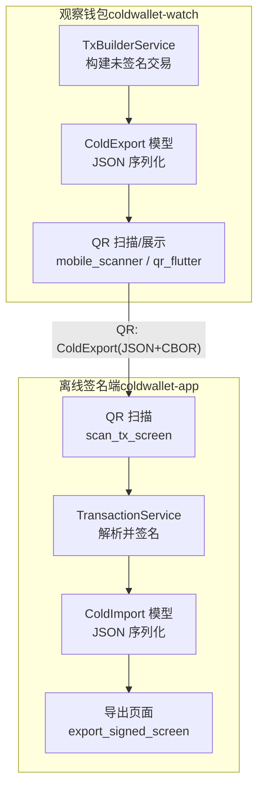
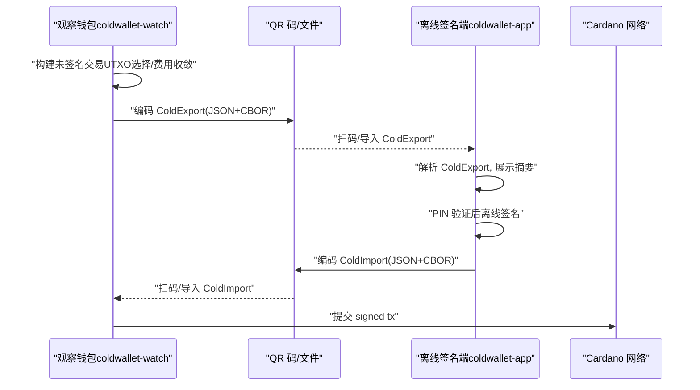
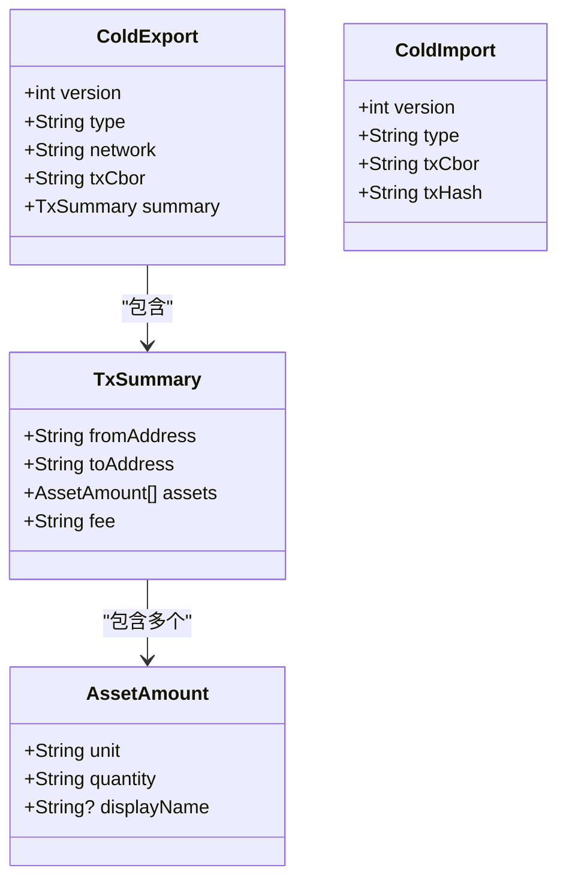
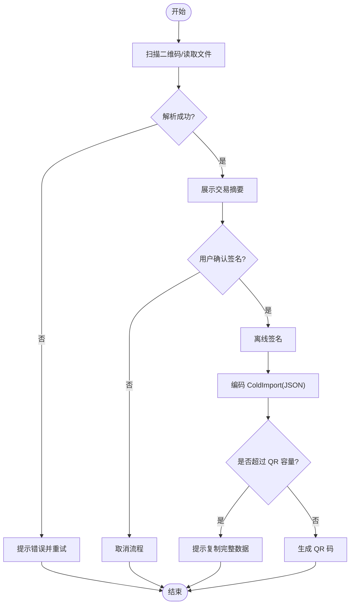
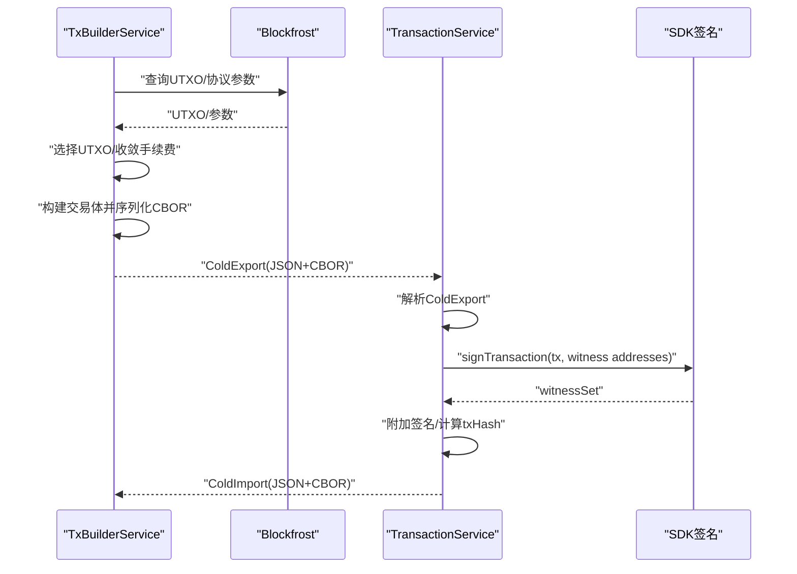
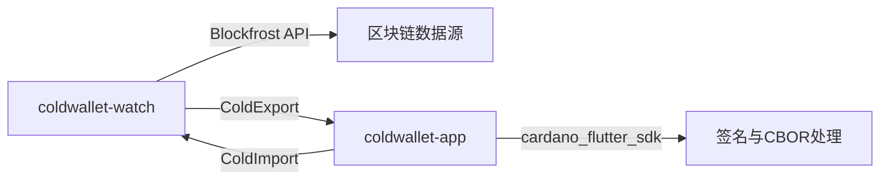

# 通信协议设计

<cite>
**本文引用的文件**
- [cold-wallet-plugin.md](file://cold-wallet-plugin.md)
- [2026-08-10-cold-wallet-design.md](file://docs/superpowers/specs/2026-08-10-cold-wallet-design.md)
- [cold_export.dart（watch）](file://coldwallet-watch/lib/models/cold_export.dart)
- [cold_import.dart（app）](file://coldwallet-app/lib/models/cold_import.dart)
- [tx_builder_service.dart（watch）](file://coldwallet-watch/lib/services/tx_builder_service.dart)
- [transaction_service.dart（app）](file://coldwallet-app/lib/services/transaction_service.dart)
- [qr_scanner.dart（watch）](file://coldwallet-watch/lib/widgets/qr_scanner.dart)
- [scan_tx_screen.dart（app）](file://coldwallet-app/lib/screens/scan_tx_screen.dart)
- [export_signed_screen.dart（app）](file://coldwallet-app/lib/screens/export_signed_screen.dart)
</cite>

## 目录
1. [简介](#简介)
2. [项目结构](#项目结构)
3. [核心组件](#核心组件)
4. [架构总览](#架构总览)
5. [详细组件分析](#详细组件分析)
6. [依赖关系分析](#依赖关系分析)
7. [性能与容量优化](#性能与容量优化)
8. [故障排查指南](#故障排查指南)
9. [结论](#结论)
10. [附录：数据示例与集成要点](#附录数据示例与集成要点)

## 简介
本文件面向 ColdWallet 的“冷签名”通信协议，聚焦于 QR 码传输机制与 JSON+CBOR 混合数据格式。协议包含两条方向的数据流：
- ColdExport：未签名交易从观察钱包（联网端）导出到冷钱包（离线设备），用于离线签名。
- ColdImport：已签名交易从冷钱包返回观察钱包，供其提交到链上。

协议采用“外层 JSON + 内层 CBOR hex”的混合格式：JSON 承载元数据（版本、类型、网络、摘要等），CBOR hex 承载 Cardano 交易体或签名后交易体。QR 码作为主要传输通道，辅以文件导入/导出能力。

## 项目结构
仓库包含两个 Flutter 应用与一份协议设计文档：
- coldwallet-watch：观察钱包（联网端），负责构建未签名交易并生成 ColdExport。
- coldwallet-app：离线签名端（手机 App），负责解析 ColdExport、离线签名、输出 ColdImport。
- docs/superpowers/specs：协议与架构规格说明。

图表来源
- [tx_builder_service.dart（watch）:1-152](file://coldwallet-watch/lib/services/tx_builder_service.dart#L1-L152)
- [cold_export.dart（watch）:1-110](file://coldwallet-watch/lib/models/cold_export.dart#L1-L110)
- [qr_scanner.dart（watch）:1-25](file://coldwallet-watch/lib/widgets/qr_scanner.dart#L1-L25)
- [scan_tx_screen.dart（app）:43-87](file://coldwallet-app/lib/screens/scan_tx_screen.dart#L43-L87)
- [transaction_service.dart（app）:1-70](file://coldwallet-app/lib/services/transaction_service.dart#L1-L70)
- [cold_import.dart（app）:1-36](file://coldwallet-app/lib/models/cold_import.dart#L1-L36)
- [export_signed_screen.dart（app）:1-139](file://coldwallet-app/lib/screens/export_signed_screen.dart#L1-L139)

章节来源
- [2026-08-10-cold-wallet-design.md:32-73](file://docs/superpowers/specs/2026-08-10-cold-wallet-design.md#L32-L73)
- [cold-wallet-plugin.md:22-80](file://cold-wallet-plugin.md#L22-L80)

## 核心组件
- ColdExport（未签名交易导出）
  - 字段：version、type、network、txCbor、summary（fromAddress、toAddress、assets、fee）。
  - 用途：将未签名交易以 JSON 形式携带 CBOR hex 和可读摘要，便于在冷端展示与确认。
- ColdImport（已签名交易导入）
  - 字段：version、type、txCbor、txHash。
  - 用途：将已签名交易及哈希回传至观察钱包，以便提交到链上。
- TxBuilderService（观察端）
  - 职责：查询 UTXO、估算/收敛手续费、构造 Cardano 交易体、序列化为 CBOR hex，并封装为 ColdExport。
- TransactionService（离线端）
  - 职责：解析 ColdExport、使用本地私钥对交易进行签名、计算交易哈希、封装为 ColdImport。
- QR 扫描/展示
  - 观察端：通过 mobile_scanner 扫描二维码，得到原始字符串并解析为 ColdExport。
  - 离线端：通过 qr_flutter 生成二维码；若数据过大则提示复制文本方式传输。

章节来源
- [cold_export.dart（watch）:1-110](file://coldwallet-watch/lib/models/cold_export.dart#L1-L110)
- [cold_import.dart（app）:1-36](file://coldwallet-app/lib/models/cold_import.dart#L1-L36)
- [tx_builder_service.dart（watch）:1-152](file://coldwallet-watch/lib/services/tx_builder_service.dart#L1-L152)
- [transaction_service.dart（app）:1-70](file://coldwallet-app/lib/services/transaction_service.dart#L1-L70)
- [qr_scanner.dart（watch）:1-25](file://coldwallet-watch/lib/widgets/qr_scanner.dart#L1-L25)
- [scan_tx_screen.dart（app）:43-87](file://coldwallet-app/lib/screens/scan_tx_screen.dart#L43-L87)
- [export_signed_screen.dart（app）:1-139](file://coldwallet-app/lib/screens/export_signed_screen.dart#L1-L139)

## 架构总览
整体流程遵循“观察端构建 → 冷端签名 → 观察端提交”的三段式路径，数据通过 QR 码或文件在设备间传递。

图表来源
- [tx_builder_service.dart（watch）:1-152](file://coldwallet-watch/lib/services/tx_builder_service.dart#L1-L152)
- [transaction_service.dart（app）:1-70](file://coldwallet-app/lib/services/transaction_service.dart#L1-L70)
- [cold_export.dart（watch）:1-110](file://coldwallet-watch/lib/models/cold_export.dart#L1-L110)
- [cold_import.dart（app）:1-36](file://coldwallet-app/lib/models/cold_import.dart#L1-L36)
- [export_signed_screen.dart（app）:1-139](file://coldwallet-app/lib/screens/export_signed_screen.dart#L1-L139)

## 详细组件分析

### 数据模型与字段定义
- ColdExport（未签名交易）
  - version：协议版本号（当前实现为 1）。
  - type：消息类型（unsigned-tx）。
  - network：网络标识（如 preview/mainnet）。
  - txCbor：未签名交易的 CBOR hex。
  - summary：人类可读的交易摘要，包含 fromAddress、toAddress、assets（unit、quantity、displayName）、fee。
- ColdImport（已签名交易）
  - version：协议版本号（当前实现为 1）。
  - type：消息类型（signed-tx）。
  - txCbor：已签名交易的 CBOR hex。
  - txHash：交易哈希（blake2b_256）。

图表来源
- [cold_export.dart（watch）:1-110](file://coldwallet-watch/lib/models/cold_export.dart#L1-L110)
- [cold_import.dart（app）:1-36](file://coldwallet-app/lib/models/cold_import.dart#L1-L36)

章节来源
- [cold_export.dart（watch）:1-110](file://coldwallet-watch/lib/models/cold_export.dart#L1-L110)
- [cold_import.dart（app）:1-36](file://coldwallet-app/lib/models/cold_import.dart#L1-L36)
- [2026-08-10-cold-wallet-design.md:299-350](file://docs/superpowers/specs/2026-08-10-cold-wallet-design.md#L299-L350)

### 编码规则与 JSON+CBOR 混合格式
- 外层 JSON：承载 version、type、network、summary 等元信息，便于跨端解析与展示。
- 内层 CBOR hex：承载 Cardano 交易体（未签名/已签名），保证与链上格式一致且可被 SDK 直接反序列化。
- 编码流程：
  - 观察端：构建交易 → 序列化为 CBOR hex → 组装 ColdExport → JSON.stringify → QR/文件。
  - 离线端：扫描/读取 → JSON.parse → 解析 ColdExport → 展示摘要 → 签名 → 组装 ColdImport → JSON.stringify → QR/文件。
  - 观察端：扫描/读取 → JSON.parse → 解析 ColdImport → 提交交易。

章节来源
- [2026-08-10-cold-wallet-design.md:299-350](file://docs/superpowers/specs/2026-08-10-cold-wallet-design.md#L299-L350)
- [tx_builder_service.dart（watch）:100-118](file://coldwallet-watch/lib/services/tx_builder_service.dart#L100-L118)
- [transaction_service.dart（app）:30-57](file://coldwallet-app/lib/services/transaction_service.dart#L30-L57)

### QR 码生成与扫描的技术实现
- 扫描（观察端）：使用 mobile_scanner 捕获条形码，回调中获取 rawValue 并解析为 ColdExport。
- 生成（离线端）：使用 qr_flutter 将 ColdImport JSON 编码为 QR；当 payload 超过 QR 容量时，提示改用复制文本方式传输。
- 容量策略：MVP 阶段假设单笔转账 < 3KB，单张 QR 即可承载；超出容量时走复制/文件通道。

图表来源
- [qr_scanner.dart（watch）:1-25](file://coldwallet-watch/lib/widgets/qr_scanner.dart#L1-L25)
- [scan_tx_screen.dart（app）:43-87](file://coldwallet-app/lib/screens/scan_tx_screen.dart#L43-L87)
- [export_signed_screen.dart（app）:1-139](file://coldwallet-app/lib/screens/export_signed_screen.dart#L1-L139)

章节来源
- [qr_scanner.dart（watch）:1-25](file://coldwallet-watch/lib/widgets/qr_scanner.dart#L1-L25)
- [scan_tx_screen.dart（app）:43-87](file://coldwallet-app/lib/screens/scan_tx_screen.dart#L43-L87)
- [export_signed_screen.dart（app）:1-139](file://coldwallet-app/lib/screens/export_signed_screen.dart#L1-L139)

### 数据处理与签名流程
- 观察端 TxBuilderService：
  - 查询 UTXO、最新区块槽位、协议参数。
  - 选择输入、估算并收敛手续费，构造交易体并序列化为 CBOR hex。
  - 封装 ColdExport（含网络、摘要）。
- 离线端 TransactionService：
  - 解析 ColdExport，加载助记词并派生钱包。
  - 反序列化 CBOR 交易体，调用 SDK 签名，附加见证集。
  - 计算 blake2b_256 交易哈希，封装 ColdImport。

图表来源
- [tx_builder_service.dart（watch）:1-152](file://coldwallet-watch/lib/services/tx_builder_service.dart#L1-L152)
- [transaction_service.dart（app）:1-70](file://coldwallet-app/lib/services/transaction_service.dart#L1-L70)

章节来源
- [tx_builder_service.dart（watch）:1-152](file://coldwallet-watch/lib/services/tx_builder_service.dart#L1-L152)
- [transaction_service.dart（app）:1-70](file://coldwallet-app/lib/services/transaction_service.dart#L1-L70)

### 安全性考虑
- 私钥/助记词仅存在于离线设备，不进入联网端。
- 观察端只处理公钥地址与公开数据。
- 离线端使用 Android Keystore 安全存储，签名前需 PIN 验证。
- 传输数据不含私钥，仅包含交易体与哈希。

章节来源
- [cold-wallet-plugin.md:127-150](file://cold-wallet-plugin.md#L127-L150)
- [2026-08-10-cold-wallet-design.md:269-282](file://docs/superpowers/specs/2026-08-10-cold-wallet-design.md#L269-L282)

## 依赖关系分析
- 观察端依赖 Blockfrost 获取 UTXO、协议参数与最新区块。
- 离线端依赖 cardano_flutter_sdk 完成地址派生与交易签名。
- 两端通过 ColdExport/ColdImport 的 JSON 契约解耦，互不直接依赖对方实现。

图表来源
- [tx_builder_service.dart（watch）:1-152](file://coldwallet-watch/lib/services/tx_builder_service.dart#L1-L152)
- [transaction_service.dart（app）:1-70](file://coldwallet-app/lib/services/transaction_service.dart#L1-L70)

章节来源
- [tx_builder_service.dart（watch）:1-152](file://coldwallet-watch/lib/services/tx_builder_service.dart#L1-L152)
- [transaction_service.dart（app）:1-70](file://coldwallet-app/lib/services/transaction_service.dart#L1-L70)

## 性能与容量优化
- 单 QR 容量限制：MVP 阶段默认单笔转账 < 3KB，单张 QR 可承载；超出容量时自动提示复制文本。
- 费用收敛：观察端迭代计算手续费直至稳定，减少重复交互。
- 最小化载荷：ColdExport.summary 仅包含必要的人类可读字段，避免冗余。
- 后续扩展：大交易可采用 Animated QR 分帧或文件传输（MVP 外）。

章节来源
- [export_signed_screen.dart（app）:20-24](file://coldwallet-app/lib/screens/export_signed_screen.dart#L20-L24)
- [tx_builder_service.dart（watch）:73-118](file://coldwallet-watch/lib/services/tx_builder_service.dart#L73-L118)
- [2026-08-10-cold-wallet-design.md:347-350](file://docs/superpowers/specs/2026-08-10-cold-wallet-design.md#L347-L350)

## 故障排查指南
- 解析失败
  - 现象：无法解析二维码或导入文件。
  - 原因：JSON 无效、版本不匹配、类型不符或缺少必填字段。
  - 处理：检查 QR 内容是否为有效 JSON；确认 version/type 符合预期；确保 txCbor 存在且为字符串。
- 余额不足
  - 现象：观察端构建交易时报错。
  - 原因：UTXO 不足以覆盖金额、手续费与最小 UTxO 值。
  - 处理：增加输入 UTXO 或调整金额/手续费。
- QR 容量超限
  - 现象：无法生成 QR 或提示数据过大。
  - 原因：payload 超过 QR 二进制容量上限。
  - 处理：改用复制完整数据或文件分享方式传输。
- 签名失败
  - 现象：离线端签名异常。
  - 原因：助记词丢失、钱包未初始化、交易体不可反序列化。
  - 处理：重新导入助记词；校验 ColdExport.txCbor 有效性；重试签名。

章节来源
- [scan_tx_screen.dart（app）:43-87](file://coldwallet-app/lib/screens/scan_tx_screen.dart#L43-L87)
- [tx_builder_service.dart（watch）:18-26](file://coldwallet-watch/lib/services/tx_builder_service.dart#L18-L26)
- [export_signed_screen.dart（app）:20-24](file://coldwallet-app/lib/screens/export_signed_screen.dart#L20-L24)
- [transaction_service.dart（app）:30-39](file://coldwallet-app/lib/services/transaction_service.dart#L30-L39)

## 结论
本通信协议通过 ColdExport/ColdImport 将“未签名/已签名交易”与“可读摘要”解耦，结合 QR 码与文件通道，实现了安全的冷签名流程。JSON 提供跨端一致的元数据描述，CBOR hex 保证与链上格式一致。MVP 阶段聚焦 ADA 转账，具备可扩展性以支持更多资产与复杂交易。

## 附录：数据示例与集成要点
- ColdExport 示例结构（字段说明）
  - version: 1
  - type: "unsigned-tx"
  - network: "preview"
  - txCbor: "未签名交易的 CBOR hex"
  - summary:
    - fromAddress: "发送方地址"
    - toAddress: "接收方地址"
    - assets: [{"unit":"lovelace","quantity":"2000000","displayName":"ADA"}]
    - fee: "170000"
- ColdImport 示例结构（字段说明）
  - version: 1
  - type: "signed-tx"
  - txCbor: "已签名交易的 CBOR hex"
  - txHash: "交易哈希（blake2b_256）"

集成要点
- 观察端
  - 使用 TxBuilderService 构建交易并输出 ColdExport。
  - 通过 QR 或文件将 ColdExport 传递给离线端。
- 离线端
  - 扫描/导入 ColdExport，展示摘要并请求 PIN 验证。
  - 使用 TransactionService 签名并输出 ColdImport。
  - 若 QR 容量不足，提供复制完整数据选项。
- 观察端
  - 扫描/导入 ColdImport，提取 txCbor 并提交到链上。

章节来源
- [cold_export.dart（watch）:1-110](file://coldwallet-watch/lib/models/cold_export.dart#L1-L110)
- [cold_import.dart（app）:1-36](file://coldwallet-app/lib/models/cold_import.dart#L1-L36)
- [tx_builder_service.dart（watch）:1-152](file://coldwallet-watch/lib/services/tx_builder_service.dart#L1-L152)
- [transaction_service.dart（app）:1-70](file://coldwallet-app/lib/services/transaction_service.dart#L1-L70)
- [export_signed_screen.dart（app）:1-139](file://coldwallet-app/lib/screens/export_signed_screen.dart#L1-L139)
- [2026-08-10-cold-wallet-design.md:299-350](file://docs/superpowers/specs/2026-08-10-cold-wallet-design.md#L299-L350)