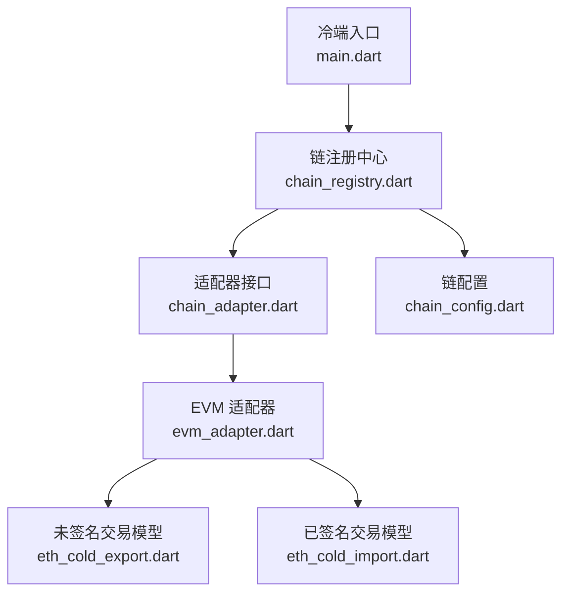
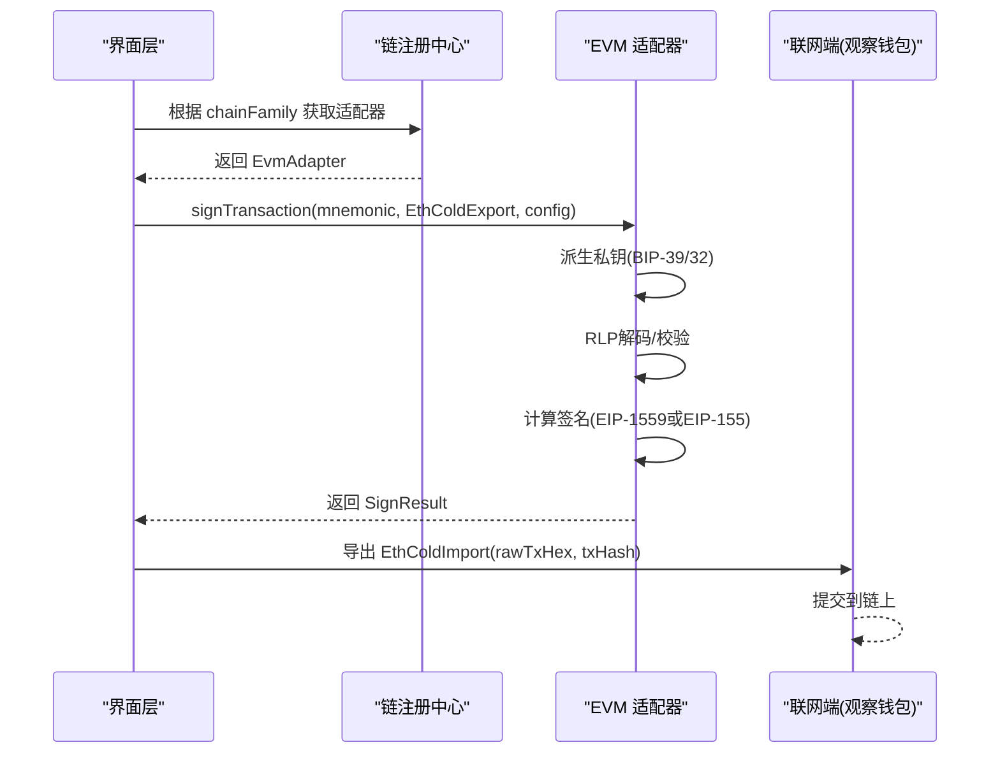
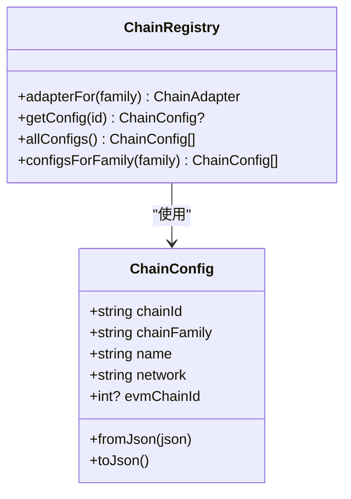
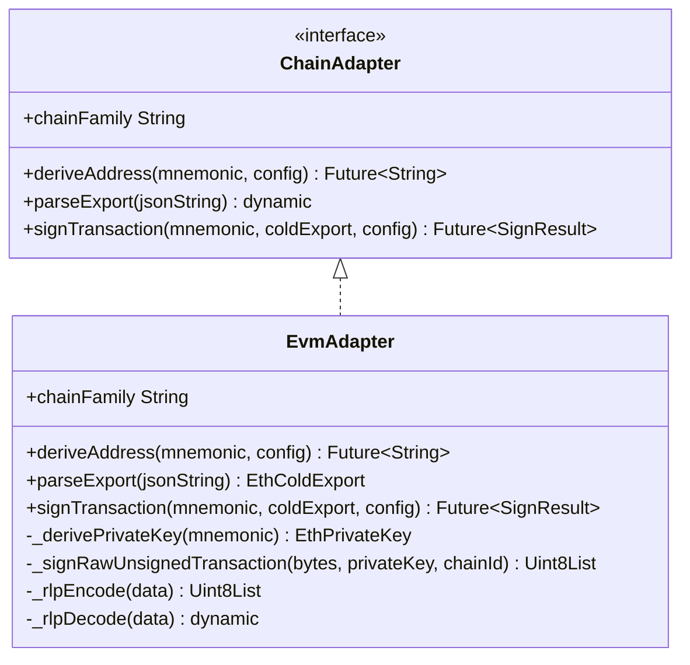
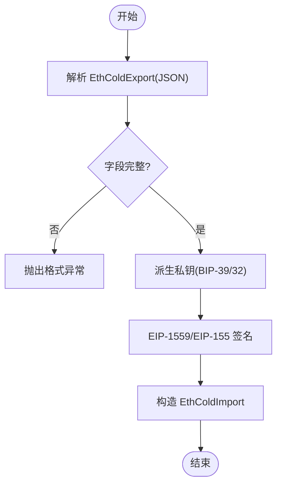
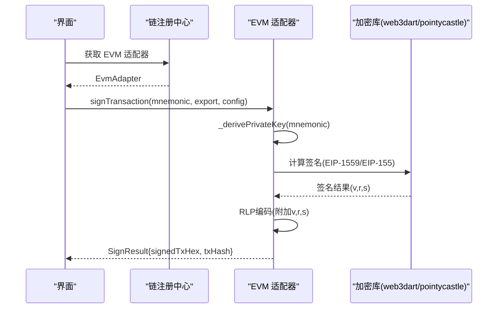
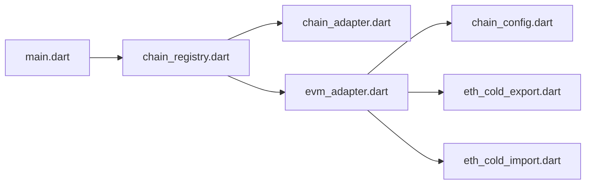

# EVM链支持

<cite>
**本文引用的文件**
- [coldwallet-app/lib/main.dart](file://coldwallet-app/lib/main.dart)
- [coldwallet-app/lib/services/chain_registry.dart](file://coldwallet-app/lib/services/chain_registry.dart)
- [coldwallet-app/lib/services/adapters/chain_adapter.dart](file://coldwallet-app/lib/services/adapters/chain_adapter.dart)
- [coldwallet-app/lib/services/adapters/evm_adapter.dart](file://coldwallet-app/lib/services/adapters/evm_adapter.dart)
- [coldwallet-app/lib/models/chain_config.dart](file://coldwallet-app/lib/models/chain_config.dart)
- [coldwallet-app/lib/models/eth_cold_export.dart](file://coldwallet-app/lib/models/eth_cold_export.dart)
- [coldwallet-app/lib/models/eth_cold_import.dart](file://coldwallet-app/lib/models/eth_cold_import.dart)
- [coldwallet-app/test/services/adapters/evm_adapter_test.dart](file://coldwallet-app/test/services/adapters/evm_adapter_test.dart)
- [coldwallet-app/pubspec.yaml](file://coldwallet-app/pubspec.yaml)
</cite>

## 目录
1. [简介](#简介)
2. [项目结构](#项目结构)
3. [核心组件](#核心组件)
4. [架构总览](#架构总览)
5. [详细组件分析](#详细组件分析)
6. [依赖关系分析](#依赖关系分析)
7. [性能考虑](#性能考虑)
8. [故障排查指南](#故障排查指南)
9. [结论](#结论)
10. [附录](#附录)

## 简介
本仓库为多链冷钱包应用，采用“离线冷端 + 联网观察端”的交互模式。冷端负责助记词管理、地址派生与离线签名；联网端负责余额查询、交易构建与广播。EVM 链支持通过统一的适配器抽象实现，覆盖以太坊及其兼容链（如 BSC、Arbitrum、Polygon、Base 等），以 ChainConfig.evmChainId 区分具体网络，并支持 EIP-1559 与回退的 EIP-155 交易签名。

## 项目结构
- 冷端应用入口定义路由与主题，声明支持 Cardano 与 EVM 兼容链。
- 链注册中心集中维护支持的链配置，并提供按链族获取适配器的能力。
- 适配器接口统一了地址派生、交易解析与签名流程；EVM 适配器实现 secp256k1 密钥派生与 RLP/EIP-155/EIP-1559 签名。
- 数据模型定义了冷端与联网端之间的未签名/已签名交易导出导入格式。

**图示来源**
- [coldwallet-app/lib/main.dart:1-52](file://coldwallet-app/lib/main.dart#L1-L52)
- [coldwallet-app/lib/services/chain_registry.dart:1-79](file://coldwallet-app/lib/services/chain_registry.dart#L1-L79)
- [coldwallet-app/lib/services/adapters/chain_adapter.dart:1-37](file://coldwallet-app/lib/services/adapters/chain_adapter.dart#L1-L37)
- [coldwallet-app/lib/services/adapters/evm_adapter.dart:1-369](file://coldwallet-app/lib/services/adapters/evm_adapter.dart#L1-L369)
- [coldwallet-app/lib/models/chain_config.dart:1-49](file://coldwallet-app/lib/models/chain_config.dart#L1-L49)
- [coldwallet-app/lib/models/eth_cold_export.dart:1-79](file://coldwallet-app/lib/models/eth_cold_export.dart#L1-L79)
- [coldwallet-app/lib/models/eth_cold_import.dart:1-48](file://coldwallet-app/lib/models/eth_cold_import.dart#L1-L48)

**章节来源**
- [coldwallet-app/lib/main.dart:1-52](file://coldwallet-app/lib/main.dart#L1-L52)
- [coldwallet-app/lib/services/chain_registry.dart:1-79](file://coldwallet-app/lib/services/chain_registry.dart#L1-L79)

## 核心组件
- 链配置：描述链族、显示名、网络标识以及 EVM 专用 chainId。
- 链注册中心：集中管理所有支持的链配置，并按链族返回对应适配器实例。
- 适配器接口：统一封装 deriveAddress、parseExport、signTransaction。
- EVM 适配器：实现 BIP-39/BIP-32 派生路径 m/44'/60'/0'/0/0、secp256k1 私钥生成、RLP 编解码、EIP-1559/EIP-155 签名。
- 交易模型：定义冷端与联网端之间传递的未签名/已签名交易 JSON 结构与摘要信息。

**章节来源**
- [coldwallet-app/lib/models/chain_config.dart:1-49](file://coldwallet-app/lib/models/chain_config.dart#L1-L49)
- [coldwallet-app/lib/services/chain_registry.dart:1-79](file://coldwallet-app/lib/services/chain_registry.dart#L1-L79)
- [coldwallet-app/lib/services/adapters/chain_adapter.dart:1-37](file://coldwallet-app/lib/services/adapters/chain_adapter.dart#L1-L37)
- [coldwallet-app/lib/services/adapters/evm_adapter.dart:1-369](file://coldwallet-app/lib/services/adapters/evm_adapter.dart#L1-L369)
- [coldwallet-app/lib/models/eth_cold_export.dart:1-79](file://coldwallet-app/lib/models/eth_cold_export.dart#L1-L79)
- [coldwallet-app/lib/models/eth_cold_import.dart:1-48](file://coldwallet-app/lib/models/eth_cold_import.dart#L1-L48)

## 架构总览
EVM 链支持围绕“适配器模式”组织：上层通过链注册中心按链族获取适配器，调用统一的签名接口；EVM 适配器内部完成私钥派生、RLP 编解码与 EIP-1559/EIP-155 签名，输出标准 SignResult 供后续导出为 EthColdImport。

**图示来源**
- [coldwallet-app/lib/services/chain_registry.dart:57-67](file://coldwallet-app/lib/services/chain_registry.dart#L57-L67)
- [coldwallet-app/lib/services/adapters/evm_adapter.dart:42-66](file://coldwallet-app/lib/services/adapters/evm_adapter.dart#L42-L66)
- [coldwallet-app/lib/models/eth_cold_import.dart:38-46](file://coldwallet-app/lib/models/eth_cold_import.dart#L38-L46)

## 详细组件分析

### 链配置与注册中心
- ChainConfig 提供链族、名称、网络与 EVM chainId 的统一描述，支持 JSON 序列化。
- ChainRegistry 集中维护链配置表，并通过 adapterFor 按链族返回适配器实例；新增 EVM 链仅需在配置表中添加一行。

**图示来源**
- [coldwallet-app/lib/models/chain_config.dart:1-49](file://coldwallet-app/lib/models/chain_config.dart#L1-L49)
- [coldwallet-app/lib/services/chain_registry.dart:1-79](file://coldwallet-app/lib/services/chain_registry.dart#L1-L79)

**章节来源**
- [coldwallet-app/lib/models/chain_config.dart:1-49](file://coldwallet-app/lib/models/chain_config.dart#L1-L49)
- [coldwallet-app/lib/services/chain_registry.dart:1-79](file://coldwallet-app/lib/services/chain_registry.dart#L1-L79)

### 适配器接口与 EVM 适配器
- ChainAdapter 抽象出 deriveAddress、parseExport、signTransaction 三个关键方法，屏蔽链差异。
- EvmAdapter 实现：
  - 地址派生：基于 BIP-39 seed 与 BIP-32 路径 m/44'/60'/0'/0/0 派生 secp256k1 私钥并生成地址。
  - 交易解析：将联网端传入的未签名交易 JSON 解析为 EthColdExport。
  - 交易签名：对原始 RLP 负载进行 EIP-1559 或 EIP-155 签名，输出 signedTxHex 与 txHash。
  - RLP 编解码：内置轻量 RLP 编码器/解码器，确保与 EVM 协议一致。

**图示来源**
- [coldwallet-app/lib/services/adapters/chain_adapter.dart:1-37](file://coldwallet-app/lib/services/adapters/chain_adapter.dart#L1-L37)
- [coldwallet-app/lib/services/adapters/evm_adapter.dart:15-66](file://coldwallet-app/lib/services/adapters/evm_adapter.dart#L15-L66)
- [coldwallet-app/lib/services/adapters/evm_adapter.dart:119-190](file://coldwallet-app/lib/services/adapters/evm_adapter.dart#L119-L190)
- [coldwallet-app/lib/services/adapters/evm_adapter.dart:240-360](file://coldwallet-app/lib/services/adapters/evm_adapter.dart#L240-L360)

**章节来源**
- [coldwallet-app/lib/services/adapters/chain_adapter.dart:1-37](file://coldwallet-app/lib/services/adapters/chain_adapter.dart#L1-L37)
- [coldwallet-app/lib/services/adapters/evm_adapter.dart:15-66](file://coldwallet-app/lib/services/adapters/evm_adapter.dart#L15-L66)
- [coldwallet-app/lib/services/adapters/evm_adapter.dart:68-117](file://coldwallet-app/lib/services/adapters/evm_adapter.dart#L68-L117)
- [coldwallet-app/lib/services/adapters/evm_adapter.dart:119-190](file://coldwallet-app/lib/services/adapters/evm_adapter.dart#L119-L190)
- [coldwallet-app/lib/services/adapters/evm_adapter.dart:240-360](file://coldwallet-app/lib/services/adapters/evm_adapter.dart#L240-L360)

### 交易导出/导入模型
- EthColdExport：包含 version、type、chainId、rawTxHex 与 EvmTxSummary（from/to/value/fee/nonce），用于从联网端向冷端传递未签名交易。
- EthColdImport：包含 version、type、rawTxHex、txHash，由 SignResult 构造后供联网端直接提交。

**图示来源**
- [coldwallet-app/lib/models/eth_cold_export.dart:1-79](file://coldwallet-app/lib/models/eth_cold_export.dart#L1-L79)
- [coldwallet-app/lib/models/eth_cold_import.dart:1-48](file://coldwallet-app/lib/models/eth_cold_import.dart#L1-L48)
- [coldwallet-app/lib/services/adapters/evm_adapter.dart:42-66](file://coldwallet-app/lib/services/adapters/evm_adapter.dart#L42-L66)

**章节来源**
- [coldwallet-app/lib/models/eth_cold_export.dart:1-79](file://coldwallet-app/lib/models/eth_cold_export.dart#L1-L79)
- [coldwallet-app/lib/models/eth_cold_import.dart:1-48](file://coldwallet-app/lib/models/eth_cold_import.dart#L1-L48)

### 签名流程时序

**图示来源**
- [coldwallet-app/lib/services/chain_registry.dart:57-67](file://coldwallet-app/lib/services/chain_registry.dart#L57-L67)
- [coldwallet-app/lib/services/adapters/evm_adapter.dart:42-66](file://coldwallet-app/lib/services/adapters/evm_adapter.dart#L42-L66)
- [coldwallet-app/lib/services/adapters/evm_adapter.dart:68-117](file://coldwallet-app/lib/services/adapters/evm_adapter.dart#L68-L117)
- [coldwallet-app/lib/services/adapters/evm_adapter.dart:119-190](file://coldwallet-app/lib/services/adapters/evm_adapter.dart#L119-L190)

## 依赖关系分析
- 外部依赖：web3dart 用于 keccak256 与部分加密原语；pointycastle 用于 HMAC-SHA512 与 secp256k1 曲线运算；bip39_plus 用于助记词转种子。
- 模块耦合：
  - EvmAdapter 强依赖 ChainConfig（尤其是 evmChainId）与两个交易模型。
  - ChainRegistry 仅依赖 ChainConfig 与适配器接口，解耦良好。
  - 主入口 main.dart 仅负责路由与主题，不直接参与签名逻辑。

**图示来源**
- [coldwallet-app/lib/main.dart:1-52](file://coldwallet-app/lib/main.dart#L1-L52)
- [coldwallet-app/lib/services/chain_registry.dart:1-79](file://coldwallet-app/lib/services/chain_registry.dart#L1-L79)
- [coldwallet-app/lib/services/adapters/chain_adapter.dart:1-37](file://coldwallet-app/lib/services/adapters/chain_adapter.dart#L1-L37)
- [coldwallet-app/lib/services/adapters/evm_adapter.dart:1-369](file://coldwallet-app/lib/services/adapters/evm_adapter.dart#L1-L369)
- [coldwallet-app/lib/models/chain_config.dart:1-49](file://coldwallet-app/lib/models/chain_config.dart#L1-L49)
- [coldwallet-app/lib/models/eth_cold_export.dart:1-79](file://coldwallet-app/lib/models/eth_cold_export.dart#L1-L79)
- [coldwallet-app/lib/models/eth_cold_import.dart:1-48](file://coldwallet-app/lib/models/eth_cold_import.dart#L1-L48)

**章节来源**
- [coldwallet-app/pubspec.yaml:30-48](file://coldwallet-app/pubspec.yaml#L30-L48)
- [coldwallet-app/lib/services/adapters/evm_adapter.dart:1-13](file://coldwallet-app/lib/services/adapters/evm_adapter.dart#L1-L13)

## 性能考虑
- 密钥派生与签名均为 CPU 密集型操作，建议在后台任务中执行以避免阻塞 UI。
- RLP 编解码为纯内存操作，注意避免不必要的中间对象创建。
- 对于批量签名场景，可复用派生的私钥上下文以减少重复计算。
- 大字节数组处理时注意内存分配与 GC 压力，必要时分块处理。

## 故障排查指南
- 缺少 evmChainId：当 ChainConfig 未设置 evmChainId 时，签名会抛出参数错误。请检查链配置是否包含正确的 EVM chainId。
- 非法 RLP 负载：若 rawTxHex 无法被正确解码或长度不符合预期，将抛出格式异常。请确认联网端导出的未签名交易格式正确。
- 十六进制字符串长度奇偶性：hex 字符串必须为偶数长度，否则转换失败。
- 助记词与派生路径：确保使用 BIP-39 助记词与 m/44'/60'/0'/0/0 路径；不同路径会导致地址不一致。
- 测试用例参考：可通过单元测试验证地址派生与 JSON 解析是否符合预期。

**章节来源**
- [coldwallet-app/lib/services/adapters/evm_adapter.dart:48-51](file://coldwallet-app/lib/services/adapters/evm_adapter.dart#L48-L51)
- [coldwallet-app/lib/services/adapters/evm_adapter.dart:124-178](file://coldwallet-app/lib/services/adapters/evm_adapter.dart#L124-L178)
- [coldwallet-app/lib/services/adapters/evm_adapter.dart:208-216](file://coldwallet-app/lib/services/adapters/evm_adapter.dart#L208-L216)
- [coldwallet-app/test/services/adapters/evm_adapter_test.dart:25-35](file://coldwallet-app/test/services/adapters/evm_adapter_test.dart#L25-L35)
- [coldwallet-app/test/services/adapters/evm_adapter_test.dart:37-52](file://coldwallet-app/test/services/adapters/evm_adapter_test.dart#L37-L52)

## 结论
本项目通过统一的适配器抽象与集中的链配置管理，实现了可扩展的 EVM 链支持。EVM 适配器完整实现了 BIP-39/32 密钥派生、RLP 编解码与 EIP-1559/EIP-155 签名，配合标准化的导出/导入模型，使冷端与联网端解耦且易于集成新链。建议在生产环境中完善错误提示与日志记录，并对高频签名场景做性能优化。

## 附录
- 新增 EVM 链步骤：
  1) 在链注册中心添加新的 ChainConfig，填写 chainId、chainFamily、name、network 与 evmChainId。
  2) 确保联网端能导出符合 EthColdExport 格式的未签名交易。
  3) 在冷端调用适配器进行签名，并将结果转为 EthColdImport 供联网端广播。

**章节来源**
- [coldwallet-app/lib/services/chain_registry.dart:19-55](file://coldwallet-app/lib/services/chain_registry.dart#L19-L55)
- [coldwallet-app/lib/models/eth_cold_export.dart:1-79](file://coldwallet-app/lib/models/eth_cold_export.dart#L1-L79)
- [coldwallet-app/lib/models/eth_cold_import.dart:1-48](file://coldwallet-app/lib/models/eth_cold_import.dart#L1-L48)