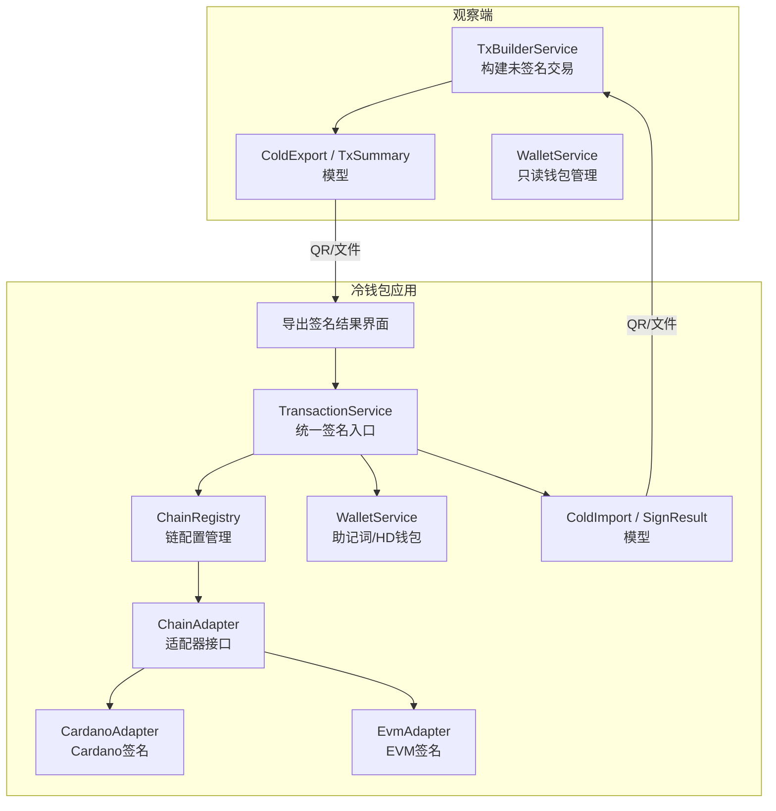
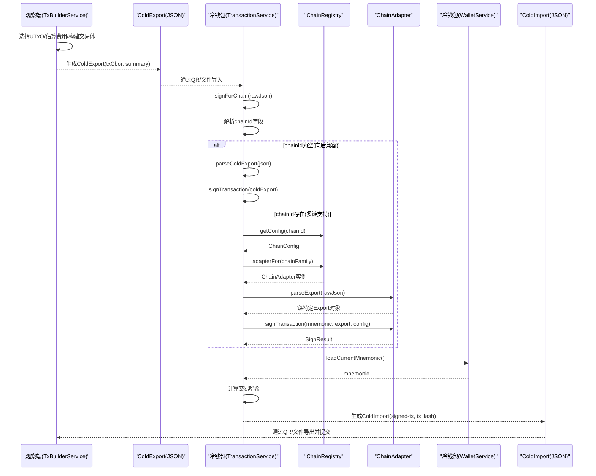
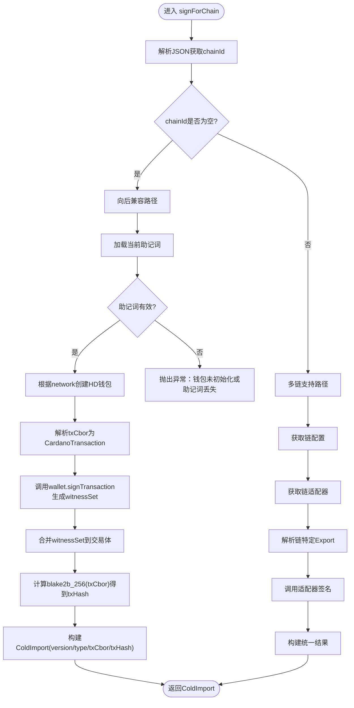
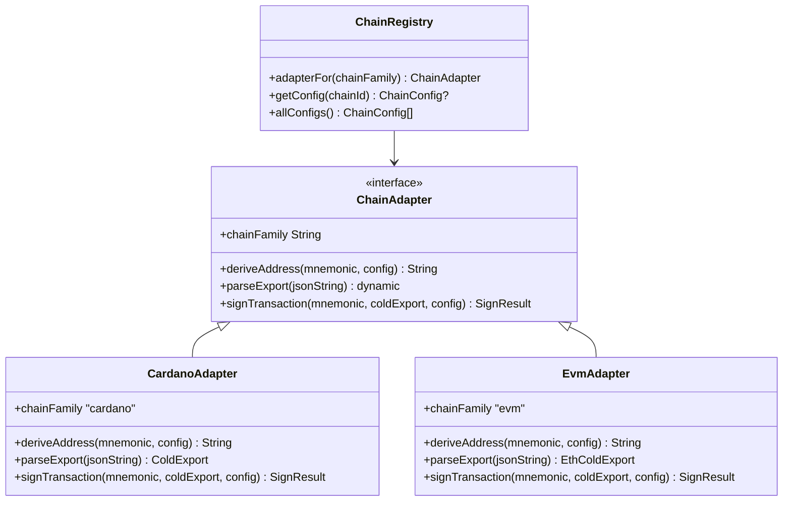
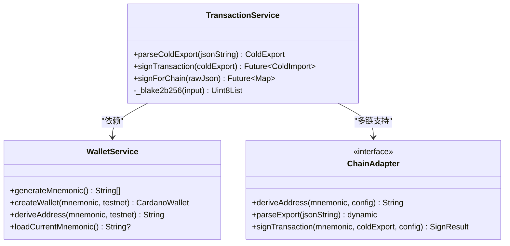
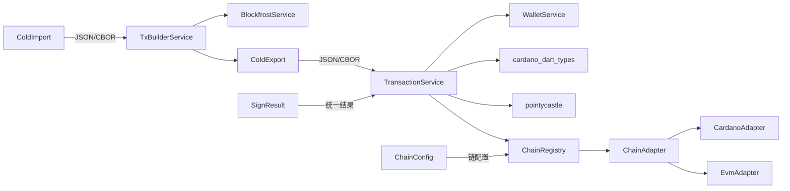

# 交易处理服务

<cite>
**本文引用的文件**
- [coldwallet-app/lib/services/transaction_service.dart](file://coldwallet-app/lib/services/transaction_service.dart)
- [coldwallet-watch/lib/services/tx_builder_service.dart](file://coldwallet-watch/lib/services/tx_builder_service.dart)
- [coldwallet-watch/lib/models/cold_export.dart](file://coldwallet-watch/lib/models/cold_export.dart)
- [coldwallet-app/lib/models/cold_import.dart](file://coldwallet-app/lib/models/cold_import.dart)
- [coldwallet-watch/lib/models/cold_import.dart](file://coldwallet-watch/lib/models/cold_import.dart)
- [coldwallet-app/lib/services/wallet_service.dart](file://coldwallet-app/lib/services/wallet_service.dart)
- [coldwallet-watch/lib/services/wallet_service.dart](file://coldwallet-watch/lib/services/wallet_service.dart)
- [coldwallet-app/lib/screens/export_signed_screen.dart](file://coldwallet-app/lib/screens/export_signed_screen.dart)
- [coldwallet-app/lib/screens/tx_detail_screen.dart](file://coldwallet-app/lib/screens/tx_detail_screen.dart)
- [coldwallet-app/lib/services/chain_registry.dart](file://coldwallet-app/lib/services/chain_registry.dart)
- [coldwallet-app/lib/services/adapters/chain_adapter.dart](file://coldwallet-app/lib/services/adapters/chain_adapter.dart)
- [coldwallet-app/lib/services/adapters/cardano_adapter.dart](file://coldwallet-app/lib/services/adapters/cardano_adapter.dart)
- [coldwallet-app/lib/services/adapters/evm_adapter.dart](file://coldwallet-app/lib/services/adapters/evm_adapter.dart)
- [coldwallet-app/lib/models/sign_result.dart](file://coldwallet-app/lib/models/sign_result.dart)
- [coldwallet-app/lib/models/chain_config.dart](file://coldwallet-app/lib/models/chain_config.dart)
- [docs/superpowers/plans/2026-08-11-cold-wallet-app.md](file://docs/superpowers/plans/2026-08-11-cold-wallet-app.md)
- [docs/superpowers/specs/2026-08-10-cold-wallet-design.md](file://docs/superpowers/specs/2026-08-10-cold-wallet-design.md)
</cite>

## 更新摘要
**变更内容**
- 新增多链支持架构，通过ChainAdapter接口实现不同链族的统一签名
- TransactionService新增signForChain()统一签名入口，自动路由到对应链适配器
- 引入ChainRegistry管理链配置和适配器实例
- 新增SignResult统一签名结果模型，支持Cardano、EVM等多链格式
- 保持向后兼容，无chainId字段时仍使用原有Cardano签名流程

## 目录
1. [简介](#简介)
2. [项目结构](#项目结构)
3. [核心组件](#核心组件)
4. [架构总览](#架构总览)
5. [详细组件分析](#详细组件分析)
6. [依赖关系分析](#依赖关系分析)
7. [性能考虑](#性能考虑)
8. [故障排查指南](#故障排查指南)
9. [结论](#结论)
10. [附录](#附录)

## 简介
本文件面向多链冷钱包交易处理服务，系统性说明未签名交易的解析、离线签名流程、CBOR格式编解码、交易摘要生成与ColdExport/ColdImport数据交换协议。**最新更新**：TransactionService现已提供统一的签名接口（signForChain()），根据链配置自动路由到适当的链适配器，支持Cardano、EVM等多链签名。重点解释TransactionService的核心方法：解析未签名交易、执行私钥签名、生成已签名交易以及交易状态跟踪；并说明CIP-1852路径下的密钥派生与签名过程、错误处理机制。同时提供从观察端（热钱包）接收未签名交易、在冷钱包中签名并返回已签名交易的完整流程，以及QR码数据传输的最佳实践。

## 项目结构
本项目由"观察端（coldwallet-watch）"和"冷钱包应用（coldwallet-app）"两部分组成：
- 观察端负责构建未签名交易、生成交易摘要、导出为ColdExport（包含CBOR与摘要），并通过QR或文件传递给冷钱包。
- 冷钱包应用负责解析ColdExport、使用本地私钥对交易进行签名，生成ColdImport（包含已签名交易CBOR与交易哈希），再通过QR或文件回传给观察端提交上链。
- **新增**：多链适配器架构，通过ChainAdapter接口统一管理不同链族的签名逻辑。

**图表来源**
- [coldwallet-watch/lib/services/tx_builder_service.dart:11-118](file://coldwallet-watch/lib/services/tx_builder_service.dart#L11-L118)
- [coldwallet-watch/lib/models/cold_export.dart:1-110](file://coldwallet-watch/lib/models/cold_export.dart#L1-L110)
- [coldwallet-app/lib/services/transaction_service.dart:13-108](file://coldwallet-app/lib/services/transaction_service.dart#L13-L108)
- [coldwallet-app/lib/services/chain_registry.dart:1-79](file://coldwallet-app/lib/services/chain_registry.dart#L1-L79)
- [coldwallet-app/lib/services/adapters/chain_adapter.dart:1-37](file://coldwallet-app/lib/services/adapters/chain_adapter.dart#L1-L37)

**章节来源**
- [coldwallet-watch/lib/services/tx_builder_service.dart:11-118](file://coldwallet-watch/lib/services/tx_builder_service.dart#L11-L118)
- [coldwallet-watch/lib/models/cold_export.dart:1-110](file://coldwallet-watch/lib/models/cold_export.dart#L1-L110)
- [coldwallet-app/lib/services/transaction_service.dart:13-108](file://coldwallet-app/lib/services/transaction_service.dart#L13-L108)
- [coldwallet-app/lib/models/cold_import.dart:1-36](file://coldwallet-app/lib/models/cold_import.dart#L1-L36)
- [coldwallet-app/lib/screens/export_signed_screen.dart:45-76](file://coldwallet-app/lib/screens/export_signed_screen.dart#L45-L76)

## 核心组件
- 交易构建服务（观察端）：负责选择UTxO、估算手续费、构造Cardano交易体并输出ColdExport（含txCbor与TxSummary）。
- **统一交易服务（冷钱包应用）**：通过signForChain()方法提供统一的签名入口，自动识别链类型并路由到对应适配器；保留原有的parseColdExport和signTransaction方法以支持向后兼容。
- **链适配器层**：通过ChainAdapter接口定义统一的签名抽象，具体实现包括CardanoAdapter（CIP-1852路径+CBOR交易+Ed25519签名）和EvmAdapter（BIP-44路径+RLP交易+EIP-155/EIP-1559签名）。
- **链注册中心**：ChainRegistry管理所有支持的链配置，提供适配器实例查找功能。
- 数据模型：ColdExport（未签名交易）、ColdImport（已签名交易）、SignResult（统一签名结果）、ChainConfig（链配置）、TxSummary（交易摘要）、AssetAmount（资产项）。
- 钱包服务：观察端仅做只读管理；冷钱包应用负责助记词安全存储、HD钱包创建与地址派生。

**章节来源**
- [coldwallet-watch/lib/services/tx_builder_service.dart:11-118](file://coldwallet-watch/lib/services/tx_builder_service.dart#L11-L118)
- [coldwallet-app/lib/services/transaction_service.dart:13-108](file://coldwallet-app/lib/services/transaction_service.dart#L13-L108)
- [coldwallet-app/lib/services/adapters/chain_adapter.dart:1-37](file://coldwallet-app/lib/services/adapters/chain_adapter.dart#L1-L37)
- [coldwallet-app/lib/services/chain_registry.dart:1-79](file://coldwallet-app/lib/services/chain_registry.dart#L1-L79)
- [coldwallet-watch/lib/models/cold_export.dart:1-110](file://coldwallet-watch/lib/models/cold_export.dart#L1-L110)
- [coldwallet-app/lib/models/sign_result.dart:1-30](file://coldwallet-app/lib/models/sign_result.dart#L1-L30)
- [coldwallet-app/lib/models/chain_config.dart:1-48](file://coldwallet-app/lib/models/chain_config.dart#L1-L48)

## 架构总览
下图展示从观察端构建未签名交易到冷钱包签名并返回的端到端流程，包括QR码传输与JSON编解码，以及新的多链适配机制。

**图表来源**
- [coldwallet-watch/lib/services/tx_builder_service.dart:11-118](file://coldwallet-watch/lib/services/tx_builder_service.dart#L11-L118)
- [coldwallet-watch/lib/models/cold_export.dart:1-110](file://coldwallet-watch/lib/models/cold_export.dart#L1-L110)
- [coldwallet-app/lib/services/transaction_service.dart:76-108](file://coldwallet-app/lib/services/transaction_service.dart#L76-L108)
- [coldwallet-app/lib/services/chain_registry.dart:57-70](file://coldwallet-app/lib/services/chain_registry.dart#L57-L70)
- [coldwallet-app/lib/services/adapters/chain_adapter.dart:25-35](file://coldwallet-app/lib/services/adapters/chain_adapter.dart#L25-L35)

## 详细组件分析

### TransactionService 核心方法
- **统一签名入口**：signForChain()方法提供统一的签名接口，自动识别链类型并路由到对应适配器。当JSON中不包含chainId字段时，视为Cardano ColdExport以保持向后兼容。
- **解析未签名交易**：parseColdExport将JSON字符串反序列化为ColdExport对象，便于后续处理。
- **执行私钥签名**：signTransaction从冷钱包服务加载当前助记词，创建HD钱包，解析txCbor，调用wallet.signTransaction完成见证集签名，再合并到交易中生成已签名交易CBOR。
- **生成已签名交易与交易哈希**：使用blake2b_256对原始交易体CBOR计算哈希，封装为ColdImport。
- **交易状态跟踪**：通过ColdExport.type与ColdImport.type区分未签名与已签名状态，version字段用于协议版本兼容。

**图表来源**
- [coldwallet-app/lib/services/transaction_service.dart:76-108](file://coldwallet-app/lib/services/transaction_service.dart#L76-L108)
- [coldwallet-app/lib/services/transaction_service.dart:31-58](file://coldwallet-app/lib/services/transaction_service.dart#L31-L58)

**章节来源**
- [coldwallet-app/lib/services/transaction_service.dart:13-108](file://coldwallet-app/lib/services/transaction_service.dart#L13-L108)

### 多链适配器架构
**新增**：通过ChainAdapter接口实现不同链族的统一签名逻辑，支持Cardano、EVM等多链扩展。

- **ChainAdapter接口**：定义deriveAddress、parseExport、signTransaction等统一方法。
- **CardanoAdapter**：封装现有Cardano签名逻辑，使用CIP-1852路径派生地址，CBOR交易解析，Ed25519签名。
- **EvmAdapter**：实现EVM链签名逻辑，使用BIP-44路径派生私钥，RLP交易解析，EIP-155/EIP-1559签名。
- **ChainRegistry**：管理链配置和适配器实例，支持动态添加新链。

**图表来源**
- [coldwallet-app/lib/services/adapters/chain_adapter.dart:1-37](file://coldwallet-app/lib/services/adapters/chain_adapter.dart#L1-L37)
- [coldwallet-app/lib/services/adapters/cardano_adapter.dart:1-79](file://coldwallet-app/lib/services/adapters/cardano_adapter.dart#L1-L79)
- [coldwallet-app/lib/services/adapters/evm_adapter.dart:15-66](file://coldwallet-app/lib/services/adapters/evm_adapter.dart#L15-L66)
- [coldwallet-app/lib/services/chain_registry.dart:1-79](file://coldwallet-app/lib/services/chain_registry.dart#L1-L79)

**章节来源**
- [coldwallet-app/lib/services/adapters/chain_adapter.dart:1-37](file://coldwallet-app/lib/services/adapters/chain_adapter.dart#L1-L37)
- [coldwallet-app/lib/services/adapters/cardano_adapter.dart:1-79](file://coldwallet-app/lib/services/adapters/cardano_adapter.dart#L1-L79)
- [coldwallet-app/lib/services/adapters/evm_adapter.dart:1-200](file://coldwallet-app/lib/services/adapters/evm_adapter.dart#L1-L200)
- [coldwallet-app/lib/services/chain_registry.dart:1-79](file://coldwallet-app/lib/services/chain_registry.dart#L1-L79)

### 交易构建服务（观察端）
- 输入：发送方地址、接收方地址、资产列表（MVP仅支持lovelace）、网络标识。
- 流程：
  - 校验资产类型与数量。
  - 查询UTxO，检查余额是否足够覆盖转账金额、手续费与最小UTxO值。
  - 获取最新区块槽位，设置TTL。
  - 迭代估算手续费（基于min_fee_a/min_fee_b与交易字节长度），直至收敛。
  - 构建输入、输出（收款方与找零），生成CardanoTransactionBody与完整交易体。
  - 输出ColdExport（包含txCbor与TxSummary）。

**图表来源**
- [coldwallet-watch/lib/services/tx_builder_service.dart:11-118](file://coldwallet-watch/lib/services/tx_builder_service.dart#L11-L118)

**章节来源**
- [coldwallet-watch/lib/services/tx_builder_service.dart:11-118](file://coldwallet-watch/lib/services/tx_builder_service.dart#L11-L118)

### 数据模型与 CBOR 编解码
- **ColdExport**：包含version、type、network、txCbor、summary。用于将未签名交易与摘要从观察端传递到冷钱包。
- **TxSummary**：包含fromAddress、toAddress、assets、fee，供用户在冷钱包确认交易内容。
- **AssetAmount**：单个资产的unit、quantity、displayName。
- **ColdImport**：包含version、type、txCbor、txHash，用于将已签名交易与哈希从冷钱包传递回观察端提交。
- **SignResult**：**新增**统一签名结果模型，包含signedTxHex、txHash、version，支持多链格式。
- **ChainConfig**：**新增**链配置模型，描述链的基本信息，供ChainAdapter使用。

CBOR编解码要点：
- 观察端将Cardano交易体序列化为CBOR十六进制字符串，放入ColdExport.txCbor。
- 冷钱包解析该CBOR字符串为交易对象，签名后再次序列化得到新的CBOR字符串，放入ColdImport.txCbor。
- 交易哈希通过blake2b_256对原始交易体CBOR计算得到，放入ColdImport.txHash。
- **多链支持**：EVM链使用hex编码的交易数据，通过rawTxHex字段传递。

**章节来源**
- [coldwallet-watch/lib/models/cold_export.dart:1-109](file://coldwallet-watch/lib/models/cold_export.dart#L1-L109)
- [coldwallet-app/lib/models/cold_import.dart:1-36](file://coldwallet-app/lib/models/cold_import.dart#L1-L36)
- [coldwallet-watch/lib/models/cold_import.dart:1-36](file://coldwallet-watch/lib/models/cold_import.dart#L1-L36)
- [coldwallet-app/lib/models/sign_result.dart:1-30](file://coldwallet-app/lib/models/sign_result.dart#L1-L30)
- [coldwallet-app/lib/models/chain_config.dart:1-48](file://coldwallet-app/lib/models/chain_config.dart#L1-L48)
- [coldwallet-app/lib/services/transaction_service.dart:41-69](file://coldwallet-app/lib/services/transaction_service.dart#L41-L69)

### CIP-1852 路径下的密钥签名过程
- 冷钱包应用使用WalletService从助记词创建HD钱包，并使用CIP-1852路径m/1852'/1815'/account'/0/0派生支付地址与密钥。
- 在签名时，通过witnessBech32Addresses指定需要签名的地址集合，确保见证集正确关联到发送方地址。
- **多链支持**：EVM链使用BIP-44路径m/44'/60'/0'/0/0派生私钥，支持EIP-155/EIP-1559交易签名。
- 计划文档中描述了CIP-1852路径与Ed25519密钥派生的实现思路，实际签名由SDK内部处理密钥格式。

**图表来源**
- [coldwallet-app/lib/services/wallet_service.dart:60-78](file://coldwallet-app/lib/services/wallet_service.dart#L60-L78)
- [coldwallet-app/lib/services/transaction_service.dart:13-108](file://coldwallet-app/lib/services/transaction_service.dart#L13-L108)
- [coldwallet-app/lib/services/adapters/chain_adapter.dart:1-37](file://coldwallet-app/lib/services/adapters/chain_adapter.dart#L1-L37)

**章节来源**
- [coldwallet-app/lib/services/wallet_service.dart:60-78](file://coldwallet-app/lib/services/wallet_service.dart#L60-L78)
- [coldwallet-app/lib/services/transaction_service.dart:13-108](file://coldwallet-app/lib/services/transaction_service.dart#L13-L108)
- [docs/superpowers/plans/2026-08-11-cold-wallet-app.md:859-909](file://docs/superpowers/plans/2026-08-11-cold-wallet-app.md#L859-L909)

### 错误处理机制
- 观察端：
  - 不支持的资产类型：抛出UnsupportedError（MVP仅支持ADA）。
  - 无可用UTxO：抛出异常提示余额不足或无UTxO。
  - 手续费无法收敛：抛出异常提示无法稳定估算手续费。
- 冷钱包应用：
  - 助记词缺失或无效：抛出异常提示钱包未初始化或助记词丢失。
  - 交易哈希计算失败：通过Blake2bDigest计算失败会触发异常。
  - **多链支持**：不支持的链ID抛出UnsupportedError，链族不支持抛出UnsupportedError。
- 数据校验：
  - ColdExport/ColdImport的JSON解析需保证字段存在且类型正确，否则在反序列化阶段抛出异常。

**章节来源**
- [coldwallet-watch/lib/services/tx_builder_service.dart:18-58](file://coldwallet-watch/lib/services/tx_builder_service.dart#L18-L58)
- [coldwallet-watch/lib/services/tx_builder_service.dart:117-118](file://coldwallet-watch/lib/services/tx_builder_service.dart#L117-L118)
- [coldwallet-app/lib/services/transaction_service.dart:31-34](file://coldwallet-app/lib/services/transaction_service.dart#L31-L34)
- [coldwallet-app/lib/services/transaction_service.dart:62-68](file://coldwallet-app/lib/services/transaction_service.dart#L62-L68)
- [coldwallet-app/lib/services/transaction_service.dart:92-95](file://coldwallet-app/lib/services/transaction_service.dart#L92-L95)

### QR 码数据传输流程与最佳实践
- 编码流程：
  - 观察端将ColdExport序列化为JSON字符串，显示为QR码或通过文件导出。
  - 冷钱包应用扫描QR或读取文件，解析JSON为ColdExport，展示TxSummary供用户确认。
  - 签名完成后，将ColdImport序列化为JSON字符串，显示为QR码或通过文件导出。
  - 观察端扫描QR或读取文件，解析JSON为ColdImport，提交交易到链上。
- 容量预估：
  - ColdExport JSON约400-800 bytes，单张QR码可承载。
  - ColdImport JSON约300-500 bytes，单张QR码可承载。
- **多链支持**：EVM链使用hex编码的交易数据，JSON格式略有不同但容量相近。
- 最佳实践：
  - 使用UTF-8编码的JSON字符串作为QR内容。
  - 在UI层提供"扫码"和"文件导入"两种途径，提升用户体验。
  - 对解析失败的QR给出明确错误提示，允许重试。

**章节来源**
- [docs/superpowers/specs/2026-08-10-cold-wallet-design.md:338-350](file://docs/superpowers/specs/2026-08-10-cold-wallet-design.md#L338-L350)
- [coldwallet-app/lib/screens/export_signed_screen.dart:45-76](file://coldwallet-app/lib/screens/export_signed_screen.dart#L45-L76)
- [coldwallet-app/lib/screens/tx_detail_screen.dart:42-80](file://coldwallet-app/lib/screens/tx_detail_screen.dart#L42-L80)

## 依赖关系分析
- 观察端依赖BlockfrostService获取UTxO、协议参数与最新区块信息。
- 冷钱包应用依赖cardano_dart_types与pointycastle进行CBOR解析与哈希计算。
- **新增**：链适配器层通过ChainAdapter接口解耦不同链族的实现细节。
- **新增**：ChainRegistry统一管理链配置和适配器实例，支持动态扩展。
- 两个模块通过ColdExport/ColdImport解耦，仅依赖JSON字符串与CBOR十六进制字符串进行数据交换。

**图表来源**
- [coldwallet-watch/lib/services/tx_builder_service.dart:1-152](file://coldwallet-watch/lib/services/tx_builder_service.dart#L1-L152)
- [coldwallet-app/lib/services/transaction_service.dart:1-108](file://coldwallet-app/lib/services/transaction_service.dart#L1-L108)
- [coldwallet-app/lib/services/chain_registry.dart:1-79](file://coldwallet-app/lib/services/chain_registry.dart#L1-L79)
- [coldwallet-app/lib/services/adapters/chain_adapter.dart:1-37](file://coldwallet-app/lib/services/adapters/chain_adapter.dart#L1-L37)

**章节来源**
- [coldwallet-watch/lib/services/tx_builder_service.dart:1-152](file://coldwallet-watch/lib/services/tx_builder_service.dart#L1-L152)
- [coldwallet-app/lib/services/transaction_service.dart:1-108](file://coldwallet-app/lib/services/transaction_service.dart#L1-L108)

## 性能考虑
- 手续费估算采用迭代方式，最多5次循环，避免无限循环导致性能问题。
- UTxO选择策略为顺序累加，简单高效，适合MVP场景。
- QR码数据量较小，单张QR即可承载，无需分帧传输。
- 哈希计算使用Blake2bDigest，时间复杂度与输入长度线性相关，开销可控。
- **多链支持**：链适配器模式避免了重复的链特定逻辑，提高代码复用性。
- **适配器缓存**：ChainRegistry可考虑缓存适配器实例，减少重复创建开销。

## 故障排查指南
- 观察端常见问题：
  - "MVP仅支持ADA转账"：检查assets是否为lovelace。
  - "地址没有可用的UTxO"：确认发送方地址有余额且未被锁定。
  - "余额不足"：检查selectedLovelace是否覆盖amount + fee + minUtxo。
  - "无法收敛到稳定的手续费估算"：调整fee初始值或检查协议参数。
- 冷钱包应用常见问题：
  - "当前钱包未初始化或助记词丢失"：确认助记词已安全存储并可读取。
  - "交易哈希计算失败"：检查txCbor是否为有效的十六进制字符串。
  - **多链支持**："不支持的链"：检查chainId是否在ChainRegistry中注册。
  - **多链支持**："不支持的链族"：检查链族是否有对应的适配器实现。
- 数据解析问题：
  - ColdExport/ColdImport JSON字段缺失或类型错误会导致解析失败，需在UI层捕获并提示。

**章节来源**
- [coldwallet-watch/lib/services/tx_builder_service.dart:18-58](file://coldwallet-watch/lib/services/tx_builder_service.dart#L18-L58)
- [coldwallet-watch/lib/services/tx_builder_service.dart:117-118](file://coldwallet-watch/lib/services/tx_builder_service.dart#L117-L118)
- [coldwallet-app/lib/services/transaction_service.dart:31-34](file://coldwallet-app/lib/services/transaction_service.dart#L31-L34)
- [coldwallet-app/lib/services/transaction_service.dart:62-68](file://coldwallet-app/lib/services/transaction_service.dart#L62-L68)
- [coldwallet-app/lib/services/transaction_service.dart:92-95](file://coldwallet-app/lib/services/transaction_service.dart#L92-L95)

## 结论
本交易处理服务通过ColdExport/ColdImport协议实现了观察端与冷钱包的安全分离，**现已升级为多链支持**。TransactionService提供了统一的签名接口（signForChain()），能够自动识别链类型并路由到相应的链适配器，支持Cardano、EVM等多种区块链。通过ChainAdapter接口设计，系统具有良好的扩展性，可以轻松添加新的链族支持。原有的Cardano签名流程保持不变，确保向后兼容性。结合CIP-1852路径的密钥派生和多链适配器架构，确保了交易的安全性与合规性。QR码传输方案简洁可靠，适合MVP阶段的快速交付。后续可扩展更多链族支持、智能合约交互与更复杂的费用估算策略。

## 附录
- 关键代码片段路径（不包含具体代码内容）：
  - 统一签名入口：[coldwallet-app/lib/services/transaction_service.dart:76-108](file://coldwallet-app/lib/services/transaction_service.dart#L76-L108)
  - 解析未签名交易：[coldwallet-app/lib/services/transaction_service.dart:18-24](file://coldwallet-app/lib/services/transaction_service.dart#L18-L24)
  - 执行私钥签名：[coldwallet-app/lib/services/transaction_service.dart:26-57](file://coldwallet-app/lib/services/transaction_service.dart#L26-L57)
  - 计算交易哈希：[coldwallet-app/lib/services/transaction_service.dart:59-68](file://coldwallet-app/lib/services/transaction_service.dart#L59-L68)
  - 链适配器接口：[coldwallet-app/lib/services/adapters/chain_adapter.dart:1-37](file://coldwallet-app/lib/services/adapters/chain_adapter.dart#L1-L37)
  - Cardano适配器实现：[coldwallet-app/lib/services/adapters/cardano_adapter.dart:1-79](file://coldwallet-app/lib/services/adapters/cardano_adapter.dart#L1-L79)
  - EVM适配器实现：[coldwallet-app/lib/services/adapters/evm_adapter.dart:1-200](file://coldwallet-app/lib/services/adapters/evm_adapter.dart#L1-L200)
  - 链注册中心：[coldwallet-app/lib/services/chain_registry.dart:1-79](file://coldwallet-app/lib/services/chain_registry.dart#L1-L79)
  - 构建未签名交易：[coldwallet-watch/lib/services/tx_builder_service.dart:11-118](file://coldwallet-watch/lib/services/tx_builder_service.dart#L11-L118)
  - 导出签名结果界面：[coldwallet-app/lib/screens/export_signed_screen.dart:45-76](file://coldwallet-app/lib/screens/export_signed_screen.dart#L45-L76)
  - 交易详情展示：[coldwallet-app/lib/screens/tx_detail_screen.dart:42-80](file://coldwallet-app/lib/screens/tx_detail_screen.dart#L42-L80)
  - CIP-1852密钥派生说明：[docs/superpowers/plans/2026-08-11-cold-wallet-app.md:859-909](file://docs/superpowers/plans/2026-08-11-cold-wallet-app.md#L859-L909)
  - QR编码流程与容量预估：[docs/superpowers/specs/2026-08-10-cold-wallet-design.md:338-350](file://docs/superpowers/specs/2026-08-10-cold-wallet-design.md#L338-L350)