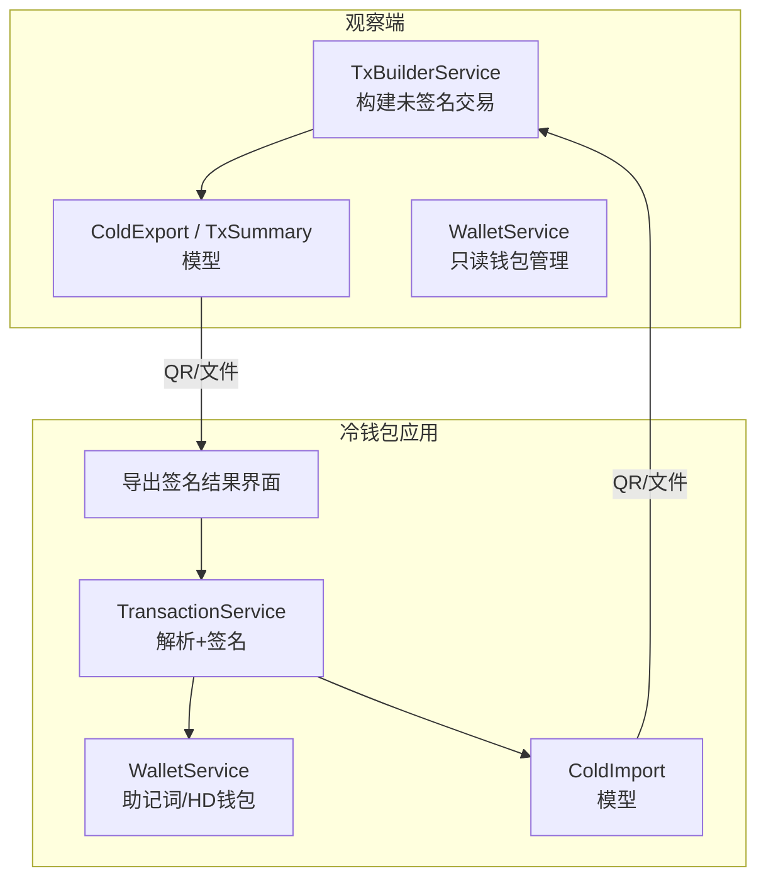
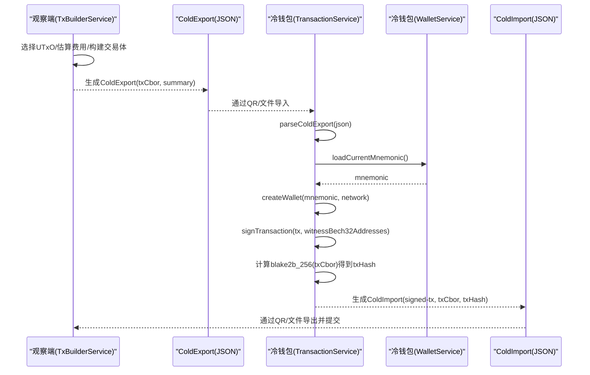
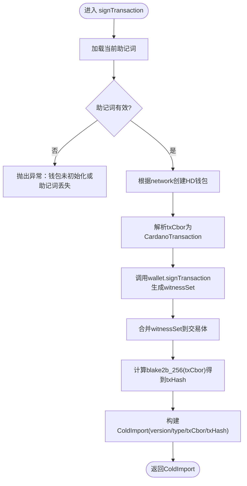
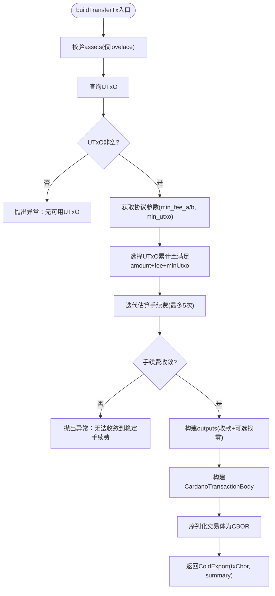
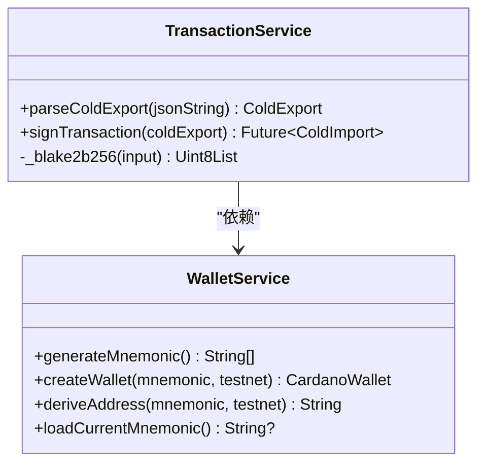
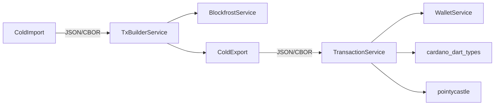

# 交易处理服务

<cite>
**本文引用的文件**
- [coldwallet-app/lib/services/transaction_service.dart](file://coldwallet-app/lib/services/transaction_service.dart)
- [coldwallet-watch/lib/services/tx_builder_service.dart](file://coldwallet-watch/lib/services/tx_builder_service.dart)
- [coldwallet-watch/lib/models/cold_export.dart](file://coldwallet-watch/lib/models/cold_export.dart)
- [coldwallet-app/lib/models/cold_import.dart](file://coldwallet-app/lib/models/cold_import.dart)
- [coldwallet-watch/lib/models/cold_import.dart](file://coldwallet-watch/lib/models/cold_import.dart)
- [coldwallet-app/lib/services/wallet_service.dart](file://coldwallet-app/lib/services/wallet_service.dart)
- [coldwallet-watch/lib/services/wallet_service.dart](file://coldwallet-watch/lib/services/wallet_service.dart)
- [coldwallet-app/lib/screens/export_signed_screen.dart](file://coldwallet-app/lib/screens/export_signed_screen.dart)
- [coldwallet-app/lib/screens/tx_detail_screen.dart](file://coldwallet-app/lib/screens/tx_detail_screen.dart)
- [docs/superpowers/plans/2026-08-11-cold-wallet-app.md](file://docs/superpowers/plans/2026-08-11-cold-wallet-app.md)
- [docs/superpowers/specs/2026-08-10-cold-wallet-design.md](file://docs/superpowers/specs/2026-08-10-cold-wallet-design.md)
</cite>

## 目录
1. [简介](#简介)
2. [项目结构](#项目结构)
3. [核心组件](#核心组件)
4. [架构总览](#架构总览)
5. [详细组件分析](#详细组件分析)
6. [依赖关系分析](#依赖关系分析)
7. [性能考虑](#性能考虑)
8. [故障排查指南](#故障排查指南)
9. [结论](#结论)
10. [附录](#附录)

## 简介
本文件面向冷钱包交易处理服务，系统性说明未签名交易的解析、离线签名流程、CBOR 编解码、交易摘要生成与 ColdExport/ColdImport 数据交换协议。重点解释 TransactionService 的核心方法：解析未签名交易、执行私钥签名、生成已签名交易以及交易状态跟踪；并说明 CIP-1852 路径下的密钥派生与签名过程、错误处理机制。同时提供从观察端（热钱包）接收未签名交易、在冷钱包中签名并返回已签名交易的完整流程，以及 QR 码数据传输的最佳实践。

## 项目结构
本项目由“观察端（coldwallet-watch）”和“冷钱包应用（coldwallet-app）”两部分组成：
- 观察端负责构建未签名交易、生成交易摘要、导出为 ColdExport（包含 CBOR 与摘要），并通过 QR 或文件传递给冷钱包。
- 冷钱包应用负责解析 ColdExport、使用本地私钥对交易进行签名，生成 ColdImport（包含已签名交易 CBOR 与交易哈希），再通过 QR 或文件回传给观察端提交上链。

图表来源
- [coldwallet-watch/lib/services/tx_builder_service.dart:11-118](file://coldwallet-watch/lib/services/tx_builder_service.dart#L11-L118)
- [coldwallet-watch/lib/models/cold_export.dart:1-110](file://coldwallet-watch/lib/models/cold_export.dart#L1-L110)
- [coldwallet-app/lib/services/transaction_service.dart:13-69](file://coldwallet-app/lib/services/transaction_service.dart#L13-L69)
- [coldwallet-app/lib/models/cold_import.dart:1-36](file://coldwallet-app/lib/models/cold_import.dart#L1-L36)
- [coldwallet-app/lib/screens/export_signed_screen.dart:45-76](file://coldwallet-app/lib/screens/export_signed_screen.dart#L45-L76)

章节来源
- [coldwallet-watch/lib/services/tx_builder_service.dart:11-118](file://coldwallet-watch/lib/services/tx_builder_service.dart#L11-L118)
- [coldwallet-watch/lib/models/cold_export.dart:1-110](file://coldwallet-watch/lib/models/cold_export.dart#L1-L110)
- [coldwallet-app/lib/services/transaction_service.dart:13-69](file://coldwallet-app/lib/services/transaction_service.dart#L13-L69)
- [coldwallet-app/lib/models/cold_import.dart:1-36](file://coldwallet-app/lib/models/cold_import.dart#L1-L36)
- [coldwallet-app/lib/screens/export_signed_screen.dart:45-76](file://coldwallet-app/lib/screens/export_signed_screen.dart#L45-L76)

## 核心组件
- 交易构建服务（观察端）：负责选择 UTxO、估算手续费、构造 Cardano 交易体并输出 ColdExport（含 txCbor 与 TxSummary）。
- 交易服务（冷钱包应用）：解析 ColdExport，加载助记词创建 HD 钱包，使用 CIP-1852 路径派生支付密钥并对交易签名，计算交易哈希，输出 ColdImport。
- 数据模型：ColdExport（未签名交易）、ColdImport（已签名交易）、TxSummary（交易摘要）、AssetAmount（资产项）。
- 钱包服务：观察端仅做只读管理；冷钱包应用负责助记词安全存储、HD 钱包创建与地址派生。

章节来源
- [coldwallet-watch/lib/services/tx_builder_service.dart:11-118](file://coldwallet-watch/lib/services/tx_builder_service.dart#L11-L118)
- [coldwallet-app/lib/services/transaction_service.dart:13-69](file://coldwallet-app/lib/services/transaction_service.dart#L13-L69)
- [coldwallet-watch/lib/models/cold_export.dart:1-110](file://coldwallet-watch/lib/models/cold_export.dart#L1-L110)
- [coldwallet-app/lib/models/cold_import.dart:1-36](file://coldwallet-app/lib/models/cold_import.dart#L1-L36)
- [coldwallet-app/lib/services/wallet_service.dart:60-78](file://coldwallet-app/lib/services/wallet_service.dart#L60-L78)

## 架构总览
下图展示从观察端构建未签名交易到冷钱包签名并返回的端到端流程，包括 QR 码传输与 JSON 编解码。

图表来源
- [coldwallet-watch/lib/services/tx_builder_service.dart:11-118](file://coldwallet-watch/lib/services/tx_builder_service.dart#L11-L118)
- [coldwallet-watch/lib/models/cold_export.dart:1-110](file://coldwallet-watch/lib/models/cold_export.dart#L1-L110)
- [coldwallet-app/lib/services/transaction_service.dart:18-69](file://coldwallet-app/lib/services/transaction_service.dart#L18-L69)
- [coldwallet-app/lib/services/wallet_service.dart:60-78](file://coldwallet-app/lib/services/wallet_service.dart#L60-L78)
- [coldwallet-app/lib/models/cold_import.dart:1-36](file://coldwallet-app/lib/models/cold_import.dart#L1-L36)

## 详细组件分析

### TransactionService 核心方法
- 解析未签名交易：parseColdExport 将 JSON 字符串反序列化为 ColdExport 对象，便于后续处理。
- 执行私钥签名：signTransaction 从冷钱包服务加载当前助记词，创建 HD 钱包，解析 txCbor，调用 wallet.signTransaction 完成见证集签名，再合并到交易中生成已签名交易 CBOR。
- 生成已签名交易与交易哈希：使用 blake2b_256 对原始交易体 CBOR 计算哈希，封装为 ColdImport。
- 交易状态跟踪：通过 ColdExport.type 与 ColdImport.type 区分未签名与已签名状态，version 字段用于协议版本兼容。

图表来源
- [coldwallet-app/lib/services/transaction_service.dart:18-69](file://coldwallet-app/lib/services/transaction_service.dart#L18-L69)

章节来源
- [coldwallet-app/lib/services/transaction_service.dart:18-69](file://coldwallet-app/lib/services/transaction_service.dart#L18-L69)

### 交易构建服务（观察端）
- 输入：发送方地址、接收方地址、资产列表（MVP 仅支持 lovelace）、网络标识。
- 流程：
  - 校验资产类型与数量。
  - 查询 UTxO，检查余额是否足够覆盖转账金额、手续费与最小 UTxO 值。
  - 获取最新区块槽位，设置 TTL。
  - 迭代估算手续费（基于 min_fee_a/min_fee_b 与交易字节长度），直至收敛。
  - 构建输入、输出（收款方与找零），生成 CardanoTransactionBody 与完整交易体。
  - 输出 ColdExport（包含 txCbor 与 TxSummary）。

图表来源
- [coldwallet-watch/lib/services/tx_builder_service.dart:11-118](file://coldwallet-watch/lib/services/tx_builder_service.dart#L11-L118)

章节来源
- [coldwallet-watch/lib/services/tx_builder_service.dart:11-118](file://coldwallet-watch/lib/services/tx_builder_service.dart#L11-L118)

### 数据模型与 CBOR 编解码
- ColdExport：包含 version、type、network、txCbor、summary。用于将未签名交易与摘要从观察端传递到冷钱包。
- TxSummary：包含 fromAddress、toAddress、assets、fee，供用户在冷钱包确认交易内容。
- AssetAmount：单个资产的 unit、quantity、displayName。
- ColdImport：包含 version、type、txCbor、txHash，用于将已签名交易与哈希从冷钱包传递回观察端提交。

CBOR 编解码要点：
- 观察端将 Cardano 交易体序列化为 CBOR 十六进制字符串，放入 ColdExport.txCbor。
- 冷钱包解析该 CBOR 字符串为交易对象，签名后再次序列化得到新的 CBOR 字符串，放入 ColdImport.txCbor。
- 交易哈希通过 blake2b_256 对原始交易体 CBOR 计算得到，放入 ColdImport.txHash。

章节来源
- [coldwallet-watch/lib/models/cold_export.dart:1-110](file://coldwallet-watch/lib/models/cold_export.dart#L1-L110)
- [coldwallet-app/lib/models/cold_import.dart:1-36](file://coldwallet-app/lib/models/cold_import.dart#L1-L36)
- [coldwallet-watch/lib/models/cold_import.dart:1-36](file://coldwallet-watch/lib/models/cold_import.dart#L1-L36)
- [coldwallet-app/lib/services/transaction_service.dart:41-69](file://coldwallet-app/lib/services/transaction_service.dart#L41-L69)

### CIP-1852 路径下的密钥签名过程
- 冷钱包应用使用 WalletService 从助记词创建 HD 钱包，并使用 CIP-1852 路径 m/1852'/1815'/account'/0/0 派生支付地址与密钥。
- 在签名时，通过 witnessBech32Addresses 指定需要签名的地址集合，确保见证集正确关联到发送方地址。
- 计划文档中描述了 CIP-1852 路径与 Ed25519 密钥派生的实现思路，实际签名由 SDK 内部处理密钥格式。

图表来源
- [coldwallet-app/lib/services/wallet_service.dart:60-78](file://coldwallet-app/lib/services/wallet_service.dart#L60-L78)
- [coldwallet-app/lib/services/transaction_service.dart:13-69](file://coldwallet-app/lib/services/transaction_service.dart#L13-L69)

章节来源
- [coldwallet-app/lib/services/wallet_service.dart:60-78](file://coldwallet-app/lib/services/wallet_service.dart#L60-L78)
- [coldwallet-app/lib/services/transaction_service.dart:13-69](file://coldwallet-app/lib/services/transaction_service.dart#L13-L69)
- [docs/superpowers/plans/2026-08-11-cold-wallet-app.md:859-909](file://docs/superpowers/plans/2026-08-11-cold-wallet-app.md#L859-L909)

### 错误处理机制
- 观察端：
  - 不支持的资产类型：抛出 UnsupportedError（MVP 仅支持 ADA）。
  - 无可用 UTxO：抛出异常提示余额不足或无 UTxO。
  - 手续费无法收敛：抛出异常提示无法稳定估算手续费。
- 冷钱包应用：
  - 助记词缺失或无效：抛出异常提示钱包未初始化或助记词丢失。
  - 交易哈希计算失败：通过 Blake2bDigest 计算失败会触发异常。
- 数据校验：
  - ColdExport/ColdImport 的 JSON 解析需保证字段存在且类型正确，否则在反序列化阶段抛出异常。

章节来源
- [coldwallet-watch/lib/services/tx_builder_service.dart:18-58](file://coldwallet-watch/lib/services/tx_builder_service.dart#L18-L58)
- [coldwallet-watch/lib/services/tx_builder_service.dart:117-118](file://coldwallet-watch/lib/services/tx_builder_service.dart#L117-L118)
- [coldwallet-app/lib/services/transaction_service.dart:31-34](file://coldwallet-app/lib/services/transaction_service.dart#L31-L34)
- [coldwallet-app/lib/services/transaction_service.dart:62-68](file://coldwallet-app/lib/services/transaction_service.dart#L62-L68)

### QR 码数据传输流程与最佳实践
- 编码流程：
  - 观察端将 ColdExport 序列化为 JSON 字符串，显示为 QR 码或通过文件导出。
  - 冷钱包应用扫描 QR 或读取文件，解析 JSON 为 ColdExport，展示 TxSummary 供用户确认。
  - 签名完成后，将 ColdImport 序列化为 JSON 字符串，显示为 QR 码或通过文件导出。
  - 观察端扫描 QR 或读取文件，解析 JSON 为 ColdImport，提交交易到链上。
- 容量预估：
  - ColdExport JSON 约 400-800 bytes，单张 QR 码可承载。
  - ColdImport JSON 约 300-500 bytes，单张 QR 码可承载。
- 最佳实践：
  - 使用 UTF-8 编码的 JSON 字符串作为 QR 内容。
  - 在 UI 层提供“扫码”和“文件导入”两种途径，提升用户体验。
  - 对解析失败的 QR 给出明确错误提示，允许重试。

章节来源
- [docs/superpowers/specs/2026-08-10-cold-wallet-design.md:338-350](file://docs/superpowers/specs/2026-08-10-cold-wallet-design.md#L338-L350)
- [coldwallet-app/lib/screens/export_signed_screen.dart:45-76](file://coldwallet-app/lib/screens/export_signed_screen.dart#L45-L76)
- [coldwallet-app/lib/screens/tx_detail_screen.dart:42-80](file://coldwallet-app/lib/screens/tx_detail_screen.dart#L42-L80)

## 依赖关系分析
- 观察端依赖 BlockfrostService 获取 UTxO、协议参数与最新区块信息。
- 冷钱包应用依赖 cardano_dart_types 与 pointycastle 进行 CBOR 解析与哈希计算。
- 两个模块通过 ColdExport/ColdImport 解耦，仅依赖 JSON 字符串与 CBOR 十六进制字符串进行数据交换。

图表来源
- [coldwallet-watch/lib/services/tx_builder_service.dart:1-152](file://coldwallet-watch/lib/services/tx_builder_service.dart#L1-L152)
- [coldwallet-app/lib/services/transaction_service.dart:1-69](file://coldwallet-app/lib/services/transaction_service.dart#L1-L69)

章节来源
- [coldwallet-watch/lib/services/tx_builder_service.dart:1-152](file://coldwallet-watch/lib/services/tx_builder_service.dart#L1-L152)
- [coldwallet-app/lib/services/transaction_service.dart:1-69](file://coldwallet-app/lib/services/transaction_service.dart#L1-L69)

## 性能考虑
- 手续费估算采用迭代方式，最多 5 次循环，避免无限循环导致性能问题。
- UTxO 选择策略为顺序累加，简单高效，适合 MVP 场景。
- QR 码数据量较小，单张 QR 即可承载，无需分帧传输。
- 哈希计算使用 Blake2bDigest，时间复杂度与输入长度线性相关，开销可控。

[本节为通用性能讨论，不直接分析具体文件]

## 故障排查指南
- 观察端常见问题：
  - “MVP 仅支持 ADA 转账”：检查 assets 是否为 lovelace。
  - “地址没有可用的 UTxO”：确认发送方地址有余额且未被锁定。
  - “余额不足”：检查 selectedLovelace 是否覆盖 amount + fee + minUtxo。
  - “无法收敛到稳定的手续费估算”：调整 fee 初始值或检查协议参数。
- 冷钱包应用常见问题：
  - “当前钱包未初始化或助记词丢失”：确认助记词已安全存储并可读取。
  - “交易哈希计算失败”：检查 txCbor 是否为有效的十六进制字符串。
- 数据解析问题：
  - ColdExport/ColdImport JSON 字段缺失或类型错误会导致解析失败，需在 UI 层捕获并提示。

章节来源
- [coldwallet-watch/lib/services/tx_builder_service.dart:18-58](file://coldwallet-watch/lib/services/tx_builder_service.dart#L18-L58)
- [coldwallet-watch/lib/services/tx_builder_service.dart:117-118](file://coldwallet-watch/lib/services/tx_builder_service.dart#L117-L118)
- [coldwallet-app/lib/services/transaction_service.dart:31-34](file://coldwallet-app/lib/services/transaction_service.dart#L31-L34)
- [coldwallet-app/lib/services/transaction_service.dart:62-68](file://coldwallet-app/lib/services/transaction_service.dart#L62-L68)

## 结论
本交易处理服务通过 ColdExport/ColdImport 协议实现了观察端与冷钱包的安全分离：观察端负责构建未签名交易与摘要，冷钱包应用负责离线签名与哈希计算。TransactionService 提供了完整的解析、签名与状态跟踪能力，结合 CIP-1852 路径的密钥派生，确保了交易的安全性与合规性。QR 码传输方案简洁可靠，适合 MVP 阶段的快速交付。后续可扩展多资产、智能合约交互与更复杂的费用估算策略。

[本节为总结性内容，不直接分析具体文件]

## 附录
- 关键代码片段路径（不包含具体代码内容）：
  - 解析未签名交易：[coldwallet-app/lib/services/transaction_service.dart:18-24](file://coldwallet-app/lib/services/transaction_service.dart#L18-L24)
  - 执行私钥签名：[coldwallet-app/lib/services/transaction_service.dart:26-57](file://coldwallet-app/lib/services/transaction_service.dart#L26-L57)
  - 计算交易哈希：[coldwallet-app/lib/services/transaction_service.dart:59-68](file://coldwallet-app/lib/services/transaction_service.dart#L59-L68)
  - 构建未签名交易：[coldwallet-watch/lib/services/tx_builder_service.dart:11-118](file://coldwallet-watch/lib/services/tx_builder_service.dart#L11-L118)
  - 导出签名结果界面：[coldwallet-app/lib/screens/export_signed_screen.dart:45-76](file://coldwallet-app/lib/screens/export_signed_screen.dart#L45-L76)
  - 交易详情展示：[coldwallet-app/lib/screens/tx_detail_screen.dart:42-80](file://coldwallet-app/lib/screens/tx_detail_screen.dart#L42-L80)
  - CIP-1852 密钥派生说明：[docs/superpowers/plans/2026-08-11-cold-wallet-app.md:859-909](file://docs/superpowers/plans/2026-08-11-cold-wallet-app.md#L859-L909)
  - QR 编码流程与容量预估：[docs/superpowers/specs/2026-08-10-cold-wallet-design.md:338-350](file://docs/superpowers/specs/2026-08-10-cold-wallet-design.md#L338-L350)