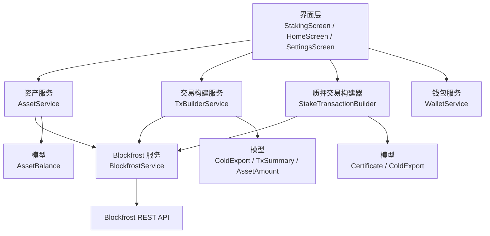
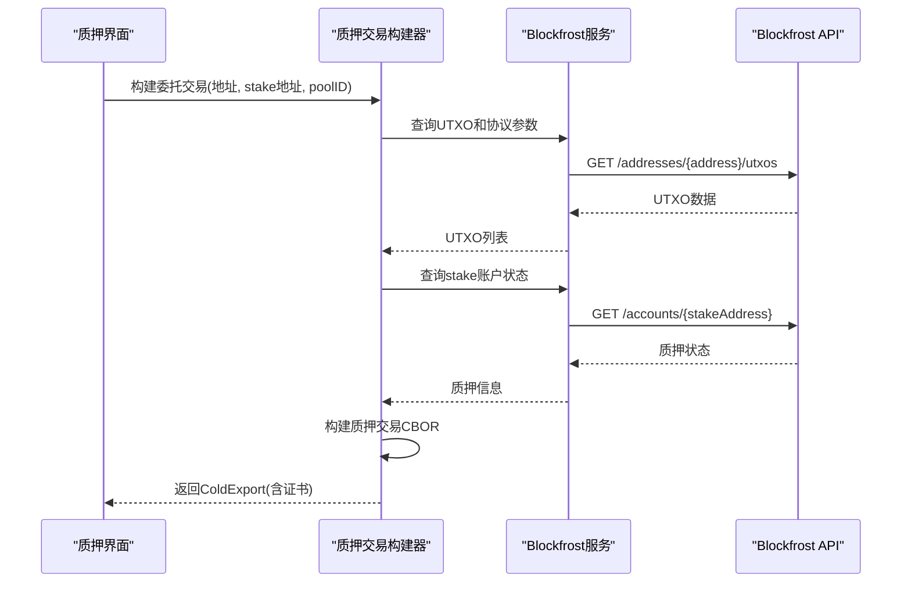
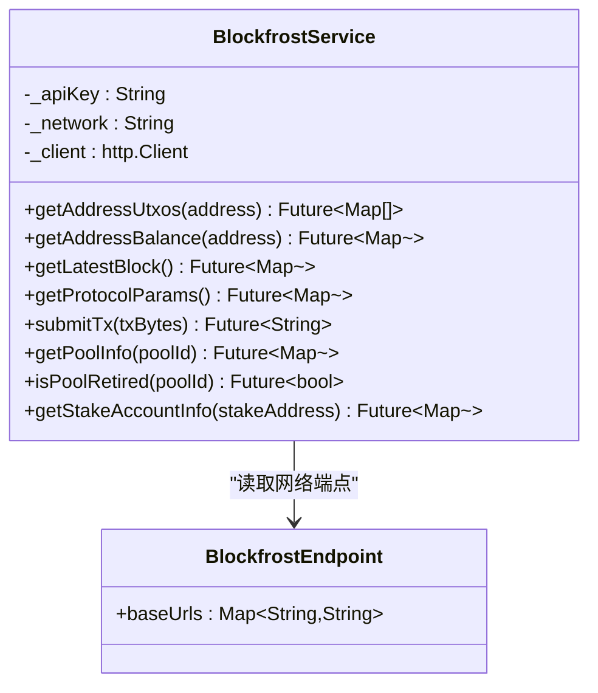
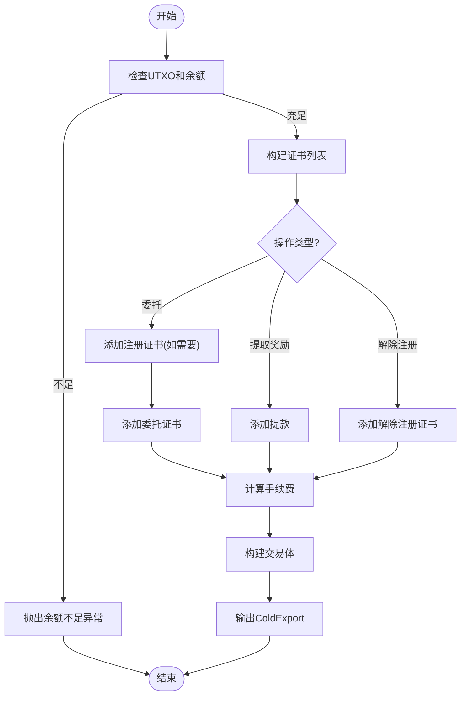
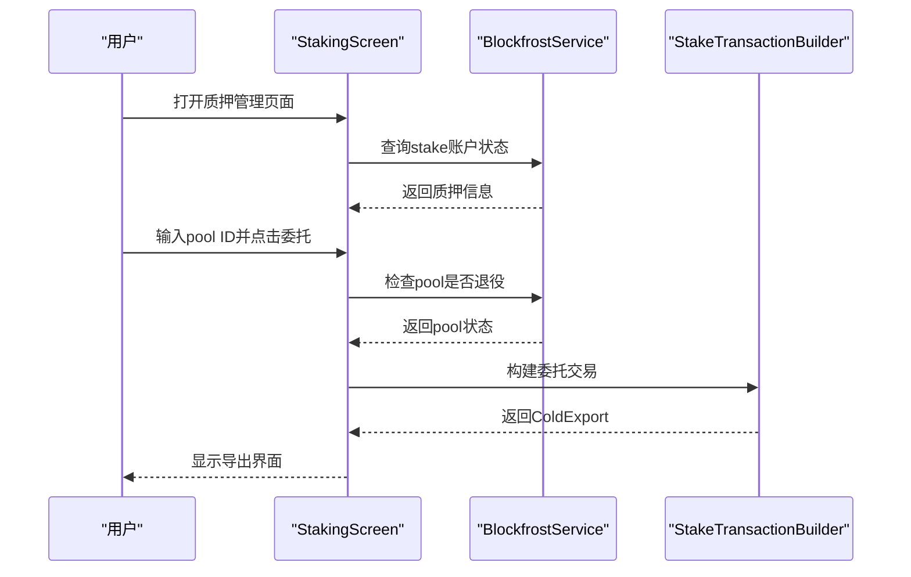
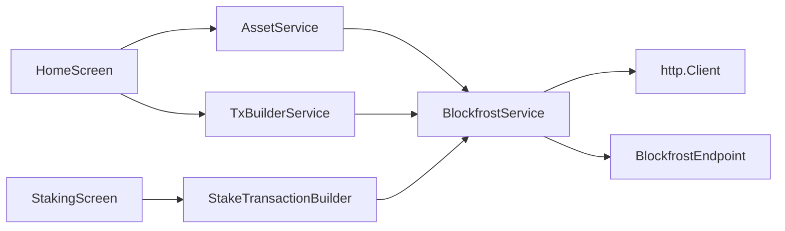

# 区块链交互服务

<cite>
**本文引用的文件**
- [blockfrost_service.dart](file://coldwallet-watch/lib/services/blockfrost_service.dart)
- [stake_transaction_builder.dart](file://coldwallet-watch/lib/services/stake_transaction_builder.dart)
- [staking_screen.dart](file://coldwallet-watch/lib/screens/staking_screen.dart)
- [certificate.dart](file://coldwallet-watch/lib/models/certificate.dart)
- [cold_export.dart](file://coldwallet-watch/lib/models/cold_export.dart)
- [asset_service.dart](file://coldwallet-watch/lib/services/asset_service.dart)
- [tx_builder_service.dart](file://coldwallet-watch/lib/services/tx_builder_service.dart)
- [home_screen.dart](file://coldwallet-watch/lib/screens/home_screen.dart)
- [settings_screen.dart](file://coldwallet-watch/lib/screens/settings_screen.dart)
- [wallet_service.dart](file://coldwallet-watch/lib/services/wallet_service.dart)
</cite>

## 更新摘要
**变更内容**
- 新增 BlockfrostService 的质押相关查询方法：getPoolInfo()、isPoolRetired()、getStakeAccountInfo()
- 新增 StakeTransactionBuilder 类，支持委托、提取奖励、解除注册等质押交易构建
- 新增 StakingScreen 界面，提供完整的质押管理功能
- 扩展 ColdExport 模型，支持证书和提款字段
- 新增 Certificate 模型，描述质押相关操作

## 目录
1. [简介](#简介)
2. [项目结构](#项目结构)
3. [核心组件](#核心组件)
4. [架构总览](#架构总览)
5. [详细组件分析](#详细组件分析)
6. [依赖关系分析](#依赖关系分析)
7. [性能考虑](#性能考虑)
8. [故障排查指南](#故障排查指南)
9. [结论](#结论)
10. [附录：使用示例与最佳实践](#附录使用示例与最佳实践)

## 简介
本文件面向"区块链交互服务"的实现，聚焦于 Blockfrost API 集成、余额查询、UTXO 获取、交易构建与提交、网络配置管理，以及新增的 Cardano 质押功能。文档以冷钱包 Watch 端（coldwallet-watch）中的 Dart 代码为基础，解释 BlockfrostService 的核心方法调用方式、响应处理、错误策略，并给出测试网/主网切换逻辑、API Key 管理与网络超时处理的建议与实践。同时提供完整的端到端流程说明与可视化图示，帮助读者快速理解并安全地扩展该服务。

**更新** 新增了完整的 Cardano 质押功能支持，包括 stake pool 信息查询、stake account 状态查询、质押交易构建等功能。

## 项目结构
- 服务层
  - BlockfrostService：封装对 Blockfrost REST API 的 HTTP 请求，提供地址 UTXO、余额、最新区块、协议参数、交易提交以及质押相关的 pool 和 stake account 查询能力。
  - StakeTransactionBuilder：构建 Cardano 质押相关的未签名交易，支持委托、提取奖励、解除注册等操作。
  - AssetService：基于 BlockfrostService 获取资产余额，结合本地启用配置生成展示列表。
  - TxBuilderService：从链上数据（UTXO、协议参数、最新区块）构建未签名交易，输出供冷端离线签名的 CBOR。
  - WalletService：钱包元数据与当前网络/地址管理等。
- 界面层
  - StakingScreen：质押管理界面，提供质押状态查看和操作入口。
  - HomeScreen：加载并展示资产余额，触发网络请求与错误重试。
  - SettingsScreen：设置 Blockfrost API Key 与网络信息。
- 模型层
  - Certificate：质押证书模型，描述注册、委托、解除注册操作。
  - ColdExport/TxSummary/AssetAmount：用于热端导出给冷端的未签名交易数据，现已扩展支持质押交易。
  - AssetBalance：资产余额的数据模型。

**图表来源**
- [blockfrost_service.dart:1-165](file://coldwallet-watch/lib/services/blockfrost_service.dart#L1-L165)
- [stake_transaction_builder.dart:1-306](file://coldwallet-watch/lib/services/stake_transaction_builder.dart#L1-L306)
- [staking_screen.dart:1-534](file://coldwallet-watch/lib/screens/staking_screen.dart#L1-L534)
- [certificate.dart:1-43](file://coldwallet-watch/lib/models/certificate.dart#L1-L43)
- [cold_export.dart:1-138](file://coldwallet-watch/lib/models/cold_export.dart#L1-L138)

**章节来源**
- [blockfrost_service.dart:1-165](file://coldwallet-watch/lib/services/blockfrost_service.dart#L1-L165)
- [stake_transaction_builder.dart:1-306](file://coldwallet-watch/lib/services/stake_transaction_builder.dart#L1-L306)
- [staking_screen.dart:1-534](file://coldwallet-watch/lib/screens/staking_screen.dart#L1-L534)
- [certificate.dart:1-43](file://coldwallet-watch/lib/models/certificate.dart#L1-L43)
- [cold_export.dart:1-138](file://coldwallet-watch/lib/models/cold_export.dart#L1-L138)

## 核心组件
- BlockfrostEndpoint：维护 mainnet、preprod、preview 三个网络的 Blockfrost 基础 URL。
- BlockfrostService：统一封装 Blockfrost REST API 调用，包含：
  - getAddressUtxos(address)：获取地址所有 UTXO。
  - getAddressBalance(address)：获取地址资产余额。
  - getLatestBlock()：获取最新区块（用于 TTL）。
  - getProtocolParams()：获取协议参数（min_fee_a/b、min_utxo 等）。
  - submitTx(txBytes)：提交已签名交易的 CBOR 字节数组，返回交易哈希。
  - **新增** getPoolInfo(poolId)：查询 stake pool 详细信息。
  - **新增** isPoolRetired(poolId)：检查 stake pool 是否已退役。
  - **新增** getStakeAccountInfo(stakeAddress)：查询 stake account 状态和奖励信息。
- StakeTransactionBuilder：构建 Cardano 质押相关的未签名交易，支持：
  - buildDelegate()：构建委托交易（自动注册 stake key + 委托给 pool）。
  - buildWithdrawReward()：构建提取奖励交易。
  - buildDeregister()：构建解除 stake key 注册交易。
- AssetService：聚合 BlockfrostService 与存储，返回用户启用的资产列表。
- TxBuilderService：基于链上数据构建 ADA 转账的未签名交易，迭代计算手续费，输出 ColdExport。

**章节来源**
- [blockfrost_service.dart:9-165](file://coldwallet-watch/lib/services/blockfrost_service.dart#L9-L165)
- [stake_transaction_builder.dart:14-306](file://coldwallet-watch/lib/services/stake_transaction_builder.dart#L14-L306)
- [asset_service.dart:1-49](file://coldwallet-watch/lib/services/asset_service.dart#L1-L49)
- [tx_builder_service.dart:1-152](file://coldwallet-watch/lib/services/tx_builder_service.dart#L1-L152)

## 架构总览
BlockfrostService 作为网络访问抽象层，向上为业务服务（资产、交易构建、质押交易构建）提供稳定接口；向下通过 http.Client 发起 HTTPS 请求至 Blockfrost 端点。界面层负责组装服务实例、处理加载状态与错误提示。新增的质押功能通过 StakingScreen 提供用户界面，StakeTransactionBuilder 构建质押交易，BlockfrostService 提供质押相关的数据查询。

**图表来源**
- [staking_screen.dart:87-129](file://coldwallet-watch/lib/screens/staking_screen.dart#L87-L129)
- [stake_transaction_builder.dart:29-94](file://coldwallet-watch/lib/services/stake_transaction_builder.dart#L29-L94)
- [blockfrost_service.dart:145-163](file://coldwallet-watch/lib/services/blockfrost_service.dart#L145-L163)

## 详细组件分析

### BlockfrostService 类与方法
- 网络端点选择
  - _baseUrl 根据传入 network 在 baseUrls 中查找，若不存在则回退到 preview。
- 请求头
  - 默认 Content-Type 为 application/json，并在提交交易时覆盖为 application/cbor。
  - project_id 由构造函数注入的 apiKey 提供。
- 关键方法
  - getAddressUtxos(address)：GET /addresses/{address}/utxos，返回 UTXO 列表。
  - getAddressBalance(address)：GET /addresses/{address}，返回资产余额对象。
  - getLatestBlock()：GET /blocks/latest，返回最新区块信息（含 slot）。
  - getProtocolParams()：GET /epochs/latest/parameters，返回协议参数。
  - submitTx(txBytes)：POST /tx/submit，提交 CBOR 字节数组，返回交易哈希。
  - **新增** getPoolInfo(poolId)：GET /pools/{poolId}，返回 pool 详细信息（pledge、margin、retiring 等）。
  - **新增** isPoolRetired(poolId)：检查 pool 是否已退役（retiring epoch 不为 null）。
  - **新增** getStakeAccountInfo(stakeAddress)：GET /accounts/{stakeAddress}，返回 stake account 状态（active、pool_id、withdrawable_amount、controlled_amount）。
- 错误处理
  - 非 200 状态码抛出异常，包含状态码与响应体，便于上层捕获与展示。
  - 404 状态码特殊处理：pool 不存在或 stake key 未注册时返回友好的错误信息或默认值。

**图表来源**
- [blockfrost_service.dart:9-165](file://coldwallet-watch/lib/services/blockfrost_service.dart#L9-L165)

**章节来源**
- [blockfrost_service.dart:9-165](file://coldwallet-watch/lib/services/blockfrost_service.dart#L9-L165)

### StakeTransactionBuilder 质押交易构建
- 职责：构建 Cardano 质押相关的未签名交易，支持三种主要操作：委托、提取奖励、解除注册。
- 核心方法：
  - buildDelegate()：构建委托交易，如果 stake key 尚未注册，会同时包含 stakeRegistration 证书。
  - buildWithdrawReward()：构建提取奖励交易，将可提取的奖励转入支付地址。
  - buildDeregister()：构建解除 stake key 注册交易，退回 2 ADA deposit。
- 输入参数：发送方地址、stake address、pool ID（委托时）、网络标识、是否已注册等。
- 步骤：
  - 获取 UTXO 列表，校验余额充足。
  - 获取最新区块 slot，设置 TTL。
  - 获取协议参数（min_fee_a/b）。
  - 构建证书列表（注册、委托、解除注册）。
  - 计算手续费并构建交易体。
  - 输出 ColdExport（包含网络、CBOR、摘要、证书、提款信息）。

**图表来源**
- [stake_transaction_builder.dart:29-306](file://coldwallet-watch/lib/services/stake_transaction_builder.dart#L29-L306)

**章节来源**
- [stake_transaction_builder.dart:14-306](file://coldwallet-watch/lib/services/stake_transaction_builder.dart#L14-L306)

### StakingScreen 质押管理界面
- 职责：提供质押管理的用户界面，展示质押状态并提供操作入口。
- 功能特性：
  - 显示 stake address 和质押状态（是否已注册、当前委托池、可提取奖励）。
  - 提供三种操作：委托、提取奖励、解除注册。
  - 验证 pool ID 格式和状态（检查是否已退役）。
  - 构建质押交易并通过 QR 码或文件导出给冷钱包签名。
- 用户交互：
  - 输入目标 stake pool 的 bech32 ID。
  - 查看质押状态卡片，显示当前委托关系和奖励金额。
  - 通过分段按钮切换不同操作模式。
  - 确认对话框防止误操作（特别是解除注册）。

**图表来源**
- [staking_screen.dart:52-129](file://coldwallet-watch/lib/screens/staking_screen.dart#L52-L129)

**章节来源**
- [staking_screen.dart:14-534](file://coldwallet-watch/lib/screens/staking_screen.dart#L14-L534)

### 质押证书和数据模型
- Certificate 模型：描述质押相关操作的证书类型（注册、委托、解除注册），包含 stake credential 和可选的 pool key hash。
- ColdExport 扩展：新增 certificates、withdrawals、stakeKeyPath 字段，支持质押交易的完整信息传递。
- 向后兼容：质押字段为可选，不影响现有的 payment 交易流程。

**章节来源**
- [certificate.dart:1-43](file://coldwallet-watch/lib/models/certificate.dart#L1-L43)
- [cold_export.dart:1-138](file://coldwallet-watch/lib/models/cold_export.dart#L1-L138)

### 网络配置与 API Key 管理
- 网络端点：BlockfrostEndpoint.baseUrls 定义 mainnet/preprod/preview 的基础 URL。
- 网络选择：BlockfrostService._baseUrl 根据构造时的 network 选择对应端点，未知值回退到 preview。
- API Key：通过构造函数注入 apiKey，并在请求头中以 project_id 传递。
- 设置界面：SettingsScreen 提供输入 Blockfrost Project ID 的字段与保存按钮，用于持久化密钥。
- 地址校验：WalletService.validateAddress 检查 bech32 前缀与长度，辅助防止无效地址进入后续流程。

**章节来源**
- [blockfrost_service.dart:9-41](file://coldwallet-watch/lib/services/blockfrost_service.dart#L9-L41)
- [settings_screen.dart:60-89](file://coldwallet-watch/lib/screens/settings_screen.dart#L60-L89)
- [wallet_service.dart:76-87](file://coldwallet-watch/lib/services/wallet_service.dart#L76-L87)

## 依赖关系分析
- BlockfrostService 依赖 http.Client 进行网络请求，依赖 BlockfrostEndpoint 提供网络端点。
- StakeTransactionBuilder 依赖 BlockfrostService 获取链上数据，并依赖 cardano_dart_types 构建质押交易。
- StakingScreen 依赖 BlockfrostService 查询质押状态，依赖 StakeTransactionBuilder 构建质押交易。
- AssetService 依赖 BlockfrostService 与 StorageService（用于获取启用资产列表）。
- TxBuilderService 依赖 BlockfrostService 获取链上数据，并依赖 cardano_dart_types 构建交易。
- 界面层（HomeScreen/SettingsScreen/StakingScreen）组合上述服务，完成用户交互与状态管理。

**图表来源**
- [blockfrost_service.dart:1-41](file://coldwallet-watch/lib/services/blockfrost_service.dart#L1-L41)
- [stake_transaction_builder.dart:1-20](file://coldwallet-watch/lib/services/stake_transaction_builder.dart#L1-L20)
- [staking_screen.dart:1-20](file://coldwallet-watch/lib/screens/staking_screen.dart#L1-L20)
- [asset_service.dart:1-12](file://coldwallet-watch/lib/services/asset_service.dart#L1-L12)
- [tx_builder_service.dart:1-9](file://coldwallet-watch/lib/services/tx_builder_service.dart#L1-L9)
- [home_screen.dart:80-107](file://coldwallet-watch/lib/screens/home_screen.dart#L80-L107)

**章节来源**
- [blockfrost_service.dart:1-41](file://coldwallet-watch/lib/services/blockfrost_service.dart#L1-L41)
- [stake_transaction_builder.dart:1-20](file://coldwallet-watch/lib/services/stake_transaction_builder.dart#L1-L20)
- [staking_screen.dart:1-20](file://coldwallet-watch/lib/screens/staking_screen.dart#L1-L20)
- [asset_service.dart:1-12](file://coldwallet-watch/lib/services/asset_service.dart#L1-L12)
- [tx_builder_service.dart:1-9](file://coldwallet-watch/lib/services/tx_builder_service.dart#L1-L9)
- [home_screen.dart:80-107](file://coldwallet-watch/lib/screens/home_screen.dart#L80-L107)

## 性能考虑
- 连接复用：复用 http.Client 实例可减少握手开销，避免频繁创建销毁连接。
- 并发控制：批量查询（如多地址余额、多个 pool 查询）建议使用并发限制与超时保护，避免阻塞 UI。
- 缓存策略：协议参数、最新区块、pool 信息和 stake account 状态可短期缓存，减少重复请求。
- 分页与限流：UTXO 列表可能较大，注意服务端分页与速率限制；必要时增加退避重试。
- 序列化成本：交易构建涉及多次序列化与手续费迭代，应限制迭代次数并尽早失败。
- **质押优化**：stake account 状态查询结果可在会话期间缓存，避免重复网络请求。

## 故障排查指南
- 常见错误
  - 非 200 状态码：BlockfrostService 在各方法中抛出异常，包含状态码与响应体，便于定位问题。
  - 余额不足：TxBuilderService 和 StakeTransactionBuilder 在选择 UTXO 后校验是否足以支付转账金额、手续费与最小 UTxO，不足则抛出异常。
  - 无法收敛：手续费迭代超过上限仍未收敛，抛出异常提示调整初始估算或网络参数。
  - **质押特定错误**：pool 不存在（404）、pool 已退役、stake key 未注册、奖励金额为 0 等。
- 重试机制
  - 当前实现未内置指数退避重试，建议在调用方（如界面或服务层）对网络异常进行重试包装。
- 超时处理
  - 当前未显式设置超时，建议在 http.Client 初始化时配置超时时间，避免长时间挂起。
- 日志与诊断
  - 记录请求 URL、状态码与响应体片段（脱敏），有助于快速定位 Blockfrost 侧错误。
  - **质押调试**：记录 stake account 状态、pool 信息、证书构建过程等关键信息。

**章节来源**
- [blockfrost_service.dart:43-163](file://coldwallet-watch/lib/services/blockfrost_service.dart#L43-L163)
- [stake_transaction_builder.dart:29-306](file://coldwallet-watch/lib/services/stake_transaction_builder.dart#L29-L306)
- [staking_screen.dart:87-207](file://coldwallet-watch/lib/screens/staking_screen.dart#L87-L207)

## 结论
该区块链交互服务以 BlockfrostService 为核心，围绕余额查询、UTXO 获取、交易构建与提交形成完整链路，并新增了完整的 Cardano 质押功能支持。通过清晰的网络端点管理、统一的错误抛出与可扩展的服务分层，既满足了 MVP 阶段的 ADA 转账需求，也实现了质押相关的完整功能。新增的 StakingScreen 提供了直观的用户界面，StakeTransactionBuilder 简化了复杂的质押交易构建过程。建议在后续版本中加入重试、超时、缓存与更完善的错误分类，以提升稳定性与用户体验。

## 附录：使用示例与最佳实践

### 查询账户余额
- 调用路径：HomeScreen 构造 BlockfrostService -> AssetService.loadBalances -> BlockfrostService.getAddressBalance。
- 关键点：
  - 传入正确的 network 与 apiKey。
  - 解析返回的 amount 列表，结合本地启用配置生成展示数据。
- 参考路径
  - [home_screen.dart:80-107](file://coldwallet-watch/lib/screens/home_screen.dart#L80-L107)
  - [asset_service.dart:14-36](file://coldwallet-watch/lib/services/asset_service.dart#L14-L36)
  - [blockfrost_service.dart:56-66](file://coldwallet-watch/lib/services/blockfrost_service.dart#L56-L66)

### 获取未花费交易输出（UTXO）
- 调用路径：TxBuilderService.buildTransferTx -> BlockfrostService.getAddressUtxos。
- 关键点：
  - 若 UTXO 为空，需提示用户充值或更换地址。
  - 选择 UTXO 时需累计 ADA 并满足最小 UTxO 约束。
- 参考路径
  - [tx_builder_service.dart:23-58](file://coldwallet-watch/lib/services/tx_builder_service.dart#L23-L58)
  - [blockfrost_service.dart:43-54](file://coldwallet-watch/lib/services/blockfrost_service.dart#L43-L54)

### 提交已签名交易
- 调用路径：冷端签名后，热端调用 BlockfrostService.submitTx 提交 CBOR 字节数组。
- 关键点：
  - 请求头 Content-Type 必须为 application/cbor。
  - 非 200 状态码抛出异常，需在上层捕获并提示用户重试或检查网络。
- 参考路径
  - [blockfrost_service.dart:92-107](file://coldwallet-watch/lib/services/blockfrost_service.dart#L92-L107)

### 质押管理操作
- 查询质押状态：BlockfrostService.getStakeAccountInfo(stakeAddress) 返回 active、pool_id、withdrawable_amount 等信息。
- 查询 pool 信息：BlockfrostService.getPoolInfo(poolId) 获取 pool 详细信息，isPoolRetired() 检查是否已退役。
- 构建委托交易：StakeTransactionBuilder.buildDelegate() 支持自动注册和委托合并。
- 提取奖励：StakeTransactionBuilder.buildWithdrawReward() 将奖励转入支付地址。
- 解除注册：StakeTransactionBuilder.buildDeregister() 退回 2 ADA deposit。
- 参考路径
  - [blockfrost_service.dart:115-163](file://coldwallet-watch/lib/services/blockfrost_service.dart#L115-L163)
  - [stake_transaction_builder.dart:29-181](file://coldwallet-watch/lib/services/stake_transaction_builder.dart#L29-L181)
  - [staking_screen.dart:87-207](file://coldwallet-watch/lib/screens/staking_screen.dart#L87-L207)

### 网络配置与切换
- 网络端点：通过 BlockfrostEndpoint.baseUrls 管理 mainnet/preprod/preview。
- 切换逻辑：BlockfrostService._baseUrl 根据 network 选择端点，未知值回退到 preview。
- API Key：通过 SettingsScreen 输入并保存，随后在构造 BlockfrostService 时注入。
- 参考路径
  - [blockfrost_service.dart:9-41](file://coldwallet-watch/lib/services/blockfrost_service.dart#L9-L41)
  - [settings_screen.dart:60-89](file://coldwallet-watch/lib/screens/settings_screen.dart#L60-L89)

### 错误处理与重试建议
- 错误分类：网络错误、鉴权错误、业务错误（余额不足、UTXO 为空、pool 不存在、stake key 未注册）。
- 重试策略：对瞬时错误（如 429/5xx）采用指数退避重试；对鉴权错误直接提示用户更新 API Key。
- 超时设置：为 http.Client 配置合理的超时时间，避免长连接占用资源。
- 参考路径
  - [blockfrost_service.dart:43-163](file://coldwallet-watch/lib/services/blockfrost_service.dart#L43-L163)
  - [stake_transaction_builder.dart:29-306](file://coldwallet-watch/lib/services/stake_transaction_builder.dart#L29-L306)

### 最佳实践
- 将 BlockfrostService 作为单一网络访问入口，集中处理错误与日志。
- 对高频只读数据（协议参数、最新区块、pool 信息、stake 状态）实施短期缓存。
- 在 UI 层提供明确的用户反馈（加载中、错误提示、重试按钮）。
- 严格校验输入（地址格式、资产类型、pool ID 格式），尽早失败以减少无效请求。
- 保持网络配置与密钥管理的可配置性与安全性（避免硬编码密钥）。
- **质押最佳实践**：在构建质押交易前先检查 pool 状态和用户质押状态，提供清晰的操作指引和确认对话框。