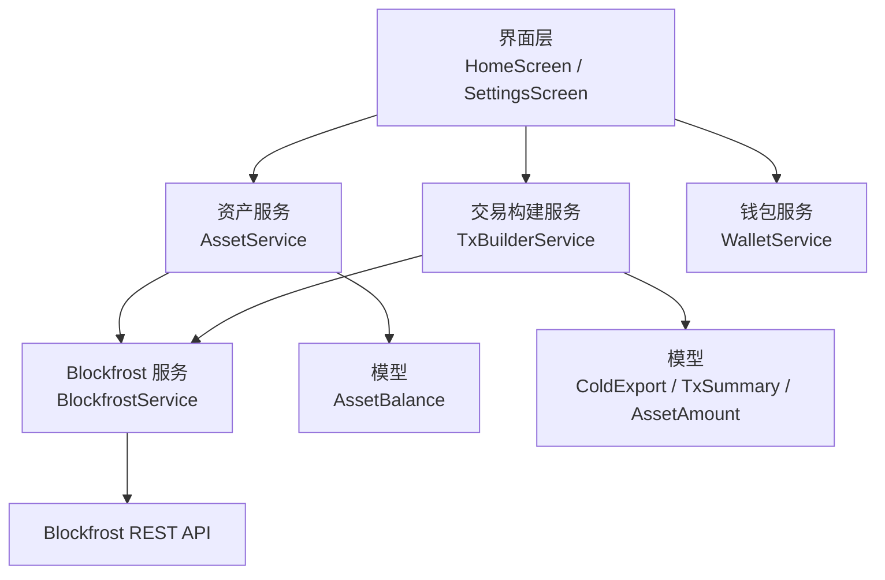
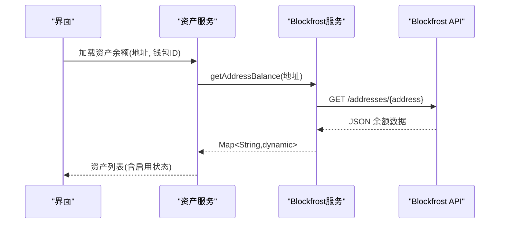
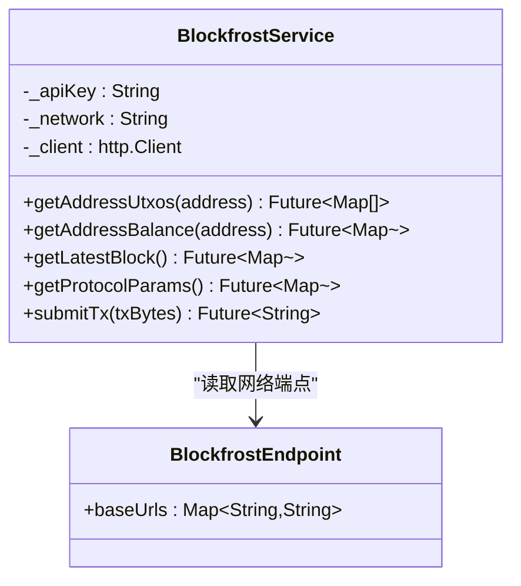
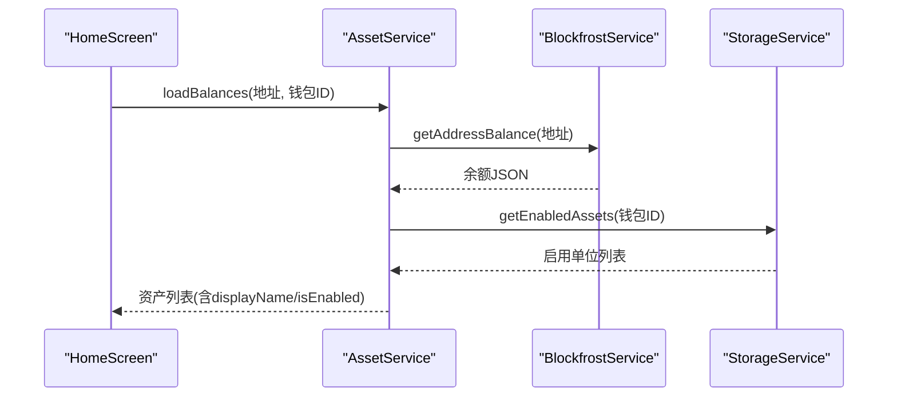
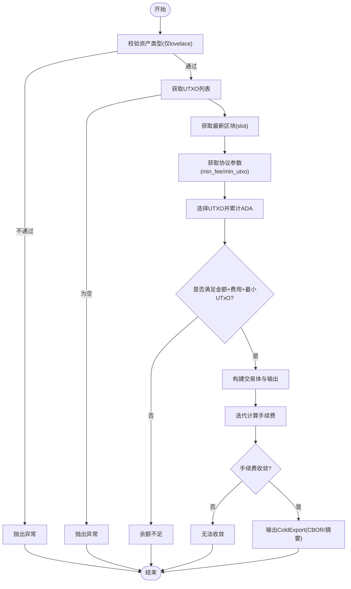
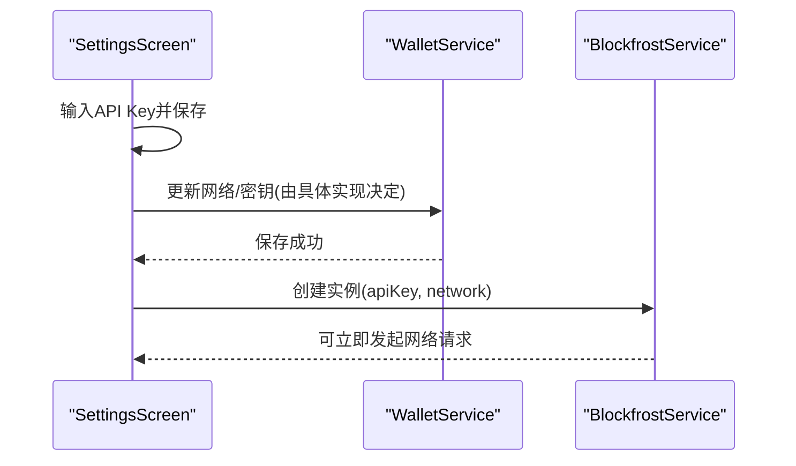
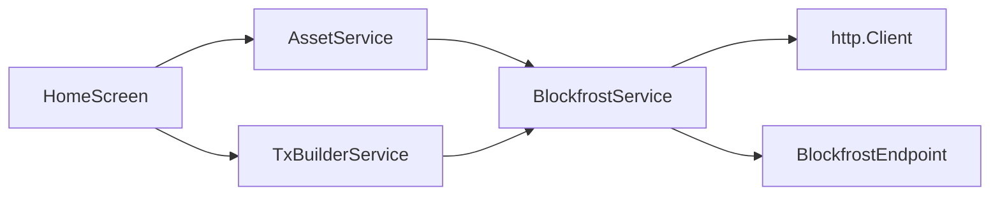

# 区块链交互服务

<cite>
**本文引用的文件**
- [blockfrost_service.dart](file://coldwallet-watch/lib/services/blockfrost_service.dart)
- [asset_service.dart](file://coldwallet-watch/lib/services/asset_service.dart)
- [tx_builder_service.dart](file://coldwallet-watch/lib/services/tx_builder_service.dart)
- [home_screen.dart](file://coldwallet-watch/lib/screens/home_screen.dart)
- [settings_screen.dart](file://coldwallet-watch/lib/screens/settings_screen.dart)
- [wallet_service.dart](file://coldwallet-watch/lib/services/wallet_service.dart)
- [asset_balance.dart](file://coldwallet-watch/lib/models/asset_balance.dart)
- [cold_export.dart](file://coldwallet-watch/lib/models/cold_export.dart)
</cite>

## 目录
1. [简介](#简介)
2. [项目结构](#项目结构)
3. [核心组件](#核心组件)
4. [架构总览](#架构总览)
5. [详细组件分析](#详细组件分析)
6. [依赖关系分析](#依赖关系分析)
7. [性能考虑](#性能考虑)
8. [故障排查指南](#故障排查指南)
9. [结论](#结论)
10. [附录：使用示例与最佳实践](#附录使用示例与最佳实践)

## 简介
本文件面向“区块链交互服务”的实现，聚焦于 Blockfrost API 集成、余额查询、UTXO 获取、交易构建与提交、网络配置管理。文档以冷钱包 Watch 端（coldwallet-watch）中的 Dart 代码为基础，解释 BlockfrostService 的核心方法调用方式、响应处理、错误策略，并给出测试网/主网切换逻辑、API Key 管理与网络超时处理的建议与实践。同时提供完整的端到端流程说明与可视化图示，帮助读者快速理解并安全地扩展该服务。

## 项目结构
- 服务层
  - BlockfrostService：封装对 Blockfrost REST API 的 HTTP 请求，提供地址 UTXO、余额、最新区块、协议参数与交易提交能力。
  - AssetService：基于 BlockfrostService 获取资产余额，结合本地启用配置生成展示列表。
  - TxBuilderService：从链上数据（UTXO、协议参数、最新区块）构建未签名交易，输出供冷端离线签名的 CBOR。
  - WalletService：钱包元数据与当前网络/地址管理等。
- 界面层
  - HomeScreen：加载并展示资产余额，触发网络请求与错误重试。
  - SettingsScreen：设置 Blockfrost API Key 与网络信息。
- 模型层
  - AssetBalance：资产余额的数据模型。
  - ColdExport/TxSummary/AssetAmount：用于热端导出给冷端的未签名交易数据。

**图表来源**
- [blockfrost_service.dart:1-108](file://coldwallet-watch/lib/services/blockfrost_service.dart#L1-L108)
- [asset_service.dart:1-49](file://coldwallet-watch/lib/services/asset_service.dart#L1-L49)
- [tx_builder_service.dart:1-152](file://coldwallet-watch/lib/services/tx_builder_service.dart#L1-L152)
- [home_screen.dart:80-107](file://coldwallet-watch/lib/screens/home_screen.dart#L80-L107)
- [settings_screen.dart:60-89](file://coldwallet-watch/lib/screens/settings_screen.dart#L60-L89)
- [wallet_service.dart:76-87](file://coldwallet-watch/lib/services/wallet_service.dart#L76-L87)

**章节来源**
- [blockfrost_service.dart:1-108](file://coldwallet-watch/lib/services/blockfrost_service.dart#L1-L108)
- [asset_service.dart:1-49](file://coldwallet-watch/lib/services/asset_service.dart#L1-L49)
- [tx_builder_service.dart:1-152](file://coldwallet-watch/lib/services/tx_builder_service.dart#L1-L152)
- [home_screen.dart:80-107](file://coldwallet-watch/lib/screens/home_screen.dart#L80-L107)
- [settings_screen.dart:60-89](file://coldwallet-watch/lib/screens/settings_screen.dart#L60-L89)
- [wallet_service.dart:76-87](file://coldwallet-watch/lib/services/wallet_service.dart#L76-L87)

## 核心组件
- BlockfrostEndpoint：维护 mainnet、preprod、preview 三个网络的 Blockfrost 基础 URL。
- BlockfrostService：统一封装 Blockfrost REST API 调用，包含：
  - getAddressUtxos(address)：获取地址所有 UTXO。
  - getAddressBalance(address)：获取地址资产余额。
  - getLatestBlock()：获取最新区块（用于 TTL）。
  - getProtocolParams()：获取协议参数（min_fee_a/b、min_utxo 等）。
  - submitTx(txBytes)：提交已签名交易的 CBOR 字节数组，返回交易哈希。
- AssetService：聚合 BlockfrostService 与存储，返回用户启用的资产列表。
- TxBuilderService：基于链上数据构建 ADA 转账的未签名交易，迭代计算手续费，输出 ColdExport。

**章节来源**
- [blockfrost_service.dart:9-108](file://coldwallet-watch/lib/services/blockfrost_service.dart#L9-L108)
- [asset_service.dart:1-49](file://coldwallet-watch/lib/services/asset_service.dart#L1-L49)
- [tx_builder_service.dart:1-152](file://coldwallet-watch/lib/services/tx_builder_service.dart#L1-L152)

## 架构总览
BlockfrostService 作为网络访问抽象层，向上为业务服务（资产、交易构建）提供稳定接口；向下通过 http.Client 发起 HTTPS 请求至 Blockfrost 端点。界面层负责组装服务实例、处理加载状态与错误提示。

**图表来源**
- [asset_service.dart:14-36](file://coldwallet-watch/lib/services/asset_service.dart#L14-L36)
- [blockfrost_service.dart:56-66](file://coldwallet-watch/lib/services/blockfrost_service.dart#L56-L66)

## 详细组件分析

### BlockfrostService 类与方法
- 网络端点选择
  - _baseUrl 根据传入 network 在 baseUrls 中查找，若不存在则回退到 preview。
- 请求头
  - 默认 Content-Type 为 application/json，并在提交交易时覆盖为 application/cbor。
  - project_id 由构造函数注入的 apiKey 提供。
- 关键方法
  - getAddressUtxos(address)：GET /addresses/{address}/utxos，返回 UTXO 列表。
  - getAddressBalance(address)：GET /addresses/{address}，返回资产余额对象。
  - getLatestBlock()：GET /blocks/latest，返回最新区块信息（含 slot）。
  - getProtocolParams()：GET /epochs/latest/parameters，返回协议参数。
  - submitTx(txBytes)：POST /tx/submit，提交 CBOR 字节数组，返回交易哈希。
- 错误处理
  - 非 200 状态码抛出异常，包含状态码与响应体，便于上层捕获与展示。

**图表来源**
- [blockfrost_service.dart:9-108](file://coldwallet-watch/lib/services/blockfrost_service.dart#L9-L108)

**章节来源**
- [blockfrost_service.dart:9-108](file://coldwallet-watch/lib/services/blockfrost_service.dart#L9-L108)

### AssetService 资产查询
- 职责：调用 BlockfrostService 获取余额，结合本地启用配置，生成带显示名称与启用状态的资产列表。
- 显示名称：lovelace 显示为 ADA，其他代币按 unit 截断或查找。
- 典型调用路径：HomeScreen -> AssetService.loadBalances -> BlockfrostService.getAddressBalance。

**图表来源**
- [asset_service.dart:14-36](file://coldwallet-watch/lib/services/asset_service.dart#L14-L36)
- [home_screen.dart:80-107](file://coldwallet-watch/lib/screens/home_screen.dart#L80-L107)

**章节来源**
- [asset_service.dart:1-49](file://coldwallet-watch/lib/services/asset_service.dart#L1-L49)
- [home_screen.dart:80-107](file://coldwallet-watch/lib/screens/home_screen.dart#L80-L107)

### TxBuilderService 交易构建
- 输入：发送方地址、接收方地址、资产列表（MVP 仅支持 lovelace）、网络标识。
- 步骤：
  - 校验资产类型（仅 lovelace）。
  - 获取 UTXO 列表，若为空则报错。
  - 获取最新区块 slot，设置 TTL（当前 slot + 固定时长）。
  - 获取协议参数（min_fee_a/b、min_utxo）。
  - 选择足够金额的 UTXO 集合，确保覆盖转账金额、手续费与最小 UTxO。
  - 构建交易体与输出，迭代计算手续费直至收敛。
  - 输出 ColdExport（包含网络、CBOR、摘要）。
- 网络映射：mainnet -> NetworkId.mainnet，否则 testnet。

**图表来源**
- [tx_builder_service.dart:11-118](file://coldwallet-watch/lib/services/tx_builder_service.dart#L11-L118)

**章节来源**
- [tx_builder_service.dart:1-152](file://coldwallet-watch/lib/services/tx_builder_service.dart#L1-L152)
- [cold_export.dart:1-110](file://coldwallet-watch/lib/models/cold_export.dart#L1-L110)

### 网络配置与 API Key 管理
- 网络端点：BlockfrostEndpoint.baseUrls 定义 mainnet/preprod/preview 的基础 URL。
- 网络选择：BlockfrostService._baseUrl 根据构造时的 network 选择对应端点，未知值回退到 preview。
- API Key：通过构造函数注入 apiKey，并在请求头中以 project_id 传递。
- 设置界面：SettingsScreen 提供输入 Blockfrost Project ID 的字段与保存按钮，用于持久化密钥。
- 地址校验：WalletService.validateAddress 检查 bech32 前缀与长度，辅助防止无效地址进入后续流程。

**图表来源**
- [settings_screen.dart:60-89](file://coldwallet-watch/lib/screens/settings_screen.dart#L60-L89)
- [blockfrost_service.dart:26-41](file://coldwallet-watch/lib/services/blockfrost_service.dart#L26-L41)
- [wallet_service.dart:76-87](file://coldwallet-watch/lib/services/wallet_service.dart#L76-L87)

**章节来源**
- [blockfrost_service.dart:9-41](file://coldwallet-watch/lib/services/blockfrost_service.dart#L9-L41)
- [settings_screen.dart:60-89](file://coldwallet-watch/lib/screens/settings_screen.dart#L60-L89)
- [wallet_service.dart:76-87](file://coldwallet-watch/lib/services/wallet_service.dart#L76-L87)

## 依赖关系分析
- BlockfrostService 依赖 http.Client 进行网络请求，依赖 BlockfrostEndpoint 提供网络端点。
- AssetService 依赖 BlockfrostService 与 StorageService（用于获取启用资产列表）。
- TxBuilderService 依赖 BlockfrostService 获取链上数据，并依赖 cardano_dart_types 构建交易。
- 界面层（HomeScreen/SettingsScreen）组合上述服务，完成用户交互与状态管理。

**图表来源**
- [blockfrost_service.dart:1-41](file://coldwallet-watch/lib/services/blockfrost_service.dart#L1-L41)
- [asset_service.dart:1-12](file://coldwallet-watch/lib/services/asset_service.dart#L1-L12)
- [tx_builder_service.dart:1-9](file://coldwallet-watch/lib/services/tx_builder_service.dart#L1-L9)
- [home_screen.dart:80-107](file://coldwallet-watch/lib/screens/home_screen.dart#L80-L107)

**章节来源**
- [blockfrost_service.dart:1-41](file://coldwallet-watch/lib/services/blockfrost_service.dart#L1-L41)
- [asset_service.dart:1-12](file://coldwallet-watch/lib/services/asset_service.dart#L1-L12)
- [tx_builder_service.dart:1-9](file://coldwallet-watch/lib/services/tx_builder_service.dart#L1-L9)
- [home_screen.dart:80-107](file://coldwallet-watch/lib/screens/home_screen.dart#L80-L107)

## 性能考虑
- 连接复用：复用 http.Client 实例可减少握手开销，避免频繁创建销毁连接。
- 并发控制：批量查询（如多地址余额）建议使用并发限制与超时保护，避免阻塞 UI。
- 缓存策略：协议参数与最新区块可短期缓存，减少重复请求。
- 分页与限流：UTXO 列表可能较大，注意服务端分页与速率限制；必要时增加退避重试。
- 序列化成本：交易构建涉及多次序列化与手续费迭代，应限制迭代次数并尽早失败。

[本节为通用指导，无需特定文件引用]

## 故障排查指南
- 常见错误
  - 非 200 状态码：BlockfrostService 在各方法中抛出异常，包含状态码与响应体，便于定位问题。
  - 余额不足：TxBuilderService 在选择 UTXO 后校验是否足以支付转账金额、手续费与最小 UTxO，不足则抛出异常。
  - 无法收敛：手续费迭代超过上限仍未收敛，抛出异常提示调整初始估算或网络参数。
- 重试机制
  - 当前实现未内置指数退避重试，建议在调用方（如界面或服务层）对网络异常进行重试包装。
- 超时处理
  - 当前未显式设置超时，建议在 http.Client 初始化时配置超时时间，避免长时间挂起。
- 日志与诊断
  - 记录请求 URL、状态码与响应体片段（脱敏），有助于快速定位 Blockfrost 侧错误。

**章节来源**
- [blockfrost_service.dart:43-107](file://coldwallet-watch/lib/services/blockfrost_service.dart#L43-L107)
- [tx_builder_service.dart:23-118](file://coldwallet-watch/lib/services/tx_builder_service.dart#L23-L118)

## 结论
该区块链交互服务以 BlockfrostService 为核心，围绕余额查询、UTXO 获取、交易构建与提交形成完整链路。通过清晰的网络端点管理、统一的错误抛出与可扩展的服务分层，既满足了 MVP 阶段的 ADA 转账需求，也为后续扩展原生代币与更复杂的交易场景奠定基础。建议在后续版本中加入重试、超时、缓存与更完善的错误分类，以提升稳定性与用户体验。

[本节为总结性内容，无需特定文件引用]

## 附录：使用示例与最佳实践

### 查询账户余额
- 调用路径：HomeScreen 构造 BlockfrostService -> AssetService.loadBalances -> BlockfrostService.getAddressBalance。
- 关键点：
  - 传入正确的 network 与 apiKey。
  - 解析返回的 amount 列表，结合本地启用配置生成展示数据。
- 参考路径
  - [home_screen.dart:80-107](file://coldwallet-watch/lib/screens/home_screen.dart#L80-L107)
  - [asset_service.dart:14-36](file://coldwallet-watch/lib/services/asset_service.dart#L14-L36)
  - [blockfrost_service.dart:56-66](file://coldwallet-watch/lib/services/blockfrost_service.dart#L56-L66)

### 获取未花费交易输出（UTXO）
- 调用路径：TxBuilderService.buildTransferTx -> BlockfrostService.getAddressUtxos。
- 关键点：
  - 若 UTXO 为空，需提示用户充值或更换地址。
  - 选择 UTXO 时需累计 ADA 并满足最小 UTxO 约束。
- 参考路径
  - [tx_builder_service.dart:23-58](file://coldwallet-watch/lib/services/tx_builder_service.dart#L23-L58)
  - [blockfrost_service.dart:43-54](file://coldwallet-watch/lib/services/blockfrost_service.dart#L43-L54)

### 提交已签名交易
- 调用路径：冷端签名后，热端调用 BlockfrostService.submitTx 提交 CBOR 字节数组。
- 关键点：
  - 请求头 Content-Type 必须为 application/cbor。
  - 非 200 状态码抛出异常，需在上层捕获并提示用户重试或检查网络。
- 参考路径
  - [blockfrost_service.dart:92-107](file://coldwallet-watch/lib/services/blockfrost_service.dart#L92-L107)

### 网络配置与切换
- 网络端点：通过 BlockfrostEndpoint.baseUrls 管理 mainnet/preprod/preview。
- 切换逻辑：BlockfrostService._baseUrl 根据 network 选择端点，未知值回退到 preview。
- API Key：通过 SettingsScreen 输入并保存，随后在构造 BlockfrostService 时注入。
- 参考路径
  - [blockfrost_service.dart:9-41](file://coldwallet-watch/lib/services/blockfrost_service.dart#L9-L41)
  - [settings_screen.dart:60-89](file://coldwallet-watch/lib/screens/settings_screen.dart#L60-L89)

### 错误处理与重试建议
- 错误分类：网络错误、鉴权错误、业务错误（余额不足、UTXO 为空）。
- 重试策略：对瞬时错误（如 429/5xx）采用指数退避重试；对鉴权错误直接提示用户更新 API Key。
- 超时设置：为 http.Client 配置合理的超时时间，避免长连接占用资源。
- 参考路径
  - [blockfrost_service.dart:43-107](file://coldwallet-watch/lib/services/blockfrost_service.dart#L43-L107)
  - [tx_builder_service.dart:23-118](file://coldwallet-watch/lib/services/tx_builder_service.dart#L23-L118)

### 最佳实践
- 将 BlockfrostService 作为单一网络访问入口，集中处理错误与日志。
- 对高频只读数据（协议参数、最新区块）实施短期缓存。
- 在 UI 层提供明确的用户反馈（加载中、错误提示、重试按钮）。
- 严格校验输入（地址格式、资产类型），尽早失败以减少无效请求。
- 保持网络配置与密钥管理的可配置性与安全性（避免硬编码密钥）。

[本节为实践建议，无需特定文件引用]