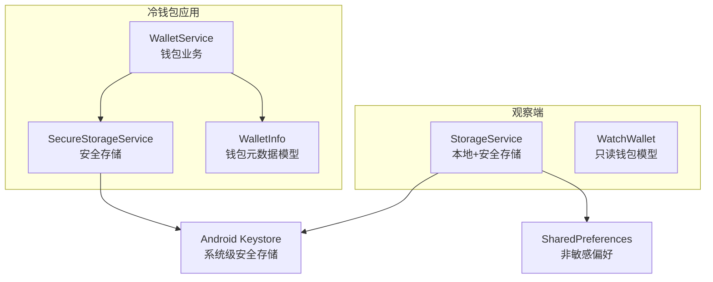
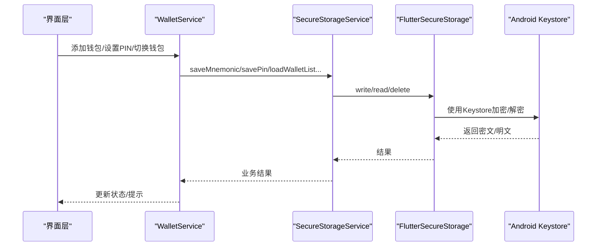
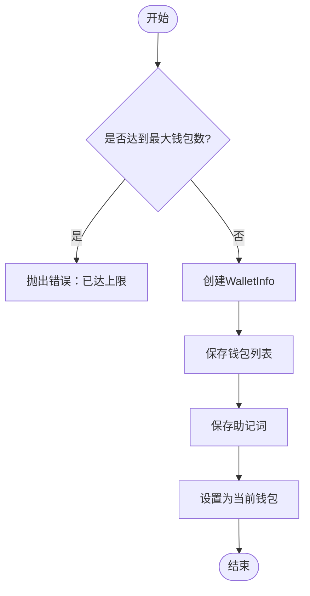
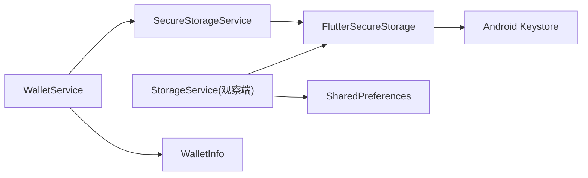

# 安全存储服务

<cite>
**本文引用的文件**
- [secure_storage_service.dart](file://coldwallet-app/lib/services/secure_storage_service.dart)
- [wallet_service.dart](file://coldwallet-app/lib/services/wallet_service.dart)
- [wallet_info.dart](file://coldwallet-app/lib/models/wallet_info.dart)
- [storage_service.dart](file://coldwallet-watch/lib/services/storage_service.dart)
- [watch_wallet.dart](file://coldwallet-watch/lib/models/watch_wallet.dart)
- [confirm_sign_screen.dart](file://coldwallet-app/lib/screens/confirm_sign_screen.dart)
- [wallet_setup_screen.dart](file://coldwallet-app/lib/screens/wallet_setup_screen.dart)
</cite>

## 目录
1. [简介](#简介)
2. [项目结构](#项目结构)
3. [核心组件](#核心组件)
4. [架构总览](#架构总览)
5. [详细组件分析](#详细组件分析)
6. [依赖关系分析](#依赖关系分析)
7. [性能与安全考量](#性能与安全考量)
8. [故障排查指南](#故障排查指南)
9. [结论](#结论)
10. [附录：使用示例与最佳实践](#附录使用示例与最佳实践)

## 简介
本文件面向冷钱包应用的安全存储子系统，聚焦 Android Keystore 集成、助记词安全存储、PIN 码验证机制与多钱包数据管理。文档围绕 SecureStorageService 的核心 API（saveMnemonic、readMnemonic、savePin、verifyPin、loadWalletList 等）展开，解释其实现原理、数据加密策略、密钥管理机制与防篡改措施，并给出与 Android 原生 Keystore 的交互方式、权限配置与安全最佳实践。同时提供代码级流程图与时序图，帮助读者理解关键流程。

## 项目结构
本项目包含两个 Flutter 应用模块：
- coldwallet-app：冷钱包主应用，负责助记词生成、导入、签名与本地安全存储。
- coldwallet-watch：只读观察端，仅保存公开地址与元数据，敏感信息通过安全存储保存 API Key。

安全存储相关的关键位置：
- 冷钱包应用：services/secure_storage_service.dart、services/wallet_service.dart、models/wallet_info.dart
- 观察端：services/storage_service.dart、models/watch_wallet.dart
- 界面层：screens/confirm_sign_screen.dart、screens/wallet_setup_screen.dart

图表来源
- [secure_storage_service.dart:1-107](file://coldwallet-app/lib/services/secure_storage_service.dart#L1-L107)
- [wallet_service.dart:1-208](file://coldwallet-app/lib/services/wallet_service.dart#L1-L208)
- [wallet_info.dart:1-56](file://coldwallet-app/lib/models/wallet_info.dart#L1-L56)
- [storage_service.dart:1-87](file://coldwallet-watch/lib/services/storage_service.dart#L1-L87)
- [watch_wallet.dart:1-79](file://coldwallet-watch/lib/models/watch_wallet.dart#L1-L79)

章节来源
- [secure_storage_service.dart:1-107](file://coldwallet-app/lib/services/secure_storage_service.dart#L1-L107)
- [wallet_service.dart:1-208](file://coldwallet-app/lib/services/wallet_service.dart#L1-L208)
- [wallet_info.dart:1-56](file://coldwallet-app/lib/models/wallet_info.dart#L1-L56)
- [storage_service.dart:1-87](file://coldwallet-watch/lib/services/storage_service.dart#L1-L87)
- [watch_wallet.dart:1-79](file://coldwallet-watch/lib/models/watch_wallet.dart#L1-L79)

## 核心组件
- SecureStorageService：封装 FlutterSecureStorage，基于 Android Keystore 对敏感数据进行加密持久化。提供钱包列表、助记词、当前钱包、网络设置与 PIN 的存取能力。
- WalletService（冷钱包）：业务层，组合 SecureStorageService，提供助记词生成/校验、钱包创建/删除、当前钱包切换、网络设置与 PIN 操作。
- StorageService（观察端）：混合存储策略，非敏感数据用 SharedPreferences，敏感 API Key 用 FlutterSecureStorage。
- 数据模型：WalletInfo（冷钱包元数据）、WatchWallet（观察端只读钱包）。

章节来源
- [secure_storage_service.dart:1-107](file://coldwallet-app/lib/services/secure_storage_service.dart#L1-L107)
- [wallet_service.dart:1-208](file://coldwallet-app/lib/services/wallet_service.dart#L1-L208)
- [storage_service.dart:1-87](file://coldwallet-watch/lib/services/storage_service.dart#L1-L87)
- [wallet_info.dart:1-56](file://coldwallet-app/lib/models/wallet_info.dart#L1-L56)
- [watch_wallet.dart:1-79](file://coldwallet-watch/lib/models/watch_wallet.dart#L1-L79)

## 架构总览
下图展示冷钱包应用中“业务层—安全存储—系统安全”的分层关系与调用路径。

图表来源
- [wallet_service.dart:135-152](file://coldwallet-app/lib/services/wallet_service.dart#L135-L152)
- [secure_storage_service.dart:27-56](file://coldwallet-app/lib/services/secure_storage_service.dart#L27-L56)
- [secure_storage_service.dart:80-98](file://coldwallet-app/lib/services/secure_storage_service.dart#L80-L98)

## 详细组件分析

### SecureStorageService 核心方法
- loadWalletList()：从安全存储读取钱包列表 JSON，反序列化为 WalletInfo 列表；空值时返回空列表。
- saveWalletList(wallets)：将钱包列表编码为 JSON 后写入安全存储。
- saveMnemonic(walletId, mnemonic)：按 wallet_{id}_mnemonic 键隔离存储助记词。
- readMnemonic(walletId)：读取指定钱包的助记词。
- deleteMnemonic(walletId)：删除指定钱包的助记词。
- setCurrentWalletId(id)/getCurrentWalletId()：维护当前选中钱包。
- setCurrentNetwork(network)/getCurrentNetwork()：维护全局网络设置。
- savePin(pin)/verifyPin(pin)/hasPin()：保存、校验与检查是否存在 PIN。
- clearAll()：清空所有存储数据。

安全要点
- 敏感数据通过 FlutterSecureStorage 落盘，底层由 Android Keystore 提供硬件级保护。
- 助记词按钱包 ID 隔离存储，避免跨钱包泄露。
- PIN 目前以明文形式存储（存在 TODO），建议后续改为哈希存储（如 PBKDF2/Argon2）并在内存中比较。

章节来源
- [secure_storage_service.dart:27-56](file://coldwallet-app/lib/services/secure_storage_service.dart#L27-L56)
- [secure_storage_service.dart:60-76](file://coldwallet-app/lib/services/secure_storage_service.dart#L60-L76)
- [secure_storage_service.dart:80-98](file://coldwallet-app/lib/services/secure_storage_service.dart#L80-L98)
- [secure_storage_service.dart:102-105](file://coldwallet-app/lib/services/secure_storage_service.dart#L102-L105)

### WalletService（冷钱包）业务流程
- 助记词生成与校验：使用 SDK 安全随机源生成 24 词助记词，支持骰子熵输入与 BIP-39 校验。
- 钱包创建：生成唯一 WalletInfo，保存钱包列表与助记词，并设为当前钱包。
- 钱包删除：删除助记词与元数据，若删除的是当前钱包则自动切换至第一个或清空。
- 网络设置：读写全局网络（mainnet/testnet）。
- PIN 操作：委托 SecureStorageService 完成保存与校验。

图表来源
- [wallet_service.dart:135-152](file://coldwallet-app/lib/services/wallet_service.dart#L135-L152)

章节来源
- [wallet_service.dart:20-56](file://coldwallet-app/lib/services/wallet_service.dart#L20-L56)
- [wallet_service.dart:135-175](file://coldwallet-app/lib/services/wallet_service.dart#L135-L175)
- [wallet_service.dart:179-192](file://coldwallet-app/lib/services/wallet_service.dart#L179-L192)
- [wallet_service.dart:196-206](file://coldwallet-app/lib/services/wallet_service.dart#L196-L206)

### 观察端 StorageService 与只读钱包
- 非敏感数据（钱包列表、当前钱包、启用资产）使用 SharedPreferences 明文存储。
- 敏感数据（Blockfrost API Key）使用 FlutterSecureStorage 加密存储。
- WatchWallet 仅包含公钥地址与元数据，不包含私钥或助记词。

章节来源
- [storage_service.dart:1-87](file://coldwallet-watch/lib/services/storage_service.dart#L1-L87)
- [watch_wallet.dart:1-79](file://coldwallet-watch/lib/models/watch_wallet.dart#L1-L79)

### 助记词安全存储与多钱包隔离
- 存储键规划：wallet_list、wallet_{id}_mnemonic、current_wallet_id、current_network、wallet_pin_hash。
- 每个钱包的助记词独立隔离，避免单点泄露影响其他钱包。
- 钱包列表与助记词分离存储，降低耦合度。

章节来源
- [secure_storage_service.dart:10-22](file://coldwallet-app/lib/services/secure_storage_service.dart#L10-L22)
- [wallet_info.dart:1-56](file://coldwallet-app/lib/models/wallet_info.dart#L1-L56)

### PIN 码验证机制与改进建议
- 当前实现：savePin 直接保存明文，verifyPin 进行字符串相等比较。
- 风险：明文存储易被提取；无抗暴力破解机制。
- 建议：
  - 使用 PBKDF2/Argon2 对 PIN 进行加盐哈希存储。
  - 在 verifyPin 中进行哈希比对，避免明文暴露。
  - 增加失败次数限制与延迟响应，抵御离线字典攻击。
  - 结合设备生物识别或一次性解锁令牌提升体验与安全。

章节来源
- [secure_storage_service.dart:80-98](file://coldwallet-app/lib/services/secure_storage_service.dart#L80-L98)
- [wallet_setup_screen.dart:279-319](file://coldwallet-app/lib/screens/wallet_setup_screen.dart#L279-L319)

### 与 Android Keystore 的交互与权限
- 通过 FlutterSecureStorage 访问 Android Keystore，无需额外权限声明即可使用默认安全存储选项。
- 如需自定义 Keystore 行为（如生物识别绑定、强制屏幕锁定），可在初始化 FlutterSecureStorage 时传入 AndroidOptions。
- 建议在 AndroidManifest 中保持最小权限原则，避免不必要的敏感权限。

章节来源
- [secure_storage_service.dart:1-22](file://coldwallet-app/lib/services/secure_storage_service.dart#L1-L22)
- [storage_service.dart:23-28](file://coldwallet-watch/lib/services/storage_service.dart#L23-L28)

## 依赖关系分析
- WalletService 依赖 SecureStorageService 完成敏感数据持久化。
- SecureStorageService 依赖 FlutterSecureStorage，后者依赖 Android Keystore。
- 观察端 StorageService 依赖 SharedPreferences 与 FlutterSecureStorage。
- 模型 WalletInfo 与 WatchWallet 分别用于序列化/反序列化钱包元数据。

图表来源
- [wallet_service.dart:13-17](file://coldwallet-app/lib/services/wallet_service.dart#L13-L17)
- [secure_storage_service.dart:1-22](file://coldwallet-app/lib/services/secure_storage_service.dart#L1-L22)
- [storage_service.dart:18-28](file://coldwallet-watch/lib/services/storage_service.dart#L18-L28)
- [wallet_info.dart:1-56](file://coldwallet-app/lib/models/wallet_info.dart#L1-L56)

章节来源
- [wallet_service.dart:1-208](file://coldwallet-app/lib/services/wallet_service.dart#L1-L208)
- [secure_storage_service.dart:1-107](file://coldwallet-app/lib/services/secure_storage_service.dart#L1-L107)
- [storage_service.dart:1-87](file://coldwallet-watch/lib/services/storage_service.dart#L1-L87)
- [wallet_info.dart:1-56](file://coldwallet-app/lib/models/wallet_info.dart#L1-L56)

## 性能与安全考量
- 性能
  - 助记词与钱包列表体积较小，I/O 开销可忽略。
  - 频繁切换钱包时注意避免重复解析 JSON，可在内存缓存短期结果。
- 安全
  - 敏感数据一律通过 FlutterSecureStorage 存储，利用 Keystore 硬件保护。
  - 助记词按钱包隔离，避免横向泄露。
  - PIN 应尽快迁移到哈希存储，防止明文泄露。
  - 日志与调试输出需脱敏，禁止记录助记词、私钥、PIN。
  - 导出/导入功能需确保中间文件加密且及时清理。

[本节为通用指导，不直接分析具体文件]

## 故障排查指南
- 助记词为空或无法加载
  - 检查对应 wallet_{id}_mnemonic 键是否存在。
  - 确认 addWallet 流程是否完整执行（保存列表、保存助记词、设置当前钱包）。
- PIN 校验失败
  - 当前为明文比较，确认保存与输入的 PIN 一致。
  - 建议升级为哈希比较，避免误判。
- 钱包列表异常
  - 检查 WalletListCodec 编解码逻辑与 JSON 格式。
  - 确认 saveWalletList 覆盖写入成功。
- 观察端 API Key 丢失
  - 检查 FlutterSecureStorage 的 key 是否正确，必要时重新设置。

章节来源
- [secure_storage_service.dart:27-56](file://coldwallet-app/lib/services/secure_storage_service.dart#L27-L56)
- [secure_storage_service.dart:80-98](file://coldwallet-app/lib/services/secure_storage_service.dart#L80-L98)
- [wallet_service.dart:135-175](file://coldwallet-app/lib/services/wallet_service.dart#L135-L175)
- [storage_service.dart:62-74](file://coldwallet-watch/lib/services/storage_service.dart#L62-L74)

## 结论
该安全存储方案通过 FlutterSecureStorage 与 Android Keystore 的结合，实现了助记词、PIN 与钱包元数据的本地加密持久化。多钱包隔离设计降低了单点风险。当前 PIN 采用明文存储，建议尽快升级为哈希存储并引入抗暴力破解机制。整体架构清晰、职责分明，便于扩展与维护。

[本节为总结性内容，不直接分析具体文件]

## 附录：使用示例与最佳实践
- 安全存储敏感数据
  - 使用 SecureStorageService.saveMnemonic 保存助记词，使用 saveWalletList 保存钱包列表。
  - 参考路径：[secure_storage_service.dart:44-56](file://coldwallet-app/lib/services/secure_storage_service.dart#L44-L56)、[secure_storage_service.dart:34-39](file://coldwallet-app/lib/services/secure_storage_service.dart#L34-L39)
- 实现 PIN 码保护
  - 使用 savePin 与 verifyPin 进行设置与校验；建议后续替换为哈希存储。
  - 参考路径：[secure_storage_service.dart:80-98](file://coldwallet-app/lib/services/secure_storage_service.dart#L80-L98)
- 处理存储异常
  - 在界面层捕获异常并提示用户，避免崩溃。
  - 参考路径：[confirm_sign_screen.dart:37-60](file://coldwallet-app/lib/screens/confirm_sign_screen.dart#L37-L60)
- 多钱包数据管理
  - 使用 WalletService.addWallet 创建钱包，deleteWallet 删除钱包，switchWallet 切换当前钱包。
  - 参考路径：[wallet_service.dart:135-175](file://coldwallet-app/lib/services/wallet_service.dart#L135-L175)
- 观察端只读存储
  - 使用 StorageService 管理只读钱包列表与 API Key。
  - 参考路径：[storage_service.dart:30-74](file://coldwallet-watch/lib/services/storage_service.dart#L30-L74)

章节来源
- [secure_storage_service.dart:34-56](file://coldwallet-app/lib/services/secure_storage_service.dart#L34-L56)
- [secure_storage_service.dart:80-98](file://coldwallet-app/lib/services/secure_storage_service.dart#L80-L98)
- [wallet_service.dart:135-175](file://coldwallet-app/lib/services/wallet_service.dart#L135-L175)
- [confirm_sign_screen.dart:37-60](file://coldwallet-app/lib/screens/confirm_sign_screen.dart#L37-L60)
- [storage_service.dart:30-74](file://coldwallet-watch/lib/services/storage_service.dart#L30-L74)