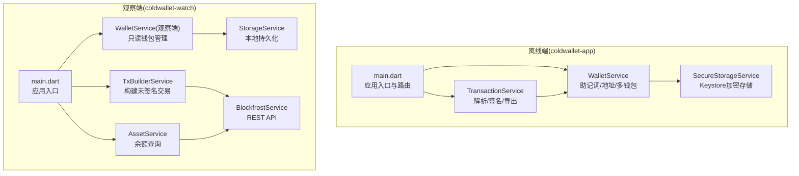
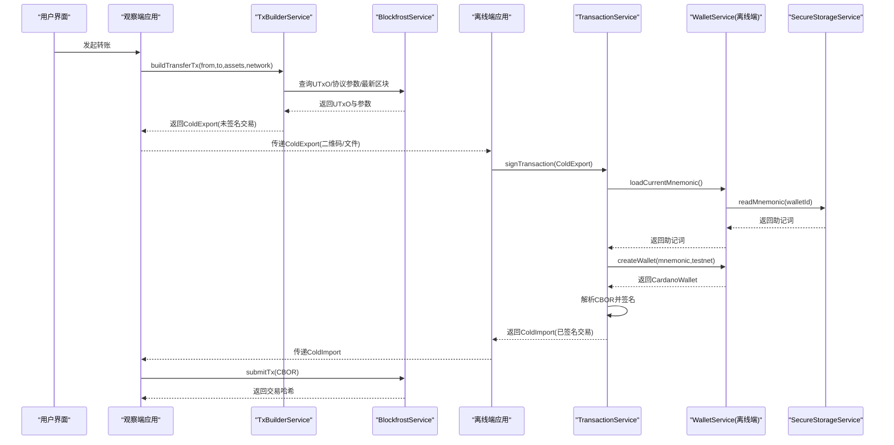
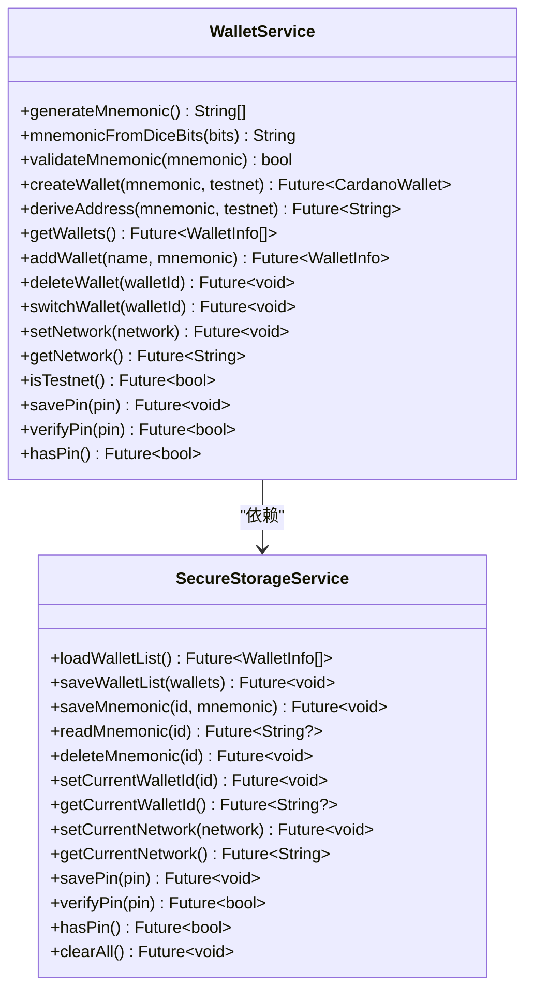
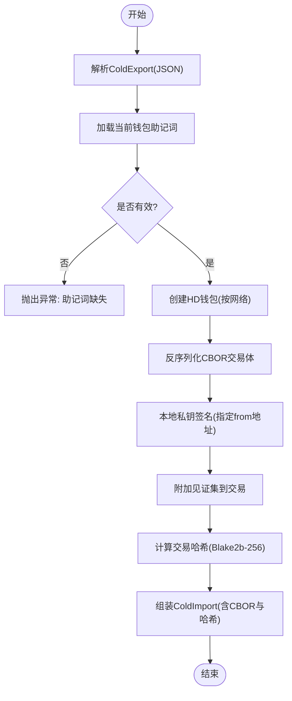
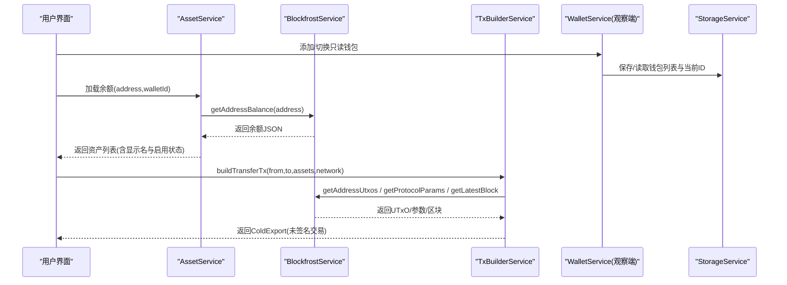
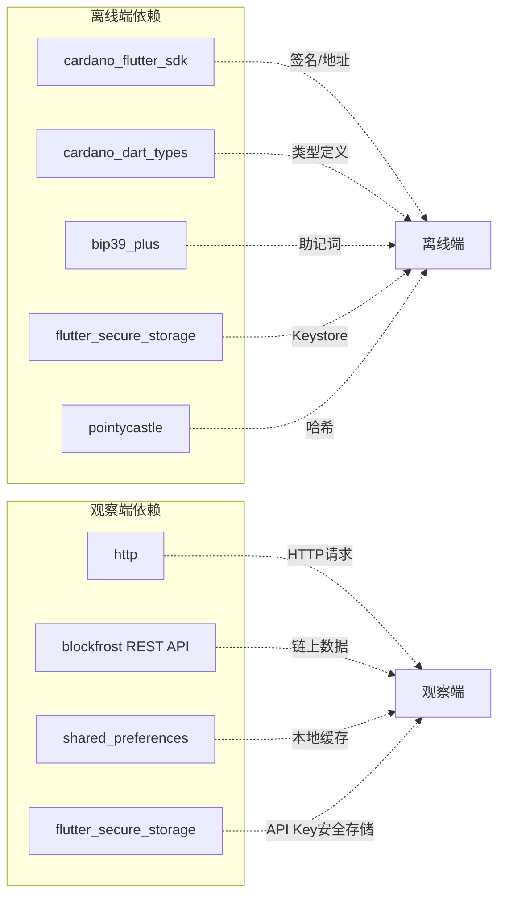

# 核心服务

<cite>
**本文引用的文件**
- [coldwallet-app/lib/main.dart](file://coldwallet-app/lib/main.dart)
- [coldwallet-app/lib/services/wallet_service.dart](file://coldwallet-app/lib/services/wallet_service.dart)
- [coldwallet-app/lib/services/transaction_service.dart](file://coldwallet-app/lib/services/transaction_service.dart)
- [coldwallet-app/lib/services/secure_storage_service.dart](file://coldwallet-app/lib/services/secure_storage_service.dart)
- [coldwallet-watch/lib/main.dart](file://coldwallet-watch/lib/main.dart)
- [coldwallet-watch/lib/services/blockfrost_service.dart](file://coldwallet-watch/lib/services/blockfrost_service.dart)
- [coldwallet-watch/lib/services/tx_builder_service.dart](file://coldwallet-watch/lib/services/tx_builder_service.dart)
- [coldwallet-watch/lib/services/wallet_service.dart](file://coldwallet-watch/lib/services/wallet_service.dart)
- [coldwallet-watch/lib/services/storage_service.dart](file://coldwallet-watch/lib/services/storage_service.dart)
- [coldwallet-watch/lib/services/asset_service.dart](file://coldwallet-watch/lib/services/asset_service.dart)
</cite>

## 目录
1. [简介](#简介)
2. [项目结构](#项目结构)
3. [核心组件](#核心组件)
4. [架构总览](#架构总览)
5. [详细组件分析](#详细组件分析)
6. [依赖关系分析](#依赖关系分析)
7. [性能考量](#性能考量)
8. [故障排查指南](#故障排查指南)
9. [结论](#结论)
10. [附录：API与使用示例](#附录api与使用示例)

## 简介
本仓库包含两个 Flutter 应用，构成 Cardano 冷钱包方案：
- 离线端（coldwallet-app）：负责助记词生成、地址派生、多钱包管理、交易构建的离线签名与导出。
- 联网观察端（coldwallet-watch）：负责余额查询、UTxO 获取、未签名交易构建、已签名交易提交等链上交互。

整体设计遵循“密钥不出设备”的冷钱包原则：离线端完成私钥与签名，仅通过结构化数据（CBOR 交易体、哈希等）与观察端交换。

## 项目结构
- 离线端入口与路由配置在 coldwallet-app/lib/main.dart，提供首页、钱包设置、扫码签名等页面路由。
- 离线端核心服务位于 services 目录：
  - wallet_service.dart：助记词生成、地址派生、多钱包管理、网络与 PIN 管理。
  - transaction_service.dart：解析未签名交易、本地签名、输出已签名交易。
  - secure_storage_service.dart：基于 Android Keystore 的安全存储封装。
- 观察端入口在 coldwallet-watch/lib/main.dart，启动只读观察应用。
- 观察端核心服务位于 services 目录：
  - blockfrost_service.dart：Blockfrost API 集成（UTxO、余额、协议参数、交易提交）。
  - tx_builder_service.dart：构建 ADA 转账的未签名交易（MVP 阶段）。
  - wallet_service.dart：只读钱包增删改查与当前钱包切换。
  - storage_service.dart：本地持久化（SharedPreferences + 安全存储 API Key）。
  - asset_service.dart：资产余额查询与显示名称处理。

图表来源
- [coldwallet-app/lib/main.dart:1-51](file://coldwallet-app/lib/main.dart#L1-L51)
- [coldwallet-watch/lib/main.dart:1-12](file://coldwallet-watch/lib/main.dart#L1-L12)
- [coldwallet-app/lib/services/wallet_service.dart:1-208](file://coldwallet-app/lib/services/wallet_service.dart#L1-L208)
- [coldwallet-app/lib/services/transaction_service.dart:1-70](file://coldwallet-app/lib/services/transaction_service.dart#L1-L70)
- [coldwallet-app/lib/services/secure_storage_service.dart:1-107](file://coldwallet-app/lib/services/secure_storage_service.dart#L1-L107)
- [coldwallet-watch/lib/services/blockfrost_service.dart:1-109](file://coldwallet-watch/lib/services/blockfrost_service.dart#L1-L109)
- [coldwallet-watch/lib/services/tx_builder_service.dart:1-152](file://coldwallet-watch/lib/services/tx_builder_service.dart#L1-L152)
- [coldwallet-watch/lib/services/wallet_service.dart:1-88](file://coldwallet-watch/lib/services/wallet_service.dart#L1-L88)
- [coldwallet-watch/lib/services/storage_service.dart:1-87](file://coldwallet-watch/lib/services/storage_service.dart#L1-L87)
- [coldwallet-watch/lib/services/asset_service.dart:1-49](file://coldwallet-watch/lib/services/asset_service.dart#L1-L49)

章节来源
- [coldwallet-app/lib/main.dart:1-51](file://coldwallet-app/lib/main.dart#L1-L51)
- [coldwallet-watch/lib/main.dart:1-12](file://coldwallet-watch/lib/main.dart#L1-L12)

## 核心组件
- 钱包管理服务（离线端）
  - 助记词生成与校验、从熵生成助记词、HD 钱包创建、地址派生（CIP-1852）。
  - 多钱包管理（最多 5 个）、当前钱包切换、网络设置、PIN 管理。
- 交易处理服务（离线端）
  - 解析 ColdExport（未签名交易 JSON），使用本地私钥签名，输出 ColdImport（含 CBOR 与交易哈希）。
- 安全存储服务（离线端）
  - 基于 FlutterSecureStorage（Android Keystore）加密保存助记词、PIN、钱包列表、网络设置。
- 区块链交互服务（观察端）
  - BlockfrostService：UTxO 查询、地址余额、最新区块、协议参数、交易提交。
  - TxBuilderService：构建 ADA 转账的未签名交易（MVP）。
  - AssetService：资产余额查询与展示名处理。
  - 观察端 WalletService：只读钱包管理（增删改查、当前钱包切换、地址格式校验）。
  - StorageService：本地持久化（SharedPreferences + 安全存储 API Key）。

章节来源
- [coldwallet-app/lib/services/wallet_service.dart:1-208](file://coldwallet-app/lib/services/wallet_service.dart#L1-L208)
- [coldwallet-app/lib/services/transaction_service.dart:1-70](file://coldwallet-app/lib/services/transaction_service.dart#L1-L70)
- [coldwallet-app/lib/services/secure_storage_service.dart:1-107](file://coldwallet-app/lib/services/secure_storage_service.dart#L1-L107)
- [coldwallet-watch/lib/services/blockfrost_service.dart:1-109](file://coldwallet-watch/lib/services/blockfrost_service.dart#L1-L109)
- [coldwallet-watch/lib/services/tx_builder_service.dart:1-152](file://coldwallet-watch/lib/services/tx_builder_service.dart#L1-L152)
- [coldwallet-watch/lib/services/wallet_service.dart:1-88](file://coldwallet-watch/lib/services/wallet_service.dart#L1-L88)
- [coldwallet-watch/lib/services/storage_service.dart:1-87](file://coldwallet-watch/lib/services/storage_service.dart#L1-L87)
- [coldwallet-watch/lib/services/asset_service.dart:1-49](file://coldwallet-watch/lib/services/asset_service.dart#L1-L49)

## 架构总览
离线端与观察端通过结构化数据（ColdExport/ColdImport）协作：
- 观察端根据地址与 UTxO 构建未签名交易（ColdExport）。
- 离线端解析 ColdExport，用本地私钥签名后返回 ColdImport（含已签名 CBOR 与交易哈希）。
- 观察端将已签名交易提交至 Blockfrost。

图表来源
- [coldwallet-watch/lib/services/tx_builder_service.dart:1-152](file://coldwallet-watch/lib/services/tx_builder_service.dart#L1-L152)
- [coldwallet-watch/lib/services/blockfrost_service.dart:1-109](file://coldwallet-watch/lib/services/blockfrost_service.dart#L1-L109)
- [coldwallet-app/lib/services/transaction_service.dart:1-70](file://coldwallet-app/lib/services/transaction_service.dart#L1-L70)
- [coldwallet-app/lib/services/wallet_service.dart:1-208](file://coldwallet-app/lib/services/wallet_service.dart#L1-L208)
- [coldwallet-app/lib/services/secure_storage_service.dart:1-107](file://coldwallet-app/lib/services/secure_storage_service.dart#L1-L107)

## 详细组件分析

### 钱包管理服务（离线端）
职责
- 助记词生成与校验、从骰子熵生成助记词。
- HD 钱包创建与地址派生（CIP-1852）。
- 多钱包管理（最多 5 个）、当前钱包切换、网络设置、PIN 管理。

关键方法
- generateMnemonic(): 生成 24 词助记词。
- mnemonicFromDiceBits(bits): 从 256 位布尔序列生成助记词。
- validateMnemonic(mnemonic): 校验助记词有效性。
- createWallet(mnemonic, testnet): 创建 HD 钱包。
- deriveAddress(mnemonic, testnet): 派生第一个外部支付地址。
- getWallets()/addWallet()/deleteWallet()/switchWallet(): 多钱包管理。
- setNetwork()/getNetwork()/isTestnet(): 全局网络设置。
- savePin()/verifyPin()/hasPin(): PIN 管理。

错误处理
- 助记词长度或格式不合法时抛出异常或返回 false。
- 钱包数量达到上限时抛出状态错误。
- 删除当前钱包时自动切换到首个钱包或清空当前 ID。

最佳实践
- 始终通过 SecureStorageService 存取敏感数据，避免明文落盘。
- 切换网络时需确保后续交易构建与签名一致。

图表来源
- [coldwallet-app/lib/services/wallet_service.dart:1-208](file://coldwallet-app/lib/services/wallet_service.dart#L1-L208)
- [coldwallet-app/lib/services/secure_storage_service.dart:1-107](file://coldwallet-app/lib/services/secure_storage_service.dart#L1-L107)

章节来源
- [coldwallet-app/lib/services/wallet_service.dart:1-208](file://coldwallet-app/lib/services/wallet_service.dart#L1-L208)
- [coldwallet-app/lib/services/secure_storage_service.dart:1-107](file://coldwallet-app/lib/services/secure_storage_service.dart#L1-L107)

### 交易处理服务（离线端）
职责
- 解析 ColdExport（未签名交易 JSON）。
- 使用本地私钥对交易进行签名。
- 输出 ColdImport（包含已签名 CBOR 与交易哈希）。

关键流程
- parseColdExport(jsonString): 解析 JSON 为 ColdExport。
- signTransaction(coldExport):
  - 加载当前钱包助记词。
  - 创建 HD 钱包并解析 CBOR 交易体。
  - 调用 SDK 签名并附加见证集。
  - 计算交易哈希（Blake2b-256）。
  - 返回 ColdImport。

错误处理
- 当前钱包未初始化或助记词丢失时抛出异常。
- 签名失败或 CBOR 解析异常需向上层抛出。

最佳实践
- 严格区分主网与测试网，确保网络一致性。
- 交易哈希必须基于交易体 CBOR 字节计算。

图表来源
- [coldwallet-app/lib/services/transaction_service.dart:1-70](file://coldwallet-app/lib/services/transaction_service.dart#L1-L70)
- [coldwallet-app/lib/services/wallet_service.dart:1-208](file://coldwallet-app/lib/services/wallet_service.dart#L1-L208)

章节来源
- [coldwallet-app/lib/services/transaction_service.dart:1-70](file://coldwallet-app/lib/services/transaction_service.dart#L1-L70)

### 安全存储服务（离线端）
职责
- 使用 FlutterSecureStorage（Android Keystore）加密存储敏感数据。
- 管理钱包列表、助记词（按钱包 ID 隔离）、当前钱包 ID、网络设置、PIN。

关键方法
- loadWalletList/saveWalletList: 钱包元数据列表。
- saveMnemonic/readMnemonic/deleteMnemonic: 按钱包 ID 隔离的助记词存取。
- setCurrentWalletId/getCurrentWalletId: 当前钱包选择。
- setCurrentNetwork/getCurrentNetwork: 全局网络设置。
- savePin/verifyPin/hasPin: PIN 管理（当前为明文存储，建议改为哈希）。
- clearAll: 清空所有存储。

错误处理
- 读取空值时返回默认值（如网络默认为 testnet）。
- 清空操作不可逆，需谨慎调用。

最佳实践
- 尽快实现 PIN 哈希存储（如 PBKDF2/Argon2），避免明文比较。
- 定期备份钱包列表与必要元数据，但绝不在非安全存储中保留助记词。

章节来源
- [coldwallet-app/lib/services/secure_storage_service.dart:1-107](file://coldwallet-app/lib/services/secure_storage_service.dart#L1-L107)

### 区块链交互服务（观察端）
BlockfrostService
- 提供 UTxO 查询、地址余额、最新区块、协议参数、交易提交。
- 统一错误处理：非 200 响应抛出异常，包含状态码与响应体。

TxBuilderService
- 构建 ADA 转账的未签名交易（MVP 仅支持 lovelace）。
- 选择 UTxO、估算手续费、构造输入输出、迭代收敛手续费。
- 返回 ColdExport（包含网络、CBOR、摘要信息）。

AssetService
- 查询地址余额并过滤用户启用的资产。
- 生成显示名称（ADA 或截断 hex 标识）。

StorageService
- SharedPreferences 存储钱包列表、当前钱包、启用资产。
- FlutterSecureStorage 存储 Blockfrost API Key。

WalletService（观察端）
- 只读钱包管理（增删改查、当前钱包切换）。
- 地址格式校验（bech32 前缀与最小长度）。

图表来源
- [coldwallet-watch/lib/services/asset_service.dart:1-49](file://coldwallet-watch/lib/services/asset_service.dart#L1-L49)
- [coldwallet-watch/lib/services/blockfrost_service.dart:1-109](file://coldwallet-watch/lib/services/blockfrost_service.dart#L1-L109)
- [coldwallet-watch/lib/services/tx_builder_service.dart:1-152](file://coldwallet-watch/lib/services/tx_builder_service.dart#L1-L152)
- [coldwallet-watch/lib/services/wallet_service.dart:1-88](file://coldwallet-watch/lib/services/wallet_service.dart#L1-L88)
- [coldwallet-watch/lib/services/storage_service.dart:1-87](file://coldwallet-watch/lib/services/storage_service.dart#L1-L87)

章节来源
- [coldwallet-watch/lib/services/blockfrost_service.dart:1-109](file://coldwallet-watch/lib/services/blockfrost_service.dart#L1-L109)
- [coldwallet-watch/lib/services/tx_builder_service.dart:1-152](file://coldwallet-watch/lib/services/tx_builder_service.dart#L1-L152)
- [coldwallet-watch/lib/services/asset_service.dart:1-49](file://coldwallet-watch/lib/services/asset_service.dart#L1-L49)
- [coldwallet-watch/lib/services/wallet_service.dart:1-88](file://coldwallet-watch/lib/services/wallet_service.dart#L1-L88)
- [coldwallet-watch/lib/services/storage_service.dart:1-87](file://coldwallet-watch/lib/services/storage_service.dart#L1-L87)

## 依赖关系分析
- 离线端依赖 cardano_flutter_sdk、cardano_dart_types、bip39_plus、flutter_secure_storage、pointycastle 等库，用于助记词、地址、签名与加密存储。
- 观察端依赖 http、blockfrost REST API、cardano_dart_types 用于交易构建与链上交互；使用 shared_preferences 与 flutter_secure_storage 做本地持久化。

图表来源
- [coldwallet-app/pubspec.yaml:30-47](file://coldwallet-app/pubspec.yaml#L30-L47)
- [coldwallet-watch/pubspec.yaml:30-44](file://coldwallet-watch/pubspec.yaml#L30-L44)

章节来源
- [coldwallet-app/pubspec.yaml:30-47](file://coldwallet-app/pubspec.yaml#L30-L47)
- [coldwallet-watch/pubspec.yaml:30-44](file://coldwallet-watch/pubspec.yaml#L30-L44)

## 性能考量
- UTxO 选择策略：优先选择足够覆盖金额+手续费+最小 UTxO 的集合，减少输出拆分。
- 手续费估算：采用 min_fee_a * txBytes.length + min_fee_b 迭代收敛，避免多次无效构建。
- 网络请求：批量查询 UTxO 与协议参数，缓存最近结果以减少重复请求。
- 签名性能：仅在离线端执行签名，避免在 UI 线程阻塞。
- 存储访问：尽量合并读写操作，减少频繁 I/O。

## 故障排查指南
常见问题与定位
- 助记词无效或为空：检查 SecureStorageService 是否正确写入与读取；确认当前钱包存在且助记词未被清理。
- 余额不足：检查 UTxO 总和是否覆盖转账金额、手续费与最小 UTxO 要求。
- 网络不一致：确保离线端与观察端使用相同网络（mainnet/testnet/preview/preprod）。
- Blockfrost 请求失败：检查 API Key 是否有效、网络可达性与响应码；记录完整错误信息以便定位。
- 交易提交失败：确认已签名交易 CBOR 正确、网络参数匹配；查看 Blockfrost 返回的错误详情。

建议
- 增加日志与异常包装，便于追踪问题链路。
- 对关键路径（签名、提交）增加重试与超时控制。
- 对 PIN 存储升级为哈希比对，提升安全性。

章节来源
- [coldwallet-app/lib/services/transaction_service.dart:1-70](file://coldwallet-app/lib/services/transaction_service.dart#L1-L70)
- [coldwallet-watch/lib/services/blockfrost_service.dart:1-109](file://coldwallet-watch/lib/services/blockfrost_service.dart#L1-L109)
- [coldwallet-watch/lib/services/tx_builder_service.dart:1-152](file://coldwallet-watch/lib/services/tx_builder_service.dart#L1-L152)

## 结论
本方案通过离线端与观察端的职责分离，实现了安全的 Cardano 冷钱包体验：
- 离线端专注密钥管理与签名，确保私钥不出设备。
- 观察端专注链上交互，提供余额查询、交易构建与提交。
- 通过结构化数据（ColdExport/ColdImport）实现安全的数据交换。
建议在后续迭代中完善多资产支持、更稳健的手续费估算、PIN 哈希存储与更强的错误恢复机制。

## 附录：API与使用示例
以下列出各服务的核心接口与典型用法路径，便于开发者快速集成与扩展。

- 离线端钱包服务（WalletService）
  - 生成助记词：参考路径 [coldwallet-app/lib/services/wallet_service.dart:20-27](file://coldwallet-app/lib/services/wallet_service.dart#L20-L27)
  - 从熵生成助记词：参考路径 [coldwallet-app/lib/services/wallet_service.dart:29-46](file://coldwallet-app/lib/services/wallet_service.dart#L29-L46)
  - 校验助记词：参考路径 [coldwallet-app/lib/services/wallet_service.dart:48-56](file://coldwallet-app/lib/services/wallet_service.dart#L48-L56)
  - 创建 HD 钱包：参考路径 [coldwallet-app/lib/services/wallet_service.dart:60-69](file://coldwallet-app/lib/services/wallet_service.dart#L60-L69)
  - 派生地址：参考路径 [coldwallet-app/lib/services/wallet_service.dart:71-78](file://coldwallet-app/lib/services/wallet_service.dart#L71-L78)
  - 多钱包管理（添加/删除/切换）：参考路径 [coldwallet-app/lib/services/wallet_service.dart:94-175](file://coldwallet-app/lib/services/wallet_service.dart#L94-L175)
  - 网络与 PIN：参考路径 [coldwallet-app/lib/services/wallet_service.dart:80-92](file://coldwallet-app/lib/services/wallet_service.dart#L80-L92), [coldwallet-app/lib/services/wallet_service.dart:194-206](file://coldwallet-app/lib/services/wallet_service.dart#L194-L206)

- 离线端交易服务（TransactionService）
  - 解析未签名交易：参考路径 [coldwallet-app/lib/services/transaction_service.dart:18-24](file://coldwallet-app/lib/services/transaction_service.dart#L18-L24)
  - 签名并输出已签名交易：参考路径 [coldwallet-app/lib/services/transaction_service.dart:26-57](file://coldwallet-app/lib/services/transaction_service.dart#L26-L57)
  - 计算交易哈希：参考路径 [coldwallet-app/lib/services/transaction_service.dart:59-68](file://coldwallet-app/lib/services/transaction_service.dart#L59-L68)

- 离线端安全存储（SecureStorageService）
  - 钱包列表存取：参考路径 [coldwallet-app/lib/services/secure_storage_service.dart:24-39](file://coldwallet-app/lib/services/secure_storage_service.dart#L24-L39)
  - 助记词存取（按钱包 ID）：参考路径 [coldwallet-app/lib/services/secure_storage_service.dart:41-56](file://coldwallet-app/lib/services/secure_storage_service.dart#L41-L56)
  - 当前钱包与网络：参考路径 [coldwallet-app/lib/services/secure_storage_service.dart:58-76](file://coldwallet-app/lib/services/secure_storage_service.dart#L58-L76)
  - PIN 管理：参考路径 [coldwallet-app/lib/services/secure_storage_service.dart:78-98](file://coldwallet-app/lib/services/secure_storage_service.dart#L78-L98)
  - 清空存储：参考路径 [coldwallet-app/lib/services/secure_storage_service.dart:100-105](file://coldwallet-app/lib/services/secure_storage_service.dart#L100-L105)

- 观察端 Blockfrost 服务（BlockfrostService）
  - 查询 UTxO：参考路径 [coldwallet-watch/lib/services/blockfrost_service.dart:43-54](file://coldwallet-watch/lib/services/blockfrost_service.dart#L43-L54)
  - 查询余额：参考路径 [coldwallet-watch/lib/services/blockfrost_service.dart:56-66](file://coldwallet-watch/lib/services/blockfrost_service.dart#L56-L66)
  - 获取最新区块：参考路径 [coldwallet-watch/lib/services/blockfrost_service.dart:68-78](file://coldwallet-watch/lib/services/blockfrost_service.dart#L68-L78)
  - 获取协议参数：参考路径 [coldwallet-watch/lib/services/blockfrost_service.dart:80-90](file://coldwallet-watch/lib/services/blockfrost_service.dart#L80-L90)
  - 提交交易：参考路径 [coldwallet-watch/lib/services/blockfrost_service.dart:92-107](file://coldwallet-watch/lib/services/blockfrost_service.dart#L92-L107)

- 观察端交易构建（TxBuilderService）
  - 构建 ADA 转账未签名交易：参考路径 [coldwallet-watch/lib/services/tx_builder_service.dart:11-118](file://coldwallet-watch/lib/services/tx_builder_service.dart#L11-L118)
  - 构建输出（含找零）：参考路径 [coldwallet-watch/lib/services/tx_builder_service.dart:120-150](file://coldwallet-watch/lib/services/tx_builder_service.dart#L120-L150)

- 观察端资产查询（AssetService）
  - 加载余额并生成显示名：参考路径 [coldwallet-watch/lib/services/asset_service.dart:14-47](file://coldwallet-watch/lib/services/asset_service.dart#L14-L47)

- 观察端钱包服务（WalletService）
  - 只读钱包管理（增删改查、当前钱包切换）：参考路径 [coldwallet-watch/lib/services/wallet_service.dart:12-74](file://coldwallet-watch/lib/services/wallet_service.dart#L12-L74)
  - 地址格式校验：参考路径 [coldwallet-watch/lib/services/wallet_service.dart:76-86](file://coldwallet-watch/lib/services/wallet_service.dart#L76-L86)

- 观察端本地存储（StorageService）
  - 钱包列表与当前钱包：参考路径 [coldwallet-watch/lib/services/storage_service.dart:30-52](file://coldwallet-watch/lib/services/storage_service.dart#L30-L52)
  - Blockfrost API Key 安全存储：参考路径 [coldwallet-watch/lib/services/storage_service.dart:62-74](file://coldwallet-watch/lib/services/storage_service.dart#L62-L74)
  - 启用资产列表：参考路径 [coldwallet-watch/lib/services/storage_service.dart:76-85](file://coldwallet-watch/lib/services/storage_service.dart#L76-L85)