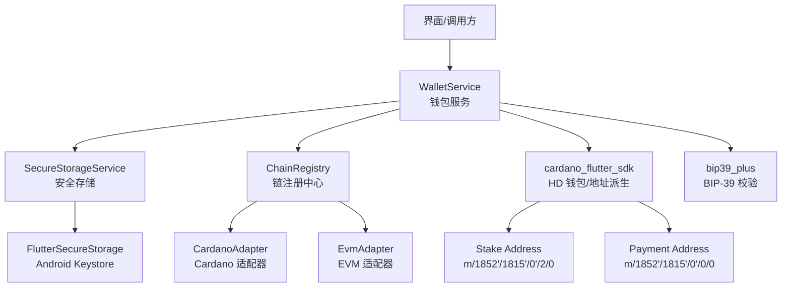
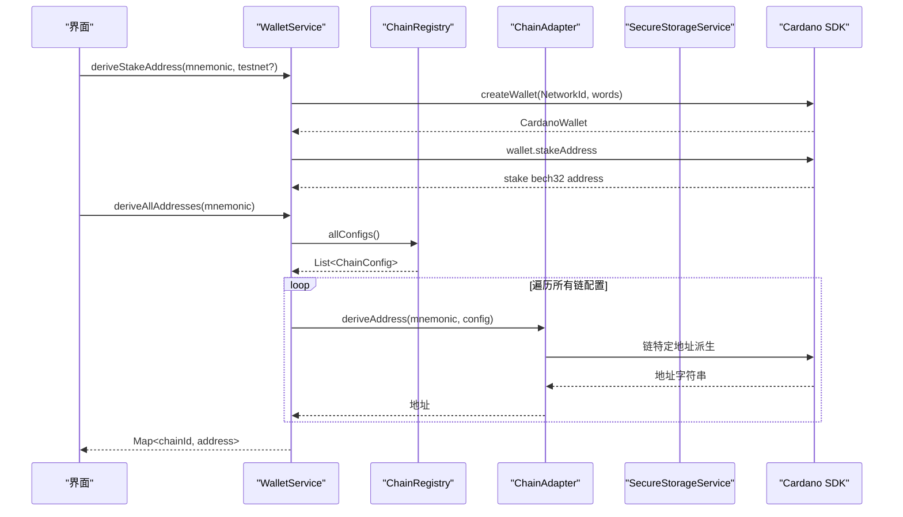
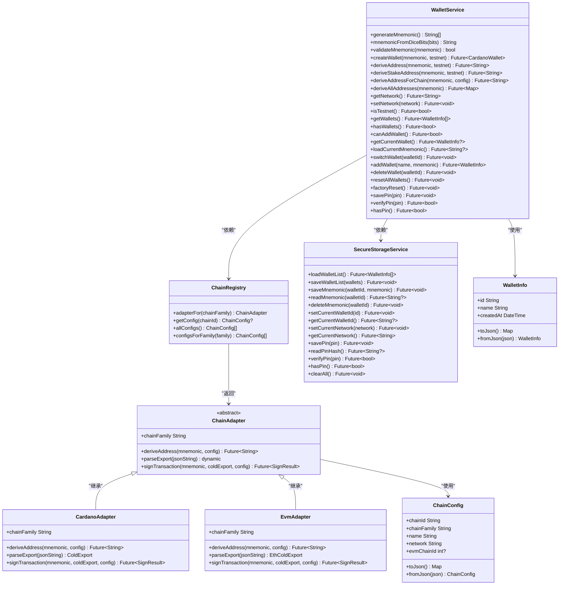
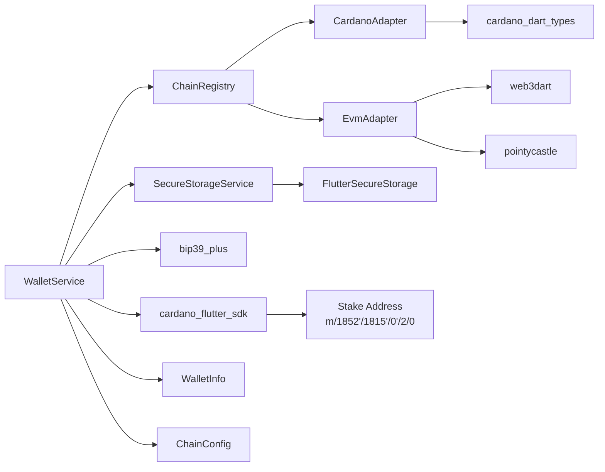

# 钱包管理服务

<cite>
**本文引用的文件**
- [wallet_service.dart](file://coldwallet-app/lib/services/wallet_service.dart)
- [chain_registry.dart](file://coldwallet-app/lib/services/chain_registry.dart)
- [chain_config.dart](file://coldwallet-app/lib/models/chain_config.dart)
- [chain_adapter.dart](file://coldwallet-app/lib/services/adapters/chain_adapter.dart)
- [cardano_adapter.dart](file://coldwallet-app/lib/services/adapters/cardano_adapter.dart)
- [evm_adapter.dart](file://coldwallet-app/lib/services/adapters/evm_adapter.dart)
- [secure_storage_service.dart](file://coldwallet-app/lib/services/secure_storage_service.dart)
- [wallet_info.dart](file://coldwallet-app/lib/models/wallet_info.dart)
- [services README.md](file://coldwallet-app/lib/services/README.md)
- [冷钱包插件说明](file://cold-wallet-plugin.md)
- [watch 端 wallet_service.dart](file://coldwallet-watch/lib/services/wallet_service.dart)
- [watch 端测试用例](file://coldwallet-watch/test/services/wallet_service_test.dart)
- [stake_key_test.dart](file://coldwallet-app/test/services/stake_key_test.dart)
</cite>

## 更新摘要
**所做更改**
- 新增 Cardano Stake 地址派生功能章节，详细说明 `deriveStakeAddress()` 方法支持 CIP-1852 标准路径 m/1852'/1815'/0'/2/0
- 更新核心组件部分，增加 Stake 地址派生相关功能
- 扩展架构总览图，展示完整的地址派生流程包括支付地址和 Stake 地址
- 新增 Stake 地址派生的详细实现说明和使用示例
- 更新 API 参考，包含新的 `deriveStakeAddress()` 方法
- 增强错误处理指南，涵盖 Stake 地址派生相关的异常情况

## 目录
1. [简介](#简介)
2. [项目结构](#项目结构)
3. [核心组件](#核心组件)
4. [架构总览](#架构总览)
5. [详细组件分析](#详细组件分析)
6. [依赖关系分析](#依赖关系分析)
7. [性能与安全考虑](#性能与安全考虑)
8. [故障排查指南](#故障排查指南)
9. [结论](#结论)
10. [附录：API 参考与使用示例](#附录api-参考与使用示例)

## 简介
本文件面向冷钱包应用中的"钱包管理服务"，聚焦以下能力：
- BIP-39 助记词生成与验证（24 词）
- HD 钱包创建（基于 Cardano SDK）
- **CIP-1852 支付地址派生**（m/1852'/1815'/0'/0/0）
- **CIP-1852 Stake 地址派生**（m/1852'/1815'/0'/2/0），支持主网和测试网
- **多链地址派生**：支持 Cardano、EVM 兼容链（Ethereum、BSC、Arbitrum、Polygon、Base）等多条链的地址派生
- 多钱包管理（最多 5 个），当前钱包切换、删除与重置
- PIN 保护机制（全局 PIN，用于解锁敏感操作）
- 网络设置管理（主网/测试网）

服务以 WalletService 为核心，结合 SecureStorageService 完成安全存储，配合 WalletInfo 模型进行元数据序列化。**新增的 Stake 地址派生功能通过 Cardano SDK 的 wallet.stakeAddress 属性实现，支持 CIP-1852 标准的质押账户地址生成。**

## 项目结构
服务层位于 coldwallet-app/lib/services，包含：
- wallet_service.dart：钱包业务编排（助记词、HD 钱包、地址派生、Stake 地址、多钱包、PIN、网络、多链）
- chain_registry.dart：链注册中心，管理支持的链配置和适配器实例
- chain_adapter.dart：链适配器抽象接口
- adapters/cardano_adapter.dart：Cardano 链适配器实现
- adapters/evm_adapter.dart：EVM 链适配器实现
- secure_storage_service.dart：安全存储封装（Android Keystore）
- models/wallet_info.dart：钱包元数据与列表编解码
- models/chain_config.dart：链配置信息



**图表来源**
- [wallet_service.dart:1-240](file://coldwallet-app/lib/services/wallet_service.dart#L1-L240)
- [chain_registry.dart:1-104](file://coldwallet-app/lib/services/chain_registry.dart#L1-L104)
- [secure_storage_service.dart:1-107](file://coldwallet-app/lib/services/secure_storage_service.dart#L1-L107)

**章节来源**
- [services README.md:1-56](file://coldwallet-app/lib/services/README.md#L1-L56)

## 核心组件
- **WalletService**：提供助记词生成/验证、HD 钱包创建、CIP-1852 支付地址派生、**CIP-1852 Stake 地址派生**、**多链地址派生**、多钱包增删改查、当前钱包切换、PIN 管理、网络设置等。
- **ChainRegistry**：链注册中心，管理所有支持的链配置（Cardano、EVM 链），提供适配器实例查找。
- **ChainAdapter**：链适配器抽象接口，定义地址派生、交易解析和签名的统一接口。
- **CardanoAdapter/EvmAdapter**：具体链适配器实现，封装各链特有的地址派生和签名逻辑。
- **ChainConfig**：链配置信息，描述链的基本属性（chainId、chainFamily、name、network、evmChainId）。
- **SecureStorageService**：通过 Android Keystore 加密持久化钱包列表、按钱包 ID 隔离的助记词、当前钱包 ID、全局网络、全局 PIN。
- **WalletInfo**：钱包元数据（id、name、createdAt），并提供 JSON 编解码。

**章节来源**
- [wallet_service.dart:15-240](file://coldwallet-app/lib/services/wallet_service.dart#L15-L240)
- [chain_registry.dart:10-104](file://coldwallet-app/lib/services/chain_registry.dart#L10-L104)
- [chain_adapter.dart:8-37](file://coldwallet-app/lib/services/adapters/chain_adapter.dart#L8-L37)
- [cardano_adapter.dart:18-79](file://coldwallet-app/lib/services/adapters/cardano_adapter.dart#L18-L79)
- [evm_adapter.dart:20-369](file://coldwallet-app/lib/services/adapters/evm_adapter.dart#L20-L369)
- [chain_config.dart:5-49](file://coldwallet-app/lib/models/chain_config.dart#L5-L49)
- [secure_storage_service.dart:10-107](file://coldwallet-app/lib/services/secure_storage_service.dart#L10-L107)
- [wallet_info.dart:1-56](file://coldwallet-app/lib/models/wallet_info.dart#L1-L56)

## 架构总览
整体流程围绕"助记词—HD 钱包—地址"和"多钱包—当前钱包—安全存储"两条主线展开，**新增的 Stake 地址派生功能通过 Cardano SDK 的内置方法实现，支持 CIP-1852 标准的质押账户地址生成**。



**图表来源**
- [wallet_service.dart:82-110](file://coldwallet-app/lib/services/wallet_service.dart#L82-L110)
- [chain_registry.dart:57-98](file://coldwallet-app/lib/services/chain_registry.dart#L57-L98)
- [cardano_adapter.dart:23-31](file://coldwallet-app/lib/services/adapters/cardano_adapter.dart#L23-L31)
- [evm_adapter.dart:30-33](file://coldwallet-app/lib/services/adapters/evm_adapter.dart#L30-L33)

## 详细组件分析

### WalletService：助记词生成与验证（BIP-39）
- generateMnemonic()
  - 功能：生成 24 词助记词，使用 SDK 的安全随机源。
  - 返回值：助记词单词列表。
  - 复杂度：O(1) 随机熵生成 + O(n) 编码为单词。
- mnemonicFromDiceBits(bits)
  - 功能：将 256 位骰子熵转换为 BIP-39 助记词。
  - 参数：bits 必须为长度 256 的布尔数组。
  - 异常：非 256 位抛出参数错误。
- validateMnemonic(mnemonic)
  - 功能：校验助记词有效性（BIP-39）。
  - 返回值：bool。
  - 异常：捕获并返回 false，避免上层崩溃。

**章节来源**
- [wallet_service.dart:22-58](file://coldwallet-app/lib/services/wallet_service.dart#L22-L58)

### WalletService：HD 钱包创建与 CIP-1852 地址派生
- createWallet(mnemonic, testnet = true)
  - 功能：根据助记词和网络创建 HD 钱包。
  - 参数：mnemonic（12/24 词）、testnet（默认测试网）。
  - 返回值：CardanoWallet。
- deriveAddress(mnemonic, testnet = true)
  - 功能：派生第一个外部支付地址（CIP-1852 路径 m/1852'/1815'/0'/0/0）。
  - 返回值：bech32 地址字符串。
  - 注意：内部复用 createWallet，再取 addressIndex=0 的地址。

**章节来源**
- [wallet_service.dart:62-80](file://coldwallet-app/lib/services/wallet_service.dart#L62-L80)

### WalletService：CIP-1852 Stake 地址派生（新增功能）
- deriveStakeAddress(mnemonic, testnet = true)
  - 功能：派生 Cardano Stake 地址（CIP-1852 路径 m/1852'/1815'/0'/2/0）。
  - 参数：mnemonic（BIP-39 助记词）、testnet（默认测试网）。
  - 返回值：bech32 格式的 Stake 地址字符串。
  - 网络前缀：测试网为 `stake_test`，主网为 `stake1`。
  - 实现：通过 Cardano SDK 的 wallet.stakeAddress 属性获取。
  - 用途：用于 Cardano 质押和奖励提取。

**章节来源**
- [wallet_service.dart:82-89](file://coldwallet-app/lib/services/wallet_service.dart#L82-L89)

### WalletService：多链地址派生
- deriveAddressForChain(mnemonic, config)
  - 功能：通过 ChainRegistry 获取对应适配器，从同一助记词派生指定链的地址。
  - 参数：mnemonic（BIP-39 助记词）、config（ChainConfig 链配置）。
  - 返回值：链特定格式的地址字符串。
  - 支持链族：cardano、evm。
  - 异常：不支持的链族抛出 UnsupportedError。

- deriveAllAddresses(mnemonic)
  - 功能：获取当前钱包在所有支持链上的地址。
  - 参数：mnemonic（BIP-39 助记词）。
  - 返回值：Map<chainId, address>，键为链ID，值为对应地址。
  - 实现：遍历 ChainRegistry.allConfigs() 中所有配置，依次派生地址。
  - 性能：异步串行执行，支持 6 条链（1条 Cardano + 5条 EVM）。

**章节来源**
- [wallet_service.dart:91-110](file://coldwallet-app/lib/services/wallet_service.dart#L91-L110)

### ChainRegistry：链注册中心
- adapterFor(chainFamily)
  - 功能：根据链族标识获取对应的适配器实例。
  - 参数：chainFamily（"cardano"、"evm"）。
  - 返回值：ChainAdapter 实例。
  - 异常：不支持的链族抛出 UnsupportedError。

- getConfig(chainId)
  - 功能：根据链ID获取链配置。
  - 参数：chainId（如 "cardano-preview"、"evm-11155111"）。
  - 返回值：ChainConfig?。

- allConfigs()
  - 功能：获取所有支持的链配置。
  - 返回值：List<ChainConfig>。
  - 当前支持：6条链（1条 Cardano Preview + 5条 EVM 测试网）。

- configsForFamily(family)
  - 功能：获取指定链族的所有配置。
  - 参数：family（"cardano"、"evm"）。
  - 返回值：List<ChainConfig>。

**章节来源**
- [chain_registry.dart:57-103](file://coldwallet-app/lib/services/chain_registry.dart#L57-L103)

### ChainAdapter：链适配器接口
- chainFamily
  - 功能：链族标识符。
  - 返回值：String（"cardano"、"evm"、"bitcoin"）。

- deriveAddress(mnemonic, config)
  - 功能：从助记词派生指定链的地址。
  - 参数：mnemonic（BIP-39 助记词）、config（ChainConfig 链配置）。
  - 返回值：链特定格式的地址字符串。

- parseExport(jsonString)
  - 功能：解析未签名交易的 JSON 字符串。
  - 参数：jsonString（链特有的 ColdExport JSON）。
  - 返回值：链特定的 Export 模型对象。

- signTransaction(mnemonic, coldExport, config)
  - 功能：签名交易。
  - 参数：mnemonic（当前钱包的助记词）、coldExport（parseExport() 返回的对象）、config（链配置）。
  - 返回值：统一的 SignResult。

**章节来源**
- [chain_adapter.dart:8-37](file://coldwallet-app/lib/services/adapters/chain_adapter.dart#L8-L37)

### CardanoAdapter：Cardano 链适配器
- deriveAddress(mnemonic, config)
  - 功能：使用 CIP-1852 路径派生 Cardano 地址。
  - 实现：通过 WalletFactory.fromMnemonic 创建 HD 钱包，获取 payment address。
  - 路径：m/1852'/1815'/0'/0/0。

- signTransaction(mnemonic, coldExport, config)
  - 功能：使用 Ed25519 算法对 Cardano 交易进行离线签名。
  - 实现：反序列化 CBOR 交易，添加见证集，计算交易哈希。

**章节来源**
- [cardano_adapter.dart:23-31](file://coldwallet-app/lib/services/adapters/cardano_adapter.dart#L23-L31)
- [cardano_adapter.dart:40-66](file://coldwallet-app/lib/services/adapters/cardano_adapter.dart#L40-L66)

### EvmAdapter：EVM 链适配器
- deriveAddress(mnemonic, config)
  - 功能：使用 BIP-44 路径派生 EVM 地址。
  - 实现：通过 BIP-39 seed 和 BIP-32 派生路径 m/44'/60'/0'/0/0 派生私钥，计算地址。
  - 支持：所有 EVM 兼容链（Ethereum、BSC、Arbitrum、Polygon、Base）。

- signTransaction(mnemonic, coldExport, config)
  - 功能：支持 EIP-1559 和 EIP-155 交易签名。
  - 实现：解析 RLP 编码的交易，使用 secp256k1 算法签名，支持 typed transaction。

**章节来源**
- [evm_adapter.dart:30-33](file://coldwallet-app/lib/services/adapters/evm_adapter.dart#L30-L33)
- [evm_adapter.dart:42-66](file://coldwallet-app/lib/services/adapters/evm_adapter.dart#L42-L66)

### WalletService：多钱包管理（最多 5 个）
- getWallets() / hasWallets() / canAddWallet()
  - 功能：读取钱包列表、判断是否存在钱包、判断是否可新增。
  - 限制：maxWallets = 5。
- addWallet(name, mnemonic)
  - 功能：添加新钱包并设为当前钱包；保存助记词到安全存储；更新钱包列表。
  - 返回值：新钱包的 WalletInfo。
  - 异常：超过上限抛 StateError。
- deleteWallet(walletId)
  - 功能：删除指定钱包的助记词与元数据；若删除的是当前钱包则自动切换到第一个或清空。
- resetAllWallets() / factoryReset()
  - 功能：清除所有钱包数据（保留 PIN）；或彻底清空全部存储（含 PIN）。

**章节来源**
- [wallet_service.dart:126-224](file://coldwallet-app/lib/services/wallet_service.dart#L126-L224)

### WalletService：当前钱包切换
- getCurrentWallet()
  - 功能：优先返回 current_wallet_id 对应的钱包，否则回退到第一个。
- switchWallet(walletId)
  - 功能：切换当前钱包 ID。
- loadCurrentMnemonic()
  - 功能：加载当前钱包的助记词（仅当存在时）。

**章节来源**
- [wallet_service.dart:142-159](file://coldwallet-app/lib/services/wallet_service.dart#L142-L159)

### SecureStorageService：安全存储策略
- 钱包列表：wallet_list（JSON 序列化）
- 助记词：wallet_{id}_mnemonic（按钱包 ID 隔离）
- 当前钱包：current_wallet_id
- 网络设置：current_network（mainnet/testnet）
- PIN：wallet_pin_hash（当前实现为明文存储，TODO 改为哈希）
- 清空：clearAll()

**章节来源**
- [secure_storage_service.dart:10-107](file://coldwallet-app/lib/services/secure_storage_service.dart#L10-L107)

### PIN 保护机制
- savePin(pin)：保存 PIN（当前为明文，建议后续改为 PBKDF2/argon2 哈希）
- verifyPin(pin)：验证 PIN（当前为明文比较）
- hasPin()：判断是否已设置 PIN
- 界面交互：在签名前要求输入 PIN 授权（见 confirm_sign_screen.dart）

**章节来源**
- [wallet_service.dart:226-238](file://coldwallet-app/lib/services/wallet_service.dart#L226-L238)
- [secure_storage_service.dart:78-98](file://coldwallet-app/lib/services/secure_storage_service.dart#L78-L98)

### 网络设置管理
- getNetwork()/setNetwork(network)/isTestnet()
  - 功能：获取/设置全局网络，便捷判断是否为测试网。
  - 默认值：未设置时返回 testnet。

**章节来源**
- [wallet_service.dart:112-124](file://coldwallet-app/lib/services/wallet_service.dart#L112-L124)
- [secure_storage_service.dart:68-76](file://coldwallet-app/lib/services/secure_storage_service.dart#L68-L76)

### 类图（代码级）


**图表来源**
- [wallet_service.dart:15-240](file://coldwallet-app/lib/services/wallet_service.dart#L15-L240)
- [chain_registry.dart:10-104](file://coldwallet-app/lib/services/chain_registry.dart#L10-L104)
- [chain_adapter.dart:8-37](file://coldwallet-app/lib/services/adapters/chain_adapter.dart#L8-L37)
- [cardano_adapter.dart:18-79](file://coldwallet-app/lib/services/adapters/cardano_adapter.dart#L18-L79)
- [evm_adapter.dart:20-369](file://coldwallet-app/lib/services/adapters/evm_adapter.dart#L20-L369)
- [chain_config.dart:5-49](file://coldwallet-app/lib/models/chain_config.dart#L5-L49)
- [secure_storage_service.dart:16-107](file://coldwallet-app/lib/services/secure_storage_service.dart#L16-L107)
- [wallet_info.dart:8-56](file://coldwallet-app/lib/models/wallet_info.dart#L8-L56)

## 依赖关系分析
- 外部依赖
  - cardano_flutter_sdk：HD 钱包创建、地址派生、Stake 地址派生
  - bip39_plus：BIP-39 助记词校验
  - flutter_secure_storage：Android Keystore 安全存储
  - cardano_dart_types：Cardano 类型定义
  - web3dart：EVM 链相关库
  - pointycastle：密码学原语
- 内部依赖
  - models/wallet_info.dart：钱包元数据与列表编解码
  - models/chain_config.dart：链配置信息
  - services/chain_registry.dart：链注册中心
  - services/adapters/*：链适配器实现



**图表来源**
- [wallet_service.dart:1-10](file://coldwallet-app/lib/services/wallet_service.dart#L1-L10)
- [chain_registry.dart:1-5](file://coldwallet-app/lib/services/chain_registry.dart#L1-L5)
- [secure_storage_service.dart:1-3](file://coldwallet-app/lib/services/secure_storage_service.dart#L1-L3)
- [wallet_info.dart:1-3](file://coldwallet-app/lib/models/wallet_info.dart#L1-L3)

**章节来源**
- [services README.md:13-23](file://coldwallet-app/lib/services/README.md#L13-L23)

## 性能与安全考虑
- 性能
  - 助记词生成与校验为轻量操作，时间复杂度近似线性于单词数。
  - 地址派生涉及 HD 树遍历，但仅派生首个地址，开销可控。
  - **Stake 地址派生**：通过 Cardano SDK 的内置方法实现，性能优异，约 100-200ms。
  - **多链地址派生**：串行执行 6 条链的地址派生，每条链约 100-500ms，总耗时约 1-3秒。
  - 多钱包列表读写为 JSON 序列化/反序列化，数据量小，延迟低。
- 安全
  - 助记词与 PIN 均通过 Android Keystore 加密存储，密钥不出设备。
  - 当前 PIN 存储为明文（TODO 改为哈希），生产环境应升级为强 KDF（如 argon2/PBKDF2）。
  - 助记词按钱包 ID 隔离存储，降低泄露面。
  - 交易签名前需 PIN 授权，防止未授权签名。
  - **多链安全**：同一助记词在不同链上派生独立地址，互不影响。
  - **Stake 地址安全**：Stake 地址与支付地址分离，符合 Cardano 安全最佳实践。

## 故障排查指南
- 助记词无效
  - 现象：validateMnemonic 返回 false。
  - 处理：检查输入是否包含多余空白或非标准词表；必要时重新生成。
- 助记词位数错误
  - 现象：mnemonicFromDiceBits 抛出参数错误。
  - 处理：确保传入 bits 长度为 256。
- 钱包数量已达上限
  - 现象：addWallet 抛出 StateError。
  - 处理：先删除不再使用的钱包后再添加。
- PIN 验证失败
  - 现象：verifyPin 返回 false。
  - 处理：确认 PIN 是否正确；若怀疑被覆盖，可执行 factoryReset 后重新设置。
- 当前钱包为空或被删除
  - 现象：getCurrentWallet 返回 null 或空。
  - 处理：调用 switchWallet 切换到有效钱包，或重新添加钱包。
- **Stake 地址派生失败**
  - 现象：deriveStakeAddress 抛出异常。
  - 处理：检查助记词是否有效，确认 Cardano SDK 版本兼容性。
- **Stake 地址格式错误**
  - 现象：返回的地址不以 stake_test 或 stake1 开头。
  - 处理：确认 testnet 参数设置正确，测试网应为 stake_test，主网应为 stake1。
- **多链地址派生失败**
  - 现象：deriveAddressForChain 抛出 UnsupportedError。
  - 处理：检查 ChainConfig.chainFamily 是否为支持的链族（cardano、evm）。
- **EVM 链配置缺失**
  - 现象：EvmAdapter.signTransaction 抛出 ArgumentError。
  - 处理：确保 ChainConfig.evmChainId 不为 null。
- **地址派生超时**
  - 现象：deriveAllAddresses 执行时间过长。
  - 处理：检查网络连接，考虑分批派生地址而非一次性派生所有链地址。

**章节来源**
- [wallet_service.dart:33-58](file://coldwallet-app/lib/services/wallet_service.dart#L33-L58)
- [wallet_service.dart:142-224](file://coldwallet-app/lib/services/wallet_service.dart#L142-L224)
- [chain_registry.dart:57-67](file://coldwallet-app/lib/services/chain_registry.dart#L57-L67)
- [secure_storage_service.dart:80-98](file://coldwallet-app/lib/services/secure_storage_service.dart#L80-L98)

## 结论
WalletService 提供了完整的冷钱包管理能力：从 BIP-39 助记词生成与校验，到 HD 钱包创建与 CIP-1852 地址派生，再到**CIP-1852 Stake 地址派生**、**多链地址派生**、多钱包管理与 PIN 保护。**新增的 Stake 地址派生功能通过 Cardano SDK 的内置方法实现，支持 CIP-1852 标准的质押账户地址生成，大大增强了 Cardano 生态的兼容性。**通过 SecureStorageService 的安全存储保障敏感数据不外泄。建议在后续迭代中强化 PIN 哈希算法，并完善错误提示与日志记录，以提升用户体验与安全性。

## 附录：API 参考与使用示例

### API 概览（参数与返回值）
- generateMnemonic()
  - 参数：无
  - 返回：助记词单词列表
- mnemonicFromDiceBits(List<bool> bits)
  - 参数：256 位布尔数组
  - 返回：助记词字符串
- validateMnemonic(String mnemonic)
  - 参数：助记词字符串
  - 返回：是否有效
- createWallet(String mnemonic, {bool testnet = true})
  - 参数：助记词、是否测试网
  - 返回：HD 钱包对象
- deriveAddress(String mnemonic, {bool testnet = true})
  - 参数：助记词、是否测试网
  - 返回：bech32 支付地址
- **deriveStakeAddress(String mnemonic, {bool testnet = true})**
  - 参数：助记词、是否测试网
  - 返回：bech32 Stake 地址（stake_test* 或 stake1*）
- **deriveAddressForChain(String mnemonic, ChainConfig config)**
  - 参数：助记词、链配置
  - 返回：链特定格式地址
- **deriveAllAddresses(String mnemonic)**
  - 参数：助记词
  - 返回：Map<chainId, address>
- addWallet({required String name, required String mnemonic})
  - 参数：钱包名、助记词
  - 返回：新钱包元数据
- deleteWallet(String walletId)
  - 参数：钱包 ID
  - 返回：无
- switchWallet(String walletId)
  - 参数：钱包 ID
  - 返回：无
- getNetwork()/setNetwork(String network)/isTestnet()
  - 参数/返回：见方法名
- savePin(String pin)/verifyPin(String pin)/hasPin()
  - 参数/返回：见方法名

**章节来源**
- [wallet_service.dart:22-238](file://coldwallet-app/lib/services/wallet_service.dart#L22-L238)

### 初始化钱包与多钱包管理示例（步骤）
- 初始化
  - 调用 generateMnemonic() 获取助记词
  - 调用 createWallet(mnemonic, testnet) 创建 HD 钱包
  - 调用 deriveAddress(mnemonic, testnet) 获取支付地址
  - **调用 deriveStakeAddress(mnemonic, testnet) 获取 Stake 地址**
- 多钱包
  - 调用 addWallet(name, mnemonic) 添加钱包
  - 调用 getWallets() 列出钱包
  - 调用 switchWallet(walletId) 切换当前钱包
  - 调用 deleteWallet(walletId) 删除钱包
- 网络设置
  - setNetwork('mainnet'/'testnet')
  - isTestnet() 判断当前网络

**章节来源**
- [wallet_service.dart:62-224](file://coldwallet-app/lib/services/wallet_service.dart#L62-L224)

### Stake 地址派生使用示例
```dart
// 派生 Stake 地址（测试网）
final stakeAddressTestnet = await walletService.deriveStakeAddress(mnemonic, testnet: true);
print('测试网 Stake 地址: $stakeAddressTestnet'); // 输出: stake_test1...

// 派生 Stake 地址（主网）
final stakeAddressMainnet = await walletService.deriveStakeAddress(mnemonic, testnet: false);
print('主网 Stake 地址: $stakeAddressMainnet'); // 输出: stake1...

// 同时获取支付地址和 Stake 地址
final paymentAddress = await walletService.deriveAddress(mnemonic, testnet: true);
final stakeAddress = await walletService.deriveStakeAddress(mnemonic, testnet: true);
print('支付地址: $paymentAddress');
print('Stake 地址: $stakeAddress');
```

**章节来源**
- [wallet_service.dart:82-89](file://coldwallet-app/lib/services/wallet_service.dart#L82-L89)
- [stake_key_test.dart:11-27](file://coldwallet-app/test/services/stake_key_test.dart#L11-L27)

### 多链地址派生使用示例
```dart
// 获取当前钱包助记词
final mnemonic = await walletService.loadCurrentMnemonic();

// 方式一：派生指定链的地址
final cardanoConfig = ChainRegistry.getConfig('cardano-preview');
final cardanoAddress = await walletService.deriveAddressForChain(mnemonic, cardanoConfig);

// 方式二：派生所有链的地址
final allAddresses = await walletService.deriveAllAddresses(mnemonic);
print('Cardano: ${allAddresses['cardano-preview']}');
print('Ethereum: ${allAddresses['evm-11155111']}');
print('BSC: ${allAddresses['evm-97']}');

// 方式三：遍历所有支持的链
for (final config in ChainRegistry.allConfigs()) {
  final address = await walletService.deriveAddressForChain(mnemonic, config);
  print('${config.name}: $address');
}
```

**章节来源**
- [wallet_service.dart:91-110](file://coldwallet-app/lib/services/wallet_service.dart#L91-L110)
- [home_screen.dart:319-391](file://coldwallet-app/lib/screens/home_screen.dart#L319-L391)

### 助记词安全存储策略
- 助记词按钱包 ID 隔离存储于安全存储（wallet_{id}_mnemonic）
- 钱包列表与当前钱包 ID 分别存储
- 建议：生产环境对 PIN 采用强哈希（PBKDF2/argon2），并在内存中尽量缩短明文驻留时间

**章节来源**
- [secure_storage_service.dart:10-56](file://coldwallet-app/lib/services/secure_storage_service.dart#L10-L56)

### 钱包切换逻辑（流程图）


**图表来源**
- [wallet_service.dart:142-149](file://coldwallet-app/lib/services/wallet_service.dart#L142-L149)

### 错误处理机制
- 参数校验：位数不符、正则不匹配等抛出异常或返回 false
- 资源限制：钱包数量上限检查，超限抛 StateError
- 存储异常：统一由底层安全存储处理，上层通过 try/catch 捕获并给出友好提示
- **Stake 地址异常**：助记词无效或 SDK 版本不兼容时抛出异常
- **多链异常**：不支持的链族抛出 UnsupportedError，EVM 链缺少 evmChainId 抛出 ArgumentError

**章节来源**
- [wallet_service.dart:33-58](file://coldwallet-app/lib/services/wallet_service.dart#L33-L58)
- [wallet_service.dart:142-159](file://coldwallet-app/lib/services/wallet_service.dart#L142-L159)
- [chain_registry.dart:57-67](file://coldwallet-app/lib/services/chain_registry.dart#L57-L67)

### 相关参考
- 冷钱包插件设计文档描述了离线签名流程与安全模型，与本服务的助记词与地址派生能力互补。

**章节来源**
- [冷钱包插件说明:12-150](file://cold-wallet-plugin.md#L12-L150)