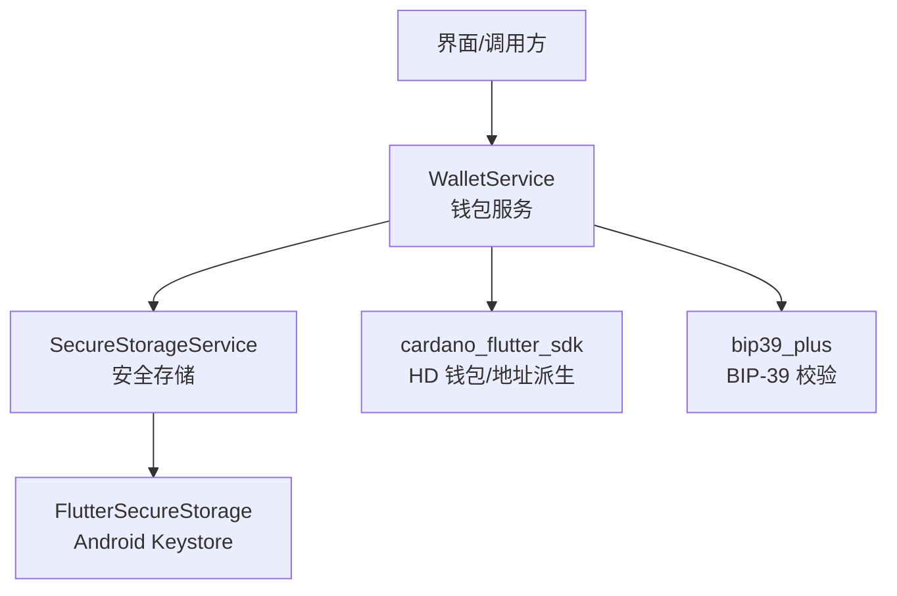
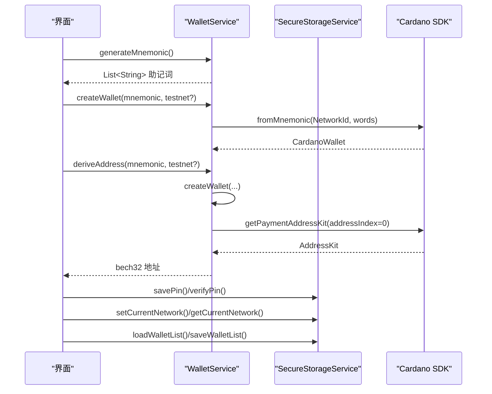
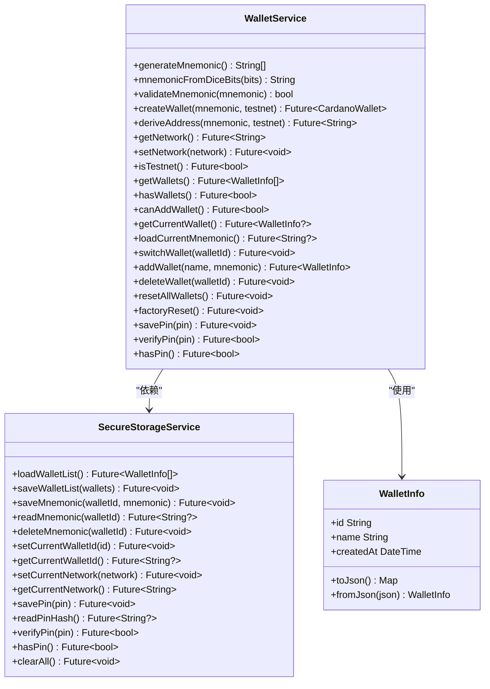
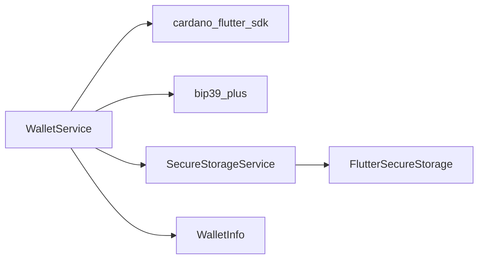
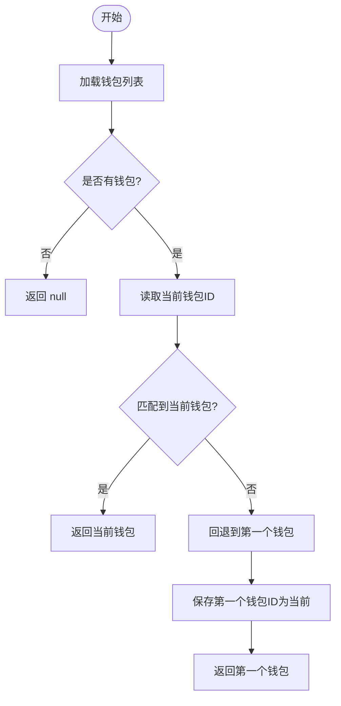

# 钱包管理服务

<cite>
**本文引用的文件**
- [wallet_service.dart](file://coldwallet-app/lib/services/wallet_service.dart)
- [secure_storage_service.dart](file://coldwallet-app/lib/services/secure_storage_service.dart)
- [wallet_info.dart](file://coldwallet-app/lib/models/wallet_info.dart)
- [services README.md](file://coldwallet-app/lib/services/README.md)
- [冷钱包插件说明](file://cold-wallet-plugin.md)
- [watch 端 wallet_service.dart](file://coldwallet-watch/lib/services/wallet_service.dart)
- [watch 端测试用例](file://coldwallet-watch/test/services/wallet_service_test.dart)
</cite>

## 目录
1. [简介](#简介)
2. [项目结构](#项目结构)
3. [核心组件](#核心组件)
4. [架构总览](#架构总览)
5. [详细组件分析](#详细组件分析)
6. [依赖关系分析](#依赖关系分析)
7. [性能与安全考虑](#性能与安全考虑)
8. [故障排查指南](#故障排查指南)
9. [结论](#结论)
10. [附录：API 参考与使用示例](#附录api-参考与使用示例)

## 简介
本文件面向冷钱包应用中的“钱包管理服务”，聚焦以下能力：
- BIP-39 助记词生成与验证（24 词）
- HD 钱包创建（基于 Cardano SDK）
- CIP-1852 地址派生（m/1852'/1815'/0'/0/0）
- 多钱包管理（最多 5 个），当前钱包切换、删除与重置
- PIN 保护机制（全局 PIN，用于解锁敏感操作）
- 网络设置管理（主网/测试网）

服务以 WalletService 为核心，结合 SecureStorageService 完成安全存储，配合 WalletInfo 模型进行元数据序列化。

## 项目结构
服务层位于 coldwallet-app/lib/services，包含：
- wallet_service.dart：钱包业务编排（助记词、HD 钱包、地址派生、多钱包、PIN、网络）
- secure_storage_service.dart：安全存储封装（Android Keystore）
- models/wallet_info.dart：钱包元数据与列表编解码

图表来源
- [wallet_service.dart:1-208](file://coldwallet-app/lib/services/wallet_service.dart#L1-L208)
- [secure_storage_service.dart:1-107](file://coldwallet-app/lib/services/secure_storage_service.dart#L1-L107)

章节来源
- [services README.md:1-56](file://coldwallet-app/lib/services/README.md#L1-L56)

## 核心组件
- WalletService：提供助记词生成/验证、HD 钱包创建、CIP-1852 地址派生、多钱包增删改查、当前钱包切换、PIN 管理、网络设置等。
- SecureStorageService：通过 Android Keystore 加密持久化钱包列表、按钱包 ID 隔离的助记词、当前钱包 ID、全局网络、全局 PIN。
- WalletInfo：钱包元数据（id、name、createdAt），并提供 JSON 编解码。

章节来源
- [wallet_service.dart:10-208](file://coldwallet-app/lib/services/wallet_service.dart#L10-L208)
- [secure_storage_service.dart:10-107](file://coldwallet-app/lib/services/secure_storage_service.dart#L10-L107)
- [wallet_info.dart:1-56](file://coldwallet-app/lib/models/wallet_info.dart#L1-L56)

## 架构总览
整体流程围绕“助记词—HD 钱包—地址”和“多钱包—当前钱包—安全存储”两条主线展开。

图表来源
- [wallet_service.dart:20-78](file://coldwallet-app/lib/services/wallet_service.dart#L20-L78)
- [secure_storage_service.dart:24-76](file://coldwallet-app/lib/services/secure_storage_service.dart#L24-L76)

## 详细组件分析

### WalletService：助记词生成与验证（BIP-39）
- generateMnemonic()
  - 功能：生成 24 词助记词，使用 SDK 的安全随机源。
  - 返回值：助记词单词列表。
  - 复杂度：O(1) 随机熵生成 + O(n) 编码为单词。
- mnemonicFromDiceBits(bits)
  - 功能：将 256 位骰子熵转换为 BIP-39 助记词。
  - 参数：bits 必须为长度 256 的布尔数组。
  - 异常：非 256 位抛出参数错误。
- validateMnemonic(mnemonic)
  - 功能：校验助记词有效性（BIP-39）。
  - 返回值：bool。
  - 异常：捕获并返回 false，避免上层崩溃。

章节来源
- [wallet_service.dart:20-56](file://coldwallet-app/lib/services/wallet_service.dart#L20-L56)

### WalletService：HD 钱包创建与 CIP-1852 地址派生
- createWallet(mnemonic, testnet = true)
  - 功能：根据助记词和网络创建 HD 钱包。
  - 参数：mnemonic（12/24 词）、testnet（默认测试网）。
  - 返回值：CardanoWallet。
- deriveAddress(mnemonic, testnet = true)
  - 功能：派生第一个外部支付地址（CIP-1852 路径 m/1852'/1815'/0'/0/0）。
  - 返回值：bech32 地址字符串。
  - 注意：内部复用 createWallet，再取 addressIndex=0 的地址。

章节来源
- [wallet_service.dart:60-78](file://coldwallet-app/lib/services/wallet_service.dart#L60-L78)

### WalletService：多钱包管理（最多 5 个）
- getWallets() / hasWallets() / canAddWallet()
  - 功能：读取钱包列表、判断是否存在钱包、判断是否可新增。
  - 限制：maxWallets = 5。
- addWallet(name, mnemonic)
  - 功能：添加新钱包并设为当前钱包；保存助记词到安全存储；更新钱包列表。
  - 返回值：新钱包的 WalletInfo。
  - 异常：超过上限抛 StateError。
- deleteWallet(walletId)
  - 功能：删除指定钱包的助记词与元数据；若删除的是当前钱包则自动切换到第一个或清空。
- resetAllWallets() / factoryReset()
  - 功能：清除所有钱包数据（保留 PIN）；或彻底清空全部存储（含 PIN）。

章节来源
- [wallet_service.dart:94-187](file://coldwallet-app/lib/services/wallet_service.dart#L94-L187)

### WalletService：当前钱包切换
- getCurrentWallet()
  - 功能：优先返回 current_wallet_id 对应的钱包，否则回退到第一个。
- switchWallet(walletId)
  - 功能：切换当前钱包 ID。
- loadCurrentMnemonic()
  - 功能：加载当前钱包的助记词（仅当存在时）。

章节来源
- [wallet_service.dart:110-127](file://coldwallet-app/lib/services/wallet_service.dart#L110-L127)

### SecureStorageService：安全存储策略
- 钱包列表：wallet_list（JSON 序列化）
- 助记词：wallet_{id}_mnemonic（按钱包 ID 隔离）
- 当前钱包：current_wallet_id
- 网络设置：current_network（mainnet/testnet）
- PIN：wallet_pin_hash（当前实现为明文存储，TODO 改为哈希）
- 清空：clearAll()

章节来源
- [secure_storage_service.dart:10-107](file://coldwallet-app/lib/services/secure_storage_service.dart#L10-L107)

### PIN 保护机制
- savePin(pin)：保存 PIN（当前为明文，建议后续改为 PBKDF2/argon2 哈希）
- verifyPin(pin)：验证 PIN（当前为明文比较）
- hasPin()：判断是否已设置 PIN
- 界面交互：在签名前要求输入 PIN 授权（见 confirm_sign_screen.dart）

章节来源
- [wallet_service.dart:194-207](file://coldwallet-app/lib/services/wallet_service.dart#L194-L207)
- [secure_storage_service.dart:78-98](file://coldwallet-app/lib/services/secure_storage_service.dart#L78-L98)

### 网络设置管理
- getNetwork()/setNetwork(network)/isTestnet()
  - 功能：获取/设置全局网络，便捷判断是否为测试网。
  - 默认值：未设置时返回 testnet。

章节来源
- [wallet_service.dart:80-92](file://coldwallet-app/lib/services/wallet_service.dart#L80-L92)
- [secure_storage_service.dart:68-76](file://coldwallet-app/lib/services/secure_storage_service.dart#L68-L76)

### 类图（代码级）

图表来源
- [wallet_service.dart:10-208](file://coldwallet-app/lib/services/wallet_service.dart#L10-L208)
- [secure_storage_service.dart:16-107](file://coldwallet-app/lib/services/secure_storage_service.dart#L16-L107)
- [wallet_info.dart:8-56](file://coldwallet-app/lib/models/wallet_info.dart#L8-L56)

## 依赖关系分析
- 外部依赖
  - cardano_flutter_sdk：HD 钱包创建、地址派生
  - bip39_plus：BIP-39 助记词校验
  - flutter_secure_storage：Android Keystore 安全存储
  - cardano_dart_types：Cardano 类型定义
- 内部依赖
  - models/wallet_info.dart：钱包元数据与列表编解码

图表来源
- [wallet_service.dart:1-9](file://coldwallet-app/lib/services/wallet_service.dart#L1-L9)
- [secure_storage_service.dart:1-3](file://coldwallet-app/lib/services/secure_storage_service.dart#L1-L3)
- [wallet_info.dart:1-3](file://coldwallet-app/lib/models/wallet_info.dart#L1-L3)

章节来源
- [services README.md:13-23](file://coldwallet-app/lib/services/README.md#L13-L23)

## 性能与安全考虑
- 性能
  - 助记词生成与校验为轻量操作，时间复杂度近似线性于单词数。
  - 地址派生涉及 HD 树遍历，但仅派生首个地址，开销可控。
  - 多钱包列表读写为 JSON 序列化/反序列化，数据量小，延迟低。
- 安全
  - 助记词与 PIN 均通过 Android Keystore 加密存储，密钥不出设备。
  - 当前 PIN 存储为明文（TODO 改为哈希），生产环境应升级为强 KDF（如 argon2/PBKDF2）。
  - 助记词按钱包 ID 隔离存储，降低泄露面。
  - 交易签名前需 PIN 授权，防止未授权签名。

[本节为通用指导，不直接分析具体文件]

## 故障排查指南
- 助记词无效
  - 现象：validateMnemonic 返回 false。
  - 处理：检查输入是否包含多余空白或非标准词表；必要时重新生成。
- 助记词位数错误
  - 现象：mnemonicFromDiceBits 抛出参数错误。
  - 处理：确保传入 bits 长度为 256。
- 钱包数量已达上限
  - 现象：addWallet 抛出 StateError。
  - 处理：先删除不再使用的钱包后再添加。
- PIN 验证失败
  - 现象：verifyPin 返回 false。
  - 处理：确认 PIN 是否正确；若怀疑被覆盖，可执行 factoryReset 后重新设置。
- 当前钱包为空或被删除
  - 现象：getCurrentWallet 返回 null 或空。
  - 处理：调用 switchWallet 切换到有效钱包，或重新添加钱包。

章节来源
- [wallet_service.dart:33-56](file://coldwallet-app/lib/services/wallet_service.dart#L33-L56)
- [wallet_service.dart:135-175](file://coldwallet-app/lib/services/wallet_service.dart#L135-L175)
- [secure_storage_service.dart:80-98](file://coldwallet-app/lib/services/secure_storage_service.dart#L80-L98)

## 结论
WalletService 提供了完整的冷钱包管理能力：从 BIP-39 助记词生成与校验，到 HD 钱包创建与 CIP-1852 地址派生，再到多钱包管理与 PIN 保护。通过 SecureStorageService 的安全存储保障敏感数据不外泄。建议在后续迭代中强化 PIN 哈希算法，并完善错误提示与日志记录，以提升用户体验与安全性。

[本节为总结性内容，不直接分析具体文件]

## 附录：API 参考与使用示例

### API 概览（参数与返回值）
- generateMnemonic()
  - 参数：无
  - 返回：助记词单词列表
- mnemonicFromDiceBits(List<bool> bits)
  - 参数：256 位布尔数组
  - 返回：助记词字符串
- validateMnemonic(String mnemonic)
  - 参数：助记词字符串
  - 返回：是否有效
- createWallet(String mnemonic, {bool testnet = true})
  - 参数：助记词、是否测试网
  - 返回：HD 钱包对象
- deriveAddress(String mnemonic, {bool testnet = true})
  - 参数：助记词、是否测试网
  - 返回：bech32 地址
- addWallet({required String name, required String mnemonic})
  - 参数：钱包名、助记词
  - 返回：新钱包元数据
- deleteWallet(String walletId)
  - 参数：钱包 ID
  - 返回：无
- switchWallet(String walletId)
  - 参数：钱包 ID
  - 返回：无
- getNetwork()/setNetwork(String network)/isTestnet()
  - 参数/返回：见方法名
- savePin(String pin)/verifyPin(String pin)/hasPin()
  - 参数/返回：见方法名

章节来源
- [wallet_service.dart:20-207](file://coldwallet-app/lib/services/wallet_service.dart#L20-L207)

### 初始化钱包与多钱包管理示例（步骤）
- 初始化
  - 调用 generateMnemonic() 获取助记词
  - 调用 createWallet(mnemonic, testnet) 创建 HD 钱包
  - 调用 deriveAddress(mnemonic, testnet) 获取地址
- 多钱包
  - 调用 addWallet(name, mnemonic) 添加钱包
  - 调用 getWallets() 列出钱包
  - 调用 switchWallet(walletId) 切换当前钱包
  - 调用 deleteWallet(walletId) 删除钱包
- 网络设置
  - setNetwork('mainnet'/'testnet')
  - isTestnet() 判断当前网络

章节来源
- [wallet_service.dart:60-187](file://coldwallet-app/lib/services/wallet_service.dart#L60-L187)

### 助记词安全存储策略
- 助记词按钱包 ID 隔离存储于安全存储（wallet_{id}_mnemonic）
- 钱包列表与当前钱包 ID 分别存储
- 建议：生产环境对 PIN 采用强哈希（PBKDF2/argon2），并在内存中尽量缩短明文驻留时间

章节来源
- [secure_storage_service.dart:10-56](file://coldwallet-app/lib/services/secure_storage_service.dart#L10-L56)

### 钱包切换逻辑（流程图）

图表来源
- [wallet_service.dart:112-127](file://coldwallet-app/lib/services/wallet_service.dart#L112-L127)

### 错误处理机制
- 参数校验：位数不符、正则不匹配等抛出异常或返回 false
- 资源限制：钱包数量上限检查，超限抛 StateError
- 存储异常：统一由底层安全存储处理，上层通过 try/catch 捕获并给出友好提示

章节来源
- [wallet_service.dart:33-56](file://coldwallet-app/lib/services/wallet_service.dart#L33-L56)
- [wallet_service.dart:135-142](file://coldwallet-app/lib/services/wallet_service.dart#L135-L142)

### 相关参考
- 冷钱包插件设计文档描述了离线签名流程与安全模型，与本服务的助记词与地址派生能力互补。

章节来源
- [冷钱包插件说明:12-150](file://cold-wallet-plugin.md#L12-L150)