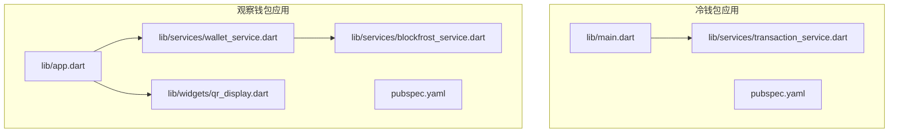
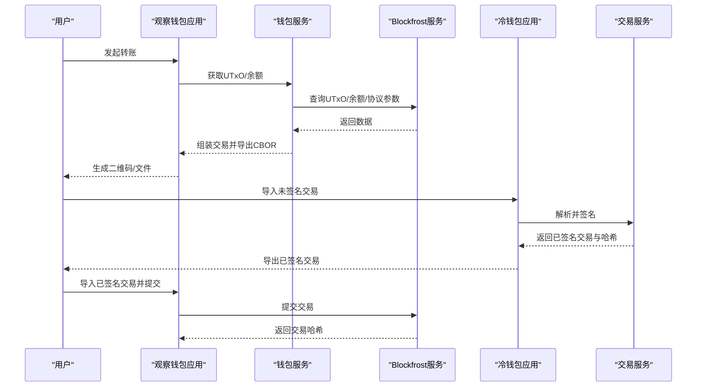
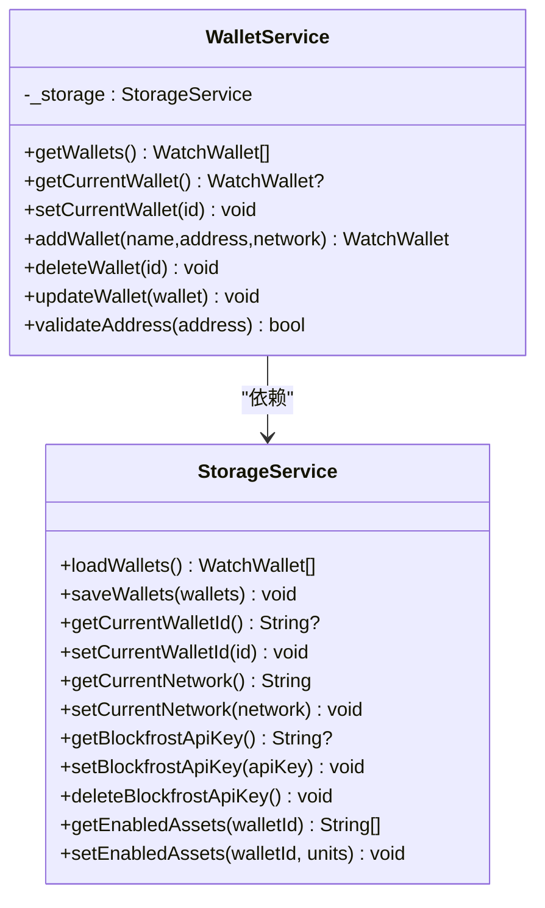
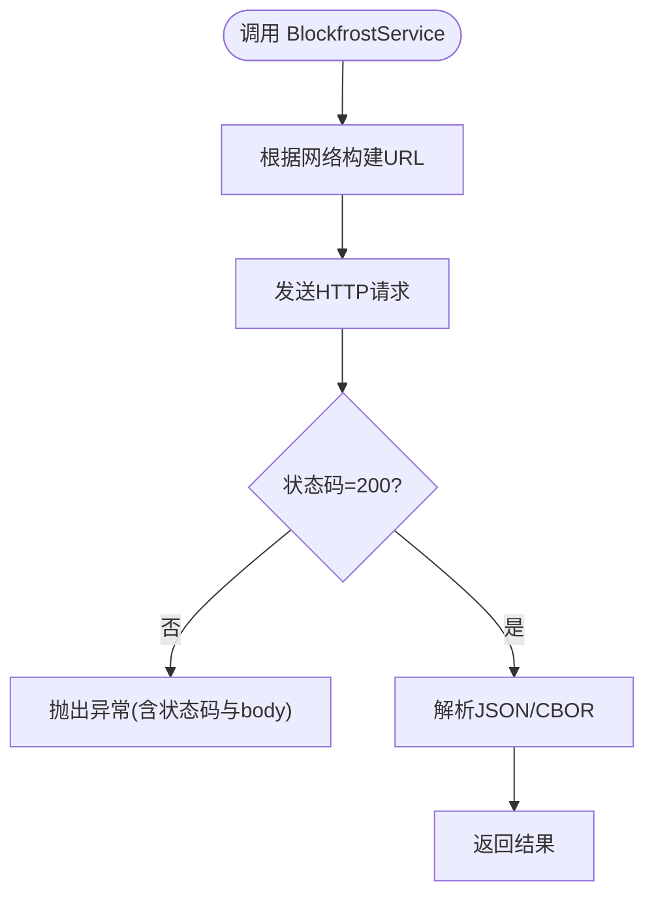
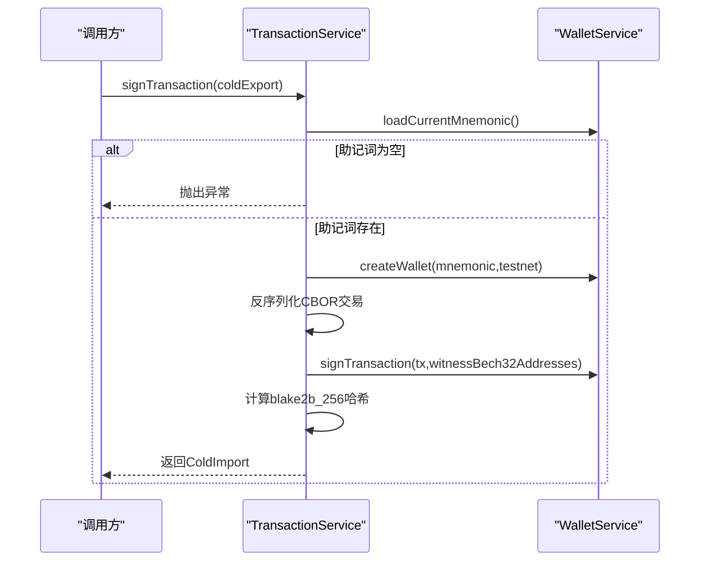
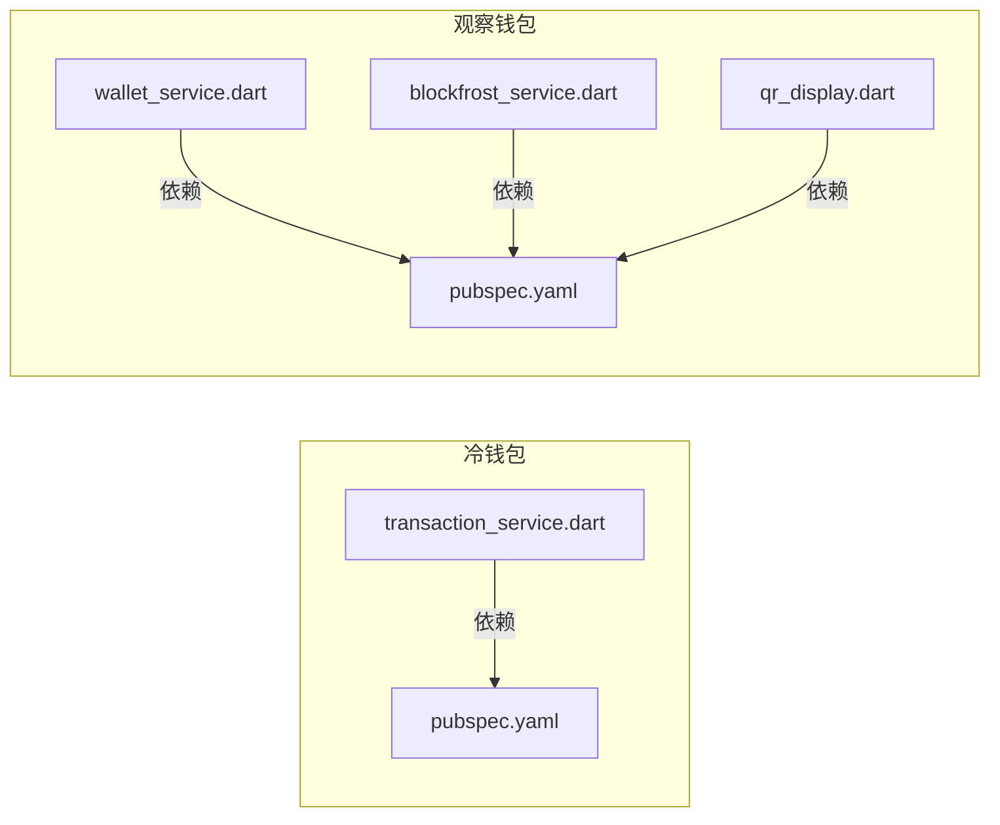

# 测试策略

<cite>
**本文引用的文件**
- [coldwallet-app/pubspec.yaml](file://coldwallet-app/pubspec.yaml)
- [coldwallet-watch/pubspec.yaml](file://coldwallet-watch/pubspec.yaml)
- [coldwallet-app/test/widget_test.dart](file://coldwallet-app/test/widget_test.dart)
- [coldwallet-watch/test/widget_test.dart](file://coldwallet-watch/test/widget_test.dart)
- [coldwallet-watch/test/services/wallet_service_test.dart](file://coldwallet-watch/test/services/wallet_service_test.dart)
- [coldwallet-app/lib/main.dart](file://coldwallet-app/lib/main.dart)
- [coldwallet-watch/lib/app.dart](file://coldwallet-watch/lib/app.dart)
- [coldwallet-watch/lib/services/wallet_service.dart](file://coldwallet-watch/lib/services/wallet_service.dart)
- [coldwallet-watch/lib/services/blockfrost_service.dart](file://coldwallet-watch/lib/services/blockfrost_service.dart)
- [coldwallet-app/lib/services/transaction_service.dart](file://coldwallet-app/lib/services/transaction_service.dart)
- [coldwallet-watch/lib/widgets/qr_display.dart](file://coldwallet-watch/lib/widgets/qr_display.dart)
</cite>

## 目录
1. [引言](#引言)
2. [项目结构](#项目结构)
3. [核心组件](#核心组件)
4. [架构总览](#架构总览)
5. [详细组件分析](#详细组件分析)
6. [依赖分析](#依赖分析)
7. [性能考虑](#性能考虑)
8. [故障排查指南](#故障排查指南)
9. [结论](#结论)
10. [附录](#附录)

## 引言
本测试策略面向 ColdWallet 双端（冷钱包 App 与观察钱包 Watch）的 Flutter/Dart 工程，覆盖单元测试、集成测试与端到端（E2E）测试。重点说明：
- 服务层测试：对钱包管理、网络请求、交易签名等关键路径进行隔离与验证。
- UI 组件测试：对根应用、二维码显示等可交互组件进行冒烟与行为断言。
- 区块链交互测试：对 Blockfrost API 调用进行 Mock 与契约校验，确保离线/在线场景稳定。
- 异步测试处理：针对 Future/Stream 的等待、超时与错误分支覆盖。
- 覆盖率要求、自动化流程与环境配置：保障代码质量与功能稳定性。

## 项目结构
仓库包含两个 Flutter 应用：
- coldwallet-app：完全离线的冷钱包应用，负责助记词管理、离线签名与交易导出。
- coldwallet-watch：联网的观察钱包应用，负责余额查询、UTxO 获取、交易构建与提交。

测试现状：
- 两端均提供基础 widget 测试，用于快速验证应用启动与路由。
- watch 端已实现服务层测试示例，使用 Fake 存储模拟持久化。

图表来源
- [coldwallet-app/lib/main.dart:1-51](file://coldwallet-app/lib/main.dart#L1-L51)
- [coldwallet-watch/lib/app.dart:1-40](file://coldwallet-watch/lib/app.dart#L1-L40)
- [coldwallet-watch/lib/services/wallet_service.dart:1-88](file://coldwallet-watch/lib/services/wallet_service.dart#L1-L88)
- [coldwallet-watch/lib/services/blockfrost_service.dart:1-109](file://coldwallet-watch/lib/services/blockfrost_service.dart#L1-L109)
- [coldwallet-watch/lib/widgets/qr_display.dart:1-18](file://coldwallet-watch/lib/widgets/qr_display.dart#L1-L18)

章节来源
- [coldwallet-app/pubspec.yaml:1-100](file://coldwallet-app/pubspec.yaml#L1-L100)
- [coldwallet-watch/pubspec.yaml:1-101](file://coldwallet-watch/pubspec.yaml#L1-L101)
- [coldwallet-app/lib/main.dart:1-51](file://coldwallet-app/lib/main.dart#L1-L51)
- [coldwallet-watch/lib/app.dart:1-40](file://coldwallet-watch/lib/app.dart#L1-L40)

## 核心组件
- 冷钱包交易服务：解析未签名交易、本地私钥签名、生成已签名交易与哈希。
- 观察钱包钱包服务：只读钱包增删改查、当前钱包切换、地址格式校验。
- 观察钱包网络服务：封装 Blockfrost REST API，提供 UTxO、余额、协议参数与交易提交。
- UI 组件：二维码显示组件，统一尺寸与背景色。

测试要点：
- 服务层：通过接口抽象与 Fake 实现隔离外部依赖（存储、网络）。
- UI 层：使用 flutter_test 的 WidgetTester 进行渲染与交互断言。
- 网络层：注入 http.Client 以便在测试中替换为 Mock 客户端。

章节来源
- [coldwallet-app/lib/services/transaction_service.dart:1-70](file://coldwallet-app/lib/services/transaction_service.dart#L1-L70)
- [coldwallet-watch/lib/services/wallet_service.dart:1-88](file://coldwallet-watch/lib/services/wallet_service.dart#L1-L88)
- [coldwallet-watch/lib/services/blockfrost_service.dart:1-109](file://coldwallet-watch/lib/services/blockfrost_service.dart#L1-L109)
- [coldwallet-watch/lib/widgets/qr_display.dart:1-18](file://coldwallet-watch/lib/widgets/qr_display.dart#L1-L18)

## 架构总览
下图展示冷钱包与观察钱包之间的职责划分与数据流：冷钱包负责离线签名，观察钱包负责链上交互；两者通过二维码/文件交换数据。

图表来源
- [coldwallet-watch/lib/services/wallet_service.dart:1-88](file://coldwallet-watch/lib/services/wallet_service.dart#L1-L88)
- [coldwallet-watch/lib/services/blockfrost_service.dart:1-109](file://coldwallet-watch/lib/services/blockfrost_service.dart#L1-L109)
- [coldwallet-app/lib/services/transaction_service.dart:1-70](file://coldwallet-app/lib/services/transaction_service.dart#L1-L70)

## 详细组件分析

### 钱包管理服务（观察钱包）
职责：
- 加载/保存钱包列表、设置当前钱包、删除钱包时自动切换。
- 校验 Cardano 地址格式（bech32 前缀与最小长度）。

测试策略：
- 使用 FakeStorageService 替代真实存储，断言 getWallets/addWallet/deleteWallet/updateWallet/current wallet 逻辑。
- 覆盖边界：无钱包、当前钱包ID为空、删除后无钱包、更新不存在钱包。

图表来源
- [coldwallet-watch/lib/services/wallet_service.dart:1-88](file://coldwallet-watch/lib/services/wallet_service.dart#L1-L88)
- [coldwallet-watch/test/services/wallet_service_test.dart:1-95](file://coldwallet-watch/test/services/wallet_service_test.dart#L1-L95)

章节来源
- [coldwallet-watch/lib/services/wallet_service.dart:1-88](file://coldwallet-watch/lib/services/wallet_service.dart#L1-L88)
- [coldwallet-watch/test/services/wallet_service_test.dart:1-95](file://coldwallet-watch/test/services/wallet_service_test.dart#L1-L95)

### Blockfrost 网络服务（观察钱包）
职责：
- 根据网络选择 Base URL，构造请求头。
- 提供 UTxO、余额、最新区块、协议参数与交易提交能力。

测试策略：
- 注入自定义 http.Client 以 Mock 响应，覆盖成功与失败分支。
- 断言异常抛出内容与状态码映射。

图表来源
- [coldwallet-watch/lib/services/blockfrost_service.dart:1-109](file://coldwallet-watch/lib/services/blockfrost_service.dart#L1-L109)

章节来源
- [coldwallet-watch/lib/services/blockfrost_service.dart:1-109](file://coldwallet-watch/lib/services/blockfrost_service.dart#L1-L109)

### 交易服务（冷钱包）
职责：
- 解析 ColdExport JSON，创建钱包并签名交易，计算交易哈希，输出 ColdImport。

测试策略：
- Mock WalletService 以返回助记词与钱包实例，避免真实密钥操作。
- 覆盖：缺失助记词、签名失败、哈希计算正确性。

图表来源
- [coldwallet-app/lib/services/transaction_service.dart:1-70](file://coldwallet-app/lib/services/transaction_service.dart#L1-L70)

章节来源
- [coldwallet-app/lib/services/transaction_service.dart:1-70](file://coldwallet-app/lib/services/transaction_service.dart#L1-L70)

### UI 组件测试（二维码显示）
职责：
- 封装 qr_flutter 的 QrImageView，统一尺寸与背景色。

测试策略：
- 使用 WidgetTester 渲染 QRDisplay，断言 QrImageView 被正确构建且尺寸符合预期。
- 可进一步断言背景色与 data 传入值。

章节来源
- [coldwallet-watch/lib/widgets/qr_display.dart:1-18](file://coldwallet-watch/lib/widgets/qr_display.dart#L1-L18)

### 应用入口与路由（冒烟测试）
- 冷钱包应用：验证首页标题文本存在。
- 观察钱包应用：验证 MaterialApp 是否被构建。

章节来源
- [coldwallet-app/test/widget_test.dart:1-21](file://coldwallet-app/test/widget_test.dart#L1-L21)
- [coldwallet-watch/test/widget_test.dart:1-12](file://coldwallet-watch/test/widget_test.dart#L1-L12)
- [coldwallet-app/lib/main.dart:1-51](file://coldwallet-app/lib/main.dart#L1-L51)
- [coldwallet-watch/lib/app.dart:1-40](file://coldwallet-watch/lib/app.dart#L1-L40)

## 依赖分析
- 冷钱包应用依赖 cardano_dart_types、pointycastle 等进行本地签名与哈希计算。
- 观察钱包应用依赖 http 访问 Blockfrost，并使用 qr_flutter、mobile_scanner 等工具。
- 测试依赖 flutter_test，watch 端已引入 mock 模式（FakeStorageService）。

图表来源
- [coldwallet-app/pubspec.yaml:1-100](file://coldwallet-app/pubspec.yaml#L1-L100)
- [coldwallet-watch/pubspec.yaml:1-101](file://coldwallet-watch/pubspec.yaml#L1-L101)
- [coldwallet-app/lib/services/transaction_service.dart:1-70](file://coldwallet-app/lib/services/transaction_service.dart#L1-L70)
- [coldwallet-watch/lib/services/wallet_service.dart:1-88](file://coldwallet-watch/lib/services/wallet_service.dart#L1-L88)
- [coldwallet-watch/lib/services/blockfrost_service.dart:1-109](file://coldwallet-watch/lib/services/blockfrost_service.dart#L1-L109)
- [coldwallet-watch/lib/widgets/qr_display.dart:1-18](file://coldwallet-watch/lib/widgets/qr_display.dart#L1-L18)

章节来源
- [coldwallet-app/pubspec.yaml:1-100](file://coldwallet-app/pubspec.yaml#L1-L100)
- [coldwallet-watch/pubspec.yaml:1-101](file://coldwallet-watch/pubspec.yaml#L1-L101)

## 性能考虑
- 服务层测试优先使用内存级 Fake/Stub，避免磁盘IO与网络开销。
- 网络测试批量 Mock 响应，减少 I/O 次数；必要时使用并发测试但控制并发度。
- UI 测试仅渲染必要组件，避免全量构建导致帧率下降。
- 对耗时算法（如哈希计算）采用小输入或缓存结果，保证测试执行时间可控。

## 故障排查指南
- 网络异常：检查 BlockfrostService 的状态码分支与异常信息；确认 Mock 响应是否符合契约。
- 钱包状态不一致：验证 StorageService 的 setCurrentWalletId 与 getCurrentWalletId 一致性。
- 签名失败：确认 TransactionService 的助记词加载与钱包创建路径；核对 testnet 标志。
- UI 渲染问题：使用 tester.pumpAndSettle 等待异步构建完成；检查路由与初始页面。

章节来源
- [coldwallet-watch/lib/services/blockfrost_service.dart:1-109](file://coldwallet-watch/lib/services/blockfrost_service.dart#L1-L109)
- [coldwallet-watch/lib/services/wallet_service.dart:1-88](file://coldwallet-watch/lib/services/wallet_service.dart#L1-L88)
- [coldwallet-app/lib/services/transaction_service.dart:1-70](file://coldwallet-app/lib/services/transaction_service.dart#L1-L70)

## 结论
本策略围绕“服务层隔离、UI 冒烟、网络契约校验”的核心目标，结合现有测试样例扩展至完整覆盖。通过 Fake/Mock 与清晰的断言规范，确保冷钱包离线签名与观察钱包链上交互的稳定性和可维护性。

## 附录

### 测试类型与范围
- 单元测试
  - 钱包服务：增删改查、当前钱包切换、地址校验。
  - 网络服务：各端点成功/失败分支、异常内容。
  - 交易服务：解析、签名、哈希计算、异常分支。
  - UI 组件：QRDisplay 渲染、尺寸与背景色。
- 集成测试
  - 钱包服务 + 存储：通过 FakeStorageService 验证持久化一致性。
  - 网络服务 + 业务：Mock http.Client 验证端到端数据流转。
- 端到端测试（E2E）
  - 从观察钱包构建交易到冷钱包签名再回到观察钱包提交的完整流程。
  - 使用驱动测试或集成测试框架模拟扫码/文件导入导出。

### 测试用例编写规范
- 命名：test("描述", () async {...})，清晰表达输入与期望。
- 组织：按模块分组 group(...)，便于定位与筛选。
- 断言：每个用例至少一个核心断言；复杂场景增加中间断言。
- 异步：使用 await 与 pump/pumpAndSettle；必要时设置合理超时。
- 错误：显式覆盖异常分支，断言异常类型与消息片段。

### Mock 数据准备
- 存储：FakeStorageService 提供空/有数据、不同网络、API Key 等场景。
- 网络：构造 http.Response 模拟 200/非 200、JSON/CBOR 体。
- 交易：准备合法 CBOR 字符串与助记词占位，避免真实密钥。

### 异步测试处理
- 使用 flutter_test 的异步支持；对 UI 构建使用 pumpWidget 与 pumpAndSettle。
- 对 Future 调用确保 await；对 Stream 使用 expectLater 与 emitsInOrder。
- 设置合理超时与重试策略，避免不稳定环境导致的偶发失败。

### 覆盖率要求
- 行覆盖率：≥ 80%（核心业务逻辑 ≥ 90%）。
- 分支覆盖率：≥ 75%（网络与异常分支必须覆盖）。
- 报告：使用 coverage 工具生成 HTML 报告，纳入 CI 门禁。

### 自动化测试流程
- 本地：flutter test 运行单元与集成测试；coverage 收集覆盖率。
- CI：触发条件（push/PR），并行执行多端测试；失败阻断合并。
- 报告：上传覆盖率报告与测试日志，保留历史趋势。

### 测试环境配置
- 依赖：dev_dependencies 中包含 flutter_test；按需添加 mockito/http_mock_adapter 等。
- 环境变量：区分测试网络（preview/preprod）与 API Key 占位。
- 设备：Android/iOS 模拟器或真机；Web 测试需浏览器环境。

章节来源
- [coldwallet-watch/test/services/wallet_service_test.dart:1-95](file://coldwallet-watch/test/services/wallet_service_test.dart#L1-L95)
- [coldwallet-watch/lib/services/blockfrost_service.dart:1-109](file://coldwallet-watch/lib/services/blockfrost_service.dart#L1-L109)
- [coldwallet-app/lib/services/transaction_service.dart:1-70](file://coldwallet-app/lib/services/transaction_service.dart#L1-L70)
- [coldwallet-watch/lib/widgets/qr_display.dart:1-18](file://coldwallet-watch/lib/widgets/qr_display.dart#L1-L18)
- [coldwallet-app/test/widget_test.dart:1-21](file://coldwallet-app/test/widget_test.dart#L1-L21)
- [coldwallet-watch/test/widget_test.dart:1-12](file://coldwallet-watch/test/widget_test.dart#L1-L12)