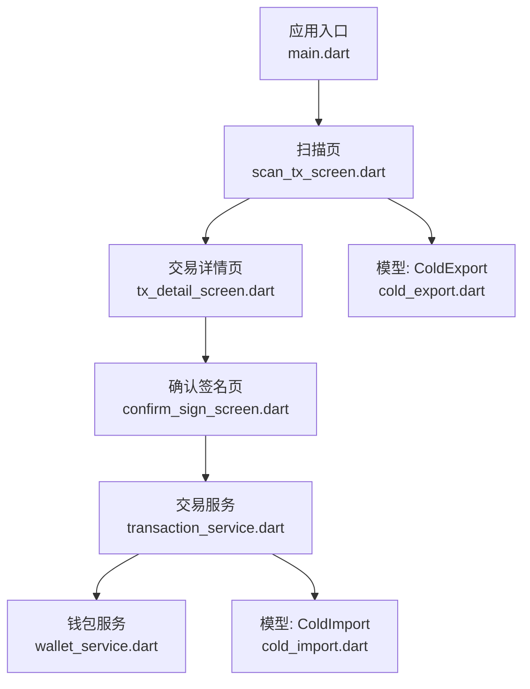
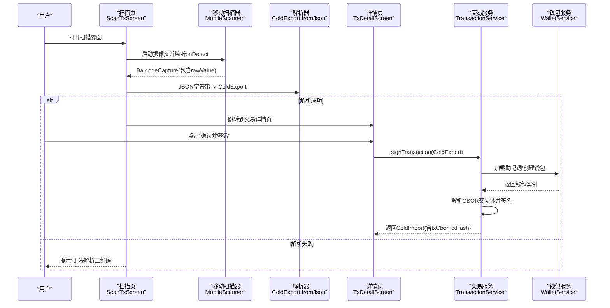
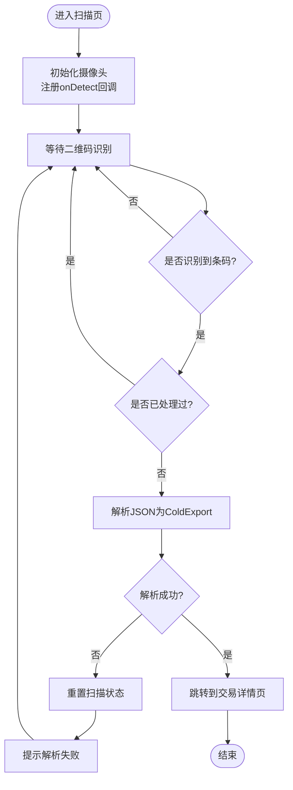
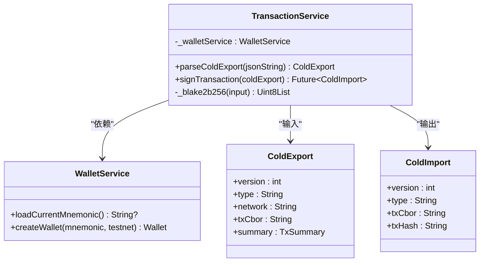
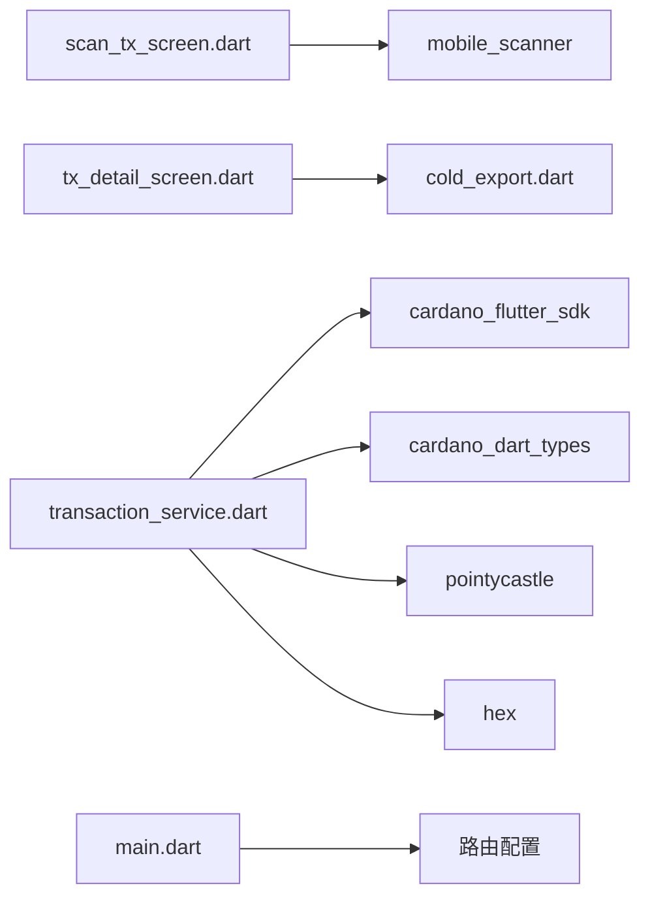

# 二维码扫描界面

<cite>
**本文引用的文件**
- [coldwallet-app/lib/main.dart](file://coldwallet-app/lib/main.dart)
- [coldwallet-app/pubspec.yaml](file://coldwallet-app/pubspec.yaml)
- [coldwallet-app/lib/screens/scan_tx_screen.dart](file://coldwallet-app/lib/screens/scan_tx_screen.dart)
- [coldwallet-app/lib/screens/tx_detail_screen.dart](file://coldwallet-app/lib/screens/tx_detail_screen.dart)
- [coldwallet-app/lib/models/cold_export.dart](file://coldwallet-app/lib/models/cold_export.dart)
- [coldwallet-app/lib/models/cold_import.dart](file://coldwallet-app/lib/models/cold_import.dart)
- [coldwallet-app/lib/services/transaction_service.dart](file://coldwallet-app/lib/services/transaction_service.dart)
</cite>

## 目录
1. [简介](#简介)
2. [项目结构](#项目结构)
3. [核心组件](#核心组件)
4. [架构总览](#架构总览)
5. [详细组件分析](#详细组件分析)
6. [依赖分析](#依赖分析)
7. [性能考虑](#性能考虑)
8. [故障排查指南](#故障排查指南)
9. [结论](#结论)
10. [附录](#附录)

## 简介
本文件聚焦冷钱包App的“二维码扫描界面”，围绕以下目标展开：
- QR码扫描功能：基于摄像头实时识别，捕获未签名交易数据。
- 未签名交易解析：将扫码得到的JSON解析为ColdExport模型，并展示交易摘要。
- 交易详情展示：以可读方式呈现网络、发送方、接收方、金额与手续费等关键信息。
- 权限与错误处理：说明摄像头权限、识别失败、超时等异常场景的处理策略。
- 状态管理：描述扫描成功、失败、重复扫描等状态流转。
- 集成点：与冷钱包服务（TransactionService）协作完成签名与导出。
- 数据格式：说明CBOR交易体在链上交互中的角色，以及JSON作为传输载体的原因。

## 项目结构
冷钱包App采用分层组织：屏幕层负责UI与交互，模型层定义数据结构，服务层封装业务逻辑（如签名）。二维码扫描流程涉及入口路由、扫描页、详情页与服务层的协作。

图表来源
- [coldwallet-app/lib/main.dart:25-47](file://coldwallet-app/lib/main.dart#L25-L47)
- [coldwallet-app/lib/screens/scan_tx_screen.dart:20-47](file://coldwallet-app/lib/screens/scan_tx_screen.dart#L20-L47)
- [coldwallet-app/lib/screens/tx_detail_screen.dart:10-88](file://coldwallet-app/lib/screens/tx_detail_screen.dart#L10-L88)
- [coldwallet-app/lib/services/transaction_service.dart:13-57](file://coldwallet-app/lib/services/transaction_service.dart#L13-L57)

章节来源
- [coldwallet-app/lib/main.dart:11-47](file://coldwallet-app/lib/main.dart#L11-L47)

## 核心组件
- 扫描页（ScanTxScreen）：使用mobile_scanner进行摄像头扫描，捕获Barcode后解析JSON为ColdExport，并跳转至交易详情页。
- 交易详情页（TxDetailScreen）：展示ColdExport摘要信息，提供“确认并签名”操作入口。
- 交易服务（TransactionService）：从助记词恢复钱包，解析CBOR交易体，生成见证集并组装已签名交易，计算交易哈希，输出ColdImport。
- 数据模型（ColdExport/ColdImport/TxSummary/AssetAmount）：定义离线传输的数据结构与序列化/反序列化方法。

章节来源
- [coldwallet-app/lib/screens/scan_tx_screen.dart:20-47](file://coldwallet-app/lib/screens/scan_tx_screen.dart#L20-L47)
- [coldwallet-app/lib/screens/tx_detail_screen.dart:10-88](file://coldwallet-app/lib/screens/tx_detail_screen.dart#L10-L88)
- [coldwallet-app/lib/services/transaction_service.dart:13-57](file://coldwallet-app/lib/services/transaction_service.dart#L13-L57)
- [coldwallet-app/lib/models/cold_export.dart:5-38](file://coldwallet-app/lib/models/cold_export.dart#L5-L38)
- [coldwallet-app/lib/models/cold_import.dart:5-34](file://coldwallet-app/lib/models/cold_import.dart#L5-L34)

## 架构总览
下图展示了从扫码到签名的端到端流程，包括状态管理与异常分支。

图表来源
- [coldwallet-app/lib/screens/scan_tx_screen.dart:23-46](file://coldwallet-app/lib/screens/scan_tx_screen.dart#L23-L46)
- [coldwallet-app/lib/screens/tx_detail_screen.dart:70-78](file://coldwallet-app/lib/screens/tx_detail_screen.dart#L70-L78)
- [coldwallet-app/lib/services/transaction_service.dart:30-57](file://coldwallet-app/lib/services/transaction_service.dart#L30-L57)

## 详细组件分析

### 扫描页（ScanTxScreen）
- 职责：
  - 初始化摄像头并监听二维码识别回调。
  - 对rawValue进行JSON解析，构造ColdExport对象。
  - 成功后跳转至交易详情页；失败时重置状态并提示用户。
- 状态管理：
  - _scanned用于防止重复处理同一帧。
  - 解析失败时重置为false，允许继续扫描。
- 权限与平台：
  - 使用mobile_scanner访问摄像头；需在Android/iOS清单中声明相机权限（由插件管理）。
- 错误处理：
  - 捕获解析异常，显示SnackBar提示“无法解析二维码”。
- 超时与重试：
  - 当前实现无显式超时控制；可通过外层定时器或状态机增加超时与自动重试逻辑。

图表来源
- [coldwallet-app/lib/screens/scan_tx_screen.dart:20-47](file://coldwallet-app/lib/screens/scan_tx_screen.dart#L20-L47)

章节来源
- [coldwallet-app/lib/screens/scan_tx_screen.dart:20-47](file://coldwallet-app/lib/screens/scan_tx_screen.dart#L20-L47)

### 交易详情页（TxDetailScreen）
- 职责：
  - 展示ColdExport.summary中的网络、发送方、接收方、资产列表与手续费。
  - 提供“确认并签名”按钮，触发后续签名流程。
- 数据格式化：
  - 将lovelace转换为ADA显示；非lovelace资产按displayLabel展示。
- 导航：
  - 跳转到确认签名页（ConfirmSignScreen），携带ColdExport以便后续签名。

章节来源
- [coldwallet-app/lib/screens/tx_detail_screen.dart:10-88](file://coldwallet-app/lib/screens/tx_detail_screen.dart#L10-L88)

### 交易服务（TransactionService）
- 职责：
  - 解析ColdExport，使用cardano_flutter_sdk解析CBOR交易体。
  - 通过本地私钥生成见证集，附加到交易中形成已签名交易。
  - 计算交易哈希（Blake2b-256），输出ColdImport。
- 依赖：
  - WalletService：加载助记词、创建钱包实例。
  - cardano_dart_types：交易CBOR解析与序列化。
  - pointycastle：Blake2b-256哈希计算。
- 错误处理：
  - 若助记词缺失或钱包未初始化，抛出异常提示。

图表来源
- [coldwallet-app/lib/services/transaction_service.dart:13-68](file://coldwallet-app/lib/services/transaction_service.dart#L13-L68)
- [coldwallet-app/lib/models/cold_export.dart:5-38](file://coldwallet-app/lib/models/cold_export.dart#L5-L38)
- [coldwallet-app/lib/models/cold_import.dart:5-34](file://coldwallet-app/lib/models/cold_import.dart#L5-L34)

章节来源
- [coldwallet-app/lib/services/transaction_service.dart:13-68](file://coldwallet-app/lib/services/transaction_service.dart#L13-L68)

### 数据模型（ColdExport / ColdImport / TxSummary / AssetAmount）
- ColdExport：承载未签名交易的CBOR、网络标识与摘要，供冷钱包离线签名。
- ColdImport：承载已签名交易的CBOR与交易哈希，供联网端导入并提交。
- TxSummary：简化展示所需的关键字段（发送方、接收方、资产、手续费）。
- AssetAmount：单个资产的单位与数量，支持可选显示名。

章节来源
- [coldwallet-app/lib/models/cold_export.dart:5-109](file://coldwallet-app/lib/models/cold_export.dart#L5-L109)
- [coldwallet-app/lib/models/cold_import.dart:5-36](file://coldwallet-app/lib/models/cold_import.dart#L5-L36)

## 依赖分析
- UI层依赖：
  - mobile_scanner：提供摄像头与二维码识别能力。
  - flutter/material：构建界面与导航。
- 业务层依赖：
  - cardano_flutter_sdk：解析与签名Cardano交易（CBOR）。
  - cardano_dart_types：类型与工具类。
  - pointycastle：密码学哈希（Blake2b-256）。
  - hex：十六进制编解码。
- 配置：
  - pubspec.yaml声明了上述依赖版本。

图表来源
- [coldwallet-app/pubspec.yaml:30-47](file://coldwallet-app/pubspec.yaml#L30-L47)
- [coldwallet-app/lib/screens/scan_tx_screen.dart:3-7](file://coldwallet-app/lib/screens/scan_tx_screen.dart#L3-L7)
- [coldwallet-app/lib/services/transaction_service.dart:4-9](file://coldwallet-app/lib/services/transaction_service.dart#L4-L9)

章节来源
- [coldwallet-app/pubspec.yaml:30-47](file://coldwallet-app/pubspec.yaml#L30-L47)

## 性能考虑
- 扫描频率：避免每帧都解析，已通过_scanned标志去重。
- 解析开销：JSON解析与CBOR解析可能较重，建议在后台线程或异步任务中进行，避免阻塞UI。
- 内存占用：大尺寸二维码图片可能导致内存峰值，应限制预览分辨率或及时释放资源。
- 网络无关：冷钱包完全离线，无需网络请求，减少I/O开销。

[本节为通用指导，不直接分析具体文件]

## 故障排查指南
- 摄像头权限问题：
  - 现象：无法启动摄像头或黑屏。
  - 处理：确保Android/iOS已授予相机权限；检查插件注册与清单配置。
- 二维码无法识别：
  - 现象：onDetect未触发或rawValue为空。
  - 处理：检查光线、距离、二维码清晰度；必要时提示用户调整。
- 解析失败：
  - 现象：jsonDecode或ColdExport.fromJson抛错。
  - 处理：捕获异常并提示“无法解析二维码”；记录原始rawValue便于调试。
- 钱包未初始化：
  - 现象：签名阶段抛出“当前钱包未初始化或助记词丢失”。
  - 处理：引导用户先完成钱包设置或重新导入助记词。
- 超时与重试：
  - 当前无显式超时；可添加计时器，在N秒内未识别则提示并重试。

章节来源
- [coldwallet-app/lib/screens/scan_tx_screen.dart:32-46](file://coldwallet-app/lib/screens/scan_tx_screen.dart#L32-L46)
- [coldwallet-app/lib/services/transaction_service.dart:31-34](file://coldwallet-app/lib/services/transaction_service.dart#L31-L34)

## 结论
该二维码扫描界面以简洁的状态机驱动扫描流程，结合mobile_scanner实现高效识别，并通过ColdExport/ColdImport模型在联网端与冷钱包之间安全传递交易数据。交易服务利用cardano_flutter_sdk完成CBOR解析与签名，确保离线环境下的安全性与正确性。建议后续增强：
- 增加超时与重试机制，提升用户体验。
- 完善权限引导与错误提示，降低用户困惑。
- 引入日志与埋点，便于定位问题。

[本节为总结性内容，不直接分析具体文件]

## 附录
- 关键流程参考路径：
  - 扫描与解析：[scan_tx_screen.dart:23-46](file://coldwallet-app/lib/screens/scan_tx_screen.dart#L23-L46)
  - 交易详情展示：[tx_detail_screen.dart:32-88](file://coldwallet-app/lib/screens/tx_detail_screen.dart#L32-L88)
  - 签名与导出：[transaction_service.dart:30-57](file://coldwallet-app/lib/services/transaction_service.dart#L30-L57)
  - 数据模型定义：[cold_export.dart:5-109](file://coldwallet-app/lib/models/cold_export.dart#L5-L109), [cold_import.dart:5-36](file://coldwallet-app/lib/models/cold_import.dart#L5-L36)
- 依赖声明：[pubspec.yaml:30-47](file://coldwallet-app/pubspec.yaml#L30-L47)
- 路由入口：[main.dart:25-47](file://coldwallet-app/lib/main.dart#L25-L47)