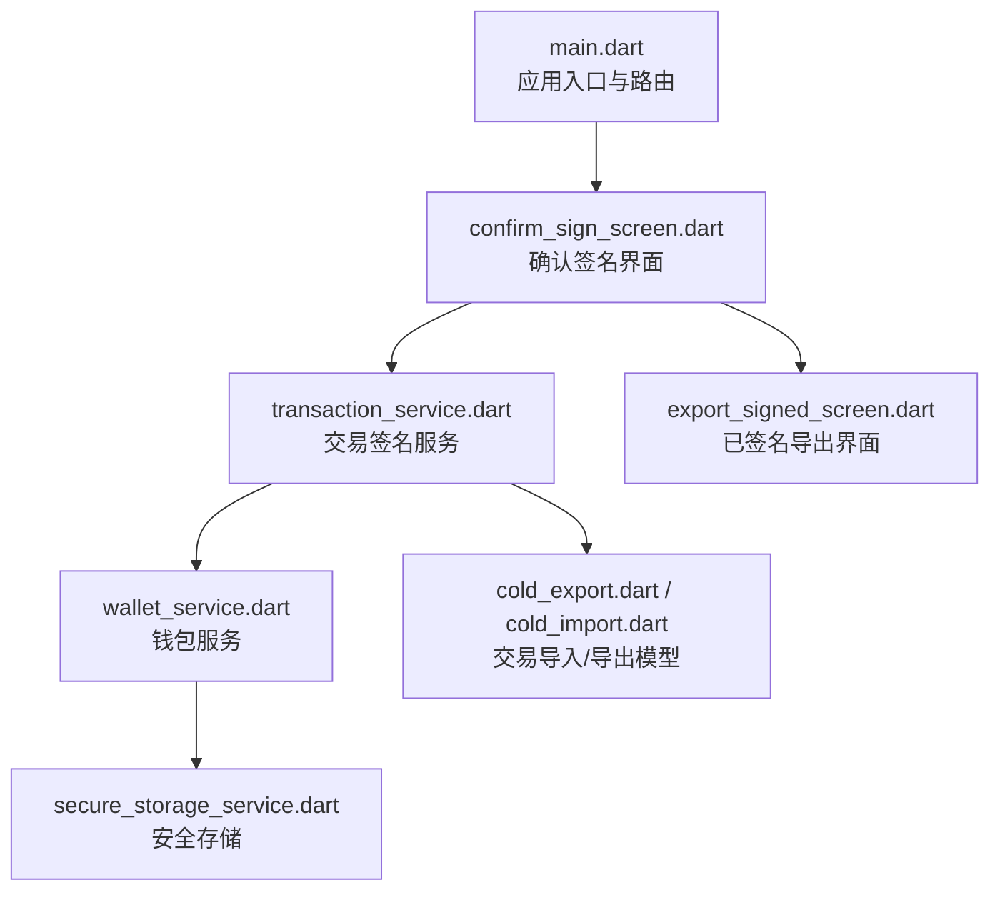
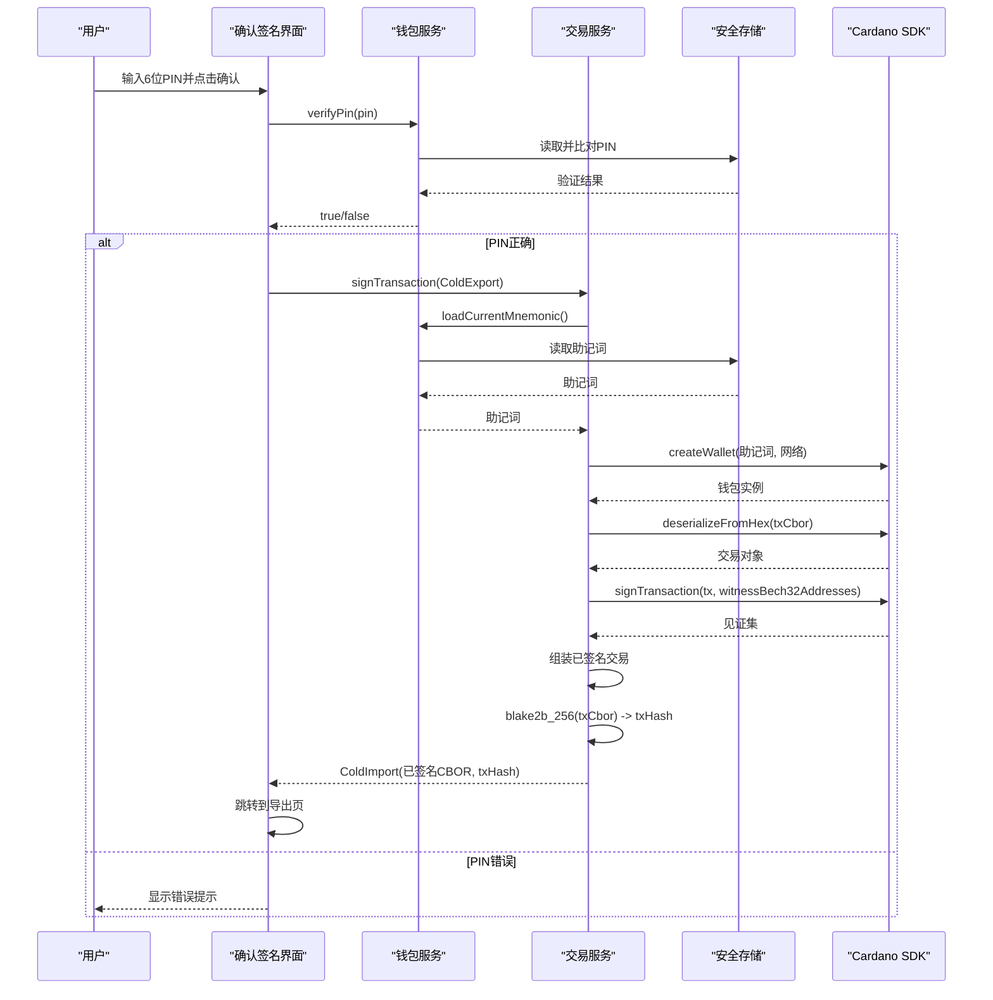
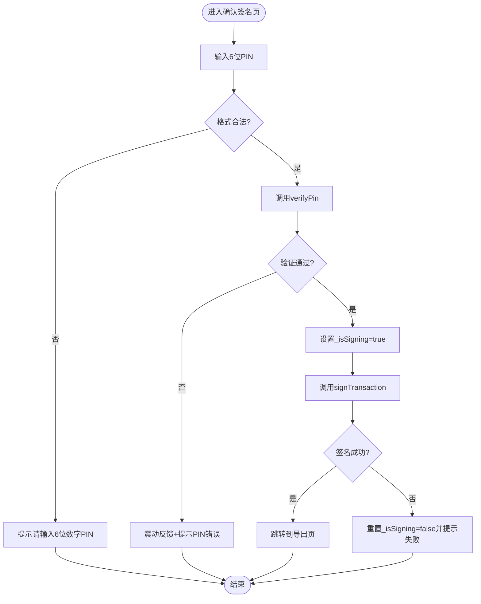
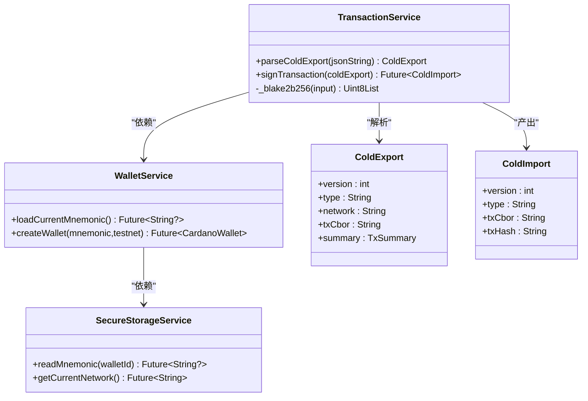
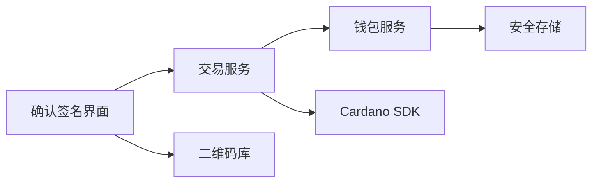

# 交易确认签名界面

<cite>
**本文引用的文件**
- [confirm_sign_screen.dart](file://coldwallet-app/lib/screens/confirm_sign_screen.dart)
- [export_signed_screen.dart](file://coldwallet-app/lib/screens/export_signed_screen.dart)
- [transaction_service.dart](file://coldwallet-app/lib/services/transaction_service.dart)
- [wallet_service.dart](file://coldwallet-app/lib/services/wallet_service.dart)
- [secure_storage_service.dart](file://coldwallet-app/lib/services/secure_storage_service.dart)
- [cold_export.dart](file://coldwallet-app/lib/models/cold_export.dart)
- [cold_import.dart](file://coldwallet-app/lib/models/cold_import.dart)
- [wallet_info.dart](file://coldwallet-app/lib/models/wallet_info.dart)
- [main.dart](file://coldwallet-app/lib/main.dart)
- [pubspec.yaml](file://coldwallet-app/pubspec.yaml)
</cite>

## 目录
1. [简介](#简介)
2. [项目结构](#项目结构)
3. [核心组件](#核心组件)
4. [架构总览](#架构总览)
5. [详细组件分析](#详细组件分析)
6. [依赖关系分析](#依赖关系分析)
7. [性能考虑](#性能考虑)
8. [故障排查指南](#故障排查指南)
9. [结论](#结论)
10. [附录：关键流程与代码片段路径](#附录：关键流程与代码片段路径)

## 简介
本文件面向冷钱包 App 的“交易确认签名界面”，围绕以下目标展开：
- 交易详情展示与解析（发送方、接收方、资产列表、手续费）
- PIN 码验证与安全校验
- 私钥加载与数字签名执行（基于 Cardano SDK）
- 签名结果处理与导出（二维码/复制）
- 状态管理（输入、进度、成功、失败）
- 与区块链 SDK 集成及安全最佳实践

该界面是离线设备侧的关键环节，确保用户明确知晓交易内容，并在本地安全地完成签名。

## 项目结构
冷钱包应用采用分层组织：
- screens：页面级 UI（确认签名、已签名导出等）
- services：业务服务（钱包、交易、安全存储）
- models：数据模型（ColdExport/ColdImport、钱包信息等）
- main：应用入口与路由配置

图表来源
- [main.dart:11-47](file://coldwallet-app/lib/main.dart#L11-L47)
- [confirm_sign_screen.dart:1-151](file://coldwallet-app/lib/screens/confirm_sign_screen.dart#L1-L151)
- [transaction_service.dart:1-70](file://coldwallet-app/lib/services/transaction_service.dart#L1-L70)
- [wallet_service.dart:1-208](file://coldwallet-app/lib/services/wallet_service.dart#L1-L208)
- [secure_storage_service.dart:1-107](file://coldwallet-app/lib/services/secure_storage_service.dart#L1-L107)
- [cold_export.dart:1-109](file://coldwallet-app/lib/models/cold_export.dart#L1-L109)
- [cold_import.dart:1-36](file://coldwallet-app/lib/models/cold_import.dart#L1-L36)

章节来源
- [main.dart:11-47](file://coldwallet-app/lib/main.dart#L11-L47)

## 核心组件
- 确认签名界面（ConfirmSignScreen）
  - 负责展示交易摘要、PIN 输入、调用签名并导航到导出页
  - 状态：空闲、签名中、错误提示
- 交易服务（TransactionService）
  - 解析 ColdExport、加载助记词、构造钱包、签名交易、计算交易哈希、返回 ColdImport
- 钱包服务（WalletService）
  - 创建 HD 钱包、派生地址、网络设置、多钱包管理、PIN 验证
- 安全存储服务（SecureStorageService）
  - 使用系统安全存储保存助记词、PIN、钱包元数据
- 导出界面（ExportSignedScreen）
  - 展示交易哈希、生成二维码或提供复制功能

章节来源
- [confirm_sign_screen.dart:1-151](file://coldwallet-app/lib/screens/confirm_sign_screen.dart#L1-L151)
- [transaction_service.dart:1-70](file://coldwallet-app/lib/services/transaction_service.dart#L1-L70)
- [wallet_service.dart:1-208](file://coldwallet-app/lib/services/wallet_service.dart#L1-L208)
- [secure_storage_service.dart:1-107](file://coldwallet-app/lib/services/secure_storage_service.dart#L1-L107)
- [export_signed_screen.dart:1-156](file://coldwallet-app/lib/screens/export_signed_screen.dart#L1-L156)

## 架构总览
确认签名流程从 UI 触发，经服务层完成 PIN 校验、私钥加载、签名与结果导出。

图表来源
- [confirm_sign_screen.dart:29-60](file://coldwallet-app/lib/screens/confirm_sign_screen.dart#L29-L60)
- [wallet_service.dart:196-206](file://coldwallet-app/lib/services/wallet_service.dart#L196-L206)
- [secure_storage_service.dart:80-98](file://coldwallet-app/lib/services/secure_storage_service.dart#L80-L98)
- [transaction_service.dart:30-57](file://coldwallet-app/lib/services/transaction_service.dart#L30-L57)

## 详细组件分析

### 确认签名界面（ConfirmSignScreen）
- 职责
  - 展示标题与说明，引导用户输入 PIN
  - 校验 PIN 格式（6位数字）
  - 调用 WalletService.verifyPin 进行验证
  - 成功后调用 TransactionService.signTransaction 完成签名
  - 跳转至 ExportSignedScreen 展示结果
- 状态管理
  - _isSigning：控制按钮禁用与加载指示器
  - _obscurePin：PIN 可见性切换
  - 错误通过 SnackBar 提示
- 交互要点
  - 输入框限制为数字且最大长度6
  - 签名过程中禁用操作，避免重复提交

图表来源
- [confirm_sign_screen.dart:29-60](file://coldwallet-app/lib/screens/confirm_sign_screen.dart#L29-L60)
- [confirm_sign_screen.dart:78-151](file://coldwallet-app/lib/screens/confirm_sign_screen.dart#L78-L151)

章节来源
- [confirm_sign_screen.dart:1-151](file://coldwallet-app/lib/screens/confirm_sign_screen.dart#L1-L151)

### 交易服务（TransactionService）
- 职责
  - 解析 ColdExport（包含未签名交易的 CBOR 与摘要）
  - 从当前钱包加载助记词并创建 Cardano 钱包
  - 反序列化交易体、调用 SDK 签名、附加见证
  - 计算交易哈希（blake2b_256）
  - 返回 ColdImport（已签名 CBOR 与交易哈希）
- 关键点
  - 网络选择依据 ColdExport.network（非 mainnet 视为测试网）
  - 签名时指定见证地址为 ColdExport.summary.fromAddress
  - 使用 pointycastle 实现 blake2b_256

图表来源
- [transaction_service.dart:13-69](file://coldwallet-app/lib/services/transaction_service.dart#L13-L69)
- [wallet_service.dart:112-127](file://coldwallet-app/lib/services/wallet_service.dart#L112-L127)
- [cold_export.dart:5-39](file://coldwallet-app/lib/models/cold_export.dart#L5-L39)
- [cold_import.dart:5-35](file://coldwallet-app/lib/models/cold_import.dart#L5-L35)

章节来源
- [transaction_service.dart:1-70](file://coldwallet-app/lib/services/transaction_service.dart#L1-L70)

### 钱包服务（WalletService）
- 职责
  - 生成/校验助记词
  - 创建 HD 钱包并派生地址
  - 多钱包管理与切换
  - 全局网络设置
  - PIN 的保存与验证（委托给 SecureStorageService）
- 关键点
  - 支持最多5个钱包，每个钱包独立助记词
  - 通过 SecureStorageService 持久化敏感数据

章节来源
- [wallet_service.dart:1-208](file://coldwallet-app/lib/services/wallet_service.dart#L1-L208)

### 安全存储服务（SecureStorageService）
- 职责
  - 使用 FlutterSecureStorage 在系统安全存储中保存助记词、PIN、钱包列表和网络设置
- 关键点
  - 当前 PIN 以明文形式存储与比较（TODO：应改为哈希）
  - 提供 clearAll 用于恢复出厂设置

章节来源
- [secure_storage_service.dart:1-107](file://coldwallet-app/lib/services/secure_storage_service.dart#L1-L107)

### 导出界面（ExportSignedScreen）
- 职责
  - 展示交易哈希并提供复制
  - 生成二维码（若数据量不超过容量）
  - 提供复制完整签名数据的选项
- 关键点
  - QR 码容量上限约 2953 字节，超出则提示使用复制方式

章节来源
- [export_signed_screen.dart:1-156](file://coldwallet-app/lib/screens/export_signed_screen.dart#L1-L156)

### 数据模型（ColdExport/ColdImport/TxSummary/AssetAmount）
- ColdExport
  - 包含未签名交易 CBOR、网络标识和交易摘要
- TxSummary
  - 包含发送方、接收方、资产列表与手续费
- AssetAmount
  - 单个资产的单位、数量与可选显示名
- ColdImport
  - 包含已签名交易 CBOR 与交易哈希

章节来源
- [cold_export.dart:1-109](file://coldwallet-app/lib/models/cold_export.dart#L1-L109)
- [cold_import.dart:1-36](file://coldwallet-app/lib/models/cold_import.dart#L1-L36)

## 依赖关系分析
- 外部依赖
  - cardano_flutter_sdk：用于创建钱包、签名交易
  - cardano_dart_types：类型定义
  - flutter_secure_storage：安全存储
  - bip39_plus：助记词校验与转换
  - pointycastle：密码学哈希（blake2b_256）
  - qr_flutter：二维码生成
- 内部依赖
  - 界面层依赖服务层；服务层依赖安全存储与 SDK；模型贯穿各层

图表来源
- [pubspec.yaml:30-47](file://coldwallet-app/pubspec.yaml#L30-L47)
- [confirm_sign_screen.dart:1-151](file://coldwallet-app/lib/screens/confirm_sign_screen.dart#L1-L151)
- [transaction_service.dart:1-70](file://coldwallet-app/lib/services/transaction_service.dart#L1-L70)
- [wallet_service.dart:1-208](file://coldwallet-app/lib/services/wallet_service.dart#L1-L208)
- [secure_storage_service.dart:1-107](file://coldwallet-app/lib/services/secure_storage_service.dart#L1-L107)

章节来源
- [pubspec.yaml:30-47](file://coldwallet-app/pubspec.yaml#L30-L47)

## 性能考虑
- 签名过程可能涉及大对象（CBOR）处理，建议在异步任务中进行，避免阻塞 UI
- 二维码生成对大数据不友好，超过容量时应优先提供复制传输
- 安全存储读写应尽量合并与缓存必要信息，减少频繁 I/O
- 哈希计算（blake2b_256）为 CPU 密集型，注意不要在主线程长时间占用

[本节为通用指导，无需具体文件引用]

## 故障排查指南
- PIN 错误
  - 现象：提示“PIN 错误”并伴随震动反馈
  - 原因：SecureStorageService.verifyPin 比对失败
  - 处理：检查 PIN 是否已设置、是否正确输入
  - 参考位置
    - [confirm_sign_screen.dart:29-41](file://coldwallet-app/lib/screens/confirm_sign_screen.dart#L29-L41)
    - [secure_storage_service.dart:80-98](file://coldwallet-app/lib/services/secure_storage_service.dart#L80-L98)
- 当前钱包未初始化或助记词丢失
  - 现象：抛出异常“当前钱包未初始化或助记词丢失”
  - 原因：无法从安全存储读取助记词
  - 处理：重新导入或创建钱包，确保助记词存在
  - 参考位置
    - [transaction_service.dart:30-34](file://coldwallet-app/lib/services/transaction_service.dart#L30-L34)
- 二维码容量不足
  - 现象：提示“交易数据较大，超出了二维码容量，请使用复制功能传输”
  - 原因：签名后数据超过 QR 码容量上限
  - 处理：使用复制功能传输
  - 参考位置
    - [export_signed_screen.dart:20-30](file://coldwallet-app/lib/screens/export_signed_screen.dart#L20-L30)
    - [export_signed_screen.dart:117-133](file://coldwallet-app/lib/screens/export_signed_screen.dart#L117-L133)
- 签名失败
  - 现象：提示“签名失败: ...”
  - 原因：SDK 签名异常或参数错误
  - 处理：检查交易 CBOR、见证地址、网络设置
  - 参考位置
    - [confirm_sign_screen.dart:45-60](file://coldwallet-app/lib/screens/confirm_sign_screen.dart#L45-L60)

章节来源
- [confirm_sign_screen.dart:29-60](file://coldwallet-app/lib/screens/confirm_sign_screen.dart#L29-L60)
- [transaction_service.dart:30-57](file://coldwallet-app/lib/services/transaction_service.dart#L30-L57)
- [secure_storage_service.dart:80-98](file://coldwallet-app/lib/services/secure_storage_service.dart#L80-L98)
- [export_signed_screen.dart:20-30](file://coldwallet-app/lib/screens/export_signed_screen.dart#L20-L30)
- [export_signed_screen.dart:117-133](file://coldwallet-app/lib/screens/export_signed_screen.dart#L117-L133)

## 结论
确认签名界面将用户意图（输入 PIN）与离线安全能力（本地私钥签名）结合，形成完整的交易确认闭环。通过清晰的状态管理与错误提示，用户可直观感知签名进度与结果。结合 Cardano SDK 的安全能力与系统安全存储，实现了密钥不出设备的离线签名模式。建议后续优化包括：
- PIN 存储升级为哈希（如 PBKDF2/argon2）
- 增加更丰富的交易摘要可视化（资产明细、费用构成）
- 提供更稳健的错误恢复与重试机制

[本节为总结性内容，无需具体文件引用]

## 附录：关键流程与代码片段路径
- 交易摘要解析与展示
  - 模型定义与 JSON 解析：[cold_export.dart:20-39](file://coldwallet-app/lib/models/cold_export.dart#L20-L39)、[cold_export.dart:41-77](file://coldwallet-app/lib/models/cold_export.dart#L41-L77)
- PIN 输入与验证
  - 输入校验与提示：[confirm_sign_screen.dart:29-41](file://coldwallet-app/lib/screens/confirm_sign_screen.dart#L29-L41)
  - PIN 验证实现：[wallet_service.dart:196-206](file://coldwallet-app/lib/services/wallet_service.dart#L196-L206)、[secure_storage_service.dart:80-98](file://coldwallet-app/lib/services/secure_storage_service.dart#L80-L98)
- 私钥加载与签名执行
  - 加载助记词与创建钱包：[wallet_service.dart:112-127](file://coldwallet-app/lib/services/wallet_service.dart#L112-L127)、[wallet_service.dart:64-78](file://coldwallet-app/lib/services/wallet_service.dart#L64-L78)
  - 签名流程与结果组装：[transaction_service.dart:30-57](file://coldwallet-app/lib/services/transaction_service.dart#L30-L57)
- 数字签名算法调用与哈希计算
  - blake2b_256 实现：[transaction_service.dart:59-68](file://coldwallet-app/lib/services/transaction_service.dart#L59-L68)
- 签名结果处理与导出
  - 导出界面与二维码/复制：[export_signed_screen.dart:44-156](file://coldwallet-app/lib/screens/export_signed_screen.dart#L44-L156)
- 与区块链 SDK 集成
  - 依赖声明：[pubspec.yaml:30-47](file://coldwallet-app/pubspec.yaml#L30-L47)
  - SDK 调用点：[transaction_service.dart:36-46](file://coldwallet-app/lib/services/transaction_service.dart#L36-L46)