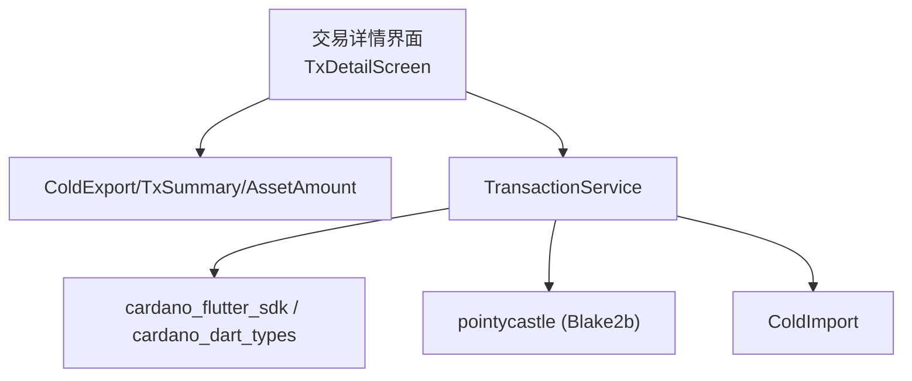
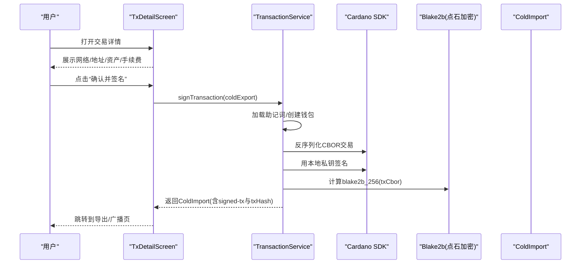
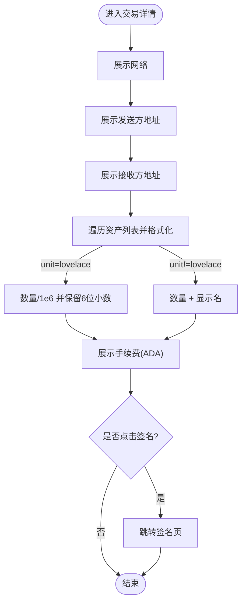
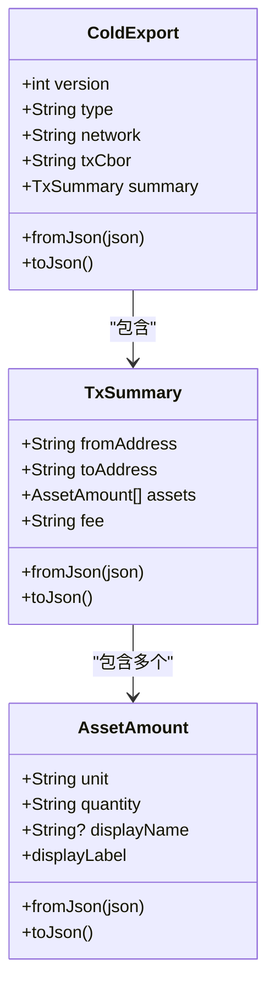
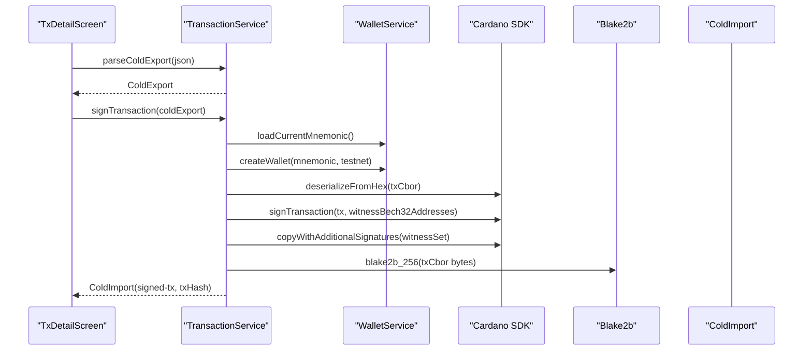
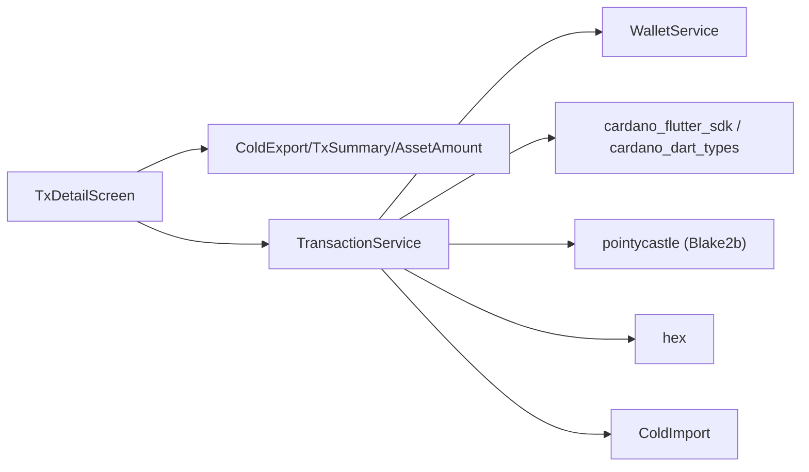

# 交易详情界面

<cite>
**本文引用的文件**
- [tx_detail_screen.dart](file://coldwallet-app/lib/screens/tx_detail_screen.dart)
- [cold_export.dart](file://coldwallet-app/lib/models/cold_export.dart)
- [transaction_service.dart](file://coldwallet-app/lib/services/transaction_service.dart)
- [cold_import.dart](file://coldwallet-app/lib/models/cold_import.dart)
- [pubspec.yaml](file://coldwallet-app/pubspec.yaml)
</cite>

## 目录
1. [简介](#简介)
2. [项目结构](#项目结构)
3. [核心组件](#核心组件)
4. [架构总览](#架构总览)
5. [详细组件分析](#详细组件分析)
6. [依赖关系分析](#依赖关系分析)
7. [性能考虑](#性能考虑)
8. [故障排查指南](#故障排查指南)
9. [结论](#结论)
10. [附录](#附录)

## 简介
本文件聚焦冷钱包App的交易详情界面，围绕未签名交易的解析与展示、交易信息格式化、资产金额显示、交易预览以及后续签名流程展开。重点说明 ColdExport 格式的解析、交易数据结构展示、金额计算与地址验证等核心能力，并给出渲染逻辑、多输入输出场景处理、交易费用计算以及与交易服务交互的业务流程。文档同时提供具体代码路径指引，便于快速定位实现位置。

## 项目结构
交易详情界面位于 screens 层，数据模型在 models 层，业务逻辑在 services 层。交易详情页面接收 ColdExport 对象，负责将摘要信息以卡片形式呈现，并提供“确认并签名”入口跳转至签名流程。交易服务负责解析 JSON、签名交易并生成已签名交易导出体。

图表来源
- [tx_detail_screen.dart:1-124](file://coldwallet-app/lib/screens/tx_detail_screen.dart#L1-L124)
- [cold_export.dart:1-109](file://coldwallet-app/lib/models/cold_export.dart#L1-L109)
- [transaction_service.dart:1-70](file://coldwallet-app/lib/services/transaction_service.dart#L1-L70)
- [cold_import.dart:1-36](file://coldwallet-app/lib/models/cold_import.dart#L1-L36)

章节来源
- [tx_detail_screen.dart:1-124](file://coldwallet-app/lib/screens/tx_detail_screen.dart#L1-L124)
- [cold_export.dart:1-109](file://coldwallet-app/lib/models/cold_export.dart#L1-L109)
- [transaction_service.dart:1-70](file://coldwallet-app/lib/services/transaction_service.dart#L1-L70)
- [cold_import.dart:1-36](file://coldwallet-app/lib/models/cold_import.dart#L1-L36)
- [pubspec.yaml:30-47](file://coldwallet-app/pubspec.yaml#L30-L47)

## 核心组件
- 交易详情界面（TxDetailScreen）：负责展示网络、发送方、接收方、资产列表、手续费，并提供签名入口。
- 数据模型（ColdExport/TxSummary/AssetAmount）：定义未签名交易的结构化摘要，支持 JSON 序列化/反序列化。
- 交易服务（TransactionService）：解析 ColdExport、使用本地助记词和卡迪诺SDK完成签名，并生成 ColdImport。
- 已签名交易导出（ColdImport）：包含签名后的完整交易 CBOR 与交易哈希，供联网端提交上链。

章节来源
- [tx_detail_screen.dart:1-124](file://coldwallet-app/lib/screens/tx_detail_screen.dart#L1-L124)
- [cold_export.dart:1-109](file://coldwallet-app/lib/models/cold_export.dart#L1-L109)
- [transaction_service.dart:1-70](file://coldwallet-app/lib/services/transaction_service.dart#L1-L70)
- [cold_import.dart:1-36](file://coldwallet-app/lib/models/cold_import.dart#L1-L36)

## 架构总览
交易详情界面作为UI入口，接收来自插件端的 ColdExport 数据，进行友好展示；用户确认后进入签名流程，由 TransactionService 调用卡迪诺SDK对未签名交易进行签名，并产出 ColdImport 供后续广播。

图表来源
- [tx_detail_screen.dart:70-85](file://coldwallet-app/lib/screens/tx_detail_screen.dart#L70-L85)
- [transaction_service.dart:30-57](file://coldwallet-app/lib/services/transaction_service.dart#L30-L57)
- [cold_import.dart:1-36](file://coldwallet-app/lib/models/cold_import.dart#L1-L36)

## 详细组件分析

### 交易详情界面（TxDetailScreen）
- 功能要点
  - 展示 ColdExport.summary 中的网络、发送方、接收方、资产列表、手续费。
  - 资产金额格式化：lovelace 按 1e6 换算为 ADA 并保留6位小数；其他资产直接显示数量与显示名。
  - 提供“确认并签名”按钮，跳转至签名页面。
- 关键实现路径
  - 金额格式化：[tx_detail_screen.dart:15-29](file://coldwallet-app/lib/screens/tx_detail_screen.dart#L15-L29)
  - 界面构建与信息卡片：[tx_detail_screen.dart:31-89](file://coldwallet-app/lib/screens/tx_detail_screen.dart#L31-L89)
  - 通用信息卡片组件：[tx_detail_screen.dart:92-122](file://coldwallet-app/lib/screens/tx_detail_screen.dart#L92-L122)

图表来源
- [tx_detail_screen.dart:15-29](file://coldwallet-app/lib/screens/tx_detail_screen.dart#L15-L29)
- [tx_detail_screen.dart:31-89](file://coldwallet-app/lib/screens/tx_detail_screen.dart#L31-L89)

章节来源
- [tx_detail_screen.dart:15-29](file://coldwallet-app/lib/screens/tx_detail_screen.dart#L15-L29)
- [tx_detail_screen.dart:31-89](file://coldwallet-app/lib/screens/tx_detail_screen.dart#L31-L89)
- [tx_detail_screen.dart:92-122](file://coldwallet-app/lib/screens/tx_detail_screen.dart#L92-L122)

### 数据模型（ColdExport/TxSummary/AssetAmount）
- 职责
  - ColdExport：承载未签名交易的元数据（版本、类型、网络、CBOR、摘要）。
  - TxSummary：交易摘要（fromAddress、toAddress、assets、fee）。
  - AssetAmount：单个资产项（unit、quantity、displayName），提供 displayLabel 用于UI展示。
- JSON 解析/序列化
  - ColdExport.fromJson/toJson：[cold_export.dart:20-38](file://coldwallet-app/lib/models/cold_export.dart#L20-L38)
  - TxSummary.fromJson/toJson：[cold_export.dart:57-76](file://coldwallet-app/lib/models/cold_export.dart#L57-L76)
  - AssetAmount.fromJson/toJson/displayLabel：[cold_export.dart:91-108](file://coldwallet-app/lib/models/cold_export.dart#L91-L108)

图表来源
- [cold_export.dart:1-109](file://coldwallet-app/lib/models/cold_export.dart#L1-L109)

章节来源
- [cold_export.dart:1-109](file://coldwallet-app/lib/models/cold_export.dart#L1-L109)

### 交易服务（TransactionService）
- 职责
  - 解析 ColdExport JSON 字符串为对象。
  - 使用本地助记词创建钱包，反序列化未签名交易，生成见证集并附加到交易中。
  - 计算交易哈希（blake2b_256），组装 ColdImport 返回。
- 关键实现路径
  - 解析 ColdExport：[transaction_service.dart:18-24](file://coldwallet-app/lib/services/transaction_service.dart#L18-L24)
  - 签名流程：[transaction_service.dart:26-57](file://coldwallet-app/lib/services/transaction_service.dart#L26-L57)
  - Blake2b 哈希计算：[transaction_service.dart:59-68](file://coldwallet-app/lib/services/transaction_service.dart#L59-L68)

图表来源
- [transaction_service.dart:18-68](file://coldwallet-app/lib/services/transaction_service.dart#L18-L68)
- [cold_import.dart:1-36](file://coldwallet-app/lib/models/cold_import.dart#L1-L36)

章节来源
- [transaction_service.dart:18-68](file://coldwallet-app/lib/services/transaction_service.dart#L18-L68)
- [cold_import.dart:1-36](file://coldwallet-app/lib/models/cold_import.dart#L1-L36)

### 金额计算与资产显示
- ADA 换算：lovelace 除以 1e6，保留6位小数，单位显示为 ADA。
- 非 ADA 资产：直接使用 quantity 与 displayLabel 展示。
- 手续费：统一以 ADA 格式展示。
- 相关实现路径
  - ADA 换算与资产格式化：[tx_detail_screen.dart:15-29](file://coldwallet-app/lib/screens/tx_detail_screen.dart#L15-L29)
  - 资产模型字段与显示标签：[cold_export.dart:79-108](file://coldwallet-app/lib/models/cold_export.dart#L79-L108)

章节来源
- [tx_detail_screen.dart:15-29](file://coldwallet-app/lib/screens/tx_detail_screen.dart#L15-L29)
- [cold_export.dart:79-108](file://coldwallet-app/lib/models/cold_export.dart#L79-L108)

### 地址验证与多输入输出场景
- 地址展示：界面仅展示摘要中的 fromAddress 与 toAddress，不执行链上地址校验。
- 多输入输出：ColdExport.summary.assets 可包含多种资产；如需更复杂的多输入输出明细，可在 TxSummary 扩展 fields（例如 inputs/outputs 列表）并在 UI 中逐项渲染。当前实现通过 assets 列表聚合展示。
- 建议增强
  - 在 TxSummary 增加 inputs/outputs 数组，分别记录每个输入/输出的地址与资产明细。
  - 在 UI 中为每个输入/输出渲染独立行，便于用户核对。
  - 可选：对接地址库进行 Bech32 格式校验与网络一致性检查。

章节来源
- [tx_detail_screen.dart:46-68](file://coldwallet-app/lib/screens/tx_detail_screen.dart#L46-L68)
- [cold_export.dart:41-76](file://coldwallet-app/lib/models/cold_export.dart#L41-L76)

### 交易费用计算
- 费用来源：ColdExport.summary.fee 由上游（插件端或链上估算）提供，界面直接格式化展示。
- 若需前端重算：可在 TransactionService 中结合 Cardano SDK 的预算估算能力重新计算，再回填至 summary.fee。
- 相关实现路径
  - 费用展示：[tx_detail_screen.dart:64-68](file://coldwallet-app/lib/screens/tx_detail_screen.dart#L64-L68)
  - 费用字段定义：[cold_export.dart:41-76](file://coldwallet-app/lib/models/cold_export.dart#L41-L76)

章节来源
- [tx_detail_screen.dart:64-68](file://coldwallet-app/lib/screens/tx_detail_screen.dart#L64-L68)
- [cold_export.dart:41-76](file://coldwallet-app/lib/models/cold_export.dart#L41-L76)

### JSON 解析、数据格式化与错误处理示例路径
- JSON 解析
  - ColdExport.fromJson：[cold_export.dart:20-28](file://coldwallet-app/lib/models/cold_export.dart#L20-L28)
  - TxSummary.fromJson：[cold_export.dart:57-67](file://coldwallet-app/lib/models/cold_export.dart#L57-L67)
  - AssetAmount.fromJson：[cold_export.dart:91-97](file://coldwallet-app/lib/models/cold_export.dart#L91-L97)
  - 服务层解析入口：[transaction_service.dart:18-24](file://coldwallet-app/lib/services/transaction_service.dart#L18-L24)
- 数据格式化
  - ADA 换算与资产格式化：[tx_detail_screen.dart:15-29](file://coldwallet-app/lib/screens/tx_detail_screen.dart#L15-L29)
  - 显示标签 displayLabel：[cold_export.dart:107-108](file://coldwallet-app/lib/models/cold_export.dart#L107-L108)
- 错误处理
  - 助记词缺失异常：[transaction_service.dart:31-34](file://coldwallet-app/lib/services/transaction_service.dart#L31-L34)
  - 金额解析兜底：[tx_detail_screen.dart:15-22](file://coldwallet-app/lib/screens/tx_detail_screen.dart#L15-L22)

章节来源
- [cold_export.dart:20-28](file://coldwallet-app/lib/models/cold_export.dart#L20-L28)
- [cold_export.dart:57-67](file://coldwallet-app/lib/models/cold_export.dart#L57-L67)
- [cold_export.dart:91-97](file://coldwallet-app/lib/models/cold_export.dart#L91-L97)
- [transaction_service.dart:18-24](file://coldwallet-app/lib/services/transaction_service.dart#L18-L24)
- [tx_detail_screen.dart:15-22](file://coldwallet-app/lib/screens/tx_detail_screen.dart#L15-L22)
- [transaction_service.dart:31-34](file://coldwallet-app/lib/services/transaction_service.dart#L31-L34)

## 依赖关系分析
- 外部依赖
  - cardano_flutter_sdk / cardano_dart_types：用于交易反序列化与签名。
  - pointycastle：用于 blake2b_256 哈希计算。
  - hex：用于十六进制编解码。
- 内部依赖
  - TxDetailScreen 依赖 ColdExport 模型。
  - TransactionService 依赖 WalletService（封装助记词与钱包创建）、Cardano SDK、pointycastle。
  - 产物 ColdImport 供后续广播使用。

图表来源
- [pubspec.yaml:30-47](file://coldwallet-app/pubspec.yaml#L30-L47)
- [tx_detail_screen.dart:1-124](file://coldwallet-app/lib/screens/tx_detail_screen.dart#L1-L124)
- [transaction_service.dart:1-70](file://coldwallet-app/lib/services/transaction_service.dart#L1-L70)
- [cold_export.dart:1-109](file://coldwallet-app/lib/models/cold_export.dart#L1-L109)
- [cold_import.dart:1-36](file://coldwallet-app/lib/models/cold_import.dart#L1-L36)

章节来源
- [pubspec.yaml:30-47](file://coldwallet-app/pubspec.yaml#L30-L47)
- [tx_detail_screen.dart:1-124](file://coldwallet-app/lib/screens/tx_detail_screen.dart#L1-L124)
- [transaction_service.dart:1-70](file://coldwallet-app/lib/services/transaction_service.dart#L1-L70)

## 性能考虑
- UI 渲染
  - 资产列表渲染采用简单映射与 join，适合少量资产；若资产较多，建议使用 ListView.builder 分页渲染以提升滚动性能。
- 计算开销
  - ADA 换算与字符串格式化开销极低；签名过程涉及密码学运算，应在后台线程或异步任务中进行，避免阻塞 UI。
- 内存占用
  - 大体积 CBOR 字符串应谨慎持有引用，必要时及时释放或转为流式处理。

## 故障排查指南
- 常见错误与定位
  - 助记词丢失或未初始化：抛出异常提示，需检查钱包初始化流程。参考路径：[transaction_service.dart:31-34](file://coldwallet-app/lib/services/transaction_service.dart#L31-L34)
  - 金额解析失败：回退为原始字符串显示，避免崩溃。参考路径：[tx_detail_screen.dart:15-22](file://coldwallet-app/lib/screens/tx_detail_screen.dart#L15-L22)
  - JSON 解析异常：确保 ColdExport JSON 结构与模型字段一致。参考路径：[cold_export.dart:20-28](file://coldwallet-app/lib/models/cold_export.dart#L20-L28)、[cold_export.dart:57-67](file://coldwallet-app/lib/models/cold_export.dart#L57-L67)
- 调试建议
  - 打印 ColdExport.summary 关键字段（fromAddress、toAddress、assets、fee）以核对上游数据。
  - 在签名前断言 txCbor 非空且为有效十六进制串。
  - 捕获并记录签名过程中的异常堆栈，便于复现问题。

章节来源
- [transaction_service.dart:31-34](file://coldwallet-app/lib/services/transaction_service.dart#L31-L34)
- [tx_detail_screen.dart:15-22](file://coldwallet-app/lib/screens/tx_detail_screen.dart#L15-L22)
- [cold_export.dart:20-28](file://coldwallet-app/lib/models/cold_export.dart#L20-L28)
- [cold_export.dart:57-67](file://coldwallet-app/lib/models/cold_export.dart#L57-L67)

## 结论
交易详情界面以简洁直观的方式展示了未签名交易的关键信息，并通过 TransactionService 完成离线签名与结果导出。当前实现覆盖了主流资产展示与费用显示需求；未来可扩展多输入输出明细、地址校验与费用重算等能力，进一步提升用户体验与安全性。

## 附录
- 关键实现路径索引
  - 交易详情界面：[tx_detail_screen.dart:1-124](file://coldwallet-app/lib/screens/tx_detail_screen.dart#L1-L124)
  - 数据模型（ColdExport/TxSummary/AssetAmount）：[cold_export.dart:1-109](file://coldwallet-app/lib/models/cold_export.dart#L1-L109)
  - 交易服务（解析与签名）：[transaction_service.dart:1-70](file://coldwallet-app/lib/services/transaction_service.dart#L1-L70)
  - 已签名交易导出（ColdImport）：[cold_import.dart:1-36](file://coldwallet-app/lib/models/cold_import.dart#L1-L36)
  - 依赖声明（SDK/加密库）：[pubspec.yaml:30-47](file://coldwallet-app/pubspec.yaml#L30-L47)