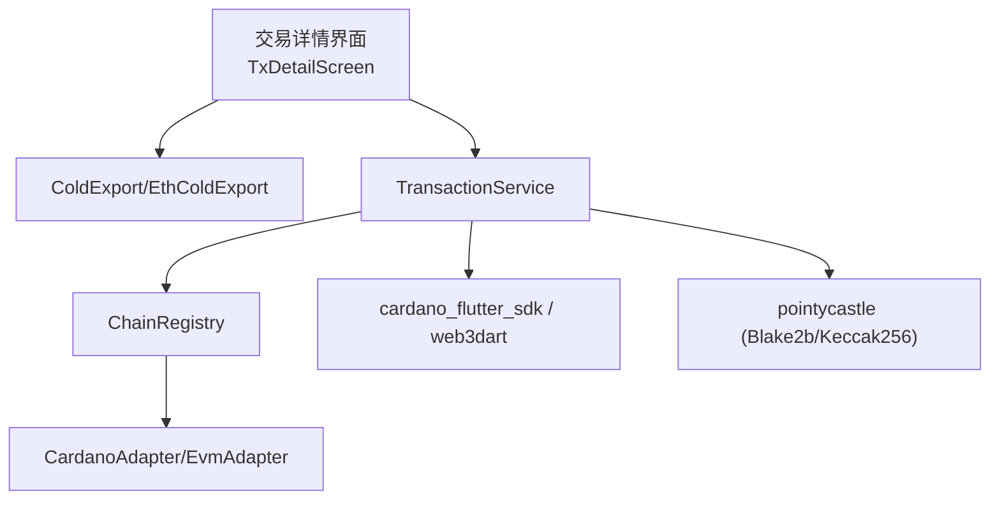
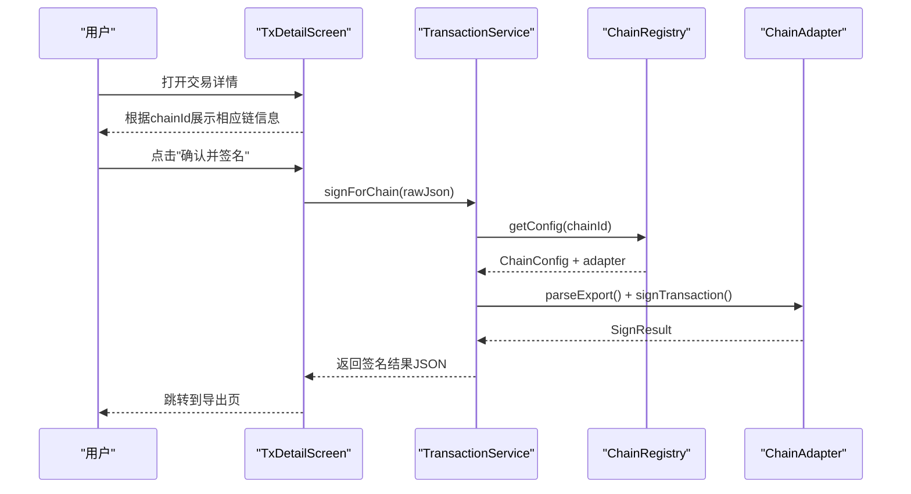
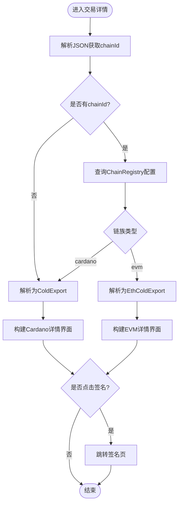
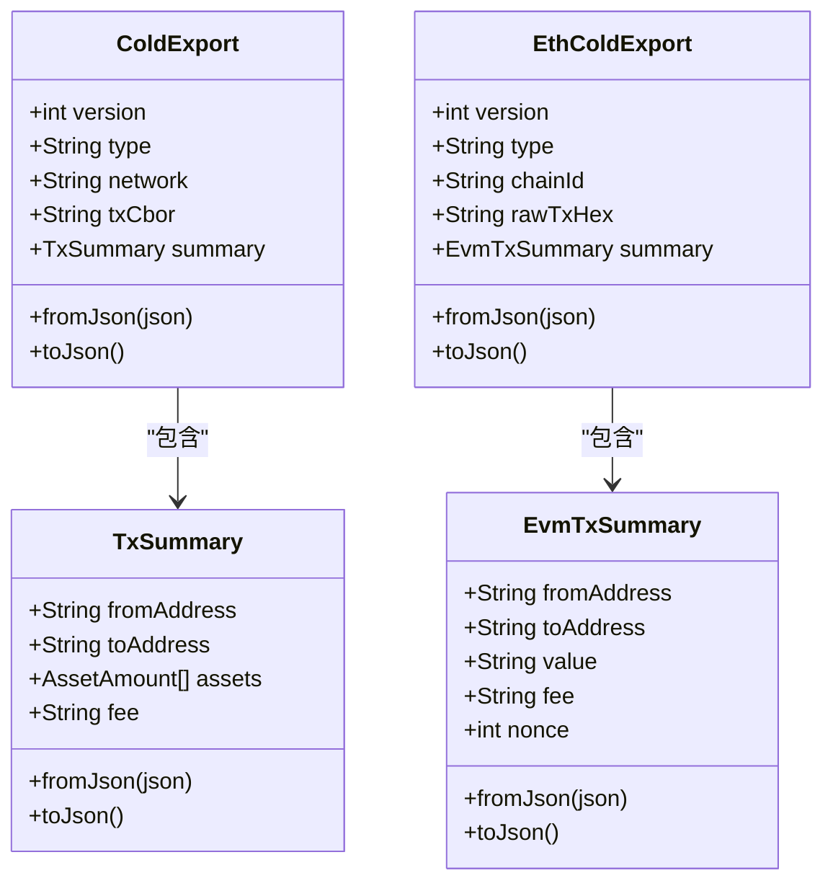
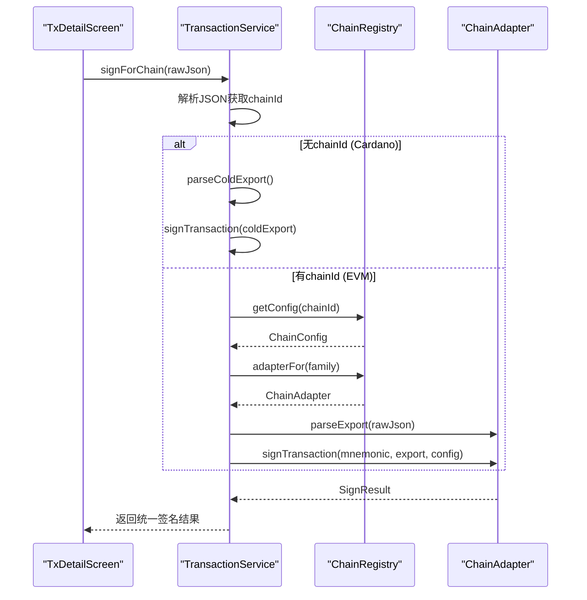
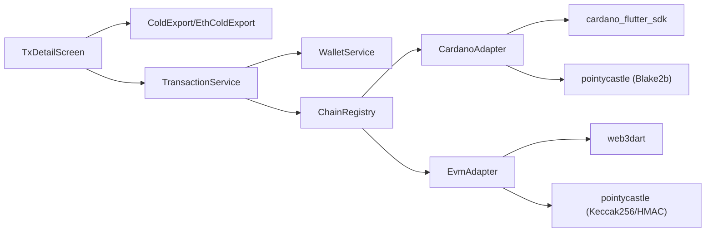

# 交易详情界面

<cite>
**本文引用的文件**
- [tx_detail_screen.dart](file://coldwallet-app/lib/screens/tx_detail_screen.dart)
- [eth_cold_export.dart](file://coldwallet-app/lib/models/eth_cold_export.dart)
- [cold_export.dart](file://coldwallet-app/lib/models/cold_export.dart)
- [transaction_service.dart](file://coldwallet-app/lib/services/transaction_service.dart)
- [chain_registry.dart](file://coldwallet-app/lib/services/chain_registry.dart)
- [evm_adapter.dart](file://coldwallet-app/lib/services/adapters/evm_adapter.dart)
- [confirm_sign_screen.dart](file://coldwallet-app/lib/screens/confirm_sign_screen.dart)
- [chain_config.dart](file://coldwallet-app/lib/models/chain_config.dart)
</cite>

## 更新摘要
**变更内容**
- 新增对 EVM 链（以太坊、BSC、Arbitrum、Polygon、Base 等）交易格式的支持
- 实现统一的交易展示和签名流程，支持 Cardano 和 EVM 两种交易格式
- 添加链注册中心（ChainRegistry）管理多链配置和适配器路由
- 扩展交易详情界面以根据 chainId 自动识别并渲染不同链的交易信息
- 新增 EVM 交易数据模型 EthColdExport 和 EvmTxSummary

## 目录
1. [简介](#简介)
2. [项目结构](#项目结构)
3. [核心组件](#核心组件)
4. [架构总览](#架构总览)
5. [详细组件分析](#详细组件分析)
6. [依赖关系分析](#依赖关系分析)
7. [性能考虑](#性能考虑)
8. [故障排查指南](#故障排查指南)
9. [结论](#结论)
10. [附录](#附录)

## 简介
本文件聚焦冷钱包App的交易详情界面，围绕未签名交易的解析与展示、交易信息格式化、资产金额显示、交易预览以及后续签名流程展开。重点说明 ColdExport 格式的解析、交易数据结构展示、金额计算与地址验证等核心能力，并给出渲染逻辑、多输入输出场景处理、交易费用计算以及与交易服务交互的业务流程。文档同时提供具体代码路径指引，便于快速定位实现位置。

**更新** 现在支持 Cardano 和 EVM 两种交易格式，通过统一的接口提供一致的用户体验。

## 项目结构
交易详情界面位于 screens 层，数据模型在 models 层，业务逻辑在 services 层。交易详情页面接收 JSON 字符串，根据 chainId 字段自动识别链类型并渲染相应的交易信息；用户确认后进入签名流程，由 TransactionService 调用对应链的适配器完成签名。

**图表来源**
- [tx_detail_screen.dart:1-219](file://coldwallet-app/lib/screens/tx_detail_screen.dart#L1-L219)
- [transaction_service.dart:1-109](file://coldwallet-app/lib/services/transaction_service.dart#L1-L109)
- [chain_registry.dart:1-79](file://coldwallet-app/lib/services/chain_registry.dart#L1-L79)
- [evm_adapter.dart:1-369](file://coldwallet-app/lib/services/adapters/evm_adapter.dart#L1-L369)

**章节来源**
- [tx_detail_screen.dart:1-219](file://coldwallet-app/lib/screens/tx_detail_screen.dart#L1-L219)
- [transaction_service.dart:1-109](file://coldwallet-app/lib/services/transaction_service.dart#L1-L109)
- [chain_registry.dart:1-79](file://coldwallet-app/lib/services/chain_registry.dart#L1-L79)

## 核心组件
- 交易详情界面（TxDetailScreen）：负责根据 chainId 自动识别链类型，展示网络、发送方、接收方、资产列表、手续费等信息，并提供签名入口。
- 数据模型（ColdExport/EthColdExport/TxSummary/EvmTxSummary）：定义不同链的交易数据结构，支持 JSON 序列化/反序列化。
- 交易服务（TransactionService）：统一签名入口，根据 chainId 路由到对应链适配器完成签名。
- 链注册中心（ChainRegistry）：管理支持的链配置，提供适配器实例查找。
- 链适配器（ChainAdapter）：抽象接口，CardanoAdapter 和 EvmAdapter 实现具体的签名逻辑。

**章节来源**
- [tx_detail_screen.dart:1-219](file://coldwallet-app/lib/screens/tx_detail_screen.dart#L1-L219)
- [cold_export.dart:1-109](file://coldwallet-app/lib/models/cold_export.dart#L1-L109)
- [eth_cold_export.dart:1-79](file://coldwallet-app/lib/models/eth_cold_export.dart#L1-L79)
- [transaction_service.dart:1-109](file://coldwallet-app/lib/services/transaction_service.dart#L1-L109)
- [chain_registry.dart:1-79](file://coldwallet-app/lib/services/chain_registry.dart#L1-L79)

## 架构总览
交易详情界面作为UI入口，接收来自插件端的 JSON 数据，根据 chainId 字段自动识别链类型并进行友好展示；用户确认后进入签名流程，由 TransactionService 调用 ChainRegistry 获取对应链的适配器完成签名。

**图表来源**
- [tx_detail_screen.dart:44-73](file://coldwallet-app/lib/screens/tx_detail_screen.dart#L44-L73)
- [transaction_service.dart:76-107](file://coldwallet-app/lib/services/transaction_service.dart#L76-L107)
- [chain_registry.dart:57-70](file://coldwallet-app/lib/services/chain_registry.dart#L57-L70)

## 详细组件分析

### 交易详情界面（TxDetailScreen）
- 功能要点
  - 根据 JSON 中的 chainId 字段自动识别链类型
  - Cardano 交易：展示网络、发送方、接收方、资产列表、手续费
  - EVM 交易：展示链名称、发送方、接收方、金额、手续费、Nonce
  - 提供统一的"确认并签名"按钮跳转至签名页面
- 关键实现路径
  - 链类型识别：[tx_detail_screen.dart:44-73](file://coldwallet-app/lib/screens/tx_detail_screen.dart#L44-L73)
  - Cardano 详情构建：[tx_detail_screen.dart:75-118](file://coldwallet-app/lib/screens/tx_detail_screen.dart#L75-L118)
  - EVM 详情构建：[tx_detail_screen.dart:120-169](file://coldwallet-app/lib/screens/tx_detail_screen.dart#L120-L169)
  - 金额格式化：[tx_detail_screen.dart:16-40](file://coldwallet-app/lib/screens/tx_detail_screen.dart#L16-L40)

**图表来源**
- [tx_detail_screen.dart:44-73](file://coldwallet-app/lib/screens/tx_detail_screen.dart#L44-L73)
- [tx_detail_screen.dart:75-169](file://coldwallet-app/lib/screens/tx_detail_screen.dart#L75-L169)

**章节来源**
- [tx_detail_screen.dart:16-40](file://coldwallet-app/lib/screens/tx_detail_screen.dart#L16-L40)
- [tx_detail_screen.dart:44-73](file://coldwallet-app/lib/screens/tx_detail_screen.dart#L44-L73)
- [tx_detail_screen.dart:75-169](file://coldwallet-app/lib/screens/tx_detail_screen.dart#L75-L169)

### 数据模型（ColdExport/EthColdExport）
- 职责
  - ColdExport：承载 Cardano 未签名交易的元数据（版本、类型、网络、CBOR、摘要）
  - EthColdExport：承载 EVM 未签名交易的元数据（版本、类型、chainId、RLP编码交易、摘要）
  - TxSummary：Cardano 交易摘要（fromAddress、toAddress、assets、fee）
  - EvmTxSummary：EVM 交易摘要（fromAddress、toAddress、value、fee、nonce）
- JSON 解析/序列化
  - ColdExport.fromJson/toJson：[cold_export.dart:20-38](file://coldwallet-app/lib/models/cold_export.dart#L20-L38)
  - EthColdExport.fromJson/toJson：[eth_cold_export.dart:20-38](file://coldwallet-app/lib/models/eth_cold_export.dart#L20-L38)
  - TxSummary.fromJson/toJson：[cold_export.dart:57-76](file://coldwallet-app/lib/models/cold_export.dart#L57-L76)
  - EvmTxSummary.fromJson/toJson：[eth_cold_export.dart:59-77](file://coldwallet-app/lib/models/eth_cold_export.dart#L59-L77)

**图表来源**
- [cold_export.dart:1-109](file://coldwallet-app/lib/models/cold_export.dart#L1-L109)
- [eth_cold_export.dart:1-79](file://coldwallet-app/lib/models/eth_cold_export.dart#L1-L79)

**章节来源**
- [cold_export.dart:1-109](file://coldwallet-app/lib/models/cold_export.dart#L1-L109)
- [eth_cold_export.dart:1-79](file://coldwallet-app/lib/models/eth_cold_export.dart#L1-L79)

### 交易服务（TransactionService）
- 职责
  - 统一签名入口 signForChain：根据 chainId 自动识别链类型并路由到对应适配器
  - Cardano 签名：使用 cardano_flutter_sdk 解析 CBOR 交易体，用本地私钥签名
  - EVM 签名：通过 EvmAdapter 处理 EIP-1559 和 Legacy RLP 交易签名
  - 返回统一的签名结果格式
- 关键实现路径
  - 统一签名入口：[transaction_service.dart:76-107](file://coldwallet-app/lib/services/transaction_service.dart#L76-L107)
  - Cardano 签名流程：[transaction_service.dart:31-58](file://coldwallet-app/lib/services/transaction_service.dart#L31-L58)
  - Blake2b 哈希计算：[transaction_service.dart:60-69](file://coldwallet-app/lib/services/transaction_service.dart#L60-L69)

**图表来源**
- [transaction_service.dart:76-107](file://coldwallet-app/lib/services/transaction_service.dart#L76-L107)
- [chain_registry.dart:57-70](file://coldwallet-app/lib/services/chain_registry.dart#L57-L70)

**章节来源**
- [transaction_service.dart:31-107](file://coldwallet-app/lib/services/transaction_service.dart#L31-L107)

### 链注册中心（ChainRegistry）
- 职责
  - 管理所有支持的链配置，包括 Cardano 和多个 EVM 链
  - 提供适配器实例查找，根据链族返回对应的适配器
  - 支持动态添加新链配置
- 支持的链
  - Cardano Preview 测试网
  - Ethereum Sepolia 测试网
  - BSC Testnet
  - Arbitrum Sepolia
  - Polygon Amoy
  - Base Sepolia
- 关键实现路径
  - 链配置定义：[chain_registry.dart:11-55](file://coldwallet-app/lib/services/chain_registry.dart#L11-L55)
  - 适配器查找：[chain_registry.dart:57-67](file://coldwallet-app/lib/services/chain_registry.dart#L57-L67)

**章节来源**
- [chain_registry.dart:11-67](file://coldwallet-app/lib/services/chain_registry.dart#L11-L67)

### EVM 适配器（EvmAdapter）
- 职责
  - 实现 ChainAdapter 接口，处理 EVM 链的交易签名
  - 支持 EIP-1559 和 Legacy RLP 交易格式
  - 使用 BIP-39/BIP-32 派生 secp256k1 私钥
  - 实现完整的 RLP 编解码功能
- 关键实现路径
  - 交易解析：[evm_adapter.dart:35-39](file://coldwallet-app/lib/services/adapters/evm_adapter.dart#L35-L39)
  - 交易签名：[evm_adapter.dart:41-66](file://coldwallet-app/lib/services/adapters/evm_adapter.dart#L41-L66)
  - 私钥派生：[evm_adapter.dart:68-117](file://coldwallet-app/lib/services/adapters/evm_adapter.dart#L68-L117)
  - RLP 编解码：[evm_adapter.dart:240-360](file://coldwallet-app/lib/services/adapters/evm_adapter.dart#L240-L360)

**章节来源**
- [evm_adapter.dart:35-117](file://coldwallet-app/lib/services/adapters/evm_adapter.dart#L35-L117)
- [evm_adapter.dart:240-360](file://coldwallet-app/lib/services/adapters/evm_adapter.dart#L240-L360)

### 金额计算与资产显示
- Cardano 资产显示
  - ADA 换算：lovelace 除以 1e6，保留6位小数，单位显示为 ADA
  - 非 ADA 资产：直接使用 quantity 与 displayLabel 展示
  - 手续费：统一以 ADA 格式展示
- EVM 资产显示
  - ETH 换算：wei 除以 1e18，保留6位小数，单位显示为 ETH
  - 手续费：同样以 wei 为单位进行换算显示
  - Nonce：直接显示整数形式
- 相关实现路径
  - Cardano 金额格式化：[tx_detail_screen.dart:16-40](file://coldwallet-app/lib/screens/tx_detail_screen.dart#L16-L40)
  - EVM 金额格式化：[tx_detail_screen.dart:25-33](file://coldwallet-app/lib/screens/tx_detail_screen.dart#L25-L33)

**章节来源**
- [tx_detail_screen.dart:16-40](file://coldwallet-app/lib/screens/tx_detail_screen.dart#L16-L40)

### 地址验证与多输入输出场景
- 地址展示：界面仅展示摘要中的 fromAddress 与 toAddress，不执行链上地址校验
- 多输入输出：
  - Cardano：通过 assets 列表聚合展示多种资产
  - EVM：当前实现主要关注单笔转账，如需复杂的多输入输出明细可扩展 EvmTxSummary
- 建议增强
  - 在 EvmTxSummary 增加 inputs/outputs 数组，记录更详细的交易结构
  - 可选：对接地址库进行地址格式校验与网络一致性检查

**章节来源**
- [tx_detail_screen.dart:89-162](file://coldwallet-app/lib/screens/tx_detail_screen.dart#L89-L162)
- [cold_export.dart:44-76](file://coldwallet-app/lib/models/cold_export.dart#L44-L76)
- [eth_cold_export.dart:44-77](file://coldwallet-app/lib/models/eth_cold_export.dart#L44-L77)

### 交易费用计算
- 费用来源：由上游（插件端或链上估算）提供，界面直接格式化展示
- Cardano 费用：以 lovelace 为单位，换算为 ADA 显示
- EVM 费用：以 wei 为单位，换算为 ETH 显示
- 若需前端重算：可在对应链适配器中结合链上估算能力重新计算

**章节来源**
- [tx_detail_screen.dart:107-162](file://coldwallet-app/lib/screens/tx_detail_screen.dart#L107-L162)

### JSON 解析、数据格式化与错误处理示例路径
- JSON 解析
  - ColdExport.fromJson：[cold_export.dart:20-28](file://coldwallet-app/lib/models/cold_export.dart#L20-L28)
  - EthColdExport.fromJson：[eth_cold_export.dart:20-28](file://coldwallet-app/lib/models/eth_cold_export.dart#L20-L28)
  - 服务层解析入口：[transaction_service.dart:76-89](file://coldwallet-app/lib/services/transaction_service.dart#L76-L89)
- 数据格式化
  - Cardano 金额格式化：[tx_detail_screen.dart:16-40](file://coldwallet-app/lib/screens/tx_detail_screen.dart#L16-L40)
  - EVM 金额格式化：[tx_detail_screen.dart:25-33](file://coldwallet-app/lib/screens/tx_detail_screen.dart#L25-L33)
- 错误处理
  - 助记词缺失异常：[transaction_service.dart:31-34](file://coldwallet-app/lib/services/transaction_service.dart#L31-L34)
  - 不支持的链：[tx_detail_screen.dart:52-72](file://coldwallet-app/lib/screens/tx_detail_screen.dart#L52-L72)
  - 金额解析兜底：[tx_detail_screen.dart:17-33](file://coldwallet-app/lib/screens/tx_detail_screen.dart#L17-L33)

**章节来源**
- [cold_export.dart:20-28](file://coldwallet-app/lib/models/cold_export.dart#L20-L28)
- [eth_cold_export.dart:20-28](file://coldwallet-app/lib/models/eth_cold_export.dart#L20-L28)
- [transaction_service.dart:31-89](file://coldwallet-app/lib/services/transaction_service.dart#L31-L89)
- [tx_detail_screen.dart:17-72](file://coldwallet-app/lib/screens/tx_detail_screen.dart#L17-L72)

## 依赖关系分析
- 外部依赖
  - cardano_flutter_sdk / cardano_dart_types：用于 Cardano 交易反序列化与签名
  - web3dart：用于 EVM 交易处理和加密操作
  - pointycastle：用于密码学运算（Blake2b、Keccak256、HMAC-SHA512）
  - bip39_plus：用于助记词转种子
  - hex：用于十六进制编解码
- 内部依赖
  - TxDetailScreen 依赖 ColdExport 和 EthColdExport 模型
  - TransactionService 依赖 WalletService、ChainRegistry 和链适配器
  - ChainRegistry 管理所有链配置和适配器实例

**图表来源**
- [tx_detail_screen.dart:1-219](file://coldwallet-app/lib/screens/tx_detail_screen.dart#L1-L219)
- [transaction_service.dart:1-109](file://coldwallet-app/lib/services/transaction_service.dart#L1-L109)
- [chain_registry.dart:1-79](file://coldwallet-app/lib/services/chain_registry.dart#L1-L79)
- [evm_adapter.dart:1-369](file://coldwallet-app/lib/services/adapters/evm_adapter.dart#L1-L369)

**章节来源**
- [tx_detail_screen.dart:1-219](file://coldwallet-app/lib/screens/tx_detail_screen.dart#L1-L219)
- [transaction_service.dart:1-109](file://coldwallet-app/lib/services/transaction_service.dart#L1-L109)
- [chain_registry.dart:1-79](file://coldwallet-app/lib/services/chain_registry.dart#L1-L79)

## 性能考虑
- UI 渲染
  - 资产列表渲染采用简单映射与 join，适合少量资产；若资产较多，建议使用 ListView.builder 分页渲染以提升滚动性能
  - EVM 交易详情相对简单，主要是单个值显示，性能开销较小
- 计算开销
  - 金额换算与字符串格式化开销极低
  - 签名过程涉及密码学运算，应在后台线程或异步任务中进行，避免阻塞 UI
  - EVM 适配器的 RLP 编解码可能产生较大计算量，需注意性能优化
- 内存占用
  - 大体积 CBOR/RLP 字符串应谨慎持有引用，必要时及时释放或转为流式处理

## 故障排查指南
- 常见错误与定位
  - 助记词丢失或未初始化：抛出异常提示，需检查钱包初始化流程。参考路径：[transaction_service.dart:31-34](file://coldwallet-app/lib/services/transaction_service.dart#L31-L34)
  - 不支持的链：当 chainId 不在 ChainRegistry 中时显示错误。参考路径：[tx_detail_screen.dart:52-72](file://coldwallet-app/lib/screens/tx_detail_screen.dart#L52-L72)
  - EVM 交易格式错误：RLP 编解码失败或交易字段不完整。参考路径：[evm_adapter.dart:124-190](file://coldwallet-app/lib/services/adapters/evm_adapter.dart#L124-L190)
  - 金额解析失败：回退为原始字符串显示，避免崩溃。参考路径：[tx_detail_screen.dart:17-33](file://coldwallet-app/lib/screens/tx_detail_screen.dart#L17-L33)
- 调试建议
  - 打印 JSON 中的 chainId 字段以确认链类型识别是否正确
  - 在签名前断言交易数据非空且格式正确
  - 捕获并记录签名过程中的异常堆栈，便于复现问题
  - 对于 EVM 交易，检查 rawTxHex 是否为有效的十六进制字符串

**章节来源**
- [transaction_service.dart:31-34](file://coldwallet-app/lib/services/transaction_service.dart#L31-L34)
- [tx_detail_screen.dart:52-72](file://coldwallet-app/lib/screens/tx_detail_screen.dart#L52-L72)
- [evm_adapter.dart:124-190](file://coldwallet-app/lib/services/adapters/evm_adapter.dart#L124-L190)
- [tx_detail_screen.dart:17-33](file://coldwallet-app/lib/screens/tx_detail_screen.dart#L17-L33)

## 结论
交易详情界面现已支持 Cardano 和 EVM 两种交易格式，通过统一的接口提供一致的用户体验。系统能够自动识别链类型并渲染相应的交易信息，通过 TransactionService 和 ChainRegistry 实现灵活的链适配机制。当前实现覆盖了主流资产展示与费用显示需求，具备良好的扩展性以支持更多区块链网络。未来可进一步扩展多输入输出明细、地址校验与费用重算等能力，持续提升用户体验与安全性。

## 附录
- 关键实现路径索引
  - 交易详情界面：[tx_detail_screen.dart:1-219](file://coldwallet-app/lib/screens/tx_detail_screen.dart#L1-L219)
  - Cardano 数据模型：[cold_export.dart:1-109](file://coldwallet-app/lib/models/cold_export.dart#L1-L109)
  - EVM 数据模型：[eth_cold_export.dart:1-79](file://coldwallet-app/lib/models/eth_cold_export.dart#L1-L79)
  - 交易服务：[transaction_service.dart:1-109](file://coldwallet-app/lib/services/transaction_service.dart#L1-L109)
  - 链注册中心：[chain_registry.dart:1-79](file://coldwallet-app/lib/services/chain_registry.dart#L1-L79)
  - EVM 适配器：[evm_adapter.dart:1-369](file://coldwallet-app/lib/services/adapters/evm_adapter.dart#L1-L369)
  - 确认签名界面：[confirm_sign_screen.dart:1-143](file://coldwallet-app/lib/screens/confirm_sign_screen.dart#L1-L143)
  - 链配置模型：[chain_config.dart:1-49](file://coldwallet-app/lib/models/chain_config.dart#L1-L49)