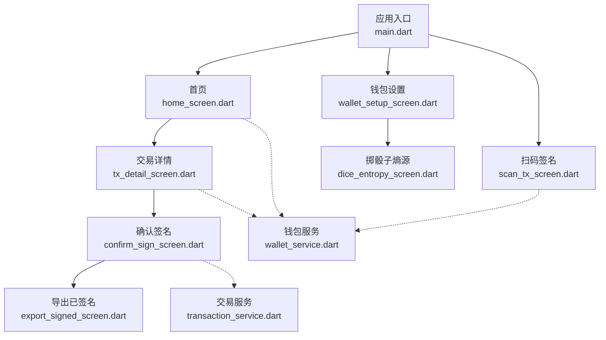
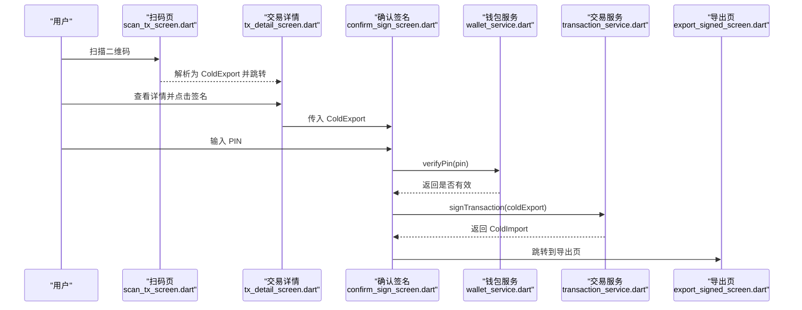
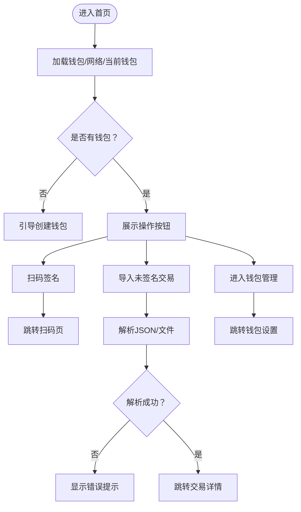
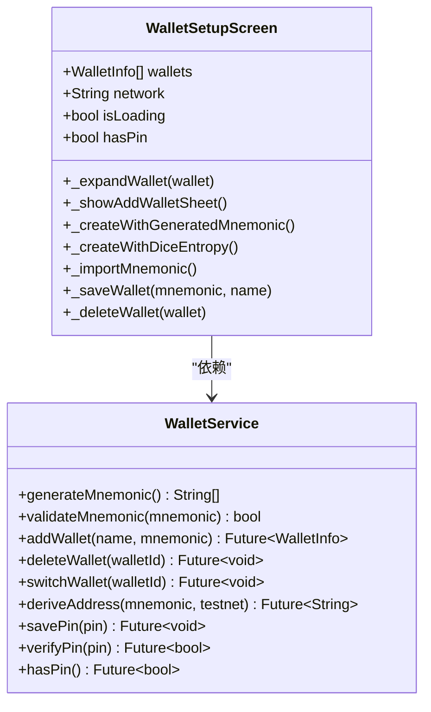
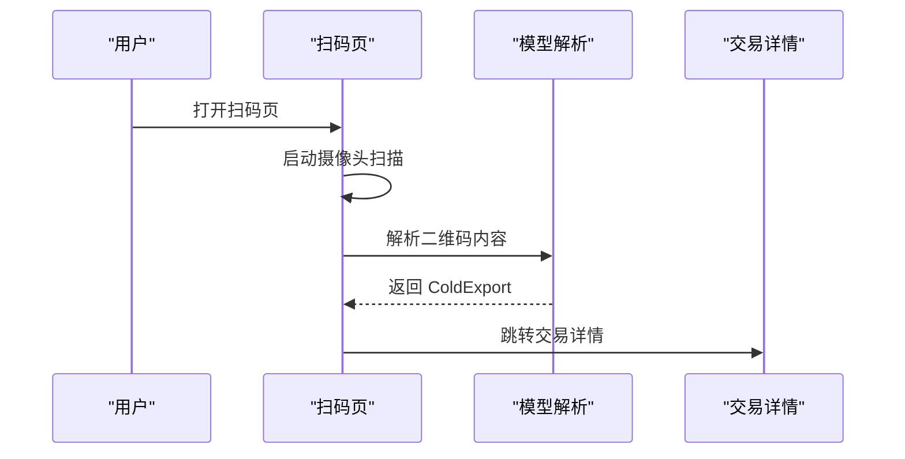
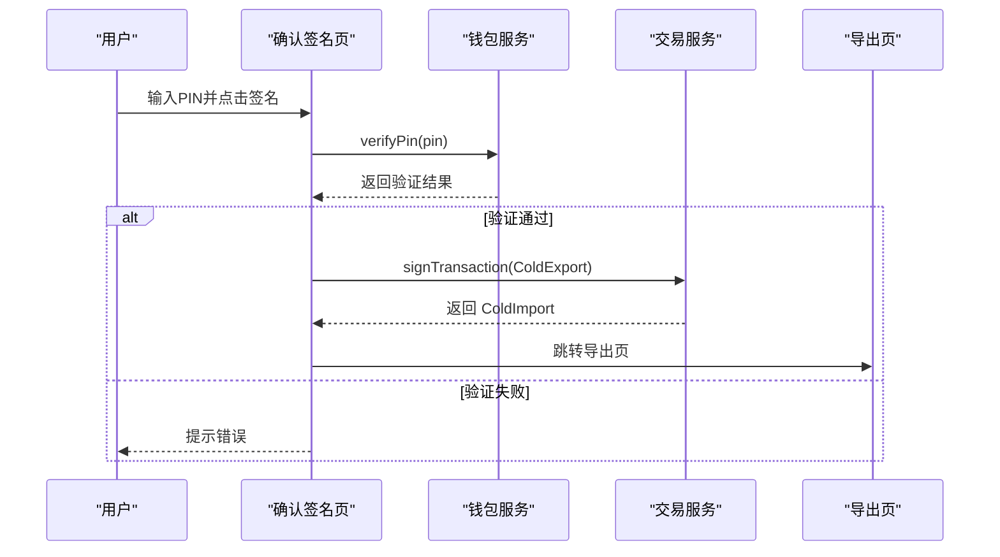
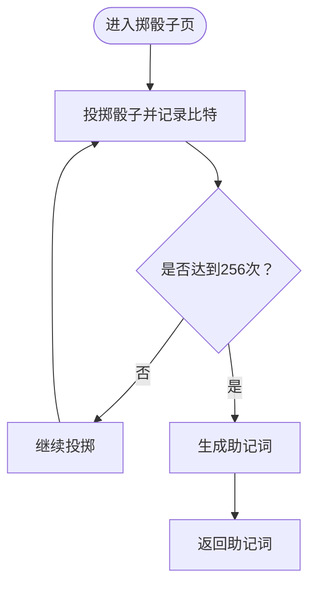
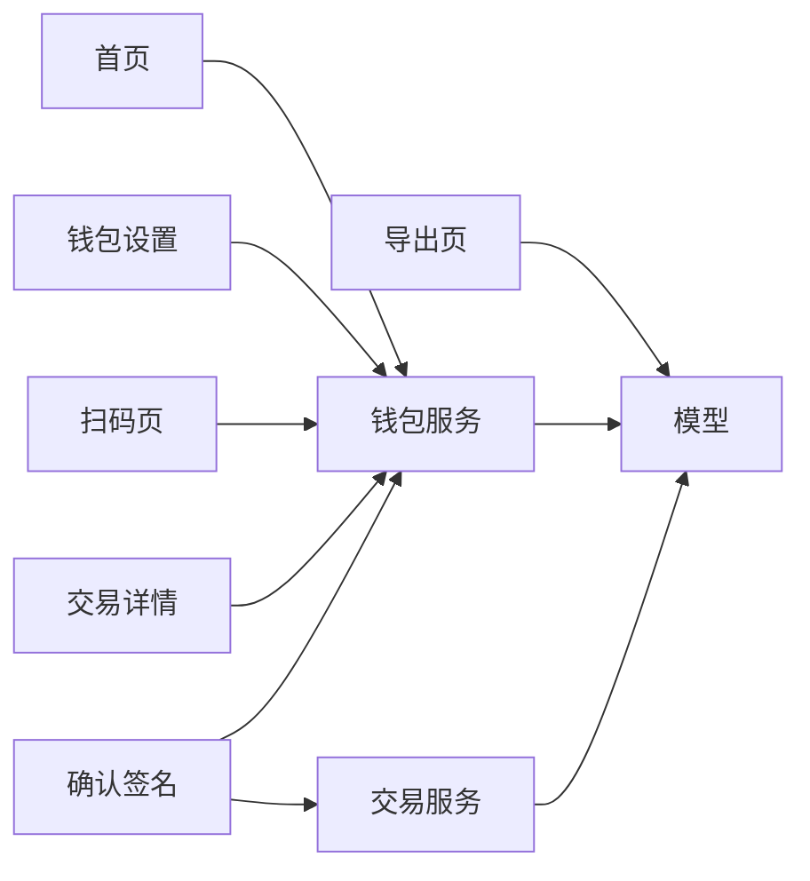

# 冷钱包App界面

<cite>
**本文引用的文件**
- [main.dart](file://coldwallet-app/lib/main.dart)
- [home_screen.dart](file://coldwallet-app/lib/screens/home_screen.dart)
- [wallet_setup_screen.dart](file://coldwallet-app/lib/screens/wallet_setup_screen.dart)
- [scan_tx_screen.dart](file://coldwallet-app/lib/screens/scan_tx_screen.dart)
- [tx_detail_screen.dart](file://coldwallet-app/lib/screens/tx_detail_screen.dart)
- [confirm_sign_screen.dart](file://coldwallet-app/lib/screens/confirm_sign_screen.dart)
- [export_signed_screen.dart](file://coldwallet-app/lib/screens/export_signed_screen.dart)
- [dice_entropy_screen.dart](file://coldwallet-app/lib/screens/dice_entropy_screen.dart)
- [wallet_service.dart](file://coldwallet-app/lib/services/wallet_service.dart)
- [transaction_service.dart](file://coldwallet-app/lib/services/transaction_service.dart)
- [cold_export.dart](file://coldwallet-app/lib/models/cold_export.dart)
- [pubspec.yaml](file://coldwallet-app/pubspec.yaml)
</cite>

## 目录
1. [简介](#简介)
2. [项目结构](#项目结构)
3. [核心组件](#核心组件)
4. [架构总览](#架构总览)
5. [详细组件分析](#详细组件分析)
6. [依赖关系分析](#依赖关系分析)
7. [性能考虑](#性能考虑)
8. [故障排查指南](#故障排查指南)
9. [结论](#结论)
10. [附录](#附录)

## 简介
本文件面向冷钱包App的离线签名端用户界面，系统化说明首页、钱包设置、二维码扫描、交易确认、已签名交易导出、交易详情与随机数生成等界面的职责、交互流程、状态管理与服务集成方式。文档同时覆盖布局设计、响应式适配、错误处理与用户体验优化策略，并提供代码级参考路径以便快速定位实现。

## 项目结构
冷钱包App基于Flutter构建，采用分层组织：
- 入口与路由：应用根组件配置Material3主题与页面路由
- 界面层（screens）：各业务页面负责UI展示与用户交互
- 服务层（services）：封装助记词管理、PIN校验、网络切换、交易签名等能力
- 模型层（models）：定义跨页面传递的数据结构（如未签名交易导出结构）

图表来源
- [main.dart:25-47](file://coldwallet-app/lib/main.dart#L25-L47)
- [home_screen.dart:108-179](file://coldwallet-app/lib/screens/home_screen.dart#L108-L179)
- [wallet_setup_screen.dart:394-403](file://coldwallet-app/lib/screens/wallet_setup_screen.dart#L394-L403)
- [scan_tx_screen.dart:49-86](file://coldwallet-app/lib/screens/scan_tx_screen.dart#L49-L86)
- [tx_detail_screen.dart:31-89](file://coldwallet-app/lib/screens/tx_detail_screen.dart#L31-L89)
- [confirm_sign_screen.dart:78-149](file://coldwallet-app/lib/screens/confirm_sign_screen.dart#L78-L149)
- [export_signed_screen.dart:44-153](file://coldwallet-app/lib/screens/export_signed_screen.dart#L44-L153)
- [dice_entropy_screen.dart:62-182](file://coldwallet-app/lib/screens/dice_entropy_screen.dart#L62-L182)
- [wallet_service.dart:13-207](file://coldwallet-app/lib/services/wallet_service.dart#L13-L207)
- [transaction_service.dart:13-69](file://coldwallet-app/lib/services/transaction_service.dart#L13-L69)

章节来源
- [main.dart:11-47](file://coldwallet-app/lib/main.dart#L11-L47)
- [pubspec.yaml:30-46](file://coldwallet-app/pubspec.yaml#L30-L46)

## 核心组件
- 应用根组件：配置Material3主题、亮/暗色模式与初始路由
- 首页：钱包选择器、网络切换、扫码签名入口、文件导入入口、钱包管理入口
- 钱包设置：多钱包列表、新增（生成/掷骰子/导入）、删除、查看地址与助记词
- 扫码签名：摄像头扫描二维码并解析为未签名交易数据
- 交易详情：展示网络、发送方、接收方、金额、手续费等信息
- 确认签名：输入PIN验证后调用交易服务进行离线签名
- 导出已签名：展示交易哈希、完整CBOR二维码或复制数据
- 掷骰子熵源：通过物理骰子收集256位真随机熵生成助记词

章节来源
- [main.dart:16-47](file://coldwallet-app/lib/main.dart#L16-L47)
- [home_screen.dart:12-179](file://coldwallet-app/lib/screens/home_screen.dart#L12-L179)
- [wallet_setup_screen.dart:8-403](file://coldwallet-app/lib/screens/wallet_setup_screen.dart#L8-L403)
- [scan_tx_screen.dart:9-86](file://coldwallet-app/lib/screens/scan_tx_screen.dart#L9-L86)
- [tx_detail_screen.dart:6-89](file://coldwallet-app/lib/screens/tx_detail_screen.dart#L6-L89)
- [confirm_sign_screen.dart:9-149](file://coldwallet-app/lib/screens/confirm_sign_screen.dart#L9-L149)
- [export_signed_screen.dart:9-153](file://coldwallet-app/lib/screens/export_signed_screen.dart#L9-L153)
- [dice_entropy_screen.dart:6-182](file://coldwallet-app/lib/screens/dice_entropy_screen.dart#L6-L182)

## 架构总览
界面与服务之间的协作遵循“界面只负责展示与交互，服务负责业务逻辑”的原则：
- 界面通过WalletService访问助记词、网络、钱包列表与PIN校验
- 交易签名由TransactionService完成，内部使用Cardano SDK对CBOR交易体签名并计算哈希
- 数据在页面间以模型对象（ColdExport/ColdImport）传递，确保离线安全传输

图表来源
- [scan_tx_screen.dart:23-46](file://coldwallet-app/lib/screens/scan_tx_screen.dart#L23-L46)
- [tx_detail_screen.dart:70-79](file://coldwallet-app/lib/screens/tx_detail_screen.dart#L70-L79)
- [confirm_sign_screen.dart:29-60](file://coldwallet-app/lib/screens/confirm_sign_screen.dart#L29-L60)
- [wallet_service.dart:196-206](file://coldwallet-app/lib/services/wallet_service.dart#L196-L206)
- [transaction_service.dart:30-57](file://coldwallet-app/lib/services/transaction_service.dart#L30-L57)
- [export_signed_screen.dart:44-153](file://coldwallet-app/lib/screens/export_signed_screen.dart#L44-L153)

## 详细组件分析

### 首页（HomeScreen）
- 功能职责
  - 展示当前钱包与钱包数量，支持切换钱包
  - 提供网络切换（主网/测试网）
  - 提供扫码签名、导入未签名交易、进入钱包管理入口
  - 无钱包时引导创建第一个钱包
- 用户交互流程
  - 点击钱包卡片弹出底部选择器，选择后刷新状态
  - 点击网络按钮在主网与测试网之间切换
  - 扫码签名：导航到扫码页；完成后刷新状态
  - 导入未签名交易：支持从文件或粘贴JSON，解析成功后跳转交易详情
- 状态管理实现
  - 使用StatefulWidget维护钱包列表、当前钱包、网络、加载状态
  - initState中异步加载钱包、当前钱包与网络，更新UI
- 与服务集成
  - WalletService：获取钱包列表、当前钱包、网络、切换钱包
- 布局与响应式
  - 使用Scaffold+AppBar+Padding+Column布局，按钮区域自适应宽度
  - 使用Theme.of(context)统一样式，适配亮/暗色
- 错误处理与体验优化
  - 文件读取失败显示红色提示条
  - JSON解析失败显示错误提示
  - 无钱包时禁用相关操作按钮，避免误触

图表来源
- [home_screen.dart:32-48](file://coldwallet-app/lib/screens/home_screen.dart#L32-L48)
- [home_screen.dart:52-99](file://coldwallet-app/lib/screens/home_screen.dart#L52-L99)
- [home_screen.dart:101-105](file://coldwallet-app/lib/screens/home_screen.dart#L101-L105)
- [home_screen.dart:182-270](file://coldwallet-app/lib/screens/home_screen.dart#L182-L270)

章节来源
- [home_screen.dart:12-378](file://coldwallet-app/lib/screens/home_screen.dart#L12-L378)
- [wallet_service.dart:82-127](file://coldwallet-app/lib/services/wallet_service.dart#L82-L127)

### 钱包设置界面（WalletSetupScreen）
- 功能职责
  - 展示所有钱包列表，支持展开查看地址与助记词、复制、删除
  - 新增钱包：生成新助记词、掷骰子生成、导入已有助记词
  - 首次进入空状态引导创建第一个钱包
- 用户交互流程
  - 点击钱包卡片展开详细信息，再次点击收起
  - 新增钱包通过底部弹窗选择方式，生成或导入助记词后命名并确认备份
  - 若未设置PIN则引导设置6位数字PIN（全局）
  - 删除钱包前二次确认，删除后自动切换当前钱包
- 状态管理实现
  - 维护钱包列表、网络、加载状态、PIN存在标志、展开状态
  - 展开钱包时临时切换至目标钱包以派生地址与加载助记词，再恢复原钱包
- 与服务集成
  - WalletService：生成助记词、验证助记词、添加/删除钱包、切换钱包、派生地址、保存/校验PIN
- 布局与响应式
  - 使用SingleChildScrollView承载长列表，卡片化展示每个钱包
  - 空状态使用图标+文案+操作按钮引导
- 错误处理与体验优化
  - 助记词无效提示错误
  - PIN格式校验与一致性校验
  - 删除前确认对话框防止误删
  - 复制助记词时提醒立即离线保存

图表来源
- [wallet_setup_screen.dart:19-82](file://coldwallet-app/lib/screens/wallet_setup_screen.dart#L19-L82)
- [wallet_setup_screen.dart:86-169](file://coldwallet-app/lib/screens/wallet_setup_screen.dart#L86-L169)
- [wallet_setup_screen.dart:172-346](file://coldwallet-app/lib/screens/wallet_setup_screen.dart#L172-L346)
- [wallet_setup_screen.dart:348-390](file://coldwallet-app/lib/screens/wallet_setup_screen.dart#L348-L390)
- [wallet_service.dart:20-78](file://coldwallet-app/lib/services/wallet_service.dart#L20-L78)
- [wallet_service.dart:135-175](file://coldwallet-app/lib/services/wallet_service.dart#L135-L175)
- [wallet_service.dart:196-206](file://coldwallet-app/lib/services/wallet_service.dart#L196-L206)

章节来源
- [wallet_setup_screen.dart:8-612](file://coldwallet-app/lib/screens/wallet_setup_screen.dart#L8-L612)
- [wallet_service.dart:13-207](file://coldwallet-app/lib/services/wallet_service.dart#L13-L207)

### 二维码扫描界面（ScanTxScreen）
- 功能职责
  - 使用摄像头扫描联网设备展示的未签名交易二维码
  - 解析二维码内容为ColdExport并跳转交易详情
- 用户交互流程
  - 打开页面即启动扫描，检测到二维码后解析并跳转
  - 解析失败重置扫描状态并提示错误
- 状态管理实现
  - 使用_scanned标记防止重复处理
- 与服务集成
  - 直接解析模型数据，不依赖钱包服务
- 布局与响应式
  - 使用Stack叠加摄像头预览与扫描框、提示文字
- 错误处理与体验优化
  - 解析异常时提示无法解析二维码
  - 扫描框视觉引导提升识别率

图表来源
- [scan_tx_screen.dart:23-46](file://coldwallet-app/lib/screens/scan_tx_screen.dart#L23-L46)
- [scan_tx_screen.dart:49-86](file://coldwallet-app/lib/screens/scan_tx_screen.dart#L49-L86)

章节来源
- [scan_tx_screen.dart:9-88](file://coldwallet-app/lib/screens/scan_tx_screen.dart#L9-L88)

### 交易详情界面（TxDetailScreen）
- 功能职责
  - 展示未签名交易的摘要信息：网络、发送方、接收方、金额、手续费
  - 提供“确认并签名”入口进入PIN验证签名页
- 用户交互流程
  - 用户阅读交易摘要后点击签名按钮
- 状态管理实现
  - 纯展示型页面，无本地状态
- 与服务集成
  - 仅传递ColdExport给确认签名页
- 布局与响应式
  - 使用Card分组展示各项信息，按钮固定在底部
- 错误处理与体验优化
  - 金额格式化兼容lovelace与其他资产单位

章节来源
- [tx_detail_screen.dart:6-124](file://coldwallet-app/lib/screens/tx_detail_screen.dart#L6-L124)

### 交易确认界面（ConfirmSignScreen）
- 功能职责
  - 输入6位PIN进行授权签名
  - 调用交易服务对ColdExport进行离线签名
  - 签名成功后跳转到导出已签名交易页
- 用户交互流程
  - 输入PIN并点击确认签名，期间显示加载状态
  - 签名失败回退并提示错误
- 状态管理实现
  - _isSigning控制按钮禁用与加载指示
  - _obscurePin控制PIN可见性
- 与服务集成
  - WalletService.verifyPin校验PIN
  - TransactionService.signTransaction执行签名
- 布局与响应式
  - 居中锁图标+标题+说明+PIN输入+操作按钮
- 错误处理与体验优化
  - PIN格式校验、错误震动反馈
  - 签名异常时重置状态并提示

图表来源
- [confirm_sign_screen.dart:29-60](file://coldwallet-app/lib/screens/confirm_sign_screen.dart#L29-L60)
- [confirm_sign_screen.dart:78-149](file://coldwallet-app/lib/screens/confirm_sign_screen.dart#L78-L149)
- [wallet_service.dart:196-206](file://coldwallet-app/lib/services/wallet_service.dart#L196-L206)
- [transaction_service.dart:30-57](file://coldwallet-app/lib/services/transaction_service.dart#L30-L57)

章节来源
- [confirm_sign_screen.dart:9-151](file://coldwallet-app/lib/screens/confirm_sign_screen.dart#L9-L151)
- [transaction_service.dart:13-69](file://coldwallet-app/lib/services/transaction_service.dart#L13-L69)
- [wallet_service.dart:196-206](file://coldwallet-app/lib/services/wallet_service.dart#L196-L206)

### 已签名交易导出界面（ExportSignedScreen）
- 功能职责
  - 展示交易哈希与完整签名数据
  - 根据数据大小决定是否生成二维码
  - 提供复制交易哈希与复制完整签名数据
- 用户交互流程
  - 用户扫描二维码或复制数据进行后续提交
- 状态管理实现
  - 无本地状态，仅计算payload长度判断是否适合二维码
- 与服务集成
  - 直接使用ColdImport模型数据
- 布局与响应式
  - 顶部成功图标+标题+说明
  - 卡片展示交易哈希，二维码或警告提示，底部操作按钮
- 错误处理与体验优化
  - 二维码生成失败显示错误文本
  - 数据过大时提示改用复制方式传输

章节来源
- [export_signed_screen.dart:9-156](file://coldwallet-app/lib/screens/export_signed_screen.dart#L9-L156)

### 随机数生成界面（DiceEntropyScreen）
- 功能职责
  - 引导用户用物理骰子投掷256次，奇偶映射为比特流
  - 收集熵后生成BIP-39 24词助记词并通过Navigator返回
- 用户交互流程
  - 点击对应数字按钮记录一次投掷，支持撤销与重置
  - 达到256次后自动生成助记词并返回
- 状态管理实现
  - _bits存储比特序列，进度条与计数实时反映
- 与服务集成
  - WalletService.mnemonicFromDiceBits将比特转换为助记词
- 布局与响应式
  - 顶部进度区+说明卡片+骰子按钮网格+撤销/重置
- 错误处理与体验优化
  - 生成失败提示错误
  - 撤销与重置保护用户操作容错

图表来源
- [dice_entropy_screen.dart:29-60](file://coldwallet-app/lib/screens/dice_entropy_screen.dart#L29-L60)
- [dice_entropy_screen.dart:62-182](file://coldwallet-app/lib/screens/dice_entropy_screen.dart#L62-L182)
- [wallet_service.dart:29-46](file://coldwallet-app/lib/services/wallet_service.dart#L29-L46)

章节来源
- [dice_entropy_screen.dart:6-248](file://coldwallet-app/lib/screens/dice_entropy_screen.dart#L6-L248)
- [wallet_service.dart:29-46](file://coldwallet-app/lib/services/wallet_service.dart#L29-L46)

## 依赖关系分析
- 界面依赖服务：
  - 首页、钱包设置、扫码页、交易详情、确认签名页均依赖WalletService进行钱包与PIN管理
  - 确认签名页依赖TransactionService进行离线签名
- 模型贯穿流程：
  - ColdExport用于传递未签名交易数据
  - ColdImport用于传递已签名交易数据
- 外部库：
  - cardano_flutter_sdk与cardano_dart_types用于钱包与交易签名
  - bip39_plus用于助记词生成与校验
  - mobile_scanner用于二维码扫描
  - qr_flutter用于二维码生成
  - flutter_secure_storage用于安全存储（通过SecureStorageService）

图表来源
- [home_screen.dart:24-105](file://coldwallet-app/lib/screens/home_screen.dart#L24-L105)
- [wallet_setup_screen.dart:19-82](file://coldwallet-app/lib/screens/wallet_setup_screen.dart#L19-L82)
- [scan_tx_screen.dart:23-46](file://coldwallet-app/lib/screens/scan_tx_screen.dart#L23-L46)
- [tx_detail_screen.dart:70-79](file://coldwallet-app/lib/screens/tx_detail_screen.dart#L70-L79)
- [confirm_sign_screen.dart:29-60](file://coldwallet-app/lib/screens/confirm_sign_screen.dart#L29-L60)
- [export_signed_screen.dart:44-153](file://coldwallet-app/lib/screens/export_signed_screen.dart#L44-L153)
- [wallet_service.dart:13-207](file://coldwallet-app/lib/services/wallet_service.dart#L13-L207)
- [transaction_service.dart:13-69](file://coldwallet-app/lib/services/transaction_service.dart#L13-L69)
- [cold_export.dart:5-109](file://coldwallet-app/lib/models/cold_export.dart#L5-L109)

章节来源
- [pubspec.yaml:30-46](file://coldwallet-app/pubspec.yaml#L30-L46)
- [wallet_service.dart:13-207](file://coldwallet-app/lib/services/wallet_service.dart#L13-L207)
- [transaction_service.dart:13-69](file://coldwallet-app/lib/services/transaction_service.dart#L13-L69)
- [cold_export.dart:5-109](file://coldwallet-app/lib/models/cold_export.dart#L5-L109)

## 性能考虑
- 首屏加载：首页与服务异步加载钱包与网络状态，使用加载指示器避免阻塞
- 二维码容量：导出页根据payload长度判断是否生成二维码，避免超大二维码导致渲染失败
- 扫描防抖：扫码页使用标记防止重复处理同一二维码
- 内存与资源：确认签名页在dispose中释放控制器，减少内存占用
- 计算开销：交易签名使用SDK高效实现，哈希计算使用专用Digest类

[本节为通用性能建议，不直接分析具体文件]

## 故障排查指南
- 扫码解析失败
  - 现象：提示无法解析二维码
  - 可能原因：二维码内容非预期格式或损坏
  - 处理：重新生成二维码或检查数据来源
  - 参考路径：[scan_tx_screen.dart:32-46](file://coldwallet-app/lib/screens/scan_tx_screen.dart#L32-L46)
- 导入未签名交易失败
  - 现象：提示解析失败
  - 可能原因：JSON格式错误或字段缺失
  - 处理：检查导出数据完整性
  - 参考路径：[home_screen.dart:249-270](file://coldwallet-app/lib/screens/home_screen.dart#L249-L270)
- PIN验证失败
  - 现象：提示PIN错误并震动反馈
  - 可能原因：输入错误或PIN未设置
  - 处理：重新输入或前往钱包设置设置PIN
  - 参考路径：[confirm_sign_screen.dart:29-41](file://coldwallet-app/lib/screens/confirm_sign_screen.dart#L29-L41)
- 助记词无效
  - 现象：提示助记词无效
  - 可能原因：单词拼写错误或词数不符
  - 处理：核对助记词并重试
  - 参考路径：[wallet_setup_screen.dart:161-169](file://coldwallet-app/lib/screens/wallet_setup_screen.dart#L161-L169)
- 二维码生成失败
  - 现象：导出页显示生成失败文本
  - 可能原因：数据过大或编码异常
  - 处理：改用复制方式传输
  - 参考路径：[export_signed_screen.dart:96-133](file://coldwallet-app/lib/screens/export_signed_screen.dart#L96-L133)

章节来源
- [scan_tx_screen.dart:32-46](file://coldwallet-app/lib/screens/scan_tx_screen.dart#L32-L46)
- [home_screen.dart:249-270](file://coldwallet-app/lib/screens/home_screen.dart#L249-L270)
- [confirm_sign_screen.dart:29-41](file://coldwallet-app/lib/screens/confirm_sign_screen.dart#L29-L41)
- [wallet_setup_screen.dart:161-169](file://coldwallet-app/lib/screens/wallet_setup_screen.dart#L161-L169)
- [export_signed_screen.dart:96-133](file://coldwallet-app/lib/screens/export_signed_screen.dart#L96-L133)

## 结论
冷钱包App界面围绕“离线签名”的核心目标，构建了清晰的页面流转与严谨的状态管理。通过WalletService与TransactionService的解耦设计，界面专注于用户体验与交互反馈，服务层保障安全性与正确性。整体布局简洁直观，错误提示明确，具备较好的可维护性与扩展性。

[本节为总结性内容，不直接分析具体文件]

## 附录
- 关键代码片段路径（用于快速定位实现）
  - 应用入口与路由配置：[main.dart:25-47](file://coldwallet-app/lib/main.dart#L25-L47)
  - 首页钱包选择与网络切换：[home_screen.dart:52-105](file://coldwallet-app/lib/screens/home_screen.dart#L52-L105)
  - 导入未签名交易与解析：[home_screen.dart:182-270](file://coldwallet-app/lib/screens/home_screen.dart#L182-L270)
  - 钱包设置新增与导入流程：[wallet_setup_screen.dart:86-169](file://coldwallet-app/lib/screens/wallet_setup_screen.dart#L86-L169)
  - 掷骰子熵源与助记词生成：[dice_entropy_screen.dart:29-60](file://coldwallet-app/lib/screens/dice_entropy_screen.dart#L29-L60)
  - 扫码解析与跳转详情：[scan_tx_screen.dart:23-46](file://coldwallet-app/lib/screens/scan_tx_screen.dart#L23-L46)
  - 交易详情展示与签名入口：[tx_detail_screen.dart:31-89](file://coldwallet-app/lib/screens/tx_detail_screen.dart#L31-L89)
  - 确认签名与PIN校验：[confirm_sign_screen.dart:29-60](file://coldwallet-app/lib/screens/confirm_sign_screen.dart#L29-L60)
  - 导出已签名与二维码策略：[export_signed_screen.dart:44-153](file://coldwallet-app/lib/screens/export_signed_screen.dart#L44-L153)
  - 钱包服务核心方法：[wallet_service.dart:20-78](file://coldwallet-app/lib/services/wallet_service.dart#L20-L78)
  - 交易签名与哈希计算：[transaction_service.dart:30-69](file://coldwallet-app/lib/services/transaction_service.dart#L30-L69)
  - 未签名交易模型结构：[cold_export.dart:5-109](file://coldwallet-app/lib/models/cold_export.dart#L5-L109)

[本节为索引性内容，不直接分析具体文件]