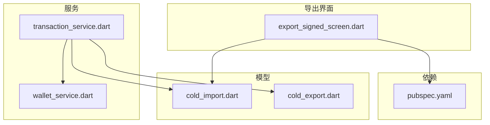
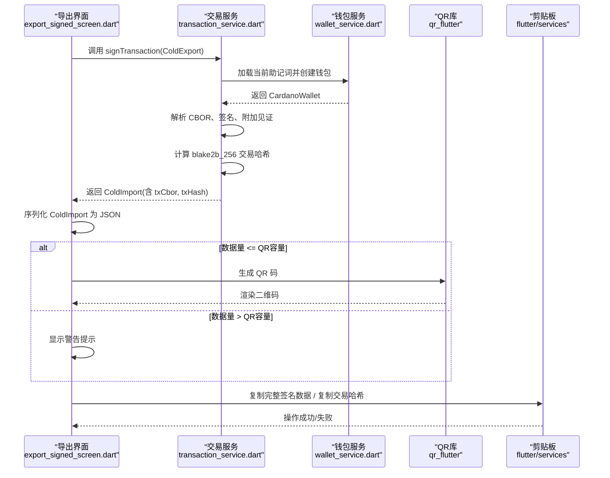
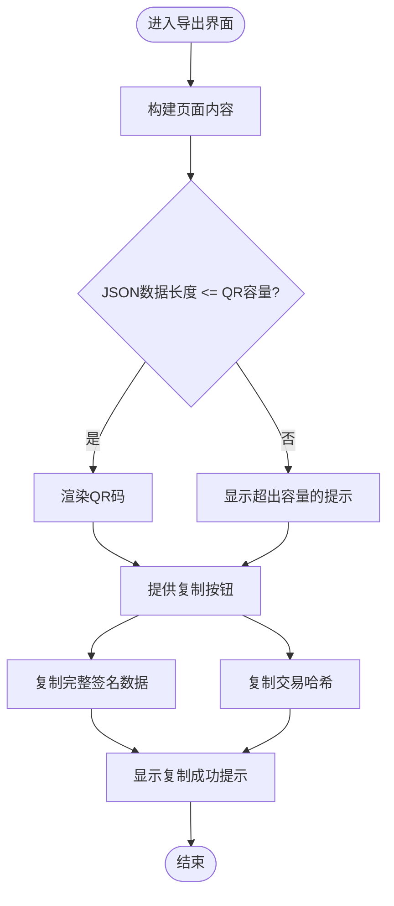
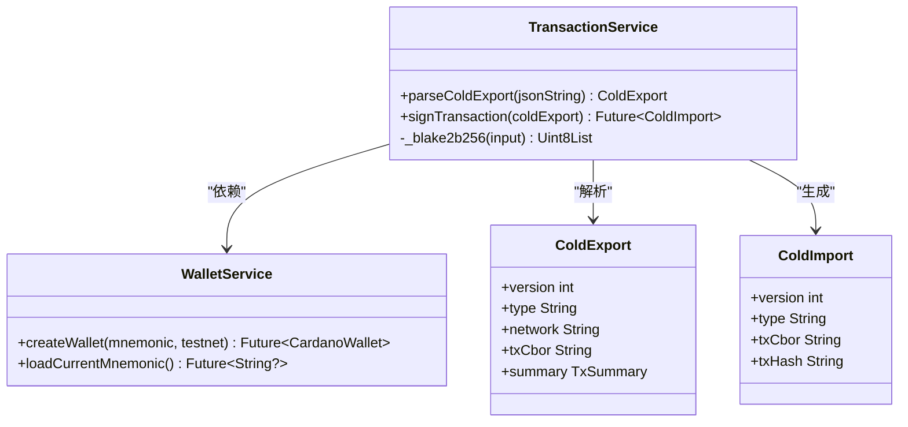
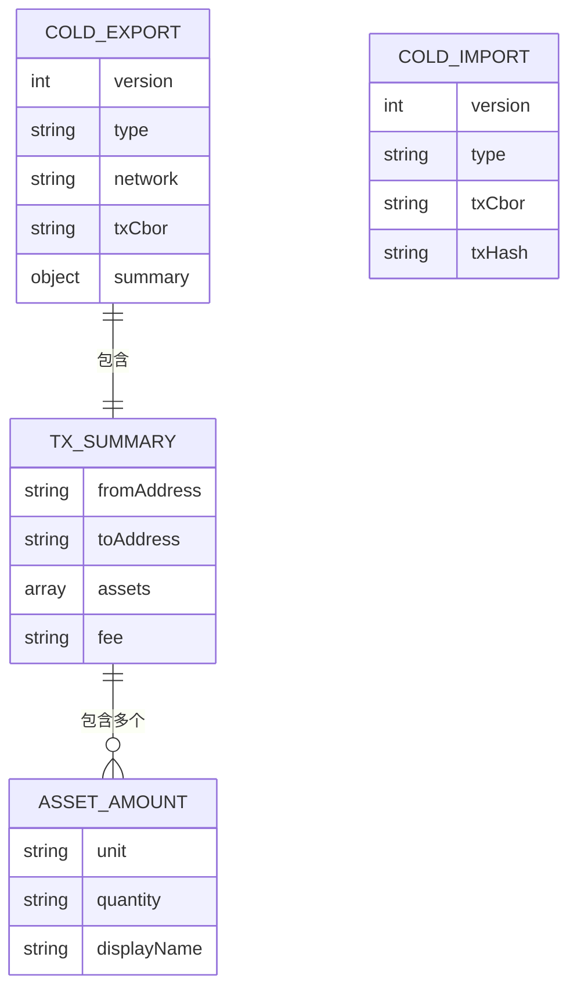
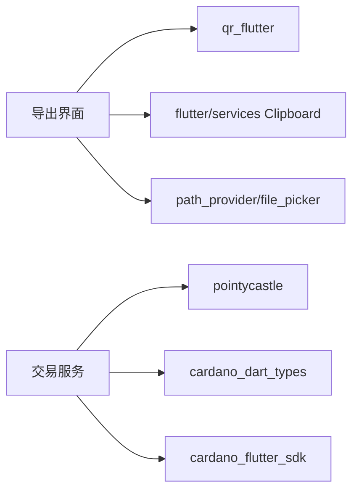

# 已签名交易导出界面

<cite>
**本文引用的文件**
- [export_signed_screen.dart](file://coldwallet-app/lib/screens/export_signed_screen.dart)
- [cold_import.dart](file://coldwallet-app/lib/models/cold_import.dart)
- [cold_export.dart](file://coldwallet-app/lib/models/cold_export.dart)
- [transaction_service.dart](file://coldwallet-app/lib/services/transaction_service.dart)
- [wallet_service.dart](file://coldwallet-app/lib/services/wallet_service.dart)
- [pubspec.yaml](file://coldwallet-app/pubspec.yaml)
</cite>

## 目录
1. [简介](#简介)
2. [项目结构](#项目结构)
3. [核心组件](#核心组件)
4. [架构总览](#架构总览)
5. [详细组件分析](#详细组件分析)
6. [依赖关系分析](#依赖关系分析)
7. [性能与体积优化](#性能与体积优化)
8. [故障排查指南](#故障排查指南)
9. [结论](#结论)
10. [附录：数据协议与兼容性](#附录数据协议与兼容性)

## 简介
本文件聚焦冷钱包App中“已签名交易导出”界面的实现，覆盖以下关键能力：
- 将已签名交易序列化为CBOR并生成QR码（在容量允许时）
- 提供复制完整签名数据和复制交易哈希的便捷操作
- 管理导出流程状态（二维码是否可容纳、错误提示、用户反馈）
- 与观察端（插件端）的数据交换协议（ColdExport/ColdImport）及兼容性考虑

该界面确保离线设备完成签名后，能够以安全、可靠的方式将结果传递给联网设备进行链上提交。

## 项目结构
围绕导出功能的关键代码分布在以下位置：
- 屏幕层：导出界面 UI 与交互逻辑
- 模型层：导入/导出数据结构定义
- 服务层：交易解析、签名、哈希计算等
- 依赖声明：QR码、剪贴板、文件系统等相关包

**图表来源**
- [export_signed_screen.dart:1-156](file://coldwallet-app/lib/screens/export_signed_screen.dart#L1-L156)
- [cold_import.dart:1-36](file://coldwallet-app/lib/models/cold_import.dart#L1-L36)
- [cold_export.dart:1-109](file://coldwallet-app/lib/models/cold_export.dart#L1-L109)
- [transaction_service.dart:1-70](file://coldwallet-app/lib/services/transaction_service.dart#L1-L70)
- [wallet_service.dart:1-208](file://coldwallet-app/lib/services/wallet_service.dart#L1-L208)
- [pubspec.yaml:30-47](file://coldwallet-app/pubspec.yaml#L30-L47)

**章节来源**
- [export_signed_screen.dart:1-156](file://coldwallet-app/lib/screens/export_signed_screen.dart#L1-L156)
- [pubspec.yaml:30-47](file://coldwallet-app/pubspec.yaml#L30-L47)

## 核心组件
- 导出界面 ExportSignedScreen：负责展示交易哈希、生成QR码、提供复制操作，并根据数据大小决定是否显示QR码或提示使用复制方式。
- 交易服务 TransactionService：负责解析未签名交易、执行签名、计算交易哈希、组装已签名交易对象。
- 钱包服务 WalletService：负责助记词加载、钱包创建、网络选择等底层密钥与钱包管理能力。
- 数据模型 ColdImport/ColdExport：定义离线与在线两端交换的数据格式，保证兼容性与可扩展性。

**章节来源**
- [export_signed_screen.dart:1-156](file://coldwallet-app/lib/screens/export_signed_screen.dart#L1-L156)
- [transaction_service.dart:1-70](file://coldwallet-app/lib/services/transaction_service.dart#L1-L70)
- [wallet_service.dart:1-208](file://coldwallet-app/lib/services/wallet_service.dart#L1-L208)
- [cold_import.dart:1-36](file://coldwallet-app/lib/models/cold_import.dart#L1-L36)
- [cold_export.dart:1-109](file://coldwallet-app/lib/models/cold_export.dart#L1-L109)

## 架构总览
从“未签名交易导入”到“已签名交易导出”的端到端流程如下：

**图表来源**
- [transaction_service.dart:26-57](file://coldwallet-app/lib/services/transaction_service.dart#L26-L57)
- [wallet_service.dart:64-68](file://coldwallet-app/lib/services/wallet_service.dart#L64-L68)
- [export_signed_screen.dart:18-37](file://coldwallet-app/lib/screens/export_signed_screen.dart#L18-L37)
- [export_signed_screen.dart:96-133](file://coldwallet-app/lib/screens/export_signed_screen.dart#L96-L133)
- [pubspec.yaml:44-46](file://coldwallet-app/pubspec.yaml#L44-L46)

## 详细组件分析

### 导出界面 ExportSignedScreen
- 输入：ColdImport（包含已签名交易的CBOR与交易哈希）
- 输出：
  - 若JSON字符串长度不超过QR码容量阈值，则渲染QR码
  - 否则显示提示，引导用户使用复制方式传输
- 交互：
  - 复制完整签名数据（剪贴板）
  - 复制交易哈希（剪贴板）
  - 返回首页（导航）

**图表来源**
- [export_signed_screen.dart:20-23](file://coldwallet-app/lib/screens/export_signed_screen.dart#L20-L23)
- [export_signed_screen.dart:25-37](file://coldwallet-app/lib/screens/export_signed_screen.dart#L25-L37)
- [export_signed_screen.dart:96-133](file://coldwallet-app/lib/screens/export_signed_screen.dart#L96-L133)

**章节来源**
- [export_signed_screen.dart:1-156](file://coldwallet-app/lib/screens/export_signed_screen.dart#L1-L156)

### 交易服务 TransactionService
- 职责：
  - 解析 ColdExport（未签名交易）
  - 使用本地私钥对交易进行签名，附加见证集
  - 计算交易哈希（blake2b_256）
  - 构造 ColdImport（已签名交易）
- 关键点：
  - 通过 WalletService 获取助记词并创建钱包
  - 使用 cardano_dart_types 解析/序列化 CBOR
  - 使用 pointycastle 计算 blake2b_256 哈希

**图表来源**
- [transaction_service.dart:13-68](file://coldwallet-app/lib/services/transaction_service.dart#L13-L68)
- [wallet_service.dart:64-68](file://coldwallet-app/lib/services/wallet_service.dart#L64-L68)
- [cold_export.dart:5-38](file://coldwallet-app/lib/models/cold_export.dart#L5-L38)
- [cold_import.dart:5-34](file://coldwallet-app/lib/models/cold_import.dart#L5-L34)

**章节来源**
- [transaction_service.dart:1-70](file://coldwallet-app/lib/services/transaction_service.dart#L1-L70)
- [wallet_service.dart:1-208](file://coldwallet-app/lib/services/wallet_service.dart#L1-L208)

### 数据模型 ColdImport/ColdExport
- ColdExport（插件端→离线设备）：
  - version/type/network：版本、类型、网络标识
  - txCbor：未签名交易的十六进制CBOR
  - summary：交易摘要（发送方、接收方、资产列表、手续费）
- ColdImport（离线设备→插件端）：
  - version/type：版本、类型
  - txCbor：已签名交易的十六进制CBOR
  - txHash：交易哈希（用于校验与展示）

**图表来源**
- [cold_export.dart:5-109](file://coldwallet-app/lib/models/cold_export.dart#L5-L109)
- [cold_import.dart:5-34](file://coldwallet-app/lib/models/cold_import.dart#L5-L34)

**章节来源**
- [cold_export.dart:1-109](file://coldwallet-app/lib/models/cold_export.dart#L1-L109)
- [cold_import.dart:1-36](file://coldwallet-app/lib/models/cold_import.dart#L1-L36)

## 依赖关系分析
- QR码生成：qr_flutter（QrImageView）
- 剪贴板操作：flutter/services Clipboard
- 文件系统相关：path_provider、file_picker（可用于未来扩展文件导出）
- 密码学：pointycastle（blake2b_256）
- 卡多罗SDK：cardano_flutter_sdk、cardano_dart_types（CBOR解析/序列化、签名）

**图表来源**
- [pubspec.yaml:37-47](file://coldwallet-app/pubspec.yaml#L37-L47)
- [transaction_service.dart:4-6](file://coldwallet-app/lib/services/transaction_service.dart#L4-L6)
- [export_signed_screen.dart:3-7](file://coldwallet-app/lib/screens/export_signed_screen.dart#L3-L7)

**章节来源**
- [pubspec.yaml:30-47](file://coldwallet-app/pubspec.yaml#L30-L47)

## 性能与体积优化
- QR码容量控制：
  - 使用固定阈值判断是否适合QR码传输（例如 Version 40、低容错场景下的字节上限）
  - 当数据超过阈值时，自动降级为复制模式，避免QR码过大导致扫描失败
- 序列化与编码：
  - 使用 JSON 作为中间表示，便于跨平台传输；实际链上数据仍为十六进制CBOR
  - 保持字段精简，避免冗余信息，减少体积
- 哈希计算：
  - 使用高效的 blake2b_256 实现，仅对交易体进行哈希，避免重复计算
- 未来扩展：
  - 可引入分块压缩或分段QR码策略，进一步提升大交易的可扫描性
  - 可增加进度回调，向用户展示序列化与QR生成的阶段性状态

[本节为通用指导，不直接分析具体文件]

## 故障排查指南
- QR码生成失败：
  - 检查数据长度是否超过QR码容量阈值
  - 查看 QrImageView 的错误回调，定位具体错误原因
- 复制失败：
  - 确认剪贴板权限可用（不同平台行为可能不同）
  - 捕获异常并提示用户重试
- 签名失败：
  - 检查助记词是否存在且有效
  - 验证网络设置是否正确（主网/测试网）
  - 确认交易CBOR格式正确且可被SDK解析
- 哈希不一致：
  - 确认使用的是 blake2b_256 并对正确的交易体进行计算
  - 对比插件端与离线端的哈希算法与输入一致

**章节来源**
- [export_signed_screen.dart:96-133](file://coldwallet-app/lib/screens/export_signed_screen.dart#L96-L133)
- [transaction_service.dart:30-57](file://coldwallet-app/lib/services/transaction_service.dart#L30-L57)
- [transaction_service.dart:59-68](file://coldwallet-app/lib/services/transaction_service.dart#L59-L68)

## 结论
导出界面以简洁直观的方式呈现已签名交易的核心信息，并在容量限制下智能切换QR码与复制两种传输方式。配合交易服务与钱包服务，实现了从离线签名到在线提交的完整闭环。通过明确的数据模型与依赖管理，保证了跨端兼容性与可扩展性。

[本节为总结性内容，不直接分析具体文件]

## 附录：数据协议与兼容性
- 协议字段说明：
  - ColdExport：
    - version：协议版本
    - type：数据类型（如未签名交易）
    - network：网络标识（mainnet/testnet）
    - txCbor：十六进制编码的未签名交易CBOR
    - summary：交易摘要（fromAddress、toAddress、assets[]、fee）
  - ColdImport：
    - version：协议版本
    - type：数据类型（如已签名交易）
    - txCbor：十六进制编码的已签名交易CBOR
    - txHash：交易哈希（用于校验与展示）
- 兼容性考虑：
  - 版本号用于向前/向后兼容，插件端与离线端需保持一致
  - 网络标识影响地址派生与交易提交目标
  - 摘要字段应保持稳定，新增字段需具备可选性与默认值处理
- 与观察端（插件端）的数据交换：
  - 插件端生成 ColdExport 并通过二维码或文件传递至离线设备
  - 离线设备签名后生成 ColdImport，再通过二维码或复制方式传回插件端
  - 插件端解析 ColdImport 并提交交易到链上

**章节来源**
- [cold_export.dart:1-109](file://coldwallet-app/lib/models/cold_export.dart#L1-L109)
- [cold_import.dart:1-36](file://coldwallet-app/lib/models/cold_import.dart#L1-L36)
- [transaction_service.dart:26-57](file://coldwallet-app/lib/services/transaction_service.dart#L26-L57)