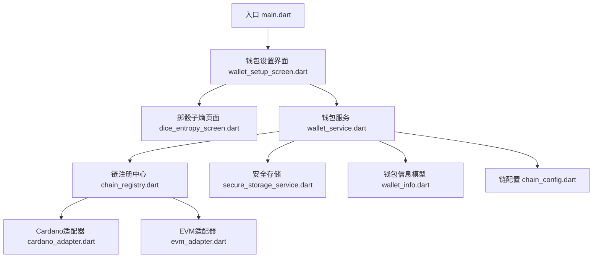
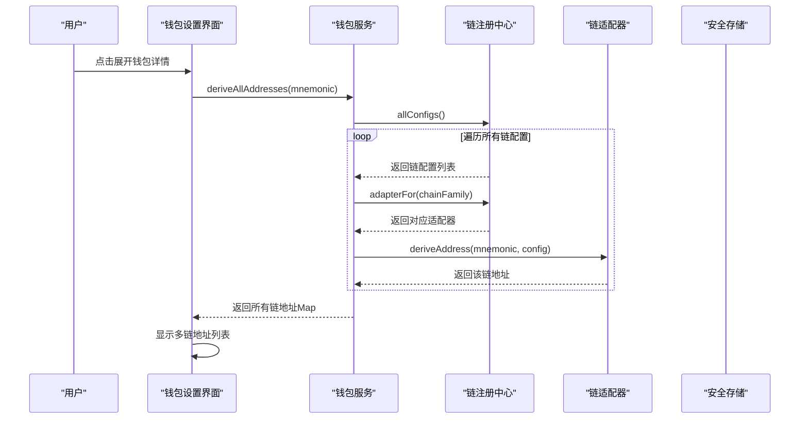
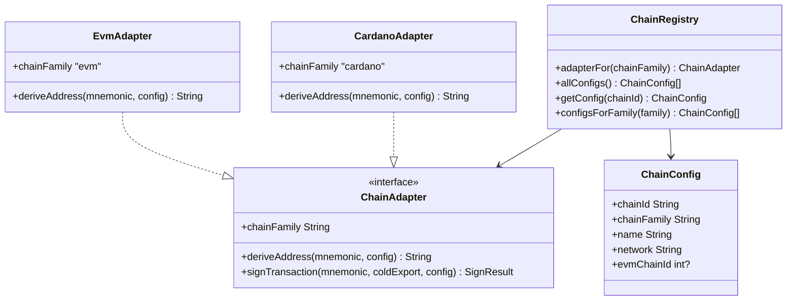
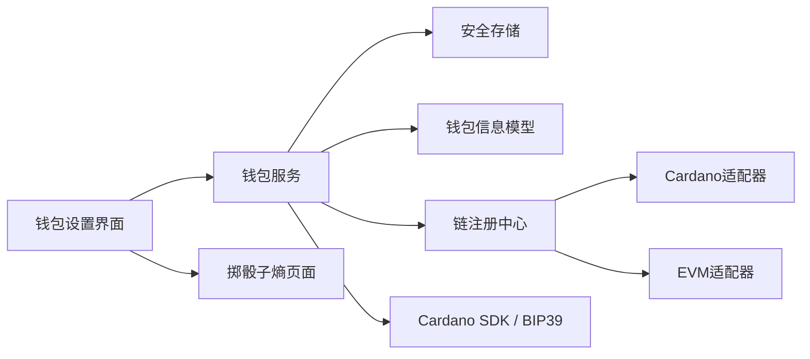

# 钱包设置界面

<cite>
**本文引用的文件**
- [main.dart](file://coldwallet-app/lib/main.dart)
- [wallet_setup_screen.dart](file://coldwallet-app/lib/screens/wallet_setup_screen.dart)
- [dice_entropy_screen.dart](file://coldwallet-app/lib/screens/dice_entropy_screen.dart)
- [wallet_service.dart](file://coldwallet-app/lib/services/wallet_service.dart)
- [chain_registry.dart](file://coldwallet-app/lib/services/chain_registry.dart)
- [chain_config.dart](file://coldwallet-app/lib/models/chain_config.dart)
- [cardano_adapter.dart](file://coldwallet-app/lib/services/adapters/cardano_adapter.dart)
- [evm_adapter.dart](file://coldwallet-app/lib/services/adapters/evm_adapter.dart)
- [secure_storage_service.dart](file://coldwallet-app/lib/services/secure_storage_service.dart)
- [wallet_info.dart](file://coldwallet-app/lib/models/wallet_info.dart)
- [pubspec.yaml](file://coldwallet-app/pubspec.yaml)
</cite>

## 更新摘要
**变更内容**
- 新增多链地址显示功能：钱包设置界面现在支持显示所有配置链的地址
- 扩展钱包管理：支持 Cardano 和多个 EVM 兼容链（Ethereum Sepolia、BSC Testnet、Arbitrum Sepolia、Polygon Amoy、Base Sepolia）
- 增强地址派生：通过 ChainRegistry 统一管理多链配置，使用适配器模式实现不同链的地址派生
- 改进用户界面：展开钱包卡片时显示所有支持链的地址列表，支持单独复制各链地址

## 目录
1. [简介](#简介)
2. [项目结构](#项目结构)
3. [核心组件](#核心组件)
4. [架构总览](#架构总览)
5. [详细组件分析](#详细组件分析)
6. [多链支持架构](#多链支持架构)
7. [依赖分析](#依赖分析)
8. [性能考虑](#性能考虑)
9. [故障排查指南](#故障排查指南)
10. [结论](#结论)
11. [附录](#附录)

## 简介
本文件面向冷钱包App的"钱包设置"界面，聚焦以下能力：
- 钱包创建：支持生成助记词、掷骰子真随机熵生成、导入已有助记词。
- 助记词管理：生成、校验、显示与复制（谨慎）、删除钱包时清除助记词。
- PIN码设置：全局PIN的创建、验证与状态查询。
- **多链钱包配置**：支持 Cardano 和多个 EVM 兼容链的地址派生与管理。
- **多链地址显示**：展开钱包详情时显示所有配置链的地址，支持单独复制。
- 安全存储：通过系统级安全存储保存敏感数据；助记词按钱包ID隔离。
- 备份恢复：以助记词为唯一备份凭证；提供重置与工厂重置能力。

该界面在首次进入时会引导用户创建第一个钱包，并支持后续添加更多钱包（上限为5个）。**现已升级为支持多链钱包创建和管理，一个助记词可派生多个区块链网络的地址。**

## 项目结构
冷钱包App采用分层组织：
- UI层：屏幕与交互（钱包设置、掷骰子熵输入等）
- 服务层：钱包业务逻辑（助记词生成/校验、多链地址派生、钱包CRUD、PIN与网络）
- 适配层：链适配器（CardanoAdapter、EvmAdapter）处理不同链的特有逻辑
- 注册中心：ChainRegistry 管理所有支持的链配置
- 存储层：安全存储封装（助记词、PIN、钱包列表、当前钱包ID、网络）
- 模型层：钱包元数据、链配置与序列化编解码

图表来源
- [main.dart:20-48](file://coldwallet-app/lib/main.dart#L20-L48)
- [wallet_setup_screen.dart:12-53](file://coldwallet-app/lib/screens/wallet_setup_screen.dart#L12-L53)
- [wallet_service.dart:13-27](file://coldwallet-app/lib/services/wallet_service.dart#L13-L27)
- [chain_registry.dart:10-79](file://coldwallet-app/lib/services/chain_registry.dart#L10-L79)

章节来源
- [main.dart:20-48](file://coldwallet-app/lib/main.dart#L20-L48)

## 核心组件
- 钱包设置界面：负责展示钱包列表、新增/导入/删除钱包、助记词确认、PIN设置、**多链地址查看与复制**。
- 掷骰子熵页面：收集256次物理骰子结果，映射为256位熵，生成BIP-39 24词助记词。
- 钱包服务：封装助记词生成/校验、**多链地址派生**、HD钱包创建、钱包CRUD、当前钱包切换、网络设置、PIN操作。
- **链注册中心**：管理所有支持的链配置，提供适配器实例查找，支持动态扩展新链。
- **链适配器**：实现不同区块链网络的特有地址派生和交易签名逻辑。
- 安全存储服务：基于系统安全存储持久化钱包列表、助记词、PIN哈希、当前钱包ID、网络。
- 钱包信息模型：钱包元数据（id、name、createdAt）及列表JSON编解码。
- 链配置模型：描述链的基本信息（chainId、chainFamily、name、network、evmChainId）。

章节来源
- [wallet_setup_screen.dart:12-629](file://coldwallet-app/lib/screens/wallet_setup_screen.dart#L12-L629)
- [dice_entropy_screen.dart:13-248](file://coldwallet-app/lib/screens/dice_entropy_screen.dart#L13-L248)
- [wallet_service.dart:13-231](file://coldwallet-app/lib/services/wallet_service.dart#L13-L231)
- [chain_registry.dart:10-79](file://coldwallet-app/lib/services/chain_registry.dart#L10-L79)
- [chain_config.dart:5-49](file://coldwallet-app/lib/models/chain_config.dart#L5-L49)

## 架构总览
下图展示了从用户操作到多链地址生成的完整链路：UI触发→服务处理→链注册中心→适配器→返回多链地址更新UI。

图表来源
- [wallet_setup_screen.dart:53-80](file://coldwallet-app/lib/screens/wallet_setup_screen.dart#L53-L80)
- [wallet_service.dart:95-101](file://coldwallet-app/lib/services/wallet_service.dart#L95-L101)
- [chain_registry.dart:57-73](file://coldwallet-app/lib/services/chain_registry.dart#L57-L73)

## 详细组件分析

### 钱包设置界面（WalletSetupScreen）
职责
- 加载并展示钱包列表、当前网络、是否已设置PIN。
- 新增钱包：生成助记词、掷骰子熵生成、导入助记词。
- 助记词确认：提醒用户离线抄写，禁止截图拍照。
- PIN设置：若未设置则弹出6位数字PIN输入与确认。
- **多链地址详情**：展开后显示所有配置链的地址与助记词（可复制），并提供删除操作。
- 错误提示：统一通过消息条提示。

关键流程
- 初始化：加载钱包列表、网络、PIN状态。
- **多链地址展开**：临时切换到目标钱包，调用 `deriveAllAddresses()` 获取所有链地址，再切回原钱包。
- 新增钱包：
  - 生成：调用服务生成24词助记词。
  - 掷骰子：跳转至掷骰子页面，完成后返回助记词。
  - 导入：输入助记词并校验有效性。
- 助记词确认：弹窗展示助记词，确认后进入PIN设置或直接保存。
- PIN设置：校验6位数字且两次一致，保存PIN后再保存钱包。
- 删除钱包：二次确认后删除助记词与元数据，必要时切换当前钱包。

**更新** 多链地址显示功能：展开钱包卡片时，界面会遍历 ChainRegistry 中的所有链配置，为每个链派生地址并显示在列表中，支持单独复制各链地址。

状态管理要点
- _isLoading：首次加载完成前显示进度。
- _hasPin：控制是否跳过PIN设置步骤。
- _expandedWalletId/_expandedAddresses/_expandedMnemonic：控制卡片展开与详情内容，**_expandedAddresses 现在包含所有链的地址映射**。
- _showingImportForm：控制导入表单显隐。

代码片段路径
- 加载状态：[wallet_setup_screen.dart:34-53](file://coldwallet-app/lib/screens/wallet_setup_screen.dart#L34-L53)
- **多链地址展开**：[wallet_setup_screen.dart:53-80](file://coldwallet-app/lib/screens/wallet_setup_screen.dart#L53-L80)
- 新增钱包入口：[wallet_setup_screen.dart:86-136](file://coldwallet-app/lib/screens/wallet_setup_screen.dart#L86-L136)
- 助记词确认与PIN设置：[wallet_setup_screen.dart:171-329](file://coldwallet-app/lib/screens/wallet_setup_screen.dart#L171-L329)
- **多链地址渲染**：[wallet_setup_screen.dart:522-583](file://coldwallet-app/lib/screens/wallet_setup_screen.dart#L522-L583)

章节来源
- [wallet_setup_screen.dart:12-629](file://coldwallet-app/lib/screens/wallet_setup_screen.dart#L12-L629)

### 掷骰子熵页面（DiceEntropyScreen）
职责
- 引导用户用物理骰子投掷256次，奇数记为1、偶数记为0，累积256位熵。
- 提供撤销上一步、重置全部、进度指示与完成提示。
- 完成时调用服务将熵转换为BIP-39 24词助记词，并通过导航返回给上层。

流程图

图表来源
- [dice_entropy_screen.dart:29-60](file://coldwallet-app/lib/screens/dice_entropy_screen.dart#L29-L60)
- [wallet_service.dart:35-48](file://coldwallet-app/lib/services/wallet_service.dart#L35-L48)

章节来源
- [dice_entropy_screen.dart:13-248](file://coldwallet-app/lib/screens/dice_entropy_screen.dart#L13-L248)

### 钱包服务（WalletService）
职责
- 助记词生成：使用SDK安全随机源生成24词助记词。
- 熵转助记词：将256位布尔序列转为标准BIP-39助记词。
- 助记词校验：基于BIP-39校验。
- **多链地址派生**：通过 ChainRegistry 获取对应适配器，从同一助记词派生不同链的地址。
- **批量地址生成**：`deriveAllAddresses()` 方法遍历所有配置链，返回 Map<chainId, address>。
- 网络设置：读取/写入当前网络（mainnet/testnet）。
- 钱包列表管理：获取、判断数量上限、添加、删除、重置。
- 当前钱包：获取当前钱包、加载其助记词、切换当前钱包。
- PIN管理：保存、验证、检查是否存在。

**更新** 多链地址派生功能：新增 `deriveAddressForChain()` 和 `deriveAllAddresses()` 方法，支持从单一助记词派生多个区块链网络的地址。

复杂度与注意事项
- 助记词生成与校验时间复杂度近似O(n)，n为单词数（12或24）。
- **多链地址派生涉及多个区块链网络的计算，属于较重操作，建议在后台执行**。
- 最大钱包数量为5，超出会抛出状态错误。
- **每增加一条链都会增加地址派生的计算开销**。

代码片段路径
- 生成与校验：[wallet_service.dart:23-58](file://coldwallet-app/lib/services/wallet_service.dart#L23-L58)
- **多链地址派生**：[wallet_service.dart:84-101](file://coldwallet-app/lib/services/wallet_service.dart#L84-L101)
- 钱包CRUD与切换：[wallet_service.dart:119-198](file://coldwallet-app/lib/services/wallet_service.dart#L119-L198)
- PIN操作：[wallet_service.dart:219-229](file://coldwallet-app/lib/services/wallet_service.dart#L219-L229)

章节来源
- [wallet_service.dart:13-231](file://coldwallet-app/lib/services/wallet_service.dart#L13-L231)

### 链注册中心（ChainRegistry）
职责
- **管理所有支持的链配置**：静态定义 Cardano 和多个 EVM 兼容链的配置。
- **适配器实例查找**：根据链族（cardano、evm）返回对应的适配器实例。
- **链配置查询**：支持按 chainId 或链族查询配置。
- **动态扩展支持**：新增链只需在 `_configs` 中添加一行 ChainConfig。

**新增** 多链支持架构：实现了适配器模式的注册中心，统一管理不同区块链网络的配置和适配器。

支持的链配置
- Cardano Preview（测试网）
- Ethereum Sepolia（测试网）
- BSC Testnet（测试网）
- Arbitrum Sepolia（测试网）
- Polygon Amoy（测试网）
- Base Sepolia（测试网）

代码片段路径
- 链配置定义：[chain_registry.dart:11-55](file://coldwallet-app/lib/services/chain_registry.dart#L11-L55)
- 适配器查找：[chain_registry.dart:57-67](file://coldwallet-app/lib/services/chain_registry.dart#L57-L67)
- 配置查询：[chain_registry.dart:69-77](file://coldwallet-app/lib/services/chain_registry.dart#L69-L77)

章节来源
- [chain_registry.dart:10-79](file://coldwallet-app/lib/services/chain_registry.dart#L10-L79)

### 链适配器（ChainAdapter）
职责
- **Cardano适配器**：实现 Cardano 链的地址派生（CIP-1852）、交易解析和离线签名。
- **EVM适配器**：实现 EVM 兼容链的地址派生（BIP-44 m/44'/60'/0'/0/0）、交易签名和RLP编解码。
- **统一接口**：通过 ChainAdapter 接口抽象不同链的操作。

**新增** 多链适配器实现：为不同区块链网络提供专门的地址派生和交易处理逻辑。

代码片段路径
- Cardano适配器：[cardano_adapter.dart:18-79](file://coldwallet-app/lib/services/adapters/cardano_adapter.dart#L18-L79)
- EVM适配器：[evm_adapter.dart:20-369](file://coldwallet-app/lib/services/adapters/evm_adapter.dart#L20-L369)

章节来源
- [cardano_adapter.dart:18-79](file://coldwallet-app/lib/services/adapters/cardano_adapter.dart#L18-L79)
- [evm_adapter.dart:20-369](file://coldwallet-app/lib/services/adapters/evm_adapter.dart#L20-L369)

### 安全存储服务（SecureStorageService）
职责
- 钱包列表：加载/保存（JSON编码/解码）。
- 助记词：按钱包ID隔离读写删除。
- 当前钱包ID：读写。
- 网络设置：读写默认testnet。
- PIN：保存与验证（当前为明文比较，建议后续改为哈希）。
- 清空：删除所有存储项。

安全策略说明
- 使用系统级安全存储（Android Keystore等）加密保存敏感数据。
- 助记词按钱包ID隔离，避免串扰。
- PIN目前为明文存储与比较，存在安全风险，建议升级为PBKDF2/Argon2哈希存储与比对。

代码片段路径
- 助记词存取：[secure_storage_service.dart:44-56](file://coldwallet-app/lib/services/secure_storage_service.dart#L44-L56)
- 钱包列表：[secure_storage_service.dart:27-39](file://coldwallet-app/lib/services/secure_storage_service.dart#L27-L39)
- 当前钱包与网络：[secure_storage_service.dart:60-76](file://coldwallet-app/lib/services/secure_storage_service.dart#L60-L76)
- PIN存取与验证：[secure_storage_service.dart:80-98](file://coldwallet-app/lib/services/secure_storage_service.dart#L80-L98)
- 清空：[secure_storage_service.dart:103-105](file://coldwallet-app/lib/services/secure_storage_service.dart#L103-L105)

章节来源
- [secure_storage_service.dart:16-107](file://coldwallet-app/lib/services/secure_storage_service.dart#L16-L107)

### 钱包信息模型（WalletInfo）
职责
- 表示钱包元数据（id、name、createdAt），不含敏感信息。
- 提供工厂方法创建实例与JSON编解码。
- 生成安全的随机ID用于隔离助记词。

代码片段路径
- 模型定义与ID生成：[wallet_info.dart:8-41](file://coldwallet-app/lib/models/wallet_info.dart#L8-L41)
- 列表编解码：[wallet_info.dart:44-55](file://coldwallet-app/lib/models/wallet_info.dart#L44-L55)

章节来源
- [wallet_info.dart:8-56](file://coldwallet-app/lib/models/wallet_info.dart#L8-L56)

### 链配置模型（ChainConfig）
职责
- **描述链的基本信息**：chainId、chainFamily、name、network、evmChainId。
- **支持JSON序列化**：提供fromJson和toJson方法用于配置持久化。
- **区分链类型**：通过chainFamily标识Cardano或EVM链，evmChainId专用于EVM链。

**新增** 多链配置模型：定义了统一的链配置结构，支持不同类型区块链网络的配置管理。

代码片段路径
- 模型定义：[chain_config.dart:5-27](file://coldwallet-app/lib/models/chain_config.dart#L5-L27)
- JSON序列化：[chain_config.dart:29-48](file://coldwallet-app/lib/models/chain_config.dart#L29-L48)

章节来源
- [chain_config.dart:5-49](file://coldwallet-app/lib/models/chain_config.dart#L5-L49)

## 多链支持架构
多链支持通过适配器模式和注册中心模式实现，提供了良好的可扩展性。

图表来源
- [chain_registry.dart:10-79](file://coldwallet-app/lib/services/chain_registry.dart#L10-L79)
- [cardano_adapter.dart:18-79](file://coldwallet-app/lib/services/adapters/cardano_adapter.dart#L18-L79)
- [evm_adapter.dart:20-369](file://coldwallet-app/lib/services/adapters/evm_adapter.dart#L20-L369)
- [chain_config.dart:5-49](file://coldwallet-app/lib/models/chain_config.dart#L5-L49)

**新增** 多链架构特点：
- **适配器模式**：不同链的操作通过统一接口抽象，便于扩展新链。
- **注册中心模式**：集中管理链配置和适配器实例，支持动态扩展。
- **配置驱动**：新增链只需添加配置，无需修改核心逻辑。
- **类型安全**：通过ChainConfig确保链配置的完整性和正确性。

## 依赖分析
- UI层依赖服务层进行业务处理，不直接访问存储。
- 服务层依赖安全存储进行数据持久化，并调用第三方库（Cardano SDK、BIP39）完成密码学操作。
- **服务层依赖链注册中心和适配器处理多链逻辑**。
- 模型层仅承载数据结构与序列化，无副作用。

图表来源
- [wallet_setup_screen.dart:4-6](file://coldwallet-app/lib/screens/wallet_setup_screen.dart#L4-L6)
- [wallet_service.dart:3-8](file://coldwallet-app/lib/services/wallet_service.dart#L3-L8)
- [chain_registry.dart:1-4](file://coldwallet-app/lib/services/chain_registry.dart#L1-L4)

章节来源
- [pubspec.yaml:30-46](file://coldwallet-app/pubspec.yaml#L30-L46)

## 性能考虑
- 地址派生属于重操作，应在后台线程或异步任务中执行，避免阻塞UI。
- **多链地址派生会产生多次区块链网络计算，建议使用异步处理和进度反馈**。
- 钱包列表与助记词读取频繁，但数据量小，影响有限。
- 掷骰子界面每次状态更新都会触发setState，注意保持轻量更新。
- 建议对重复计算（如多次派生同一地址）做缓存，减少SDK调用次数。
- **多链地址展开时应考虑分批加载或懒加载，避免一次性计算所有链地址导致的卡顿**。

## 故障排查指南
常见问题与定位
- 助记词无效：检查输入是否为12或24词、拼写是否正确；服务层会进行BIP-39校验。
- PIN不一致：确保两次输入均为6位数字且完全一致。
- 无法添加钱包：检查是否已达上限（5个）；若达到需先删除旧钱包。
- 删除后仍显示旧钱包：确认删除成功后是否调用了刷新状态。
- 地址为空：确认当前钱包助记词是否可读，以及网络设置是否与预期一致。
- **多链地址显示异常**：检查 ChainRegistry 中的链配置是否正确，适配器是否能正常派生地址。
- **特定链地址派生失败**：检查对应链的网络配置和适配器实现。

相关实现位置
- 助记词校验：[wallet_service.dart:50-58](file://coldwallet-app/lib/services/wallet_service.dart#L50-L58)
- PIN校验与保存：[wallet_setup_screen.dart:258-327](file://coldwallet-app/lib/screens/wallet_setup_screen.dart#L258-L327)
- 钱包上限检查：[wallet_service.dart:128-131](file://coldwallet-app/lib/services/wallet_service.dart#L128-L131)
- 删除后切换当前钱包：[wallet_service.dart:182-198](file://coldwallet-app/lib/services/wallet_service.dart#L182-L198)
- **多链地址派生**：[wallet_service.dart:84-101](file://coldwallet-app/lib/services/wallet_service.dart#L84-L101)
- **链配置管理**：[chain_registry.dart:11-77](file://coldwallet-app/lib/services/chain_registry.dart#L11-L77)

章节来源
- [wallet_setup_screen.dart:161-169](file://coldwallet-app/lib/screens/wallet_setup_screen.dart#L161-L169)
- [wallet_service.dart:128-198](file://coldwallet-app/lib/services/wallet_service.dart#L128-L198)
- [chain_registry.dart:11-77](file://coldwallet-app/lib/services/chain_registry.dart#L11-L77)

## 结论
本钱包设置界面实现了完整的冷钱包生命周期管理：从助记词生成/导入、PIN设置、多钱包管理到**多链地址派生与安全存储**。整体设计清晰，职责分离明确，便于扩展与维护。**新增的多链支持功能通过适配器模式和注册中心模式，为未来扩展更多区块链网络奠定了良好基础。**

建议后续优化点包括：
- PIN存储升级为哈希比对，提升安全性。
- 增加助记词备份导出（加密文件）与恢复功能。
- 对地址派生等重操作引入缓存与进度反馈。
- **为多链地址派生添加异步处理和进度指示，提升用户体验**。
- 完善异常捕获与用户提示，提升容错体验。
- **考虑添加链选择功能，允许用户只派生特定链的地址以减少计算开销**。

## 附录
- 助记词处理示例路径
  - 生成助记词：[wallet_service.dart:23-29](file://coldwallet-app/lib/services/wallet_service.dart#L23-L29)
  - 熵转助记词：[wallet_service.dart:35-48](file://coldwallet-app/lib/services/wallet_service.dart#L35-L48)
  - 校验助记词：[wallet_service.dart:50-58](file://coldwallet-app/lib/services/wallet_service.dart#L50-L58)
- **多链地址派生示例路径**
  - 单链地址派生：[wallet_service.dart:84-90](file://coldwallet-app/lib/services/wallet_service.dart#L84-L90)
  - 批量地址派生：[wallet_service.dart:92-101](file://coldwallet-app/lib/services/wallet_service.dart#L92-L101)
  - 链注册中心使用：[chain_registry.dart:57-73](file://coldwallet-app/lib/services/chain_registry.dart#L57-L73)
- 安全存储集成示例路径
  - 保存助记词：[secure_storage_service.dart:44-46](file://coldwallet-app/lib/services/secure_storage_service.dart#L44-L46)
  - 保存钱包列表：[secure_storage_service.dart:34-39](file://coldwallet-app/lib/services/secure_storage_service.dart#L34-L39)
  - 保存/验证PIN：[secure_storage_service.dart:80-98](file://coldwallet-app/lib/services/secure_storage_service.dart#L80-L98)
- 用户输入验证示例路径
  - PIN格式校验：[wallet_setup_screen.dart:309-323](file://coldwallet-app/lib/screens/wallet_setup_screen.dart#L309-L323)
  - 助记词导入校验：[wallet_setup_screen.dart:159-167](file://coldwallet-app/lib/screens/wallet_setup_screen.dart#L159-L167)
- 钱包数据的安全存储策略与备份恢复
  - 存储策略：助记词按钱包ID隔离、PIN与列表通过安全存储加密保存。
  - 备份：以助记词为唯一备份凭证，用户需离线抄写。
  - 恢复：通过导入助记词恢复钱包。
  - 重置：支持重置所有钱包（保留PIN）与工厂重置（清空全部）。
  - 参考路径：[wallet_service.dart:202-215](file://coldwallet-app/lib/services/wallet_service.dart#L202-L215)、[secure_storage_service.dart:103-105](file://coldwallet-app/lib/services/secure_storage_service.dart#L103-L105)
- **多链配置示例路径**
  - 链配置定义：[chain_registry.dart:11-55](file://coldwallet-app/lib/services/chain_registry.dart#L11-L55)
  - 链配置模型：[chain_config.dart:5-49](file://coldwallet-app/lib/models/chain_config.dart#L5-L49)
  - 适配器实现：[cardano_adapter.dart:18-79](file://coldwallet-app/lib/services/adapters/cardano_adapter.dart#L18-L79)、[evm_adapter.dart:20-369](file://coldwallet-app/lib/services/adapters/evm_adapter.dart#L20-L369)