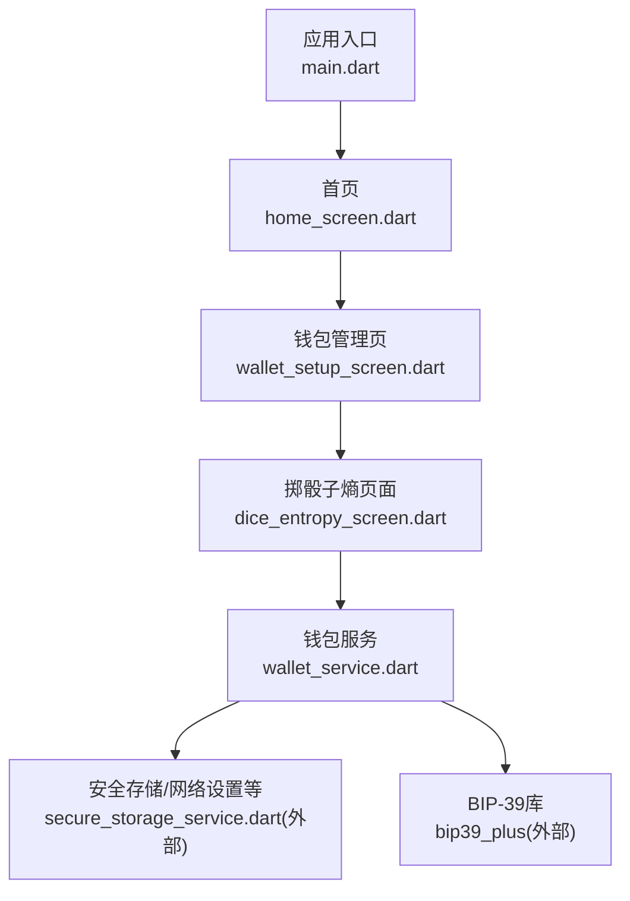
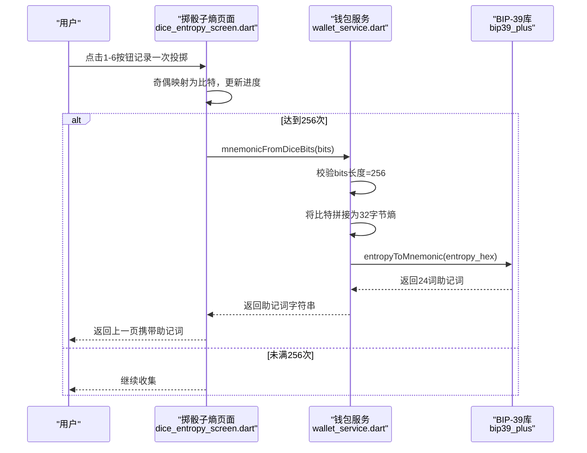
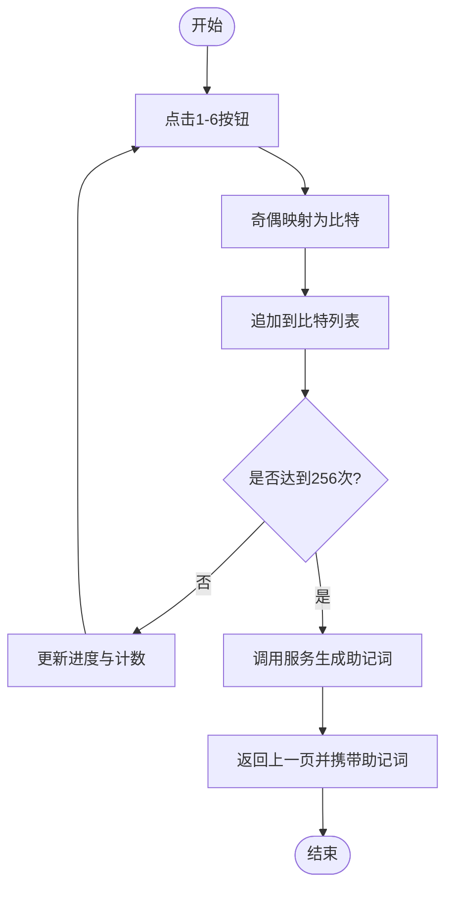
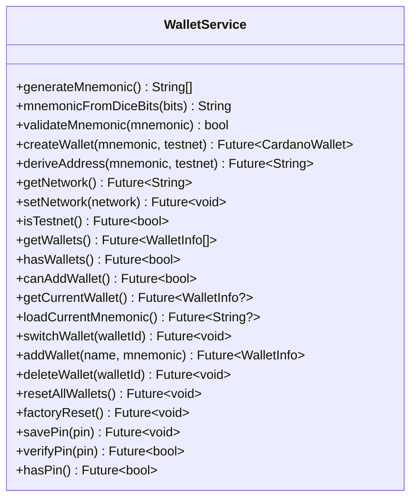
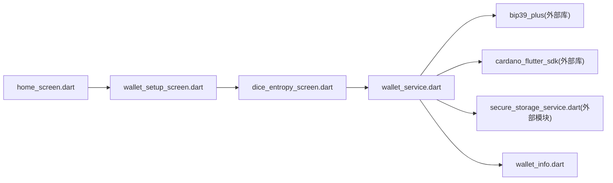

# 随机数生成界面

<cite>
**本文引用的文件**
- [dice_entropy_screen.dart](file://coldwallet-app/lib/screens/dice_entropy_screen.dart)
- [wallet_service.dart](file://coldwallet-app/lib/services/wallet_service.dart)
- [wallet_setup_screen.dart](file://coldwallet-app/lib/screens/wallet_setup_screen.dart)
- [home_screen.dart](file://coldwallet-app/lib/screens/home_screen.dart)
- [main.dart](file://coldwallet-app/lib/main.dart)
- [wallet_info.dart](file://coldwallet-app/lib/models/wallet_info.dart)
</cite>

## 目录
1. [简介](#简介)
2. [项目结构](#项目结构)
3. [核心组件](#核心组件)
4. [架构总览](#架构总览)
5. [详细组件分析](#详细组件分析)
6. [依赖关系分析](#依赖关系分析)
7. [性能考虑](#性能考虑)
8. [故障排查指南](#故障排查指南)
9. [结论](#结论)
10. [附录](#附录)

## 简介
本文件聚焦冷钱包App中的“掷骰子随机数收集”界面，详细说明用户交互、随机数采集算法、熵值质量评估与安全性保证机制，以及助记词生成的辅助流程。该界面通过物理骰子投掷产生真随机性：每次投掷结果映射为比特（奇数为1、偶数为0），累计256次得到256位熵，并据此生成BIP-39标准的24词助记词。文档同时对比传统伪随机数生成器的安全性与用户体验差异，并提供状态管理、进度展示、撤销/重置等交互设计说明。

## 项目结构
冷钱包App采用Flutter工程组织，关键路径如下：
- 入口应用与路由配置：lib/main.dart
- 首页与钱包管理入口：lib/screens/home_screen.dart、lib/screens/wallet_setup_screen.dart
- 掷骰子熵收集界面：lib/screens/dice_entropy_screen.dart
- 钱包服务（含助记词生成/校验）：lib/services/wallet_service.dart
- 钱包元数据模型：lib/models/wallet_info.dart

图表来源
- [main.dart:11-48](file://coldwallet-app/lib/main.dart#L11-L48)
- [home_screen.dart:107-179](file://coldwallet-app/lib/screens/home_screen.dart#L107-L179)
- [wallet_setup_screen.dart:84-152](file://coldwallet-app/lib/screens/wallet_setup_screen.dart#L84-L152)
- [dice_entropy_screen.dart:13-60](file://coldwallet-app/lib/screens/dice_entropy_screen.dart#L13-L60)
- [wallet_service.dart:23-56](file://coldwallet-app/lib/services/wallet_service.dart#L23-L56)

章节来源
- [main.dart:11-48](file://coldwallet-app/lib/main.dart#L11-L48)
- [home_screen.dart:107-179](file://coldwallet-app/lib/screens/home_screen.dart#L107-L179)
- [wallet_setup_screen.dart:84-152](file://coldwallet-app/lib/screens/wallet_setup_screen.dart#L84-L152)
- [dice_entropy_screen.dart:13-60](file://coldwallet-app/lib/screens/dice_entropy_screen.dart#L13-L60)
- [wallet_service.dart:23-56](file://coldwallet-app/lib/services/wallet_service.dart#L23-L56)

## 核心组件
- 掷骰子熵页面（DiceEntropyScreen）
  - 负责用户交互：点击1-6按钮记录一次投掷，奇偶映射为比特，维护已收集的比特序列。
  - 提供进度条、计数提示、撤销上一步、重置全部等操作。
  - 当收集满256个比特后调用钱包服务生成助记词，并通过返回结果到上一级页面。
- 钱包服务（WalletService）
  - 提供从256位比特生成BIP-39助记词的方法，包含长度校验与字节拼装逻辑。
  - 提供助记词校验方法，用于导入或二次确认。
  - 提供其他钱包生命周期能力（创建、删除、切换、PIN管理等）。
- 钱包管理页（WalletSetupScreen）
  - 提供“掷骰子生成”入口，导航至掷骰子熵页面，接收返回的助记词字符串，进入命名与确认流程。
- 首页（HomeScreen）
  - 提供钱包管理与功能入口，整体导航起点。

章节来源
- [dice_entropy_screen.dart:13-60](file://coldwallet-app/lib/screens/dice_entropy_screen.dart#L13-L60)
- [wallet_service.dart:23-56](file://coldwallet-app/lib/services/wallet_service.dart#L23-L56)
- [wallet_setup_screen.dart:84-152](file://coldwallet-app/lib/screens/wallet_setup_screen.dart#L84-L152)
- [home_screen.dart:107-179](file://coldwallet-app/lib/screens/home_screen.dart#L107-L179)

## 架构总览
掷骰子助记词生成流程涉及UI层与服务层的协作：用户在掷骰子页面输入256次投掷结果，服务层将比特序列转换为32字节熵，再调用BIP-39库生成助记词；最终返回给上层进行确认与保存。

图表来源
- [dice_entropy_screen.dart:29-60](file://coldwallet-app/lib/screens/dice_entropy_screen.dart#L29-L60)
- [wallet_service.dart:33-46](file://coldwallet-app/lib/services/wallet_service.dart#L33-L46)

章节来源
- [dice_entropy_screen.dart:29-60](file://coldwallet-app/lib/screens/dice_entropy_screen.dart#L29-L60)
- [wallet_service.dart:33-46](file://coldwallet-app/lib/services/wallet_service.dart#L33-L46)

## 详细组件分析

### 掷骰子熵页面（DiceEntropyScreen）
- 状态管理
  - 使用StatefulWidget维护已收集的比特列表（List<bool>），计算进度与完成状态。
  - 提供撤销（移除最后一个比特）和重置（清空所有比特）操作。
- 用户交互
  - 1-6按钮分别对应奇偶映射：奇数→1，偶数→0。
  - 每次点击触发轻量触觉反馈，提升操作手感。
  - 顶部显示线性进度条与计数文本，完成后自动进入生成流程。
- 结果处理
  - 收集满256比特后调用钱包服务的生成方法，成功后通过Navigator.pop返回助记词字符串。
  - 异常时通过SnackBar提示错误信息。

图表来源
- [dice_entropy_screen.dart:29-60](file://coldwallet-app/lib/screens/dice_entropy_screen.dart#L29-L60)
- [dice_entropy_screen.dart:62-183](file://coldwallet-app/lib/screens/dice_entropy_screen.dart#L62-L183)

章节来源
- [dice_entropy_screen.dart:29-60](file://coldwallet-app/lib/screens/dice_entropy_screen.dart#L29-L60)
- [dice_entropy_screen.dart:62-183](file://coldwallet-app/lib/screens/dice_entropy_screen.dart#L62-L183)

### 钱包服务（WalletService）
- 熵值转换与助记词生成
  - 校验输入比特数量必须为256。
  - 将比特序列按位拼装为32字节数组（高位在前）。
  - 将字节数组转为十六进制字符串，调用BIP-39库生成助记词。
- 助记词校验
  - 对空串直接返回无效；否则调用库方法进行有效性验证。
- 其他能力
  - 支持从助记词派生地址、创建钱包、删除钱包、切换当前钱包、PIN管理等。

图表来源
- [wallet_service.dart:13-208](file://coldwallet-app/lib/services/wallet_service.dart#L13-L208)

章节来源
- [wallet_service.dart:23-56](file://coldwallet-app/lib/services/wallet_service.dart#L23-L56)
- [wallet_service.dart:64-78](file://coldwallet-app/lib/services/wallet_service.dart#L64-L78)
- [wallet_service.dart:96-127](file://coldwallet-app/lib/services/wallet_service.dart#L96-L127)
- [wallet_service.dart:135-175](file://coldwallet-app/lib/services/wallet_service.dart#L135-L175)
- [wallet_service.dart:180-206](file://coldwallet-app/lib/services/wallet_service.dart#L180-L206)

### 钱包管理页（WalletSetupScreen）
- 新增钱包入口
  - 提供“生成新助记词”、“掷骰子生成”、“导入已有助记词”三种方式。
  - “掷骰子生成”会导航到掷骰子熵页面，等待返回助记词后再进入命名与确认流程。
- 助记词确认与PIN设置
  - 在确认对话框中展示助记词，引导用户离线备份。
  - 若未设置PIN，则要求设置全局PIN以保护后续操作。
- 钱包列表与管理
  - 支持查看钱包详情（地址、助记词）、复制、删除等操作。

章节来源
- [wallet_setup_screen.dart:84-152](file://coldwallet-app/lib/screens/wallet_setup_screen.dart#L84-L152)
- [wallet_setup_screen.dart:171-346](file://coldwallet-app/lib/screens/wallet_setup_screen.dart#L171-L346)
- [wallet_setup_screen.dart:394-612](file://coldwallet-app/lib/screens/wallet_setup_screen.dart#L394-L612)

### 首页（HomeScreen）
- 作为应用主入口，提供钱包选择器、网络切换、扫码签名、文件导入等功能入口。
- 无钱包时引导用户前往钱包管理页创建第一个钱包。

章节来源
- [home_screen.dart:107-179](file://coldwallet-app/lib/screens/home_screen.dart#L107-L179)
- [home_screen.dart:272-345](file://coldwallet-app/lib/screens/home_screen.dart#L272-L345)

### 应用入口（main.dart）
- 初始化Flutter绑定并启动MaterialApp，配置主题与路由表。
- 定义首页、钱包管理页、扫码签名页的路由映射。

章节来源
- [main.dart:11-48](file://coldwallet-app/lib/main.dart#L11-L48)

## 依赖关系分析
- UI层依赖
  - dice_entropy_screen.dart 依赖 wallet_service.dart 进行熵到助记词的转换。
  - wallet_setup_screen.dart 依赖 dice_entropy_screen.dart 以提供掷骰子入口。
  - home_screen.dart 提供导航入口，间接依赖上述页面。
- 服务层依赖
  - wallet_service.dart 依赖 bip39_plus 库实现BIP-39助记词生成与校验。
  - wallet_service.dart 依赖 cardano_flutter_sdk 与 cardano_dart_types 进行钱包创建与地址派生。
  - wallet_service.dart 依赖 secure_storage_service.dart 进行持久化存储（PIN、网络设置、钱包列表等）。
- 模型层依赖
  - wallet_info.dart 提供钱包元数据结构与序列化能力。

图表来源
- [dice_entropy_screen.dart:1-5](file://coldwallet-app/lib/screens/dice_entropy_screen.dart#L1-L5)
- [wallet_service.dart:1-8](file://coldwallet-app/lib/services/wallet_service.dart#L1-L8)
- [wallet_setup_screen.dart:1-6](file://coldwallet-app/lib/screens/wallet_setup_screen.dart#L1-L6)
- [home_screen.dart:1-10](file://coldwallet-app/lib/screens/home_screen.dart#L1-L10)

章节来源
- [dice_entropy_screen.dart:1-5](file://coldwallet-app/lib/screens/dice_entropy_screen.dart#L1-L5)
- [wallet_service.dart:1-8](file://coldwallet-app/lib/services/wallet_service.dart#L1-L8)
- [wallet_setup_screen.dart:1-6](file://coldwallet-app/lib/screens/wallet_setup_screen.dart#L1-L6)
- [home_screen.dart:1-10](file://coldwallet-app/lib/screens/home_screen.dart#L1-L10)

## 性能考虑
- 熵收集阶段
  - 比特列表增长为O(n)，n=256，内存占用极小；每次追加与撤销均为常数时间操作。
  - 进度条与计数更新频繁但轻量，不会造成明显卡顿。
- 熵到助记词转换
  - 将256比特拼装为32字节数组的时间复杂度为O(n)。
  - 调用BIP-39库生成助记词为常数开销（固定24词），整体耗时可忽略。
- 动画与交互
  - 当前实现未引入复杂动画，仅使用轻量触觉反馈；如需增强体验，可在按钮按下时添加短暂缩放或颜色过渡，注意避免阻塞主线程。
- 建议优化
  - 若未来扩展更多熵源（如键盘敲击间隔、触摸轨迹），需确保采样频率与熵源质量评估不影响UI响应。
  - 对于大量历史记录的统计展示，建议使用不可变数据结构与增量更新策略。

[本节为通用性能讨论，不直接分析具体代码文件]

## 故障排查指南
- 常见错误与处理
  - 比特数量不足：服务层会抛出参数错误，需在UI层提示用户继续收集。
  - 助记词无效：导入或二次确认时校验失败，需检查拼写与词数。
  - 网络/存储异常：钱包创建或PIN设置失败时，应捕获异常并给出明确提示。
- 调试建议
  - 在掷骰子页面增加日志输出，记录每次投掷的奇偶映射与累计比特数。
  - 在服务层对熵转换过程增加断点，验证字节拼装是否正确。
  - 使用设备日志查看异常堆栈，定位问题所在。

章节来源
- [wallet_service.dart:33-56](file://coldwallet-app/lib/services/wallet_service.dart#L33-L56)
- [dice_entropy_screen.dart:49-60](file://coldwallet-app/lib/screens/dice_entropy_screen.dart#L49-L60)

## 结论
掷骰子熵收集界面通过物理随机源（骰子）提供高熵值的真随机性，结合BIP-39标准生成24词助记词，满足冷钱包对种子安全性的严格要求。相比传统伪随机数生成器，该方案具备更强的抗预测性与可审计性；同时，简洁的交互设计（进度条、计数、撤销/重置）提升了用户体验。建议在后续迭代中持续强化错误提示与可视化反馈，确保用户在长周期操作中保持清晰的状态感知。

[本节为总结性内容，不直接分析具体代码文件]

## 附录
- 熵值质量评估
  - 熵源：物理骰子投掷，理论上每个面出现概率均等，256次投掷提供256位熵。
  - 映射规则：奇数→1，偶数→0，确保比特分布均匀。
  - 校验机制：服务层强制校验比特数量为256，防止截断或重复导致的熵不足。
- 与传统随机数生成器对比
  - 安全性：传统PRNG基于算法种子，存在可预测风险；物理骰子提供真随机性，难以被攻击者复现。
  - 用户体验：掷骰子需要一定时间，但通过进度与反馈降低焦虑；传统PRNG瞬时生成但安全性较低。
  - 适用场景：冷钱包强调离线与高安全，优先选择真随机源；联网端或低敏感场景可使用PRNG以提升效率。
- 代码示例路径（不直接展示代码内容）
  - 随机数算法实现：[wallet_service.dart:33-46](file://coldwallet-app/lib/services/wallet_service.dart#L33-L46)
  - 用户输入处理：[dice_entropy_screen.dart:29-60](file://coldwallet-app/lib/screens/dice_entropy_screen.dart#L29-L60)
  - 动画效果集成：[dice_entropy_screen.dart:29-33](file://coldwallet-app/lib/screens/dice_entropy_screen.dart#L29-L33)
  - 结果验证：[wallet_service.dart:49-56](file://coldwallet-app/lib/services/wallet_service.dart#L49-L56)

[本节为补充说明，不直接分析具体代码文件]