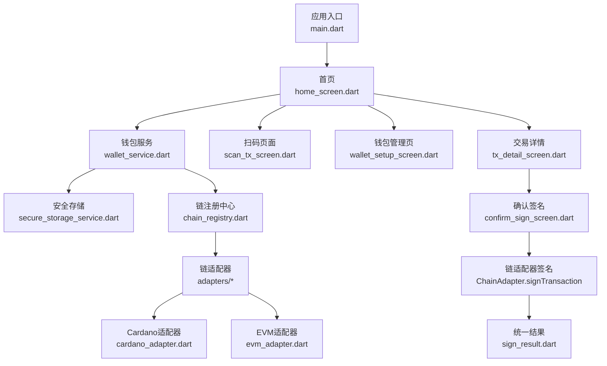
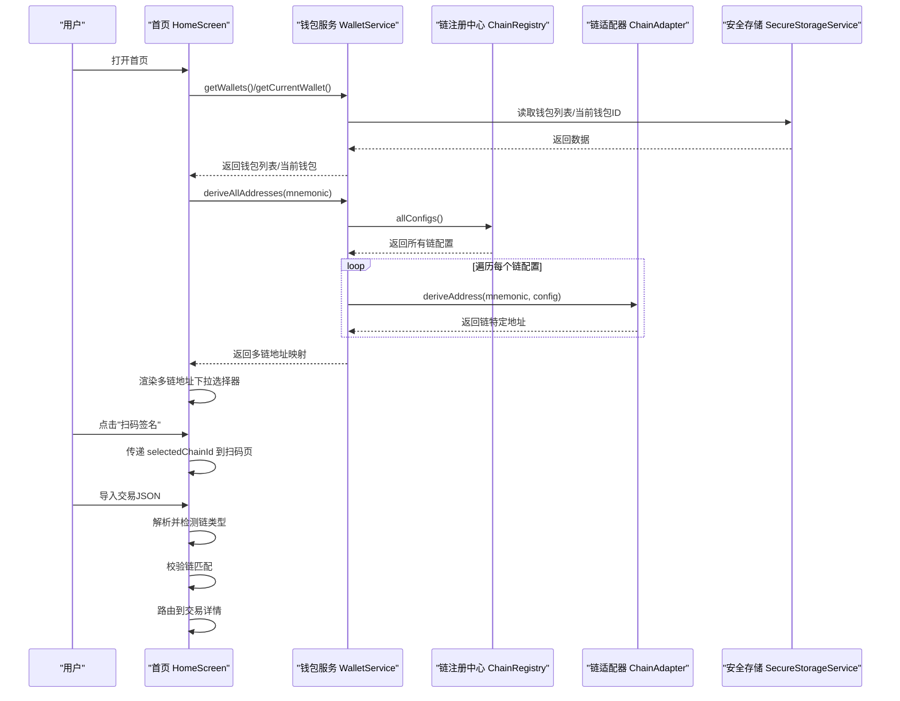
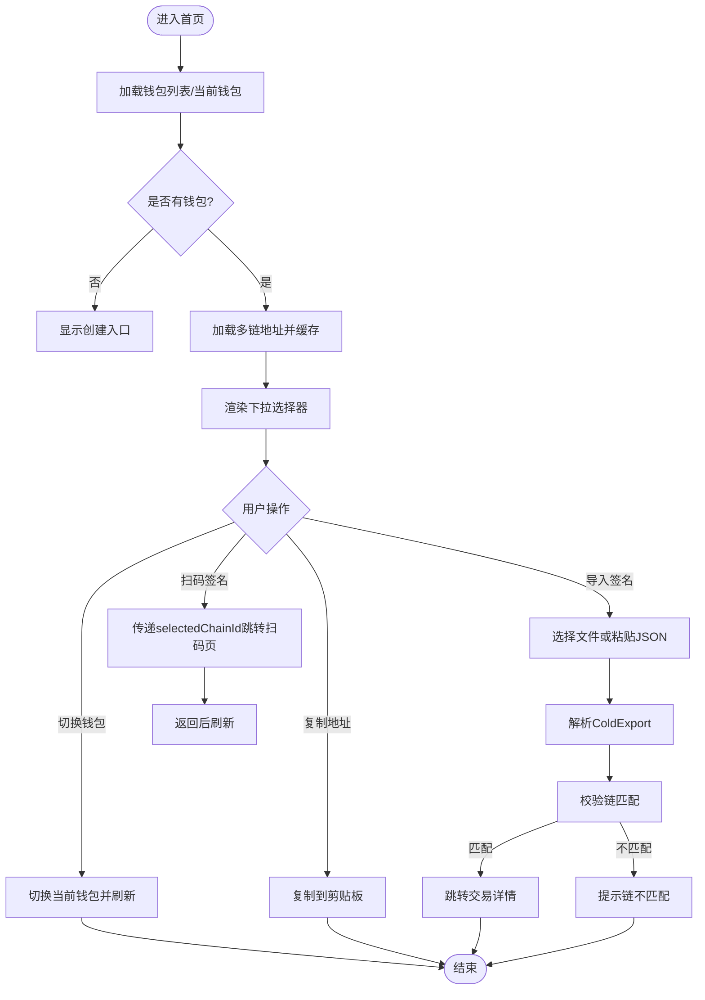
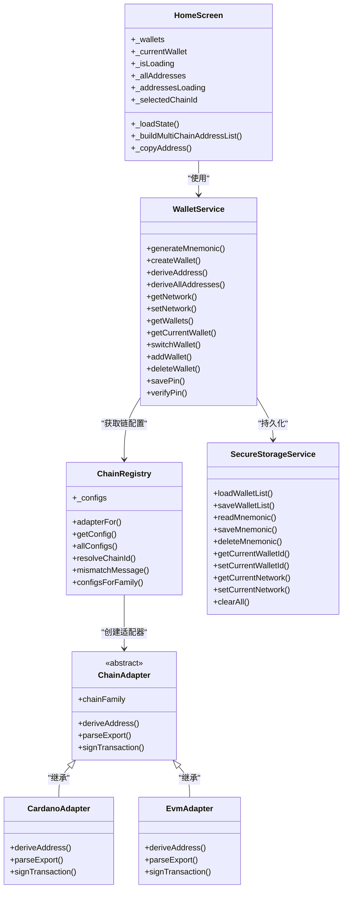

# 首页界面

<cite>
**本文引用的文件**
- [coldwallet-app/lib/main.dart](file://coldwallet-app/lib/main.dart)
- [coldwallet-app/lib/screens/home_screen.dart](file://coldwallet-app/lib/screens/home_screen.dart)
- [coldwallet-app/lib/services/wallet_service.dart](file://coldwallet-app/lib/services/wallet_service.dart)
- [coldwallet-app/lib/services/secure_storage_service.dart](file://coldwallet-app/lib/services/secure_storage_service.dart)
- [coldwallet-app/lib/models/wallet_info.dart](file://coldwallet-app/lib/models/wallet_info.dart)
- [coldwallet-app/lib/models/cold_export.dart](file://coldwallet-app/lib/models/cold_export.dart)
- [coldwallet-app/lib/models/cold_import.dart](file://coldwallet-app/lib/models/cold_import.dart)
- [coldwallet-app/lib/services/transaction_service.dart](file://coldwallet-app/lib/services/transaction_service.dart)
- [coldwallet-app/lib/screens/wallet_setup_screen.dart](file://coldwallet-app/lib/screens/wallet_setup_screen.dart)
- [coldwallet-app/lib/screens/scan_tx_screen.dart](file://coldwallet-app/lib/screens/scan_tx_screen.dart)
- [coldwallet-app/lib/services/chain_registry.dart](file://coldwallet-app/lib/services/chain_registry.dart)
- [coldwallet-app/lib/models/chain_config.dart](file://coldwallet-app/lib/models/chain_config.dart)
- [coldwallet-app/lib/services/adapters/chain_adapter.dart](file://coldwallet-app/lib/services/adapters/chain_adapter.dart)
- [coldwallet-app/lib/services/adapters/cardano_adapter.dart](file://coldwallet-app/lib/services/adapters/cardano_adapter.dart)
- [coldwallet-app/lib/services/adapters/evm_adapter.dart](file://coldwallet-app/lib/services/adapters/evm_adapter.dart)
- [coldwallet-app/lib/models/sign_result.dart](file://coldwallet-app/lib/models/sign_result.dart)
- [coldwallet-app/lib/screens/tx_detail_screen.dart](file://coldwallet-app/lib/screens/tx_detail_screen.dart)
</cite>

## 更新摘要
**变更内容**
- 新增多链地址下拉选择器界面，支持从同一助记词派生并切换不同区块链网络的地址
- 实现多链地址缓存机制，避免重复派生提升性能
- 添加链联动校验，确保扫码签名和文件导入的交易与当前选中链匹配
- 增强状态管理，包含地址加载状态、选中链ID跟踪和多链地址缓存
- 优化用户体验，提供直观的链选择和地址复制功能

## 目录
1. [简介](#简介)
2. [项目结构](#项目结构)
3. [核心组件](#核心组件)
4. [架构总览](#架构总览)
5. [详细组件分析](#详细组件分析)
6. [依赖关系分析](#依赖关系分析)
7. [性能考虑](#性能考虑)
8. [故障排查指南](#故障排查指南)
9. [结论](#结论)
10. [附录](#附录)

## 简介
本文件聚焦冷钱包 App 的首页界面，围绕以下核心能力展开：
- 钱包选择器：展示当前钱包、切换钱包、无钱包时引导创建。
- **多链地址下拉选择器**：从同一助记词派生并展示多个区块链网络的地址，支持下拉切换和复制操作。
- 网络切换：在主网与测试网之间切换，并持久化到安全存储。
- **链联动扫码签名入口**：跳转到扫码页面，扫描未签名交易二维码后进入交易详情，自动校验链匹配。
- **链联动文件导入入口**：从文件或粘贴 JSON 导入未签名交易，解析后进入交易详情，自动校验链匹配。
- 钱包管理入口：跳转至钱包管理页，支持查看地址、备份助记词、删除钱包等。

同时说明状态管理机制（加载钱包列表、当前钱包、网络设置、多链地址缓存）、用户交互流程、错误处理策略以及与服务层的集成方式。**通过 ChainRegistry 和 ChainAdapter 模式实现跨区块链网络的统一签名访问，新增的多链地址管理功能提供了直观的下拉界面和智能缓存机制。**

## 项目结构
冷钱包 App 采用分层组织：
- 入口与路由：main.dart 定义应用主题与初始路由。
- 屏幕层：home_screen.dart 为首页；其他屏幕负责具体功能。
- 服务层：wallet_service.dart 封装多钱包、网络、助记词等逻辑；secure_storage_service.dart 使用设备安全存储；transaction_service.dart 负责离线签名。
- **链适配层**：chain_registry.dart 管理支持的链配置，adapters 提供各链族的具体实现。
- 模型层：wallet_info.dart、cold_export.dart、cold_import.dart 描述数据契约。

**图表来源**
- [coldwallet-app/lib/main.dart:24-47](file://coldwallet-app/lib/main.dart#L24-L47)
- [coldwallet-app/lib/screens/home_screen.dart:108-179](file://coldwallet-app/lib/screens/home_screen.dart#L108-L179)
- [coldwallet-app/lib/services/wallet_service.dart:13-231](file://coldwallet-app/lib/services/wallet_service.dart#L13-L231)
- [coldwallet-app/lib/services/chain_registry.dart:1-79](file://coldwallet-app/lib/services/chain_registry.dart#L1-L79)
- [coldwallet-app/lib/services/adapters/cardano_adapter.dart:1-79](file://coldwallet-app/lib/services/adapters/cardano_adapter.dart#L1-L79)
- [coldwallet-app/lib/services/adapters/evm_adapter.dart:1-369](file://coldwallet-app/lib/services/adapters/evm_adapter.dart#L1-L369)

章节来源
- [coldwallet-app/lib/main.dart:11-47](file://coldwallet-app/lib/main.dart#L11-L47)

## 核心组件
- 首页 HomeScreen：承载钱包选择器、**多链地址下拉选择器**、网络切换按钮、扫码签名、文件导入、钱包管理等入口；维护本地状态（钱包列表、当前钱包、网络、加载态、多链地址缓存）。
- 钱包服务 WalletService：提供助记词生成/校验、HD 钱包创建、**多链地址派生**、网络设置、钱包增删改查、PIN 管理等。
- **链注册中心 ChainRegistry**：管理所有支持的链配置，提供适配器实例查找和链配置查询。
- **链适配器 ChainAdapter**：抽象接口定义地址派生、交易解析和签名的链特有逻辑。
- **Cardano适配器**：实现 Cardano 链的地址派生（CIP-1852）、交易解析（CBOR）和离线签名（Ed25519）。
- **EVM适配器**：实现 EVM 兼容链的地址派生（BIP-44）、交易解析和签名（EIP-155/EIP-1559）。
- 安全存储 SecureStorageService：基于 FlutterSecureStorage 加密保存钱包列表、助记词、当前钱包 ID、网络、PIN。
- 交易服务 TransactionService：解析 ColdExport、使用当前钱包私钥对交易进行离线签名，输出 ColdImport。
- 模型 WalletInfo/ColdExport/ColdImport/SignResult：描述钱包元数据、未签名交易导出格式、已签名交易导入格式、统一签名结果。

**章节来源**
- [coldwallet-app/lib/screens/home_screen.dart:16-424](file://coldwallet-app/lib/screens/home_screen.dart#L16-L424)
- [coldwallet-app/lib/services/wallet_service.dart:13-231](file://coldwallet-app/lib/services/wallet_service.dart#L13-L231)
- [coldwallet-app/lib/services/chain_registry.dart:1-79](file://coldwallet-app/lib/services/chain_registry.dart#L1-L79)
- [coldwallet-app/lib/services/adapters/chain_adapter.dart:1-37](file://coldwallet-app/lib/services/adapters/chain_adapter.dart#L1-L37)
- [coldwallet-app/lib/services/adapters/cardano_adapter.dart:1-79](file://coldwallet-app/lib/services/adapters/cardano_adapter.dart#L1-L79)
- [coldwallet-app/lib/services/adapters/evm_adapter.dart:1-369](file://coldwallet-app/lib/services/adapters/evm_adapter.dart#L1-L369)
- [coldwallet-app/lib/services/secure_storage_service.dart:16-107](file://coldwallet-app/lib/services/secure_storage_service.dart#L16-L107)
- [coldwallet-app/lib/services/transaction_service.dart:13-70](file://coldwallet-app/lib/services/transaction_service.dart#L13-L70)
- [coldwallet-app/lib/models/sign_result.dart:1-30](file://coldwallet-app/lib/models/sign_result.dart#L1-L30)

## 架构总览
首页通过 WalletService 与 SecureStorageService 协作，完成钱包列表与网络设置的读取与更新；**通过 ChainRegistry 和 ChainAdapter 模式实现多链地址派生和统一签名访问**；通过路由导航到扫码或钱包管理页；在交易导入流程中，将 ColdExport 传递给交易详情页，后续由相应的链适配器完成签名并产出 SignResult。

**图表来源**
- [coldwallet-app/lib/screens/home_screen.dart:37-105](file://coldwallet-app/lib/screens/home_screen.dart#L37-L105)
- [coldwallet-app/lib/services/wallet_service.dart:95-101](file://coldwallet-app/lib/services/wallet_service.dart#L95-L101)
- [coldwallet-app/lib/services/chain_registry.dart:72-73](file://coldwallet-app/lib/services/chain_registry.dart#L72-L73)
- [coldwallet-app/lib/services/adapters/chain_adapter.dart:17-17](file://coldwallet-app/lib/services/adapters/chain_adapter.dart#L17-L17)

## 详细组件分析

### 首页 HomeScreen
职责与行为
- 初始化加载：调用 WalletService 获取钱包列表、当前钱包和网络设置，填充本地状态并结束加载。
- 钱包选择器：
  - 无钱包：显示"尚无钱包，点击创建"，点击跳转钱包管理页。
  - 有钱包：底部弹窗列出所有钱包，选中项高亮；选择后调用 switchWallet 并刷新状态。
- **多链地址下拉选择器**：从当前钱包助记词派生所有支持链的地址，缓存到 `_allAddresses`，通过 `DropdownButtonFormField` 提供下拉切换界面，显示当前选中链的名称和截断地址，支持复制操作。
- 网络切换：点击 AppBar 中的网络按钮，切换 mainnet/testnet 并持久化，随后刷新状态。
- **链联动扫码签名**：仅在有钱包且有选中链时可用；跳转扫码页时传递 `requiredChainId`，完成后刷新状态。
- **链联动文件导入**：弹出对话框，支持从文件导入或粘贴 JSON；解析为 ColdExport 后进行链匹配校验，失败时提示错误；成功则跳转到交易详情。
- 钱包管理：跳转钱包管理页，完成后刷新状态。

状态管理
- 本地字段：`_wallets`、`_currentWallet`、`_isLoading`、`_allAddresses`（多链地址缓存）、`_addressesLoading`（地址加载状态）、`_selectedChainId`（选中链ID）。
- 生命周期：initState 触发 `_loadState`；交互后再次调用 `_loadState` 保证 UI 与存储一致。

事件处理与服务集成
- 钱包切换：`_showWalletPicker` -> WalletService.switchWallet -> 刷新。
- 网络切换：`_toggleNetwork` -> WalletService.setNetwork -> 刷新。
- 导入交易：`_pickAndImportFile`/`_parseAndNavigate` -> 解析 ColdExport -> 链匹配校验 -> 路由到 TxDetailScreen。

无钱包引导
- 当 `_hasWallets` 为 false 时，钱包选择区域变为"创建新钱包"入口，直接导航到钱包管理页。

错误处理
- 文件读取失败：捕获异常并通过 SnackBar 提示。
- JSON 解析失败：捕获异常并提示"解析失败"。
- 扫码解析失败：扫码页捕获异常并提示"无法解析二维码"。
- **地址派生失败**：显示错误卡片，提示"地址派生失败"。
- **链不匹配错误**：扫码或导入时检测到链不匹配，显示友好提示信息。

**图表来源**
- [coldwallet-app/lib/screens/home_screen.dart:37-105](file://coldwallet-app/lib/screens/home_screen.dart#L37-L105)
- [coldwallet-app/lib/screens/home_screen.dart:319-391](file://coldwallet-app/lib/screens/home_screen.dart#L319-L391)
- [coldwallet-app/lib/screens/home_screen.dart:182-270](file://coldwallet-app/lib/screens/home_screen.dart#L182-L270)

**章节来源**
- [coldwallet-app/lib/screens/home_screen.dart:16-523](file://coldwallet-app/lib/screens/home_screen.dart#L16-523)

### 钱包服务 WalletService
职责
- 助记词：生成、从骰子熵生成、校验。
- 链上操作：从助记词创建 HD 钱包、派生支付地址。
- **多链地址派生**：通过 ChainRegistry 获取对应适配器，从同一助记词派生不同链的地址。
- 网络设置：读取/设置全局网络，判断是否测试网。
- 钱包管理：获取钱包列表、判断数量上限、添加/删除钱包、重置、工厂重置。
- 当前钱包：获取当前钱包信息、加载助记词、切换钱包。
- PIN：保存、验证、检查是否存在。

关键实现要点
- 最大钱包数限制：防止超过上限。
- 删除当前钱包时的自动切换：若删除的是当前钱包，切换到第一个或清空。
- 网络默认值：未设置时默认为测试网。
- **多链支持**：deriveAllAddresses 方法遍历所有链配置，使用相应适配器派生地址。

**章节来源**
- [coldwallet-app/lib/services/wallet_service.dart:13-231](file://coldwallet-app/lib/services/wallet_service.dart#L13-231)

### 链注册中心 ChainRegistry
职责
- 管理所有支持的链配置，包括 Cardano 和多种 EVM 兼容链。
- 根据链族获取对应的适配器实例。
- 提供链配置的查询和枚举功能。
- **链ID解析**：从交易 JSON 中解析 chainId，支持向后兼容。
- **链匹配校验**：生成友好的链不匹配提示信息。

支持的链配置
- Cardano Preview：Cardano 测试网
- Ethereum Sepolia：以太坊测试网
- BSC Testnet：币安智能链测试网
- Arbitrum Sepolia：Arbitrum 测试网
- Polygon Amoy：Polygon 测试网
- Base Sepolia：Base 测试网

**章节来源**
- [coldwallet-app/lib/services/chain_registry.dart:1-104](file://coldwallet-app/lib/services/chain_registry.dart#L1-104)

### 链适配器 ChainAdapter
职责
- 定义链特有的地址派生、交易解析和签名接口。
- 提供统一的抽象接口，支持扩展新的链族。

核心方法
- deriveAddress：从助记词派生指定链的地址
- parseExport：解析未签名交易的 JSON 字符串
- signTransaction：签名交易并返回统一结果

**章节来源**
- [coldwallet-app/lib/services/adapters/chain_adapter.dart:1-37](file://coldwallet-app/lib/services/adapters/chain_adapter.dart#L1-37)

### Cardano适配器
职责
- 实现 Cardano 链的地址派生（CIP-1852）、交易解析（CBOR）和离线签名（Ed25519）。
- 使用 Cardano Flutter SDK 进行钱包操作。

关键实现
- 地址派生：使用 WalletFactory.fromMnemonic 创建钱包，派生支付地址
- 交易解析：解析 ColdExport JSON 为 Cardano 交易对象
- 签名：使用 Ed25519 算法对交易进行签名，计算 blake2b_256 哈希

**章节来源**
- [coldwallet-app/lib/services/adapters/cardano_adapter.dart:1-79](file://coldwallet-app/lib/services/adapters/cardano_adapter.dart#L1-79)

### EVM适配器
职责
- 实现 EVM 兼容链的地址派生（BIP-44 m/44'/60'/0'/0/0）、交易解析和签名（EIP-155/EIP-1559）。
- 支持所有 EVM 兼容链，通过 evmChainId 区分不同网络。

关键实现
- 私钥派生：使用 BIP-39 seed 和 BIP-32 派生路径生成私钥
- 交易签名：支持 EIP-1559 和传统 EIP-155 交易格式
- RLP 编解码：实现完整的 RLP 编码和解码功能
- 哈希计算：使用 keccak256 计算交易哈希

**章节来源**
- [coldwallet-app/lib/services/adapters/evm_adapter.dart:1-369](file://coldwallet-app/lib/services/adapters/evm_adapter.dart#L1-369)

### 安全存储 SecureStorageService
职责
- 钱包列表：加载/保存（JSON 序列化）。
- 助记词：按钱包 ID 隔离保存/读取/删除。
- 当前钱包 ID：设置/读取。
- 网络设置：设置/读取（默认 testnet）。
- PIN：保存/读取/验证/存在性检查。
- 清空：清除所有存储。

安全性
- 使用设备安全存储（如 Android Keystore）加密敏感数据，确保密钥不离开设备。

**章节来源**
- [coldwallet-app/lib/services/secure_storage_service.dart:16-107](file://coldwallet-app/lib/services/secure_storage_service.dart#L16-107)

### 交易服务 TransactionService
职责
- 解析 ColdExport：从 JSON 字符串构建对象。
- 签名交易：加载当前钱包助记词，创建钱包，反序列化 CBOR 交易，使用私钥签名，组装完整交易并计算交易哈希，输出 ColdImport。

错误处理
- 当前钱包未初始化或助记词丢失时抛出异常。

**章节来源**
- [coldwallet-app/lib/services/transaction_service.dart:13-70](file://coldwallet-app/lib/services/transaction_service.dart#L13-70)

### 交易详情页面 TxDetailScreen
职责
- **多链交易展示**：根据 chainId 自动识别链类型，分别渲染 Cardano 和 EVM 交易详情。
- **自动链类型检测**：检测 JSON 中的 chainId 字段，确定目标链配置。
- **统一签名入口**：无论哪种链类型，都提供一致的确认签名按钮。

关键功能
- Cardano 交易：显示网络、发送方、接收方、金额（ADA）、手续费
- EVM 交易：显示链名称、发送方、接收方、金额（ETH）、手续费、Nonce
- 链类型不支持时显示错误信息

**章节来源**
- [coldwallet-app/lib/screens/tx_detail_screen.dart:1-219](file://coldwallet-app/lib/screens/tx_detail_screen.dart#L1-219)

### 扫码页面 ScanTxScreen
职责
- 使用摄像头扫描未签名交易二维码，解析为 ColdExport 后跳转到交易详情。
- **链联动校验**：接收 `requiredChainId` 参数，校验扫到的交易链是否与当前选中链一致。
- 若解析失败或链不匹配，提示错误并允许重新扫描。

**章节来源**
- [coldwallet-app/lib/screens/scan_tx_screen.dart:1-106](file://coldwallet-app/lib/screens/scan_tx_screen.dart#L1-106)

### 钱包管理页 WalletSetupScreen
职责
- 展示钱包列表，支持查看详情（地址、助记词）、删除钱包。
- 新增钱包：生成助记词、掷骰子生成真随机熵、导入已有助记词。
- 首次进入无钱包时提供空状态引导。

**章节来源**
- [coldwallet-app/lib/screens/wallet_setup_screen.dart:8-612](file://coldwallet-app/lib/screens/wallet_setup_screen.dart#L8-612)

### 模型 WalletInfo/ColdExport/ColdImport/SignResult
- WalletInfo：钱包元数据（id、name、createdAt），提供 JSON 编解码与唯一 ID 生成。
- ColdExport：插件端导出的未签名交易数据（version、type、network、txCbor、summary）。
- ColdImport：冷钱包签名后的导出数据（version、type、txCbor、txHash）。
- **SignResult**：统一的签名结果，包含已签名交易的 hex 编码和交易哈希，支持版本控制。

**章节来源**
- [coldwallet-app/lib/models/wallet_info.dart:8-56](file://coldwallet-app/lib/models/wallet_info.dart#L8-56)
- [coldwallet-app/lib/models/cold_export.dart:5-109](file://coldwallet-app/lib/models/cold_export.dart#L5-109)
- [coldwallet-app/lib/models/cold_import.dart:5-36](file://coldwallet-app/lib/models/cold_import.dart#L5-36)
- [coldwallet-app/lib/models/sign_result.dart:1-30](file://coldwallet-app/lib/models/sign_result.dart#L1-30)

### 链配置 ChainConfig
职责
- 描述链的基本信息，包括 chainId、chainFamily、name、network、evmChainId。
- 提供 JSON 编解码功能，用于链配置的序列化和反序列化。

**章节来源**
- [coldwallet-app/lib/models/chain_config.dart:1-49](file://coldwallet-app/lib/models/chain_config.dart#L1-49)

## 依赖关系分析
- 首页依赖 WalletService 获取钱包与网络状态，**依赖 ChainRegistry 获取多链地址**，依赖路由导航到其他页面。
- WalletService 依赖 SecureStorageService 进行数据持久化，**依赖 ChainRegistry 获取链配置和适配器**，依赖 Cardano SDK 进行助记词与地址操作。
- **链适配器依赖各自的区块链库**：CardanoAdapter 使用 Cardano Flutter SDK，EvmAdapter 使用 web3dart 和 PointyCastle。
- 交易服务依赖 WalletService 获取助记词与钱包实例，**依赖相应的链适配器进行签名**。
- 模型之间通过 JSON 编解码形成跨页面数据传递契约。

**图表来源**
- [coldwallet-app/lib/screens/home_screen.dart:16-523](file://coldwallet-app/lib/screens/home_screen.dart#L16-523)
- [coldwallet-app/lib/services/wallet_service.dart:13-231](file://coldwallet-app/lib/services/wallet_service.dart#L13-231)
- [coldwallet-app/lib/services/chain_registry.dart:1-104](file://coldwallet-app/lib/services/chain_registry.dart#L1-104)
- [coldwallet-app/lib/services/adapters/chain_adapter.dart:1-37](file://coldwallet-app/lib/services/adapters/chain_adapter.dart#L1-37)
- [coldwallet-app/lib/services/adapters/cardano_adapter.dart:1-79](file://coldwallet-app/lib/services/adapters/cardano_adapter.dart#L1-79)
- [coldwallet-app/lib/services/adapters/evm_adapter.dart:1-369](file://coldwallet-app/lib/services/adapters/evm_adapter.dart#L1-369)
- [coldwallet-app/lib/services/secure_storage_service.dart:16-107](file://coldwallet-app/lib/services/secure_storage_service.dart#L16-107)

**章节来源**
- [coldwallet-app/lib/screens/home_screen.dart:16-523](file://coldwallet-app/lib/screens/home_screen.dart#L16-523)
- [coldwallet-app/lib/services/wallet_service.dart:13-231](file://coldwallet-app/lib/services/wallet_service.dart#L13-231)
- [coldwallet-app/lib/services/chain_registry.dart:1-104](file://coldwallet-app/lib/services/chain_registry.dart#L1-104)
- [coldwallet-app/lib/services/secure_storage_service.dart:16-107](file://coldwallet-app/lib/services/secure_storage_service.dart#L16-107)

## 性能考虑
- 避免重复 IO：首页在切换钱包或网络后统一调用 _loadState 刷新，减少多次存储访问。
- 异步加载：使用 Future 加载钱包列表与网络设置，配合加载指示器提升体验。
- 最小化状态变更：仅在必要时 setState，避免频繁重建。
- 大对象传递：ColdExport 通过路由参数传递，注意控制大小与解析开销。
- **多链地址派生优化**：使用 FutureBuilder 异步加载多链地址，避免阻塞主线程。
- **链适配器缓存**：ChainRegistry 静态存储链配置，避免重复创建。
- **批量地址派生**：deriveAllAddresses 方法顺序执行各链地址派生，可考虑并行优化。
- **地址缓存机制**：多链地址缓存在 `_allAddresses` 中，切换链时无需重新派生，提升响应速度。
- **智能链回退**：切换钱包后自动检查选中链是否可用，不可用时回退到第一条可用链。

## 故障排查指南
常见问题与定位
- 扫码解析失败：检查二维码内容是否为有效的 ColdExport JSON；确认解析异常信息。
- 文件导入失败：检查文件格式与权限；确认读取异常并提示用户。
- 钱包为空：确认安全存储中 wallet_list 是否为空；检查是否已创建钱包。
- 网络切换无效：确认 setNetwork 写入成功；检查 getCurrentNetwork 返回值。
- 助记词相关错误：校验助记词有效性；确认当前钱包助记词是否被正确保存与读取。
- **多链地址派生失败**：检查 ChainRegistry 配置是否正确，确认链适配器实现是否完整。
- **链类型检测失败**：检查交易 JSON 中是否包含正确的 chainId 字段。
- **EVM链签名失败**：确认 evmChainId 配置正确，检查 RLP 编码格式。
- **链不匹配错误**：检查首页选中的链与扫码/导入交易的链是否一致。

建议的调试步骤
- 在首页 _loadState 前后打印钱包列表与当前钱包 ID。
- 在 WalletService 的关键方法（addWallet/deleteWallet/switchWallet/setNetwork）增加日志。
- 在 SecureStorageService 的读写方法中记录 key 与结果。
- 在交易服务 signTransaction 中捕获并记录异常堆栈。
- **在多链地址派生过程中记录每个链的配置和派生结果**。
- **在链适配器中记录地址派生和签名过程的详细信息**。
- **在链匹配校验处记录 selectedChainId 和 scannedChainId 的值**。

**章节来源**
- [coldwallet-app/lib/screens/home_screen.dart:182-270](file://coldwallet-app/lib/screens/home_screen.dart#L182-270)
- [coldwallet-app/lib/screens/scan_tx_screen.dart:23-47](file://coldwallet-app/lib/screens/scan_tx_screen.dart#L23-47)
- [coldwallet-app/lib/services/wallet_service.dart:135-175](file://coldwallet-app/lib/services/wallet_service.dart#L135-175)
- [coldwallet-app/lib/services/secure_storage_service.dart:24-107](file://coldwallet-app/lib/services/secure_storage_service.dart#L24-107)
- [coldwallet-app/lib/services/transaction_service.dart:30-57](file://coldwallet-app/lib/services/transaction_service.dart#L30-57)

## 结论
首页作为冷钱包的核心入口，提供了直观的钱包选择、**多链地址下拉选择器**、网络切换、扫码签名、文件导入与钱包管理入口。**通过 ChainRegistry 和 ChainAdapter 模式实现了跨区块链网络的统一签名访问，支持自动链类型检测和路由**。新增的多链地址管理功能通过下拉界面和智能缓存机制，显著提升了用户体验和性能。通过 WalletService 与 SecureStorageService 的配合，实现了安全的状态管理与持久化。结合链适配器系统，完成了从导入未签名交易到离线签名的完整闭环，支持 Cardano 和多种 EVM 兼容链。整体设计清晰、职责分明，便于扩展和维护新的区块链网络。

## 附录
- 路由配置：应用入口定义了首页、钱包管理、扫码签名三个路由。
- 主题与模式：Material3 主题支持亮色/暗色模式。
- 安全存储 Key 规划：钱包列表、助记词、当前钱包 ID、网络、PIN 分别以独立 key 存储。
- **多链支持配置**：ChainRegistry 中静态定义支持的链配置，新增链只需添加 ChainConfig。
- **链适配器扩展**：实现新的 ChainAdapter 即可支持新的链族，无需修改现有代码。
- **多链地址缓存策略**：地址数据缓存在内存中，切换钱包时重新加载，避免重复派生。
- **链联动校验机制**：扫码和导入时自动校验链匹配，提供友好的错误提示。

**章节来源**
- [coldwallet-app/lib/main.dart:24-47](file://coldwallet-app/lib/main.dart#L24-47)
- [coldwallet-app/lib/services/secure_storage_service.dart:16-21](file://coldwallet-app/lib/services/secure_storage_service.dart#L16-21)
- [coldwallet-app/lib/services/chain_registry.dart:11-55](file://coldwallet-app/lib/services/chain_registry.dart#L11-55)