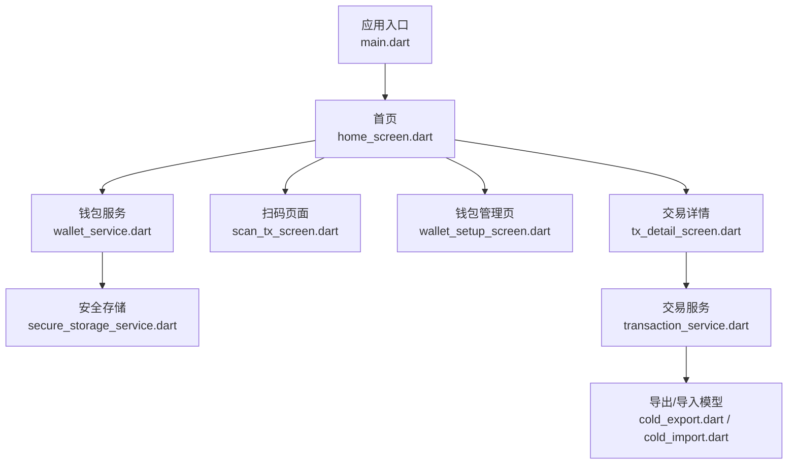
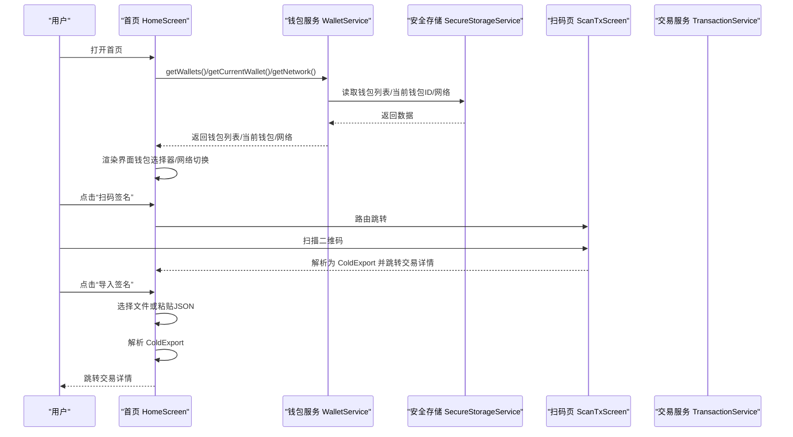
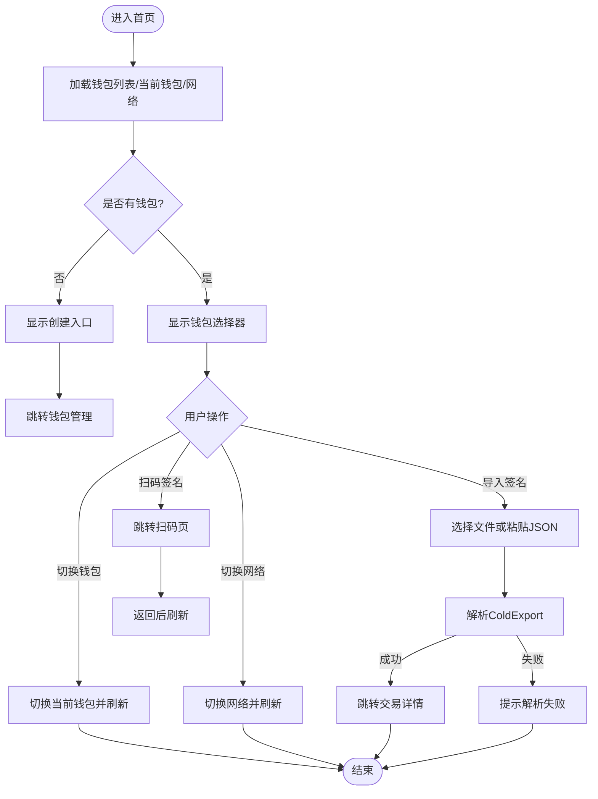
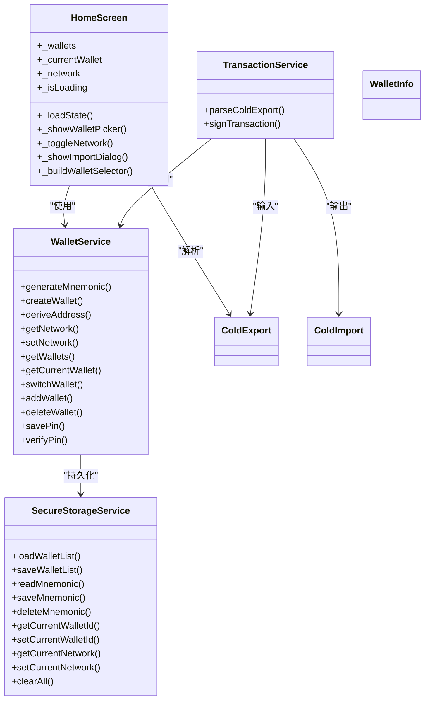

# 首页界面

<cite>
**本文引用的文件**
- [coldwallet-app/lib/main.dart](file://coldwallet-app/lib/main.dart)
- [coldwallet-app/lib/screens/home_screen.dart](file://coldwallet-app/lib/screens/home_screen.dart)
- [coldwallet-app/lib/services/wallet_service.dart](file://coldwallet-app/lib/services/wallet_service.dart)
- [coldwallet-app/lib/services/secure_storage_service.dart](file://coldwallet-app/lib/services/secure_storage_service.dart)
- [coldwallet-app/lib/models/wallet_info.dart](file://coldwallet-app/lib/models/wallet_info.dart)
- [coldwallet-app/lib/models/cold_export.dart](file://coldwallet-app/lib/models/cold_export.dart)
- [coldwallet-app/lib/models/cold_import.dart](file://coldwallet-app/lib/models/cold_import.dart)
- [coldwallet-app/lib/services/transaction_service.dart](file://coldwallet-app/lib/services/transaction_service.dart)
- [coldwallet-app/lib/screens/wallet_setup_screen.dart](file://coldwallet-app/lib/screens/wallet_setup_screen.dart)
- [coldwallet-app/lib/screens/scan_tx_screen.dart](file://coldwallet-app/lib/screens/scan_tx_screen.dart)
</cite>

## 目录
1. [简介](#简介)
2. [项目结构](#项目结构)
3. [核心组件](#核心组件)
4. [架构总览](#架构总览)
5. [详细组件分析](#详细组件分析)
6. [依赖关系分析](#依赖关系分析)
7. [性能考虑](#性能考虑)
8. [故障排查指南](#故障排查指南)
9. [结论](#结论)
10. [附录](#附录)

## 简介
本文件聚焦冷钱包 App 的首页界面，围绕以下核心能力展开：
- 钱包选择器：展示当前钱包、切换钱包、无钱包时引导创建。
- 网络切换：在主网与测试网之间切换，并持久化到安全存储。
- 扫码签名入口：跳转到扫码页面，扫描未签名交易二维码后进入交易详情。
- 文件导入入口：从文件或粘贴 JSON 导入未签名交易，解析后进入交易详情。
- 钱包管理入口：跳转至钱包管理页，支持查看地址、备份助记词、删除钱包等。

同时说明状态管理机制（加载钱包列表、当前钱包、网络设置）、用户交互流程、错误处理策略以及与服务层的集成方式。

## 项目结构
冷钱包 App 采用分层组织：
- 入口与路由：main.dart 定义应用主题与初始路由。
- 屏幕层：home_screen.dart 为首页；其他屏幕负责具体功能。
- 服务层：wallet_service.dart 封装多钱包、网络、助记词等逻辑；secure_storage_service.dart 使用设备安全存储；transaction_service.dart 负责离线签名。
- 模型层：wallet_info.dart、cold_export.dart、cold_import.dart 描述数据契约。

图表来源
- [coldwallet-app/lib/main.dart:24-47](file://coldwallet-app/lib/main.dart#L24-L47)
- [coldwallet-app/lib/screens/home_screen.dart:108-179](file://coldwallet-app/lib/screens/home_screen.dart#L108-L179)
- [coldwallet-app/lib/services/wallet_service.dart:13-208](file://coldwallet-app/lib/services/wallet_service.dart#L13-L208)
- [coldwallet-app/lib/services/secure_storage_service.dart:16-107](file://coldwallet-app/lib/services/secure_storage_service.dart#L16-L107)
- [coldwallet-app/lib/screens/scan_tx_screen.dart:13-88](file://coldwallet-app/lib/screens/scan_tx_screen.dart#L13-L88)
- [coldwallet-app/lib/screens/wallet_setup_screen.dart:8-612](file://coldwallet-app/lib/screens/wallet_setup_screen.dart#L8-L612)
- [coldwallet-app/lib/services/transaction_service.dart:13-70](file://coldwallet-app/lib/services/transaction_service.dart#L13-L70)
- [coldwallet-app/lib/models/cold_export.dart:5-109](file://coldwallet-app/lib/models/cold_export.dart#L5-L109)
- [coldwallet-app/lib/models/cold_import.dart:5-36](file://coldwallet-app/lib/models/cold_import.dart#L5-L36)

章节来源
- [coldwallet-app/lib/main.dart:11-47](file://coldwallet-app/lib/main.dart#L11-L47)

## 核心组件
- 首页 HomeScreen：承载钱包选择器、网络切换按钮、扫码签名、文件导入、钱包管理等入口；维护本地状态（钱包列表、当前钱包、网络、加载态）。
- 钱包服务 WalletService：提供助记词生成/校验、HD 钱包创建、地址派生、网络设置、钱包增删改查、PIN 管理等。
- 安全存储 SecureStorageService：基于 FlutterSecureStorage 加密保存钱包列表、助记词、当前钱包 ID、网络、PIN。
- 交易服务 TransactionService：解析 ColdExport、使用当前钱包私钥对交易进行离线签名，输出 ColdImport。
- 模型 WalletInfo/ColdExport/ColdImport：描述钱包元数据、未签名交易导出格式、已签名交易导入格式。

章节来源
- [coldwallet-app/lib/screens/home_screen.dart:16-179](file://coldwallet-app/lib/screens/home_screen.dart#L16-L179)
- [coldwallet-app/lib/services/wallet_service.dart:13-208](file://coldwallet-app/lib/services/wallet_service.dart#L13-L208)
- [coldwallet-app/lib/services/secure_storage_service.dart:16-107](file://coldwallet-app/lib/services/secure_storage_service.dart#L16-L107)
- [coldwallet-app/lib/services/transaction_service.dart:13-70](file://coldwallet-app/lib/services/transaction_service.dart#L13-L70)
- [coldwallet-app/lib/models/wallet_info.dart:8-56](file://coldwallet-app/lib/models/wallet_info.dart#L8-L56)
- [coldwallet-app/lib/models/cold_export.dart:5-109](file://coldwallet-app/lib/models/cold_export.dart#L5-L109)
- [coldwallet-app/lib/models/cold_import.dart:5-36](file://coldwallet-app/lib/models/cold_import.dart#L5-L36)

## 架构总览
首页通过 WalletService 与 SecureStorageService 协作，完成钱包列表与网络设置的读取与更新；通过路由导航到扫码或钱包管理页；在交易导入流程中，将 ColdExport 传递给交易详情页，后续由交易服务完成签名并产出 ColdImport。

图表来源
- [coldwallet-app/lib/screens/home_screen.dart:37-105](file://coldwallet-app/lib/screens/home_screen.dart#L37-L105)
- [coldwallet-app/lib/screens/scan_tx_screen.dart:23-47](file://coldwallet-app/lib/screens/scan_tx_screen.dart#L23-L47)
- [coldwallet-app/lib/services/wallet_service.dart:82-127](file://coldwallet-app/lib/services/wallet_service.dart#L82-L127)
- [coldwallet-app/lib/services/secure_storage_service.dart:24-76](file://coldwallet-app/lib/services/secure_storage_service.dart#L24-L76)

## 详细组件分析

### 首页 HomeScreen
职责与行为
- 初始化加载：调用 WalletService 获取钱包列表、当前钱包和网络设置，填充本地状态并结束加载。
- 钱包选择器：
  - 无钱包：显示“尚无钱包，点击创建”，点击跳转钱包管理页。
  - 有钱包：底部弹窗列出所有钱包，选中项高亮；选择后调用 switchWallet 并刷新状态。
- 网络切换：点击 AppBar 中的网络按钮，切换 mainnet/testnet 并持久化，随后刷新状态。
- 扫码签名：仅在有钱包时可用；跳转扫码页，完成后刷新状态。
- 文件导入：弹出对话框，支持从文件导入或粘贴 JSON；解析为 ColdExport 后跳转到交易详情；失败时提示错误。
- 钱包管理：跳转钱包管理页，完成后刷新状态。

状态管理
- 本地字段：_wallets、_currentWallet、_network、_isLoading。
- 生命周期：initState 触发 _loadState；交互后再次调用 _loadState 保证 UI 与存储一致。

事件处理与服务集成
- 钱包切换：_showWalletPicker -> WalletService.switchWallet -> 刷新。
- 网络切换：_toggleNetwork -> WalletService.setNetwork -> 刷新。
- 导入交易：_pickAndImportFile/_parseAndNavigate -> 解析 ColdExport -> 路由到 TxDetailScreen。

无钱包引导
- 当 _hasWallets 为 false 时，钱包选择区域变为“创建新钱包”入口，直接导航到钱包管理页。

错误处理
- 文件读取失败：捕获异常并通过 SnackBar 提示。
- JSON 解析失败：捕获异常并提示“解析失败”。
- 扫码解析失败：扫码页捕获异常并提示“无法解析二维码”。

图表来源
- [coldwallet-app/lib/screens/home_screen.dart:37-105](file://coldwallet-app/lib/screens/home_screen.dart#L37-L105)
- [coldwallet-app/lib/screens/home_screen.dart:182-270](file://coldwallet-app/lib/screens/home_screen.dart#L182-L270)
- [coldwallet-app/lib/screens/home_screen.dart:272-345](file://coldwallet-app/lib/screens/home_screen.dart#L272-L345)

章节来源
- [coldwallet-app/lib/screens/home_screen.dart:16-378](file://coldwallet-app/lib/screens/home_screen.dart#L16-L378)

### 钱包服务 WalletService
职责
- 助记词：生成、从骰子熵生成、校验。
- 链上操作：从助记词创建 HD 钱包、派生支付地址。
- 网络设置：读取/设置全局网络，判断是否测试网。
- 钱包管理：获取钱包列表、判断数量上限、添加/删除钱包、重置、工厂重置。
- 当前钱包：获取当前钱包信息、加载助记词、切换钱包。
- PIN：保存、验证、检查是否存在。

关键实现要点
- 最大钱包数限制：防止超过上限。
- 删除当前钱包时的自动切换：若删除的是当前钱包，切换到第一个或清空。
- 网络默认值：未设置时默认为测试网。

章节来源
- [coldwallet-app/lib/services/wallet_service.dart:13-208](file://coldwallet-app/lib/services/wallet_service.dart#L13-L208)

### 安全存储 SecureStorageService
职责
- 钱包列表：加载/保存（JSON 序列化）。
- 助记词：按钱包 ID 隔离保存/读取/删除。
- 当前钱包 ID：设置/读取。
- 网络设置：设置/读取（默认 testnet）。
- PIN：保存/读取/验证/存在性检查。
- 清空：清除所有存储。

安全性
- 使用设备安全存储（如 Android Keystore）加密敏感数据，确保密钥不离开设备。

章节来源
- [coldwallet-app/lib/services/secure_storage_service.dart:16-107](file://coldwallet-app/lib/services/secure_storage_service.dart#L16-L107)

### 交易服务 TransactionService
职责
- 解析 ColdExport：从 JSON 字符串构建对象。
- 签名交易：加载当前钱包助记词，创建钱包，反序列化 CBOR 交易，使用私钥签名，组装完整交易并计算交易哈希，输出 ColdImport。

错误处理
- 当前钱包未初始化或助记词丢失时抛出异常。

章节来源
- [coldwallet-app/lib/services/transaction_service.dart:13-70](file://coldwallet-app/lib/services/transaction_service.dart#L13-L70)

### 模型 WalletInfo/ColdExport/ColdImport
- WalletInfo：钱包元数据（id、name、createdAt），提供 JSON 编解码与唯一 ID 生成。
- ColdExport：插件端导出的未签名交易数据（version、type、network、txCbor、summary）。
- ColdImport：冷钱包签名后的导出数据（version、type、txCbor、txHash）。

章节来源
- [coldwallet-app/lib/models/wallet_info.dart:8-56](file://coldwallet-app/lib/models/wallet_info.dart#L8-L56)
- [coldwallet-app/lib/models/cold_export.dart:5-109](file://coldwallet-app/lib/models/cold_export.dart#L5-L109)
- [coldwallet-app/lib/models/cold_import.dart:5-36](file://coldwallet-app/lib/models/cold_import.dart#L5-L36)

### 扫码页面 ScanTxScreen
职责
- 使用摄像头扫描未签名交易二维码，解析为 ColdExport 后跳转到交易详情。
- 若解析失败，提示错误并允许重新扫描。

章节来源
- [coldwallet-app/lib/screens/scan_tx_screen.dart:13-88](file://coldwallet-app/lib/screens/scan_tx_screen.dart#L13-L88)

### 钱包管理页 WalletSetupScreen
职责
- 展示钱包列表，支持查看详情（地址、助记词）、删除钱包。
- 新增钱包：生成助记词、掷骰子生成真随机熵、导入已有助记词。
- 首次进入无钱包时提供空状态引导。

章节来源
- [coldwallet-app/lib/screens/wallet_setup_screen.dart:8-612](file://coldwallet-app/lib/screens/wallet_setup_screen.dart#L8-L612)

## 依赖关系分析
- 首页依赖 WalletService 获取钱包与网络状态，依赖路由导航到其他页面。
- WalletService 依赖 SecureStorageService 进行数据持久化，依赖 Cardano SDK 进行助记词与地址操作。
- 交易服务依赖 WalletService 获取助记词与钱包实例，依赖 Cardano SDK 进行 CBOR 解析与签名。
- 模型之间通过 JSON 编解码形成跨页面数据传递契约。

图表来源
- [coldwallet-app/lib/screens/home_screen.dart:16-378](file://coldwallet-app/lib/screens/home_screen.dart#L16-L378)
- [coldwallet-app/lib/services/wallet_service.dart:13-208](file://coldwallet-app/lib/services/wallet_service.dart#L13-L208)
- [coldwallet-app/lib/services/secure_storage_service.dart:16-107](file://coldwallet-app/lib/services/secure_storage_service.dart#L16-L107)
- [coldwallet-app/lib/services/transaction_service.dart:13-70](file://coldwallet-app/lib/services/transaction_service.dart#L13-L70)
- [coldwallet-app/lib/models/wallet_info.dart:8-56](file://coldwallet-app/lib/models/wallet_info.dart#L8-L56)
- [coldwallet-app/lib/models/cold_export.dart:5-109](file://coldwallet-app/lib/models/cold_export.dart#L5-L109)
- [coldwallet-app/lib/models/cold_import.dart:5-36](file://coldwallet-app/lib/models/cold_import.dart#L5-L36)

章节来源
- [coldwallet-app/lib/screens/home_screen.dart:16-378](file://coldwallet-app/lib/screens/home_screen.dart#L16-L378)
- [coldwallet-app/lib/services/wallet_service.dart:13-208](file://coldwallet-app/lib/services/wallet_service.dart#L13-L208)
- [coldwallet-app/lib/services/secure_storage_service.dart:16-107](file://coldwallet-app/lib/services/secure_storage_service.dart#L16-L107)
- [coldwallet-app/lib/services/transaction_service.dart:13-70](file://coldwallet-app/lib/services/transaction_service.dart#L13-L70)

## 性能考虑
- 避免重复 IO：首页在切换钱包或网络后统一调用 _loadState 刷新，减少多次存储访问。
- 异步加载：使用 Future 加载钱包列表与网络设置，配合加载指示器提升体验。
- 最小化状态变更：仅在必要时 setState，避免频繁重建。
- 大对象传递：ColdExport 通过路由参数传递，注意控制大小与解析开销。

[本节为通用指导，无需特定文件引用]

## 故障排查指南
常见问题与定位
- 扫码解析失败：检查二维码内容是否为有效的 ColdExport JSON；确认解析异常信息。
- 文件导入失败：检查文件格式与权限；确认读取异常并提示用户。
- 钱包为空：确认安全存储中 wallet_list 是否为空；检查是否已创建钱包。
- 网络切换无效：确认 setNetwork 写入成功；检查 getCurrentNetwork 返回值。
- 助记词相关错误：校验助记词有效性；确认当前钱包助记词是否被正确保存与读取。

建议的调试步骤
- 在首页 _loadState 前后打印钱包列表与当前钱包 ID。
- 在 WalletService 的关键方法（addWallet/deleteWallet/switchWallet/setNetwork）增加日志。
- 在 SecureStorageService 的读写方法中记录 key 与结果。
- 在交易服务 signTransaction 中捕获并记录异常堆栈。

章节来源
- [coldwallet-app/lib/screens/home_screen.dart:182-270](file://coldwallet-app/lib/screens/home_screen.dart#L182-L270)
- [coldwallet-app/lib/screens/scan_tx_screen.dart:23-47](file://coldwallet-app/lib/screens/scan_tx_screen.dart#L23-L47)
- [coldwallet-app/lib/services/wallet_service.dart:135-175](file://coldwallet-app/lib/services/wallet_service.dart#L135-L175)
- [coldwallet-app/lib/services/secure_storage_service.dart:24-107](file://coldwallet-app/lib/services/secure_storage_service.dart#L24-L107)
- [coldwallet-app/lib/services/transaction_service.dart:30-57](file://coldwallet-app/lib/services/transaction_service.dart#L30-L57)

## 结论
首页作为冷钱包的核心入口，提供了直观的钱包选择、网络切换、扫码签名、文件导入与钱包管理入口。通过 WalletService 与 SecureStorageService 的配合，实现了安全的状态管理与持久化。结合交易服务，完成了从导入未签名交易到离线签名的完整闭环。整体设计清晰、职责分明，便于扩展与维护。

[本节为总结性内容，无需特定文件引用]

## 附录
- 路由配置：应用入口定义了首页、钱包管理、扫码签名三个路由。
- 主题与模式：Material3 主题支持亮色/暗色模式。
- 安全存储 Key 规划：钱包列表、助记词、当前钱包 ID、网络、PIN 分别以独立 key 存储。

章节来源
- [coldwallet-app/lib/main.dart:24-47](file://coldwallet-app/lib/main.dart#L24-L47)
- [coldwallet-app/lib/services/secure_storage_service.dart:16-21](file://coldwallet-app/lib/services/secure_storage_service.dart#L16-L21)