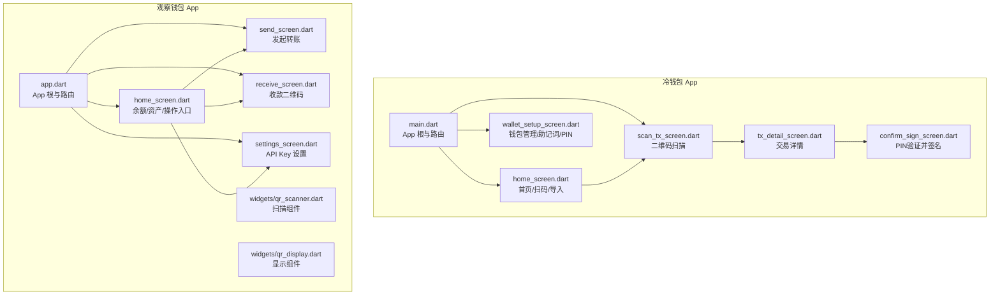
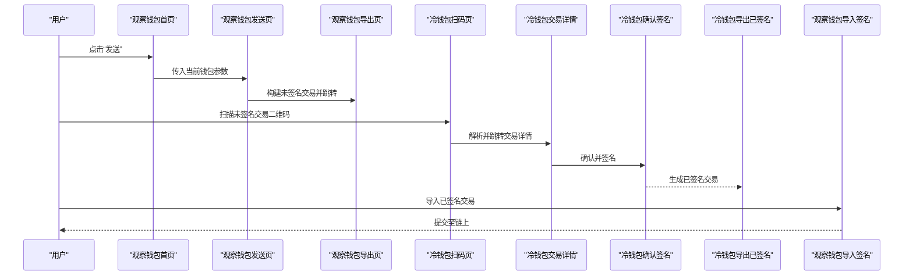
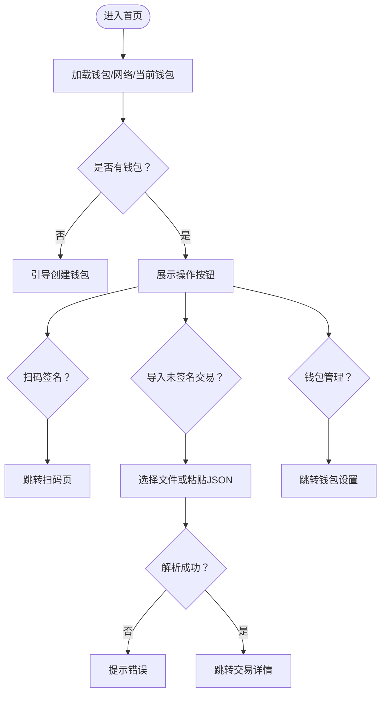
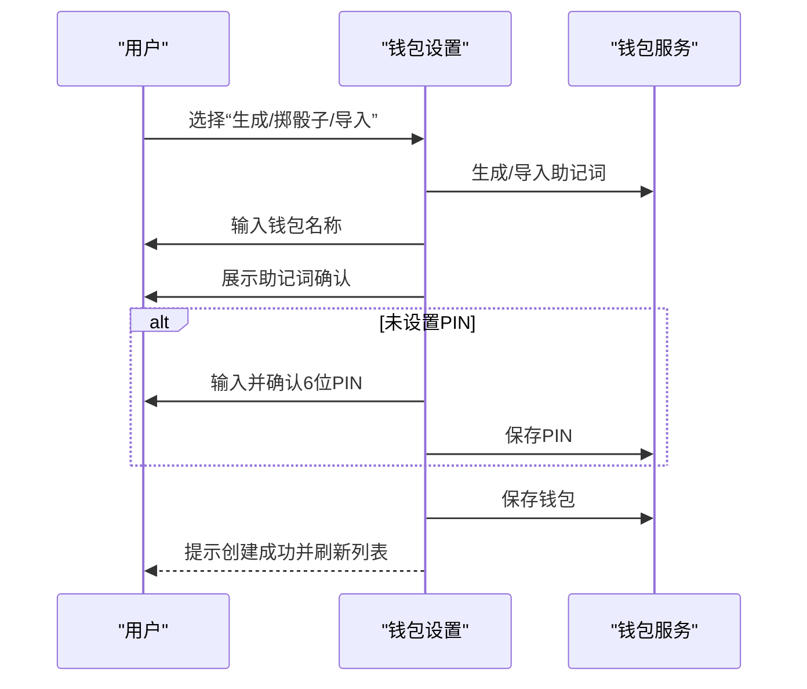
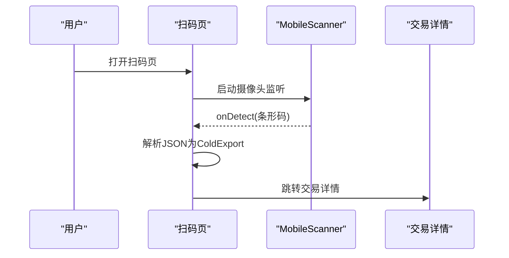
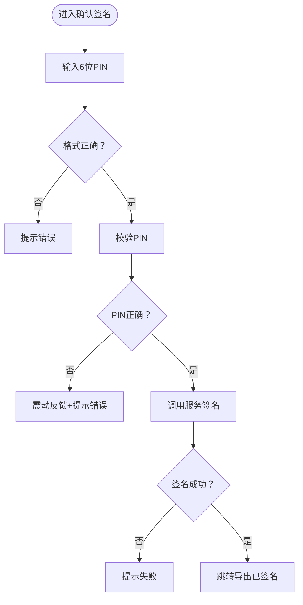
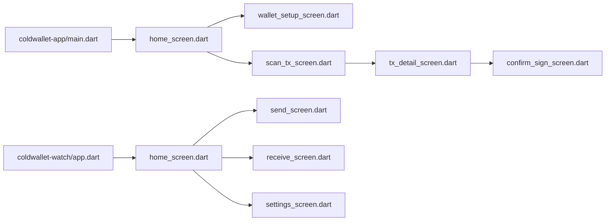

# 用户界面

<cite>
**本文引用的文件**
- [coldwallet-app/lib/main.dart](file://coldwallet-app/lib/main.dart)
- [coldwallet-app/lib/screens/home_screen.dart](file://coldwallet-app/lib/screens/home_screen.dart)
- [coldwallet-app/lib/screens/wallet_setup_screen.dart](file://coldwallet-app/lib/screens/wallet_setup_screen.dart)
- [coldwallet-app/lib/screens/scan_tx_screen.dart](file://coldwallet-app/lib/screens/scan_tx_screen.dart)
- [coldwallet-app/lib/screens/tx_detail_screen.dart](file://coldwallet-app/lib/screens/tx_detail_screen.dart)
- [coldwallet-app/lib/screens/confirm_sign_screen.dart](file://coldwallet-app/lib/screens/confirm_sign_screen.dart)
- [coldwallet-watch/lib/app.dart](file://coldwallet-watch/lib/app.dart)
- [coldwallet-watch/lib/screens/home_screen.dart](file://coldwallet-watch/lib/screens/home_screen.dart)
- [coldwallet-watch/lib/screens/send_screen.dart](file://coldwallet-watch/lib/screens/send_screen.dart)
- [coldwallet-watch/lib/screens/receive_screen.dart](file://coldwallet-watch/lib/screens/receive_screen.dart)
- [coldwallet-watch/lib/screens/settings_screen.dart](file://coldwallet-watch/lib/screens/settings_screen.dart)
- [coldwallet-watch/lib/widgets/qr_scanner.dart](file://coldwallet-watch/lib/widgets/qr_scanner.dart)
- [coldwallet-watch/lib/widgets/qr_display.dart](file://coldwallet-watch/lib/widgets/qr_display.dart)
</cite>

## 目录
1. [简介](#简介)
2. [项目结构](#项目结构)
3. [核心组件](#核心组件)
4. [架构总览](#架构总览)
5. [详细组件分析](#详细组件分析)
6. [依赖关系分析](#依赖关系分析)
7. [性能与可用性考虑](#性能与可用性考虑)
8. [故障排查指南](#故障排查指南)
9. [结论](#结论)
10. [附录：主题与自定义选项](#附录：主题与自定义选项)

## 简介
本文件面向 ColdWallet 的用户界面，覆盖冷钱包 App（离线签名）与观察钱包 App（联网只读）的主要界面与交互流程。重点说明钱包设置、交易签名、二维码扫描、发送交易、收款与设置等界面的布局、状态管理、响应式设计与跨屏导航，并提供使用示例、自定义选项与主题配置建议。

## 项目结构
两个 Flutter 应用共享相似的结构：入口定义 MaterialApp 与路由表；screens 下按功能组织页面；widgets 提供可复用的 UI 组件；services 负责数据与业务逻辑。冷钱包 App 侧重离线助记词管理与交易签名；观察钱包 App 侧重余额查询、交易构建与导出/导入签名。

图表来源
- [coldwallet-app/lib/main.dart:16-48](file://coldwallet-app/lib/main.dart#L16-L48)
- [coldwallet-watch/lib/app.dart:15-36](file://coldwallet-watch/lib/app.dart#L15-L36)

章节来源
- [coldwallet-app/lib/main.dart:16-48](file://coldwallet-app/lib/main.dart#L16-L48)
- [coldwallet-watch/lib/app.dart:15-36](file://coldwallet-watch/lib/app.dart#L15-L36)

## 核心组件
- 冷钱包 App
  - 首页：钱包选择器、网络切换、扫码签名、导入未签名交易、进入钱包管理。
  - 钱包设置：创建/导入助记词、查看地址与助记词、删除钱包、PIN 设置。
  - 扫码签名：摄像头扫描未签名交易二维码，解析后跳转交易详情。
  - 交易详情：展示网络、收发地址、金额、手续费，确认后进入签名。
  - 确认签名：输入 PIN 校验，调用服务完成离线签名并导出已签名交易。
- 观察钱包 App
  - 首页：钱包选择、地址复制、ADA 余额、资产列表、发送/收款入口、设置入口。
  - 发送交易：输入收款地址、选择资产与数量，构建未签名交易并跳转到导出页。
  - 收款：展示地址二维码与文本，支持复制。
  - 设置：配置 Blockfrost API Key，用于链上余额查询。

章节来源
- [coldwallet-app/lib/screens/home_screen.dart:12-179](file://coldwallet-app/lib/screens/home_screen.dart#L12-L179)
- [coldwallet-app/lib/screens/wallet_setup_screen.dart:8-136](file://coldwallet-app/lib/screens/wallet_setup_screen.dart#L8-L136)
- [coldwallet-app/lib/screens/scan_tx_screen.dart:9-88](file://coldwallet-app/lib/screens/scan_tx_screen.dart#L9-L88)
- [coldwallet-app/lib/screens/tx_detail_screen.dart:6-124](file://coldwallet-app/lib/screens/tx_detail_screen.dart#L6-L124)
- [coldwallet-app/lib/screens/confirm_sign_screen.dart:9-151](file://coldwallet-app/lib/screens/confirm_sign_screen.dart#L9-L151)
- [coldwallet-watch/lib/screens/home_screen.dart:11-197](file://coldwallet-watch/lib/screens/home_screen.dart#L11-L197)
- [coldwallet-watch/lib/screens/send_screen.dart:9-150](file://coldwallet-watch/lib/screens/send_screen.dart#L9-L150)
- [coldwallet-watch/lib/screens/receive_screen.dart:7-87](file://coldwallet-watch/lib/screens/receive_screen.dart#L7-L87)
- [coldwallet-watch/lib/screens/settings_screen.dart:5-90](file://coldwallet-watch/lib/screens/settings_screen.dart#L5-L90)

## 架构总览
冷钱包与观察钱包通过“未签名交易”和“已签名交易”的序列化数据进行协作：观察钱包构建未签名交易并以二维码或文件形式导出；冷钱包扫描或导入该数据，离线签名后再以二维码或文件导出；观察钱包导入已签名交易并提交到链上。

图表来源
- [coldwallet-watch/lib/screens/home_screen.dart:282-303](file://coldwallet-watch/lib/screens/home_screen.dart#L282-L303)
- [coldwallet-watch/lib/screens/send_screen.dart:38-75](file://coldwallet-watch/lib/screens/send_screen.dart#L38-L75)
- [coldwallet-app/lib/screens/scan_tx_screen.dart:23-47](file://coldwallet-app/lib/screens/scan_tx_screen.dart#L23-L47)
- [coldwallet-app/lib/screens/tx_detail_screen.dart:31-88](file://coldwallet-app/lib/screens/tx_detail_screen.dart#L31-L88)
- [coldwallet-app/lib/screens/confirm_sign_screen.dart:29-61](file://coldwallet-app/lib/screens/confirm_sign_screen.dart#L29-L61)

## 详细组件分析

### 冷钱包首页（HomeScreen）
- 布局与交互
  - 顶部标题栏含网络切换按钮，主区域为钱包选择卡片与三个主要操作：扫码签名、导入未签名交易、钱包管理。
  - 无钱包时引导创建第一个钱包；有钱包时支持切换当前钱包。
- 状态管理
  - 维护钱包列表、当前钱包、网络、加载状态；初始化时从服务加载数据并刷新 UI。
- 导航
  - 扫码签名跳转到扫码页；导入未签名交易通过文件或粘贴 JSON 解析后跳转到交易详情；钱包管理跳转到钱包设置页。
- 错误处理
  - 文件读取失败、JSON 解析失败均通过提示反馈。

图表来源
- [coldwallet-app/lib/screens/home_screen.dart:37-48](file://coldwallet-app/lib/screens/home_screen.dart#L37-L48)
- [coldwallet-app/lib/screens/home_screen.dart:107-179](file://coldwallet-app/lib/screens/home_screen.dart#L107-L179)
- [coldwallet-app/lib/screens/home_screen.dart:182-270](file://coldwallet-app/lib/screens/home_screen.dart#L182-L270)

章节来源
- [coldwallet-app/lib/screens/home_screen.dart:12-179](file://coldwallet-app/lib/screens/home_screen.dart#L12-L179)
- [coldwallet-app/lib/screens/home_screen.dart:182-270](file://coldwallet-app/lib/screens/home_screen.dart#L182-L270)

### 钱包设置（WalletSetupScreen）
- 功能
  - 新增钱包：生成助记词、掷骰子真随机熵、导入已有助记词。
  - 查看详情：展开查看地址与助记词，支持复制。
  - 删除钱包：二次确认后删除。
  - PIN 设置：首次创建时可选设置全局 PIN。
- 交互流程
  - 添加新钱包弹出底部表单；导入助记词需校验格式；命名后展示助记词确认；必要时设置 PIN；最终保存并刷新列表。
- 安全提示
  - 明确提示备份助记词，谨慎复制助记词。

图表来源
- [coldwallet-app/lib/screens/wallet_setup_screen.dart:86-169](file://coldwallet-app/lib/screens/wallet_setup_screen.dart#L86-L169)
- [coldwallet-app/lib/screens/wallet_setup_screen.dart:171-346](file://coldwallet-app/lib/screens/wallet_setup_screen.dart#L171-L346)

章节来源
- [coldwallet-app/lib/screens/wallet_setup_screen.dart:8-136](file://coldwallet-app/lib/screens/wallet_setup_screen.dart#L8-L136)
- [coldwallet-app/lib/screens/wallet_setup_screen.dart:171-346](file://coldwallet-app/lib/screens/wallet_setup_screen.dart#L171-L346)

### 二维码扫描（ScanTxScreen）
- 功能
  - 使用摄像头扫描未签名交易二维码，解析 JSON 为 ColdExport 后替换当前路由跳转至交易详情。
- 交互与容错
  - 防重复扫描；解析失败回退并提示错误。

图表来源
- [coldwallet-app/lib/screens/scan_tx_screen.dart:23-47](file://coldwallet-app/lib/screens/scan_tx_screen.dart#L23-L47)
- [coldwallet-app/lib/screens/scan_tx_screen.dart:49-88](file://coldwallet-app/lib/screens/scan_tx_screen.dart#L49-L88)

章节来源
- [coldwallet-app/lib/screens/scan_tx_screen.dart:9-88](file://coldwallet-app/lib/screens/scan_tx_screen.dart#L9-L88)

### 交易详情（TxDetailScreen）
- 功能
  - 展示网络、发送方、接收方、金额、手续费等信息；点击“确认并签名”进入签名流程。
- 格式化
  - ADA 与资产单位分别格式化显示。

章节来源
- [coldwallet-app/lib/screens/tx_detail_screen.dart:6-124](file://coldwallet-app/lib/screens/tx_detail_screen.dart#L6-L124)

### 确认签名（ConfirmSignScreen）
- 功能
  - 输入 6 位 PIN 进行校验，通过后调用服务对 ColdExport 进行离线签名，成功后跳转到导出已签名交易页。
- 交互
  - 输入框支持可见性切换；签名中禁用按钮并显示进度；错误通过提示反馈。

图表来源
- [coldwallet-app/lib/screens/confirm_sign_screen.dart:29-61](file://coldwallet-app/lib/screens/confirm_sign_screen.dart#L29-L61)
- [coldwallet-app/lib/screens/confirm_sign_screen.dart:79-151](file://coldwallet-app/lib/screens/confirm_sign_screen.dart#L79-L151)

章节来源
- [coldwallet-app/lib/screens/confirm_sign_screen.dart:9-151](file://coldwallet-app/lib/screens/confirm_sign_screen.dart#L9-L151)

### 观察钱包首页（HomeScreen）
- 功能
  - 钱包选择下拉菜单、地址行（支持复制）、ADA 余额、发送/收款按钮、资产列表、设置入口。
  - 支持下拉刷新；无钱包时引导添加；网络请求失败时提供重试与设置入口。
- 状态管理
  - 加载钱包与余额；根据 Blockfrost API Key 是否存在决定能否查询余额。

章节来源
- [coldwallet-watch/lib/screens/home_screen.dart:11-197](file://coldwallet-watch/lib/screens/home_screen.dart#L11-L197)
- [coldwallet-watch/lib/screens/home_screen.dart:199-397](file://coldwallet-watch/lib/screens/home_screen.dart#L199-L397)

### 发送交易（SendScreen）
- 功能
  - 输入收款地址、选择资产与数量，构建未签名交易后跳转到导出页。
- 校验
  - 地址与金额非空；不能转账给自己；构建失败提示错误。

章节来源
- [coldwallet-watch/lib/screens/send_screen.dart:9-150](file://coldwallet-watch/lib/screens/send_screen.dart#L9-L150)

### 收款（ReceiveScreen）
- 功能
  - 展示地址二维码与完整地址文本，支持复制到剪贴板；提示仅接收对应网络的资产。

章节来源
- [coldwallet-watch/lib/screens/receive_screen.dart:7-87](file://coldwallet-watch/lib/screens/receive_screen.dart#L7-L87)

### 设置（SettingsScreen）
- 功能
  - 显示固定网络信息；提供 Blockfrost API Key 输入与保存；保存后提示成功。

章节来源
- [coldwallet-watch/lib/screens/settings_screen.dart:5-90](file://coldwallet-watch/lib/screens/settings_screen.dart#L5-L90)

### 二维码组件（QRScanner / QRDisplay）
- QRScanner：封装摄像头扫描，回调原始字符串。
- QRDisplay：统一尺寸与背景色的二维码显示组件。

章节来源
- [coldwallet-watch/lib/widgets/qr_scanner.dart:1-26](file://coldwallet-watch/lib/widgets/qr_scanner.dart#L1-L26)
- [coldwallet-watch/lib/widgets/qr_display.dart:1-18](file://coldwallet-watch/lib/widgets/qr_display.dart#L1-L18)

## 依赖关系分析
- 冷钱包 App
  - main.dart 注册路由并配置 Material3 主题。
  - home_screen.dart 依赖 WalletService 获取钱包与网络状态；依赖 FilePicker 与 mobile_scanner。
  - wallet_setup_screen.dart 依赖 WalletService 进行助记词生成/导入、PIN 管理、钱包增删改查。
  - scan_tx_screen.dart 依赖 mobile_scanner 与 ColdExport 模型。
  - tx_detail_screen.dart 展示 ColdExport 摘要并导航到 ConfirmSignScreen。
  - confirm_sign_screen.dart 依赖 TransactionService 与 WalletService 完成签名。
- 观察钱包 App
  - app.dart 注册路由并配置主题。
  - home_screen.dart 依赖 StorageService、BlockfrostService、AssetService、WalletService 加载余额与资产。
  - send_screen.dart 依赖 TxBuilderService 构建未签名交易。
  - receive_screen.dart 使用 qr_flutter 展示地址二维码。
  - settings_screen.dart 通过 StorageService 保存 API Key。

图表来源
- [coldwallet-app/lib/main.dart:16-48](file://coldwallet-app/lib/main.dart#L16-L48)
- [coldwallet-watch/lib/app.dart:15-36](file://coldwallet-watch/lib/app.dart#L15-L36)

章节来源
- [coldwallet-app/lib/main.dart:16-48](file://coldwallet-app/lib/main.dart#L16-L48)
- [coldwallet-watch/lib/app.dart:15-36](file://coldwallet-watch/lib/app.dart#L15-L36)

## 性能与可用性考虑
- 首屏加载
  - 冷钱包首页在 initState 中异步加载钱包与网络状态，避免阻塞渲染；观察钱包首页通过 addPostFrameCallback 延迟加载余额，提升首帧速度。
- 列表与滚动
  - 观察钱包资产列表使用 ListView.separated 与 NeverScrollableScrollPhysics 嵌套在 SingleChildScrollView，减少不必要的重绘。
- 网络请求
  - 观察钱包首页在缺少 API Key 时提前返回并提示设置，避免无效请求；错误状态提供重试与设置入口。
- 输入与反馈
  - 关键操作（如签名、构建交易）使用禁用按钮与进度指示；错误通过 SnackBar 即时反馈。
- 响应式设计
  - 使用 SafeArea、Padding 与自适应布局；二维码大小与字体在不同屏幕下保持可读性。

[本节为通用指导，不直接分析具体文件]

## 故障排查指南
- 无法解析二维码
  - 现象：扫码后提示无法解析。
  - 原因：二维码内容不是有效的 ColdExport JSON。
  - 处理：检查观察钱包导出的交易数据是否正确；重新生成二维码。
  - 参考实现位置：[coldwallet-app/lib/screens/scan_tx_screen.dart:32-47](file://coldwallet-app/lib/screens/scan_tx_screen.dart#L32-L47)
- 导入未签名交易失败
  - 现象：粘贴 JSON 或导入文件后提示解析失败。
  - 原因：JSON 格式错误或字段缺失。
  - 处理：核对导出格式；确保来自同一网络与钱包上下文。
  - 参考实现位置：[coldwallet-app/lib/screens/home_screen.dart:249-270](file://coldwallet-app/lib/screens/home_screen.dart#L249-L270)
- 余额为空或报错
  - 现象：首页显示“暂无资产”或错误提示。
  - 原因：未设置 Blockfrost API Key 或网络异常。
  - 处理：前往设置配置 API Key；重试加载。
  - 参考实现位置：[coldwallet-watch/lib/screens/home_screen.dart:70-107](file://coldwallet-watch/lib/screens/home_screen.dart#L70-L107)
- 签名失败
  - 现象：确认签名后提示失败。
  - 原因：PIN 错误或服务异常。
  - 处理：检查 PIN；重试签名。
  - 参考实现位置：[coldwallet-app/lib/screens/confirm_sign_screen.dart:29-61](file://coldwallet-app/lib/screens/confirm_sign_screen.dart#L29-L61)

章节来源
- [coldwallet-app/lib/screens/scan_tx_screen.dart:32-47](file://coldwallet-app/lib/screens/scan_tx_screen.dart#L32-L47)
- [coldwallet-app/lib/screens/home_screen.dart:249-270](file://coldwallet-app/lib/screens/home_screen.dart#L249-L270)
- [coldwallet-watch/lib/screens/home_screen.dart:70-107](file://coldwallet-watch/lib/screens/home_screen.dart#L70-L107)
- [coldwallet-app/lib/screens/confirm_sign_screen.dart:29-61](file://coldwallet-app/lib/screens/confirm_sign_screen.dart#L29-L61)

## 结论
本界面体系将冷钱包与观察钱包的职责清晰分离：观察钱包负责联网与交易构建，冷钱包专注离线签名与安全存储。通过二维码与文件作为数据载体，形成安全的闭环流程。界面遵循 Material3 设计语言，提供清晰的导航、明确的反馈与良好的可用性。后续可在主题定制、无障碍与多语言方面进一步增强。

[本节为总结性内容，不直接分析具体文件]

## 附录：主题与自定义选项
- 冷钱包 App 主题
  - 使用 Material3，基于种子色 blueGrey 生成亮/暗主题；可通过 ThemeData 扩展颜色、字体与组件样式。
  - 参考位置：[coldwallet-app/lib/main.dart:28-41](file://coldwallet-app/lib/main.dart#L28-L41)
- 观察钱包 App 主题
  - 使用 Material3，基于种子色 blue 生成主题；可通过 ThemeData 调整颜色方案与组件外观。
  - 参考位置：[coldwallet-watch/lib/app.dart:23-26](file://coldwallet-watch/lib/app.dart#L23-L26)
- 自定义建议
  - 品牌色：在 ColorScheme.fromSeed 中更换 seedColor 以匹配品牌。
  - 组件风格：统一 ElevatedButton、FilledButton、Card 的圆角与阴影。
  - 可访问性：确保对比度达标，提供语义化标签与键盘导航支持。

章节来源
- [coldwallet-app/lib/main.dart:28-41](file://coldwallet-app/lib/main.dart#L28-L41)
- [coldwallet-watch/lib/app.dart:23-26](file://coldwallet-watch/lib/app.dart#L23-L26)