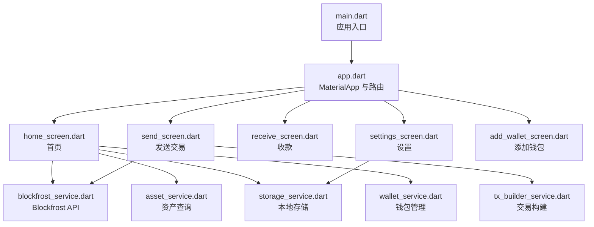
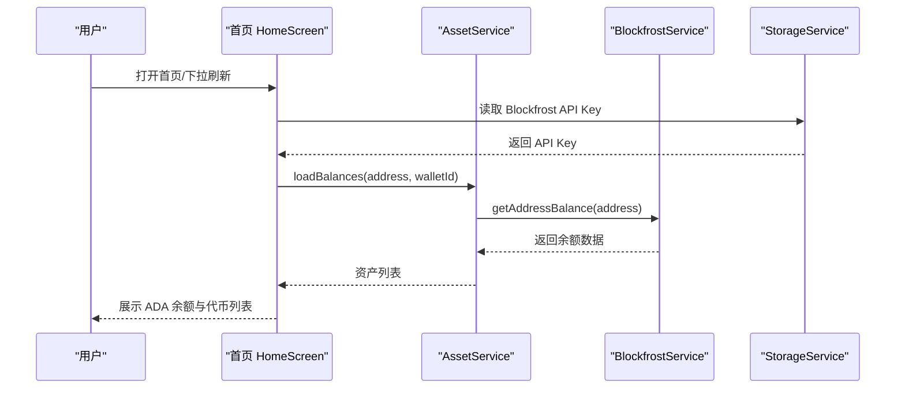
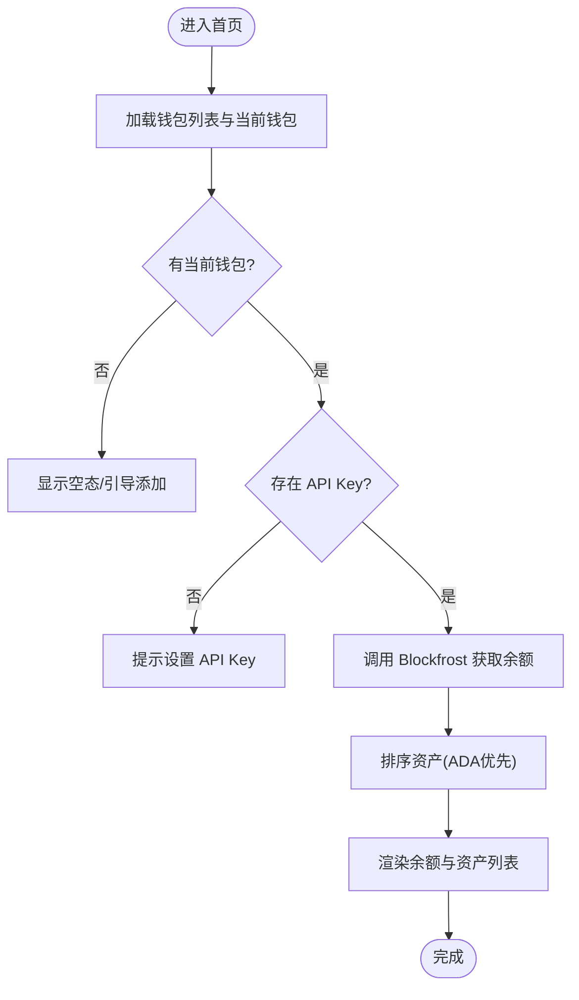
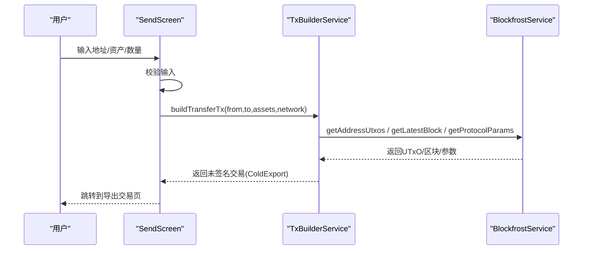
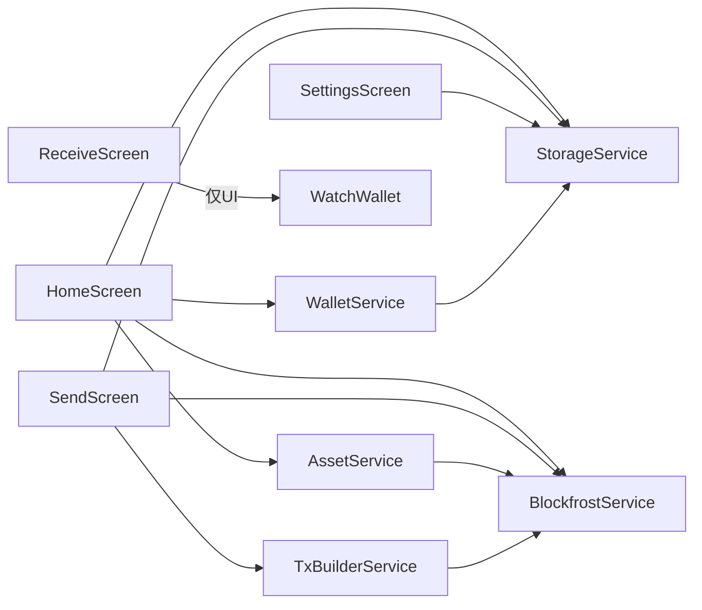

# 观察钱包界面

<cite>
**本文引用的文件**
- [main.dart](file://coldwallet-watch/lib/main.dart)
- [app.dart](file://coldwallet-watch/lib/app.dart)
- [home_screen.dart](file://coldwallet-watch/lib/screens/home_screen.dart)
- [send_screen.dart](file://coldwallet-watch/lib/screens/send_screen.dart)
- [receive_screen.dart](file://coldwallet-watch/lib/screens/receive_screen.dart)
- [settings_screen.dart](file://coldwallet-watch/lib/screens/settings_screen.dart)
- [add_wallet_screen.dart](file://coldwallet-watch/lib/screens/add_wallet_screen.dart)
- [blockfrost_service.dart](file://coldwallet-watch/lib/services/blockfrost_service.dart)
- [asset_service.dart](file://coldwallet-watch/lib/services/asset_service.dart)
- [tx_builder_service.dart](file://coldwallet-watch/lib/services/tx_builder_service.dart)
- [storage_service.dart](file://coldwallet-watch/lib/services/storage_service.dart)
- [wallet_service.dart](file://coldwallet-watch/lib/services/wallet_service.dart)
- [watch_wallet.dart](file://coldwallet-watch/lib/models/watch_wallet.dart)
- [asset_balance.dart](file://coldwallet-watch/lib/models/asset_balance.dart)
</cite>

## 目录
1. [简介](#简介)
2. [项目结构](#项目结构)
3. [核心组件](#核心组件)
4. [架构总览](#架构总览)
5. [详细组件分析](#详细组件分析)
6. [依赖关系分析](#依赖关系分析)
7. [性能考虑](#性能考虑)
8. [故障排查指南](#故障排查指南)
9. [结论](#结论)
10. [附录](#附录)

## 简介
本文件面向“观察钱包”联网端（只读）的用户界面，重点覆盖以下主要界面：首页、发送交易界面、收款界面、设置界面与添加钱包界面。文档将详细说明各界面的功能特性、网络请求处理、数据展示方式、用户操作流程、状态管理、错误处理机制、加载状态显示、网络异常处理、主题定制选项与响应式实现，并解释与 Blockfrost API 的集成方式和实时数据更新机制。

## 项目结构
应用采用 Flutter Material3 路由组织页面，入口 main.dart 启动 ColdWalletWatchApp；app.dart 定义根路由表与各页面映射；screens 下为各业务页面；services 提供 Blockfrost 网络服务、资产查询、交易构建、本地存储与钱包管理；models 定义钱包与资产余额等数据结构。

图表来源
- [main.dart:1-12](file://coldwallet-watch/lib/main.dart#L1-L12)
- [app.dart:1-40](file://coldwallet-watch/lib/app.dart#L1-L40)
- [home_screen.dart:1-434](file://coldwallet-watch/lib/screens/home_screen.dart#L1-L434)
- [send_screen.dart:1-150](file://coldwallet-watch/lib/screens/send_screen.dart#L1-L150)
- [receive_screen.dart:1-87](file://coldwallet-watch/lib/screens/receive_screen.dart#L1-L87)
- [settings_screen.dart:1-90](file://coldwallet-watch/lib/screens/settings_screen.dart#L1-L90)
- [add_wallet_screen.dart:1-118](file://coldwallet-watch/lib/screens/add_wallet_screen.dart#L1-L118)
- [blockfrost_service.dart:1-109](file://coldwallet-watch/lib/services/blockfrost_service.dart#L1-L109)
- [asset_service.dart:1-49](file://coldwallet-watch/lib/services/asset_service.dart#L1-L49)
- [tx_builder_service.dart:1-152](file://coldwallet-watch/lib/services/tx_builder_service.dart#L1-L152)
- [storage_service.dart:1-87](file://coldwallet-watch/lib/services/storage_service.dart#L1-L87)
- [wallet_service.dart:1-88](file://coldwallet-watch/lib/services/wallet_service.dart#L1-L88)

章节来源
- [main.dart:1-12](file://coldwallet-watch/lib/main.dart#L1-L12)
- [app.dart:1-40](file://coldwallet-watch/lib/app.dart#L1-L40)

## 核心组件
- 首页（HomeScreen）：展示当前钱包地址、ADA 余额、资产列表，支持下拉刷新、复制地址、切换钱包、跳转设置与发送/收款。
- 发送交易（SendScreen）：输入收款地址、选择资产与数量，调用交易构建服务生成未签名交易后跳转到导出页。
- 收款（ReceiveScreen）：展示地址二维码与文本，支持复制地址，提示仅接收对应网络资产。
- 设置（SettingsScreen）：配置 Blockfrost API Key，固定网络为 Preview 测试网。
- 添加钱包（AddWalletScreen）：输入名称与 Cardano 地址，校验格式后保存至本地存储。

章节来源
- [home_screen.dart:11-434](file://coldwallet-watch/lib/screens/home_screen.dart#L11-L434)
- [send_screen.dart:9-150](file://coldwallet-watch/lib/screens/send_screen.dart#L9-L150)
- [receive_screen.dart:7-87](file://coldwallet-watch/lib/screens/receive_screen.dart#L7-L87)
- [settings_screen.dart:5-90](file://coldwallet-watch/lib/screens/settings_screen.dart#L5-L90)
- [add_wallet_screen.dart:6-118](file://coldwallet-watch/lib/screens/add_wallet_screen.dart#L6-L118)

## 架构总览
界面层通过服务层访问 Blockfrost REST API 获取链上数据，使用本地存储服务持久化钱包与设置。交易构建在联网端完成参数准备与费用估算，最终输出未签名交易供冷端签名。

图表来源
- [home_screen.dart:70-107](file://coldwallet-watch/lib/screens/home_screen.dart#L70-L107)
- [asset_service.dart:14-36](file://coldwallet-watch/lib/services/asset_service.dart#L14-L36)
- [blockfrost_service.dart:56-66](file://coldwallet-watch/lib/services/blockfrost_service.dart#L56-L66)
- [storage_service.dart:62-70](file://coldwallet-watch/lib/services/storage_service.dart#L62-L70)

## 详细组件分析

### 首页（HomeScreen）
- 功能特性
  - 钱包选择器：下拉切换当前钱包，或进入添加钱包。
  - 地址展示与复制：短地址显示，一键复制完整地址。
  - ADA 余额与资产列表：按 ADA 优先排序，其他资产按名称排序。
  - 操作按钮：发送、收款快捷入口。
  - 下拉刷新：重新加载余额与资产。
- 网络请求处理
  - 从本地存储读取 Blockfrost API Key，构造 BlockfrostService 与 AssetService 查询余额。
  - 若未设置 API Key，直接提示前往设置。
- 数据展示方式
  - 使用 RefreshIndicator 包裹可滚动内容；资产列表使用 ListView.separated。
  - ADA 余额格式化显示，非 ADA 显示单位与数量。
- 用户操作流程
  - 首次无钱包时显示空态引导添加；添加后自动刷新。
  - 切换钱包后重新加载余额。
- 状态管理与错误处理
  - _loading/_error 控制加载与错误视图；异步回调中检查 mounted 避免状态更新。
  - 错误视图提供“去设置”和“重试”操作。
- 主题与响应式
  - 使用 Material3 主题色；按钮与卡片使用 surfaceContainerHighest 提升可读性。
  - 布局使用 Column + Expanded + SingleChildScrollView 适配不同屏幕尺寸。

图表来源
- [home_screen.dart:36-107](file://coldwallet-watch/lib/screens/home_screen.dart#L36-L107)
- [home_screen.dart:148-197](file://coldwallet-watch/lib/screens/home_screen.dart#L148-L197)
- [home_screen.dart:351-397](file://coldwallet-watch/lib/screens/home_screen.dart#L351-L397)

章节来源
- [home_screen.dart:11-434](file://coldwallet-watch/lib/screens/home_screen.dart#L11-L434)

### 发送交易（SendScreen）
- 功能特性
  - 输入收款地址、选择资产（MVP 仅支持 ADA）、输入数量。
  - 构建未签名交易后跳转到导出页。
- 网络请求处理
  - 读取 Blockfrost API Key，构造 BlockfrostService。
  - 调用 TxBuilderService.buildTransferTx 进行 UTxO 选择、费用估算与交易体构建。
- 数据展示方式
  - 表单输入与下拉选择；构建过程中显示加载指示器。
- 用户操作流程
  - 校验地址与金额非空且不能转给自己；成功后导航到导出交易页。
- 状态管理与错误处理
  - _building 控制按钮禁用与加载指示；错误以 SnackBar 提示。
- 主题与响应式
  - 使用 Material3 填充按钮与输入框样式；全宽按钮适配移动端。

图表来源
- [send_screen.dart:38-75](file://coldwallet-watch/lib/screens/send_screen.dart#L38-L75)
- [tx_builder_service.dart:11-118](file://coldwallet-watch/lib/services/tx_builder_service.dart#L11-L118)
- [blockfrost_service.dart:43-90](file://coldwallet-watch/lib/services/blockfrost_service.dart#L43-L90)

章节来源
- [send_screen.dart:9-150](file://coldwallet-watch/lib/screens/send_screen.dart#L9-L150)
- [tx_builder_service.dart:1-152](file://coldwallet-watch/lib/services/tx_builder_service.dart#L1-152)

### 收款（ReceiveScreen）
- 功能特性
  - 展示地址二维码与完整地址文本，提示仅接收对应网络资产。
  - 支持复制地址到剪贴板。
- 数据展示方式
  - 使用 QrImageView 显示二维码；SelectableText 便于长按复制。
- 用户操作流程
  - 从首页传入 WatchWallet；展示二维码与地址；点击复制按钮反馈成功。
- 主题与响应式
  - 使用主题色容器背景；居中布局适配不同屏幕。

章节来源
- [receive_screen.dart:7-87](file://coldwallet-watch/lib/screens/receive_screen.dart#L7-L87)

### 设置（SettingsScreen）
- 功能特性
  - 显示当前网络（固定为 Preview 测试网）。
  - 配置 Blockfrost API Key，保存到安全存储。
- 网络请求处理
  - 读取/写入本地安全存储；不发起网络请求。
- 数据展示方式
  - 表单输入与保存按钮；保存后显示成功提示。
- 用户操作流程
  - 输入 API Key -> 保存 -> 返回首页或继续操作。
- 主题与响应式
  - 使用 Material3 标题与输入框样式；全宽保存按钮。

章节来源
- [settings_screen.dart:5-90](file://coldwallet-watch/lib/screens/settings_screen.dart#L5-L90)
- [storage_service.dart:62-74](file://coldwallet-watch/lib/services/storage_service.dart#L62-L74)

### 添加钱包（AddWalletScreen）
- 功能特性
  - 输入钱包名称与 Cardano 地址，校验格式后保存。
- 网络请求处理
  - 仅本地存储；不涉及网络请求。
- 数据展示方式
  - 表单输入与保存按钮；保存失败显示错误提示。
- 用户操作流程
  - 填写信息 -> 保存 -> 返回上一页并触发刷新。
- 主题与响应式
  - 使用 Material3 输入框与填充按钮；全宽布局。

章节来源
- [add_wallet_screen.dart:6-118](file://coldwallet-watch/lib/screens/add_wallet_screen.dart#L6-L118)
- [wallet_service.dart:37-52](file://coldwallet-watch/lib/services/wallet_service.dart#L37-L52)

## 依赖关系分析
- 页面与服务耦合
  - HomeScreen 依赖 WalletService、AssetService、BlockfrostService、StorageService。
  - SendScreen 依赖 TxBuilderService、BlockfrostService、StorageService。
  - SettingsScreen 依赖 StorageService。
  - ReceiveScreen 仅依赖 UI 库与模型。
- 服务间依赖
  - AssetService 依赖 BlockfrostService 与 StorageService。
  - TxBuilderService 依赖 BlockfrostService。
  - WalletService 依赖 StorageService。
- 模型
  - WatchWallet 表示只读钱包元数据。
  - AssetBalance 表示单一资产的余额与显示信息。

图表来源
- [home_screen.dart:1-10](file://coldwallet-watch/lib/screens/home_screen.dart#L1-L10)
- [send_screen.dart:1-8](file://coldwallet-watch/lib/screens/send_screen.dart#L1-L8)
- [receive_screen.dart:1-6](file://coldwallet-watch/lib/screens/receive_screen.dart#L1-L6)
- [settings_screen.dart:1-4](file://coldwallet-watch/lib/screens/settings_screen.dart#L1-L4)
- [asset_service.dart:1-12](file://coldwallet-watch/lib/services/asset_service.dart#L1-L12)
- [tx_builder_service.dart:1-9](file://coldwallet-watch/lib/services/tx_builder_service.dart#L1-L9)
- [wallet_service.dart:1-10](file://coldwallet-watch/lib/services/wallet_service.dart#L1-L10)

章节来源
- [home_screen.dart:1-10](file://coldwallet-watch/lib/screens/home_screen.dart#L1-L10)
- [send_screen.dart:1-8](file://coldwallet-watch/lib/screens/send_screen.dart#L1-L8)
- [asset_service.dart:1-12](file://coldwallet-watch/lib/services/asset_service.dart#L1-L12)
- [tx_builder_service.dart:1-9](file://coldwallet-watch/lib/services/tx_builder_service.dart#L1-L9)
- [wallet_service.dart:1-10](file://coldwallet-watch/lib/services/wallet_service.dart#L1-L10)

## 性能考虑
- 网络请求
  - 首页仅在需要时调用 Blockfrost 余额接口；下拉刷新按需触发。
  - 交易构建前获取协议参数与最新区块，用于 TTL 与费用估算。
- 数据排序与渲染
  - 资产列表先按 ADA 优先再按名称排序，减少重排开销。
  - 使用 ListView.separated 优化长列表渲染。
- 内存与状态
  - 异步回调中使用 mounted 检查，避免无效 setState。
  - 大对象（如 CBOR 字节）仅在必要时传递。

[本节为通用性能建议，不直接分析具体文件]

## 故障排查指南
- 常见错误与处理
  - 未设置 Blockfrost API Key：首页提示“请先设置 Blockfrost API Key”，并提供“去设置”入口。
  - 网络异常：BlockfrostService 对非 200 状态码抛出异常，界面捕获后显示错误信息与重试。
  - 余额不足：交易构建阶段检测到余额不足以覆盖转账金额、手续费与最小 UTxO，抛出异常并在发送页提示。
  - 地址无效：添加钱包时使用 WalletService.validateAddress 校验 bech32 前缀与长度。
- 调试建议
  - 检查本地安全存储是否包含有效的 API Key。
  - 确认网络可达性与 Blockfrost 服务状态。
  - 查看日志中的异常消息定位问题。

章节来源
- [home_screen.dart:70-107](file://coldwallet-watch/lib/screens/home_screen.dart#L70-L107)
- [blockfrost_service.dart:43-107](file://coldwallet-watch/lib/services/blockfrost_service.dart#L43-L107)
- [tx_builder_service.dart:11-58](file://coldwallet-watch/lib/services/tx_builder_service.dart#L11-L58)
- [wallet_service.dart:76-86](file://coldwallet-watch/lib/services/wallet_service.dart#L76-L86)

## 结论
观察钱包界面围绕“只读”与“联网”两大特性设计：首页负责资产展示与交互入口，发送交易界面负责构建未签名交易，收款界面提供地址二维码，设置界面管理 Blockfrost API Key。整体通过服务层封装网络与存储，保证界面简洁、状态清晰、错误可见。后续可扩展多资产发送、更多网络支持与更精细的费用估算。

[本节为总结性内容，不直接分析具体文件]

## 附录

### 界面组件使用示例
- 首页
  - 下拉刷新：触发 _load 重新加载钱包与余额。
  - 复制地址：调用系统剪贴板并显示提示。
  - 切换钱包：通过下拉选择切换当前钱包并刷新。
- 发送交易
  - 输入收款地址与数量，选择资产（MVP 仅 ADA），点击“下一步”构建交易。
- 收款
  - 展示二维码与地址，点击复制按钮复制地址。
- 设置
  - 输入 Blockfrost API Key 并保存，随后返回首页即可使用。
- 添加钱包
  - 输入名称与地址，保存后返回上一页并刷新。

章节来源
- [home_screen.dart:109-131](file://coldwallet-watch/lib/screens/home_screen.dart#L109-L131)
- [send_screen.dart:38-75](file://coldwallet-watch/lib/screens/send_screen.dart#L38-L75)
- [receive_screen.dart:60-76](file://coldwallet-watch/lib/screens/receive_screen.dart#L60-L76)
- [settings_screen.dart:38-45](file://coldwallet-watch/lib/screens/settings_screen.dart#L38-L45)
- [add_wallet_screen.dart:38-63](file://coldwallet-watch/lib/screens/add_wallet_screen.dart#L38-L63)

### 主题定制选项
- 使用 Material3 主题：ColorScheme.fromSeed(seedColor: Colors.blue)，useMaterial3: true。
- 统一使用 surfaceContainerHighest 作为卡片背景，提升对比度。
- 可通过 ThemeData 扩展自定义颜色与字体以适配品牌风格。

章节来源
- [app.dart:20-26](file://coldwallet-watch/lib/app.dart#L20-L26)

### 响应式设计实现
- 使用 SafeArea 确保内容不被系统区域遮挡。
- 使用 Column + Expanded + SingleChildScrollView 组合实现自适应滚动。
- 按钮与输入框使用全宽布局，适配不同屏幕宽度。

章节来源
- [home_screen.dart:148-197](file://coldwallet-watch/lib/screens/home_screen.dart#L148-L197)
- [receive_screen.dart:23-84](file://coldwallet-watch/lib/screens/receive_screen.dart#L23-L84)
- [settings_screen.dart:53-87](file://coldwallet-watch/lib/screens/settings_screen.dart#L53-L87)
- [add_wallet_screen.dart:72-115](file://coldwallet-watch/lib/screens/add_wallet_screen.dart#L72-L115)

### 与 Blockfrost API 的集成与实时数据更新
- 集成方式
  - BlockfrostEndpoint 提供 mainnet/preprod/preview 基础 URL。
  - BlockfrostService 封装地址余额、UTxO、最新区块、协议参数与交易提交。
  - 首页通过 AssetService 调用 BlockfrostService 获取余额，结合本地启用资产列表展示。
- 实时数据更新
  - 首页支持下拉刷新，重新加载余额与资产列表。
  - 切换钱包后自动刷新当前钱包余额。
  - 交易构建阶段获取最新区块与协议参数，确保 TTL 与费用估算准确。

章节来源
- [blockfrost_service.dart:6-109](file://coldwallet-watch/lib/services/blockfrost_service.dart#L6-L109)
- [asset_service.dart:14-36](file://coldwallet-watch/lib/services/asset_service.dart#L14-L36)
- [home_screen.dart:70-107](file://coldwallet-watch/lib/screens/home_screen.dart#L70-L107)
- [tx_builder_service.dart:23-37](file://coldwallet-watch/lib/services/tx_builder_service.dart#L23-L37)